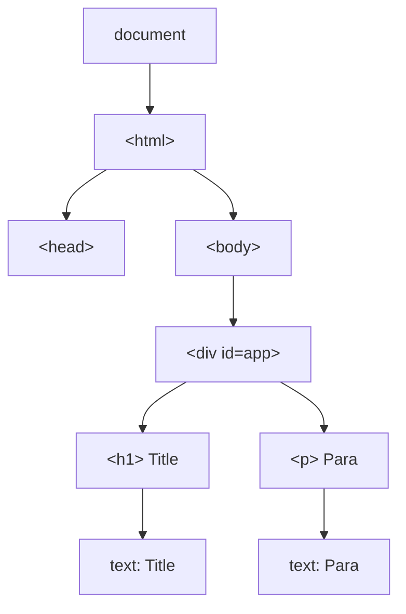
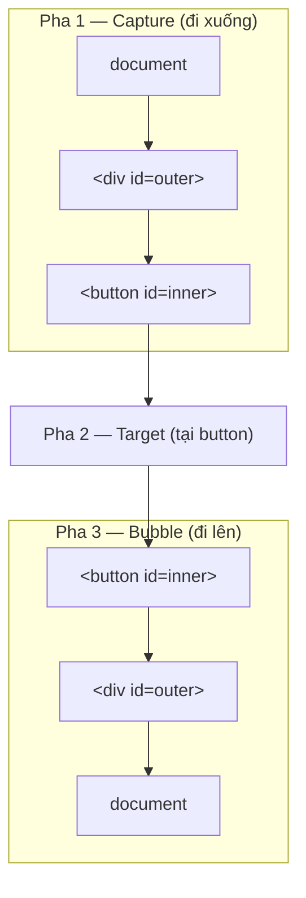

# DOM Manipulation và Events

**DOM** (Document Object Model — cây cấu trúc biểu diễn toàn bộ các phần tử của một trang web) là cầu nối giúp JavaScript đọc và thay đổi nội dung, kiểu dáng của trang. **DOM Manipulation** (thao tác DOM) là việc dùng JavaScript để chọn, thêm, sửa hoặc xóa các phần tử HTML. **Events** (sự kiện) là các hành động của người dùng như nhấp chuột hay gõ phím, và bạn dùng **event listener** (bộ lắng nghe sự kiện) để chạy code phản hồi lại những hành động đó.

[](pathname:///img/javascript/dom.webp)

---

:::note[Ghi nhớ nhanh]

- ⭐ **DOM là cây object** — trình duyệt biến HTML tĩnh thành cây `node` mà JavaScript đọc/sửa được, nhờ đó có trang động và SPA không cần reload.
- **Selectors** — `querySelector`/`querySelectorAll` (hỗ trợ CSS selector) là lựa chọn ưu tiên; `getElementsBy*` trả về collection **live** tự cập nhật nhưng chậm hơn.
- ⭐ **`textContent` an toàn, `innerHTML` gây XSS** — với input người dùng luôn dùng `textContent` hoặc sanitize (`DOMPurify`) trước khi gán `innerHTML`.
- **Event listener** — `addEventListener` với các options `once`/`capture`/`passive`/`signal`; dùng `AbortController` để hủy nhiều listener cùng lúc.
- **3 pha của event** — capture → target → bubble; `stopPropagation()` chặn lan toả, `preventDefault()` chặn hành vi mặc định.
- **Event delegation** — gắn 1 listener ở parent xử lý cho nhiều children, ít memory hơn và tự chạy với element thêm động (chính là cơ chế React dùng dưới hood).

:::

---

## Mục lục

- [Vì sao có DOM API?](#vì-sao-có-dom-api)
- [DOM là gì?](#dom-là-gì)
- [Selectors](#selectors)
- [DOM Manipulation](#dom-manipulation)
- [Event Listeners](#event-listeners)
- [Event Bubbling và Capturing](#event-bubbling-và-capturing)
- [Event Delegation](#event-delegation)
- [Câu hỏi phỏng vấn](#câu-hỏi-phỏng-vấn)

---

## Vì sao có DOM API?

**Vấn đề:** HTML viết ra là **tĩnh** — render xong là cố định. Nhưng ta
muốn nội dung trang **thay đổi** theo tương tác: bấm nút, gõ vào ô input,
dữ liệu mới fetch về... mà **không tải lại cả trang**. Bản thân HTML không
cho JavaScript "với tới" để sửa.

```html
<!-- HTML chỉ là văn bản tĩnh, không tự đổi được -->
<button>Tăng</button>
<span>Số lượng: 0</span>
<!-- Bấm nút thì làm sao đổi "0" thành "1"? -->
```

**Giải pháp:** Trình duyệt biểu diễn trang HTML thành **DOM** (Document
Object Model) — một **cây object** mà JavaScript đọc và sửa được. Nhờ đó
có trang web động và SPA.

```js
const span = document.querySelector("span"); // chọn phần tử
let count = 0;

document.querySelector("button").addEventListener("click", () => {
  count += 1;
  span.textContent = `Số lượng: ${count}`; // sửa nội dung, không reload
});
```

Qua DOM, JS có thể: **chọn** phần tử (`querySelector`), **đổi** nội
dung/thuộc tính, **thêm/xoá** node, và **lắng nghe** sự kiện
(`addEventListener`).

:::tip[Dùng thực tế]

- **Cập nhật UI khi bấm nút**: đổi text, ẩn/hiện, bật/tắt class.
- **Hiển thị dữ liệu fetch về**: render danh sách sau khi gọi API.
- **Validate & hiện lỗi form**: kiểm tra input rồi chèn thông báo lỗi.
- **Tạo/xoá phần tử động**: thêm hoặc bỏ item trong todo list.

:::

---

## DOM là gì?

**DOM (Document Object Model)** là cấu trúc cây mà trình duyệt tạo ra
từ HTML — mỗi thẻ là một **node**.

```html
<div id="app">
  <h1>Title</h1>
  <p>Para</p>
</div>
```

Trình duyệt biến HTML trên thành **cây node**: `document` là gốc, mỗi thẻ
là một element node, còn chữ bên trong là text node — JavaScript đi lại và
sửa từng node trên cây này:



JavaScript truy cập DOM qua `document`:

```js
document.title;
document.body;
document.documentElement; // <html>
```

---

## Selectors

API tìm element trong DOM:

```js
// Tìm 1 element
document.getElementById("app");
document.querySelector("#app");
document.querySelector(".btn.primary");
document.querySelector("ul > li:first-child");

// Tìm nhiều element
document.querySelectorAll(".btn");          // NodeList
document.getElementsByClassName("btn");     // HTMLCollection (live)
document.getElementsByTagName("li");        // HTMLCollection (live)
```

| API | Trả về | Live? | Hỗ trợ CSS selector |
|-----|--------|-------|---------------------|
| `getElementById` | Element \| null | - | Không |
| `getElementsByClassName` | HTMLCollection | **Có** | Không |
| `getElementsByTagName` | HTMLCollection | **Có** | Không |
| `querySelector` | Element \| null | - | **Có** |
| `querySelectorAll` | NodeList | Không | **Có** |

:::info[Phân tích]

**Live vs Static collection**:

- **Live** (`getElementsBy*`): tự cập nhật khi DOM thay đổi.
- **Static** (`querySelectorAll`): chụp ảnh tại thời điểm gọi.

```js
const items = document.getElementsByClassName("item");
console.log(items.length); // 3

document.body.appendChild(newItem); // thêm 1 item

console.log(items.length); // 4 — tự cập nhật

const items2 = document.querySelectorAll(".item");
// items2.length vẫn = 3 dù DOM thay đổi
```

Live collection thuận tiện nhưng **chậm hơn** vì phải invalidate cache.
Trong code mới, hầu như chỉ dùng `querySelector`/`querySelectorAll` để
tránh nhầm.

:::

---

## DOM Manipulation

**Tạo và chèn element:**

```js
const div = document.createElement("div");
div.textContent = "Hello";
div.className = "box";

document.body.appendChild(div);
document.body.prepend(div);            // chèn đầu
document.body.insertBefore(div, ref);  // chèn trước ref

div.remove();                          // xoá khỏi DOM
```

**Sửa nội dung:**

```js
el.textContent = "plain text";        // an toàn
el.innerHTML = "<b>html</b>";          // nguy hiểm (XSS)
el.innerText = "rendered text";        // tính cả CSS

el.setAttribute("data-id", "1");
el.getAttribute("data-id");
el.dataset.id;                          // tương đương data-* attribute
el.classList.add("active");
el.classList.remove("disabled");
el.classList.toggle("hidden");
el.classList.contains("active");

el.style.color = "red";                 // inline style
```

:::warning[Cần lưu ý]

**`innerHTML` rất nguy hiểm với input người dùng** — gây **XSS**:

```js
const userInput = "";
el.innerHTML = userInput; // XSS — alert chạy!
```

Cách an toàn:

```js
el.textContent = userInput;  // luôn an toàn

// Hoặc sanitize trước
import DOMPurify from "dompurify";
el.innerHTML = DOMPurify.sanitize(userInput);
```

React/Vue dùng `textContent` mặc định — `dangerouslySetInnerHTML` /
`v-html` mới dùng `innerHTML` (kèm warning rõ trong tên).

:::

---

## Event Listeners

```js
button.addEventListener("click", (e) => {
  console.log("Clicked");
  console.log(e.target);
});

// Remove listener — cần cùng reference function
function handler(e) {}
button.addEventListener("click", handler);
button.removeEventListener("click", handler);
```

Options:

```js
button.addEventListener("click", handler, {
  once: true,      // chỉ chạy 1 lần
  capture: true,   // ở pha capture (mặc định bubble)
  passive: true,   // không gọi preventDefault → tối ưu scroll
  signal: controller.signal, // cancel qua AbortController
});

// Cancel listener qua AbortController (hiện đại)
const controller = new AbortController();
button.addEventListener("click", handler, { signal: controller.signal });
controller.abort(); // remove listener
```

:::tip[Mẹo]

**`AbortController` để cancel nhiều listener** cùng lúc — pattern hiện
đại:

```js
function setupComponent() {
  const ctrl = new AbortController();
  const opts = { signal: ctrl.signal };

  button.addEventListener("click", handleClick, opts);
  input.addEventListener("change", handleChange, opts);
  window.addEventListener("resize", handleResize, opts);

  // Khi component unmount
  return () => ctrl.abort(); // hủy cả 3 listener
}
```

Tương tự `useEffect` cleanup trong React — gọn hơn maintain 3 cleanup
function.

:::

---

## Event Bubbling và Capturing

Khi event xảy ra, nó **đi qua 3 pha**:

1. **Capture** — từ `document` xuống target.
2. **Target** — tại element phát sinh event.
3. **Bubble** — từ target trở lại `document`.



```html
<div id="outer">
  <button id="inner">Click</button>
</div>
```

```js
outer.addEventListener("click", () => console.log("outer"));
inner.addEventListener("click", () => console.log("inner"));

// Click vào inner:
// "inner" → "outer" (bubble)

// Bắt ở capture phase
outer.addEventListener("click", () => console.log("outer capture"), true);
// "outer capture" → "inner" → "outer"
```

`e.stopPropagation()` — chặn lan toả:

```js
inner.addEventListener("click", (e) => {
  e.stopPropagation();
  console.log("inner");
});
// Outer không nhận event
```

`e.preventDefault()` — chặn behavior mặc định:

```js
form.addEventListener("submit", (e) => {
  e.preventDefault();
  // không submit reload page
});

link.addEventListener("click", (e) => {
  e.preventDefault();
  // không navigate
});
```

---

## Event Delegation

**Pattern**: gắn một listener ở parent, xử lý event của nhiều children.

```html
<ul id="list">
  <li>A</li>
  <li>B</li>
  <li>C</li>
</ul>
```

```js
// Tệ — gắn n listener
document.querySelectorAll("#list li").forEach(li => {
  li.addEventListener("click", handler);
});

// Tốt — 1 listener
document.getElementById("list").addEventListener("click", (e) => {
  if (e.target.tagName === "LI") {
    console.log(e.target.textContent);
  }
});
```

Lợi ích:

- Ít memory hơn (1 listener vs n).
- Hoạt động với **element thêm động** (không cần re-attach).
- Code gọn hơn.

:::info[Phân tích]

Event delegation là **cơ chế chính** mà React dùng dưới hood. Trong
React 17+, mọi event được gắn ở **root** (`#root`), không phải từng
element:

```jsx
<button onClick={handleClick}>Click</button>
```

React thực ra không gắn `onclick` lên button — nó dùng synthetic event
system với 1 listener ở root, sau đó dispatch về component đúng vị trí
trong tree.

Lợi ích React tận dụng:
- Tối ưu memory (1 listener cho cả app).
- Cross-browser event normalization.
- React batches state updates trong cùng event.

Hiểu cơ chế này giúp debug khi gặp lỗi event trong React (vd
`stopPropagation` không hoạt động như mong đợi vì event đã bubble qua
React root).

:::

---

## Câu hỏi phỏng vấn

Những câu thường gặp về chủ đề này. Tự trả lời trước, rồi bấm **Xem đáp án** để đối chiếu.

**1. `DOM` là gì? Phân biệt HTML (văn bản tĩnh) với DOM (cây object) — trình duyệt tạo ra DOM ở bước nào?**

<details className="qa">
<summary>Xem đáp án</summary>

**DOM (Document Object Model)** là cấu trúc **cây object** mà trình duyệt dựng ra từ HTML: mỗi thẻ là một element node, chữ bên trong là text node, gốc là `document`.

Khác biệt cốt lõi:

| | HTML | DOM |
|---|---|---|
| Bản chất | Chuỗi văn bản (markup) | Cây object trong bộ nhớ |
| Thay đổi được lúc chạy? | Không | Có, qua JavaScript |
| Ai đọc | Trình duyệt parse | JavaScript thao tác |

DOM được tạo ở **bước parse HTML**: trình duyệt nhận bytes → decode ký tự → tách token → dựng node → ráp thành DOM tree. Sau đó CSS được parse thành CSSOM, hai cây kết hợp thành render tree rồi layout và paint.

Điểm quan trọng: **DOM không phải bản sao 1-1 của file HTML**. Trình duyệt tự sửa markup sai, thêm thẻ thiếu (`<tbody>`), và mọi thay đổi bằng JavaScript chỉ nằm trên DOM — view-source vẫn hiển thị HTML gốc. Nhờ DOM mới có trang động và SPA không cần reload.

</details>

**2. So sánh `getElementById`, `getElementsByClassName`, `querySelector` và `querySelectorAll` — mỗi cái trả về kiểu gì và khác nhau ra sao?**

<details className="qa">
<summary>Xem đáp án</summary>

| API | Trả về | Live? | CSS selector |
|-----|--------|-------|--------------|
| `getElementById` | `Element` hoặc `null` | – | Không (chỉ id thuần) |
| `getElementsByClassName` | `HTMLCollection` | **Có** | Không (chỉ tên class) |
| `getElementsByTagName` | `HTMLCollection` | **Có** | Không |
| `querySelector` | `Element` đầu tiên khớp, hoặc `null` | – | **Có** |
| `querySelectorAll` | `NodeList` | Không (static) | **Có** |

```js
document.getElementById("app");               // chỉ gọi trên document
document.querySelector("ul > li:first-child"); // selector phức tạp
document.querySelectorAll(".btn");             // NodeList tĩnh
```

Khác biệt đáng nhớ: `getElementById` chỉ tồn tại trên `document`, còn `querySelector*` và `getElementsBy*` gọi được trên bất kỳ element nào để tìm trong phạm vi con của nó. `getElementById` nhanh nhất vì trình duyệt có bảng tra id, nhưng chênh lệch không đáng kể trong thực tế.

Trong code hiện đại, mặc định dùng `querySelector`/`querySelectorAll` vì cú pháp CSS quen thuộc và kết quả tĩnh, dễ đoán.

</details>

**3. `HTMLCollection` là `live collection` còn `NodeList` từ `querySelectorAll` là `static` — khác biệt này gây bug thế nào khi bạn vừa duyệt vừa xoá phần tử?**

<details className="qa">
<summary>Xem đáp án</summary>

**Live collection** tự cập nhật theo DOM: xoá một element thì `length` giảm ngay và các phần tử phía sau dồn index lên. Duyệt bằng vòng `for` tăng dần sẽ **bỏ sót một nửa**:

```js
const items = document.getElementsByClassName("item"); // live, 4 phần tử
for (let i = 0; i < items.length; i++) {
  items[i].remove(); // xoá index 0 → phần tử cũ index 1 tụt về 0
}
// Kết quả: chỉ xoá được 2/4 — vừa xoá vừa dồn index
```

Cách xử lý:

- Dùng `querySelectorAll` (static — chụp ảnh tại thời điểm gọi, DOM đổi không ảnh hưởng):

```js
document.querySelectorAll(".item").forEach((el) => el.remove()); // xoá sạch
```

- Hoặc duyệt live collection **ngược từ cuối về đầu**, hoặc dùng `while (items.length) items[0].remove()`.

Đổi lại, live collection chậm hơn vì trình duyệt phải invalidate cache mỗi lần DOM thay đổi. Đây là lý do code mới hầu như chỉ dùng `querySelectorAll`.

</details>

**4. `NodeList` có phải Array không? Làm sao dùng `map`/`filter` trên kết quả của `querySelectorAll`?**

<details className="qa">
<summary>Xem đáp án</summary>

Không. `NodeList` là **array-like object**: có `length`, truy cập được bằng index, nhưng không kế thừa `Array.prototype`. Nó chỉ có sẵn `forEach`, `entries`, `keys`, `values` và iterable được (dùng được `for...of`, spread) — **không có** `map`, `filter`, `reduce`, `find`, `some`.

`HTMLCollection` còn nghèo hơn: không có cả `forEach`.

```js
const btns = document.querySelectorAll(".btn");

btns.forEach((b) => b.classList.add("on")); // OK
btns.map((b) => b.textContent);             // TypeError: btns.map is not a function

// Cách 1 — Array.from (rõ ràng nhất)
const texts = Array.from(btns).map((b) => b.textContent);

// Cách 2 — spread
const active = [...btns].filter((b) => b.classList.contains("active"));

// Cách 3 — Array.from có mapFn, gọn khi vừa chuyển vừa map
const ids = Array.from(btns, (b) => b.dataset.id);
```

`Array.from` và spread đều tạo **mảng mới, tĩnh** — an toàn cả khi nguồn là `HTMLCollection` live.

</details>

**5. So sánh `textContent`, `innerText` và `innerHTML`: cái nào tính tới CSS, cái nào tốn `reflow`, cái nào nguy hiểm?**

<details className="qa">
<summary>Xem đáp án</summary>

| Thuộc tính | Đọc ra gì | Tính CSS? | Hiệu năng | An toàn |
|---|---|---|---|---|
| `textContent` | Toàn bộ text của mọi node con, kể cả phần bị `display: none` | Không | Nhanh nhất | **An toàn** — mọi thứ gán vào đều thành text thuần |
| `innerText` | Text **như người dùng nhìn thấy**: bỏ phần ẩn, gộp khoảng trắng, giữ ngắt dòng | **Có** | Chậm — buộc trình duyệt **reflow** để biết cái gì đang hiển thị | An toàn |
| `innerHTML` | Chuỗi HTML của phần bên trong | Không | Phải parse HTML, dựng lại cây con | **Nguy hiểm — XSS** |

```js
// <p>Xin <span style="display:none">chào</span> bạn</p>
p.textContent; // "Xin chào bạn"  — lấy cả phần ẩn
p.innerText;   // "Xin bạn"       — theo những gì render ra
p.innerHTML;   // 'Xin <span style="display:none">chào</span> bạn'
```

Mặc định nên dùng `textContent`: nhanh, không reflow, không có rủi ro XSS. Chỉ dùng `innerText` khi thật sự cần bản text đúng như hiển thị. Dùng `innerHTML` khi chắc chắn nguồn dữ liệu tin cậy, hoặc đã sanitize.

</details>

**6. Vì sao gán `innerHTML` bằng dữ liệu người dùng gây `XSS`? Nêu ví dụ payload và các cách phòng tránh.**

<details className="qa">
<summary>Xem đáp án</summary>

Vì `innerHTML` **parse chuỗi thành HTML thật** rồi chèn vào cây DOM. Nếu chuỗi đó do người dùng nhập, họ có thể nhét thẻ kèm mã JS và trình duyệt sẽ thực thi — đó chính là **XSS (Cross-Site Scripting)**.

```js
const userInput = "";
el.innerHTML = userInput; // alert chạy ngay!
```

Lưu ý: `<script>` chèn qua `innerHTML` không tự chạy, nên kẻ tấn công dùng các event handler như `onerror`, `onload`, `onfocus autofocus`, hoặc `<iframe srcdoc=...>`. Hậu quả thực tế là ăn cắp cookie/token, giả mạo thao tác của người dùng.

Cách phòng tránh:

- **Ưu tiên `textContent`** — mọi ký tự thành text thuần, không bao giờ thành thẻ.
- **Sanitize** nếu buộc phải render HTML (ví dụ nội dung rich text):

```js
import DOMPurify from "dompurify";
el.innerHTML = DOMPurify.sanitize(userInput);
```

- Dùng `createElement` + `setAttribute` thay vì nối chuỗi HTML.
- Thêm **CSP (Content Security Policy)** làm lớp phòng thủ thứ hai.

React/Vue mặc định escape text; muốn chèn HTML thô phải gọi `dangerouslySetInnerHTML` / `v-html` — tên gọi đã là lời cảnh báo.

</details>

**7. Phân biệt `attribute` và `property` của một element — đoán kết quả `input.value` và `input.getAttribute("value")` sau khi người dùng gõ vào ô input.**

<details className="qa">
<summary>Xem đáp án</summary>

**Attribute** là thứ viết trong HTML, luôn là **chuỗi**, đọc/ghi bằng `getAttribute`/`setAttribute`. **Property** là thuộc tính của **object DOM** trong bộ nhớ, có kiểu thật (string, boolean, number, object).

Khi parse HTML, trình duyệt khởi tạo property từ attribute. Sau đó hai bên **tách rời nhau** với một số thuộc tính — `value` là ví dụ kinh điển.

```html
<input id="a" value="ban đầu">
```

```js
// Người dùng xoá đi và gõ "xin chào"
input.value;                   // "xin chào"   — giá trị hiện tại
input.getAttribute("value");   // "ban đầu"    — vẫn là giá trị khởi tạo
```

Attribute `value` chỉ mang ý nghĩa **giá trị mặc định** (tương ứng property `defaultValue`), không phản ánh thao tác của người dùng.

Các trường hợp khác cần nhớ:

- `checked` tương tự: property phản ánh trạng thái hiện tại, attribute là mặc định.
- `class` (attribute) ↔ `className`/`classList` (property); `for` ↔ `htmlFor`.
- `href` của thẻ `<a>`: attribute giữ nguyên chuỗi gốc, property trả về URL tuyệt đối.
- Attribute `data-*` thì đồng bộ hai chiều với `dataset`.

</details>

**8. `addEventListener` khác gì gán trực tiếp `el.onclick = fn`? Vì sao `removeEventListener` với một arrow function viết inline lại không gỡ được listener?**

<details className="qa">
<summary>Xem đáp án</summary>

| | `el.onclick = fn` | `addEventListener` |
|---|---|---|
| Số handler cho cùng event | **1** — gán mới đè lên cái cũ | Nhiều, chạy theo thứ tự đăng ký |
| Pha capture | Không hỗ trợ | Có (`capture: true`) |
| Options `once`/`passive`/`signal` | Không | Có |
| Gỡ bỏ | `el.onclick = null` | `removeEventListener` với đúng reference |

```js
el.onclick = handlerA;
el.onclick = handlerB; // handlerA bị mất

el.addEventListener("click", handlerA);
el.addEventListener("click", handlerB); // cả hai cùng chạy
```

Về `removeEventListener`: nó gỡ listener bằng cách so sánh **tham chiếu hàm** (cùng type, cùng function, cùng cờ capture). Mỗi lần viết một arrow function inline là tạo ra **một object hàm mới**, khác hoàn toàn với hàm đã đăng ký:

```js
btn.addEventListener("click", () => doSomething());
btn.removeEventListener("click", () => doSomething()); // KHÔNG gỡ được
```

Cách đúng là lưu reference vào biến, hoặc dùng `{ once: true }`, hoặc `AbortController` với `signal` để huỷ nhiều listener cùng lúc.

</details>

**9. Giải thích các option `once`, `capture`, `passive`, `signal` của `addEventListener`. `passive: true` giúp gì cho hiệu năng scroll?**

<details className="qa">
<summary>Xem đáp án</summary>

```js
el.addEventListener("click", handler, {
  once: true,
  capture: true,
  passive: true,
  signal: controller.signal,
});
```

- **`once: true`** — handler chạy đúng một lần rồi trình duyệt tự gỡ. Tiện cho init, banner, modal chỉ hiện một lần.
- **`capture: true`** — handler chạy ở **pha capture** (đi từ `document` xuống target) thay vì pha bubble mặc định. Dùng khi cần chặn/ghi nhận event trước khi nó tới đích.
- **`passive: true`** — cam kết với trình duyệt rằng handler **sẽ không gọi `preventDefault()`**.
- **`signal`** — nhận `AbortController.signal`; gọi `controller.abort()` là gỡ listener, gỡ được cả loạt listener cùng signal chỉ với một lệnh.

Vì sao `passive` giúp scroll mượt: với `touchmove`/`wheel`, nếu handler *có thể* gọi `preventDefault()` thì trình duyệt buộc phải **chờ handler chạy xong** mới biết có được cuộn hay không — mỗi lần chờ là một khung hình giật. Khi khai báo `passive: true`, trình duyệt cuộn ngay trên compositor thread, không chờ JS. Vì vậy các trình duyệt hiện đại đã mặc định `passive: true` cho `touchstart`/`touchmove`/`wheel` ở cấp document.

</details>

**10. Mô tả ba pha lan truyền của một event: `capture` → `target` → `bubble`. Listener đăng ký mặc định chạy ở pha nào?**

<details className="qa">
<summary>Xem đáp án</summary>

Khi một event xảy ra, trình duyệt không bắn thẳng vào element mà cho nó **đi một vòng qua cây DOM**:

1. **Capture (đi xuống)** — event xuất phát từ `window`/`document`, đi qua từng tổ tiên xuống tới target. Chỉ các listener đăng ký với `capture: true` được gọi ở pha này.
2. **Target** — event tới đúng element phát sinh. Mọi listener trên chính element đó chạy, theo thứ tự đăng ký (không phân biệt capture hay bubble).
3. **Bubble (đi lên)** — event nổi ngược từ target lên `document`, gọi các listener đăng ký ở pha bubble trên từng tổ tiên.

```js
outer.addEventListener("click", () => console.log("outer capture"), true);
outer.addEventListener("click", () => console.log("outer bubble"));
inner.addEventListener("click", () => console.log("inner"));
// Click vào inner: "outer capture" → "inner" → "outer bubble"
```

Listener đăng ký mặc định (không truyền option, hoặc truyền `false`) chạy ở **pha bubble**. Đọc pha hiện tại qua `e.eventPhase` (1 = capture, 2 = target, 3 = bubble). Lưu ý một số event như `focus`, `blur`, `mouseenter` không có pha bubble.

</details>

**11. Phân biệt `preventDefault()`, `stopPropagation()` và `stopImmediatePropagation()`.**

<details className="qa">
<summary>Xem đáp án</summary>

Ba phương thức giải quyết hai vấn đề hoàn toàn khác nhau: **hành vi mặc định** và **đường đi của event**.

| Phương thức | Tác dụng | Không ảnh hưởng |
|---|---|---|
| `preventDefault()` | Huỷ hành vi mặc định của trình duyệt (submit form, điều hướng link, tick checkbox) | Event vẫn lan truyền bình thường |
| `stopPropagation()` | Chặn event đi tiếp sang các element khác (lên cha khi bubble, xuống con khi capture) | Các listener **khác trên cùng element** vẫn chạy; hành vi mặc định vẫn xảy ra |
| `stopImmediatePropagation()` | Như trên, **cộng thêm** chặn luôn những listener còn lại trên chính element đó | Hành vi mặc định vẫn xảy ra |

```js
form.addEventListener("submit", (e) => {
  e.preventDefault(); // không reload trang, nhưng event vẫn bubble lên
});

inner.addEventListener("click", (e) => e.stopPropagation()); // outer không nhận
```

Lưu ý thực tế: `stopPropagation()` dễ gây bug khó lần vì nó âm thầm làm hỏng các listener ở cấp trên (analytics, đóng dropdown khi click ra ngoài, event delegation). Ưu tiên kiểm tra `e.target` trong handler ở cha thay vì chặn lan truyền. Với listener `passive: true`, `preventDefault()` bị bỏ qua kèm cảnh báo trong console.

</details>

**12. Đoán output: `outer` có listener ở cả pha capture và bubble, `inner` có một listener; click vào `inner` thì thứ tự log là gì?**

<details className="qa">
<summary>Xem đáp án</summary>

```js
outer.addEventListener("click", () => console.log("outer capture"), true);
outer.addEventListener("click", () => console.log("outer bubble"));
inner.addEventListener("click", () => console.log("inner"));

// Click vào inner →
// "outer capture"
// "inner"
// "outer bubble"
```

Giải thích theo ba pha:

1. **Capture** — event đi từ `document` xuống. Đi qua `outer`, listener đăng ký với cờ `true` chạy → in `"outer capture"`.
2. **Target** — event tới `inner`, listener trên chính nó chạy → in `"inner"`.
3. **Bubble** — event nổi ngược lên. Qua `outer`, listener mặc định (pha bubble) chạy → in `"outer bubble"`.

Điểm hay bị nhầm: **`outer` in ra hai lần**, một lần trước và một lần sau `inner`, vì nó đăng ký ở cả hai pha. Nếu cả hai listener của `outer` đều ở pha bubble thì thứ tự sẽ là `"inner"` rồi hai log của `outer` theo thứ tự đăng ký.

Nếu thêm `e.stopPropagation()` vào listener capture của `outer`, event dừng ngay tại đó — chỉ in `"outer capture"`.

</details>

**13. Phân biệt `event.target` và `event.currentTarget`. Trong `event delegation` bạn dùng cái nào và vì sao?**

<details className="qa">
<summary>Xem đáp án</summary>

- **`event.target`** — element **thực sự phát sinh** event (nơi người dùng click). Giá trị này cố định trong suốt hành trình capture → bubble.
- **`event.currentTarget`** — element **đang chạy listener hiện tại**, tức là element mà bạn gọi `addEventListener` lên. Giá trị này thay đổi theo từng bước lan truyền, và bằng `null` sau khi handler kết thúc.

```html
<ul id="list"><li>A</li><li>B</li></ul>
```

```js
list.addEventListener("click", (e) => {
  console.log(e.target);        // <li>A</li> — chỗ bị click
  console.log(e.currentTarget); // <ul id="list"> — chỗ gắn listener
});
```

Trong **event delegation**, ta gắn listener ở cha nhưng cần biết con nào bị click, nên dùng **`e.target`** (thường kèm `closest()` để lên đúng cấp mong muốn). `e.currentTarget` luôn trả về chính phần tử cha, không phân biệt được con nào.

Lưu ý: bên trong arrow function, `this` chính là `this` của scope ngoài; với `function` thường, `this` trong handler bằng `e.currentTarget`.

</details>

**14. `Event delegation` là gì? Nêu các lợi ích về bộ nhớ và với những element được thêm động sau khi trang đã load.**

<details className="qa">
<summary>Xem đáp án</summary>

**Event delegation** là pattern gắn **một listener duy nhất ở phần tử cha** để xử lý event của nhiều phần tử con, dựa vào cơ chế bubble và kiểm tra `e.target`.

```js
// Tệ — n listener
document.querySelectorAll("#list li").forEach((li) => {
  li.addEventListener("click", handler);
});

// Tốt — 1 listener cho tất cả
document.getElementById("list").addEventListener("click", (e) => {
  const li = e.target.closest("li");
  if (li) console.log(li.textContent);
});
```

Lợi ích:

- **Bộ nhớ**: 1 listener thay vì n. Với bảng 1000 dòng, chênh lệch là rõ rệt; ngoài ra còn tiết kiệm thời gian attach lúc khởi tạo.
- **Element thêm động**: item mới chèn vào sau khi trang đã load **tự động hoạt động**, không cần re-attach listener — một nguồn bug rất phổ biến khi gắn listener trực tiếp.
- **Ít rò rỉ bộ nhớ hơn**: xoá node con không để lại listener mồ côi.
- Code gọn, chỉ có một nơi để sửa logic.

Đây cũng chính là cơ chế React dùng dưới hood với synthetic event system.

</details>

**15. Khi `li` chứa một `span` bên trong, click vào `span` thì `e.target` là gì? Làm sao xử lý đúng bằng `closest()`?**

<details className="qa">
<summary>Xem đáp án</summary>

`e.target` là **element sâu nhất** bị click — tức là `<span>`, không phải `<li>`. Đây là lỗi kinh điển của event delegation khi kiểm tra bằng `e.target.tagName`:

```html
<li><span class="label">A</span></li>
```

```js
list.addEventListener("click", (e) => {
  if (e.target.tagName === "LI") { /* KHÔNG bao giờ chạy khi click vào span */ }
});
```

Cách đúng là dùng **`closest()`** — đi ngược từ `e.target` lên theo cây tổ tiên (tính cả chính nó) để tìm element đầu tiên khớp selector, trả về `null` nếu không có:

```js
list.addEventListener("click", (e) => {
  const li = e.target.closest("li");
  if (!li || !list.contains(li)) return; // bảo vệ khi click vào vùng trống
  console.log(li.dataset.id);
});
```

Kiểm tra `list.contains(li)` tránh trường hợp `closest` leo lên một `li` nằm ngoài container. Cùng nhóm với `closest()` còn có `matches()` để kiểm tra chính `e.target` có khớp selector hay không.

</details>

**16. Những event nào KHÔNG bubble (`focus`, `blur`, `mouseenter`, ...)? Khi cần delegation cho chúng thì thay thế bằng gì?**

<details className="qa">
<summary>Xem đáp án</summary>

Một số event không có pha bubble, nên delegation ở cha sẽ không nhận được:

| Không bubble | Bản thay thế có bubble |
|---|---|
| `focus` | `focusin` |
| `blur` | `focusout` |
| `mouseenter` | `mouseover` |
| `mouseleave` | `mouseout` |
| `load`, `error` (trên `img`, `script`) | — |

```js
// Không hoạt động — focus không bubble
form.addEventListener("focus", handler);

// Đúng — focusin bubble được
form.addEventListener("focusin", (e) => {
  e.target.closest(".field")?.classList.add("focused");
});
```

Hai cách thay thế:

- Dùng **phiên bản bubble tương ứng** (`focusin`/`focusout`, `mouseover`/`mouseout`) — đơn giản nhất. Lưu ý `mouseover`/`mouseout` bắn thêm khi chuột đi qua các element con, nên cần lọc bằng `closest()` hoặc kiểm tra `e.relatedTarget`.
- Dùng **`capture: true`**: event vẫn đi qua pha capture kể cả khi không bubble, nên `form.addEventListener("focus", handler, true)` vẫn bắt được.

</details>

**17. React 17+ gắn event listener ở đâu trong DOM? Điều đó gây bất ngờ gì khi bạn trộn `stopPropagation` giữa event native và `synthetic event`?**

<details className="qa">
<summary>Xem đáp án</summary>

React **không gắn `onclick` lên từng element**. Nó dùng **event delegation**: đăng ký listener ở một node gốc rồi dispatch **synthetic event** tới đúng component trong tree. Từ **React 17**, gốc này là **container của app** (node bạn truyền vào `createRoot`, thường là `#root`) — trước đó, React 16 gắn ở `document`.

Hệ quả gây bất ngờ khi trộn hai hệ thống:

- `e.stopPropagation()` trong handler **native** gắn ở một node **nằm giữa** element và root sẽ chặn event bubble tới root → handler `onClick` của React **không bao giờ chạy**.
- Ngược lại, `e.stopPropagation()` trong handler **React** chỉ chặn trong cây synthetic; listener native gắn ở `document` (ví dụ logic "click ra ngoài thì đóng dropdown") **vẫn chạy**, vì event đã bubble qua root rồi.
- Thứ tự cũng lệch: handler native ở tổ tiên cao hơn root chạy **sau** handler React, dù trong DOM nó ở ngoài cùng.

Cách xử lý: hạn chế trộn hai hệ thống; nếu buộc phải gắn listener native, gắn ở đúng phạm vi cần thiết và dùng `e.nativeEvent.stopImmediatePropagation()` khi cần chặn triệt để.

</details>

**18. `Reflow` và `repaint` là gì? Vì sao chèn 1000 element bằng vòng lặp `appendChild` lại chậm, và `DocumentFragment` giúp gì?**

<details className="qa">
<summary>Xem đáp án</summary>

- **Reflow (layout)** — trình duyệt tính lại **kích thước và vị trí** của các element. Tốn kém vì thay đổi một node có thể kéo theo tính lại cả nhánh hoặc cả trang. Kích hoạt bởi: thêm/xoá node, đổi `width`, `font-size`, hoặc **đọc** các property như `offsetHeight`, `getBoundingClientRect()`.
- **Repaint** — vẽ lại pixel mà không đổi bố cục (đổi `color`, `background`, `visibility`). Rẻ hơn reflow. Mọi reflow đều kéo theo repaint.

Chèn 1000 element trực tiếp vào DOM có thể gây **hàng loạt lần reflow**, đặc biệt nếu trong vòng lặp có đọc kích thước — đó là **layout thrashing**: mỗi lần đọc buộc trình duyệt flush layout đang chờ.

`DocumentFragment` là một container nhẹ **không nằm trong DOM thật**, nên thao tác trên nó không gây reflow. Khi append fragment vào DOM, toàn bộ con của nó được chuyển vào **trong một lần**:

```js
const frag = document.createDocumentFragment();
for (let i = 0; i < 1000; i++) {
  const li = document.createElement("li");
  li.textContent = `Item ${i}`;
  frag.appendChild(li); // chưa đụng DOM thật
}
list.appendChild(frag); // chỉ 1 lần reflow
```

Các cách khác: nối chuỗi rồi gán `innerHTML` một lần, hoặc tách riêng pha đọc và pha ghi để tránh layout thrashing.

</details>
