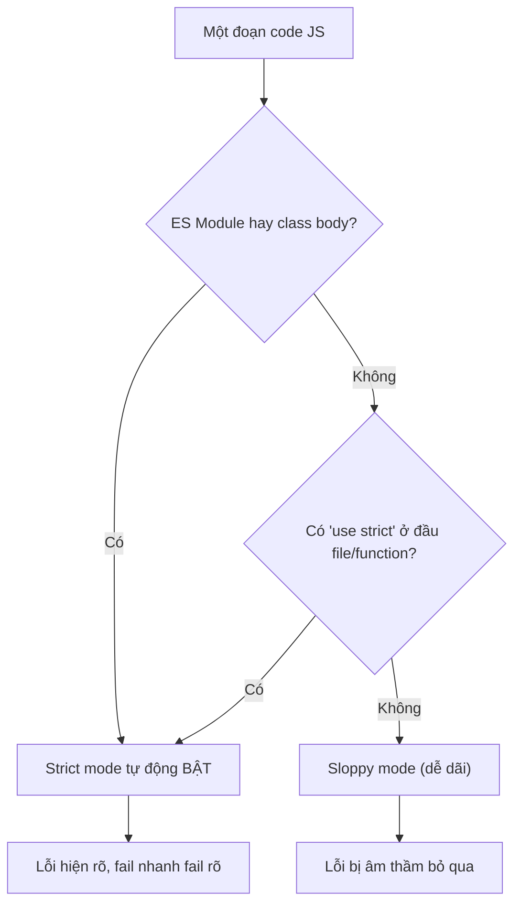

# Strict Mode

**Strict mode** (chế độ nghiêm ngặt) là một cách báo cho JavaScript chạy code của bạn theo những quy tắc chặt chẽ hơn. Khi bật strict mode, những lỗi vốn bị "âm thầm bỏ qua" sẽ được báo ngay thành lỗi rõ ràng, giúp bạn phát hiện sai sót sớm và viết code an toàn hơn. Với người mới học, đây là một thói quen tốt nên dùng vì nó ngăn nhiều lỗi phổ biến.

---

## Mục lục

- [Vì sao strict mode ra đời?](#vì-sao-strict-mode-ra-đời)
- [Bật strict mode](#bật-strict-mode)
- [Các thay đổi chính](#các-thay-đổi-chính)
- [Khi nào đã tự động strict?](#khi-nào-đã-tự-động-strict)
- [Tại sao quan trọng?](#tại-sao-quan-trọng)

---

## Vì sao strict mode ra đời?

**Vấn đề:** JavaScript thời đầu quá "dễ dãi" (sloppy mode). Gõ sai tên biến hoặc quên `var` sẽ vô tình tạo ra **biến global**; gán cho thuộc tính read-only thì **nuốt lỗi âm thầm**; `this` trong function thường rơi về `window` — toàn những bug rất khó tìm. Vì phải **tương thích ngược**, JS không thể sửa lại các hành vi cũ này.

```js
// Sloppy mode — mọi thứ "vẫn chạy" nhưng sai
function test() {
  cont = 0; // gõ sai "count" → tạo biến global, không báo lỗi
}

const obj = Object.freeze({ x: 1 });
obj.x = 2; // gán thất bại nhưng im lặng, không báo gì

function show() {
  console.log(this); // window (dễ gây bug ngoài ý muốn)
}
show();
```

**Giải pháp:** ES5 giới thiệu **`"use strict"`** — một chế độ **opt-in** (tự chọn bật) áp dụng ngữ nghĩa nghiêm ngặt hơn mà không phá vỡ code cũ. Triết lý là **"fail nhanh, fail rõ"**: lỗi xuất hiện ngay tại nơi sai thay vì âm thầm tích lũy.

```js
"use strict";

function test() {
  cont = 0; // ReferenceError ngay lập tức
}

const obj = Object.freeze({ x: 1 });
obj.x = 2; // TypeError — gán thất bại được báo rõ

function show() {
  console.log(this); // undefined (không rơi về window)
}
show();
```

Ngoài ra strict mode còn **cấm vài cú pháp dễ sai**, và **ES Module cùng class tự động strict** nên code hiện đại đã an toàn sẵn.

:::tip[Dùng thực tế]

- **Bắt lỗi sớm:** thêm `"use strict"` ở đầu file/function để lộ biến gõ sai và gán hỏng ngay khi chạy.
- **Code module/class luôn an toàn:** không cần khai báo gì thêm, ngữ nghĩa nghiêm ngặt đã bật mặc định.
- **Tránh global vô tình:** không còn cảnh quên `var` rồi "ô nhiễm" biến toàn cục một cách lặng lẽ.
- **Tối ưu cho engine:** code strict dễ phân tích tĩnh hơn, giúp V8/SpiderMonkey chạy đường tối ưu nhanh hơn.

:::

---

## Bật strict mode

Đặt **`"use strict"`** ở đầu file hoặc function:

```js
"use strict";

// Toàn bộ file strict
function test() {
  // Hoặc chỉ riêng function
  "use strict";
}
```

---

## Các thay đổi chính

**1. Cấm khai báo biến không có `var`/`let`/`const`:**

```js
"use strict";
x = 10; // ReferenceError (sloppy: tạo global)
```

**2. `this` trong function không bound = `undefined`** (sloppy: `window`):

```js
"use strict";
function test() {
  console.log(this); // undefined
}
test();
```

**3. Lỗi khi gán cho readonly/getter-only:**

```js
"use strict";
const obj = Object.freeze({ x: 1 });
obj.x = 2; // TypeError (sloppy: im lặng)

undefined = 1;     // TypeError
NaN = 0;           // TypeError
```

**4. Tham số trùng tên → lỗi:**

```js
"use strict";
function foo(a, a) {} // SyntaxError
```

**5. Cấm `with` và octal literal cũ:**

```js
"use strict";
with (obj) { } // SyntaxError
0123;          // SyntaxError (dùng 0o123)
```

**6. `delete` biến → lỗi:**

```js
"use strict";
let x = 1;
delete x; // SyntaxError
```

**7. Reserved keyword bị bảo vệ:**

```js
"use strict";
let public = 1;     // SyntaxError
let arguments = 1;  // SyntaxError
let eval = 1;       // SyntaxError
```

---

## Khi nào đã tự động strict?

Strict mode được **bật mặc định** trong:

- **ES Module** (file `.mjs` hoặc `"type": "module"`).
- **Class body** (mọi method trong class).
- **`<script type="module">`** trong HTML.

```js
// my-module.js
// Tự động strict — không cần "use strict"

class User {
  // Tự động strict trong toàn class
  greet() {
    // strict mặc định
  }
}
```

Sơ đồ dưới tóm tắt cách trình duyệt/engine quyết định một đoạn code chạy ở
strict mode hay sloppy mode:



:::info[Phân tích]

Trong code hiện đại (ES Module, React, Vue, Node ESM, TypeScript),
**strict mode luôn bật**. Không cần thêm `"use strict"` thủ công.

Chỉ cần khi:

- File **legacy script** (không phải module).
- Embedded JS (vd `<script>` không có `type="module"`).
- Code chạy với `--no-strict-mode` của Node (rất hiếm).

Khi viết library publish, **giữ `"use strict"`** ở đầu file IIFE/UMD để
đảm bảo strict ngay cả khi user load qua `<script>` cũ.

:::

---

## Tại sao quan trọng?

**Phát hiện bug sớm:**

```js
// Sloppy — silent error
function test() {
  count = 0; // tạo global biến — bug
}

// Strict — báo lỗi ngay
"use strict";
function test() {
  count = 0; // ReferenceError
}
```

**Performance** — strict mode giúp engine tối ưu tốt hơn:

- Không phải xử lý `with`, octal literal, eval scope.
- Cho phép static analysis chính xác hơn.
- V8/SpiderMonkey có code path nhanh hơn cho strict code.

:::warning[Cần lưu ý]

**Tránh trộn strict và non-strict** trong cùng dự án:

```js
// Tệ — file strict
"use strict";

// Import từ file sloppy
import "./legacy.js"; // có thể leak global biến
```

Khi migrate code cũ:

1. Chuyển dần sang ES Module (tự động strict).
2. Thêm `"use strict"` cho file còn lại.
3. Test kỹ — strict có thể bộc lộ bug đã ngủ yên.

Trong TypeScript, không cần lo — TS luôn output strict mode.

:::

:::tip[Mẹo]

**Bài test xác định strict mode**:

```js
function isStrict() {
  return (function () { return !this; })();
}

isStrict();
// true → strict (this = undefined)
// false → sloppy (this = global)
```

Hữu dụng khi debug behavior bí ẩn — đôi khi function được load từ
context khác có chế độ ngược lại bạn nghĩ.

:::
