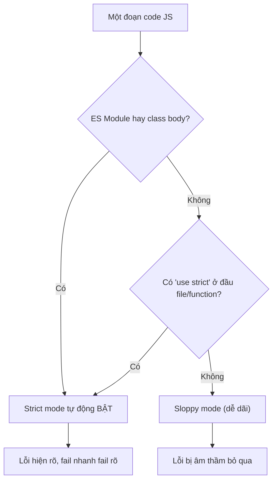

# Strict Mode

**Strict mode** (chế độ nghiêm ngặt) là một cách báo cho JavaScript chạy code của bạn theo những quy tắc chặt chẽ hơn. Khi bật strict mode, những lỗi vốn bị "âm thầm bỏ qua" sẽ được báo ngay thành lỗi rõ ràng, giúp bạn phát hiện sai sót sớm và viết code an toàn hơn. Với người mới học, đây là một thói quen tốt nên dùng vì nó ngăn nhiều lỗi phổ biến.

[](pathname:///img/javascript/strict-mode.webp)

---

:::note[Ghi nhớ nhanh]

- ⭐ **Strict mode = "fail nhanh, fail rõ"** — biến những lỗi vốn bị âm thầm bỏ qua (biến global vô tình, gán vào readonly) thành lỗi rõ ràng ngay khi chạy.
- **Bật bằng `"use strict"`** — đặt ở đầu file hoặc đầu thân function; là chế độ **opt-in** để không phá vỡ code cũ.
- ⭐ **Code hiện đại đã tự động strict** — ES Module, `class` body và `<script type="module">` luôn strict, không cần khai báo thủ công.
- **Các thay đổi chính** — cấm biến không khai báo, `this` = `undefined` thay vì `window`, lỗi khi gán readonly, cấm tham số trùng tên, `with` và octal cũ.
- **Lợi ích kép** — bắt bug sớm và giúp engine (V8/SpiderMonkey) tối ưu tốt hơn nhờ static analysis chính xác.

:::

---

## Mục lục

- [Vì sao strict mode ra đời?](#vì-sao-strict-mode-ra-đời)
- [Bật strict mode](#bật-strict-mode)
- [Các thay đổi chính](#các-thay-đổi-chính)
- [Khi nào đã tự động strict?](#khi-nào-đã-tự-động-strict)
- [Tại sao quan trọng?](#tại-sao-quan-trọng)
- [Câu hỏi phỏng vấn](#câu-hỏi-phỏng-vấn)

---

## Vì sao strict mode ra đời?

**Vấn đề:** JavaScript thời đầu quá "dễ dãi" (sloppy mode). Gõ sai tên biến hoặc quên `var` sẽ vô tình tạo ra **biến global**; gán cho thuộc tính read-only thì **nuốt lỗi âm thầm**; `this` trong function thường rơi về `window` — toàn những bug rất khó tìm. Vì phải **tương thích ngược**, JS không thể sửa lại các hành vi cũ này.

```js
// Sloppy mode — mọi thứ "vẫn chạy" nhưng sai
function test() {
  cont = 0; // gõ sai "count" → tạo biến global, không báo lỗi
}

const obj = Object.freeze({ x: 1 });
obj.x = 2; // gán thất bại nhưng im lặng, không báo gì

function show() {
  console.log(this); // window (dễ gây bug ngoài ý muốn)
}
show();
```

**Giải pháp:** ES5 giới thiệu **`"use strict"`** — một chế độ **opt-in** (tự chọn bật) áp dụng ngữ nghĩa nghiêm ngặt hơn mà không phá vỡ code cũ. Triết lý là **"fail nhanh, fail rõ"**: lỗi xuất hiện ngay tại nơi sai thay vì âm thầm tích lũy.

```js
"use strict";

function test() {
  cont = 0; // ReferenceError ngay lập tức
}

const obj = Object.freeze({ x: 1 });
obj.x = 2; // TypeError — gán thất bại được báo rõ

function show() {
  console.log(this); // undefined (không rơi về window)
}
show();
```

Ngoài ra strict mode còn **cấm vài cú pháp dễ sai**, và **ES Module cùng class tự động strict** nên code hiện đại đã an toàn sẵn.

:::tip[Dùng thực tế]

- **Bắt lỗi sớm:** thêm `"use strict"` ở đầu file/function để lộ biến gõ sai và gán hỏng ngay khi chạy.
- **Code module/class luôn an toàn:** không cần khai báo gì thêm, ngữ nghĩa nghiêm ngặt đã bật mặc định.
- **Tránh global vô tình:** không còn cảnh quên `var` rồi "ô nhiễm" biến toàn cục một cách lặng lẽ.
- **Tối ưu cho engine:** code strict dễ phân tích tĩnh hơn, giúp V8/SpiderMonkey chạy đường tối ưu nhanh hơn.

:::

---

## Bật strict mode

Đặt **`"use strict"`** ở đầu file hoặc function:

```js
"use strict";

// Toàn bộ file strict
function test() {
  // Hoặc chỉ riêng function
  "use strict";
}
```

---

## Các thay đổi chính

**1. Cấm khai báo biến không có `var`/`let`/`const`:**

```js
"use strict";
x = 10; // ReferenceError (sloppy: tạo global)
```

**2. `this` trong function không bound = `undefined`** (sloppy: `window`):

```js
"use strict";
function test() {
  console.log(this); // undefined
}
test();
```

**3. Lỗi khi gán cho readonly/getter-only:**

```js
"use strict";
const obj = Object.freeze({ x: 1 });
obj.x = 2; // TypeError (sloppy: im lặng)

undefined = 1;     // TypeError
NaN = 0;           // TypeError
```

**4. Tham số trùng tên → lỗi:**

```js
"use strict";
function foo(a, a) {} // SyntaxError
```

**5. Cấm `with` và octal literal cũ:**

```js
"use strict";
with (obj) { } // SyntaxError
0123;          // SyntaxError (dùng 0o123)
```

**6. `delete` biến → lỗi:**

```js
"use strict";
let x = 1;
delete x; // SyntaxError
```

**7. Reserved keyword bị bảo vệ:**

```js
"use strict";
let public = 1;     // SyntaxError
let arguments = 1;  // SyntaxError
let eval = 1;       // SyntaxError
```

---

## Khi nào đã tự động strict?

Strict mode được **bật mặc định** trong:

- **ES Module** (file `.mjs` hoặc `"type": "module"`).
- **Class body** (mọi method trong class).
- **`<script type="module">`** trong HTML.

```js
// my-module.js
// Tự động strict — không cần "use strict"

class User {
  // Tự động strict trong toàn class
  greet() {
    // strict mặc định
  }
}
```

Sơ đồ dưới tóm tắt cách trình duyệt/engine quyết định một đoạn code chạy ở
strict mode hay sloppy mode:



:::info[Phân tích]

Trong code hiện đại (ES Module, React, Vue, Node ESM, TypeScript),
**strict mode luôn bật**. Không cần thêm `"use strict"` thủ công.

Chỉ cần khi:

- File **legacy script** (không phải module).
- Embedded JS (vd `<script>` không có `type="module"`).
- Code chạy với `--no-strict-mode` của Node (rất hiếm).

Khi viết library publish, **giữ `"use strict"`** ở đầu file IIFE/UMD để
đảm bảo strict ngay cả khi user load qua `<script>` cũ.

:::

---

## Tại sao quan trọng?

**Phát hiện bug sớm:**

```js
// Sloppy — silent error
function test() {
  count = 0; // tạo global biến — bug
}

// Strict — báo lỗi ngay
"use strict";
function test() {
  count = 0; // ReferenceError
}
```

**Performance** — strict mode giúp engine tối ưu tốt hơn:

- Không phải xử lý `with`, octal literal, eval scope.
- Cho phép static analysis chính xác hơn.
- V8/SpiderMonkey có code path nhanh hơn cho strict code.

:::warning[Cần lưu ý]

**Tránh trộn strict và non-strict** trong cùng dự án:

```js
// Tệ — file strict
"use strict";

// Import từ file sloppy
import "./legacy.js"; // có thể leak global biến
```

Khi migrate code cũ:

1. Chuyển dần sang ES Module (tự động strict).
2. Thêm `"use strict"` cho file còn lại.
3. Test kỹ — strict có thể bộc lộ bug đã ngủ yên.

Trong TypeScript, không cần lo — TS luôn output strict mode.

:::

:::tip[Mẹo]

**Bài test xác định strict mode**:

```js
function isStrict() {
  return (function () { return !this; })();
}

isStrict();
// true → strict (this = undefined)
// false → sloppy (this = global)
```

Hữu dụng khi debug behavior bí ẩn — đôi khi function được load từ
context khác có chế độ ngược lại bạn nghĩ.

:::

---

## Câu hỏi phỏng vấn

Những câu thường gặp về chủ đề này. Tự trả lời trước, rồi bấm **Xem đáp án** để đối chiếu.

**1. `Strict mode` là gì? Vì sao ES5 phải đưa nó vào dạng `opt-in` thay vì bật mặc định cho mọi code?**

<details className="qa">
<summary>Xem đáp án</summary>

**Strict mode** là một biến thể ngữ nghĩa nghiêm ngặt hơn của JavaScript, bật bằng directive `"use strict"` (ES5). Triết lý là **"fail nhanh, fail rõ"**: những sai sót vốn bị âm thầm bỏ qua trong sloppy mode — gõ sai tên biến tạo global, gán vào thuộc tính read-only, `this` rơi về `window` — sẽ ném lỗi ngay tại nơi sai.

Vì sao phải **opt-in**? Vì **tương thích ngược** là ràng buộc sống còn của web. Năm 2009 đã có hàng triệu trang web dựa vào đúng những hành vi "dễ dãi" đó. Nếu ES5 bật strict mặc định, hàng loạt trang cũ sẽ vỡ ngay khi trình duyệt nâng cấp — điều không thể chấp nhận với nguyên tắc *"don't break the web"*.

Vì vậy TC39 chọn cách để lập trình viên tự khai báo. Về sau, khi ES Module ra đời (ES6) — một ngữ cảnh hoàn toàn mới, không có code cũ để phá — strict mode được bật **mặc định**, không thể tắt.

</details>

**2. Có mấy cách bật strict mode? Đặt `"use strict"` ở đầu file và ở đầu thân hàm thì phạm vi áp dụng khác nhau ra sao?**

<details className="qa">
<summary>Xem đáp án</summary>

Có hai cách khai báo thủ công, cộng với các ngữ cảnh tự động strict.

```js
"use strict";      // (1) đầu file → toàn bộ script strict
function a() {}    // hàm này strict theo
```

```js
function b() {
  "use strict";    // (2) đầu thân hàm → chỉ b và các hàm lồng bên trong
  function c() {}  // c cũng strict
}
function d() {}    // d vẫn sloppy
```

Khác biệt về phạm vi:

| Vị trí | Phạm vi áp dụng |
|---|---|
| Đầu file | Toàn bộ script, kể cả mọi hàm khai báo trong đó |
| Đầu thân hàm | Chỉ hàm đó và mọi hàm lồng bên trong; phần còn lại của file vẫn sloppy |

Strict mode **kế thừa xuống dưới nhưng không lan ngược lên**. Cách khai báo theo hàm hữu ích khi migrate dần một file legacy lớn. Ngoài ra, ES Module, thân `class` và `<script type="module">` đã tự động strict, nên code hiện đại gần như không cần viết directive.

</details>

**3. Nếu `"use strict"` không nằm ở dòng đầu tiên (ví dụ đặt sau một câu lệnh khác) thì nó có hiệu lực không? Vì sao?**

<details className="qa">
<summary>Xem đáp án</summary>

**Không có hiệu lực** — và tệ hơn là **không hề báo lỗi**, code cứ âm thầm chạy ở sloppy mode.

Lý do: `"use strict"` là một **directive prologue** — theo spec, nó chỉ được công nhận khi nằm trong chuỗi các câu lệnh biểu thức chuỗi **mở đầu** file hoặc thân hàm. Ngay khi có bất kỳ câu lệnh nào khác chạy trước, `"use strict"` chỉ còn là một biểu thức chuỗi vô nghĩa, bị bỏ qua.

```js
let x = 1;
"use strict";   // chỉ là một chuỗi, KHÔNG bật strict mode
y = 2;          // vẫn tạo global, không lỗi
```

```js
"use strict";   // đúng vị trí
let x = 1;
y = 2;          // ReferenceError
```

Lưu ý: comment ở phía trên thì **vẫn được** vì comment không phải câu lệnh. Nhiều directive chuỗi liên tiếp cũng hợp lệ. Đây là lý do khi bundler nối nhiều file, một file sloppy đứng trước có thể vô hiệu hoá `"use strict"` của file phía sau.

</details>

**4. Kể ít nhất năm hành vi bị thay đổi khi bật strict mode so với `sloppy mode`.**

<details className="qa">
<summary>Xem đáp án</summary>

| Hành vi | Sloppy mode | Strict mode |
|---|---|---|
| Gán biến chưa khai báo | Tạo biến global | `ReferenceError` |
| `this` trong hàm gọi standalone | `window` / `globalThis` | `undefined` |
| Gán vào thuộc tính read-only, object đã freeze | Thất bại im lặng | `TypeError` |
| Tham số trùng tên `function f(a, a) {}` | Cho phép | `SyntaxError` |
| `with` | Cho phép | `SyntaxError` |
| Octal literal cũ `0123` | Cho phép | `SyntaxError` (dùng `0o123`) |
| `delete` một biến | Trả về `false` | `SyntaxError` |
| `arguments` liên kết với tham số | Có | Không (tách rời) |
| `eval` khai báo biến | Rò ra scope ngoài | Nằm trong scope riêng |
| Tên như `public`, `eval`, `arguments` làm định danh | Cho phép | `SyntaxError` |

```js
"use strict";
x = 10;                 // ReferenceError
Object.freeze(o).a = 1; // TypeError
```

Chia theo nhóm cho dễ nhớ: một nhóm biến **lỗi im lặng thành lỗi rõ ràng**, một nhóm **cấm cú pháp dễ sai**, một nhóm **dọn đường cho ES6** bằng cách bảo vệ các từ khoá dành riêng.

</details>

**5. Trong strict mode, `this` của một hàm gọi standalone bằng gì? Sloppy mode thì sao, và vì sao lại khác?**

<details className="qa">
<summary>Xem đáp án</summary>

```js
function show() { console.log(this); }

show();            // sloppy: window (hoặc globalThis)
                   // strict: undefined
```

Trong sloppy mode, khi hàm được gọi mà không có receiver, engine thực hiện **this-coercion (boxing)**: `this` là `undefined` thì thay bằng object global; `this` là giá trị nguyên thuỷ thì bọc thành object (`call(1)` → `Number` object). Strict mode **bỏ hẳn bước này** — `this` giữ nguyên đúng giá trị được truyền vào.

Vì sao khác: hành vi cũ tạo ra một lỗ hổng rất khó tìm. Quên `new` khi gọi constructor sẽ khiến `this.name = ...` ghi thẳng vào `window`, ô nhiễm global mà không báo gì:

```js
"use strict";
function User(name) { this.name = name; }
User("Thuan"); // TypeError: Cannot set property of undefined — lộ lỗi ngay
```

Đây cũng là lý do một hàm bị "mất `this`" khi truyền làm callback sẽ báo lỗi rõ ràng trong strict mode thay vì âm thầm đọc nhầm biến global.

</details>

**6. Đoán output: `var a = b = 3;` chạy trong strict mode cho kết quả gì? Giải thích chính xác biến nào bị lỗi.**

<details className="qa">
<summary>Xem đáp án</summary>

```js
"use strict";
var a = b = 3;
// ReferenceError: b is not defined
```

Phân tích: câu lệnh được parse là `var a = (b = 3)`. Từ khoá `var` **chỉ áp dụng cho `a`**, còn `b` là một phép gán thường vào một định danh **chưa hề được khai báo**.

- Trong **sloppy mode**, gán vào định danh chưa khai báo sẽ ngầm tạo một property trên object global → `b` trở thành biến global, `a` bằng `3`, không báo lỗi.
- Trong **strict mode**, hành vi ngầm tạo global bị cấm → ném `ReferenceError` ngay tại phép gán `b = 3`. Vì lỗi xảy ra trước khi gán cho `a`, nên `a` vẫn là `undefined` (đã hoisted nhưng chưa nhận giá trị).

Vậy biến bị lỗi là **`b`**, không phải `a`. Đây là ví dụ kinh điển cho thấy strict mode bắt được lỗi mà sloppy mode giấu đi. Muốn khai báo cả hai, phải viết rõ: `let b = 3; let a = b;` hoặc `let a = 3, b = 3;`.

</details>

**7. Gán giá trị vào một object đã `Object.freeze()`: strict mode và sloppy mode phản ứng khác nhau thế nào?**

<details className="qa">
<summary>Xem đáp án</summary>

```js
const obj = Object.freeze({ x: 1 });

// Sloppy mode
obj.x = 2;
console.log(obj.x); // 1 — gán thất bại nhưng KHÔNG báo gì

// Strict mode
"use strict";
obj.x = 2; // TypeError: Cannot assign to read only property 'x' of object
```

Điểm chung: **cả hai chế độ đều không đổi được giá trị** — `Object.freeze` luôn có tác dụng. Khác biệt nằm ở chỗ **có báo lỗi hay không**.

Quy tắc chung: mọi phép gán thất bại đều ném `TypeError` trong strict mode, bao gồm gán vào object đã freeze, vào property có `writable: false`, vào property chỉ có getter, hoặc thêm property mới vào object đã `preventExtensions`.

Hành vi im lặng của sloppy mode cực kỳ nguy hiểm: bạn tưởng dữ liệu đã cập nhật, nhưng thực tế không. Bug chỉ lộ ra ở nơi khác, rất xa nguyên nhân. Lưu ý thêm: `Object.freeze` chỉ đóng băng **một tầng** (shallow) — object lồng bên trong vẫn sửa được.

</details>

**8. Những ngữ cảnh nào TỰ ĐỘNG chạy strict mode mà không cần khai báo gì? (gợi ý: ES Module, thân `class`, `<script type="module">`)**

<details className="qa">
<summary>Xem đáp án</summary>

Các ngữ cảnh luôn strict, **không thể tắt**:

- **ES Module** — mọi file `.mjs`, file trong package có `"type": "module"`, hay bất cứ thứ gì được `import`/`export`.
- **`<script type="module">`** trong HTML.
- **Thân `class`** — kể cả `class` viết trong một file sloppy; mọi method, getter/setter, static block đều strict.

```js
class User {
  greet() {
    x = 1; // ReferenceError — strict dù file không có "use strict"
  }
}
```

Hệ quả thực tế: với React, Vue, Node ESM, TypeScript hay bất kỳ dự án dùng bundler hiện đại nào, **strict mode đã bật sẵn** — viết `"use strict"` là thừa.

Chỉ còn cần khai báo thủ công khi: viết script cổ điển (`<script>` không có `type="module"`), inline JS trong HTML, hoặc build ra bundle IIFE/UMD để người khác nhúng bằng thẻ `<script>` cũ — khi đó giữ `"use strict"` ở đầu để đảm bảo ngữ nghĩa nghiêm ngặt.

</details>

**9. Vì sao strict mode giúp engine như V8 tối ưu code tốt hơn? Liên hệ tới `with`, `eval` và `static analysis`.**

<details className="qa">
<summary>Xem đáp án</summary>

Cốt lõi: strict mode làm cho **việc phân giải định danh trở nên tĩnh và đoán trước được**, nhờ đó engine phân tích được ngay lúc biên dịch thay vì phải tra cứu lúc chạy.

- **`with` bị cấm.** Khối `with (obj) { x }` khiến `x` có thể là property của `obj` hoặc là biến ngoài — chỉ biết được lúc runtime. Mọi truy cập biến trong hàm chứa `with` đều phải tra scope động, giết chết tối ưu. Cấm `with` là gỡ bỏ toàn bộ nguy cơ này.
- **`eval` có scope riêng.** Trong sloppy mode, `eval("var x = 1")` **tiêm biến mới vào scope đang bao quanh**, nên engine không dám cấp phát biến vào slot/register cố định. Strict mode buộc `eval` tạo scope riêng, biến bên ngoài không bị thay đổi.
- **Không có implicit global.** Mọi biến đều phải khai báo, nên engine biết chính xác biến thuộc scope nào.
- **`arguments` không liên kết với tham số**, nên sửa `arguments[0]` không âm thầm đổi tham số — engine tối ưu tham số tự do hơn.

Nhờ vậy engine có thể đưa biến vào register, inline hàm, bỏ kiểm tra thừa. (Ở các engine hiện đại, chênh lệch hiệu năng thường nhỏ — lợi ích chính vẫn là bắt bug sớm.)

</details>

**10. Strict mode có nhược điểm gì? (gợi ý: mất `function.caller`, `arguments.callee`, rủi ro khi nối nhiều file khác chế độ vào một bundle)**

<details className="qa">
<summary>Xem đáp án</summary>

Những đánh đổi cần biết:

- **Mất một số API nội quan.** `fn.caller`, `fn.arguments` và `arguments.callee` đều ném `TypeError`. Hàm đệ quy ẩn danh phải chuyển sang named function expression; các thư viện cũ dựa vào `arguments.callee` sẽ hỏng.

```js
"use strict";
const fact = function (n) {
  return n <= 1 ? 1 : n * arguments.callee(n - 1); // TypeError
};
// Cách đúng: đặt tên cho function expression rồi gọi tên đó
```

- **Rủi ro khi nối file (concatenation).** Nếu bundler ghép một file sloppy lên trước, directive `"use strict"` của file phía sau không còn ở đầu prologue → mất tác dụng. Ngược lại, một file strict đứng đầu có thể **ép cả bundle** vào strict và làm vỡ code cũ. Giải pháp phổ biến là bọc từng file trong IIFE riêng, hoặc dùng ES Module để mỗi module có phạm vi độc lập.
- **Code legacy có thể vỡ** khi bật: chỗ dựa vào `this === window`, dựa vào global ngầm, hay gán vào object read-only nay đều ném lỗi.
- **`this` là `undefined`** đôi khi gây bất ngờ với người mới, vì thông báo lỗi xuất hiện ở nơi không ngờ tới.

</details>

**11. Trong sloppy mode, `arguments` liên kết ngược với tham số của hàm. Đoán output khi gán `arguments[0] = 99` ở hai chế độ và giải thích khác biệt.**

<details className="qa">
<summary>Xem đáp án</summary>

```js
function sloppy(a) {
  arguments[0] = 99;
  console.log(a); // 99  — a bị đổi theo!
}
sloppy(1);

function strict(a) {
  "use strict";
  arguments[0] = 99;
  console.log(a); // 1   — a giữ nguyên
}
strict(1);
```

Giải thích: trong sloppy mode, `arguments` là **mapped arguments object** — mỗi phần tử và tham số tương ứng dùng chung một ô nhớ, nên sửa bên nào cũng ảnh hưởng bên kia (đúng cả chiều ngược lại: gán `a = 5` thì `arguments[0]` thành `5`).

Strict mode tạo **unmapped arguments object** — chỉ là bản chụp giá trị lúc gọi hàm, hoàn toàn tách rời tham số. Nhờ vậy code dễ đọc, dễ suy luận và engine tối ưu tốt hơn.

Lưu ý: liên kết này **cũng tự động mất** trong sloppy mode nếu hàm có tham số mặc định, rest hoặc destructuring. Trong code hiện đại nên dùng rest parameter `(...args)` — luôn là mảng thật và không bao giờ liên kết ngược.

</details>

**12. Viết một đoạn code ngắn để kiểm tra runtime hiện đang chạy strict hay sloppy mode. Nguyên lý hoạt động là gì?**

<details className="qa">
<summary>Xem đáp án</summary>

```js
function isStrict() {
  return (function () { return !this; })();
}

isStrict();
// true  → strict (this = undefined)
// false → sloppy (this = global object)
```

Nguyên lý: hàm bên trong được gọi **standalone**, không có receiver. Trong sloppy mode, engine boxing `this` thành object global — `!globalThis` cho `false`. Trong strict mode, không có bước boxing nên `this` là `undefined` — `!undefined` cho `true`.

Điểm mấu chốt: hàm bên trong phải là **function thường** (arrow function sẽ lấy `this` từ scope ngoài, cho kết quả sai) và **không tự khai báo** `"use strict"` — nó kế thừa chế độ từ ngữ cảnh chứa nó, chính là thứ ta muốn đo.

Cách kiểm tra khác, dựa vào việc strict mode cấm gán ngầm:

```js
function isStrict2() {
  try { undeclaredVar = 1; return false; }
  catch { return true; }
}
```

Hữu dụng khi debug hành vi bí ẩn của code load từ context khác chế độ.

</details>

**13. Bạn được giao migrate một codebase legacy sang strict mode — nêu rủi ro và thứ tự các bước bạn sẽ làm.**

<details className="qa">
<summary>Xem đáp án</summary>

Rủi ro chính: strict mode **bộc lộ những bug đã ngủ yên**. Code từng "chạy được" nhờ global ngầm, `this === window`, gán im lặng vào object read-only, hay `arguments.callee` sẽ bắt đầu ném lỗi runtime. Nguy hiểm ở chỗ nhiều lỗi chỉ xuất hiện trên đường chạy hiếm, test không phủ tới. Thêm nữa, bật `"use strict"` ở đầu một file rồi nối vào bundle có thể vô tình ép cả bundle vào strict.

Thứ tự các bước:

1. **Dựng lưới an toàn trước**: bổ sung test cho luồng quan trọng, bật ESLint với các rule như `no-undef`, `no-implicit-globals`, `no-caller`.
2. **Migrate theo từng file, không làm cả loạt** — bắt đầu từ module rìa, ít phụ thuộc.
3. **Bật theo phạm vi hàm trước** (`"use strict"` trong thân hàm) với file lớn, rồi mới nâng lên cấp file.
4. **Chuyển dần sang ES Module** — đây là đích đến đúng, vì module tự động strict và có scope riêng, không sợ vấn đề nối file.
5. **Test kỹ sau mỗi bước**, ưu tiên chạy thật trên môi trường staging vì nhiều lỗi chỉ lộ lúc runtime.
6. Kiểm tra cấu hình bundler để mỗi file được bọc scope riêng.

</details>

**14. TypeScript và các bundler có tự thêm strict mode vào output không? `"use strict"` khác gì với option `strict: true` trong `tsconfig.json`?**

<details className="qa">
<summary>Xem đáp án</summary>

**TypeScript**: option `alwaysStrict` (được bật kèm khi dùng `strict: true`) khiến TS phát ra `"use strict"` ở đầu file output. Ngoài ra nếu file có `import`/`export` thì nó là ES Module — đã strict theo chuẩn, không cần directive. **Bundler**: output ESM luôn strict; với output CommonJS/IIFE, các công cụ như Rollup thường chèn `"use strict"` vào đầu bundle.

Điểm cần phân biệt rõ — **hai khái niệm hoàn toàn khác nhau**:

| | `"use strict"` | `strict: true` trong `tsconfig.json` |
|---|---|---|
| Thuộc về | JavaScript, ngữ nghĩa **runtime** | TypeScript, mức chặt của **type checker** |
| Tác dụng khi nào | Lúc code chạy | Lúc compile, trước khi chạy |
| Nội dung | Cấm global ngầm, `this` = `undefined`, lỗi khi gán read-only... | Bật cả nhóm cờ: `strictNullChecks`, `noImplicitAny`, `strictFunctionTypes`, `alwaysStrict`... |

Chúng chỉ giao nhau ở đúng một điểm: `strict: true` bao gồm `alwaysStrict`, nên gián tiếp đảm bảo output có strict mode. Ngoài ra chúng độc lập — tắt `strict` trong tsconfig thì code vẫn strict lúc chạy nếu là ES Module.

</details>
