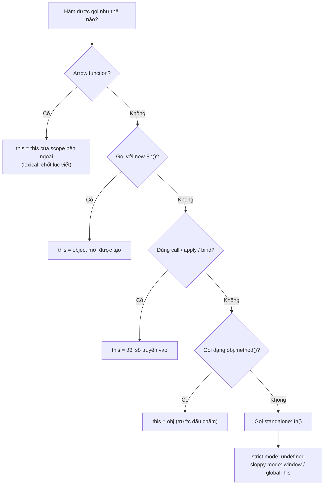

# this trong các ngữ cảnh

**this** (từ khoá tham chiếu tới đối tượng đang gọi hàm) là một giá trị đặc biệt trong JavaScript có thể thay đổi tuỳ theo **cách** và **nơi** hàm được gọi, chứ không cố định như biến thông thường. Cùng một hàm nhưng khi gọi ở ngữ cảnh khác nhau (trong object, đứng một mình, hay trong sự kiện) thì `this` lại trỏ tới những thứ khác nhau. Bài này giúp người mới hiểu `this` mang giá trị gì trong từng tình huống để tránh nhầm lẫn thường gặp.

---

## 🎯 Cần nắm gì sau bài này?

:::note[Ghi nhớ nhanh]

- ⭐ **`this` xác định lúc GỌI, không phải lúc VIẾT** — cùng một hàm nhưng `this` đổi theo cách gọi (`obj.method()`, `fn()`, `new Fn()`).
- **`this` bị mất khi tách method** — gán `const g = obj.method` rồi gọi `g()` khiến `this` không còn là `obj` (standalone).
- ⭐ **Arrow function không có `this` riêng** — nó kế thừa `this` lexical từ scope ngoài, nên hợp cho callback giữ context nhưng KHÔNG dùng làm method của object literal.
- **Strict vs sloppy** — gọi standalone thì strict cho `this = undefined`, sloppy ép về `window`/`globalThis`; class body luôn strict nên "fail nhanh, fail rõ".
- **Event handler** — function thường có `this` = element gắn listener; arrow lấy `this` outer, nên dùng `e.currentTarget` để chắc chắn lấy đúng element.
- **`this` sinh ra để tái sử dụng hành vi** — cho nhiều object/instance dùng chung một hàm; nếu không có class hay hàm dùng chung thì thường không cần `this`.

:::

---

## Mục lục

- [this là gì?](#this-là-gì)
- [Tại sao cần this?](#tại-sao-cần-this)
- [this trong method](#this-trong-method)
- [this trong function thường](#this-trong-function-thường)
- [this trong arrow function](#this-trong-arrow-function)
- [this trong event handler](#this-trong-event-handler)
- [this trong class](#this-trong-class)

---

## this là gì?

`this` là **giá trị động** trỏ đến **context gọi function**. Giá trị
`this` phụ thuộc **cách gọi**, không phải **nơi khai báo** (trừ arrow).

:::danger[Strict mode quyết định giá trị `this`]

Khi gọi hàm **standalone** (không có object đứng trước), kết quả `this`
**khác nhau hoàn toàn** giữa hai chế độ:

- **Strict mode** (`"use strict"`, ES Module, body của `class`): `this === undefined`
- **Sloppy mode** (script cũ, không khai báo strict): `this` bị **ép** về
  `window` / `globalThis`

ES Module (file dùng `import`/`export`, `<script type="module">`) và **mọi
code bên trong `class` luôn chạy strict mode mặc định**. Vì vậy code hiện đại
2026 gần như luôn rơi vào nhánh `undefined`. Các ví dụ dưới đây đều ghi rõ
kết quả cho **cả hai chế độ**.

:::

Quy tắc tổng quát:

| Cách gọi | `this` (strict) | `this` (sloppy) |
|----------|------|------|
| `obj.method()` | `obj` | `obj` |
| `fn()` (standalone) | `undefined` | `window` / `globalThis` |
| `new Fn()` | object mới tạo | object mới tạo |
| `fn.call(x)` / `fn.apply(x)` | `x` | `x` (primitive bị bọc thành object) |
| Arrow function | `this` của scope outer (lexical) | như scope outer |
| Event handler (function) | element gắn listener | element gắn listener |
| Method trong class | instance (class luôn strict) | — (class luôn strict) |

Chỉ cột **standalone** và **call/apply với primitive** là khác nhau giữa hai
chế độ. Chi tiết về strict mode xem bài [Strict mode](../12-strict-mode/1_strict-mode.md).

Có thể tóm gọn cách xác định `this` bằng sơ đồ — đi từ trên xuống, gặp
nhánh "Có" đầu tiên là dừng:



---

## Tại sao cần this?

Bản chất `this` sinh ra để giải quyết **một vấn đề duy nhất**: làm sao để
**cùng một đoạn code** chạy được trên **nhiều dữ liệu khác nhau**.

### Vấn đề: nếu KHÔNG có this

Mỗi object cần hàm `greet()` → phải viết riêng, gọi đích danh tên biến:

```js
const an = {
  name: "An",
  greet() {
    console.log("Xin chào " + an.name); // dính chặt vào biến "an"
  },
};

const binh = {
  name: "Bình",
  greet() {
    console.log("Xin chào " + binh.name); // dính chặt vào biến "binh"
  },
};
```

→ Hàm `greet` **lặp lại**, đổi tên biến là hỏng, không tái sử dụng được.

### Giải pháp: this = "object đang gọi tôi"

`this` cho phép viết hàm **một lần**, dùng cho **mọi object**:

```js
function greet() {
  console.log("Xin chào " + this.name); // this = ai gọi thì là người đó
}

const an = { name: "An", greet };
const binh = { name: "Bình", greet };

an.greet(); // Xin chào An    → this = an
binh.greet(); // Xin chào Bình → this = binh
```

Cùng **một hàm `greet`**, nhưng `this` thay đổi theo object đứng trước dấu
chấm lúc gọi. Đây chính là lý do `this` tồn tại.

### Nơi dùng this nhiều nhất: class

Tình huống thực tế nhất. Một `class` là khuôn tạo ra **nhiều instance**, mỗi
instance có dữ liệu riêng:

```js
class TaiKhoan {
  constructor(soDu) {
    this.soDu = soDu; // this = tài khoản đang được tạo
  }

  napTien(tien) {
    this.soDu += tien; // cộng vào ĐÚNG tài khoản đang gọi
  }
}

const tk1 = new TaiKhoan(100);
const tk2 = new TaiKhoan(500);

tk1.napTien(50); // chỉ tk1 đổi → 150
tk2.napTien(20); // chỉ tk2 đổi → 520
```

`napTien` viết **một lần**, nhưng nhờ `this` nó biết sửa số dư của `tk1` hay
`tk2` tuỳ ai gọi. Không có `this` thì không thể có `class` hoạt động.

:::tip[Khi nào KHÔNG cần this?]

Nếu bạn **không viết `class`** và **không cần một hàm dùng chung cho nhiều
object**, thì thực tế **không cần `this`** — dùng biến/closure bình thường còn
dễ hiểu hơn. `this` chỉ "đáng tiền" khi **nhiều object chia sẻ chung hành vi**.

Tóm gọn: `this` = **"đối tượng đang gọi hàm này là ai"**, xác định **lúc
gọi**, không phải lúc viết.

:::

---

## this trong method

Khi gọi `obj.method()`, `this` = `obj`:

```js
const user = {
  name: "An",
  greet() {
    console.log(this.name); // "An"
  },
};

user.greet();
```

**`this` bị mất khi tách method khỏi object:**

```js
const greet = user.greet;
greet();
// strict mode: this = undefined → TypeError khi đọc this.name
// sloppy mode: this = window → in ra undefined (window.name là "")
```

Lý do: cách gọi là `greet()`, không phải `user.greet()`. `this` được
quyết định **tại lúc gọi**. Vì method được khai báo qua shorthand `greet()`
nên thân hàm **không tự động strict** — chế độ phụ thuộc file chứa nó (Module
→ strict; script thường → sloppy).

---

## this trong function thường

Function độc lập:

```js
function test() {
  console.log(this);
}

test();
// strict mode: undefined
// sloppy mode: window (browser) / globalThis
```

Có thể bật strict cho **riêng một function** bằng `"use strict"` ở đầu thân:

```js
function test() {
  "use strict";
  console.log(this); // luôn undefined, kể cả file đang ở sloppy mode
}

test();
```

Trong callback truyền vào method — `setTimeout` gọi callback như hàm
standalone nên `this` **không** phải `user`:

```js
const user = {
  name: "An",
  run() {
    setTimeout(function () {
      console.log(this.name);
      // strict mode: TypeError (this = undefined)
      // sloppy mode: undefined (this = window, window.name = "")
    }, 100);
  },
};

user.run();
```

---

## this trong arrow function

Arrow **không có `this` riêng** — kế thừa `this` từ scope **bên ngoài**:

```js
const user = {
  name: "An",
  run() {
    setTimeout(() => {
      console.log(this.name); // "An" — this lấy từ run()
    }, 100);
  },
};

user.run();
```

Đây là lý do arrow phù hợp cho **callback giữ context**:

```js
class Counter {
  count = 0;

  start() {
    setInterval(() => {
      this.count++; // this = instance
    }, 1000);
  }
}
```

:::warning[Cần lưu ý]

**Đừng dùng arrow làm method của object literal** khi cần `this`:

```js
const user = {
  name: "An",
  greet: () => console.log(this.name), // SAI — this là outer scope
};

user.greet();
// Module (strict): this = undefined ở top-level → TypeError
// Script (sloppy): this = window → in ra undefined
```

Arrow lấy `this` từ **scope chứa object literal**, không phải từ object.
Ở top-level: Module có `this === undefined` (strict), còn script thường có
`this === window` (sloppy). Method object → dùng shorthand `greet() {}`.

:::

---

## this trong event handler

Khi truyền **function thường** làm listener, `this` = element:

```js
button.addEventListener("click", function () {
  console.log(this); // button element
  console.log(this.textContent);
});
```

Với **arrow function** — `this` lấy từ scope ngoài:

```js
class App {
  setup() {
    button.addEventListener("click", () => {
      console.log(this); // App instance, không phải button
    });
  }
}
```

Dùng `e.currentTarget` để lấy element gắn listener (an toàn nhất):

```js
button.addEventListener("click", (e) => {
  console.log(e.currentTarget); // button (luôn đúng)
  console.log(e.target);        // element thực sự được click
});
```

---

## this trong class

`this` trong method class = **instance**:

```js
class User {
  constructor(name) {
    this.name = name;
  }

  greet() {
    console.log(this.name);
  }
}

new User("An").greet(); // "An"
```

**Pitfall**: method bị tách khỏi instance:

```js
const u = new User("An");
const greet = u.greet;
greet(); // TypeError: Cannot read 'name' of undefined
```

:::note[Vì sao class luôn báo lỗi, kể cả ở sloppy file?]

Thân của `class` **luôn chạy strict mode**, không cần khai báo `"use strict"`.
Do đó method tách rời gọi standalone có `this === undefined` → đọc
`this.name` ném `TypeError` ngay. Đây là điểm khác với object literal sloppy
(rơi về `window`, chỉ in `undefined`). Class “fail nhanh, fail rõ” nên dễ
phát hiện bug `this` hơn.

:::

Cách fix:

```js
// 1. Bind trong constructor
class User {
  constructor(name) {
    this.name = name;
    this.greet = this.greet.bind(this);
  }
}

// 2. Class field với arrow
class User {
  constructor(name) {
    this.name = name;
  }

  greet = () => {
    console.log(this.name); // arrow giữ this
  };
}

// 3. Gọi luôn qua instance
button.onclick = () => u.greet();
```

:::info[Phân tích]

**Tại sao JS có `this` "khó" như vậy?**

Lịch sử: JS lấy cảm hứng từ Self và Scheme, không phải Java. `this` ban
đầu được thiết kế là **late-bound** (xác định tại runtime) — cho phép
một function dùng được với nhiều object qua `call`/`apply`.

Phản ứng của ngôn ngữ khác:

- **Python**: explicit `self` — phải khai báo rõ.
- **Java/C#**: `this` luôn là instance (không thay đổi).
- **JS**: dynamic — quyền lực nhưng dễ sai.

Arrow function (ES6) là **đáp lại quyết định thiết kế này** — đa số
trường hợp dev muốn `this` ổn định (như Java), không phải dynamic.

Quy tắc thực dụng cho 2026:
- **Method**: function thường (lexical `this` = instance qua dispatch).
- **Callback**: arrow (giữ `this` outer).
- **Standalone**: arrow (rõ ý đồ không dùng `this`).
- **Event handler cần element**: function thường + `e.currentTarget`.
- **Constructor**: function thường + `new`.

:::

:::tip[Mẹo]

**Cách debug `this` nhanh** — `console.log(this)` ngay đầu function. Nếu
không như mong đợi, hỏi 3 câu:

1. Function được gọi **như thế nào**? (`obj.fn()`, `fn()`, `new Fn()`?)
2. Có `bind`/`call`/`apply` ở đâu không?
3. Có phải arrow không? Nếu có, scope outer của nó là gì?

Trả lời 3 câu này thường tìm ra ngay nguyên nhân.

:::
