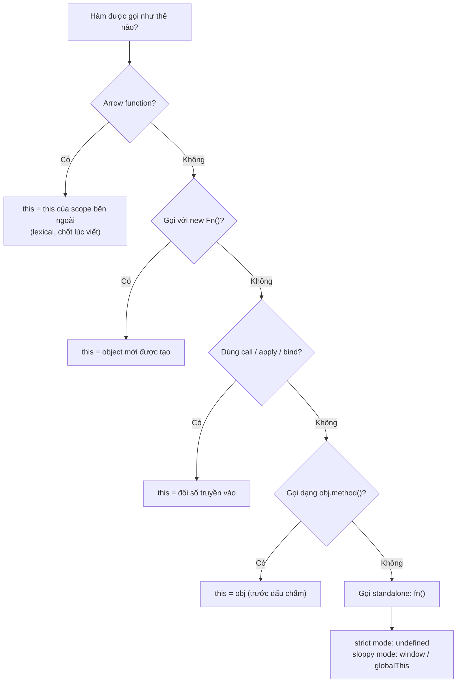

# this trong các ngữ cảnh

**this** (từ khoá tham chiếu tới đối tượng đang gọi hàm) là một giá trị đặc biệt trong JavaScript có thể thay đổi tuỳ theo **cách** và **nơi** hàm được gọi, chứ không cố định như biến thông thường. Cùng một hàm nhưng khi gọi ở ngữ cảnh khác nhau (trong object, đứng một mình, hay trong sự kiện) thì `this` lại trỏ tới những thứ khác nhau. Bài này giúp người mới hiểu `this` mang giá trị gì trong từng tình huống để tránh nhầm lẫn thường gặp.

[](pathname:///img/javascript/this-contexts.webp)

---

:::note[Ghi nhớ nhanh]

- ⭐ **`this` xác định lúc GỌI, không phải lúc VIẾT** — cùng một hàm nhưng `this` đổi theo cách gọi (`obj.method()`, `fn()`, `new Fn()`).
- **`this` bị mất khi tách method** — gán `const g = obj.method` rồi gọi `g()` khiến `this` không còn là `obj` (standalone).
- ⭐ **Arrow function không có `this` riêng** — nó kế thừa `this` lexical từ scope ngoài, nên hợp cho callback giữ context nhưng KHÔNG dùng làm method của object literal.
- **Strict vs sloppy** — gọi standalone thì strict cho `this = undefined`, sloppy ép về `window`/`globalThis`; class body luôn strict nên "fail nhanh, fail rõ".
- **Event handler** — function thường có `this` = element gắn listener; arrow lấy `this` outer, nên dùng `e.currentTarget` để chắc chắn lấy đúng element.
- **`this` sinh ra để tái sử dụng hành vi** — cho nhiều object/instance dùng chung một hàm; nếu không có class hay hàm dùng chung thì thường không cần `this`.

:::

---

## Mục lục

- [this là gì?](#this-là-gì)
- [Tại sao cần this?](#tại-sao-cần-this)
- [this trong method](#this-trong-method)
- [this trong function thường](#this-trong-function-thường)
- [this trong arrow function](#this-trong-arrow-function)
- [this trong event handler](#this-trong-event-handler)
- [this trong class](#this-trong-class)
- [Câu hỏi phỏng vấn](#câu-hỏi-phỏng-vấn)

---

## this là gì?

`this` là **giá trị động** trỏ đến **context gọi function**. Giá trị
`this` phụ thuộc **cách gọi**, không phải **nơi khai báo** (trừ arrow).

:::danger[Strict mode quyết định giá trị `this`]

Khi gọi hàm **standalone** (không có object đứng trước), kết quả `this`
**khác nhau hoàn toàn** giữa hai chế độ:

- **Strict mode** (`"use strict"`, ES Module, body của `class`): `this === undefined`
- **Sloppy mode** (script cũ, không khai báo strict): `this` bị **ép** về
  `window` / `globalThis`

ES Module (file dùng `import`/`export`, `<script type="module">`) và **mọi
code bên trong `class` luôn chạy strict mode mặc định**. Vì vậy code hiện đại
2026 gần như luôn rơi vào nhánh `undefined`. Các ví dụ dưới đây đều ghi rõ
kết quả cho **cả hai chế độ**.

:::

Quy tắc tổng quát:

| Cách gọi | `this` (strict) | `this` (sloppy) |
|----------|------|------|
| `obj.method()` | `obj` | `obj` |
| `fn()` (standalone) | `undefined` | `window` / `globalThis` |
| `new Fn()` | object mới tạo | object mới tạo |
| `fn.call(x)` / `fn.apply(x)` | `x` | `x` (primitive bị bọc thành object) |
| Arrow function | `this` của scope outer (lexical) | như scope outer |
| Event handler (function) | element gắn listener | element gắn listener |
| Method trong class | instance (class luôn strict) | — (class luôn strict) |

Chỉ cột **standalone** và **call/apply với primitive** là khác nhau giữa hai
chế độ. Chi tiết về strict mode xem bài [Strict mode](../12-strict-mode/1_strict-mode.md).

Có thể tóm gọn cách xác định `this` bằng sơ đồ — đi từ trên xuống, gặp
nhánh "Có" đầu tiên là dừng:



---

## Tại sao cần this?

Bản chất `this` sinh ra để giải quyết **một vấn đề duy nhất**: làm sao để
**cùng một đoạn code** chạy được trên **nhiều dữ liệu khác nhau**.

### Vấn đề: nếu KHÔNG có this

Mỗi object cần hàm `greet()` → phải viết riêng, gọi đích danh tên biến:

```js
const an = {
  name: "An",
  greet() {
    console.log("Xin chào " + an.name); // dính chặt vào biến "an"
  },
};

const binh = {
  name: "Bình",
  greet() {
    console.log("Xin chào " + binh.name); // dính chặt vào biến "binh"
  },
};
```

→ Hàm `greet` **lặp lại**, đổi tên biến là hỏng, không tái sử dụng được.

### Giải pháp: this = "object đang gọi tôi"

`this` cho phép viết hàm **một lần**, dùng cho **mọi object**:

```js
function greet() {
  console.log("Xin chào " + this.name); // this = ai gọi thì là người đó
}

const an = { name: "An", greet };
const binh = { name: "Bình", greet };

an.greet(); // Xin chào An    → this = an
binh.greet(); // Xin chào Bình → this = binh
```

Cùng **một hàm `greet`**, nhưng `this` thay đổi theo object đứng trước dấu
chấm lúc gọi. Đây chính là lý do `this` tồn tại.

### Nơi dùng this nhiều nhất: class

Tình huống thực tế nhất. Một `class` là khuôn tạo ra **nhiều instance**, mỗi
instance có dữ liệu riêng:

```js
class TaiKhoan {
  constructor(soDu) {
    this.soDu = soDu; // this = tài khoản đang được tạo
  }

  napTien(tien) {
    this.soDu += tien; // cộng vào ĐÚNG tài khoản đang gọi
  }
}

const tk1 = new TaiKhoan(100);
const tk2 = new TaiKhoan(500);

tk1.napTien(50); // chỉ tk1 đổi → 150
tk2.napTien(20); // chỉ tk2 đổi → 520
```

`napTien` viết **một lần**, nhưng nhờ `this` nó biết sửa số dư của `tk1` hay
`tk2` tuỳ ai gọi. Không có `this` thì không thể có `class` hoạt động.

:::tip[Khi nào KHÔNG cần this?]

Nếu bạn **không viết `class`** và **không cần một hàm dùng chung cho nhiều
object**, thì thực tế **không cần `this`** — dùng biến/closure bình thường còn
dễ hiểu hơn. `this` chỉ "đáng tiền" khi **nhiều object chia sẻ chung hành vi**.

Tóm gọn: `this` = **"đối tượng đang gọi hàm này là ai"**, xác định **lúc
gọi**, không phải lúc viết.

:::

---

## this trong method

Khi gọi `obj.method()`, `this` = `obj`:

```js
const user = {
  name: "An",
  greet() {
    console.log(this.name); // "An"
  },
};

user.greet();
```

**`this` bị mất khi tách method khỏi object:**

```js
const greet = user.greet;
greet();
// strict mode: this = undefined → TypeError khi đọc this.name
// sloppy mode: this = window → in ra undefined (window.name là "")
```

Lý do: cách gọi là `greet()`, không phải `user.greet()`. `this` được
quyết định **tại lúc gọi**. Vì method được khai báo qua shorthand `greet()`
nên thân hàm **không tự động strict** — chế độ phụ thuộc file chứa nó (Module
→ strict; script thường → sloppy).

---

## this trong function thường

Function độc lập:

```js
function test() {
  console.log(this);
}

test();
// strict mode: undefined
// sloppy mode: window (browser) / globalThis
```

Có thể bật strict cho **riêng một function** bằng `"use strict"` ở đầu thân:

```js
function test() {
  "use strict";
  console.log(this); // luôn undefined, kể cả file đang ở sloppy mode
}

test();
```

Trong callback truyền vào method — `setTimeout` gọi callback như hàm
standalone nên `this` **không** phải `user`:

```js
const user = {
  name: "An",
  run() {
    setTimeout(function () {
      console.log(this.name);
      // strict mode: TypeError (this = undefined)
      // sloppy mode: undefined (this = window, window.name = "")
    }, 100);
  },
};

user.run();
```

---

## this trong arrow function

Arrow **không có `this` riêng** — kế thừa `this` từ scope **bên ngoài**:

```js
const user = {
  name: "An",
  run() {
    setTimeout(() => {
      console.log(this.name); // "An" — this lấy từ run()
    }, 100);
  },
};

user.run();
```

Đây là lý do arrow phù hợp cho **callback giữ context**:

```js
class Counter {
  count = 0;

  start() {
    setInterval(() => {
      this.count++; // this = instance
    }, 1000);
  }
}
```

:::warning[Cần lưu ý]

**Đừng dùng arrow làm method của object literal** khi cần `this`:

```js
const user = {
  name: "An",
  greet: () => console.log(this.name), // SAI — this là outer scope
};

user.greet();
// Module (strict): this = undefined ở top-level → TypeError
// Script (sloppy): this = window → in ra undefined
```

Arrow lấy `this` từ **scope chứa object literal**, không phải từ object.
Ở top-level: Module có `this === undefined` (strict), còn script thường có
`this === window` (sloppy). Method object → dùng shorthand `greet() {}`.

:::

---

## this trong event handler

Khi truyền **function thường** làm listener, `this` = element:

```js
button.addEventListener("click", function () {
  console.log(this); // button element
  console.log(this.textContent);
});
```

Với **arrow function** — `this` lấy từ scope ngoài:

```js
class App {
  setup() {
    button.addEventListener("click", () => {
      console.log(this); // App instance, không phải button
    });
  }
}
```

Dùng `e.currentTarget` để lấy element gắn listener (an toàn nhất):

```js
button.addEventListener("click", (e) => {
  console.log(e.currentTarget); // button (luôn đúng)
  console.log(e.target);        // element thực sự được click
});
```

---

## this trong class

`this` trong method class = **instance**:

```js
class User {
  constructor(name) {
    this.name = name;
  }

  greet() {
    console.log(this.name);
  }
}

new User("An").greet(); // "An"
```

**Pitfall**: method bị tách khỏi instance:

```js
const u = new User("An");
const greet = u.greet;
greet(); // TypeError: Cannot read 'name' of undefined
```

:::note[Vì sao class luôn báo lỗi, kể cả ở sloppy file?]

Thân của `class` **luôn chạy strict mode**, không cần khai báo `"use strict"`.
Do đó method tách rời gọi standalone có `this === undefined` → đọc
`this.name` ném `TypeError` ngay. Đây là điểm khác với object literal sloppy
(rơi về `window`, chỉ in `undefined`). Class “fail nhanh, fail rõ” nên dễ
phát hiện bug `this` hơn.

:::

Cách fix:

```js
// 1. Bind trong constructor
class User {
  constructor(name) {
    this.name = name;
    this.greet = this.greet.bind(this);
  }
}

// 2. Class field với arrow
class User {
  constructor(name) {
    this.name = name;
  }

  greet = () => {
    console.log(this.name); // arrow giữ this
  };
}

// 3. Gọi luôn qua instance
button.onclick = () => u.greet();
```

:::info[Phân tích]

**Tại sao JS có `this` "khó" như vậy?**

Lịch sử: JS lấy cảm hứng từ Self và Scheme, không phải Java. `this` ban
đầu được thiết kế là **late-bound** (xác định tại runtime) — cho phép
một function dùng được với nhiều object qua `call`/`apply`.

Phản ứng của ngôn ngữ khác:

- **Python**: explicit `self` — phải khai báo rõ.
- **Java/C#**: `this` luôn là instance (không thay đổi).
- **JS**: dynamic — quyền lực nhưng dễ sai.

Arrow function (ES6) là **đáp lại quyết định thiết kế này** — đa số
trường hợp dev muốn `this` ổn định (như Java), không phải dynamic.

Quy tắc thực dụng cho 2026:
- **Method**: function thường (lexical `this` = instance qua dispatch).
- **Callback**: arrow (giữ `this` outer).
- **Standalone**: arrow (rõ ý đồ không dùng `this`).
- **Event handler cần element**: function thường + `e.currentTarget`.
- **Constructor**: function thường + `new`.

:::

:::tip[Mẹo]

**Cách debug `this` nhanh** — `console.log(this)` ngay đầu function. Nếu
không như mong đợi, hỏi 3 câu:

1. Function được gọi **như thế nào**? (`obj.fn()`, `fn()`, `new Fn()`?)
2. Có `bind`/`call`/`apply` ở đâu không?
3. Có phải arrow không? Nếu có, scope outer của nó là gì?

Trả lời 3 câu này thường tìm ra ngay nguyên nhân.

:::

---

## Câu hỏi phỏng vấn

Những câu thường gặp về chủ đề này. Tự trả lời trước, rồi bấm **Xem đáp án** để đối chiếu.

**1. `this` trong JavaScript được xác định lúc VIẾT code hay lúc GỌI hàm? Cho một ví dụ chứng minh.**

<details className="qa">
<summary>Xem đáp án</summary>

Xác định **lúc gọi**, không phải lúc viết — đây là điểm cốt lõi khiến `this` của JS khác với `this` của Java hay `self` của Python. `this` là một **binding động**, gắn vào *call site* (nơi và cách hàm được gọi), chứ không gắn vào nơi hàm được khai báo.

```js
function greet() {
  console.log("Xin chào " + this.name);
}

const an = { name: "An", greet };
const binh = { name: "Bình", greet };

an.greet();   // "Xin chào An"   → this = an
binh.greet(); // "Xin chào Bình" → this = binh
greet();      // strict: TypeError (this = undefined)
```

**Cùng một hàm `greet`**, ba cách gọi cho ba giá trị `this` khác nhau. Nếu `this` chốt lúc viết thì cả ba phải giống nhau.

Ngoại lệ duy nhất là **arrow function**: nó không có `this` riêng mà lấy `this` lexical từ scope bao quanh — nên `this` của arrow đúng là chốt **lúc viết**.

</details>

**2. Liệt kê các quy tắc binding của `this` theo thứ tự ưu tiên: `new`, `call`/`apply`/`bind`, `obj.method()`, và gọi standalone.**

<details className="qa">
<summary>Xem đáp án</summary>

Thứ tự ưu tiên, từ cao xuống thấp:

| Ưu tiên | Quy tắc | Cách nhận biết | `this` bằng |
|---|---|---|---|
| 1 | **`new` binding** | `new Fn()` | Object mới được tạo |
| 2 | **Explicit binding** | `fn.call(x)`, `fn.apply(x)`, `fn.bind(x)` | `x` |
| 3 | **Implicit binding** | `obj.method()` | `obj` (object ngay trước dấu chấm) |
| 4 | **Default binding** | `fn()` standalone | `undefined` (strict) / `globalThis` (sloppy) |

```js
function Fn() { console.log(this.tag); }
const bound = Fn.bind({ tag: "bind" });

bound();          // "bind"      — explicit thắng default
new bound();      // undefined   — new thắng bind, this là object mới
```

Hai điểm hay bị hỏi thêm:

- **Arrow function nằm ngoài bảng này** — nó không có `this` riêng, nên mọi quy tắc trên đều không áp dụng; `this` luôn là của scope bao quanh.
- Truyền `null`/`undefined` vào `call`: strict mode giữ nguyên `null`, còn sloppy mode ép về `globalThis` (gọi là *indirect binding*).

</details>

**3. Gọi `fn()` standalone thì `this` bằng gì trong strict mode và trong sloppy mode? Vì sao có sự khác biệt này?**

<details className="qa">
<summary>Xem đáp án</summary>

```js
function test() { console.log(this); }
test();
// strict mode: undefined
// sloppy mode: window (browser) / globalThis
```

Khi gọi standalone, không có object nào đứng trước dấu chấm nên `this` ban đầu là `undefined`. Khác biệt nằm ở bước tiếp theo: **sloppy mode thực hiện this-coercion** — thấy `this` là `undefined` hoặc `null` thì thay bằng object global (và bọc giá trị nguyên thuỷ thành object). **Strict mode bỏ hẳn bước này**, giữ nguyên `undefined`.

Vì sao sửa: hành vi cũ tạo ra bug rất khó tìm — quên `new` khi gọi constructor sẽ khiến `this.name = ...` âm thầm ghi vào `window`, ô nhiễm global mà không báo gì. Strict mode biến nó thành `TypeError` ngay tại chỗ, đúng triết lý "fail nhanh, fail rõ".

Lưu ý thực tế: **ES Module và thân `class` luôn strict**, nên code hiện đại gần như luôn rơi vào nhánh `undefined`.

</details>

**4. Vì sao `const g = obj.method; g();` lại làm mất `this`? Nêu các cách giữ lại `this` trong tình huống đó.**

<details className="qa">
<summary>Xem đáp án</summary>

Vì `obj.method` chỉ lấy ra **tham chiếu tới hàm**, không hề mang theo `obj`. Binding `this` được quyết định tại *call site*: gọi `g()` là cách gọi standalone, không có object nào đứng trước dấu chấm, nên `this` không còn là `obj`.

```js
const user = { name: "An", greet() { console.log(this.name); } };
const g = user.greet;
g(); // strict: TypeError — this là undefined
```

Đây chính là lý do truyền method làm callback (`setTimeout(user.greet, 100)`, `arr.map(obj.fn)`) thường hỏng.

Các cách giữ `this`:

```js
const g1 = user.greet.bind(user);   // 1. bind — tạo hàm mới chốt this
const g2 = () => user.greet();      // 2. wrapper arrow — gọi lại qua object
user.greet.call(user);              // 3. call/apply — chỉ định this lúc gọi
setTimeout(() => user.greet(), 100);
```

Trong `class`, hai cách phổ biến là `this.greet = this.greet.bind(this)` trong constructor, hoặc khai báo **class field dạng arrow** (`greet = () => {}`) — khi đó `this` được chốt theo instance ngay lúc tạo object.

</details>

**5. Phân biệt `call`, `apply` và `bind`: cái nào gọi hàm ngay, cái nào trả về hàm mới, truyền tham số khác nhau ra sao?**

<details className="qa">
<summary>Xem đáp án</summary>

| | Gọi hàm ngay? | Tham số | Trả về |
|---|---|---|---|
| `fn.call(thisArg, a, b)` | Có | Liệt kê rời từng cái | Kết quả của `fn` |
| `fn.apply(thisArg, [a, b])` | Có | Một **mảng** (hoặc array-like) | Kết quả của `fn` |
| `fn.bind(thisArg, a)` | **Không** | Liệt kê rời (partial application) | **Hàm mới** đã chốt `this` |

```js
function intro(greeting, mark) {
  console.log(`${greeting}, tôi là ${this.name}${mark}`);
}
const user = { name: "An" };

intro.call(user, "Chào", "!");     // gọi ngay
intro.apply(user, ["Chào", "!"]);  // gọi ngay, tham số dạng mảng
const boundIntro = intro.bind(user, "Chào"); // chưa gọi
boundIntro("!");                   // "Chào, tôi là An!"
```

Mẹo nhớ: **a**pply đi với **a**rray, **c**all đi với **c**omma, **b**ind trả về hàm mới để dùng **b**ackup sau.

Ghi chú: `bind` còn hỗ trợ **partial application** (khoá sẵn vài tham số đầu). Với spread syntax hiện đại, `fn(...args)` thường thay được `apply`, nên `apply` ít dùng hơn trước. Hàm đã `bind` không thể đổi `this` lần nữa.

</details>

**6. Tự viết polyfill cho `Function.prototype.bind` (hoặc `call`). Bạn xử lý trường hợp hàm bind được gọi kèm `new` thế nào?**

<details className="qa">
<summary>Xem đáp án</summary>

```js
Function.prototype.myBind = function (thisArg, ...boundArgs) {
  if (typeof this !== "function") throw new TypeError("Not callable");
  const target = this;

  function bound(...callArgs) {
    // Gọi kèm new → this là instance mới, bỏ qua thisArg
    const isNew = this instanceof bound;
    return target.apply(isNew ? this : thisArg, [...boundArgs, ...callArgs]);
  }

  // Giữ prototype chain để instanceof hoạt động đúng
  bound.prototype = Object.create(target.prototype || null);
  return bound;
};
```

Ba điểm mấu chốt:

- **Lưu `target = this`** — chính là hàm gốc đang được bind.
- **Nối tham số**: tham số truyền lúc `bind` đứng trước, tham số lúc gọi đứng sau (partial application).
- **Xử lý `new`**: theo spec, `new` có ưu tiên cao hơn bind — `thisArg` bị bỏ qua và `this` là object mới. Nhận biết bằng `this instanceof bound`, và phải gán `bound.prototype` kế thừa từ `target.prototype` thì `instanceof` mới đúng.

Bản gốc còn khác vài chỗ: hàm bind thật không có `prototype` riêng, `name` là `"bound tên gốc"`, và `length` bằng `max(0, target.length - boundArgs.length)`.

</details>

**7. Đoán kết quả khi `bind` hai lần: `fn.bind(a).bind(b)` thì `this` cuối cùng là gì? Giải thích.**

<details className="qa">
<summary>Xem đáp án</summary>

```js
function show() { console.log(this.tag); }

const a = { tag: "A" };
const b = { tag: "B" };

show.bind(a).bind(b)(); // "A" — lần bind đầu tiên thắng
```

Giải thích: `bind` tạo ra một **hàm mới (exotic bound function)** với `[[BoundThis]]` đã **chốt cứng** là `a`. Khi gọi hàm bound này, engine **luôn dùng `[[BoundThis]]`** và **bỏ qua** mọi `this` được truyền vào.

Lần `.bind(b)` thứ hai bind lên chính hàm bound đó: nó tạo thêm một lớp bọc với `[[BoundThis]] = b`, nhưng khi lớp ngoài gọi lớp trong với `this = b`, lớp trong vẫn phớt lờ và dùng `a`.

Quy tắc rút ra: **`this` của một bound function không thể đổi được nữa** — kể cả bằng `bind` lần nữa, `call` hay `apply`:

```js
show.bind(a).call(b);  // "A"
show.bind(a).apply(b); // "A"
new (show.bind(a))();  // ngoại lệ duy nhất: new thắng bind
```

Chỉ `new` mới vượt qua được, vì `new` binding có ưu tiên cao nhất.

</details>

**8. Arrow function lấy `this` từ đâu? Có thể đổi `this` của một arrow function bằng `call`/`apply`/`bind` không?**

<details className="qa">
<summary>Xem đáp án</summary>

Arrow function **không có `this` riêng**. Khi thân arrow dùng `this`, engine tra ngược lên **scope bao quanh lúc viết code** (lexical scope) giống như tra một biến thường — đúng với quy tắc tra `super`, `arguments` và `new.target` nữa.

**Không thể** đổi `this` của arrow bằng `call`/`apply`/`bind`. `thisArg` truyền vào bị bỏ qua hoàn toàn, không báo lỗi:

```js
const obj = { tag: "obj" };
const arrow = () => console.log(this);

arrow.call(obj);  // vẫn là this của scope ngoài, KHÔNG phải obj
arrow.bind(obj)(); // tương tự
```

Hệ quả kèm theo:

- Arrow **không dùng được với `new`** (`new arrow()` ném `TypeError`) vì không có `[[Construct]]`.
- Arrow không có `arguments` riêng — dùng rest parameter `(...args)` thay thế.
- Arrow không có `prototype`.

Vì vậy arrow rất hợp làm **callback giữ context** (`setTimeout(() => this.count++, 1000)`), nhưng **không nên** làm method của object literal hay method cần `this` động.

</details>

**9. Vì sao KHÔNG nên dùng arrow function làm method của object literal? Đoán output của ví dụ `greet: () => this.name` ở ES Module và ở script thường.**

<details className="qa">
<summary>Xem đáp án</summary>

Vì **object literal không tạo ra scope mới**. Arrow lấy `this` từ scope *chứa* object literal — thường là top-level — chứ không phải từ chính object đó. Nên `this` không bao giờ trỏ tới object như bạn mong đợi.

```js
const user = {
  name: "An",
  greet: () => console.log(this.name), // SAI
};

user.greet();
// ES Module (strict): this = undefined ở top-level → TypeError
// Script thường (sloppy): this = window → in ra "" hoặc undefined
```

| Ngữ cảnh | `this` ở top-level | Kết quả `user.greet()` |
|---|---|---|
| ES Module / `<script type="module">` | `undefined` | `TypeError: Cannot read properties of undefined` |
| Script thường trong trình duyệt | `window` | In ra `window.name`, thường là chuỗi rỗng |

Cách đúng là dùng **method shorthand**, khi đó `this` được quyết định lúc gọi và bằng object đứng trước dấu chấm:

```js
const user = {
  name: "An",
  greet() { console.log(this.name); }, // "An"
};
```

</details>

**10. Trong `setTimeout(function () { ... })` viết bên trong một method, `this` bằng gì? Nêu ít nhất ba cách fix (arrow, `bind`, `const self = this`).**

<details className="qa">
<summary>Xem đáp án</summary>

`setTimeout` gọi callback như một **hàm standalone**, không qua object nào, nên `this` **không phải** object chứa method:

```js
const user = {
  name: "An",
  run() {
    setTimeout(function () {
      console.log(this.name);
      // strict: TypeError (this = undefined)
      // sloppy: undefined (this = window)
    }, 100);
  },
};
```

Ba cách fix:

```js
// 1. Arrow function — kế thừa this lexical từ run()
setTimeout(() => console.log(this.name), 100);

// 2. bind — chốt this cho callback
setTimeout(function () { console.log(this.name); }.bind(this), 100);

// 3. Biến trung gian (pattern trước ES6)
const self = this;
setTimeout(function () { console.log(self.name); }, 100);
```

Cách 1 là chuẩn hiện đại: ngắn, rõ ý đồ, không tạo hàm bọc thừa. Cách 3 (`const self = this`, hoặc `that`/`_this`) vẫn hay gặp trong code cũ — bản chất là dùng closure thay cho `this`.

Lưu ý: trong trình duyệt, `this` bên trong callback của `setTimeout` ở sloppy mode là `window`; trong Node.js là object `Timeout`.

</details>

**11. Trong event handler, `this` bằng gì khi dùng function thường so với arrow function? Khi nào nên dùng `e.currentTarget` thay cho `this`?**

<details className="qa">
<summary>Xem đáp án</summary>

```js
// Function thường — this = element gắn listener
button.addEventListener("click", function () {
  console.log(this); // <button>
});

// Arrow — this lấy từ scope ngoài
class App {
  setup() {
    button.addEventListener("click", () => {
      console.log(this); // App instance, KHÔNG phải button
    });
  }
}
```

Với function thường, DOM gọi handler với `this` được set bằng **element đã đăng ký listener** — tức là bằng đúng `e.currentTarget`. Arrow thì phớt lờ điều đó và giữ `this` lexical.

Khi nào dùng `e.currentTarget`:

- **Khi handler là arrow function** — `this` không còn là element, chỉ `e.currentTarget` mới cho đúng.
- **Trong class/component**, khi bạn cần cả instance (`this`) lẫn element — dùng arrow cho `this`, dùng `e.currentTarget` cho element.
- **Khi muốn code rõ ràng, không phụ thuộc chế độ gọi** — `e.currentTarget` luôn đúng bất kể function thường hay arrow.

Thực tế nên mặc định dùng `e.currentTarget`: nó tường minh, an toàn khi refactor từ function thường sang arrow, và tránh hẳn câu chuyện `this`.

</details>

**12. Phân biệt `e.target` và `e.currentTarget` — cái nào tương đương với `this` trong một handler viết bằng function thường?**

<details className="qa">
<summary>Xem đáp án</summary>

- **`e.target`** — element **thực sự phát sinh** event, tức chỗ người dùng click. Không đổi trong suốt hành trình capture → bubble.
- **`e.currentTarget`** — element **đang chạy listener hiện tại**, chính là element mà bạn gọi `addEventListener` lên. Thay đổi theo từng bước lan truyền.

Trong handler viết bằng **function thường**, `this === e.currentTarget`:

```js
list.addEventListener("click", function (e) {
  console.log(this === e.currentTarget); // true — <ul>
  console.log(e.target);                 // <li> bị click
});
```

Với **arrow function** thì đẳng thức trên không còn đúng — `this` là scope ngoài, còn `e.currentTarget` vẫn là `<ul>`.

Chọn cái nào:

| Nhu cầu | Dùng |
|---|---|
| Biết con nào bị click (event delegation) | `e.target`, thường kèm `closest()` |
| Thao tác lên chính element gắn listener | `e.currentTarget` |

Lưu ý: `e.currentTarget` trở thành `null` sau khi handler kết thúc, nên đừng lưu nó lại để dùng trong callback bất đồng bộ — hãy gán ra biến trước.

</details>

**13. `this` trong method của `class` là gì? Vì sao tách method ra rồi gọi standalone luôn ném `TypeError`, kể cả trong file sloppy mode?**

<details className="qa">
<summary>Xem đáp án</summary>

`this` trong method của class là **instance** đang gọi method đó:

```js
class User {
  constructor(name) { this.name = name; }
  greet() { console.log(this.name); }
}
new User("An").greet(); // "An"
```

Khi tách method ra, binding bị mất y như với object literal:

```js
const u = new User("An");
const greet = u.greet;
greet(); // TypeError: Cannot read properties of undefined (reading 'name')
```

Vì sao **luôn** là `TypeError`, kể cả file sloppy: **thân `class` luôn chạy strict mode**, không cần khai báo `"use strict"` và không tắt được. Do đó không có bước ép `this` về `globalThis` — `this` giữ nguyên `undefined`, và đọc `undefined.name` ném lỗi ngay.

So sánh với object literal trong file sloppy: `this` rơi về `window`, `this.name` chỉ in ra `undefined` — code "chạy được" nhưng sai, bug ẩn rất lâu. Class **"fail nhanh, fail rõ"** nên dễ phát hiện lỗi `this` hơn nhiều.

</details>

**14. So sánh ba cách fix mất `this` trong class: `bind` trong constructor, class field dạng arrow, và wrapper arrow lúc gọi — ưu nhược điểm về bộ nhớ, prototype và khả năng mock trong test.**

<details className="qa">
<summary>Xem đáp án</summary>

```js
class User {
  constructor(name) {
    this.name = name;
    this.greetA = this.greet.bind(this); // (1) bind trong constructor
  }
  greet() { console.log(this.name); }
  greetB = () => console.log(this.name); // (2) class field arrow
}
button.onclick = () => u.greet();        // (3) wrapper arrow lúc gọi
```

| | Bộ nhớ | Prototype | Mock trong test |
|---|---|---|---|
| `bind` trong constructor | Mỗi instance một hàm bound | Bản gốc vẫn ở trên prototype | Tốt — vẫn stub được `User.prototype.greet` cho instance tạo sau |
| Class field arrow | Mỗi instance một hàm riêng | **Không nằm trên prototype**, là own property | Khó — phải gán trực tiếp lên từng instance |
| Wrapper arrow lúc gọi | Một hàm cho mỗi chỗ gắn | Không ảnh hưởng | Tốt nhất — method gốc nguyên vẹn |

Nhận xét thực dụng:

- Cả (1) và (2) đều tốn bộ nhớ theo số instance — với vài nghìn object mới đáng cân nhắc.
- (2) gọn và phổ biến trong React class component, nhưng phá tính chia sẻ qua prototype: không kế thừa/override bằng `super.greetB()` được.
- (3) giữ class sạch nhất, `this` được giải quyết ngay tại call site; đổi lại phải nhớ viết wrapper ở mọi nơi truyền callback.

</details>

**15. Khi gọi `new Fn()`, engine thực hiện những bước nào và `this` được tạo ra ở bước nào?**

<details className="qa">
<summary>Xem đáp án</summary>

Bốn bước:

1. **Tạo một object rỗng mới** và đặt `[[Prototype]]` của nó bằng `Fn.prototype`.
2. **Gán object đó cho `this`** rồi chạy thân hàm `Fn` — `this` ra đời ở đây, trước khi dòng code đầu tiên của constructor chạy.
3. **Thực thi thân hàm**, thường là gán các property lên `this`.
4. **Trả về**: nếu constructor `return` một **object** thì object đó được trả; mọi trường hợp khác (không return, hoặc return giá trị nguyên thuỷ) đều trả về `this`.

```js
function User(name) {
  // this = {} với prototype là User.prototype
  this.name = name;
  // return this ngầm định
}
const u = new User("An");
Object.getPrototypeOf(u) === User.prototype; // true

function Odd(name) {
  this.name = name;
  return { name: "khác" }; // trả object → ghi đè this
}
new Odd("An").name; // "khác"
```

Mô phỏng thủ công: `const obj = Object.create(Fn.prototype); const r = Fn.apply(obj, args); return typeof r === "object" && r !== null ? r : obj;`

Lưu ý: arrow function và method shorthand không có `[[Construct]]` nên không gọi được bằng `new`.

</details>

**16. Đoán output với object lồng nhau: gọi `obj.inner.fn()` thì `this` là `obj` hay `obj.inner`? Giải thích quy tắc "object đứng ngay trước dấu chấm".**

<details className="qa">
<summary>Xem đáp án</summary>

`this` là **`obj.inner`** — object đứng **ngay trước** dấu chấm cuối cùng, không phải object ngoài cùng.

```js
const obj = {
  tag: "ngoài",
  inner: {
    tag: "trong",
    fn() { console.log(this.tag); },
  },
};

obj.inner.fn(); // "trong" — this = obj.inner
```

Quy tắc: với implicit binding, engine chỉ nhìn **một bậc** — biểu thức `obj.inner.fn` được đánh giá thành cặp (receiver = `obj.inner`, hàm = `fn`). Chuỗi truy cập phía trước chỉ là đường đi tới `obj.inner`, không ảnh hưởng gì tới `this`.

Hệ quả quan trọng: **object lồng nhau không "nhìn thấy" object cha qua `this`**. Muốn truy cập `obj.tag` từ trong `fn`, phải tham chiếu trực tiếp `obj.tag` hoặc truyền vào tường minh.

```js
const fn = obj.inner.fn;
fn(); // TypeError (strict) — mất receiver, không còn implicit binding

obj.inner.fn.call(obj); // "ngoài" — explicit binding ghi đè
```

</details>

**17. `this` ở top-level khác nhau ra sao giữa CommonJS module, ES Module và script thường trong trình duyệt?**

<details className="qa">
<summary>Xem đáp án</summary>

| Ngữ cảnh | `this` ở top-level | Ghi chú |
|---|---|---|
| Script thường trong trình duyệt | `window` (`globalThis`) | Sloppy mode, không có bao bọc nào |
| `<script type="module">` / ES Module (`.mjs`, `"type": "module"`) | `undefined` | Module luôn strict; muốn lấy global thì dùng `globalThis` |
| CommonJS module (Node.js `require`) | `module.exports` — một object rỗng `{}` | Node bọc file trong một hàm wrapper rồi gọi với `this = module.exports` |
| Bên trong hàm gọi standalone | `undefined` (strict) / `globalThis` (sloppy) | Không phụ thuộc loại module |

```js
// CommonJS
console.log(this === module.exports); // true
this.foo = 1; // tương đương exports.foo = 1

// ES Module
console.log(this); // undefined
```

Vì sao khác nhau: script thường chạy trực tiếp trong global scope; CommonJS được Node bọc trong `function (exports, require, module, __filename, __dirname)` và gọi với receiver là `module.exports`; còn ES Module được spec quy định rõ `this` ở top-level là `undefined` — vừa vì module luôn strict, vừa để tránh mọi phụ thuộc ngầm vào global.

Cách viết an toàn cho mọi môi trường: dùng **`globalThis`** thay vì dựa vào `this` ở top-level.

</details>

**18. `globalThis` là gì và nó giải quyết vấn đề gì so với việc dùng `window`, `global` hay `self`?**

<details className="qa">
<summary>Xem đáp án</summary>

**`globalThis`** (ES2020) là cách **thống nhất** để truy cập object global ở mọi môi trường JavaScript.

Trước đó mỗi môi trường có một tên riêng:

| Môi trường | Tên object global |
|---|---|
| Trình duyệt (main thread) | `window` (và `self`, `frames`) |
| Web Worker / Service Worker | `self` (không có `window`) |
| Node.js | `global` |

Hệ quả: thư viện muốn chạy được ở mọi nơi phải viết đoạn dò tìm dài dòng và dễ sai:

```js
// Trước ES2020
const g =
  typeof globalThis !== "undefined" ? globalThis :
  typeof window !== "undefined" ? window :
  typeof global !== "undefined" ? global :
  typeof self !== "undefined" ? self : this;

// Từ ES2020
globalThis.myLib = {};
```

`globalThis` giải quyết đúng bài toán đó: một cái tên, chạy ở mọi runtime, không cần dò. Nó đặc biệt hữu ích vì trong **ES Module** `this` ở top-level là `undefined`, còn trong strict mode `this` của hàm standalone cũng là `undefined` — những mẹo cũ để lấy global đều không còn dùng được.

Lưu ý: nên dùng `globalThis` để **feature-detect** hoặc đăng ký thứ thật sự cần toàn cục, không nên lạm dụng làm nơi chứa state.

</details>
