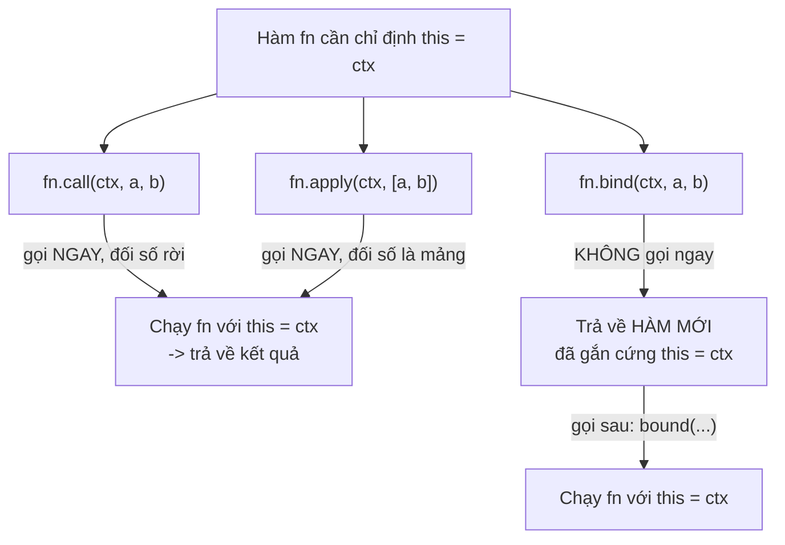

# call, apply, bind và Function Borrowing

`call`, `apply` và `bind` là ba phương thức cho phép bạn **tự quyết định** giá trị của `this` khi gọi một hàm, thay vì để JavaScript tự chọn. `call` và `apply` gọi hàm ngay lập tức (khác nhau ở cách truyền tham số), còn `bind` tạo ra một hàm mới đã "gắn cứng" `this` để dùng sau. Nhờ vậy ta có thể làm **function borrowing** (mượn hàm — dùng lại một hàm của đối tượng này cho đối tượng khác), một kỹ thuật hữu ích mà người mới nên biết.

[](pathname:///img/javascript/call-apply-bind.webp)

---

:::note[Ghi nhớ nhanh]

- ⭐ **Cả ba đều để tự ép `this`** — thay vì để JavaScript tự chọn, bạn chỉ định `this` khi gọi hàm, giải bài toán mất `this` khi tách method hoặc truyền callback.
- **`call` vs `apply`** — cả hai gọi hàm **ngay**, chỉ khác cách truyền đối số: `call(ctx, a, b)` rời, `apply(ctx, [a, b])` là mảng.
- ⭐ **`bind` trả về HÀM MỚI** — không gọi ngay mà gắn cứng `this` để dùng sau, còn preset được đối số (partial application, vd `add.bind(null, 5)`).
- **Function borrowing** — mượn method của object/class khác qua `.call`, ví dụ `Array.prototype.slice.call(obj)` hay `Object.prototype.toString.call(x)` để check type.
- **Không tác dụng với arrow** — arrow đã chốt `this` lexical nên `call`/`apply`/`bind` bị bỏ qua đối số `this`.
- **Năm 2026 ít dùng hơn** — arrow, class field, rest/spread và React hooks đã thay thế, nhưng vẫn cần hiểu để đọc code legacy và viết utility.

:::

---

## Mục lục

- [Vì sao call/apply/bind ra đời?](#vì-sao-callapplybind-ra-đời)
- [Tại sao cần?](#tại-sao-cần)
- [call()](#call)
- [apply()](#apply)
- [bind()](#bind)
- [Function Borrowing](#function-borrowing)
- [So sánh tổng kết](#so-sánh-tổng-kết)
- [Câu hỏi phỏng vấn](#câu-hỏi-phỏng-vấn)

---

## Vì sao call/apply/bind ra đời?

**Vấn đề:**

Trong JavaScript, `this` được quyết định **lúc gọi hàm**, không phải
lúc định nghĩa. Khi tách method khỏi object, hoặc truyền method làm
callback (`setTimeout`, event listener), `this` bị mất:

```js
const user = {
  name: "An",
  greet() {
    console.log(`Hello, ${this.name}`);
  },
};

const fn = user.greet; // tách method khỏi object
fn(); // "Hello, undefined" — this không còn là user

setTimeout(user.greet, 100); // "Hello, undefined" — this = window/undefined
```

Ta cần một **cách ép `this`** về đúng object mong muốn.

**Giải pháp:**

```js
fn.call(user);  // gọi ngay, this = user → "Hello, An"
fn.apply(user); // giống call, nhưng đối số truyền dưới dạng mảng

const bound = user.greet.bind(user); // tạo HÀM MỚI gắn cứng this
setTimeout(bound, 100); // "Hello, An" — this giữ nguyên là user
```

- `call(thisArg, ...args)` — gọi ngay với `this` được chỉ định, đối
  số truyền **rời**.
- `apply(thisArg, argsArray)` — giống `call`, nhưng đối số là **mảng**.
- `bind(thisArg)` — tạo **hàm mới** gắn cứng `this`, **không gọi ngay**.

Sơ đồ dưới tóm tắt khác biệt cốt lõi: `call`/`apply` thực thi hàm **ngay
lập tức** (chỉ khác cách truyền đối số), còn `bind` **trả về một hàm mới**
đã gắn cứng `this` để gọi sau này:



:::tip[Dùng thực tế]

- **Method borrowing**: mượn `Array.prototype.slice.call(arguments)`
  để biến `arguments` thành mảng thật (trước khi có rest params).
- **Giữ `this` cho callback**: `this.handler.bind(this)` trong class
  (trước khi có class fields) để event handler không mất context.
- **Partial application**: dùng `bind` preset sẵn vài đối số, tạo hàm
  chuyên biệt (vd `add.bind(null, 5)`).
- **Variadic trước spread**: `Math.max.apply(null, arr)` để tìm max
  của một mảng (trước khi có `Math.max(...arr)`).

:::

---

## Tại sao cần?

Ba method này cho phép **chỉ định `this`** khi gọi function — hữu ích
khi:

- Mượn method từ object khác.
- Cố định `this` cho callback.
- Wrap function với context cụ thể.

---

## call()

Gọi function ngay, truyền `this` + argument **rời**:

```js
function greet(greeting, name) {
  console.log(`${greeting}, ${this.title} ${name}`);
}

const ctx = { title: "Mr." };

greet.call(ctx, "Hello", "An");
// "Hello, Mr. An"
```

---

## apply()

Giống `call`, nhưng truyền argument dưới dạng **mảng**:

```js
greet.apply(ctx, ["Hello", "An"]);
// "Hello, Mr. An"
```

Lịch sử: trước rest/spread (ES6), `apply` dùng để truyền mảng làm
argument:

```js
const nums = [1, 5, 3, 7];

Math.max.apply(null, nums); // 7
Math.max(...nums);          // 7 — hiện đại hơn
```

`call`/`apply` **thực thi function ngay**.

---

## bind()

Trả về **function mới** với `this` đã cố định — **không gọi ngay**:

```js
const bound = greet.bind(ctx, "Hi");

bound("An");    // "Hi, Mr. An"
bound("Bình");  // "Hi, Mr. Bình"
```

Có thể bind partial — preset một số argument:

```js
function add(a, b, c) {
  return a + b + c;
}

const add5 = add.bind(null, 5);
add5(10, 20); // 35

const add5_10 = add.bind(null, 5, 10);
add5_10(20);  // 35
```

`this` ở đây = `null` vì hàm không dùng `this`.

:::info[Phân tích]

**Vấn đề lịch sử của bind trong React class component:**

```js
class Counter extends React.Component {
  constructor() {
    super();
    this.state = { count: 0 };
    this.handleClick = this.handleClick.bind(this); // bắt buộc
  }

  handleClick() {
    this.setState({ count: this.state.count + 1 });
  }

  render() {
    return <button onClick={this.handleClick}>+1</button>;
  }
}
```

Mỗi lần render, `this.handleClick` cần tham chiếu ổn định — không
bind, hoặc bind inline `onClick={() => this.handleClick()}` sẽ tạo
function mới mỗi render → re-render child không cần thiết.

React hooks (function component) loại bỏ vấn đề này hoàn toàn — không
còn `this`.

:::

:::warning[Cần lưu ý]

**`bind` trên arrow function không hoạt động:**

```js
const fn = () => console.log(this);
const bound = fn.bind({ x: 1 });
bound(); // window/undefined — bind bị bỏ qua
```

Arrow đã capture `this` lexical, không thể override. Cũng vậy với
`call`/`apply` — argument đầu tiên (this) bị ignore với arrow.

:::

---

## Function Borrowing

**Mượn method** từ object/class khác:

```js
const arr1 = [1, 2, 3];
const obj = { 0: "a", 1: "b", 2: "c", length: 3 };

// "Mượn" slice của Array để áp dụng cho object array-like
const result = Array.prototype.slice.call(obj);
// ["a", "b", "c"] — chuyển array-like thành Array thật

// Hiện đại — Array.from
Array.from(obj); // tương đương
```

Mượn `toString` để check type chính xác:

```js
Object.prototype.toString.call([]);        // "[object Array]"
Object.prototype.toString.call(null);      // "[object Null]"
Object.prototype.toString.call(new Date()); // "[object Date]"
```

Mượn method giữa class:

```js
class Animal {
  constructor(name) { this.name = name; }
  greet() { console.log(`Hi, I'm ${this.name}`); }
}

class Robot {
  constructor(name) { this.name = name; }
}

const r = new Robot("R2D2");
Animal.prototype.greet.call(r);
// "Hi, I'm R2D2" — Robot "mượn" greet
```

:::tip[Mẹo]

**Convert arguments-like / NodeList sang Array** — pattern cũ và mới:

```js
// Cũ
const args = Array.prototype.slice.call(arguments);
const nodes = Array.prototype.slice.call(document.querySelectorAll("p"));

// Mới
const args = [...arguments]; // không hoạt động trong arrow
const args = [...args];      // rest parameter — tốt nhất
const nodes = [...document.querySelectorAll("p")];
const nodes = Array.from(document.querySelectorAll("p"));
```

`Array.from` + spread đã thay thế `slice.call` trong code hiện đại.

:::

---

## So sánh tổng kết

| | `call` | `apply` | `bind` |
|--|--------|---------|--------|
| Gọi ngay? | **Có** | **Có** | Không |
| Argument | Rời | Mảng | Rời (partial) |
| Trả về | Kết quả function | Kết quả function | Function mới |
| Use case | Mượn method 1 lần | Mượn method với mảng | Preset context cho callback |

```js
fn.call(ctx, 1, 2, 3);    // ngay
fn.apply(ctx, [1, 2, 3]); // ngay
fn.bind(ctx, 1, 2, 3);    // → function mới
```

:::info[Phân tích]

**Năm 2026, `call`/`apply`/`bind` ít dùng** hơn trước nhờ:

- **Arrow function** giữ `this` lexical → không cần bind.
- **Class field** với arrow tự bind.
- **Rest/spread** thay thế `apply` cho variadic argument.
- **React hooks**, Vue composition API loại bỏ `this` hoàn toàn.

Nhưng vẫn cần hiểu vì:

- Đọc code legacy.
- Polyfill cho built-in (vd tạo `bind` thủ công trong phỏng vấn).
- Function borrowing trong utility (`Object.prototype.toString.call`).
- Tạo decorator/middleware cần wrap function với context.

:::

---

## Câu hỏi phỏng vấn

Những câu thường gặp về chủ đề này. Tự trả lời trước, rồi bấm **Xem đáp án** để đối chiếu.

**1. `this` trong JavaScript được quyết định lúc định nghĩa hàm hay lúc gọi hàm? Điều đó dẫn tới lỗi gì khi bạn tách một method ra khỏi object?**

<details className="qa">
<summary>Xem đáp án</summary>

`this` được quyết định **lúc gọi hàm**, không phải lúc định nghĩa. Engine nhìn vào *cách* hàm được gọi: `user.greet()` thì `this` là `user`, còn `fn()` gọi trần thì `this` là `undefined` (strict mode) hoặc `globalThis`.

Vì vậy khi tách method khỏi object, sợi dây liên kết với object bị đứt:

```js
const user = {
  name: "An",
  greet() { console.log(`Hello, ${this.name}`); },
};

const fn = user.greet; // chỉ copy tham chiếu tới hàm
fn(); // "Hello, undefined" — this không còn là user
```

Biến `fn` chỉ giữ **bản thân hàm**, không giữ object đứng trước dấu chấm. Đây chính là lỗi kinh điển khi truyền method làm callback (`setTimeout`, `addEventListener`, `map`) và là lý do `call`/`apply`/`bind` tồn tại.

</details>

**2. `call`, `apply`, `bind` sinh ra để giải quyết vấn đề gì mà cách gọi hàm thông thường không giải quyết được?**

<details className="qa">
<summary>Xem đáp án</summary>

Cách gọi thông thường chỉ cho bạn **một** cơ chế gán `this`: object đứng trước dấu chấm. Nếu hàm không được gọi qua object đó — vì đã tách ra biến, vì truyền làm callback, hoặc vì bạn muốn dùng hàm của object A cho object B — thì bạn hoàn toàn không có cách nào chỉ định `this`.

Ba method này cho phép **tự ép `this`**:

- `call(thisArg, ...args)` — gọi ngay, đối số truyền rời.
- `apply(thisArg, argsArray)` — gọi ngay, đối số là mảng.
- `bind(thisArg, ...args)` — không gọi ngay, trả về hàm mới đã gắn cứng `this`.

Nhờ đó giải được ba bài toán thực tế: giữ `this` cho callback (`bind`), mượn method từ object/class khác (function borrowing), và wrap hàm với context cố định (decorator, middleware).

</details>

**3. So sánh `call` và `apply`: khác nhau đúng ở điểm nào, và khi nào bạn chọn `apply`?**

<details className="qa">
<summary>Xem đáp án</summary>

Hai method **giống hệt nhau** về hành vi — đều gọi hàm ngay lập tức với `this` do bạn chỉ định — chỉ khác **cách truyền đối số**.

| | `call` | `apply` |
|---|---|---|
| Đối số | Rời: `fn.call(ctx, a, b)` | Mảng: `fn.apply(ctx, [a, b])` |
| Gọi ngay? | Có | Có |
| Trả về | Kết quả của hàm | Kết quả của hàm |

```js
greet.call(ctx, "Hello", "An");    // "Hello, Mr. An"
greet.apply(ctx, ["Hello", "An"]); // "Hello, Mr. An"
```

Chọn `apply` khi đối số **đã nằm sẵn trong một mảng** và bạn không biết trước số lượng — điển hình là `Math.max.apply(null, nums)` thời trước ES6. Ngày nay spread (`fn.call(ctx, ...arr)` hoặc `Math.max(...nums)`) đã thay thế gần hết vai trò này, nên `apply` chủ yếu còn gặp trong code cũ.

</details>

**4. `bind` khác `call`/`apply` ở chỗ nào? `bind` trả về cái gì, và nó có gọi hàm ngay không?**

<details className="qa">
<summary>Xem đáp án</summary>

Khác biệt cốt lõi: `call`/`apply` **thực thi hàm ngay**, còn `bind` **không gọi gì cả** — nó trả về một **hàm mới** (bound function) đã gắn cứng `this`, để bạn gọi sau.

```js
greet.call(ctx, "Hi", "An"); // chạy ngay

const bound = greet.bind(ctx, "Hi"); // KHÔNG chạy, trả về hàm mới
bound("An");   // "Hi, Mr. An"
bound("Bình"); // "Hi, Mr. Bình" — dùng lại được nhiều lần
```

| | `call`/`apply` | `bind` |
|---|---|---|
| Gọi ngay? | Có | Không |
| Trả về | Kết quả hàm | Hàm mới |
| Dùng lại | Mỗi lần phải viết lại | Gọi bao nhiêu lần cũng được |

Vì trả về hàm mới nên `bind` là lựa chọn duy nhất khi bạn cần **đưa hàm cho ai đó gọi sau** — `setTimeout(user.greet.bind(user), 100)`, event handler, hoặc preset đối số (partial application).

</details>

**5. Cho `user = { name: "An", greet() { console.log(this.name) } }`, đoạn `const fn = user.greet; fn();` in ra gì? Giải thích vì sao. Sửa lại bằng `call` và bằng `bind` khác nhau thế nào?**

<details className="qa">
<summary>Xem đáp án</summary>

In ra **`undefined`** (trong module/strict mode thì ném `TypeError` vì `this` là `undefined`).

Lý do: `const fn = user.greet` chỉ copy **tham chiếu tới hàm**, không copy object chủ. Khi gọi `fn()` không có gì đứng trước dấu chấm, nên `this` không phải `user` → `this.name` là `undefined`.

Hai cách sửa:

```js
fn.call(user);               // "An" — gọi NGAY một lần với this = user

const bound = fn.bind(user); // chưa chạy gì
bound();                     // "An" — hàm mới, gọi lúc nào cũng đúng this
setTimeout(bound, 100);      // "An" — dùng được cho callback
```

Khác biệt: `call` là **hành động một lần** — bạn phải đang ở đúng thời điểm muốn chạy. `bind` **tạo ra công cụ** — một hàm dùng lại được, phù hợp khi phải giao hàm cho bên khác gọi hộ.

</details>

**6. `setTimeout(user.greet, 100)` in ra gì? Vì sao truyền method làm callback lại mất `this`?**

<details className="qa">
<summary>Xem đáp án</summary>

In ra `"Hello, undefined"` — `this.name` không lấy được.

Nguyên nhân giống câu trên: khi viết `setTimeout(user.greet, 100)`, JavaScript **đánh giá biểu thức `user.greet` ngay tại đó** và chỉ truyền đi **giá trị hàm**. Object `user` không đi kèm. Sau 100ms, `setTimeout` gọi hàm đó theo kiểu gọi trần, nên `this` trở thành `globalThis` (browser) hoặc object `Timeout` (Node), chứ không phải `user`.

Cách sửa:

```js
setTimeout(user.greet.bind(user), 100); // bind — chuẩn nhất
setTimeout(() => user.greet(), 100);    // arrow bọc ngoài, gọi qua dấu chấm
```

Bài học tổng quát: **truyền hàm đi nơi khác là mất context**. Bất kỳ chỗ nào nhận callback — `setTimeout`, `addEventListener`, `map`, `forEach` — đều dính lỗi này.

</details>

**7. Partial application là gì? Giải thích `add.bind(null, 5)` làm gì và vì sao đối số đầu là `null`.**

<details className="qa">
<summary>Xem đáp án</summary>

**Partial application** là kỹ thuật preset sẵn một phần đối số của hàm, tạo ra hàm mới chuyên biệt hơn, chỉ cần nhận phần đối số còn lại.

```js
function add(a, b, c) { return a + b + c; }

const add5 = add.bind(null, 5);
add5(10, 20); // 35 — 5 đã được chốt cho a

const add5_10 = add.bind(null, 5, 10);
add5_10(20);  // 35
```

Đối số thứ hai trở đi của `bind` được **ghép vào đầu** danh sách tham số, đối số lúc gọi nối tiếp phía sau.

Vì sao `null`? Vì tham số đầu tiên của `bind` **bắt buộc** là `thisArg`, mà hàm `add` hoàn toàn không dùng tới `this`. Truyền `null` (hoặc `undefined`) là cách nói "tôi không quan tâm `this`, tôi chỉ muốn preset đối số". Ở non-strict mode `null` sẽ bị thay bằng `globalThis`, nhưng điều đó vô hại khi hàm không đụng tới `this`.

</details>

**8. Nếu `bind` hai lần (`fn.bind(a).bind(b)`) thì `this` cuối cùng là `a` hay `b`? Giải thích cơ chế bên dưới.**

<details className="qa">
<summary>Xem đáp án</summary>

`this` cuối cùng là **`a`** — lần `bind` đầu tiên thắng, các lần sau vô hiệu.

```js
function show() { console.log(this.name); }
const a = { name: "A" };
const b = { name: "B" };

show.bind(a).bind(b)(); // "A"
```

Cơ chế: `fn.bind(a)` không sửa `fn`, nó tạo ra một **hàm bọc mới** (bound function) mà bên trong luôn gọi `fn` với `this = a` — đây là quy tắc cứng, không thể ghi đè. Khi bạn `.bind(b)` lên hàm bọc đó, bạn chỉ đang gắn `this = b` cho **lớp bọc ngoài cùng**. Nhưng lớp bọc ngoài khi chạy lại gọi lớp trong, và lớp trong đã tự quyết định `this = a` rồi, nên `b` bị bỏ qua.

Hệ quả tương tự: gọi `call`/`apply` trên một bound function cũng không đổi được `this`. Bound function là "khóa một chiều".

</details>

**9. Gọi `call`/`apply`/`bind` trên một arrow function thì chuyện gì xảy ra? Vì sao?**

<details className="qa">
<summary>Xem đáp án</summary>

Không lỗi, hàm vẫn chạy — nhưng **đối số `this` bị bỏ qua hoàn toàn**.

```js
const fn = () => console.log(this);

fn.call({ x: 1 });   // vẫn là this lexical, không phải {x: 1}
fn.apply({ x: 1 });  // tương tự
fn.bind({ x: 1 })(); // tương tự
```

Lý do: arrow function **không có `this` của riêng nó**. Nó không tạo binding `this` khi được gọi, mà lấy `this` từ scope bao ngoài tại nơi nó được **định nghĩa** (lexical `this`), và giá trị đó được chốt vĩnh viễn. Vì không có chỗ nào để ghi `this` vào, `call`/`apply`/`bind` chẳng có gì để thay đổi.

Đối số thường thì vẫn hoạt động bình thường: `((a, b) => a + b).call(null, 1, 2)` trả về `3`. Chỉ riêng `thisArg` là vô tác dụng. Đây cũng là lý do arrow function không nên dùng làm method khi cần `this`, và không dùng được với `new`.

</details>

**10. Function borrowing là gì? Giải thích `Array.prototype.slice.call(obj)` hoạt động ra sao với một object array-like, và điều kiện để nó chạy đúng.**

<details className="qa">
<summary>Xem đáp án</summary>

**Function borrowing** là "mượn" method của object/class này để dùng cho object khác vốn không hề kế thừa nó, bằng cách ép `this` qua `call`/`apply`.

```js
const obj = { 0: "a", 1: "b", 2: "c", length: 3 };
Array.prototype.slice.call(obj); // ["a", "b", "c"] — Array thật
```

`slice` không quan tâm `this` có thực sự là `Array` hay không. Bên trong, nó chỉ đọc `this.length` rồi lặp đọc `this[0]`, `this[1]`... và nhồi vào một mảng mới. Vì `obj` có đủ những thứ đó, `slice` chạy ngon lành.

Điều kiện để chạy đúng: object phải **array-like** — có thuộc tính `length` là số, và các key số `0..length-1`. Thiếu `length` thì kết quả là mảng rỗng; key không liên tục thì phần tử tương ứng là `undefined`.

Code hiện đại thay bằng `Array.from(obj)` hoặc spread — lưu ý spread yêu cầu object phải iterable, điều kiện chặt hơn array-like.

</details>

**11. Vì sao `Object.prototype.toString.call(x)` kiểm tra kiểu chính xác hơn `typeof x`? Cho ví dụ `typeof` cho kết quả gây hiểu nhầm.**

<details className="qa">
<summary>Xem đáp án</summary>

`typeof` chỉ phân biệt được vài kiểu primitive, còn **mọi object đều trả về `"object"`** — không tách được array, `null`, `Date`, `RegExp`, `Map`...

```js
typeof null;         // "object"   ← bug lịch sử của JS
typeof [];           // "object"   ← không biết là mảng
typeof new Date();   // "object"
typeof /abc/;        // "object"
typeof function(){}; // "function" ← riêng hàm thì ổn
```

`Object.prototype.toString` đọc một nhãn nội bộ của object và trả về chuỗi dạng `"[object Xxx]"` nên phân biệt chi tiết hơn. Phải dùng `.call` vì cần **mượn** đúng bản gốc trên `Object.prototype` — nếu gọi `x.toString()` trực tiếp sẽ trúng phiên bản đã bị override (ví dụ `[1,2].toString()` cho ra `"1,2"`).

```js
Object.prototype.toString.call(null);       // "[object Null]"
Object.prototype.toString.call([]);         // "[object Array]"
Object.prototype.toString.call(new Date()); // "[object Date]"
```

Thực tế ngày nay: dùng `Array.isArray()` cho mảng, `x === null` cho null; `toString.call` để dành cho hàm check type tổng quát trong utility.

</details>

**12. Trước ES6, `Math.max.apply(null, arr)` giải quyết việc gì? Cách viết hiện đại tương đương là gì, và có giới hạn nào khi mảng cực lớn?**

<details className="qa">
<summary>Xem đáp án</summary>

`Math.max` nhận đối số **rời** (`Math.max(1, 5, 3)`), không nhận mảng — `Math.max([1, 5, 3])` trả về `NaN`. Trước ES6 chưa có spread, nên `apply` là cách duy nhất để "rải" một mảng thành danh sách đối số:

```js
const nums = [1, 5, 3, 7];

Math.max.apply(null, nums); // 7 — cách cũ
Math.max(...nums);          // 7 — cách hiện đại
```

`null` ở đây là `thisArg` mà `Math.max` không dùng tới.

**Giới hạn với mảng cực lớn:** cả hai cách đều đẩy từng phần tử lên **call stack** dưới dạng đối số. Khi mảng quá lớn (thường là hàng chục đến hàng trăm nghìn phần tử, tùy engine), sẽ ném `RangeError: Maximum call stack size exceeded`. Với dữ liệu lớn nên duyệt thủ công:

```js
const max = nums.reduce((m, n) => (n > m ? n : m), -Infinity);
```

</details>

**13. Hãy tự viết polyfill `Function.prototype.myBind` — cần xử lý những gì (đối số preset, đối số lúc gọi, `this`)?**

<details className="qa">
<summary>Xem đáp án</summary>

Ba việc phải xử lý: giữ `thisArg`, giữ đối số preset lúc bind, và nối thêm đối số lúc gọi.

```js
Function.prototype.myBind = function (thisArg, ...presetArgs) {
  const targetFn = this; // "this" chính là hàm đang được bind

  if (typeof targetFn !== "function") {
    throw new TypeError("myBind phải gọi trên một function");
  }

  return function (...callArgs) {
    // preset trước, đối số lúc gọi nối sau
    return targetFn.apply(thisArg, [...presetArgs, ...callArgs]);
  };
};
```

Điểm dễ quên:

- `this` bên trong `myBind` **là hàm gốc**, vì ta gọi theo kiểu `fn.myBind(...)`.
- Phải **nối** `presetArgs` với `callArgs` theo đúng thứ tự, không ghi đè nhau.
- Hàm trả về nên là `function` thường chứ không phải arrow, để còn hỗ trợ `new`.
- Bản đầy đủ cần xử lý thêm trường hợp gọi bằng `new` (khi đó `thisArg` bị bỏ qua) và giữ prototype chain của hàm gốc.

</details>

**14. Chuyện gì xảy ra khi dùng `new` trên một hàm đã `bind`? Giá trị `this` lúc đó là gì?**

<details className="qa">
<summary>Xem đáp án</summary>

`new` **thắng** `bind`: `thisArg` đã gắn cứng bị **bỏ qua**, `this` là object mới do `new` tạo ra. Các đối số preset thì vẫn được giữ.

```js
function Point(x, y) {
  this.x = x;
  this.y = y;
}

const Bound = Point.bind({ fake: true }, 10); // ép this = {fake:true}, preset x = 10

const p = new Bound(20);
p.x; // 10 — preset vẫn có hiệu lực
p.y; // 20
p.fake;                       // undefined — thisArg bị bỏ qua
p instanceof Point;           // true
```

Lý do: bound function giữ tham chiếu tới hàm gốc. Khi được gọi bình thường, nó ép `this` theo `thisArg`. Nhưng khi gọi bằng `new`, engine đi theo đường "khởi tạo object" của hàm gốc — object mới được tạo và gán làm `this`, nên không còn chỗ cho `thisArg`.

Đây cũng là chi tiết hay bị bỏ sót khi viết polyfill `bind` ở câu trên.

</details>

**15. Trong React class component, vì sao phải viết `this.handleClick = this.handleClick.bind(this)` trong constructor? Kể các cách thay thế và đánh đổi của mỗi cách.**

<details className="qa">
<summary>Xem đáp án</summary>

Vì `onClick={this.handleClick}` chỉ **truyền hàm đi**, không gọi qua dấu chấm. Khi React gọi lại handler, `this` là `undefined` (thân class luôn ở strict mode) → `this.setState` ném lỗi. `bind(this)` trong constructor tạo bản gắn cứng `this`, và vì chỉ chạy một lần nên tham chiếu **ổn định qua các lần render**.

| Cách viết | Ưu | Nhược |
|---|---|---|
| `bind` trong constructor | Tham chiếu ổn định, không tạo hàm mới mỗi render | Dài dòng, dễ quên với method mới |
| Class field arrow: `handleClick = () => {}` | Gọn nhất, `this` lexical tự đúng | Method nằm trên instance chứ không trên prototype |
| `onClick={() => this.handleClick()}` | Viết nhanh, truyền tham số dễ | Tạo hàm **mới mỗi render** → child dùng `PureComponent`/`memo` bị re-render thừa |
| `onClick={this.handleClick.bind(this)}` | Không cần constructor | Cũng tạo hàm mới mỗi render — nhược điểm y hệt |

Trong code hiện đại, function component + hooks loại bỏ hoàn toàn `this` nên vấn đề này biến mất.

</details>

**16. Trong code hiện đại (arrow function, class field, rest/spread, hooks), `call`/`apply`/`bind` còn cần thiết không? Kể trường hợp thực tế vẫn bắt buộc phải dùng.**

<details className="qa">
<summary>Xem đáp án</summary>

Ít dùng hơn nhiều, nhưng **chưa lỗi thời**. Những thứ thay thế phần lớn nhu cầu cũ: arrow giữ `this` lexical, class field tự bind, rest/spread thay `apply`, hooks bỏ hẳn `this`.

Các trường hợp vẫn cần:

- **Function borrowing trong utility** — `Object.prototype.toString.call(x)` để check type, `Object.prototype.hasOwnProperty.call(obj, key)` để an toàn khi object có key tên `hasOwnProperty` hoặc được tạo bằng `Object.create(null)`.
- **Đọc và bảo trì code legacy** — `slice.call(arguments)`, `bind` trong React class component vẫn đầy trong codebase cũ.
- **Viết decorator / wrapper / middleware** — hàm bọc nhận `this` và đối số động rồi chuyển tiếp: `fn.apply(this, args)` trong các hàm `debounce`, `throttle`, `memoize`, logger.
- **Monkey-patch hoặc mock** built-in, thư viện: giữ nguyên context của hàm gốc khi gọi lại.
- **Câu hỏi phỏng vấn** — viết polyfill `bind`/`call` là bài test kinh điển để kiểm tra bạn hiểu `this` tới đâu.

</details>
