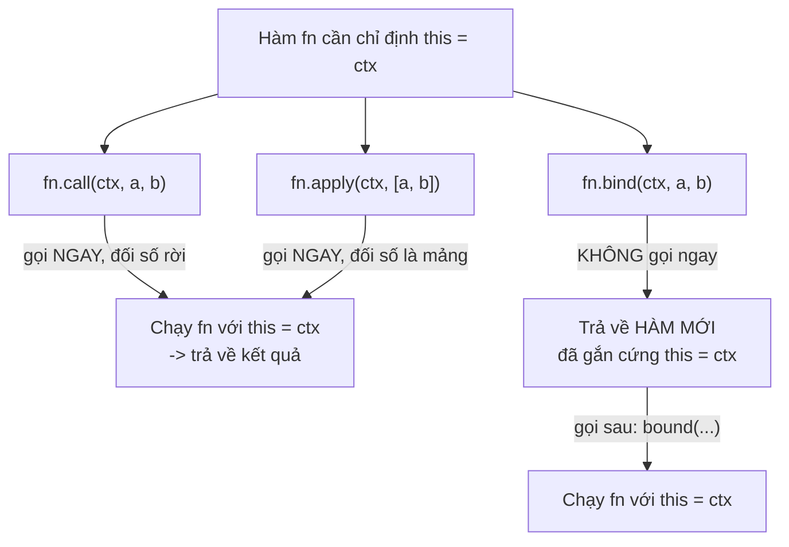

# call, apply, bind và Function Borrowing

`call`, `apply` và `bind` là ba phương thức cho phép bạn **tự quyết định** giá trị của `this` khi gọi một hàm, thay vì để JavaScript tự chọn. `call` và `apply` gọi hàm ngay lập tức (khác nhau ở cách truyền tham số), còn `bind` tạo ra một hàm mới đã "gắn cứng" `this` để dùng sau. Nhờ vậy ta có thể làm **function borrowing** (mượn hàm — dùng lại một hàm của đối tượng này cho đối tượng khác), một kỹ thuật hữu ích mà người mới nên biết.

---

:::note[Ghi nhớ nhanh]

- ⭐ **Cả ba đều để tự ép `this`** — thay vì để JavaScript tự chọn, bạn chỉ định `this` khi gọi hàm, giải bài toán mất `this` khi tách method hoặc truyền callback.
- **`call` vs `apply`** — cả hai gọi hàm **ngay**, chỉ khác cách truyền đối số: `call(ctx, a, b)` rời, `apply(ctx, [a, b])` là mảng.
- ⭐ **`bind` trả về HÀM MỚI** — không gọi ngay mà gắn cứng `this` để dùng sau, còn preset được đối số (partial application, vd `add.bind(null, 5)`).
- **Function borrowing** — mượn method của object/class khác qua `.call`, ví dụ `Array.prototype.slice.call(obj)` hay `Object.prototype.toString.call(x)` để check type.
- **Không tác dụng với arrow** — arrow đã chốt `this` lexical nên `call`/`apply`/`bind` bị bỏ qua đối số `this`.
- **Năm 2026 ít dùng hơn** — arrow, class field, rest/spread và React hooks đã thay thế, nhưng vẫn cần hiểu để đọc code legacy và viết utility.

:::

---

## Mục lục

- [Vì sao call/apply/bind ra đời?](#vì-sao-callapplybind-ra-đời)
- [Tại sao cần?](#tại-sao-cần)
- [call()](#call)
- [apply()](#apply)
- [bind()](#bind)
- [Function Borrowing](#function-borrowing)
- [So sánh tổng kết](#so-sánh-tổng-kết)
- [Câu hỏi phỏng vấn](#câu-hỏi-phỏng-vấn)

---

## Vì sao call/apply/bind ra đời?

**Vấn đề:**

Trong JavaScript, `this` được quyết định **lúc gọi hàm**, không phải
lúc định nghĩa. Khi tách method khỏi object, hoặc truyền method làm
callback (`setTimeout`, event listener), `this` bị mất:

```js
const user = {
  name: "An",
  greet() {
    console.log(`Hello, ${this.name}`);
  },
};

const fn = user.greet; // tách method khỏi object
fn(); // "Hello, undefined" — this không còn là user

setTimeout(user.greet, 100); // "Hello, undefined" — this = window/undefined
```

Ta cần một **cách ép `this`** về đúng object mong muốn.

**Giải pháp:**

```js
fn.call(user);  // gọi ngay, this = user → "Hello, An"
fn.apply(user); // giống call, nhưng đối số truyền dưới dạng mảng

const bound = user.greet.bind(user); // tạo HÀM MỚI gắn cứng this
setTimeout(bound, 100); // "Hello, An" — this giữ nguyên là user
```

- `call(thisArg, ...args)` — gọi ngay với `this` được chỉ định, đối
  số truyền **rời**.
- `apply(thisArg, argsArray)` — giống `call`, nhưng đối số là **mảng**.
- `bind(thisArg)` — tạo **hàm mới** gắn cứng `this`, **không gọi ngay**.

Sơ đồ dưới tóm tắt khác biệt cốt lõi: `call`/`apply` thực thi hàm **ngay
lập tức** (chỉ khác cách truyền đối số), còn `bind` **trả về một hàm mới**
đã gắn cứng `this` để gọi sau này:



:::tip[Dùng thực tế]

- **Method borrowing**: mượn `Array.prototype.slice.call(arguments)`
  để biến `arguments` thành mảng thật (trước khi có rest params).
- **Giữ `this` cho callback**: `this.handler.bind(this)` trong class
  (trước khi có class fields) để event handler không mất context.
- **Partial application**: dùng `bind` preset sẵn vài đối số, tạo hàm
  chuyên biệt (vd `add.bind(null, 5)`).
- **Variadic trước spread**: `Math.max.apply(null, arr)` để tìm max
  của một mảng (trước khi có `Math.max(...arr)`).

:::

---

## Tại sao cần?

Ba method này cho phép **chỉ định `this`** khi gọi function — hữu ích
khi:

- Mượn method từ object khác.
- Cố định `this` cho callback.
- Wrap function với context cụ thể.

---

## call()

Gọi function ngay, truyền `this` + argument **rời**:

```js
function greet(greeting, name) {
  console.log(`${greeting}, ${this.title} ${name}`);
}

const ctx = { title: "Mr." };

greet.call(ctx, "Hello", "An");
// "Hello, Mr. An"
```

---

## apply()

Giống `call`, nhưng truyền argument dưới dạng **mảng**:

```js
greet.apply(ctx, ["Hello", "An"]);
// "Hello, Mr. An"
```

Lịch sử: trước rest/spread (ES6), `apply` dùng để truyền mảng làm
argument:

```js
const nums = [1, 5, 3, 7];

Math.max.apply(null, nums); // 7
Math.max(...nums);          // 7 — hiện đại hơn
```

`call`/`apply` **thực thi function ngay**.

---

## bind()

Trả về **function mới** với `this` đã cố định — **không gọi ngay**:

```js
const bound = greet.bind(ctx, "Hi");

bound("An");    // "Hi, Mr. An"
bound("Bình");  // "Hi, Mr. Bình"
```

Có thể bind partial — preset một số argument:

```js
function add(a, b, c) {
  return a + b + c;
}

const add5 = add.bind(null, 5);
add5(10, 20); // 35

const add5_10 = add.bind(null, 5, 10);
add5_10(20);  // 35
```

`this` ở đây = `null` vì hàm không dùng `this`.

:::info[Phân tích]

**Vấn đề lịch sử của bind trong React class component:**

```js
class Counter extends React.Component {
  constructor() {
    super();
    this.state = { count: 0 };
    this.handleClick = this.handleClick.bind(this); // bắt buộc
  }

  handleClick() {
    this.setState({ count: this.state.count + 1 });
  }

  render() {
    return <button onClick={this.handleClick}>+1</button>;
  }
}
```

Mỗi lần render, `this.handleClick` cần tham chiếu ổn định — không
bind, hoặc bind inline `onClick={() => this.handleClick()}` sẽ tạo
function mới mỗi render → re-render child không cần thiết.

React hooks (function component) loại bỏ vấn đề này hoàn toàn — không
còn `this`.

:::

:::warning[Cần lưu ý]

**`bind` trên arrow function không hoạt động:**

```js
const fn = () => console.log(this);
const bound = fn.bind({ x: 1 });
bound(); // window/undefined — bind bị bỏ qua
```

Arrow đã capture `this` lexical, không thể override. Cũng vậy với
`call`/`apply` — argument đầu tiên (this) bị ignore với arrow.

:::

---

## Function Borrowing

**Mượn method** từ object/class khác:

```js
const arr1 = [1, 2, 3];
const obj = { 0: "a", 1: "b", 2: "c", length: 3 };

// "Mượn" slice của Array để áp dụng cho object array-like
const result = Array.prototype.slice.call(obj);
// ["a", "b", "c"] — chuyển array-like thành Array thật

// Hiện đại — Array.from
Array.from(obj); // tương đương
```

Mượn `toString` để check type chính xác:

```js
Object.prototype.toString.call([]);        // "[object Array]"
Object.prototype.toString.call(null);      // "[object Null]"
Object.prototype.toString.call(new Date()); // "[object Date]"
```

Mượn method giữa class:

```js
class Animal {
  constructor(name) { this.name = name; }
  greet() { console.log(`Hi, I'm ${this.name}`); }
}

class Robot {
  constructor(name) { this.name = name; }
}

const r = new Robot("R2D2");
Animal.prototype.greet.call(r);
// "Hi, I'm R2D2" — Robot "mượn" greet
```

:::tip[Mẹo]

**Convert arguments-like / NodeList sang Array** — pattern cũ và mới:

```js
// Cũ
const args = Array.prototype.slice.call(arguments);
const nodes = Array.prototype.slice.call(document.querySelectorAll("p"));

// Mới
const args = [...arguments]; // không hoạt động trong arrow
const args = [...args];      // rest parameter — tốt nhất
const nodes = [...document.querySelectorAll("p")];
const nodes = Array.from(document.querySelectorAll("p"));
```

`Array.from` + spread đã thay thế `slice.call` trong code hiện đại.

:::

---

## So sánh tổng kết

| | `call` | `apply` | `bind` |
|--|--------|---------|--------|
| Gọi ngay? | **Có** | **Có** | Không |
| Argument | Rời | Mảng | Rời (partial) |
| Trả về | Kết quả function | Kết quả function | Function mới |
| Use case | Mượn method 1 lần | Mượn method với mảng | Preset context cho callback |

```js
fn.call(ctx, 1, 2, 3);    // ngay
fn.apply(ctx, [1, 2, 3]); // ngay
fn.bind(ctx, 1, 2, 3);    // → function mới
```

:::info[Phân tích]

**Năm 2026, `call`/`apply`/`bind` ít dùng** hơn trước nhờ:

- **Arrow function** giữ `this` lexical → không cần bind.
- **Class field** với arrow tự bind.
- **Rest/spread** thay thế `apply` cho variadic argument.
- **React hooks**, Vue composition API loại bỏ `this` hoàn toàn.

Nhưng vẫn cần hiểu vì:

- Đọc code legacy.
- Polyfill cho built-in (vd tạo `bind` thủ công trong phỏng vấn).
- Function borrowing trong utility (`Object.prototype.toString.call`).
- Tạo decorator/middleware cần wrap function với context.

:::

---

## Câu hỏi phỏng vấn

Những câu thường gặp về chủ đề này. Tự trả lời trước, rồi đối chiếu lại với nội dung phía trên.

1. `this` trong JavaScript được quyết định lúc **định nghĩa** hàm hay lúc **gọi** hàm? Điều đó dẫn tới lỗi gì khi bạn tách một method ra khỏi object?
2. `call`, `apply`, `bind` sinh ra để giải quyết vấn đề gì mà cách gọi hàm thông thường không giải quyết được?
3. So sánh `call` và `apply`: khác nhau đúng ở điểm nào, và khi nào bạn chọn `apply`?
4. `bind` khác `call`/`apply` ở chỗ nào? `bind` trả về cái gì, và nó có gọi hàm ngay không?
5. Cho `user = { name: "An", greet() { console.log(this.name) } }`, đoạn `const fn = user.greet; fn();` in ra gì? Giải thích vì sao. Sửa lại bằng `call` và bằng `bind` khác nhau thế nào?
6. `setTimeout(user.greet, 100)` in ra gì? Vì sao truyền method làm callback lại mất `this`?
7. Partial application là gì? Giải thích `add.bind(null, 5)` làm gì và vì sao đối số đầu là `null`.
8. Nếu `bind` hai lần (`fn.bind(a).bind(b)`) thì `this` cuối cùng là `a` hay `b`? Giải thích cơ chế bên dưới.
9. Gọi `call`/`apply`/`bind` trên một **arrow function** thì chuyện gì xảy ra? Vì sao?
10. Function borrowing là gì? Giải thích `Array.prototype.slice.call(obj)` hoạt động ra sao với một object array-like, và điều kiện để nó chạy đúng.
11. Vì sao `Object.prototype.toString.call(x)` kiểm tra kiểu chính xác hơn `typeof x`? Cho ví dụ `typeof` cho kết quả gây hiểu nhầm.
12. Trước ES6, `Math.max.apply(null, arr)` giải quyết việc gì? Cách viết hiện đại tương đương là gì, và có giới hạn nào khi mảng cực lớn?
13. Hãy tự viết polyfill `Function.prototype.myBind` — cần xử lý những gì (đối số preset, đối số lúc gọi, `this`)?
14. Chuyện gì xảy ra khi dùng `new` trên một hàm đã `bind`? Giá trị `this` lúc đó là gì?
15. Trong React class component, vì sao phải viết `this.handleClick = this.handleClick.bind(this)` trong constructor? Kể các cách thay thế và đánh đổi của mỗi cách.
16. Trong code hiện đại (arrow function, class field, rest/spread, hooks), `call`/`apply`/`bind` còn cần thiết không? Kể trường hợp thực tế vẫn bắt buộc phải dùng.
