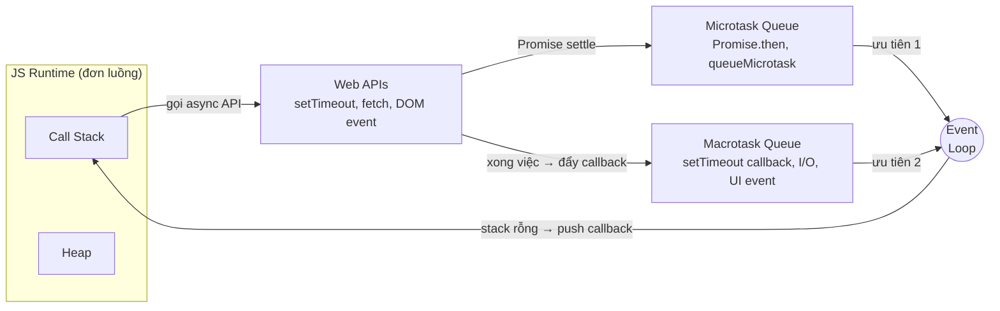
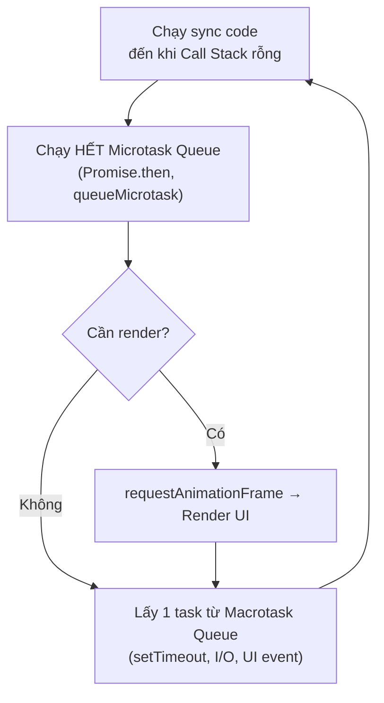

# Event Loop, setTimeout, setInterval

JavaScript chỉ chạy một việc tại một thời điểm, nhưng vẫn xử lý được nhiều tác vụ "song song" nhờ **event loop** (vòng lặp sự kiện — cơ chế điều phối, quyết định đoạn code nào được chạy tiếp theo). Khi cần hẹn giờ chạy code, ta dùng `setTimeout` (chạy một lần sau khoảng thời gian chờ) và `setInterval` (chạy lặp lại đều đặn). Bài này giúp người mới hiểu vì sao code bất đồng bộ lại chạy "sau" dù được viết "trước".

---

## 🎯 Cần nắm gì sau bài này?

:::note[Ghi nhớ nhanh]

- ⭐ **JS đơn luồng nhưng không bị treo nhờ event loop** — tác vụ chờ (timer, network, I/O) được đẩy ra ngoài, chỉ đăng ký callback rồi chạy tiếp; callback được chạy khi call stack rỗng.
- ⭐ **Microtask luôn ưu tiên hơn macrotask** — `Promise.then`/`queueMicrotask` (microtask) chạy hết trước khi tới một macrotask như `setTimeout`; vì vậy `Promise.then` chạy sớm hơn `setTimeout(0)`.
- **`setTimeout(fn, 0)` không chạy ngay** — có delay tối thiểu ~4ms và phải đợi call stack rỗng + flush microtask; muốn sớm nhất hãy dùng `queueMicrotask`.
- **`setInterval` bị drift** — nên so sánh `Date.now()` thay vì giả định mỗi tick đúng `1000ms`.
- **`requestAnimationFrame` đồng bộ với frame rate** — chạy trước render nên mượt hơn `setTimeout` cho animation; `AbortController` là cách hiện đại để hủy tác vụ async.

:::

---

## Mục lục

- [Vì sao event loop ra đời?](#vì-sao-event-loop-ra-đời)
- [Single-threaded model](#single-threaded-model)
- [Event Loop](#event-loop)
- [Macrotask vs Microtask](#macrotask-vs-microtask)
- [setTimeout và setInterval](#settimeout-và-setinterval)
- [queueMicrotask, requestAnimationFrame](#queuemicrotask-requestanimationframe)

---

## Vì sao event loop ra đời?

**Vấn đề:** JavaScript chạy **đơn luồng** (single-threaded) — chỉ làm một việc tại một thời điểm. Nếu một tác vụ chạy lâu (vòng lặp nặng, chờ mạng kiểu đồng bộ), **toàn bộ trang bị "đơ"**: không click, không cuộn, không gõ được gì cho đến khi tác vụ đó xong.

```js
// Vòng lặp nặng chạy đồng bộ → block luồng chính
function nangNe() {
  const start = Date.now();
  while (Date.now() - start < 5000) {
    // bận rộn 5 giây
  }
  console.log("Xong");
}

nangNe();
// Trong 5 giây này: trang treo cứng, nút bấm không phản hồi
```

**Giải pháp:** Event loop cho phép các việc tốn thời gian (network, timer, I/O) được **đẩy ra ngoài** luồng chính. JS chỉ **đăng ký callback** rồi **tiếp tục chạy** code phía sau. Khi việc kia xong, callback được đưa vào hàng đợi, và event loop sẽ chạy nó **lúc rảnh** (khi call stack rỗng). Nhờ vậy UI không bị treo dù JS chỉ có một luồng.

```js
// Bất đồng bộ → KHÔNG block luồng chính
console.log("Bắt đầu");

setTimeout(() => {
  console.log("Xong sau 5 giây");
}, 5000);

console.log("Vẫn chạy tiếp ngay lập tức");
// Trong 5 giây chờ: trang vẫn click, cuộn, gõ bình thường
```

Việc xếp lịch callback chia làm hai loại: **macrotask** (`setTimeout`, `setInterval`, I/O) và **microtask** (`Promise.then`, `queueMicrotask`) — trong đó **microtask được ưu tiên chạy trước**.

:::tip[Dùng thực tế]

- **Gọi API mà không treo UI:** `fetch()` chạy nền, UI vẫn mượt trong lúc chờ phản hồi.
- **Xử lý click khi đang đợi dữ liệu:** người dùng vẫn bấm nút, cuộn trang dù request chưa về.
- **Hẹn giờ:** `setTimeout`/`setInterval` cho thông báo, polling, debounce/throttle.
- **Đọc file & animation:** đọc file bất đồng bộ trong Node (I/O), hay `requestAnimationFrame` cho hiệu ứng mượt trên browser.

:::

---

## Single-threaded model

JavaScript chạy trên **một luồng duy nhất** — một thời điểm chỉ thực
thi một thứ. Nhưng vẫn xử lý được nhiều việc cùng lúc nhờ **event
loop** + I/O bất đồng bộ.

```js
console.log("1");
setTimeout(() => console.log("2"), 0);
console.log("3");

// In: 1, 3, 2
```

Tại sao `2` ra cuối? Vì `setTimeout` đẩy callback vào **queue**, được
chạy **sau** khi call stack rỗng.

---

## Event Loop

Mô hình runtime của JS gồm:

- **Call Stack** — function đang chạy.
- **Task Queue (Macrotask)** — `setTimeout`, `setInterval`, I/O, UI event.
- **Microtask Queue** — Promise callback, `queueMicrotask`, `MutationObserver`.
- **Heap** — bộ nhớ chứa object.



Event loop:

```
1. Pop frame từ call stack đến khi rỗng.
2. Chạy hết microtask queue.
3. (Browser) render UI nếu cần.
4. Lấy 1 task từ macrotask queue → push vào stack.
5. Lặp lại từ bước 1.
```

Một vòng lặp (tick) diễn ra như sau:



:::info[Phân tích]

**Microtask luôn ưu tiên hơn macrotask:**

```js
console.log("1");

setTimeout(() => console.log("2"), 0);

Promise.resolve().then(() => console.log("3"));

console.log("4");

// In: 1, 4, 3, 2
```

Giải thích:

1. Sync code: `1` → `4`.
2. Call stack rỗng → flush microtask queue → `3`.
3. Lấy macrotask → `2`.

Điều này có hệ quả thực tế: **Promise.then chạy nhanh hơn setTimeout(0)**.
Code dạng:

```js
function spam() {
  Promise.resolve().then(spam);
}
spam(); // browser bị treo
```

Vô tận microtask → browser không bao giờ chạy macrotask (cả render UI).
Trong khi:

```js
function spamMacro() {
  setTimeout(spamMacro, 0);
}
spamMacro(); // browser vẫn responsive
```

Browser được nghỉ giữa các macrotask để render.

:::

---

## Macrotask vs Microtask

| Loại | Bao gồm |
|------|---------|
| Macrotask | `setTimeout`, `setInterval`, `setImmediate` (Node), I/O, UI event |
| Microtask | `Promise.then`, `queueMicrotask`, `MutationObserver`, `process.nextTick` (Node) |

```js
setTimeout(() => console.log("macro 1"), 0);
queueMicrotask(() => console.log("micro 1"));
Promise.resolve().then(() => console.log("micro 2"));
setTimeout(() => console.log("macro 2"), 0);

// In: micro 1, micro 2, macro 1, macro 2
```

---

## setTimeout và setInterval

```js
const id = setTimeout(() => {
  console.log("Sau 1 giây");
}, 1000);

clearTimeout(id); // hủy
```

```js
const id = setInterval(() => {
  console.log("Mỗi giây");
}, 1000);

clearInterval(id);
```

:::warning[Cần lưu ý]

**`setTimeout(fn, 0)` KHÔNG chạy ngay**:

- Browser/Node có **delay tối thiểu** ~4ms (HTML spec).
- Callback đợi call stack rỗng + flush microtask.
- Nested timeout sâu → thêm clamping (làm chậm hơn).

Nếu thực sự muốn "chạy sớm nhất có thể sau code hiện tại":

```js
queueMicrotask(fn);     // sớm hơn setTimeout(0)
Promise.resolve().then(fn); // tương đương
```

`setInterval` có drift — không chạy đúng `1000ms` mỗi lần nếu callback
mất thời gian. Đếm chính xác nên dùng `Date.now()` so sánh:

```js
const start = Date.now();
setInterval(() => {
  const elapsed = Date.now() - start;
  // dùng elapsed thay vì giả định mỗi tick = 1000ms
}, 1000);
```

:::

---

## queueMicrotask, requestAnimationFrame

**`queueMicrotask`** — đẩy callback vào microtask queue:

```js
queueMicrotask(() => {
  // chạy ngay sau code hiện tại, trước macrotask
});
```

**`requestAnimationFrame` (browser)** — sync với frame rate (60fps):

```js
function animate() {
  // cập nhật DOM/canvas
  requestAnimationFrame(animate);
}

requestAnimationFrame(animate);
```

`rAF` chạy **trước render** — guarantee không drop frame:

```js
// Tệ — setTimeout có thể trễ
setTimeout(updateAnimation, 16);

// Tốt — đồng bộ với refresh rate
requestAnimationFrame(updateAnimation);
```

:::info[Phân tích]

**Thứ tự ưu tiên trong một "tick" của event loop** (browser):

1. **Sync code** trong call stack.
2. **Microtask queue** (cho đến khi rỗng).
3. **requestAnimationFrame** callback (nếu sắp render).
4. **Render** (paint, composite).
5. **Macrotask** (1 task).

Trong Node.js cũng tương tự nhưng có thêm `process.nextTick` (ưu tiên cao
nhất, cao hơn microtask) và các phase của libuv (timers, I/O callbacks,
poll, check, close).

Hiểu thứ tự này giúp debug:
- Tại sao state update không reflect trong DOM ngay.
- Tại sao animation giật.
- Tại sao một số bug chỉ xảy ra với data lớn (microtask starvation).

:::

:::tip[Mẹo]

**`AbortController` để cancel async**:

```js
const ctrl = new AbortController();

// Fetch
fetch(url, { signal: ctrl.signal });

// Sau X ms tự cancel
setTimeout(() => ctrl.abort(), 5000);

// Hủy thủ công
button.onclick = () => ctrl.abort();
```

Pattern modern thay cho việc track `setTimeout` id thủ công.

:::
