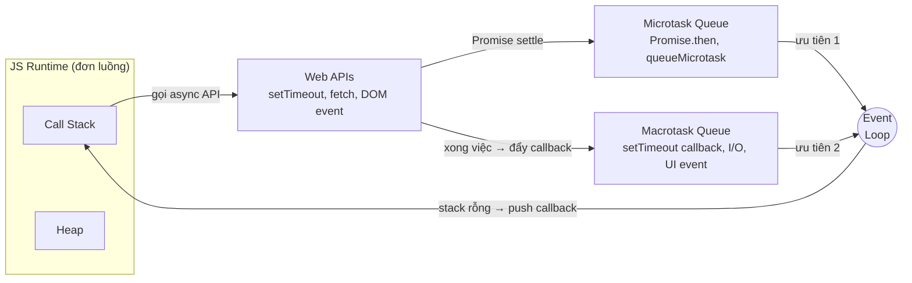
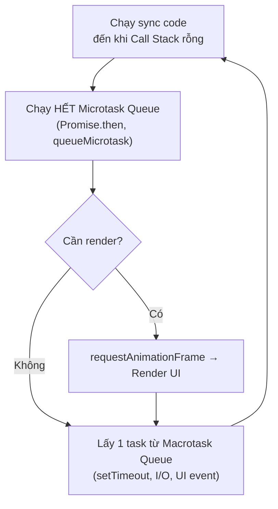

# Event Loop, setTimeout, setInterval

JavaScript chỉ chạy một việc tại một thời điểm, nhưng vẫn xử lý được nhiều tác vụ "song song" nhờ **event loop** (vòng lặp sự kiện — cơ chế điều phối, quyết định đoạn code nào được chạy tiếp theo). Khi cần hẹn giờ chạy code, ta dùng `setTimeout` (chạy một lần sau khoảng thời gian chờ) và `setInterval` (chạy lặp lại đều đặn). Bài này giúp người mới hiểu vì sao code bất đồng bộ lại chạy "sau" dù được viết "trước".

[](pathname:///img/javascript/event-loop.webp)

---

:::note[Ghi nhớ nhanh]

- ⭐ **JS đơn luồng nhưng không bị treo nhờ event loop** — tác vụ chờ (timer, network, I/O) được đẩy ra ngoài, chỉ đăng ký callback rồi chạy tiếp; callback được chạy khi call stack rỗng.
- ⭐ **Microtask luôn ưu tiên hơn macrotask** — `Promise.then`/`queueMicrotask` (microtask) chạy hết trước khi tới một macrotask như `setTimeout`; vì vậy `Promise.then` chạy sớm hơn `setTimeout(0)`.
- **`setTimeout(fn, 0)` không chạy ngay** — có delay tối thiểu ~4ms và phải đợi call stack rỗng + flush microtask; muốn sớm nhất hãy dùng `queueMicrotask`.
- **`setInterval` bị drift** — nên so sánh `Date.now()` thay vì giả định mỗi tick đúng `1000ms`.
- **`requestAnimationFrame` đồng bộ với frame rate** — chạy trước render nên mượt hơn `setTimeout` cho animation; `AbortController` là cách hiện đại để hủy tác vụ async.

:::

---

## Mục lục

- [Vì sao event loop ra đời?](#vì-sao-event-loop-ra-đời)
- [Single-threaded model](#single-threaded-model)
- [Event Loop](#event-loop)
- [Macrotask vs Microtask](#macrotask-vs-microtask)
- [setTimeout và setInterval](#settimeout-và-setinterval)
- [queueMicrotask, requestAnimationFrame](#queuemicrotask-requestanimationframe)
- [Câu hỏi phỏng vấn](#câu-hỏi-phỏng-vấn)

---

## Vì sao event loop ra đời?

**Vấn đề:** JavaScript chạy **đơn luồng** (single-threaded) — chỉ làm một việc tại một thời điểm. Nếu một tác vụ chạy lâu (vòng lặp nặng, chờ mạng kiểu đồng bộ), **toàn bộ trang bị "đơ"**: không click, không cuộn, không gõ được gì cho đến khi tác vụ đó xong.

```js
// Vòng lặp nặng chạy đồng bộ → block luồng chính
function nangNe() {
  const start = Date.now();
  while (Date.now() - start < 5000) {
    // bận rộn 5 giây
  }
  console.log("Xong");
}

nangNe();
// Trong 5 giây này: trang treo cứng, nút bấm không phản hồi
```

**Giải pháp:** Event loop cho phép các việc tốn thời gian (network, timer, I/O) được **đẩy ra ngoài** luồng chính. JS chỉ **đăng ký callback** rồi **tiếp tục chạy** code phía sau. Khi việc kia xong, callback được đưa vào hàng đợi, và event loop sẽ chạy nó **lúc rảnh** (khi call stack rỗng). Nhờ vậy UI không bị treo dù JS chỉ có một luồng.

```js
// Bất đồng bộ → KHÔNG block luồng chính
console.log("Bắt đầu");

setTimeout(() => {
  console.log("Xong sau 5 giây");
}, 5000);

console.log("Vẫn chạy tiếp ngay lập tức");
// Trong 5 giây chờ: trang vẫn click, cuộn, gõ bình thường
```

Việc xếp lịch callback chia làm hai loại: **macrotask** (`setTimeout`, `setInterval`, I/O) và **microtask** (`Promise.then`, `queueMicrotask`) — trong đó **microtask được ưu tiên chạy trước**.

:::tip[Dùng thực tế]

- **Gọi API mà không treo UI:** `fetch()` chạy nền, UI vẫn mượt trong lúc chờ phản hồi.
- **Xử lý click khi đang đợi dữ liệu:** người dùng vẫn bấm nút, cuộn trang dù request chưa về.
- **Hẹn giờ:** `setTimeout`/`setInterval` cho thông báo, polling, debounce/throttle.
- **Đọc file & animation:** đọc file bất đồng bộ trong Node (I/O), hay `requestAnimationFrame` cho hiệu ứng mượt trên browser.

:::

---

## Single-threaded model

JavaScript chạy trên **một luồng duy nhất** — một thời điểm chỉ thực
thi một thứ. Nhưng vẫn xử lý được nhiều việc cùng lúc nhờ **event
loop** + I/O bất đồng bộ.

```js
console.log("1");
setTimeout(() => console.log("2"), 0);
console.log("3");

// In: 1, 3, 2
```

Tại sao `2` ra cuối? Vì `setTimeout` đẩy callback vào **queue**, được
chạy **sau** khi call stack rỗng.

---

## Event Loop

Mô hình runtime của JS gồm:

- **Call Stack** — function đang chạy.
- **Task Queue (Macrotask)** — `setTimeout`, `setInterval`, I/O, UI event.
- **Microtask Queue** — Promise callback, `queueMicrotask`, `MutationObserver`.
- **Heap** — bộ nhớ chứa object.



Event loop:

```
1. Pop frame từ call stack đến khi rỗng.
2. Chạy hết microtask queue.
3. (Browser) render UI nếu cần.
4. Lấy 1 task từ macrotask queue → push vào stack.
5. Lặp lại từ bước 1.
```

Một vòng lặp (tick) diễn ra như sau:



:::info[Phân tích]

**Microtask luôn ưu tiên hơn macrotask:**

```js
console.log("1");

setTimeout(() => console.log("2"), 0);

Promise.resolve().then(() => console.log("3"));

console.log("4");

// In: 1, 4, 3, 2
```

Giải thích:

1. Sync code: `1` → `4`.
2. Call stack rỗng → flush microtask queue → `3`.
3. Lấy macrotask → `2`.

Điều này có hệ quả thực tế: **Promise.then chạy nhanh hơn setTimeout(0)**.
Code dạng:

```js
function spam() {
  Promise.resolve().then(spam);
}
spam(); // browser bị treo
```

Vô tận microtask → browser không bao giờ chạy macrotask (cả render UI).
Trong khi:

```js
function spamMacro() {
  setTimeout(spamMacro, 0);
}
spamMacro(); // browser vẫn responsive
```

Browser được nghỉ giữa các macrotask để render.

:::

---

## Macrotask vs Microtask

| Loại | Bao gồm |
|------|---------|
| Macrotask | `setTimeout`, `setInterval`, `setImmediate` (Node), I/O, UI event |
| Microtask | `Promise.then`, `queueMicrotask`, `MutationObserver`, `process.nextTick` (Node) |

```js
setTimeout(() => console.log("macro 1"), 0);
queueMicrotask(() => console.log("micro 1"));
Promise.resolve().then(() => console.log("micro 2"));
setTimeout(() => console.log("macro 2"), 0);

// In: micro 1, micro 2, macro 1, macro 2
```

---

## setTimeout và setInterval

```js
const id = setTimeout(() => {
  console.log("Sau 1 giây");
}, 1000);

clearTimeout(id); // hủy
```

```js
const id = setInterval(() => {
  console.log("Mỗi giây");
}, 1000);

clearInterval(id);
```

:::warning[Cần lưu ý]

**`setTimeout(fn, 0)` KHÔNG chạy ngay**:

- Browser/Node có **delay tối thiểu** ~4ms (HTML spec).
- Callback đợi call stack rỗng + flush microtask.
- Nested timeout sâu → thêm clamping (làm chậm hơn).

Nếu thực sự muốn "chạy sớm nhất có thể sau code hiện tại":

```js
queueMicrotask(fn);     // sớm hơn setTimeout(0)
Promise.resolve().then(fn); // tương đương
```

`setInterval` có drift — không chạy đúng `1000ms` mỗi lần nếu callback
mất thời gian. Đếm chính xác nên dùng `Date.now()` so sánh:

```js
const start = Date.now();
setInterval(() => {
  const elapsed = Date.now() - start;
  // dùng elapsed thay vì giả định mỗi tick = 1000ms
}, 1000);
```

:::

---

## queueMicrotask, requestAnimationFrame

**`queueMicrotask`** — đẩy callback vào microtask queue:

```js
queueMicrotask(() => {
  // chạy ngay sau code hiện tại, trước macrotask
});
```

**`requestAnimationFrame` (browser)** — sync với frame rate (60fps):

```js
function animate() {
  // cập nhật DOM/canvas
  requestAnimationFrame(animate);
}

requestAnimationFrame(animate);
```

`rAF` chạy **trước render** — guarantee không drop frame:

```js
// Tệ — setTimeout có thể trễ
setTimeout(updateAnimation, 16);

// Tốt — đồng bộ với refresh rate
requestAnimationFrame(updateAnimation);
```

:::info[Phân tích]

**Thứ tự ưu tiên trong một "tick" của event loop** (browser):

1. **Sync code** trong call stack.
2. **Microtask queue** (cho đến khi rỗng).
3. **requestAnimationFrame** callback (nếu sắp render).
4. **Render** (paint, composite).
5. **Macrotask** (1 task).

Trong Node.js cũng tương tự nhưng có thêm `process.nextTick` (ưu tiên cao
nhất, cao hơn microtask) và các phase của libuv (timers, I/O callbacks,
poll, check, close).

Hiểu thứ tự này giúp debug:
- Tại sao state update không reflect trong DOM ngay.
- Tại sao animation giật.
- Tại sao một số bug chỉ xảy ra với data lớn (microtask starvation).

:::

:::tip[Mẹo]

**`AbortController` để cancel async**:

```js
const ctrl = new AbortController();

// Fetch
fetch(url, { signal: ctrl.signal });

// Sau X ms tự cancel
setTimeout(() => ctrl.abort(), 5000);

// Hủy thủ công
button.onclick = () => ctrl.abort();
```

Pattern modern thay cho việc track `setTimeout` id thủ công.

:::

---

## Câu hỏi phỏng vấn

Những câu thường gặp về chủ đề này. Tự trả lời trước, rồi bấm **Xem đáp án** để đối chiếu.

**1. Vì sao nói JavaScript là ngôn ngữ đơn luồng (`single-threaded`) mà trang web vẫn xử lý được nhiều việc "cùng lúc"?**

<details className="qa">
<summary>Xem đáp án</summary>

JS chỉ có **một call stack** — tại một thời điểm chỉ thực thi đúng một đoạn code. Điểm mấu chốt: **những việc phải chờ không do luồng JS làm**. Timer, network, đọc file... được giao cho **runtime** bên ngoài (Web APIs của browser, libuv của Node), vốn có thread riêng của hệ điều hành.

JS chỉ **đăng ký callback** rồi chạy tiếp ngay:

```js
console.log("Bắt đầu");
setTimeout(() => console.log("Xong sau 5 giây"), 5000);
console.log("Vẫn chạy tiếp ngay lập tức");
// Trong 5 giây chờ: trang vẫn click, cuộn, gõ bình thường
```

Khi việc bên ngoài xong, callback được xếp vào hàng đợi, và **event loop** đẩy nó vào call stack lúc stack rỗng. Vậy nên chính xác hơn: JS **thực thi** đơn luồng, nhưng mô hình xử lý là **non-blocking, event-driven** — luồng duy nhất không bao giờ đứng chờ I/O. Đó là lý do một trang web (hay server Node) vẫn phản hồi mượt dù chỉ có một luồng JS.

</details>

**2. Mô tả các thành phần của JS runtime: `call stack`, `heap`, Web APIs, macrotask queue, microtask queue. Chúng phối hợp với nhau ra sao?**

<details className="qa">
<summary>Xem đáp án</summary>

- **Call Stack** — ngăn xếp các function đang chạy. Gọi hàm thì push frame, hàm return thì pop. Chỉ có một, nên chỉ chạy một việc một lúc.
- **Heap** — vùng bộ nhớ chứa object, được garbage collector dọn.
- **Web APIs / libuv** — phần do runtime cung cấp, không thuộc engine: `setTimeout`, `fetch`, DOM event, file I/O. Đây là nơi việc "chờ" thực sự diễn ra, ngoài luồng JS.
- **Macrotask queue** — hàng đợi callback của `setTimeout`, `setInterval`, I/O, UI event.
- **Microtask queue** — hàng đợi callback của `Promise.then`, `queueMicrotask`, `MutationObserver`.

Luồng phối hợp: code chạy trên call stack, gặp API async thì **giao việc cho Web APIs** và trả quyền điều khiển ngay. Khi việc xong, Web APIs **đẩy callback vào queue tương ứng** (macro hay micro tùy loại). **Event loop** đứng giữa, liên tục kiểm tra: call stack rỗng chưa? Rỗng rồi thì rút callback từ queue đẩy vào stack — microtask trước, macrotask sau.

</details>

**3. Event loop làm gì trong một vòng (tick)? Kể tuần tự các bước từ lúc call stack rỗng.**

<details className="qa">
<summary>Xem đáp án</summary>

Một tick trong browser diễn ra theo thứ tự:

```
1. Chạy sync code đến khi Call Stack rỗng.
2. Chạy HẾT Microtask Queue (Promise.then, queueMicrotask)
   — kể cả microtask mới sinh ra trong lúc chạy.
3. Nếu sắp render: chạy callback requestAnimationFrame.
4. Render UI (style, layout, paint, composite) — nếu cần.
5. Lấy ĐÚNG 1 task từ Macrotask Queue, push vào stack.
6. Quay lại bước 1.
```

Ba điểm dễ hỏi thêm:

- Microtask queue được **vét cạn**, macrotask thì mỗi vòng chỉ lấy **một**.
- Render không diễn ra mỗi tick — browser chỉ render khi tới nhịp làm tươi màn hình (thường ~60 lần/giây).
- Vì render nằm **sau** bước vét microtask, nếu microtask sinh ra vô tận thì browser không bao giờ tới được bước render → trang treo.

</details>

**4. Phân biệt `macrotask` và `microtask`. Kể ít nhất ba nguồn của mỗi loại.**

<details className="qa">
<summary>Xem đáp án</summary>

| | Macrotask | Microtask |
|---|---|---|
| Nguồn | `setTimeout`, `setInterval`, `setImmediate` (Node), I/O, UI event (click, scroll) | `Promise.then/catch/finally`, `queueMicrotask`, `MutationObserver`, `await`, `process.nextTick` (Node) |
| Mỗi tick chạy | Đúng **1** task | **Toàn bộ** queue, kể cả task mới sinh ra |
| Ưu tiên | Thấp hơn | Cao hơn — luôn chạy trước |
| Có nhường render? | Có, browser render giữa các macrotask | Không, render bị hoãn tới khi queue cạn |

```js
setTimeout(() => console.log("macro 1"), 0);
queueMicrotask(() => console.log("micro 1"));
Promise.resolve().then(() => console.log("micro 2"));
setTimeout(() => console.log("macro 2"), 0);

// In: micro 1, micro 2, macro 1, macro 2
```

Nhớ một câu: **microtask là "việc phải làm nốt trước khi nghỉ", macrotask là "việc của lượt sau"**.

</details>

**5. Đoạn sau in ra thứ tự nào và vì sao: `console.log(1); setTimeout(() => console.log(2), 0); Promise.resolve().then(() => console.log(3)); console.log(4);`**

<details className="qa">
<summary>Xem đáp án</summary>

Output: **`1` → `4` → `3` → `2`**

```js
console.log(1);                                  // sync
setTimeout(() => console.log(2), 0);             // → macrotask queue
Promise.resolve().then(() => console.log(3));    // → microtask queue
console.log(4);                                  // sync
```

Diễn giải từng bước:

- `1` in ngay vì là sync code.
- `setTimeout` không chạy callback, chỉ giao cho Web API; hết 0ms (thực tế tối thiểu ~4ms) callback vào **macrotask queue**.
- `Promise.resolve()` đã settled sẵn nên callback `.then` vào **microtask queue** ngay.
- `4` in ngay — vẫn là sync code.
- Call stack rỗng → event loop **vét microtask queue trước** → in `3`.
- Cuối cùng mới lấy một macrotask → in `2`.

Bài học cốt lõi: mọi code đồng bộ chạy hết trước, rồi microtask, rồi mới tới macrotask.

</details>

**6. Vì sao `setTimeout(fn, 0)` không chạy ngay lập tức? Delay tối thiểu thực tế là bao nhiêu và vì sao spec lại có clamping?**

<details className="qa">
<summary>Xem đáp án</summary>

Hai lý do:

- `setTimeout` chỉ **xếp lịch**, không chạy ngay. Callback phải đợi call stack rỗng **và** microtask queue được vét cạn, rồi mới tới lượt macrotask.
- Spec HTML quy định **clamping**: khi timer lồng nhau quá 5 tầng, delay bị ép lên tối thiểu **~4ms**, dù bạn truyền `0`.

Ngoài ra browser còn throttle mạnh hơn (thường xuống 1 lần/giây) cho tab chạy nền, để tiết kiệm CPU và pin. Đó chính là mục đích của clamping: chặn vòng lặp `setTimeout(fn, 0)` vô tận đốt CPU và làm nóng máy.

Nếu bạn thực sự muốn "chạy sớm nhất có thể ngay sau code hiện tại":

```js
queueMicrotask(fn);          // sớm hơn setTimeout(0)
Promise.resolve().then(fn);  // tương đương
```

Đừng bao giờ coi đối số delay là lời hứa chính xác — nó chỉ là **thời gian tối thiểu** trước khi callback được xếp hàng.

</details>

**7. Giữa `Promise.then(fn)` và `setTimeout(fn, 0)`, cái nào chạy trước? Giải thích bằng cơ chế hàng đợi chứ không chỉ nói kết quả.**

<details className="qa">
<summary>Xem đáp án</summary>

`Promise.then(fn)` **luôn chạy trước**, kể cả khi `setTimeout` được viết ở dòng trên.

Cơ chế: hai callback rơi vào **hai hàng đợi khác nhau**. `.then` vào **microtask queue**, `setTimeout` vào **macrotask queue**. Trong một tick, event loop làm theo thứ tự cứng: chạy hết sync code → **vét cạn microtask queue** → mới lấy **một** macrotask.

```js
setTimeout(() => console.log("macro"), 0);
Promise.resolve().then(() => console.log("micro"));
// In: micro, macro
```

Thậm chí nếu `.then` sinh thêm `.then` mới, chúng vẫn được nối vào microtask queue và chạy hết **trong cùng tick đó**, trước khi `setTimeout` có cơ hội. Cộng thêm việc `setTimeout(fn, 0)` còn bị clamping tối thiểu ~4ms, khoảng cách càng rõ.

Hệ quả thực tế: dùng microtask cho việc "phải xong ngay sau code hiện tại", dùng macrotask khi muốn **nhường nhịp** cho browser render.

</details>

**8. Trong một tick, event loop lấy bao nhiêu `microtask` và bao nhiêu `macrotask`? Vì sao lại bất đối xứng như vậy?**

<details className="qa">
<summary>Xem đáp án</summary>

**Toàn bộ** microtask queue (vét cạn, kể cả microtask mới sinh ra trong lúc đang chạy) nhưng chỉ **đúng một** macrotask mỗi vòng.

Lý do của sự bất đối xứng nằm ở ý nghĩa của hai loại:

- **Microtask** đại diện cho phần việc còn dang dở của tác vụ vừa chạy — ví dụ chuỗi `.then` xử lý kết quả một Promise. Nếu để chúng chạy rải rác qua nhiều tick, ứng dụng có thể quan sát thấy trạng thái "nửa vời", không nhất quán. Nên spec bắt phải làm nốt trước khi nghỉ.
- **Macrotask** là các tác vụ độc lập với nhau — timer này không liên quan gì timer kia. Lấy từng cái một cho phép browser **chen vào giữa** để render UI, xử lý input, giữ trang phản hồi.

Chính sự bất đối xứng này tạo ra hệ quả: vòng lặp macrotask vô tận thì trang vẫn mượt, còn vòng lặp microtask vô tận thì trang treo cứng vì không bao giờ tới được bước render.

</details>

**9. Điều gì xảy ra nếu một microtask liên tục tự schedule microtask mới (`Promise.resolve().then(spam)`)? So sánh với vòng `setTimeout(spam, 0)` vô tận — vì sao một cái treo browser còn cái kia thì không?**

<details className="qa">
<summary>Xem đáp án</summary>

```js
function spam() {
  Promise.resolve().then(spam);
}
spam(); // browser bị treo

function spamMacro() {
  setTimeout(spamMacro, 0);
}
spamMacro(); // browser vẫn responsive
```

Với microtask: event loop phải **vét cạn** microtask queue trước khi làm bất cứ việc gì khác. Mỗi lần chạy `spam` lại nhét thêm một microtask mới, nên queue không bao giờ cạn. Event loop kẹt vĩnh viễn ở bước 2, không tới được bước render hay macrotask → trang đơ hoàn toàn, không click, không cuộn được.

Với macrotask: mỗi tick chỉ lấy **một** task. Chạy xong `spamMacro`, event loop thoát ra, browser có cơ hội vét microtask, render UI, xử lý click — rồi mới lấy `spamMacro` tiếp theo. Trang tốn CPU nhưng vẫn phản hồi bình thường.

Đây là minh hoạ rõ nhất cho sự khác biệt "vét cạn" và "lấy từng cái".

</details>

**10. `microtask starvation` là gì và nó ảnh hưởng thế nào tới việc render UI?**

<details className="qa">
<summary>Xem đáp án</summary>

**Microtask starvation** là tình trạng microtask queue liên tục được nạp thêm nhanh hơn tốc độ vét, khiến các bước phía sau của event loop — render UI, macrotask, xử lý input — bị "bỏ đói", không bao giờ tới lượt.

Ảnh hưởng tới render: bước paint nằm **sau** bước vét microtask trong một tick. Queue không cạn nghĩa là browser không bao giờ tới được bước render, UI đóng băng ở khung hình cuối cùng: animation đứng hình, click không phản hồi, scroll không nhúc nhích, và sau vài giây browser có thể báo "trang không phản hồi".

Nguyên nhân thường gặp trong code thật không phải vòng lặp cố ý, mà là **đệ quy Promise trên dữ liệu lớn** — ví dụ xử lý từng phần tử của một mảng vài trăm nghìn item bằng chuỗi `.then` nối tiếp. Đó là lý do có loại bug "chỉ xảy ra khi data lớn".

Cách xử lý: chia nhỏ công việc và **nhường nhịp** bằng macrotask (`setTimeout(..., 0)`), hoặc đẩy hẳn phần tính toán nặng sang Web Worker.

</details>

**11. `await` biến phần code phía sau nó thành gì trong event loop? Đoạn `async function f() { console.log(1); await null; console.log(2); } f(); console.log(3);` in ra thứ tự nào?**

<details className="qa">
<summary>Xem đáp án</summary>

Output: **`1` → `3` → `2`**

`await` **cắt đôi** hàm async. Phần code phía sau `await` được biến thành một **microtask** — tương đương callback trong `.then()` — và hàm tạm dừng, trả quyền điều khiển về cho caller.

```js
async function f() {
  console.log(1);   // chạy SYNC, ngay khi gọi f()
  await null;       // tạm dừng, phần sau → microtask queue
  console.log(2);   // microtask
}
f();
console.log(3);     // sync, chạy trước khi microtask có lượt
```

Diễn giải: gọi `f()` thì phần thân **trước `await` chạy đồng bộ ngay** → in `1`. Gặp `await`, phần còn lại được xếp vào microtask queue, `f()` return một Promise. Luồng chính chạy tiếp → in `3`. Call stack rỗng → vét microtask → in `2`.

Lưu ý: `await null` vẫn tạo microtask dù giá trị không phải Promise — chỉ cần có `await` là có điểm cắt.

</details>

**12. `requestAnimationFrame` chạy ở thời điểm nào trong một tick? Vì sao nó hợp cho animation hơn `setTimeout(fn, 16)`?**

<details className="qa">
<summary>Xem đáp án</summary>

`requestAnimationFrame` (rAF) chạy **ngay trước bước render**, tức sau khi microtask queue đã cạn và trước khi browser paint. Thứ tự trong một tick: sync code → microtask → **rAF** → render → macrotask.

Vì sao hơn `setTimeout(fn, 16)`:

- **Đồng bộ với nhịp màn hình.** rAF được gọi đúng một lần mỗi khung hình, khớp tần số làm tươi thật của thiết bị (60Hz, 120Hz...). `setTimeout(16)` là con số áng chừng cho 60fps, lệch nhịp → giật, drop frame.
- **Cập nhật chắc chắn được vẽ.** Code trong rAF chạy ngay trước paint nên thay đổi DOM/canvas được lên hình cùng khung hình đó. `setTimeout` có thể rơi vào giữa hai lần render, thay đổi bị "trễ" một frame.
- **Timer không đáng tin.** `setTimeout` chịu clamping và bị đẩy lùi nếu luồng bận, nên khoảng cách giữa các lần gọi trôi dạt.
- **Tự dừng khi tab ẩn**, tiết kiệm CPU và pin; `setTimeout` vẫn chạy (dù bị throttle).

</details>

**13. `setInterval` bị `drift` nghĩa là gì? Cách xử lý khi cần đếm thời gian chính xác?**

<details className="qa">
<summary>Xem đáp án</summary>

**Drift** là hiện tượng thời điểm thực tế của các tick **lệch dần** so với lý thuyết. `setInterval(fn, 1000)` không đảm bảo callback chạy đúng mỗi 1000ms: nếu luồng chính đang bận, callback bị dời lại; nếu tab chạy nền, browser throttle mạnh hơn. Sai số nhỏ mỗi lần nhưng **cộng dồn**, nên đồng hồ đếm bằng cách cộng `+1` mỗi tick sẽ chạy chậm dần, sau vài phút lệch thấy rõ.

Cách xử lý: **đừng đếm số tick, hãy đo mốc thời gian thật**:

```js
const start = Date.now();
setInterval(() => {
  const elapsed = Date.now() - start;
  // dùng elapsed thay vì giả định mỗi tick = 1000ms
  render(Math.floor(elapsed / 1000));
}, 1000);
```

Cách này tự sửa sai: tick có trễ thì `elapsed` vẫn đúng, giao diện chỉ nhảy số hơi lệch nhịp chứ không sai tổng thời gian. Với đồng hồ hiển thị mượt theo frame, kết hợp `requestAnimationFrame` + `performance.now()`.

</details>

**14. So sánh `setInterval(fn, 1000)` với `setTimeout` đệ quy — cái nào an toàn hơn khi callback chạy lâu hơn khoảng interval? Vì sao?**

<details className="qa">
<summary>Xem đáp án</summary>

**`setTimeout` đệ quy an toàn hơn.**

`setInterval` đếm giờ từ lúc tick trước **được xếp lịch**, không quan tâm callback đã chạy xong chưa. Nếu callback mất 1500ms mà interval là 1000ms, các callback bị dồn ứ, chạy nối đuôi nhau **không có khoảng nghỉ**, luồng chính nghẹt dần. Với polling API còn tệ hơn: request chồng request.

`setTimeout` đệ quy chỉ hẹn lần kế tiếp **sau khi lần này đã xong**, nên luôn có đúng khoảng nghỉ mong muốn giữa hai lần chạy:

```js
function poll() {
  setTimeout(async () => {
    await fetchData();  // xong xuôi rồi mới hẹn tiếp
    poll();
  }, 1000);
}
poll();
```

| | `setInterval` | `setTimeout` đệ quy |
|---|---|---|
| Khoảng cách | Tính từ lần xếp lịch trước | Đảm bảo nghỉ đủ giữa hai lần chạy |
| Callback chạy lâu | Có thể dồn ứ, chồng lấn | Không bao giờ chồng lấn |
| Đổi delay giữa chừng | Không được | Được (dễ làm backoff) |
| Hủy | `clearInterval(id)` | `clearTimeout(id)` của lần đang chờ |

</details>

**15. `clearTimeout`/`clearInterval` hoạt động ra sao? Quên clear khi component unmount thì hậu quả là gì?**

<details className="qa">
<summary>Xem đáp án</summary>

`setTimeout`/`setInterval` trả về một **id** định danh timer đang chờ trong runtime. Truyền id đó cho `clearTimeout`/`clearInterval` để runtime gỡ timer khỏi danh sách, callback sẽ không bao giờ được xếp vào macrotask queue nữa.

```js
const id = setInterval(() => console.log("Mỗi giây"), 1000);
clearInterval(id); // hủy
```

Lưu ý: hủy timer **không** hủy được công việc đã chạy — nếu callback đang thực thi thì nó chạy nốt.

Hậu quả khi quên clear lúc component unmount:

- **Memory leak**: timer giữ tham chiếu tới closure, kéo theo cả state, DOM node, response API — GC không dọn được.
- **Set state trên component đã chết**: callback chạy sau unmount, gọi `setState` vào chỗ không còn tồn tại → cảnh báo hoặc lỗi.
- **`setInterval` chạy mãi mãi**: mỗi lần mount lại tạo thêm một interval, vào ra vài chục lần là hàng chục interval cùng bắn, ứng dụng chậm dần rồi đơ.

Vì vậy trong React luôn clear ở hàm cleanup của `useEffect`.

</details>

**16. `queueMicrotask` khác `Promise.resolve().then` ở điểm nào? Khi nào bạn chọn `queueMicrotask`?**

<details className="qa">
<summary>Xem đáp án</summary>

Về **thời điểm chạy thì giống hệt** — cả hai đẩy callback vào cùng một microtask queue, theo đúng thứ tự đăng ký. Khác nhau ở chi tiết:

| | `queueMicrotask(fn)` | `Promise.resolve().then(fn)` |
|---|---|---|
| Ý định | Nói thẳng "xếp một microtask" | Thông qua cơ chế Promise |
| Chi phí | Không tạo Promise nào | Tạo ít nhất một Promise object |
| Lỗi ném ra | Thành lỗi toàn cục, báo lên console | Thành **rejected promise**, im lặng nếu không `.catch` |
| Giá trị trả về | Không có | Trả về Promise, xâu chuỗi tiếp được |

Chọn `queueMicrotask` khi bạn **chỉ muốn hoãn một đoạn code tới cuối tick hiện tại** mà không có giá trị bất đồng bộ nào để chờ — ví dụ gom nhiều thay đổi rồi phát một sự kiện duy nhất, hoặc đảm bảo callback luôn chạy async cho nhất quán. Ưu điểm lớn là **lỗi không bị nuốt mất**. Ngược lại, khi cần chaining hoặc có giá trị để truyền tiếp thì dùng Promise.

</details>

**17. Một vòng `for` chạy nặng 5 giây ảnh hưởng gì tới event loop, tới UI và tới các timer đã hẹn giờ? Có cách nào chia nhỏ công việc để không block?**

<details className="qa">
<summary>Xem đáp án</summary>

Vòng lặp nặng chiếm call stack suốt 5 giây, event loop **đứng im** ở bước 1 — không vét được microtask, không render, không lấy macrotask.

- **UI**: đóng băng hoàn toàn. Click, scroll, gõ phím vẫn được ghi nhận nhưng callback nằm chờ trong queue, animation đứng hình; browser có thể báo "trang không phản hồi".
- **Timer**: **không bị mất**, nhưng bị **trễ**. `setTimeout(fn, 100)` hẹn trong lúc đó sẽ chạy sau ~5 giây, ngay khi luồng rảnh. Các tick `setInterval` bị dồn lại.

Cách chia nhỏ:

```js
function xuLyTheoLo(items, i = 0) {
  const end = Math.min(i + 500, items.length);
  for (; i < end; i++) xuLy(items[i]);
  if (i < items.length) setTimeout(() => xuLyTheoLo(items, i), 0);
}
```

Mỗi lô nhường lại một nhịp cho browser render. Lưu ý phải dùng **macrotask** (`setTimeout`) chứ không phải microtask, vì microtask không nhường render. Với tính toán thật sự nặng, giải pháp đúng là đẩy sang **Web Worker**.

</details>

**18. Event loop của Node.js khác browser thế nào? `process.nextTick` xếp ở đâu so với microtask, và các phase của `libuv` (timers, poll, check, close) làm gì?**

<details className="qa">
<summary>Xem đáp án</summary>

Nguyên tắc lớn giống nhau (sync → microtask → macrotask), nhưng Node không có render UI, và phần macrotask được libuv chia thành nhiều **phase** chạy vòng tròn:

- **timers** — chạy callback của `setTimeout`/`setInterval` đã đến hạn.
- **pending callbacks** — một số callback I/O bị hoãn từ vòng trước.
- **poll** — chờ và xử lý I/O mới (đọc file, socket). Đây là nơi Node "nghỉ" nếu không có việc.
- **check** — chạy callback của `setImmediate`.
- **close callbacks** — xử lý sự kiện đóng (`socket.on("close")`).

Giữa **mỗi** phase, Node vét hai hàng đợi ưu tiên theo thứ tự: **`process.nextTick` trước, rồi tới microtask của Promise**. Nghĩa là `process.nextTick` có ưu tiên **cao hơn cả `Promise.then`**:

```js
setTimeout(() => console.log("timeout"), 0);
setImmediate(() => console.log("immediate"));
Promise.resolve().then(() => console.log("promise"));
process.nextTick(() => console.log("nextTick"));
// nextTick → promise → (timeout/immediate, thứ tự tuỳ ngữ cảnh)
```

Lạm dụng `process.nextTick` đệ quy cũng gây starvation y như microtask trên browser.

</details>

**19. `AbortController` giải quyết vấn đề gì trong code bất đồng bộ? Nó có "dừng" được một `setTimeout` đang chờ không?**

<details className="qa">
<summary>Xem đáp án</summary>

`AbortController` cung cấp một **cơ chế hủy chuẩn hoá, dùng chung** cho các tác vụ bất đồng bộ. Trước đó mỗi API có cách hủy riêng (`clearTimeout` với id, `xhr.abort()`, cờ `isCancelled` tự chế), rất rối khi cần hủy đồng loạt nhiều việc.

```js
const ctrl = new AbortController();

fetch(url, { signal: ctrl.signal });
element.addEventListener("click", fn, { signal: ctrl.signal });

setTimeout(() => ctrl.abort(), 5000); // hết hạn thì hủy tất cả
button.onclick = () => ctrl.abort();  // hoặc hủy thủ công
```

Một `signal` có thể truyền cho nhiều API cùng lúc — một lệnh `abort()` hủy hết, kể cả gỡ event listener. Rất hợp với cleanup khi component unmount hoặc khi request cũ bị thay bởi request mới.

**Có dừng được `setTimeout` không?** Không. `setTimeout` không nhận tham số `signal`, muốn hủy vẫn phải `clearTimeout(id)`. Bạn chỉ có thể tự nghe `signal` và gọi `clearTimeout` bên trong:

```js
const id = setTimeout(fn, 1000);
ctrl.signal.addEventListener("abort", () => clearTimeout(id));
```

</details>

**20. Web Worker giải quyết vấn đề nào mà event loop không giải quyết được? Nêu giới hạn của nó.**

<details className="qa">
<summary>Xem đáp án</summary>

Event loop chỉ giải quyết **việc chờ** (I/O, timer) — những thứ không tốn CPU của luồng JS. Nó **bất lực với tính toán nặng**: một vòng lặp 5 giây vẫn treo cứng UI, vì code đó phải chạy trên luồng chính.

**Web Worker** cho phép chạy JS trên **một thread thật sự khác**, song song với luồng chính. Thích hợp cho xử lý ảnh, parse file lớn, mã hoá, tính toán khoa học — luồng chính vẫn render và phản hồi bình thường. Mỗi worker có call stack và event loop riêng.

```js
const worker = new Worker("heavy.js");
worker.postMessage(data);
worker.onmessage = (e) => console.log("Kết quả:", e.data);
```

Giới hạn:

- **Không truy cập DOM**, không có `window`, `document` — muốn đổi giao diện phải gửi kết quả về luồng chính.
- **Không chia sẻ biến**: giao tiếp qua `postMessage`, dữ liệu được sao chép (structured clone). Dữ liệu lớn thì chi phí copy đáng kể — khi đó dùng transferable object hoặc `SharedArrayBuffer`.
- **Tốn tài nguyên**: mỗi worker là một thread thật, không nên tạo bừa bãi.
- Code phải nằm ở file riêng, debug khó hơn.

</details>
