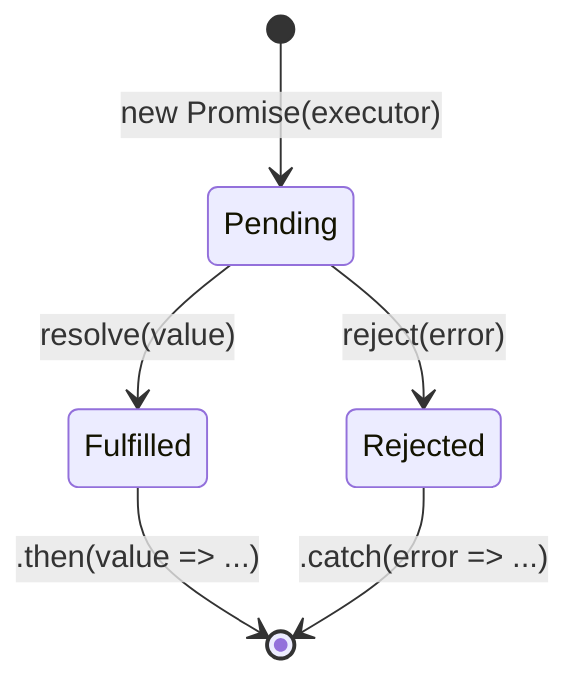

# Callbacks, Promises, async/await

Đây là ba cách viết code **bất đồng bộ** (xử lý những việc cần chờ, như tải dữ liệu, mà không làm "đứng" chương trình) trong JavaScript. **Callback** (hàm được truyền vào để gọi lại sau khi xong việc) là cách cũ nhất; **Promise** (đối tượng đại diện cho kết quả sẽ có trong tương lai) giúp code gọn và dễ kiểm soát lỗi hơn; còn **async/await** (cú pháp viết code bất đồng bộ trông như đồng bộ) giúp người mới đọc và viết dễ hiểu nhất.

[](pathname:///img/javascript/promises-async.webp)

---

:::note[Ghi nhớ nhanh]

- ⭐ **Ba cách viết async: callback → Promise → async/await** — callback lồng nhau tạo "callback hell"; `Promise` cho chuỗi `.then()` phẳng với một `.catch()`; `async/await` viết async trông như sync, dễ đọc nhất.
- ⭐ **`Promise` có 3 trạng thái và chỉ settle một lần** — pending → fulfilled hoặc rejected, sau đó không đổi được nữa; `.finally()` chạy ở cả hai nhánh.
- **`async function` luôn trả về Promise** — cần `await` (hoặc `.then`) để lấy giá trị, không phải giá trị trực tiếp.
- **4 method composition** — `Promise.all` (cần tất cả, fail-fast), `allSettled` (không bao giờ reject), `race` (cái đầu tiên settle, dùng cho timeout), `any` (fulfilled đầu tiên, fastest wins).
- **`await` trong loop chạy tuần tự (chậm)** — dùng `Promise.all(ids.map(...))` để chạy song song, trừ khi cần thứ tự hoặc phụ thuộc bước trước; luôn handle error, đừng nuốt reject bằng `catch {}` rỗng.

:::

---

## Mục lục

- [Vì sao Promise & async/await ra đời?](#vì-sao-promise--asyncawait-ra-đời)
- [Callbacks](#callbacks)
- [Callback Hell](#callback-hell)
- [Promises](#promises)
- [Promise composition](#promise-composition)
- [async / await](#async--await)
- [Best practices](#best-practices)
- [Câu hỏi phỏng vấn](#câu-hỏi-phỏng-vấn)

---

## Vì sao Promise & async/await ra đời?

**Vấn đề:** Trước đây, mọi việc bất đồng bộ đều dùng **callback**. Khi nhiều
bước phụ thuộc nhau, callback lồng callback tạo thành "callback hell" (kim tự
tháp lệch — "pyramid of doom"): khó đọc, và **mỗi tầng phải tự kiểm tra lỗi**:

```js
loadUser(1, (err, user) => {
  if (err) return handle(err);
  loadOrders(user.id, (err, orders) => {
    if (err) return handle(err);
    loadPayments(orders[0].id, (err, payments) => {
      if (err) return handle(err);
      loadInvoice(payments[0].id, (err, invoice) => {
        if (err) return handle(err);
        console.log(invoice); // logic chính bị đẩy sâu vào trong
      });
    });
  });
});
```

**Giải pháp:**

**1. Promise (ES6)** — đối tượng đại diện cho giá trị "sẽ có trong tương lai".
Cho phép nối chuỗi `.then()` **phẳng**, gom xử lý lỗi vào một `.catch()` duy nhất:

```js
loadUser(1)
  .then((user) => loadOrders(user.id))
  .then((orders) => loadPayments(orders[0].id))
  .then((payments) => loadInvoice(payments[0].id))
  .then((invoice) => console.log(invoice))
  .catch(handle); // một chỗ xử lý lỗi cho cả chuỗi
```

**2. async/await (ES2017)** — viết code bất đồng bộ **trông như đồng bộ**, dùng
`try/catch` quen thuộc. Dễ đọc nhất:

```js
async function showInvoice() {
  try {
    const user = await loadUser(1);
    const orders = await loadOrders(user.id);
    const payments = await loadPayments(orders[0].id);
    const invoice = await loadInvoice(payments[0].id);
    console.log(invoice);
  } catch (err) {
    handle(err);
  }
}
```

:::tip[Dùng thực tế]

- **Gọi nhiều API tuần tự**: chờ kết quả bước trước rồi mới làm bước sau (`await` lần lượt).
- **Gọi song song**: chạy nhiều request cùng lúc với `Promise.all([...])` rồi gộp kết quả.
- **Retry khi lỗi**: bọc trong `try/catch`, thử lại vài lần trước khi báo lỗi.
- **Đọc file tuần tự (Node)**: `await` từng thao tác I/O thay vì lồng callback.

:::

---

## Callbacks

Callback = function được truyền vào function khác, gọi **sau khi** xong
việc:

```js
function loadUser(id, callback) {
  setTimeout(() => {
    callback(null, { id, name: "An" });
  }, 1000);
}

loadUser(1, (err, user) => {
  if (err) return console.error(err);
  console.log(user);
});
```

**Node-style callback** — quy ước (err, result):

```js
fs.readFile("file.txt", "utf-8", (err, data) => {
  if (err) return console.error(err);
  console.log(data);
});
```

---

## Callback Hell

Khi nhiều async lồng nhau → "pyramid of doom":

```js
loadUser(1, (err, user) => {
  if (err) return handle(err);
  loadOrders(user.id, (err, orders) => {
    if (err) return handle(err);
    loadPayments(orders[0].id, (err, payments) => {
      if (err) return handle(err);
      // ...
    });
  });
});
```

Vấn đề: khó đọc, khó error-handle, dễ lặp code.

Promise + async/await ra đời để giải quyết.

---

## Promises

`Promise` là object đại diện cho **kết quả tương lai** của async op.

3 trạng thái:

- **Pending** — đang chạy.
- **Fulfilled** — thành công (có giá trị).
- **Rejected** — thất bại (có lý do).



Promise chỉ chuyển trạng thái **một lần duy nhất** (settle) — đã
fulfilled/rejected thì không đổi được nữa; `.finally()` chạy ở cả hai nhánh.

```js
const p = new Promise((resolve, reject) => {
  setTimeout(() => {
    if (Math.random() > 0.5) {
      resolve("OK");
    } else {
      reject(new Error("Fail"));
    }
  }, 1000);
});

p.then(value => console.log(value))
 .catch(err => console.error(err))
 .finally(() => console.log("Done"));
```

`.then` trả về promise mới — chain được:

```js
fetch("/api/user/1")
  .then(res => res.json())
  .then(user => fetch(`/api/orders/${user.id}`))
  .then(res => res.json())
  .then(orders => console.log(orders))
  .catch(err => console.error(err));
```

---

## Promise composition

**`Promise.all`** — chờ tất cả; fail-fast nếu có 1 reject:

```js
const [users, posts] = await Promise.all([
  fetch("/users").then(r => r.json()),
  fetch("/posts").then(r => r.json()),
]);
```

**`Promise.allSettled`** — chờ tất cả, không reject:

```js
const results = await Promise.allSettled(promises);
// [{ status: "fulfilled", value }, { status: "rejected", reason }, ...]
```

**`Promise.race`** — lấy promise đầu tiên settle (fulfill hoặc reject):

```js
const result = await Promise.race([
  fetch(url),
  new Promise((_, reject) => setTimeout(() => reject(new Error("Timeout")), 5000)),
]);
```

**`Promise.any`** — lấy fulfilled đầu tiên; reject nếu tất cả reject
(với `AggregateError`):

```js
const fastest = await Promise.any([
  fetch(server1),
  fetch(server2),
  fetch(server3),
]);
```

:::info[Phân tích]

**4 method composition** so sánh:

| | Resolve khi | Reject khi | Use case |
|--|-------------|-----------|----------|
| `all` | Tất cả fulfilled | **Bất kỳ** reject | Cần tất cả thành công |
| `allSettled` | Tất cả settle | **Không bao giờ** | Cần biết kết quả từng cái |
| `race` | **Bất kỳ** settle | **Bất kỳ** settle (đầu tiên) | Timeout pattern |
| `any` | **Bất kỳ** fulfilled | Tất cả reject | Fallback / fastest wins |

Lựa chọn đúng method ảnh hưởng cách app xử lý lỗi mạng. Vd dashboard:

```js
// Tệ — 1 widget lỗi → cả dashboard lỗi
const data = await Promise.all([
  fetchUser(), fetchStats(), fetchNotifs(),
]);

// Tốt — render được phần thành công
const results = await Promise.allSettled([
  fetchUser(), fetchStats(), fetchNotifs(),
]);

results.forEach((r, i) => {
  if (r.status === "fulfilled") render(i, r.value);
  else renderError(i, r.reason);
});
```

:::

---

## async / await

ES2017 — syntactic sugar cho Promise, viết async như sync:

```js
async function loadUserOrders(userId) {
  try {
    const user = await fetchUser(userId);
    const orders = await fetchOrders(user.id);
    return orders;
  } catch (err) {
    console.error(err);
    throw err;
  }
}
```

`async function` luôn **trả về Promise**:

```js
async function getValue() {
  return 42;
}

getValue(); // Promise<42> — không phải 42
const x = await getValue(); // 42
```

`await` chỉ dùng được:

- Trong `async function`.
- **Top-level** trong ES Module (top-level await, ES2022).

**Top-level await:**

```js
// module.mjs hoặc "type": "module"
const config = await fetch("/config.json").then(r => r.json());
export { config };
```

:::warning[Cần lưu ý]

**`await` trong loop tuần tự — không phải lúc nào cũng đúng:**

```js
// Tuần tự — chậm
for (const id of ids) {
  const user = await fetchUser(id);
  console.log(user);
}

// Song song — nhanh hơn nhiều
const users = await Promise.all(ids.map(id => fetchUser(id)));
```

Trừ khi:

- Cần thứ tự tuyệt đối.
- Cần kết quả của bước trước cho bước sau.
- Bị rate limit (quá nhiều request đồng thời).

Cho rate limit, dùng `p-limit` hoặc tự viết:

```js
import pLimit from "p-limit";

const limit = pLimit(5); // tối đa 5 song song
const users = await Promise.all(
  ids.map(id => limit(() => fetchUser(id)))
);
```

:::

---

## Best practices

**1. Luôn handle error**:

```js
// Tệ — unhandled rejection
loadData();

// Tốt
loadData().catch(handleError);

// Hoặc trong async
async function main() {
  try {
    await loadData();
  } catch (err) {
    handleError(err);
  }
}
```

**2. Đừng "nuốt" reject bằng try empty:**

```js
// Tệ
try {
  await op();
} catch {}

// Tốt — log hoặc rethrow
try {
  await op();
} catch (err) {
  logger.error(err);
}
```

**3. Đừng mix `.then` và `await` trong một function:**

```js
// Tệ — khó đọc
async function load() {
  return fetch(url).then(r => r.json());
}

// Tốt
async function load() {
  const res = await fetch(url);
  return res.json();
}
```

**4. `Promise.withResolvers` (ES2024) — tạo Promise có resolve/reject ngoài:**

```js
const { promise, resolve, reject } = Promise.withResolvers();

setTimeout(() => resolve("OK"), 1000);

await promise; // "OK"
```

Thay thế pattern cũ:

```js
let resolve, reject;
const p = new Promise((r, rj) => { resolve = r; reject = rj; });
```

:::tip[Mẹo]

**Đo thời gian async**:

```js
console.time("fetch");
await fetch(url);
console.timeEnd("fetch"); // fetch: 234.5ms

// Hoặc performance.now
const start = performance.now();
await fetch(url);
console.log(performance.now() - start);
```

`performance.now()` chính xác hơn `Date.now()` (microsecond resolution),
phù hợp đo performance.

:::

---

## Câu hỏi phỏng vấn

Những câu thường gặp về chủ đề này. Tự trả lời trước, rồi bấm **Xem đáp án** để đối chiếu.

**1. `callback hell` là gì? Ngoài chuyện khó đọc, nó còn gây khó khăn cụ thể nào về xử lý lỗi?**

<details className="qa">
<summary>Xem đáp án</summary>

**Callback hell** (hay "pyramid of doom") là tình trạng nhiều tác vụ bất đồng bộ phụ thuộc nhau bị lồng callback vào callback, tạo thành kim tự tháp lệch dần sang phải. Logic chính bị đẩy sâu vào tầng trong cùng, rất khó đọc và khó sửa.

Về xử lý lỗi, vấn đề nặng hơn nhiều:

- **Mỗi tầng phải tự kiểm tra lỗi**: dòng `if (err) return handle(err);` lặp đi lặp lại ở mọi cấp, chỉ cần quên một chỗ là lỗi bị nuốt im lặng.
- **Không có cơ chế lan truyền lỗi**: callback không "ném" lỗi lên trên được, mỗi tầng là một hòn đảo riêng.
- **`try/catch` vô dụng**: callback chạy ở tick sau, lúc đó khối `try` bao ngoài đã thoát khỏi call stack, nên không bắt được gì.
- **Dễ gọi callback hai lần** hoặc quên gọi, dẫn tới bug rất khó truy vết.

Promise giải đúng những điểm này: chuỗi `.then()` phẳng và **một `.catch()` duy nhất** bắt lỗi cho cả chuỗi.

</details>

**2. Quy ước `error-first callback` trong Node.js là gì và vì sao nó ra đời?**

<details className="qa">
<summary>Xem đáp án</summary>

Quy ước: callback luôn nhận **tham số đầu tiên là lỗi**, kết quả nằm ở các tham số sau. Không lỗi thì truyền `null`.

```js
fs.readFile("file.txt", "utf-8", (err, data) => {
  if (err) return console.error(err);
  console.log(data);
});
```

Vì sao ra đời: thời chưa có Promise, callback không có cách nào "ném" lỗi lên cho hàm gọi — `throw` bên trong callback async sẽ vượt ra ngoài mọi `try/catch` và làm sập process. Node cần một **giao ước chung** để mọi hàm async báo lỗi theo cùng một kiểu, thay vì mỗi thư viện tự nghĩ ra cách riêng (`onError` riêng, trả về `false`, object `{ok, data}`...).

Đặt lỗi ở vị trí **đầu tiên** là cố ý: nó buộc lập trình viên phải nhìn thấy và xử lý trước khi chạm tới dữ liệu. Nhờ quy ước thống nhất này mà sau này `util.promisify` có thể tự động chuyển mọi hàm callback-style của Node sang Promise.

</details>

**3. Một `Promise` có những trạng thái nào? Một promise đã settle rồi có đổi trạng thái được nữa không?**

<details className="qa">
<summary>Xem đáp án</summary>

Ba trạng thái:

- **Pending** — đang chạy, chưa có kết quả.
- **Fulfilled** — thành công, kèm một **giá trị**.
- **Rejected** — thất bại, kèm một **lý do** (thường là `Error`).

"**Settled**" là từ gọi chung cho fulfilled và rejected — tức đã có kết quả cuối cùng.

**Không đổi được nữa.** Promise chỉ chuyển trạng thái **đúng một lần**: từ pending sang fulfilled hoặc rejected, rồi khoá vĩnh viễn. Gọi `resolve` hay `reject` thêm lần nữa bị **bỏ qua im lặng**, không lỗi:

```js
const p = new Promise((resolve, reject) => {
  resolve("lần 1");
  resolve("lần 2");   // bị bỏ qua
  reject(new Error()); // cũng bị bỏ qua
});
p.then(console.log); // "lần 1"
```

Tính bất biến này rất quan trọng: nó đảm bảo mọi `.then` gắn vào — kể cả gắn rất lâu sau khi promise đã settle — đều nhận cùng một kết quả, khác hẳn callback vốn có thể bị gọi nhầm nhiều lần.

</details>

**4. Executor truyền vào `new Promise(...)` chạy **đồng bộ** hay **bất đồng bộ**? Điều đó có hệ quả gì?**

<details className="qa">
<summary>Xem đáp án</summary>

Executor chạy **đồng bộ**, ngay lập tức, trong lúc `new Promise(...)` còn chưa trả về. Chỉ có các callback `.then`/`.catch` mới là bất đồng bộ (microtask).

```js
console.log("A");
const p = new Promise((resolve) => {
  console.log("B");        // chạy NGAY — sync
  resolve("giá trị");
});
p.then((v) => console.log("C", v)); // microtask
console.log("D");

// In: A → B → D → C giá trị
```

Hệ quả cần nhớ:

- **Code nặng trong executor vẫn block luồng chính** — Promise không tự biến code đồng bộ thành bất đồng bộ.
- **Promise "khởi động ngay" (eager)**, không lười như một số ngôn ngữ khác: `new Promise(...)` là đã bắt đầu làm việc, dù bạn chưa `.then` hay `await`. Muốn trì hoãn thì phải bọc trong một hàm.
- Lỗi `throw` đồng bộ bên trong executor được tự động chuyển thành **reject**, nên vẫn bắt được bằng `.catch`.

</details>

**5. Giải thích chuỗi `.then().then().catch()`: mỗi `.then` trả về cái gì, và vì sao chuỗi lại "phẳng" chứ không lồng nhau?**

<details className="qa">
<summary>Xem đáp án</summary>

Mỗi `.then()` **trả về một Promise hoàn toàn mới**, chứ không phải promise gốc. Promise mới này settle dựa trên điều xảy ra trong callback: callback return giá trị thường → promise mới fulfilled với giá trị đó; callback return một Promise → promise mới "bám theo" promise đó; callback `throw` → promise mới rejected.

Chính vì mỗi mắt xích trả về một Promise mới nên ta gọi tiếp `.then` lên nó được, tạo thành **chuỗi phẳng** thay vì lồng nhau:

```js
fetch("/api/user/1")
  .then(res => res.json())
  .then(user => fetch(`/api/orders/${user.id}`))
  .then(res => res.json())
  .then(orders => console.log(orders))
  .catch(err => console.error(err));
```

So với callback, bước sau không phải nằm *bên trong* bước trước mà chỉ nối *tiếp sau*, nên độ thụt lề không tăng dù có bao nhiêu bước.

`.catch(fn)` thực chất chỉ là viết tắt của `.then(undefined, fn)` — nó cũng là một mắt xích, đứng cuối để hứng lỗi văng ra từ bất kỳ mắt xích nào phía trên.

</details>

**6. Trong `.then`, `return` một giá trị thường khác `return` một Promise ở chỗ nào đối với mắt xích phía sau?**

<details className="qa">
<summary>Xem đáp án</summary>

- **Return giá trị thường**: mắt xích sau nhận **chính giá trị đó** ngay ở microtask kế tiếp.
- **Return một Promise**: chuỗi **dừng lại chờ** promise đó settle, rồi mắt xích sau nhận **giá trị đã bóc vỏ** bên trong — không phải object Promise. Nếu promise đó reject thì chuỗi nhảy thẳng xuống `.catch`.

```js
Promise.resolve(1)
  .then(v => v + 1)                    // return số → 2
  .then(v => Promise.resolve(v * 10))  // return Promise → CHỜ, bóc ra 20
  .then(v => console.log(v));          // 20, không phải Promise
```

Cơ chế này gọi là **adoption** (hay "unwrap"): Promise không bao giờ lồng Promise trong Promise. Đây chính là thứ khiến chuỗi `.then` xâu được các bước async phụ thuộc nhau:

```js
loadUser(1)
  .then(user => loadOrders(user.id)) // trả Promise → bước sau nhận orders thật
  .then(orders => console.log(orders));
```

Lỗi kinh điển là **quên `return`**: nếu viết `.then(user => { loadOrders(user.id); })` thì mắt xích sau nhận `undefined` ngay, không chờ gì cả.

</details>

**7. `.catch()` đặt giữa chuỗi và đặt cuối chuỗi khác nhau thế nào? Sau khi `.catch()` bắt được lỗi thì chuỗi phía sau còn chạy không?**

<details className="qa">
<summary>Xem đáp án</summary>

`.catch` chỉ bắt lỗi từ **các mắt xích phía trên nó**. Đặt ở cuối thì bắt được lỗi của cả chuỗi — đây là cách dùng phổ biến. Đặt ở giữa thì lỗi của các mắt xích **sau** nó sẽ không được bắt, dẫn tới unhandled rejection.

Sau khi `.catch` xử lý xong, chuỗi **vẫn chạy tiếp** và quay về trạng thái **fulfilled** (giống như đã "chữa lành"):

```js
Promise.reject(new Error("hỏng"))
  .catch(err => {
    console.log("đã xử lý:", err.message);
    return "giá trị thay thế";  // chuỗi trở lại fulfilled
  })
  .then(v => console.log(v));   // "giá trị thay thế" — VẪN CHẠY
```

Đây vừa là tính năng vừa là cái bẫy: `.catch` giữa chuỗi cho phép **fallback** (thử nguồn dữ liệu khác rồi đi tiếp), nhưng nếu bạn tưởng chuỗi sẽ dừng lại thì sẽ ngạc nhiên khi các bước sau vẫn chạy với dữ liệu rỗng.

Muốn dừng hẳn, hãy **ném lại lỗi** trong `.catch`: `catch(err => { log(err); throw err; })`.

</details>

**8. `.finally()` chạy vào lúc nào? Nó có nhận giá trị resolve không, và có làm đổi giá trị truyền xuống dưới không?**

<details className="qa">
<summary>Xem đáp án</summary>

`.finally(fn)` chạy khi promise **settle**, bất kể fulfilled hay rejected — giống khối `finally` của `try/catch`. Dùng cho dọn dẹp: tắt spinner, đóng kết nối, bật lại nút submit.

```js
setLoading(true);
fetchData()
  .then(render)
  .catch(showError)
  .finally(() => setLoading(false)); // chạy ở CẢ hai nhánh
```

**Không nhận đối số**: callback của `.finally` được gọi với tham số rỗng, vì nó không cần biết kết quả là thành công hay thất bại.

**Không làm đổi giá trị truyền xuống**: giá trị (hoặc lý do reject) đi xuyên qua `.finally` nguyên vẹn, `return` bên trong bị **bỏ qua**:

```js
Promise.resolve("A")
  .finally(() => "B")
  .then(v => console.log(v)); // "A", không phải "B"
```

Hai ngoại lệ: nếu callback trong `.finally` **`throw`** hoặc trả về một promise bị **reject**, thì lỗi đó sẽ ghi đè kết quả cũ. Ngoài ra, nếu nó trả về một promise, chuỗi vẫn chờ promise đó settle trước khi đi tiếp.

</details>

**9. `async function` trả về gì khi bên trong bạn `return 42`? Còn khi bên trong `throw` thì sao?**

<details className="qa">
<summary>Xem đáp án</summary>

`async function` **luôn trả về một Promise**, không bao giờ trả về giá trị trực tiếp.

```js
async function getValue() {
  return 42;
}

getValue();                 // Promise<42> — KHÔNG phải 42
getValue().then(v => v);    // 42
const x = await getValue(); // 42
```

`return 42` nghĩa là promise đó **fulfilled với giá trị 42**. Nếu bạn `return` một Promise, nó được bóc vỏ tự động — không có chuyện `Promise<Promise<...>>`.

`throw` bên trong biến promise thành **rejected**, với lý do chính là thứ bạn ném:

```js
async function fail() {
  throw new Error("hỏng");
}

fail();                       // Promise rejected
fail().catch(e => console.log(e.message)); // "hỏng"

try {
  await fail();               // await ném lại lỗi
} catch (e) { /* bắt được ở đây */ }
```

Nói cách khác, `return` ↔ `resolve`, `throw` ↔ `reject`. Lỗi kinh điển của người mới là quên `await` rồi tưởng mình đang cầm giá trị, trong khi thực ra đang cầm một object Promise.

</details>

**10. `await` thực chất làm gì với phần code phía sau nó? Nó có "block" luồng chính không? Giải thích qua event loop.**

<details className="qa">
<summary>Xem đáp án</summary>

`await` **cắt đôi** hàm async: phần code phía sau nó được biến thành một **microtask** — tương đương callback trong `.then()`. Hàm tạm dừng tại đó và **trả quyền điều khiển về cho caller** ngay lập tức.

**Không block luồng chính.** Call stack được giải phóng, event loop tiếp tục chạy code khác, render UI, xử lý click bình thường. Khi promise được chờ đã settle, phần còn lại của hàm mới được xếp vào microtask queue và chạy khi call stack rỗng.

```js
async function f() {
  console.log(1);  // sync, chạy ngay khi gọi f()
  await null;      // cắt: phần sau → microtask
  console.log(2);  // microtask
}
f();
console.log(3);    // sync

// In: 1 → 3 → 2
```

Cảm giác "dừng chờ" chỉ đúng **bên trong hàm async đó**, không phải với cả chương trình. Đây là điểm khác biệt sống còn so với vòng `while` chờ thời gian — cái đó mới thực sự treo trang.

Lưu ý: `await null` vẫn tạo microtask dù không phải Promise — cứ có `await` là có điểm cắt.

</details>

**11. So sánh `Promise.all`, `Promise.allSettled`, `Promise.race`, `Promise.any`: mỗi cái resolve khi nào và reject khi nào?**

<details className="qa">
<summary>Xem đáp án</summary>

| | Resolve khi | Reject khi | Giá trị trả về | Use case |
|---|---|---|---|---|
| `all` | Tất cả fulfilled | **Bất kỳ** cái nào reject (fail-fast) | Mảng kết quả đúng thứ tự đầu vào | Cần tất cả thành công |
| `allSettled` | Tất cả đã settle | **Không bao giờ** | Mảng `{status, value}` hoặc `{status, reason}` | Cần biết kết quả từng cái |
| `race` | Cái **đầu tiên** settle, nếu là fulfilled | Cái **đầu tiên** settle, nếu là rejected | Giá trị/lý do của cái đầu tiên | Timeout pattern |
| `any` | Cái **fulfilled đầu tiên** | **Tất cả** đều reject | Giá trị của cái nhanh nhất thành công | Fallback, fastest wins |

Hai cặp dễ nhầm:

- `all` vs `allSettled`: khác ở chỗ có "gãy" khi một cái lỗi hay không.
- `race` vs `any`: `race` quan tâm cái **settle** đầu tiên (kể cả lỗi), `any` bỏ qua lỗi và chỉ chờ cái **thành công** đầu tiên.

Mẹo nhớ: `race` là cuộc đua ai về đích trước, kể cả về đích bằng cách ngã; `any` là chỉ cần một người về đích tử tế.

</details>

**12. Khi `Promise.all` gặp một promise reject, các promise còn lại có bị hủy không? Chuyện gì xảy ra với kết quả của chúng?**

<details className="qa">
<summary>Xem đáp án</summary>

**Không bị hủy.** JavaScript không có cơ chế hủy Promise. Các promise còn lại **vẫn chạy tới cùng** — request vẫn bay đi, server vẫn xử lý, file vẫn được ghi. Chỉ có điều `Promise.all` đã reject rồi nên **kết quả của chúng bị vứt bỏ**, không ai nhận.

```js
const p = Promise.all([
  fetch("/a"),                         // vẫn chạy tới cùng
  Promise.reject(new Error("hỏng")),   // reject ngay
  fetch("/c"),                         // vẫn chạy tới cùng
]);
// p reject ngay lập tức, nhưng /a và /c vẫn đang bay
```

Hai hệ quả thực tế:

- **Side effect vẫn xảy ra**: nếu các tác vụ kia ghi database hay trừ tiền, chúng vẫn thực hiện dù bạn tưởng thao tác đã "thất bại". Đây là nguồn bug dữ liệu không nhất quán.
- **Lỗi muộn không gây unhandled rejection**: `Promise.all` đã gắn handler lên tất cả đầu vào, nên cái nào reject sau đó cũng được coi là đã xử lý, chỉ bị bỏ qua lặng lẽ.

Muốn thật sự dừng, phải dùng `AbortController` và truyền `signal` cho từng request.

</details>

**13. Một dashboard gọi ba API độc lập — chọn `Promise.all` hay `Promise.allSettled`? Phân tích đánh đổi về trải nghiệm người dùng.**

<details className="qa">
<summary>Xem đáp án</summary>

Với ba widget **độc lập**, chọn **`Promise.allSettled`**.

`Promise.all` là fail-fast: chỉ cần một API lỗi (ví dụ dịch vụ thông báo đang bảo trì) là cả khối `await` ném lỗi, người dùng nhận một trang trắng hoặc màn hình lỗi toàn cục — dù hai widget kia đã có dữ liệu ngon lành. Trải nghiệm rất tệ vì mức độ hỏng không tương xứng với mức độ lỗi.

```js
// Tệ — 1 widget lỗi → cả dashboard lỗi
const data = await Promise.all([fetchUser(), fetchStats(), fetchNotifs()]);

// Tốt — render được phần thành công
const results = await Promise.allSettled([fetchUser(), fetchStats(), fetchNotifs()]);
results.forEach((r, i) => {
  if (r.status === "fulfilled") render(i, r.value);
  else renderError(i, r.reason); // chỉ widget đó báo lỗi, kèm nút thử lại
});
```

Nguyên tắc chọn: dùng `all` khi các phần **phụ thuộc nhau**, thiếu một cái là dữ liệu vô nghĩa (ví dụ cần cả user và quyền hạn mới render được trang). Dùng `allSettled` khi các phần **độc lập**, hỏng từng phần vẫn dùng được — đây chính là tinh thần graceful degradation.

</details>

**14. `Promise.any` reject với loại lỗi nào khi tất cả đầu vào đều thất bại?**

<details className="qa">
<summary>Xem đáp án</summary>

Reject với một **`AggregateError`** — loại lỗi chuẩn (ES2021) dùng để gói **nhiều lỗi** vào một. Nó có thuộc tính `.errors` là mảng chứa lý do reject của từng promise, **theo đúng thứ tự đầu vào**, cùng `.message` mặc định kiểu "All promises were rejected".

```js
try {
  const fastest = await Promise.any([
    fetch(server1),
    fetch(server2),
    fetch(server3),
  ]);
} catch (err) {
  console.log(err instanceof AggregateError); // true
  console.log(err.errors);   // [lỗi1, lỗi2, lỗi3]
  console.log(err.message);  // "All promises were rejected"
}
```

Thiết kế này hợp lý vì `Promise.any` chỉ thất bại khi **mọi** phương án đều hỏng — lúc đó bạn cần biết *tất cả* lý do để chẩn đoán, chứ chỉ một lỗi thì không đủ.

Lưu ý phân biệt: `Promise.all` reject với **một lỗi duy nhất** — lý do của promise reject đầu tiên, vì nó gãy ngay tại đó.

</details>

**15. Cài timeout cho request bằng `Promise.race` như thế nào? Cách này có thực sự **hủy** request không, và nên dùng gì thay thế?**

<details className="qa">
<summary>Xem đáp án</summary>

Cho request đua với một promise chỉ biết reject sau N mili giây — ai settle trước thì thắng:

```js
const result = await Promise.race([
  fetch(url),
  new Promise((_, reject) =>
    setTimeout(() => reject(new Error("Timeout")), 5000)
  ),
]);
```

**Không hủy được request.** `Promise.race` chỉ quyết định bạn *nghe theo* kết quả nào; request vẫn bay tới server, server vẫn xử lý, kết nối vẫn mở, response về vẫn tốn băng thông — chỉ là không ai dùng tới. Với polling hay danh sách dài, cách này rò rỉ tài nguyên dần.

Cách đúng là dùng **`AbortController`** để hủy thật:

```js
const ctrl = new AbortController();
const timer = setTimeout(() => ctrl.abort(), 5000);
try {
  const res = await fetch(url, { signal: ctrl.signal });
  return await res.json();
} finally {
  clearTimeout(timer);
}
```

Trình duyệt hiện đại còn có sẵn `AbortSignal.timeout(5000)` viết gọn hơn. `Promise.race` vẫn hữu ích cho các tác vụ không hỗ trợ `signal`, nhưng hãy hiểu rõ giới hạn của nó.

</details>

**16. `await` trong vòng `for` khác `Promise.all(ids.map(...))` thế nào về hiệu năng? Nếu mỗi lời gọi mất 1 giây và có 5 id thì mỗi cách mất bao lâu?**

<details className="qa">
<summary>Xem đáp án</summary>

- `await` trong `for`: **tuần tự** — mỗi lượt chờ xong mới bắt đầu lượt sau → **~5 giây**.
- `Promise.all(ids.map(...))`: **song song** — cả 5 request được phát đi gần như cùng lúc, chỉ chờ cái chậm nhất → **~1 giây**.

```js
// Tuần tự — ~5 giây
for (const id of ids) {
  const user = await fetchUser(id);
  console.log(user);
}

// Song song — ~1 giây
const users = await Promise.all(ids.map(id => fetchUser(id)));
```

Mấu chốt nằm ở **thời điểm phát request**. Trong vòng `for`, `fetchUser(id)` chỉ được gọi khi tới lượt. Còn `ids.map(...)` chạy hết ngay lập tức, tạo ra cả 5 promise đang chạy song song, rồi `Promise.all` mới ngồi chờ.

`Promise.all` cũng giữ **đúng thứ tự** kết quả theo mảng đầu vào, nên không phải lo kết quả về lộn xộn. Đây là một trong những tối ưu dễ nhất và cho hiệu quả rõ rệt nhất khi review code async.

</details>

**17. Khi nào bắt buộc phải `await` tuần tự thay vì chạy song song?**

<details className="qa">
<summary>Xem đáp án</summary>

Ba nhóm trường hợp:

- **Bước sau cần kết quả của bước trước.** Đây là ràng buộc logic, không cách nào song song hoá: phải có `user` mới biết `user.id` để gọi `loadOrders`.
- **Cần thứ tự tuyệt đối.** Khi các thao tác có side effect phụ thuộc thứ tự — ghi log theo trình tự, chạy migration, gửi tin nhắn phải đúng thứ tự, cập nhật cùng một bản ghi.
- **Bị rate limit hoặc tài nguyên hạn chế.** Bắn 1000 request cùng lúc sẽ ăn lỗi 429, làm sập server của chính mình, hoặc cạn connection pool của database. Ở đây không nhất thiết phải tuần tự hoàn toàn — giải pháp tốt hơn là **giới hạn số việc chạy đồng thời**:

```js
import pLimit from "p-limit";

const limit = pLimit(5); // tối đa 5 song song
const users = await Promise.all(ids.map(id => limit(() => fetchUser(id))));
```

Ngoài ba nhóm này, mặc định nên chạy song song. Một cái bẫy hay gặp là dùng `await` tuần tự chỉ vì viết vòng `for` cho tiện, dù các lời gọi hoàn toàn độc lập.

</details>

**18. Làm sao giới hạn số request chạy song song (ví dụ tối đa 5) khi có 1000 việc? Mô tả ý tưởng cài đặt.**

<details className="qa">
<summary>Xem đáp án</summary>

Ý tưởng là **concurrency pool**: luôn giữ đúng N việc đang chạy, mỗi khi một việc xong thì lấy việc kế tiếp trong hàng đợi thế chỗ — chứ không chia thành từng lô rồi chờ cả lô (cách chia lô lãng phí vì phải đợi việc chậm nhất của lô).

Cách gọn nhất là dùng thư viện `p-limit`:

```js
import pLimit from "p-limit";

const limit = pLimit(5);
const results = await Promise.all(ids.map(id => limit(() => fetchUser(id))));
```

Tự viết thì dựng N "worker" cùng rút việc từ một con trỏ chung:

```js
async function chayVoiGioiHan(items, n, worker) {
  const results = [];
  let i = 0;
  async function chay() {
    while (i < items.length) {
      const idx = i++;                 // rút việc kế tiếp
      results[idx] = await worker(items[idx]);
    }
  }
  await Promise.all(Array.from({ length: n }, chay));
  return results;
}
```

Lưu ý ghi kết quả theo `idx` để giữ đúng thứ tự, và cân nhắc `allSettled` nếu không muốn một lỗi làm gãy toàn bộ.

</details>

**19. `unhandled promise rejection` là gì? Browser và Node xử lý nó khác nhau ra sao?**

<details className="qa">
<summary>Xem đáp án</summary>

Là tình trạng một Promise bị reject nhưng **không có `.catch` hay `try/catch`** nào hứng lỗi đó. Lỗi không biến mất — nó chỉ không được xử lý, và runtime phải tự báo.

```js
loadData();                  // Tệ — nếu reject thì không ai bắt
loadData().catch(handleError); // Tốt
```

Khác biệt giữa hai môi trường:

| | Browser | Node.js |
|---|---|---|
| Hành vi | In lỗi đỏ ra console, ứng dụng **vẫn chạy tiếp** | Từ Node 15 trở đi, mặc định **ném lỗi và kết thúc process** |
| Sự kiện để bắt | `window.addEventListener("unhandledrejection", ...)` | `process.on("unhandledRejection", ...)` |

Node xử lý nghiêm khắc hơn vì trên server, một trạng thái lỗi bị bỏ qua có thể âm thầm làm hỏng dữ liệu — thà "fail fast" rồi để process manager khởi động lại còn hơn chạy tiếp trong trạng thái không xác định.

Một chi tiết tinh tế: gắn `.catch` **quá muộn** (ở tick sau) cũng có thể bị báo unhandled, vì runtime kiểm tra ngay cuối lượt microtask hiện tại.

</details>

**20. Vì sao `try { await op(); } catch {}` rỗng là anti-pattern? Nên viết thế nào cho đúng?**

<details className="qa">
<summary>Xem đáp án</summary>

Vì nó **nuốt lỗi hoàn toàn**: chương trình chạy tiếp như thể mọi thứ ổn, trong khi thao tác đã thất bại. Hậu quả là bug biểu hiện ở một chỗ hoàn toàn khác (dữ liệu rỗng, state sai), không có log, không có stack trace — mất hàng giờ để truy vết. Đây là một trong những anti-pattern tốn kém nhất trong code async.

```js
// Tệ
try { await op(); } catch {}

// Tốt — log lại
try {
  await op();
} catch (err) {
  logger.error(err);
}
```

Các cách xử lý đúng, tuỳ tình huống:

- **Log rồi ném lại** (`throw err`) khi tầng trên cần biết để hiển thị lỗi cho người dùng.
- **Trả giá trị fallback** khi lỗi thực sự chấp nhận được — nhưng vẫn phải log.
- **Hiển thị lỗi cho người dùng** kèm hành động tiếp theo (nút thử lại).

Nếu bạn cố tình bỏ qua lỗi, hãy để lại **comment giải thích vì sao** và log ở mức `debug`. Nguyên tắc: lỗi có thể được bỏ qua, nhưng không bao giờ được **vô hình**.

</details>

**21. Đoạn sau in ra thứ tự nào: `console.log("A"); (async () => { console.log("B"); await null; console.log("C"); })(); Promise.resolve().then(() => console.log("D")); console.log("E");`**

<details className="qa">
<summary>Xem đáp án</summary>

Output: **`A` → `B` → `E` → `C` → `D`**

```js
console.log("A");                    // 1. sync
(async () => {
  console.log("B");                  // 2. sync — thân async chạy ngay tới await
  await null;                        //    cắt: phần sau → microtask #1
  console.log("C");                  // 4. microtask #1
})();
Promise.resolve().then(() => console.log("D")); // microtask #2
console.log("E");                    // 3. sync
```

Diễn giải:

- `A` in ngay.
- Gọi IIFE async: phần thân **trước `await` chạy đồng bộ** → in `B`. Gặp `await null`, phần còn lại được xếp vào microtask queue (vị trí 1) và hàm trả quyền điều khiển về.
- `.then(D)` được đăng ký sau nên vào microtask queue ở vị trí 2.
- `E` in ngay — vẫn là sync code.
- Call stack rỗng → vét microtask theo thứ tự đăng ký: `C` rồi `D`.

Bẫy của câu này là nhiều người tưởng `B` chạy async. Nhớ: **code trước `await` đầu tiên trong hàm async là code đồng bộ**.

</details>

**22. Hãy tự viết `promisify` biến một hàm callback-style thành hàm trả về Promise — cần xử lý những gì?**

<details className="qa">
<summary>Xem đáp án</summary>

Ý tưởng: trả về một hàm mới, bên trong tạo Promise, gọi hàm gốc với các đối số ban đầu cộng thêm một callback do ta tự dựng theo quy ước error-first.

```js
function promisify(fn) {
  return function (...args) {
    return new Promise((resolve, reject) => {
      fn.call(this, ...args, (err, result) => {
        if (err) return reject(err);
        resolve(result);
      });
    });
  };
}

const readFile = promisify(fs.readFile);
const data = await readFile("file.txt", "utf-8");
```

Những điểm cần xử lý:

- **Callback luôn nằm ở vị trí cuối cùng** — dùng rest `...args` rồi nối callback vào sau.
- **Quy ước error-first**: `err` khác `null` thì `reject`, ngược lại `resolve` kết quả.
- **Giữ `this`** bằng `fn.call(this, ...)` để promisify được method của object.
- **Hàm không theo quy ước error-first** thì không dùng được — phải bọc thủ công.
- Trường hợp callback trả **nhiều giá trị** thì cần gom thành mảng hoặc object.

Node đã có sẵn `util.promisify` làm đúng việc này, kèm hỗ trợ `util.promisify.custom`.

</details>

**23. `top-level await` trong ES Module là gì? Nó ảnh hưởng thế nào tới thứ tự load của các module khác?**

<details className="qa">
<summary>Xem đáp án</summary>

**Top-level await** (ES2022) cho phép dùng `await` **ngay ở cấp cao nhất** của một ES Module, không cần bọc trong `async function`:

```js
// module.mjs hoặc package.json có "type": "module"
const config = await fetch("/config.json").then(r => r.json());
export { config };
```

Chỉ hoạt động trong ES Module (`.mjs`, `type: "module"`, hoặc `<script type="module">`), không dùng được trong CommonJS hay script thường.

Ảnh hưởng tới thứ tự load: module đó trở thành **module bất đồng bộ**. Mọi module `import` nó sẽ **chờ** nó hoàn tất trước khi thân mình được thực thi — tính "lây" ngược lên toàn bộ cây phụ thuộc. Các module anh em không liên quan vẫn được đánh giá bình thường, nên không phải mọi thứ đều bị chặn.

Đánh đổi: rất tiện để khởi tạo config, kết nối database, chọn module động — thay cho pattern IIFE async xấu xí. Nhưng nếu `await` ở top-level chậm, nó **trì hoãn khởi động cả ứng dụng**, và trong đồ thị import có chu trình thì có nguy cơ deadlock. Nên chỉ dùng cho những thứ thực sự bắt buộc phải có trước khi chạy.

</details>
