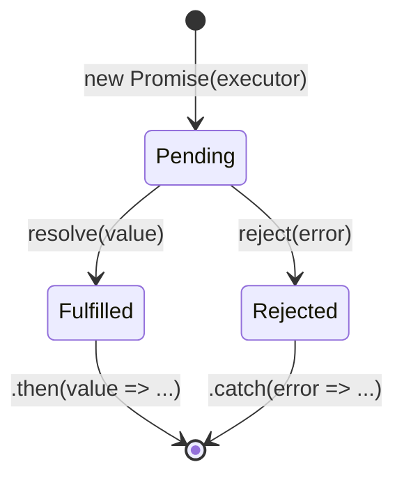

# Callbacks, Promises, async/await

Đây là ba cách viết code **bất đồng bộ** (xử lý những việc cần chờ, như tải dữ liệu, mà không làm "đứng" chương trình) trong JavaScript. **Callback** (hàm được truyền vào để gọi lại sau khi xong việc) là cách cũ nhất; **Promise** (đối tượng đại diện cho kết quả sẽ có trong tương lai) giúp code gọn và dễ kiểm soát lỗi hơn; còn **async/await** (cú pháp viết code bất đồng bộ trông như đồng bộ) giúp người mới đọc và viết dễ hiểu nhất.

---

:::note[Ghi nhớ nhanh]

- ⭐ **Ba cách viết async: callback → Promise → async/await** — callback lồng nhau tạo "callback hell"; `Promise` cho chuỗi `.then()` phẳng với một `.catch()`; `async/await` viết async trông như sync, dễ đọc nhất.
- ⭐ **`Promise` có 3 trạng thái và chỉ settle một lần** — pending → fulfilled hoặc rejected, sau đó không đổi được nữa; `.finally()` chạy ở cả hai nhánh.
- **`async function` luôn trả về Promise** — cần `await` (hoặc `.then`) để lấy giá trị, không phải giá trị trực tiếp.
- **4 method composition** — `Promise.all` (cần tất cả, fail-fast), `allSettled` (không bao giờ reject), `race` (cái đầu tiên settle, dùng cho timeout), `any` (fulfilled đầu tiên, fastest wins).
- **`await` trong loop chạy tuần tự (chậm)** — dùng `Promise.all(ids.map(...))` để chạy song song, trừ khi cần thứ tự hoặc phụ thuộc bước trước; luôn handle error, đừng nuốt reject bằng `catch {}` rỗng.

:::

---

## Mục lục

- [Vì sao Promise & async/await ra đời?](#vì-sao-promise--asyncawait-ra-đời)
- [Callbacks](#callbacks)
- [Callback Hell](#callback-hell)
- [Promises](#promises)
- [Promise composition](#promise-composition)
- [async / await](#async--await)
- [Best practices](#best-practices)
- [Câu hỏi phỏng vấn](#câu-hỏi-phỏng-vấn)

---

## Vì sao Promise & async/await ra đời?

**Vấn đề:** Trước đây, mọi việc bất đồng bộ đều dùng **callback**. Khi nhiều
bước phụ thuộc nhau, callback lồng callback tạo thành "callback hell" (kim tự
tháp lệch — "pyramid of doom"): khó đọc, và **mỗi tầng phải tự kiểm tra lỗi**:

```js
loadUser(1, (err, user) => {
  if (err) return handle(err);
  loadOrders(user.id, (err, orders) => {
    if (err) return handle(err);
    loadPayments(orders[0].id, (err, payments) => {
      if (err) return handle(err);
      loadInvoice(payments[0].id, (err, invoice) => {
        if (err) return handle(err);
        console.log(invoice); // logic chính bị đẩy sâu vào trong
      });
    });
  });
});
```

**Giải pháp:**

**1. Promise (ES6)** — đối tượng đại diện cho giá trị "sẽ có trong tương lai".
Cho phép nối chuỗi `.then()` **phẳng**, gom xử lý lỗi vào một `.catch()` duy nhất:

```js
loadUser(1)
  .then((user) => loadOrders(user.id))
  .then((orders) => loadPayments(orders[0].id))
  .then((payments) => loadInvoice(payments[0].id))
  .then((invoice) => console.log(invoice))
  .catch(handle); // một chỗ xử lý lỗi cho cả chuỗi
```

**2. async/await (ES2017)** — viết code bất đồng bộ **trông như đồng bộ**, dùng
`try/catch` quen thuộc. Dễ đọc nhất:

```js
async function showInvoice() {
  try {
    const user = await loadUser(1);
    const orders = await loadOrders(user.id);
    const payments = await loadPayments(orders[0].id);
    const invoice = await loadInvoice(payments[0].id);
    console.log(invoice);
  } catch (err) {
    handle(err);
  }
}
```

:::tip[Dùng thực tế]

- **Gọi nhiều API tuần tự**: chờ kết quả bước trước rồi mới làm bước sau (`await` lần lượt).
- **Gọi song song**: chạy nhiều request cùng lúc với `Promise.all([...])` rồi gộp kết quả.
- **Retry khi lỗi**: bọc trong `try/catch`, thử lại vài lần trước khi báo lỗi.
- **Đọc file tuần tự (Node)**: `await` từng thao tác I/O thay vì lồng callback.

:::

---

## Callbacks

Callback = function được truyền vào function khác, gọi **sau khi** xong
việc:

```js
function loadUser(id, callback) {
  setTimeout(() => {
    callback(null, { id, name: "An" });
  }, 1000);
}

loadUser(1, (err, user) => {
  if (err) return console.error(err);
  console.log(user);
});
```

**Node-style callback** — quy ước (err, result):

```js
fs.readFile("file.txt", "utf-8", (err, data) => {
  if (err) return console.error(err);
  console.log(data);
});
```

---

## Callback Hell

Khi nhiều async lồng nhau → "pyramid of doom":

```js
loadUser(1, (err, user) => {
  if (err) return handle(err);
  loadOrders(user.id, (err, orders) => {
    if (err) return handle(err);
    loadPayments(orders[0].id, (err, payments) => {
      if (err) return handle(err);
      // ...
    });
  });
});
```

Vấn đề: khó đọc, khó error-handle, dễ lặp code.

Promise + async/await ra đời để giải quyết.

---

## Promises

`Promise` là object đại diện cho **kết quả tương lai** của async op.

3 trạng thái:

- **Pending** — đang chạy.
- **Fulfilled** — thành công (có giá trị).
- **Rejected** — thất bại (có lý do).



Promise chỉ chuyển trạng thái **một lần duy nhất** (settle) — đã
fulfilled/rejected thì không đổi được nữa; `.finally()` chạy ở cả hai nhánh.

```js
const p = new Promise((resolve, reject) => {
  setTimeout(() => {
    if (Math.random() > 0.5) {
      resolve("OK");
    } else {
      reject(new Error("Fail"));
    }
  }, 1000);
});

p.then(value => console.log(value))
 .catch(err => console.error(err))
 .finally(() => console.log("Done"));
```

`.then` trả về promise mới — chain được:

```js
fetch("/api/user/1")
  .then(res => res.json())
  .then(user => fetch(`/api/orders/${user.id}`))
  .then(res => res.json())
  .then(orders => console.log(orders))
  .catch(err => console.error(err));
```

---

## Promise composition

**`Promise.all`** — chờ tất cả; fail-fast nếu có 1 reject:

```js
const [users, posts] = await Promise.all([
  fetch("/users").then(r => r.json()),
  fetch("/posts").then(r => r.json()),
]);
```

**`Promise.allSettled`** — chờ tất cả, không reject:

```js
const results = await Promise.allSettled(promises);
// [{ status: "fulfilled", value }, { status: "rejected", reason }, ...]
```

**`Promise.race`** — lấy promise đầu tiên settle (fulfill hoặc reject):

```js
const result = await Promise.race([
  fetch(url),
  new Promise((_, reject) => setTimeout(() => reject(new Error("Timeout")), 5000)),
]);
```

**`Promise.any`** — lấy fulfilled đầu tiên; reject nếu tất cả reject
(với `AggregateError`):

```js
const fastest = await Promise.any([
  fetch(server1),
  fetch(server2),
  fetch(server3),
]);
```

:::info[Phân tích]

**4 method composition** so sánh:

| | Resolve khi | Reject khi | Use case |
|--|-------------|-----------|----------|
| `all` | Tất cả fulfilled | **Bất kỳ** reject | Cần tất cả thành công |
| `allSettled` | Tất cả settle | **Không bao giờ** | Cần biết kết quả từng cái |
| `race` | **Bất kỳ** settle | **Bất kỳ** settle (đầu tiên) | Timeout pattern |
| `any` | **Bất kỳ** fulfilled | Tất cả reject | Fallback / fastest wins |

Lựa chọn đúng method ảnh hưởng cách app xử lý lỗi mạng. Vd dashboard:

```js
// Tệ — 1 widget lỗi → cả dashboard lỗi
const data = await Promise.all([
  fetchUser(), fetchStats(), fetchNotifs(),
]);

// Tốt — render được phần thành công
const results = await Promise.allSettled([
  fetchUser(), fetchStats(), fetchNotifs(),
]);

results.forEach((r, i) => {
  if (r.status === "fulfilled") render(i, r.value);
  else renderError(i, r.reason);
});
```

:::

---

## async / await

ES2017 — syntactic sugar cho Promise, viết async như sync:

```js
async function loadUserOrders(userId) {
  try {
    const user = await fetchUser(userId);
    const orders = await fetchOrders(user.id);
    return orders;
  } catch (err) {
    console.error(err);
    throw err;
  }
}
```

`async function` luôn **trả về Promise**:

```js
async function getValue() {
  return 42;
}

getValue(); // Promise<42> — không phải 42
const x = await getValue(); // 42
```

`await` chỉ dùng được:

- Trong `async function`.
- **Top-level** trong ES Module (top-level await, ES2022).

**Top-level await:**

```js
// module.mjs hoặc "type": "module"
const config = await fetch("/config.json").then(r => r.json());
export { config };
```

:::warning[Cần lưu ý]

**`await` trong loop tuần tự — không phải lúc nào cũng đúng:**

```js
// Tuần tự — chậm
for (const id of ids) {
  const user = await fetchUser(id);
  console.log(user);
}

// Song song — nhanh hơn nhiều
const users = await Promise.all(ids.map(id => fetchUser(id)));
```

Trừ khi:

- Cần thứ tự tuyệt đối.
- Cần kết quả của bước trước cho bước sau.
- Bị rate limit (quá nhiều request đồng thời).

Cho rate limit, dùng `p-limit` hoặc tự viết:

```js
import pLimit from "p-limit";

const limit = pLimit(5); // tối đa 5 song song
const users = await Promise.all(
  ids.map(id => limit(() => fetchUser(id)))
);
```

:::

---

## Best practices

**1. Luôn handle error**:

```js
// Tệ — unhandled rejection
loadData();

// Tốt
loadData().catch(handleError);

// Hoặc trong async
async function main() {
  try {
    await loadData();
  } catch (err) {
    handleError(err);
  }
}
```

**2. Đừng "nuốt" reject bằng try empty:**

```js
// Tệ
try {
  await op();
} catch {}

// Tốt — log hoặc rethrow
try {
  await op();
} catch (err) {
  logger.error(err);
}
```

**3. Đừng mix `.then` và `await` trong một function:**

```js
// Tệ — khó đọc
async function load() {
  return fetch(url).then(r => r.json());
}

// Tốt
async function load() {
  const res = await fetch(url);
  return res.json();
}
```

**4. `Promise.withResolvers` (ES2024) — tạo Promise có resolve/reject ngoài:**

```js
const { promise, resolve, reject } = Promise.withResolvers();

setTimeout(() => resolve("OK"), 1000);

await promise; // "OK"
```

Thay thế pattern cũ:

```js
let resolve, reject;
const p = new Promise((r, rj) => { resolve = r; reject = rj; });
```

:::tip[Mẹo]

**Đo thời gian async**:

```js
console.time("fetch");
await fetch(url);
console.timeEnd("fetch"); // fetch: 234.5ms

// Hoặc performance.now
const start = performance.now();
await fetch(url);
console.log(performance.now() - start);
```

`performance.now()` chính xác hơn `Date.now()` (microsecond resolution),
phù hợp đo performance.

:::

---

## Câu hỏi phỏng vấn

Những câu thường gặp về chủ đề này. Tự trả lời trước, rồi đối chiếu lại với nội dung phía trên.

1. `callback hell` là gì? Ngoài chuyện khó đọc, nó còn gây khó khăn cụ thể nào về xử lý lỗi?
2. Quy ước `error-first callback` trong Node.js là gì và vì sao nó ra đời?
3. Một `Promise` có những trạng thái nào? Một promise đã settle rồi có đổi trạng thái được nữa không?
4. Executor truyền vào `new Promise(...)` chạy **đồng bộ** hay **bất đồng bộ**? Điều đó có hệ quả gì?
5. Giải thích chuỗi `.then().then().catch()`: mỗi `.then` trả về cái gì, và vì sao chuỗi lại "phẳng" chứ không lồng nhau?
6. Trong `.then`, `return` một giá trị thường khác `return` một Promise ở chỗ nào đối với mắt xích phía sau?
7. `.catch()` đặt giữa chuỗi và đặt cuối chuỗi khác nhau thế nào? Sau khi `.catch()` bắt được lỗi thì chuỗi phía sau còn chạy không?
8. `.finally()` chạy vào lúc nào? Nó có nhận giá trị resolve không, và có làm đổi giá trị truyền xuống dưới không?
9. `async function` trả về gì khi bên trong bạn `return 42`? Còn khi bên trong `throw` thì sao?
10. `await` thực chất làm gì với phần code phía sau nó? Nó có "block" luồng chính không? Giải thích qua event loop.
11. So sánh `Promise.all`, `Promise.allSettled`, `Promise.race`, `Promise.any`: mỗi cái resolve khi nào và reject khi nào?
12. Khi `Promise.all` gặp một promise reject, các promise còn lại có bị hủy không? Chuyện gì xảy ra với kết quả của chúng?
13. Một dashboard gọi ba API độc lập — chọn `Promise.all` hay `Promise.allSettled`? Phân tích đánh đổi về trải nghiệm người dùng.
14. `Promise.any` reject với loại lỗi nào khi tất cả đầu vào đều thất bại?
15. Cài timeout cho request bằng `Promise.race` như thế nào? Cách này có thực sự **hủy** request không, và nên dùng gì thay thế?
16. `await` trong vòng `for` khác `Promise.all(ids.map(...))` thế nào về hiệu năng? Nếu mỗi lời gọi mất 1 giây và có 5 id thì mỗi cách mất bao lâu?
17. Khi nào bắt buộc phải `await` tuần tự thay vì chạy song song?
18. Làm sao giới hạn số request chạy song song (ví dụ tối đa 5) khi có 1000 việc? Mô tả ý tưởng cài đặt.
19. `unhandled promise rejection` là gì? Browser và Node xử lý nó khác nhau ra sao?
20. Vì sao `try { await op(); } catch {}` rỗng là anti-pattern? Nên viết thế nào cho đúng?
21. Đoạn sau in ra thứ tự nào: `console.log("A"); (async () => { console.log("B"); await null; console.log("C"); })(); Promise.resolve().then(() => console.log("D")); console.log("E");`
22. Hãy tự viết `promisify` biến một hàm callback-style thành hàm trả về Promise — cần xử lý những gì?
23. `top-level await` trong ES Module là gì? Nó ảnh hưởng thế nào tới thứ tự load của các module khác?
