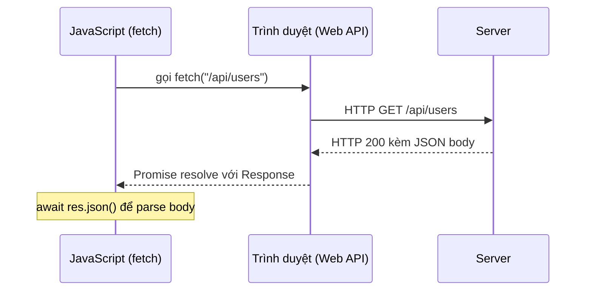
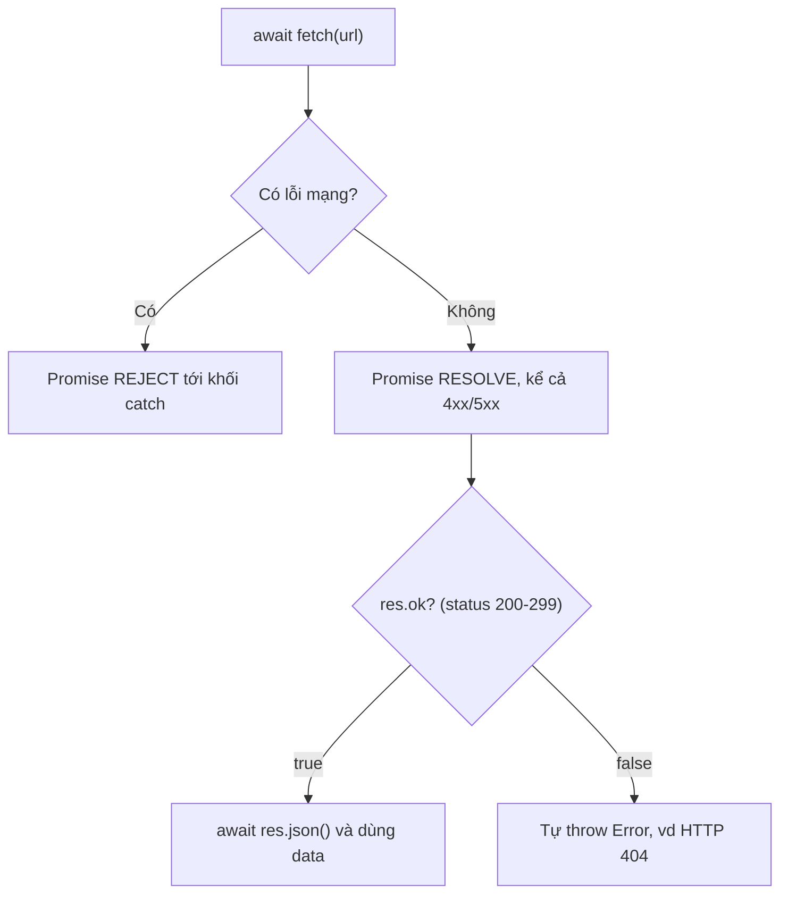

# XMLHttpRequest, Fetch API

Khi muốn lấy dữ liệu từ máy chủ (server) mà không tải lại trang, JavaScript dùng các **API** (Application Programming Interface — giao diện lập trình ứng dụng) để gửi yêu cầu qua mạng. **XMLHttpRequest** là cách cũ và khá rườm rà, còn **Fetch API** là cách hiện đại, gọn gàng hơn và trả về **Promise** (đối tượng đại diện cho kết quả sẽ có trong tương lai). Bài này giúp bạn mới học hiểu cách trình duyệt giao tiếp với server để gửi và nhận dữ liệu.

---

:::note[Ghi nhớ nhanh]

- ⭐ **`fetch` KHÔNG reject với HTTP error (4xx/5xx)** — chỉ reject khi lỗi mạng; phải tự kiểm tra `res.ok` rồi throw, nếu không sẽ dễ gây bug.
- ⭐ **`fetch` là cách hiện đại thay cho `XMLHttpRequest`** — dựa trên Promise, gọn gàng; XHR chỉ còn cần khi theo dõi progress upload hoặc hỗ trợ trình duyệt rất cũ.
- **Web API do trình duyệt cung cấp, không phải core JS** — `fetch`, `localStorage`, Geolocation... là cầu nối tới khả năng của nền tảng.
- **`Response` tiêu thụ body một lần** — dùng `res.json()`, `res.text()`, `res.blob()`...; inspect qua `res.ok`, `res.status`, `res.headers`.
- **`AbortController` để hủy request** — kèm shortcut `AbortSignal.timeout(ms)` và `AbortSignal.any([...])`; project lớn nên gom vào một hàm `api` wrapper để xử lý auth, lỗi, retry.

:::

---

## Mục lục

- [Vì sao có Web API?](#vì-sao-có-web-api)
- [XMLHttpRequest (cũ)](#xmlhttprequest-cũ)
- [Fetch API](#fetch-api)
- [Request và Response](#request-và-response)
- [Error handling](#error-handling)
- [Abort request](#abort-request)
- [Thư viện hiện đại](#thư-viện-hiện-đại)
- [Câu hỏi phỏng vấn](#câu-hỏi-phỏng-vấn)

---

## Vì sao có Web API?

**Vấn đề:**

```js
// Bản thân ngôn ngữ JS (ECMAScript) chỉ biết tính toán, xử lý chuỗi,
// mảng, object... Nó KHÔNG biết cách gọi mạng hay lưu dữ liệu lên máy:

const data = downloadFromServer("/api/users"); // ❌ không tồn tại trong JS core
saveToDisk("token", "abc123");                  // ❌ JS thuần không làm được

// Trước đây để gọi mạng phải dùng XMLHttpRequest — dài dòng, dựa trên callback:
const xhr = new XMLHttpRequest();
xhr.open("GET", "/api/users");
xhr.onload = () => console.log(xhr.responseText);
xhr.onerror = () => console.error("lỗi mạng");
xhr.send();
```

**Giải pháp:**

```js
// Web API do TRÌNH DUYỆT cung cấp (không phải core JS) làm cầu nối tới
// khả năng của nền tảng. JS gọi các API này để tương tác thế giới ngoài:

// fetch — gọi HTTP, trả về Promise (thay cho XMLHttpRequest)
const res = await fetch("/api/users");
const users = await res.json();

// localStorage — lưu dữ liệu ngay trên máy người dùng
localStorage.setItem("token", "abc123");

// Geolocation — lấy vị trí người dùng
navigator.geolocation.getCurrentPosition((pos) => {
  console.log(pos.coords.latitude, pos.coords.longitude);
});
```

:::tip[Dùng thực tế]

- **Gọi REST API**: dùng `fetch` để lấy danh sách user, gửi form (POST) lên server.
- **Lưu trạng thái**: lưu token đăng nhập hoặc theme sáng/tối vào `localStorage`.
- **Lấy vị trí**: dùng Geolocation cho tính năng "tìm cửa hàng gần tôi".
- **Thông báo**: gửi push notification nhắc người dùng quay lại ứng dụng.

:::

---

## XMLHttpRequest (cũ)

API legacy — vẫn hỗ trợ nhưng **không nên dùng trong code mới**:

```js
const xhr = new XMLHttpRequest();
xhr.open("GET", "/api/users");
xhr.responseType = "json";

xhr.onload = () => {
  if (xhr.status === 200) {
    console.log(xhr.response);
  }
};

xhr.onerror = () => console.error("Network error");
xhr.send();
```

Vấn đề:

- API callback-based, không Promise.
- Verbose, dễ sai.
- Khó hủy đúng cách.

XHR vẫn cần khi:
- Theo dõi **progress** upload (Fetch không hỗ trợ tốt).
- Hỗ trợ trình duyệt **rất cũ** (IE).

---

## Fetch API

API hiện đại, dựa trên Promise:

```js
// GET
const res = await fetch("/api/users");
const users = await res.json();

// POST với JSON
const res = await fetch("/api/users", {
  method: "POST",
  headers: { "Content-Type": "application/json" },
  body: JSON.stringify({ name: "An" }),
});

const data = await res.json();
```

Về bản chất, `fetch` nhờ **trình duyệt** (nơi cung cấp Web API) gửi yêu cầu
HTTP tới server rồi trả kết quả về cho JavaScript dưới dạng Promise:



**Options thường dùng:**

```js
fetch(url, {
  method: "POST",
  headers: {
    "Content-Type": "application/json",
    "Authorization": `Bearer ${token}`,
  },
  body: JSON.stringify(payload),
  credentials: "include",  // gửi cookie cross-origin
  cache: "no-cache",
  mode: "cors",
  redirect: "follow",
  signal: abortController.signal,
});
```

---

## Request và Response

`Response` có các method **tiêu thụ body** (chỉ gọi 1 lần):

```js
const res = await fetch(url);

await res.json();       // parse JSON
await res.text();       // string thuần
await res.blob();       // file binary
await res.arrayBuffer(); // raw bytes
await res.formData();    // FormData
```

Inspect response:

```js
res.ok;          // true nếu status 200-299
res.status;      // 200, 404, 500...
res.statusText;  // "OK", "Not Found"
res.headers.get("Content-Type");
res.url;
```

:::warning[Cần lưu ý]

**`fetch` không reject với HTTP error** (4xx, 5xx) — chỉ reject với
**network error**:

```js
const res = await fetch("/not-exist");
// res.status = 404, NHƯNG không throw

// Sai
try {
  const data = await fetch("/not-exist").then(r => r.json());
} catch (err) {
  // chỉ bắt được network error, không bắt 404/500
}

// Đúng
const res = await fetch("/not-exist");
if (!res.ok) {
  throw new Error(`HTTP ${res.status}`);
}
const data = await res.json();
```

Sơ đồ dưới cho thấy vì sao phải tự kiểm tra `res.ok`: chỉ **lỗi mạng** mới
làm Promise reject, còn 4xx/5xx vẫn resolve bình thường:



Đây là behavior **theo design** — nhưng dễ gây bug. Wrapper hàm chung
xử lý sớm:

```js
async function api(url, opts) {
  const res = await fetch(url, opts);
  if (!res.ok) {
    const text = await res.text();
    throw new Error(`${res.status} ${res.statusText}: ${text}`);
  }
  return res.json();
}
```

:::

---

## Error handling

```js
async function loadUser(id) {
  try {
    const res = await fetch(`/api/users/${id}`);
    if (!res.ok) {
      throw new Error(`HTTP ${res.status}`);
    }
    return await res.json();
  } catch (err) {
    if (err.name === "AbortError") {
      console.log("Cancelled");
      return null;
    }
    console.error("Network error", err);
    throw err;
  }
}
```

---

## Abort request

`AbortController` — hủy fetch khi cần:

```js
const ctrl = new AbortController();

fetch("/api/slow", { signal: ctrl.signal })
  .then(r => r.json())
  .catch(err => {
    if (err.name === "AbortError") {
      console.log("Cancelled");
    }
  });

// Hủy sau 5s
setTimeout(() => ctrl.abort(), 5000);

// Hoặc user click cancel
button.onclick = () => ctrl.abort();
```

`AbortSignal.timeout(ms)` (ES2022+) — shortcut:

```js
fetch(url, { signal: AbortSignal.timeout(5000) });
```

`AbortSignal.any([s1, s2])` — kết hợp nhiều signal:

```js
const userCancel = new AbortController();
const timeout = AbortSignal.timeout(5000);

fetch(url, { signal: AbortSignal.any([userCancel.signal, timeout]) });
```

---

## Thư viện hiện đại

| Thư viện | Đặc điểm |
|----------|----------|
| **Axios** | Lâu đời, có interceptor, transform sẵn |
| **ky** | Wrapper Fetch gọn, hooks, retry |
| **ofetch** | Universal (browser + Node), retry, từ Nuxt team |
| **redaxios** | Axios API nhưng dùng Fetch, ~1KB |
| **wretch** | Fluent API, lightweight |

```js
// ofetch — pattern hiện đại
import { ofetch } from "ofetch";

const data = await ofetch("/api/users", {
  method: "POST",
  body: { name: "An" }, // tự stringify
  retry: 3,
  onResponseError({ response }) {
    console.error("API error", response.status);
  },
});
```

:::info[Phân tích]

**Khi nào dùng thư viện vs fetch trực tiếp?**

**Dùng fetch khi:**

- Project nhỏ, ít HTTP call.
- Không cần feature đặc biệt.
- Bundle size critical (mỗi KB quan trọng).

**Dùng thư viện khi:**

- Cần **interceptor** (auth header, refresh token, logging).
- Cần **retry** với exponential backoff.
- Cần **timeout** mặc định.
- Cần **transform** request/response.
- Codebase lớn — muốn API thống nhất.

Trong codebase 2026, **tRPC** hoặc **Hono client** thường thay thế HTTP
client thường — type-safe end-to-end, không phải khai báo type response.

:::

:::tip[Mẹo]

**Pattern wrapper `api` cho project**:

```js
async function api(path, opts = {}) {
  const res = await fetch(`${BASE_URL}${path}`, {
    ...opts,
    headers: {
      "Content-Type": "application/json",
      ...(getToken() && { Authorization: `Bearer ${getToken()}` }),
      ...opts.headers,
    },
    body: opts.body ? JSON.stringify(opts.body) : undefined,
  });

  if (res.status === 401) {
    await refreshToken();
    return api(path, opts); // retry
  }

  if (!res.ok) {
    const error = await res.json().catch(() => ({}));
    throw new ApiError(res.status, error.message);
  }

  return res.json();
}

// Dùng
const users = await api("/users");
const user = await api("/users", { method: "POST", body: { name: "An" } });
```

Một wrapper duy nhất xử lý: auth, error format, refresh token, retry —
không lặp ở mọi call site.

:::

---

## Câu hỏi phỏng vấn

Những câu thường gặp về chủ đề này. Tự trả lời trước, rồi đối chiếu lại với nội dung phía trên.

1. Web API (`fetch`, `localStorage`, Geolocation) do **ngôn ngữ JavaScript** hay do **môi trường chạy** cung cấp? Vì sao phân biệt này quan trọng khi code chạy cả trên browser và Node?
2. So sánh `XMLHttpRequest` và `fetch`. Ngày nay còn trường hợp nào bắt buộc phải dùng XHR không?
3. `fetch` trả về cái gì? Vì sao thường phải `await` hai lần (`await fetch(...)` rồi `await res.json()`)?
4. `fetch` có reject khi server trả `404` hoặc `500` không? Nếu không thì phải kiểm tra lỗi HTTP bằng cách nào? Vì sao spec lại thiết kế như vậy?
5. `res.ok` là gì, ứng với khoảng status nào? Redirect và lỗi mạng rơi vào nhánh nào?
6. Vì sao body của `Response` chỉ đọc được **một lần**? Nếu cần đọc hai lần (log rồi parse) thì làm thế nào?
7. Gửi POST JSON bằng `fetch` cần khai báo những gì? Điều gì xảy ra nếu quên header `Content-Type`?
8. Gửi `JSON.stringify(payload)` khác gửi `FormData` ở chỗ nào? Vì sao với `FormData` bạn **không nên** tự set `Content-Type`?
9. `credentials: "include"` dùng để làm gì? Nó ràng buộc server phải trả về header CORS nào?
10. CORS là gì và ai là người chặn request? Vì sao gọi cùng một URL bằng `curl` thì được mà trong browser lại lỗi?
11. `preflight request` (`OPTIONS`) được gửi khi nào? Yếu tố nào biến một request thành "non-simple"?
12. `mode: "no-cors"` cho ra kết quả gì? Vì sao nó không phải cách "vượt" CORS?
13. `AbortController` dùng thế nào để hủy `fetch`? Phân biệt lỗi hủy (`AbortError`) với lỗi mạng ra sao?
14. `AbortSignal.timeout(ms)` khác gì so với tự dựng timeout bằng `Promise.race`?
15. Vì sao `fetch` không theo dõi tốt progress **upload**? Có cách nào theo dõi progress **download**?
16. So sánh `localStorage`, `sessionStorage` và `cookie`: vòng đời, dung lượng, phạm vi, và cái nào tự động gửi kèm mỗi HTTP request?
17. Lưu access token vào `localStorage` có rủi ro gì? Phương án nào an toàn hơn và đánh đổi là gì?
18. Khi nào nên dùng thư viện (`axios`, `ky`, `ofetch`) thay vì `fetch` trực tiếp? `interceptor` giải quyết vấn đề gì?
19. Thiết kế một hàm `api()` wrapper cho project: cần gom những mối quan tâm chung nào? Việc gọi lại chính nó để retry sau `401` có rủi ro gì?
20. Retry với `exponential backoff` là gì? Request kiểu nào **không** nên retry tự động?
