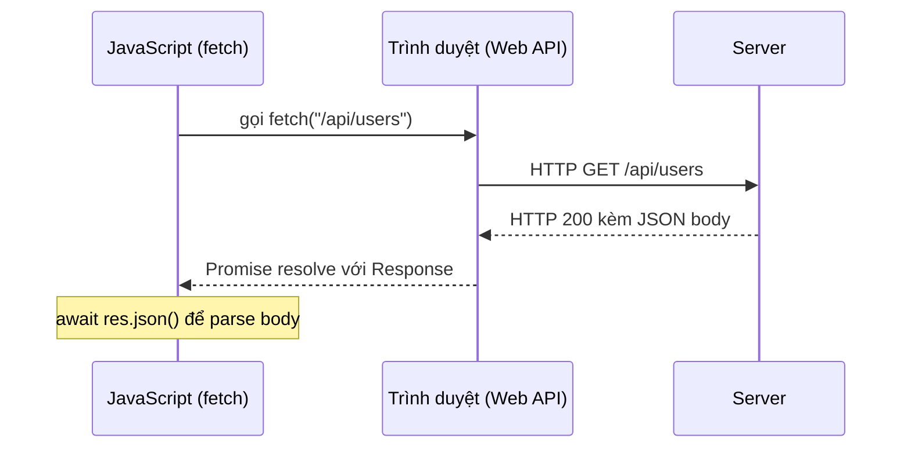
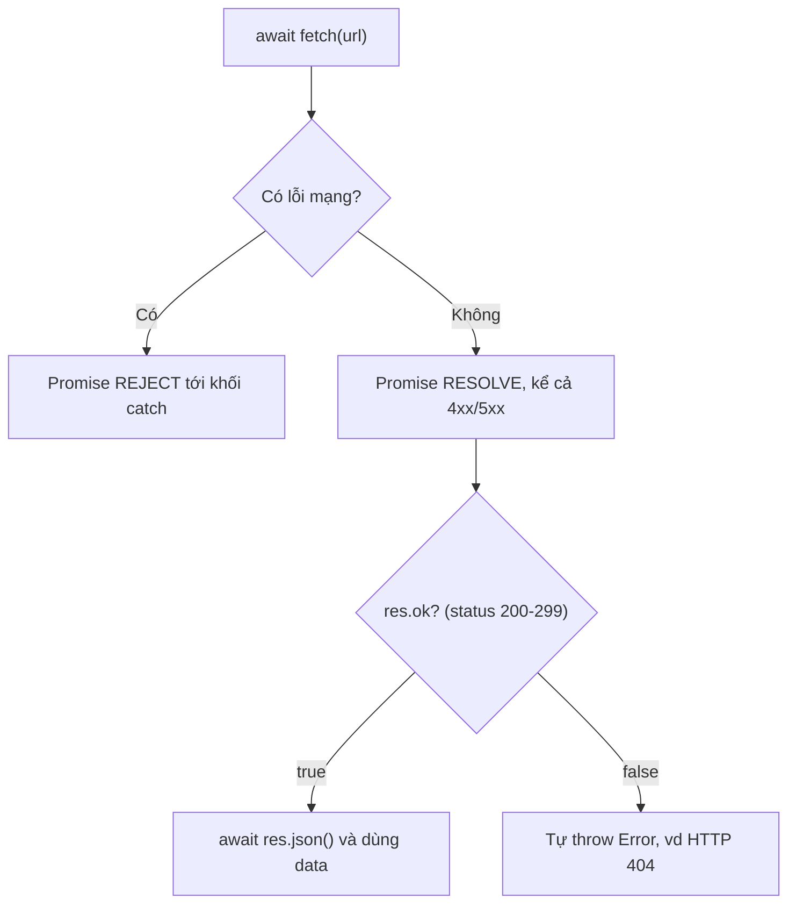

# XMLHttpRequest, Fetch API

Khi muốn lấy dữ liệu từ máy chủ (server) mà không tải lại trang, JavaScript dùng các **API** (Application Programming Interface — giao diện lập trình ứng dụng) để gửi yêu cầu qua mạng. **XMLHttpRequest** là cách cũ và khá rườm rà, còn **Fetch API** là cách hiện đại, gọn gàng hơn và trả về **Promise** (đối tượng đại diện cho kết quả sẽ có trong tương lai). Bài này giúp bạn mới học hiểu cách trình duyệt giao tiếp với server để gửi và nhận dữ liệu.

[](pathname:///img/javascript/apis.webp)

---

:::note[Ghi nhớ nhanh]

- ⭐ **`fetch` KHÔNG reject với HTTP error (4xx/5xx)** — chỉ reject khi lỗi mạng; phải tự kiểm tra `res.ok` rồi throw, nếu không sẽ dễ gây bug.
- ⭐ **`fetch` là cách hiện đại thay cho `XMLHttpRequest`** — dựa trên Promise, gọn gàng; XHR chỉ còn cần khi theo dõi progress upload hoặc hỗ trợ trình duyệt rất cũ.
- **Web API do trình duyệt cung cấp, không phải core JS** — `fetch`, `localStorage`, Geolocation... là cầu nối tới khả năng của nền tảng.
- **`Response` tiêu thụ body một lần** — dùng `res.json()`, `res.text()`, `res.blob()`...; inspect qua `res.ok`, `res.status`, `res.headers`.
- **`AbortController` để hủy request** — kèm shortcut `AbortSignal.timeout(ms)` và `AbortSignal.any([...])`; project lớn nên gom vào một hàm `api` wrapper để xử lý auth, lỗi, retry.

:::

---

## Mục lục

- [Vì sao có Web API?](#vì-sao-có-web-api)
- [XMLHttpRequest (cũ)](#xmlhttprequest-cũ)
- [Fetch API](#fetch-api)
- [Request và Response](#request-và-response)
- [Error handling](#error-handling)
- [Abort request](#abort-request)
- [Thư viện hiện đại](#thư-viện-hiện-đại)
- [Câu hỏi phỏng vấn](#câu-hỏi-phỏng-vấn)

---

## Vì sao có Web API?

**Vấn đề:**

```js
// Bản thân ngôn ngữ JS (ECMAScript) chỉ biết tính toán, xử lý chuỗi,
// mảng, object... Nó KHÔNG biết cách gọi mạng hay lưu dữ liệu lên máy:

const data = downloadFromServer("/api/users"); // ❌ không tồn tại trong JS core
saveToDisk("token", "abc123");                  // ❌ JS thuần không làm được

// Trước đây để gọi mạng phải dùng XMLHttpRequest — dài dòng, dựa trên callback:
const xhr = new XMLHttpRequest();
xhr.open("GET", "/api/users");
xhr.onload = () => console.log(xhr.responseText);
xhr.onerror = () => console.error("lỗi mạng");
xhr.send();
```

**Giải pháp:**

```js
// Web API do TRÌNH DUYỆT cung cấp (không phải core JS) làm cầu nối tới
// khả năng của nền tảng. JS gọi các API này để tương tác thế giới ngoài:

// fetch — gọi HTTP, trả về Promise (thay cho XMLHttpRequest)
const res = await fetch("/api/users");
const users = await res.json();

// localStorage — lưu dữ liệu ngay trên máy người dùng
localStorage.setItem("token", "abc123");

// Geolocation — lấy vị trí người dùng
navigator.geolocation.getCurrentPosition((pos) => {
  console.log(pos.coords.latitude, pos.coords.longitude);
});
```

:::tip[Dùng thực tế]

- **Gọi REST API**: dùng `fetch` để lấy danh sách user, gửi form (POST) lên server.
- **Lưu trạng thái**: lưu token đăng nhập hoặc theme sáng/tối vào `localStorage`.
- **Lấy vị trí**: dùng Geolocation cho tính năng "tìm cửa hàng gần tôi".
- **Thông báo**: gửi push notification nhắc người dùng quay lại ứng dụng.

:::

---

## XMLHttpRequest (cũ)

API legacy — vẫn hỗ trợ nhưng **không nên dùng trong code mới**:

```js
const xhr = new XMLHttpRequest();
xhr.open("GET", "/api/users");
xhr.responseType = "json";

xhr.onload = () => {
  if (xhr.status === 200) {
    console.log(xhr.response);
  }
};

xhr.onerror = () => console.error("Network error");
xhr.send();
```

Vấn đề:

- API callback-based, không Promise.
- Verbose, dễ sai.
- Khó hủy đúng cách.

XHR vẫn cần khi:
- Theo dõi **progress** upload (Fetch không hỗ trợ tốt).
- Hỗ trợ trình duyệt **rất cũ** (IE).

---

## Fetch API

API hiện đại, dựa trên Promise:

```js
// GET
const res = await fetch("/api/users");
const users = await res.json();

// POST với JSON
const res = await fetch("/api/users", {
  method: "POST",
  headers: { "Content-Type": "application/json" },
  body: JSON.stringify({ name: "An" }),
});

const data = await res.json();
```

Về bản chất, `fetch` nhờ **trình duyệt** (nơi cung cấp Web API) gửi yêu cầu
HTTP tới server rồi trả kết quả về cho JavaScript dưới dạng Promise:



**Options thường dùng:**

```js
fetch(url, {
  method: "POST",
  headers: {
    "Content-Type": "application/json",
    "Authorization": `Bearer ${token}`,
  },
  body: JSON.stringify(payload),
  credentials: "include",  // gửi cookie cross-origin
  cache: "no-cache",
  mode: "cors",
  redirect: "follow",
  signal: abortController.signal,
});
```

---

## Request và Response

`Response` có các method **tiêu thụ body** (chỉ gọi 1 lần):

```js
const res = await fetch(url);

await res.json();       // parse JSON
await res.text();       // string thuần
await res.blob();       // file binary
await res.arrayBuffer(); // raw bytes
await res.formData();    // FormData
```

Inspect response:

```js
res.ok;          // true nếu status 200-299
res.status;      // 200, 404, 500...
res.statusText;  // "OK", "Not Found"
res.headers.get("Content-Type");
res.url;
```

:::warning[Cần lưu ý]

**`fetch` không reject với HTTP error** (4xx, 5xx) — chỉ reject với
**network error**:

```js
const res = await fetch("/not-exist");
// res.status = 404, NHƯNG không throw

// Sai
try {
  const data = await fetch("/not-exist").then(r => r.json());
} catch (err) {
  // chỉ bắt được network error, không bắt 404/500
}

// Đúng
const res = await fetch("/not-exist");
if (!res.ok) {
  throw new Error(`HTTP ${res.status}`);
}
const data = await res.json();
```

Sơ đồ dưới cho thấy vì sao phải tự kiểm tra `res.ok`: chỉ **lỗi mạng** mới
làm Promise reject, còn 4xx/5xx vẫn resolve bình thường:



Đây là behavior **theo design** — nhưng dễ gây bug. Wrapper hàm chung
xử lý sớm:

```js
async function api(url, opts) {
  const res = await fetch(url, opts);
  if (!res.ok) {
    const text = await res.text();
    throw new Error(`${res.status} ${res.statusText}: ${text}`);
  }
  return res.json();
}
```

:::

---

## Error handling

```js
async function loadUser(id) {
  try {
    const res = await fetch(`/api/users/${id}`);
    if (!res.ok) {
      throw new Error(`HTTP ${res.status}`);
    }
    return await res.json();
  } catch (err) {
    if (err.name === "AbortError") {
      console.log("Cancelled");
      return null;
    }
    console.error("Network error", err);
    throw err;
  }
}
```

---

## Abort request

`AbortController` — hủy fetch khi cần:

```js
const ctrl = new AbortController();

fetch("/api/slow", { signal: ctrl.signal })
  .then(r => r.json())
  .catch(err => {
    if (err.name === "AbortError") {
      console.log("Cancelled");
    }
  });

// Hủy sau 5s
setTimeout(() => ctrl.abort(), 5000);

// Hoặc user click cancel
button.onclick = () => ctrl.abort();
```

`AbortSignal.timeout(ms)` (ES2022+) — shortcut:

```js
fetch(url, { signal: AbortSignal.timeout(5000) });
```

`AbortSignal.any([s1, s2])` — kết hợp nhiều signal:

```js
const userCancel = new AbortController();
const timeout = AbortSignal.timeout(5000);

fetch(url, { signal: AbortSignal.any([userCancel.signal, timeout]) });
```

---

## Thư viện hiện đại

| Thư viện | Đặc điểm |
|----------|----------|
| **Axios** | Lâu đời, có interceptor, transform sẵn |
| **ky** | Wrapper Fetch gọn, hooks, retry |
| **ofetch** | Universal (browser + Node), retry, từ Nuxt team |
| **redaxios** | Axios API nhưng dùng Fetch, ~1KB |
| **wretch** | Fluent API, lightweight |

```js
// ofetch — pattern hiện đại
import { ofetch } from "ofetch";

const data = await ofetch("/api/users", {
  method: "POST",
  body: { name: "An" }, // tự stringify
  retry: 3,
  onResponseError({ response }) {
    console.error("API error", response.status);
  },
});
```

:::info[Phân tích]

**Khi nào dùng thư viện vs fetch trực tiếp?**

**Dùng fetch khi:**

- Project nhỏ, ít HTTP call.
- Không cần feature đặc biệt.
- Bundle size critical (mỗi KB quan trọng).

**Dùng thư viện khi:**

- Cần **interceptor** (auth header, refresh token, logging).
- Cần **retry** với exponential backoff.
- Cần **timeout** mặc định.
- Cần **transform** request/response.
- Codebase lớn — muốn API thống nhất.

Trong codebase 2026, **tRPC** hoặc **Hono client** thường thay thế HTTP
client thường — type-safe end-to-end, không phải khai báo type response.

:::

:::tip[Mẹo]

**Pattern wrapper `api` cho project**:

```js
async function api(path, opts = {}) {
  const res = await fetch(`${BASE_URL}${path}`, {
    ...opts,
    headers: {
      "Content-Type": "application/json",
      ...(getToken() && { Authorization: `Bearer ${getToken()}` }),
      ...opts.headers,
    },
    body: opts.body ? JSON.stringify(opts.body) : undefined,
  });

  if (res.status === 401) {
    await refreshToken();
    return api(path, opts); // retry
  }

  if (!res.ok) {
    const error = await res.json().catch(() => ({}));
    throw new ApiError(res.status, error.message);
  }

  return res.json();
}

// Dùng
const users = await api("/users");
const user = await api("/users", { method: "POST", body: { name: "An" } });
```

Một wrapper duy nhất xử lý: auth, error format, refresh token, retry —
không lặp ở mọi call site.

:::

---

## Câu hỏi phỏng vấn

Những câu thường gặp về chủ đề này. Tự trả lời trước, rồi bấm **Xem đáp án** để đối chiếu.

**1. Web API (`fetch`, `localStorage`, Geolocation) do ngôn ngữ JavaScript hay do môi trường chạy cung cấp? Vì sao phân biệt này quan trọng khi code chạy cả trên browser và Node?**

<details className="qa">
<summary>Xem đáp án</summary>

Chúng do **môi trường chạy** cung cấp, không thuộc ngôn ngữ. Chuẩn ECMAScript chỉ định nghĩa `Object`, `Array`, `Promise`, `JSON`, `Math`... — hoàn toàn không có khái niệm mạng hay lưu trữ. `fetch`, `localStorage`, `navigator.geolocation` là Web API do trình duyệt bổ sung, còn Node.js có bộ API riêng (`fs`, `http`, `process`).

Phân biệt này quan trọng vì:

- Cùng một đoạn code chạy được ở browser nhưng crash ở Node và ngược lại — `localStorage is not defined` là lỗi kinh điển khi làm SSR.
- Khi viết code universal (Next.js, Nuxt), phải kiểm tra môi trường trước khi chạm vào API riêng của nền tảng:

```js
if (typeof window !== "undefined") {
  localStorage.setItem("theme", "dark");
}
```

- `fetch` từng chỉ có ở browser; Node mới tích hợp sẵn từ v18, trước đó phải cài `node-fetch`. Biết thứ gì thuộc ngôn ngữ, thứ gì thuộc runtime giúp bạn đoán đúng nguyên nhân lỗi thay vì mò mẫm.

</details>

**2. So sánh `XMLHttpRequest` và `fetch`. Ngày nay còn trường hợp nào bắt buộc phải dùng XHR không?**

<details className="qa">
<summary>Xem đáp án</summary>

| Tiêu chí | `XMLHttpRequest` | `fetch` |
|---|---|---|
| Mô hình | Callback (`onload`, `onerror`) | Promise, dùng được `async/await` |
| Cú pháp | Dài dòng, nhiều bước (`open` → gán handler → `send`) | Gọn, một lời gọi |
| Hủy request | `xhr.abort()`, khó phối hợp | `AbortController` — chuẩn chung, kết hợp được nhiều signal |
| Streaming | Không | `res.body` là `ReadableStream` |
| Progress upload | Có `xhr.upload.onprogress` | Không hỗ trợ tốt |

`fetch` là lựa chọn mặc định cho code mới. XHR vẫn còn giá trị trong hai tình huống bài đã nêu: **theo dõi progress khi upload file** (thanh phần trăm lúc gửi lên server) và **hỗ trợ trình duyệt rất cũ** kiểu IE. Ngoài ra XHR còn hỗ trợ request đồng bộ (đã bị khuyến cáo không dùng vì block UI thread). Với mọi trường hợp còn lại, dùng `fetch` hoặc một wrapper trên nó.

</details>

**3. `fetch` trả về cái gì? Vì sao thường phải `await` hai lần (`await fetch(...)` rồi `await res.json()`)?**

<details className="qa">
<summary>Xem đáp án</summary>

`fetch` trả về một **`Promise<Response>`**. Promise này resolve **ngay khi headers của response đã về** — tức là đã biết status, headers — chứ chưa chờ tải xong toàn bộ body. Body được giữ dưới dạng một stream có thể còn đang chảy về.

Vì vậy cần hai bước:

```js
const res = await fetch("/api/users"); // chờ headers → có res.ok, res.status
const users = await res.json();        // chờ đọc hết body rồi parse JSON
```

Lần `await` thứ hai là để **đọc hết stream body và parse** — bản thân `res.json()` cũng trả về một Promise. Thiết kế tách hai bước này rất hữu ích: bạn kiểm tra được `res.ok` hoặc `res.headers.get("Content-Type")` trước, và nếu status sai thì có thể bỏ qua luôn việc parse body, hoặc chọn đọc bằng `res.text()` thay vì `res.json()` để không bị lỗi khi server trả HTML lỗi thay vì JSON.

</details>

**4. `fetch` có reject khi server trả `404` hoặc `500` không? Nếu không thì phải kiểm tra lỗi HTTP bằng cách nào? Vì sao spec lại thiết kế như vậy?**

<details className="qa">
<summary>Xem đáp án</summary>

**Không.** `fetch` chỉ reject khi có **lỗi mạng** — mất kết nối, DNS sai, CORS chặn, request bị abort. Một response `404` hay `500` vẫn được coi là "giao dịch HTTP thành công", nên Promise **resolve** bình thường.

Phải tự kiểm tra:

```js
const res = await fetch("/api/users");
if (!res.ok) {
  throw new Error(`HTTP ${res.status}`);
}
const data = await res.json();
```

**Vì sao thiết kế vậy?** Vì `fetch` mô hình hóa đúng tầng giao vận: nhiệm vụ của nó là "gửi request và nhận về response". Server trả 404 nghĩa là nó **đã trả lời** — không có lỗi nào ở tầng mạng cả. Việc coi 4xx/5xx là lỗi hay không là quyết định của tầng ứng dụng: có API dùng 404 như kết quả hợp lệ ("không tìm thấy"), có API dùng 409 để báo trạng thái. Đây là behavior theo design nhưng rất dễ gây bug, nên thực tế luôn gói `fetch` trong một hàm `api()` chung để kiểm tra `res.ok` một lần duy nhất.

</details>

**5. `res.ok` là gì, ứng với khoảng status nào? Redirect và lỗi mạng rơi vào nhánh nào?**

<details className="qa">
<summary>Xem đáp án</summary>

`res.ok` là một boolean tiện lợi, `true` khi `status` nằm trong khoảng **200–299**, ngược lại là `false`. Nó tương đương `res.status >= 200 && res.status < 300`.

- **Redirect (3xx):** mặc định `fetch` dùng `redirect: "follow"` nên trình duyệt tự đi theo chuỗi chuyển hướng. Cái bạn nhận được là response **cuối cùng** — nếu đích cuối trả 200 thì `res.ok` là `true` và `res.url` là URL sau khi redirect, còn `res.redirected` là `true`. Bạn chỉ thấy status 3xx thô khi đặt `redirect: "manual"`.
- **Lỗi mạng:** không rơi vào `res.ok` gì cả, vì **không có `Response` nào** — Promise reject, code nhảy thẳng vào `catch`.

```js
try {
  const res = await fetch(url);
  if (!res.ok) throw new Error(`HTTP ${res.status}`); // 4xx, 5xx
} catch (err) {
  // lỗi mạng, CORS, abort — hoặc Error vừa throw ở trên
}
```

</details>

**6. Vì sao body của `Response` chỉ đọc được một lần? Nếu cần đọc hai lần (log rồi parse) thì làm thế nào?**

<details className="qa">
<summary>Xem đáp án</summary>

Vì body là một **stream** (`ReadableStream`), không phải chuỗi đã nằm sẵn trong bộ nhớ. Dữ liệu chảy về theo từng chunk và khi đã đọc hết thì stream bị đánh dấu `bodyUsed = true`, không tua lại được. Đây là lựa chọn cố ý để trình duyệt không phải giữ toàn bộ body (có thể hàng trăm MB) trong RAM. Gọi lần hai sẽ ném `TypeError: body stream already read`.

Cách xử lý là **clone response trước khi đọc**:

```js
const res = await fetch(url);
const copy = res.clone();

console.log(await copy.text()); // log nguyên văn
const data = await res.json();  // vẫn parse được
```

Hoặc đơn giản hơn: đọc một lần ra `text()` rồi tự parse:

```js
const raw = await res.text();
const data = JSON.parse(raw);
```

Cách thứ hai còn lợi ở chỗ khi server trả HTML lỗi thay vì JSON, bạn có `raw` trong tay để log ra thay vì chỉ nhận một lỗi parse khó hiểu.

</details>

**7. Gửi POST JSON bằng `fetch` cần khai báo những gì? Điều gì xảy ra nếu quên header `Content-Type`?**

<details className="qa">
<summary>Xem đáp án</summary>

Cần đủ ba thứ: `method`, header `Content-Type` và `body` đã được stringify.

```js
const res = await fetch("/api/users", {
  method: "POST",
  headers: { "Content-Type": "application/json" },
  body: JSON.stringify({ name: "An" }),
});
```

Lưu ý `body` phải là **chuỗi** — truyền thẳng object vào sẽ thành `"[object Object]"`.

**Nếu quên `Content-Type`:** trình duyệt tự gán `text/plain;charset=UTF-8` cho body kiểu chuỗi. Hậu quả:

- Server thường parse body theo `Content-Type`; middleware kiểu `express.json()` sẽ bỏ qua request này, khiến `req.body` rỗng và bạn nhận lỗi validation khó hiểu.
- Ngược lại, `text/plain` là một trong các giá trị "simple", nên request **không bị preflight** — vài người lợi dụng điều này để né `OPTIONS`, nhưng phải có server chấp nhận parse thủ công.

</details>

**8. Gửi `JSON.stringify(payload)` khác gửi `FormData` ở chỗ nào? Vì sao với `FormData` bạn không nên tự set `Content-Type`?**

<details className="qa">
<summary>Xem đáp án</summary>

| | `JSON.stringify(payload)` | `FormData` |
|---|---|---|
| Content-Type | `application/json` (tự khai báo) | `multipart/form-data` (trình duyệt tự set) |
| Dữ liệu | Chuỗi JSON, giữ được kiểu và cấu trúc lồng nhau | Các cặp key–value, giá trị là string hoặc `File`/`Blob` |
| Hợp với | API REST, payload có object/array lồng nhau | Upload file, form HTML truyền thống |
| Nested data | Tự nhiên | Phải tự quy ước (`user[name]`) hoặc nhét JSON vào một field |

**Không tự set `Content-Type` cho `FormData`** vì `multipart/form-data` bắt buộc kèm một tham số **`boundary`** — chuỗi ngẫu nhiên phân tách các phần của body. Chuỗi này do trình duyệt sinh ra lúc serialize, bạn không biết trước. Nếu bạn ghi đè header bằng `"multipart/form-data"` trơ trọi, boundary bị mất và server không tách nổi các field, thường trả về lỗi 400.

```js
fetch("/upload", { method: "POST", body: formData }); // ✅ để trình duyệt tự lo header
```

</details>

**9. `credentials: "include"` dùng để làm gì? Nó ràng buộc server phải trả về header CORS nào?**

<details className="qa">
<summary>Xem đáp án</summary>

Nó yêu cầu trình duyệt **gửi kèm cookie, HTTP authentication và TLS client certificate** ngay cả khi request là cross-origin. Mặc định `fetch` dùng `credentials: "same-origin"` — cookie chỉ đi kèm khi cùng origin, nên khi frontend ở `app.example.com` gọi API ở `api.example.com` mà quên option này, session cookie sẽ không được gửi và server luôn trả 401.

Phía server phải trả về:

- `Access-Control-Allow-Credentials: true`
- `Access-Control-Allow-Origin` là **origin cụ thể**, không được là `*`. Trình duyệt cố tình cấm kết hợp wildcard với credentials để không ai vô tình mở toang API cho mọi trang web.

Ngoài ra cookie còn phải qua được thuộc tính `SameSite`: cookie `SameSite=Lax` (mặc định hiện nay) sẽ không đi kèm request cross-site, nên thường phải đặt `SameSite=None; Secure`.

</details>

**10. CORS là gì và ai là người chặn request? Vì sao gọi cùng một URL bằng `curl` thì được mà trong browser lại lỗi?**

<details className="qa">
<summary>Xem đáp án</summary>

**CORS (Cross-Origin Resource Sharing)** là cơ chế cho phép server khai báo những origin nào được quyền đọc response của mình, nới lỏng có kiểm soát cho **same-origin policy**. Origin gồm scheme + host + port; khác một trong ba là cross-origin.

**Người chặn là trình duyệt**, không phải server. Thực tế request thường vẫn được gửi đi và server vẫn xử lý — nhưng khi response quay về thiếu header `Access-Control-Allow-Origin` phù hợp, trình duyệt **từ chối trao kết quả cho JavaScript** và `fetch` reject với một lỗi mạng chung chung.

Vì vậy `curl` luôn chạy được: nó là một HTTP client thuần, không có khái niệm origin, không có cookie của người dùng để bảo vệ và cũng không thi hành same-origin policy. Bài học rút ra: **CORS phải sửa ở phía server** (thêm header), không có mẹo nào ở client "vượt" được nó — trừ việc đi qua một proxy cùng origin.

</details>

**11. `preflight request` (`OPTIONS`) được gửi khi nào? Yếu tố nào biến một request thành "non-simple"?**

<details className="qa">
<summary>Xem đáp án</summary>

Với request cross-origin không thuộc nhóm "simple", trình duyệt gửi trước một request **`OPTIONS`** để hỏi server: method này, header này có được phép không? Chỉ khi server trả về `Access-Control-Allow-Methods` / `Access-Control-Allow-Headers` phù hợp thì request thật mới được gửi.

Một request là **simple** khi thỏa mọi điều kiện:

- Method là `GET`, `HEAD` hoặc `POST`.
- `Content-Type` chỉ thuộc `application/x-www-form-urlencoded`, `multipart/form-data` hoặc `text/plain`.
- Không có header tùy chỉnh ngoài danh sách an toàn.

Nên những thứ khiến request thành **non-simple** rất quen thuộc: dùng `PUT`/`PATCH`/`DELETE`, đặt `Content-Type: application/json`, hoặc thêm `Authorization`, `X-Request-Id`. Nghĩa là hầu hết lời gọi REST API thật đều bị preflight. Server có thể giảm chi phí bằng `Access-Control-Max-Age` để trình duyệt cache kết quả preflight.

</details>

**12. `mode: "no-cors"` cho ra kết quả gì? Vì sao nó không phải cách "vượt" CORS?**

<details className="qa">
<summary>Xem đáp án</summary>

`mode: "no-cors"` không tắt CORS — nó chỉ bảo trình duyệt "đừng báo lỗi, nhưng cũng đừng cho tôi xem gì cả". Kết quả là một **opaque response**:

```js
const res = await fetch("https://other.com/api", { mode: "no-cors" });
res.type;    // "opaque"
res.status;  // 0
res.ok;      // false
await res.text(); // "" — luôn rỗng
```

Đồng thời request bị giới hạn ở mức "simple": không header tùy chỉnh, `Content-Type` bị giới hạn, method chỉ `GET`/`HEAD`/`POST`.

Nên nó vô dụng khi bạn cần **đọc dữ liệu**. Nó chỉ hợp lý cho các trường hợp "bắn và quên" mà kết quả không cần đọc — ví dụ nạp tài nguyên vào cache của service worker, hoặc gửi một beacon thống kê. Muốn thực sự đọc được response cross-origin thì server phải trả header CORS, hoặc bạn phải đi vòng qua một proxy cùng origin.

</details>

**13. `AbortController` dùng thế nào để hủy `fetch`? Phân biệt lỗi hủy (`AbortError`) với lỗi mạng ra sao?**

<details className="qa">
<summary>Xem đáp án</summary>

Tạo một controller, truyền `signal` của nó vào `fetch`, và gọi `abort()` khi muốn dừng:

```js
const ctrl = new AbortController();

fetch("/api/slow", { signal: ctrl.signal })
  .then((r) => r.json())
  .catch((err) => {
    if (err.name === "AbortError") console.log("Cancelled");
    else console.error("Network error", err);
  });

setTimeout(() => ctrl.abort(), 5000);
button.onclick = () => ctrl.abort();
```

Cả hai trường hợp đều làm Promise reject, nên phải phân biệt bằng **`err.name`**: hủy thì là `"AbortError"`, lỗi mạng thì thường là `TypeError` với message kiểu `"Failed to fetch"`. Phân biệt rất quan trọng về mặt UX — request bị hủy là chuyện **bình thường** (người dùng gõ phím mới, component unmount), không nên hiện toast báo lỗi hay log vào hệ thống giám sát; còn lỗi mạng thật thì cần báo cho người dùng. Lưu ý một controller chỉ dùng được một lần: hủy rồi thì phải tạo controller mới.

</details>

**14. `AbortSignal.timeout(ms)` khác gì so với tự dựng timeout bằng `Promise.race`?**

<details className="qa">
<summary>Xem đáp án</summary>

Điểm khác cốt lõi: `AbortSignal.timeout(ms)` **thực sự hủy request**, còn `Promise.race` chỉ **bỏ qua kết quả**.

```js
// Cách hiện đại: hết 5s là request bị hủy thật
fetch(url, { signal: AbortSignal.timeout(5000) });
```

Với `Promise.race(fetch(url), timeoutPromise)`, khi timeout thắng thì request HTTP **vẫn đang chạy** — vẫn chiếm kết nối, vẫn tải dữ liệu về, server vẫn xử lý xong, và nếu đó là một `POST` thì thao tác vẫn có thể được thực hiện. Bạn chỉ đơn giản không dùng tới kết quả.

Ngoài ra `AbortSignal.timeout` gọn hơn (không cần `setTimeout`, không cần dọn timer) và reject với lỗi `TimeoutError`, phân biệt được với hủy thủ công. Khi cần cả hai — người dùng bấm cancel **hoặc** hết giờ — kết hợp bằng `AbortSignal.any`:

```js
const userCancel = new AbortController();
fetch(url, { signal: AbortSignal.any([userCancel.signal, AbortSignal.timeout(5000)]) });
```

</details>

**15. Vì sao `fetch` không theo dõi tốt progress upload? Có cách nào theo dõi progress download?**

<details className="qa">
<summary>Xem đáp án</summary>

Vì API của `fetch` không hề phát ra sự kiện nào trong lúc gửi body đi: Promise chỉ resolve khi headers của response đã về, tức là đã gửi xong từ lâu. Việc gửi request body dạng stream có tồn tại nhưng hỗ trợ hạn chế và kèm ràng buộc, nên trên thực tế nếu cần thanh phần trăm khi upload file, người ta vẫn quay về `XMLHttpRequest` với `xhr.upload.onprogress` — đúng như bài đã lưu ý.

**Download thì làm được**, vì `res.body` là một `ReadableStream`:

```js
const res = await fetch(url);
const total = +res.headers.get("Content-Length");
const reader = res.body.getReader();
let received = 0;

while (true) {
  const { done, value } = await reader.read();
  if (done) break;
  received += value.length;
  console.log(`${((received / total) * 100).toFixed(0)}%`);
}
```

Lưu ý phần trăm chỉ tính được khi server có gửi `Content-Length`; với response nén hoặc chunked thì con số có thể không chính xác.

</details>

**16. So sánh `localStorage`, `sessionStorage` và `cookie`: vòng đời, dung lượng, phạm vi, và cái nào tự động gửi kèm mỗi HTTP request?**

<details className="qa">
<summary>Xem đáp án</summary>

| | `localStorage` | `sessionStorage` | `cookie` |
|---|---|---|---|
| Vòng đời | Vĩnh viễn tới khi xóa | Mất khi đóng tab | Theo `Expires`/`Max-Age`, hoặc hết phiên |
| Dung lượng | Khoảng vài MB mỗi origin | Tương tự | Rất nhỏ, cỡ 4KB mỗi cookie |
| Phạm vi | Theo origin, chia sẻ giữa mọi tab | Riêng từng tab | Theo domain + path, chia sẻ được với subdomain |
| Gửi kèm request | Không | Không | **Có** — tự động đính vào mỗi request tới domain đó |
| Truy cập từ JS | Có | Có | Có, trừ khi đặt `HttpOnly` |

Điểm mấu chốt là dòng "gửi kèm request": chỉ **cookie** tự động đi theo mọi HTTP request, nên nó là nơi tự nhiên để lưu session. Đổi lại, mọi thứ nhét vào cookie đều làm nặng từng request, vì vậy không nên dùng nó như một kho dữ liệu chung. Cả hai loại storage đều là API đồng bộ và chỉ lưu được chuỗi, nên phải `JSON.stringify` khi lưu object và tránh ghi dữ liệu lớn vì sẽ block main thread.

</details>

**17. Lưu access token vào `localStorage` có rủi ro gì? Phương án nào an toàn hơn và đánh đổi là gì?**

<details className="qa">
<summary>Xem đáp án</summary>

Rủi ro chính là **XSS**. `localStorage` đọc được bằng JavaScript, nên chỉ cần một đoạn script lạ lọt vào trang — qua thư viện npm bị chèn mã độc, qua quảng cáo, qua `innerHTML` không sanitize — là kẻ tấn công đọc được token và gửi đi chỗ khác. Token lại tồn tại vĩnh viễn và dùng chung cho mọi tab, nên thiệt hại kéo dài.

**An toàn hơn:** lưu token trong cookie `HttpOnly; Secure; SameSite=Lax` (hoặc `Strict`). Cờ `HttpOnly` khiến JavaScript hoàn toàn không đọc được cookie, nên XSS không lấy được token trực tiếp.

**Đánh đổi:**

- Cookie tự động gửi kèm request nên mở ra nguy cơ **CSRF**, phải phòng bằng `SameSite` và/hoặc CSRF token.
- Cross-origin phức tạp hơn: cần `credentials: "include"`, cần `Access-Control-Allow-Credentials` và origin cụ thể.
- Frontend không đọc được token nên phải lấy thông tin người dùng qua một endpoint riêng.

Một phương án trung dung phổ biến: giữ access token ngắn hạn **trong bộ nhớ** (biến JS, mất khi reload) và refresh token trong cookie `HttpOnly`. Nhưng nhớ rằng nếu đã dính XSS thì kẻ tấn công vẫn có thể gọi API thay bạn — phòng XSS mới là gốc.

</details>

**18. Khi nào nên dùng thư viện (`axios`, `ky`, `ofetch`) thay vì `fetch` trực tiếp? `interceptor` giải quyết vấn đề gì?**

<details className="qa">
<summary>Xem đáp án</summary>

**Dùng `fetch` trực tiếp khi:** project nhỏ, ít lời gọi HTTP, không cần tính năng đặc biệt, và bundle size quan trọng từng KB.

**Dùng thư viện khi:** cần interceptor (gắn auth header, refresh token, logging), cần retry với exponential backoff, cần timeout mặc định, cần transform request/response, hoặc codebase lớn muốn một API thống nhất cho cả team.

**`interceptor`** là điểm móc (hook) chạy **trước khi gửi request** và **sau khi nhận response**, áp dụng cho mọi lời gọi. Nó giải quyết bài toán lặp lại: thay vì mỗi call site đều tự gắn `Authorization`, tự kiểm tra status, tự log, bạn khai báo một lần ở tầng client:

- Request interceptor: gắn token, thêm `X-Request-Id`, đổi base URL theo môi trường.
- Response interceptor: chuẩn hóa format lỗi, bắt `401` để refresh token rồi gửi lại, gom log lỗi về hệ thống giám sát.

Nếu không dùng thư viện, bạn hoàn toàn có thể tự viết hàm `api()` wrapper — đó chính là phiên bản tối giản của cùng ý tưởng.

</details>

**19. Thiết kế một hàm `api()` wrapper cho project: cần gom những mối quan tâm chung nào? Việc gọi lại chính nó để retry sau `401` có rủi ro gì?**

<details className="qa">
<summary>Xem đáp án</summary>

Những mối quan tâm nên gom vào một chỗ:

- Base URL theo môi trường, và ghép path.
- Header mặc định: `Content-Type`, `Authorization` lấy từ nơi lưu token.
- Serialize body (`JSON.stringify`) và parse response.
- Kiểm tra `res.ok`, ném ra một lớp lỗi thống nhất (`ApiError` mang `status` và message từ server).
- Timeout mặc định qua `AbortSignal.timeout`, và nhận `signal` từ bên ngoài.
- Xử lý `401`: refresh token rồi gửi lại.

**Rủi ro khi wrapper tự gọi lại chính nó sau `401`:**

- **Vòng lặp vô hạn** nếu refresh thành công nhưng server vẫn trả 401 (token bị thu hồi, sai quyền). Phải có cờ đánh dấu đã retry, chỉ cho phép đúng một lần.
- **Bão refresh**: mười request song song cùng nhận 401 sẽ gọi refresh mười lần, có hệ thống sẽ vô hiệu hóa refresh token cũ và đá người dùng ra ngoài. Cách xử lý là chia sẻ chung một Promise refresh đang chạy và cho các request còn lại xếp hàng chờ.
- **Body đã tiêu thụ**: nếu body là stream hoặc `FormData` đã dùng, lần gửi lại có thể hỏng — nên retry từ tham số gốc chứ không từ đối tượng request cũ.

</details>

**20. Retry với `exponential backoff` là gì? Request kiểu nào không nên retry tự động?**

<details className="qa">
<summary>Xem đáp án</summary>

**Exponential backoff** là chiến lược thử lại với khoảng chờ **tăng theo cấp số nhân**: 1s, 2s, 4s, 8s... thay vì thử lại liên tục. Mục đích là cho hệ thống đang quá tải có thời gian hồi phục, thay vì bồi thêm tải. Thường kèm **jitter** — cộng một lượng ngẫu nhiên vào thời gian chờ — để hàng nghìn client không cùng thử lại tại đúng một thời điểm.

```js
for (let i = 0; i < 3; i++) {
  try {
    return await api(path);
  } catch (err) {
    if (i === 2) throw err;
    const delay = 2 ** i * 1000 + Math.random() * 300;
    await new Promise((r) => setTimeout(r, delay));
  }
}
```

**Không nên retry tự động:**

- Request **không idempotent** — `POST` tạo đơn hàng, chuyển tiền, gửi email: retry có thể tạo bản ghi trùng. Nếu buộc phải retry, dùng idempotency key.
- Lỗi **4xx do phía client**: 400, 401, 403, 404, 422 — gửi lại y nguyên vẫn sai.
- Request đã bị hủy chủ động (`AbortError`).

Nên retry cho lỗi mạng tạm thời, timeout, `429` (tôn trọng header `Retry-After`) và các lỗi 5xx như 502, 503, 504.

</details>
