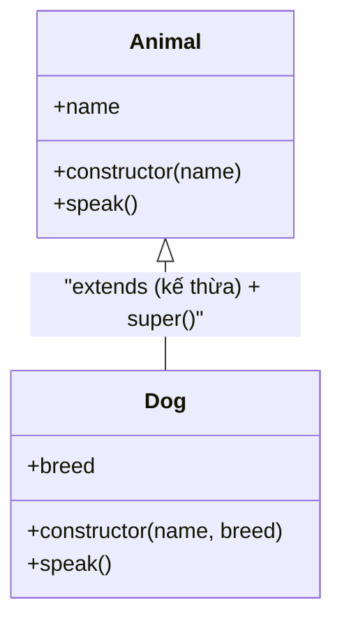

# Classes

**Class** (lớp — khuôn mẫu để tạo ra các đối tượng) là cách giúp bạn định nghĩa một "bản thiết kế" chung cho nhiều đối tượng có cùng thuộc tính và hành vi. Từ một class, bạn có thể tạo ra nhiều **instance** (thể hiện — đối tượng cụ thể) khác nhau bằng từ khoá `new`. Đây là nền tảng của lập trình hướng đối tượng (OOP) trong JavaScript, giúp code gọn gàng và dễ tái sử dụng hơn.

[](pathname:///img/javascript/classes.webp)

---

:::note[Ghi nhớ nhanh]

- ⭐ **`class` là "lớp đường" (syntactic sugar) phủ lên prototype** — cú pháp rõ ràng cho OOP, nhưng bản chất bên dưới vẫn là prototype có sẵn từ trước.
- **`constructor`, method và class field** — `constructor` chạy khi `new`; method gắn vào `prototype` (chung mọi instance); `class field` (ES2022) khai báo property trực tiếp.
- ⭐ **`extends` và `super`** — kế thừa lớp cha; trong subclass phải gọi `super()` đầu tiên trước khi dùng `this` (nếu không sẽ `ReferenceError`).
- **`static`** — thuộc về class chứ không phải instance (`MathUtils.square()`).
- **Private field `#field`** — true private của ES2022, không truy cập được từ ngoài (khác `_field` chỉ là quy ước).
- **Getter/Setter** — định nghĩa computed property; cẩn thận getter có side-effect hoặc tính toán nặng.

:::

---

## Mục lục

- [Vì sao class ra đời?](#vì-sao-class-ra-đời)
- [Khai báo class](#khai-báo-class)
- [Constructor và method](#constructor-và-method)
- [Static](#static)
- [Inheritance: extends và super](#inheritance-extends-và-super)
- [Private fields (#)](#private-fields-)
- [Getter và Setter](#getter-và-setter)
- [Câu hỏi phỏng vấn](#câu-hỏi-phỏng-vấn)

---

## Vì sao class ra đời?

**Vấn đề:** Trước ES6, muốn làm OOP trong JavaScript bạn phải dùng **constructor function** rồi gán method vào `.prototype` thủ công. Kế thừa còn rườm rà hơn: phải nối prototype chain bằng tay với `Object.create` và gọi `Parent.call(this)` trong constructor con. Dễ sai, khó đọc, nhất là với người quen Java/C#.

```js
function Animal(name) {
  this.name = name;
}
Animal.prototype.speak = function () {
  return `${this.name} makes a sound`;
};

function Dog(name) {
  Animal.call(this, name); // gọi constructor cha thủ công
}
// nối prototype chain bằng tay
Dog.prototype = Object.create(Animal.prototype);
Dog.prototype.constructor = Dog;
Dog.prototype.speak = function () {
  return `${this.name} barks`;
};

const d = new Dog("Rex");
d.speak(); // "Rex barks"
```

**Giải pháp:** `class` (ES6) là **"lớp đường"** (syntactic sugar) phủ lên prototype — cú pháp rõ ràng hơn hẳn với `constructor`, method, `extends`, `super`, `static`, getter/setter và private field (`#`). Cùng một logic nhưng gọn và dễ đọc:

```js
class Animal {
  constructor(name) {
    this.name = name;
  }
  speak() {
    return `${this.name} makes a sound`;
  }
}

class Dog extends Animal {
  speak() {
    return `${this.name} barks`;
  }
}

const d = new Dog("Rex");
d.speak(); // "Rex barks"
```

Lưu ý quan trọng: `class` **không phải** một cơ chế kế thừa mới — bản chất bên dưới vẫn là **prototype** có sẵn từ trước. Nó chỉ cho bạn một cú pháp dễ đọc, dễ bảo trì hơn.

:::tip[Dùng thực tế]

- **Model dữ liệu:** `User`, `Product`... gom thuộc tính và hành vi của một thực thể vào một chỗ.
- **Custom Error:** `class ValidationError extends Error` để phân loại lỗi rõ ràng.
- **Service / Repository:** đóng gói logic truy cập dữ liệu (ví dụ `UserRepository`).
- **Cấu trúc dữ liệu:** `Stack`, `Queue`, `LinkedList`... mỗi instance giữ state riêng.

:::

---

## Khai báo class

ES6 cung cấp cú pháp `class` — sugar cho prototype-based inheritance:

```js
class User {
  constructor(name, email) {
    this.name = name;
    this.email = email;
  }

  greet() {
    return `Hi ${this.name}`;
  }
}

const u = new User("An", "an@example.com");
u.greet(); // "Hi An"
```

Class **không hoist** như function declaration:

```js
new User(); // ReferenceError (TDZ)
class User {}
```

Class expression — gán cho biến:

```js
const User = class {
  constructor(name) {
    this.name = name;
  }
};
```

---

## Constructor và method

`constructor` chạy khi `new`:

```js
class User {
  constructor(name) {
    this.name = name;
    this.createdAt = new Date();
  }
}
```

**Class field** (ES2022) — khai báo property trực tiếp, không cần constructor:

```js
class Counter {
  count = 0;       // public field
  static instances = 0; // static field

  increment() {
    this.count++;
  }
}
```

Method được gắn vào `prototype` (chung mọi instance):

```js
const a = new Counter();
const b = new Counter();
a.increment === b.increment; // true — cùng function trên prototype
```

Arrow field — mỗi instance có function riêng (auto-bind `this`):

```js
class Counter {
  count = 0;

  increment = () => {
    this.count++;
  };
}
```

---

## Static

`static` thuộc về **class**, không phải instance:

```js
class MathUtils {
  static PI = 3.14159;

  static square(n) {
    return n * n;
  }
}

MathUtils.PI;          // 3.14159
MathUtils.square(5);   // 25

const m = new MathUtils();
m.PI;       // undefined — không có trên instance
```

Static block (ES2022) — initialize phức tạp:

```js
class App {
  static config;

  static {
    App.config = loadConfig();
  }
}
```

---

## Inheritance: extends và super

```js
class Animal {
  constructor(name) {
    this.name = name;
  }

  speak() {
    console.log(`${this.name} làm tiếng động`);
  }
}

class Dog extends Animal {
  constructor(name, breed) {
    super(name);       // bắt buộc gọi super trong constructor
    this.breed = breed;
  }

  speak() {
    super.speak();     // gọi method cha
    console.log("Woof!");
  }
}

const d = new Dog("Lulu", "Husky");
d.speak();
// "Lulu làm tiếng động"
// "Woof!"
```

Quan hệ kế thừa giữa lớp cha `Animal` và lớp con `Dog` — `Dog` thừa hưởng thuộc tính/method của `Animal` và có thể ghi đè (override) hoặc bổ sung:



:::warning[Cần lưu ý]

**Truy cập `this` trước `super()` → ReferenceError:**

```js
class Dog extends Animal {
  constructor(name) {
    this.name = name; // ReferenceError
    super(name);
  }
}
```

Lý do: trong subclass, `this` được tạo bởi `super()`. Đây là khác biệt
với ngôn ngữ khác (Java tạo `this` ngay khi constructor chạy).

→ Luôn gọi `super()` **đầu tiên** trong constructor của subclass.

:::

---

## Private fields (#)

ES2022 — true private, không truy cập từ ngoài:

```js
class Account {
  #balance = 0;
  #pin;

  constructor(pin) {
    this.#pin = pin;
  }

  deposit(amount) {
    this.#balance += amount;
  }

  getBalance(pin) {
    if (pin !== this.#pin) throw new Error("Wrong pin");
    return this.#balance;
  }
}

const acc = new Account("1234");
acc.deposit(100);
acc.#balance; // SyntaxError — không truy cập từ ngoài
acc["#balance"]; // undefined — cũng không lách được
```

:::info[Phân tích]

**`#field` vs `_field` (convention cũ):**

| | `#field` | `_field` |
|--|---------|----------|
| Chuẩn ECMAScript | **Có** (ES2022) | Không (convention) |
| Runtime check | **Có** | Không |
| Truy cập bằng `[...]` | Không (TypeError) | Có |
| Hiện trong `Object.keys` | Không | Có |
| Hiện trong DevTools | Có nhưng đánh dấu | Như public |

→ **Dùng `#field`** trong code mới. `_field` chỉ là quy ước, vẫn truy
cập và sửa được, không cản trở user "bypass" private.

Pitfall: `#field` **không sync** với `private` của TypeScript:

```ts
class A {
  private x = 1;     // TS private — compile-time
  #y = 2;            // JS private — runtime
}

const a = new A() as any;
a.x;     // 1 — TS không cản
a.#y;    // SyntaxError — JS thực sự cấm
```

Khi cần private **thực sự** (security, lib API), dùng `#`. Cho code app
thường, `private` TS đủ tốt và dễ debug hơn.

:::

---

## Getter và Setter

Define computed property:

```js
class User {
  #firstName;
  #lastName;

  constructor(first, last) {
    this.#firstName = first;
    this.#lastName = last;
  }

  get fullName() {
    return `${this.#firstName} ${this.#lastName}`;
  }

  set fullName(value) {
    [this.#firstName, this.#lastName] = value.split(" ");
  }
}

const u = new User("An", "Nguyen");
u.fullName;          // "An Nguyen" — gọi getter
u.fullName = "Binh Tran"; // gọi setter
```

:::tip[Mẹo]

**Cẩn thận với getter side-effect**:

```js
// Tệ — getter làm việc nặng mỗi lần truy cập
class Report {
  get total() {
    return this.items.reduce((s, i) => s + i.price, 0); // tính lại mỗi lần
  }
}

const r = report.total + report.total + report.total; // tính 3 lần
```

Khi computation nặng:

```js
// Cache trong field
class Report {
  #total;

  get total() {
    return this.#total ??= this.items.reduce((s, i) => s + i.price, 0);
  }

  invalidate() { this.#total = undefined; }
}
```

Hoặc dùng method `getTotal()` rõ ràng — báo cho user biết đây là computation.

:::

---

## Câu hỏi phỏng vấn

Những câu thường gặp về chủ đề này. Tự trả lời trước, rồi bấm **Xem đáp án** để đối chiếu.

**1. `class` trong JavaScript có phải là một cơ chế kế thừa mới không? Bên dưới nó thực chất dựa trên cái gì?**

<details className="qa">
<summary>Xem đáp án</summary>

Không. `class` (ES6) là **"lớp đường"** (syntactic sugar) phủ lên cơ chế **prototype** đã có sẵn từ trước. Nó không thêm mô hình kế thừa nào mới, chỉ cho một cú pháp dễ đọc, dễ bảo trì hơn so với việc gán method vào `.prototype` và nối chain bằng tay.

```js
class Dog {
  bark() {}
}

typeof Dog;                 // "function" — class vẫn là function
Dog.prototype.bark;         // method nằm trên prototype
const d = new Dog();
Object.getPrototypeOf(d) === Dog.prototype; // true
```

`extends` thực chất chỉ nối `Dog.prototype` vào `Animal.prototype`, còn `super()` là gọi constructor cha. Tuy vậy `class` cũng có vài khác biệt thật, không thuần túy là sugar: bắt buộc gọi bằng `new`, thân class luôn ở strict mode, method không enumerable, class không hoist (nằm trong TDZ), và hỗ trợ `#field`. Nhưng mô hình bên dưới vẫn 100% là prototype chain.

</details>

**2. Trước ES6 người ta làm OOP bằng constructor function và `prototype` như thế nào? Viết lại một ví dụ `class` sang dạng đó.**

<details className="qa">
<summary>Xem đáp án</summary>

Thuộc tính riêng của từng instance được gán vào `this` trong constructor function; method dùng chung thì gán thủ công vào `.prototype`. Kế thừa phải làm ba việc bằng tay: gọi constructor cha, nối prototype chain, sửa lại `constructor`.

```js
// ES6
class Animal {
  constructor(name) { this.name = name; }
  speak() { return `${this.name} makes a sound`; }
}
class Dog extends Animal {
  speak() { return `${this.name} barks`; }
}

// Tương đương trước ES6
function Animal(name) { this.name = name; }
Animal.prototype.speak = function () { return `${this.name} makes a sound`; };

function Dog(name) {
  Animal.call(this, name);                    // thay cho super(name)
}
Dog.prototype = Object.create(Animal.prototype); // nối prototype chain
Dog.prototype.constructor = Dog;                 // sửa lại constructor
Dog.prototype.speak = function () { return `${this.name} barks`; };

new Dog("Rex").speak(); // "Rex barks"
```

Chính vì ba bước này dễ quên và khó đọc mà `class` ra đời.

</details>

**3. Method khai báo trong `class` nằm trên từng instance hay trên `prototype`? Điều đó ảnh hưởng gì tới bộ nhớ khi tạo hàng nghìn instance?**

<details className="qa">
<summary>Xem đáp án</summary>

Method khai báo theo cú pháp thông thường được gắn vào **`prototype`** của class, tức là **chỉ tồn tại một bản duy nhất** dùng chung cho mọi instance:

```js
const a = new Counter();
const b = new Counter();
a.increment === b.increment; // true — cùng một function trên prototype
```

Nhờ vậy tạo một triệu instance vẫn chỉ có một object function cho mỗi method; mỗi instance chỉ tốn bộ nhớ cho dữ liệu riêng (`this.count`...). Khi gọi `a.increment()`, engine không thấy property trên chính `a` nên đi lên prototype chain và tìm thấy ở `Counter.prototype`.

Ngược lại, arrow function class field (`increment = () => {...}`) được gán **trên từng instance** trong lúc khởi tạo, nên mỗi instance sinh thêm một closure và một function object. Với hàng nghìn instance, khác biệt này trở nên đáng kể về bộ nhớ và thời gian khởi tạo — đó là cái giá đổi lấy việc `this` được tự động bind.

</details>

**4. `class` có được hoist như function declaration không? Điều gì xảy ra nếu gọi `new User()` trước dòng `class User {}`?**

<details className="qa">
<summary>Xem đáp án</summary>

Tên class **có được hoist** lên đầu scope, nhưng nằm trong **TDZ (Temporal Dead Zone)** — giống `let` và `const` — nên không dùng được trước dòng khai báo:

```js
new User();      // ReferenceError: Cannot access 'User' before initialization
class User {}
```

Khác hẳn function declaration, vốn hoist cả định nghĩa nên gọi trước vẫn chạy:

```js
greet();                    // OK
function greet() { return "hi"; }
```

Lý do của thiết kế này: thân class có thể chứa `extends SomeExpression` — biểu thức phải được tính lúc khai báo — nên cho phép dùng trước khi khởi tạo sẽ dẫn tới trạng thái nửa vời khó lường. Ép lỗi rõ ràng an toàn hơn. Class expression (`const User = class {...}`) cũng theo quy tắc của `const`. Hệ quả thực tế: luôn khai báo class trước khi dùng, và cẩn thận với các class tham chiếu lẫn nhau theo vòng tròn giữa nhiều module.

</details>

**5. Mô tả từng bước những gì thực sự diễn ra khi bạn gọi `new Foo()`.**

<details className="qa">
<summary>Xem đáp án</summary>

Toán tử `new` làm bốn việc:

1. Tạo một object rỗng mới.
2. Gán `[[Prototype]]` của object đó bằng `Foo.prototype`, nên instance thừa hưởng mọi method trên prototype.
3. Gọi `Foo` với `this` trỏ tới object vừa tạo, truyền vào các đối số. Constructor gán property vào `this`.
4. Trả về object đó — **trừ khi** constructor `return` tường minh một object khác, khi đó object được trả về sẽ thắng (return giá trị nguyên thủy thì bị bỏ qua).

```js
function Foo(name) {
  this.name = name;
  // return { other: 1 };  // nếu bật dòng này, new Foo("A") cho { other: 1 }
}

// Mô phỏng thủ công
const obj = Object.create(Foo.prototype);
const result = Foo.call(obj, "A");
const instance = typeof result === "object" && result !== null ? result : obj;
```

Với subclass thì khác một chút: `this` không được tạo ngay mà do `super()` tạo ra — đó là lý do phải gọi `super()` trước khi chạm vào `this`.

</details>

**6. `class field` (ES2022) khác gì so với gán property trong `constructor`? Thứ tự khởi tạo giữa field và thân constructor ra sao?**

<details className="qa">
<summary>Xem đáp án</summary>

Class field cho phép khai báo property trực tiếp trong thân class, không cần constructor:

```js
class Counter {
  count = 0;            // public field
  static instances = 0; // static field
}
```

Về kết quả, nó tương đương gán trong constructor: property nằm **trên instance**, không phải prototype. Khác biệt nằm ở tính rõ ràng (đọc thân class là thấy ngay instance có những property nào) và ở chỗ field được định nghĩa bằng thao tác **define** chứ không phải **set**, nên không kích hoạt setter cùng tên kế thừa từ lớp cha.

**Thứ tự khởi tạo** trong một class không có cha: các field được khởi tạo theo thứ tự khai báo, **trước** khi thân `constructor` chạy. Nên trong constructor bạn đã thấy giá trị field.

```js
class A {
  x = 1;
  constructor() {
    console.log(this.x); // 1 — field đã được gán
    this.x = 2;
  }
}
```

Trong subclass, field của lớp con chỉ được khởi tạo **sau khi `super()` chạy xong** — nên nếu constructor cha gọi một method bị lớp con override, method đó sẽ thấy field của con còn `undefined`.

</details>

**7. So sánh method thường và arrow function class field (`increment = () => ...`): khác nhau về `this`, về vị trí lưu trữ, và về bộ nhớ.**

<details className="qa">
<summary>Xem đáp án</summary>

| | Method thường | Arrow class field |
|---|---|---|
| Vị trí lưu trữ | Trên `prototype`, dùng chung | Trên từng instance |
| `this` | Phụ thuộc cách gọi — mất `this` khi tách khỏi object | Cố định vào instance lúc khởi tạo |
| Bộ nhớ | Một bản cho mọi instance | Một function mới cho mỗi instance |
| Override / `super` | Subclass override được, gọi `super.method()` được | Khó override đúng, không dùng được `super` |

```js
class Counter {
  count = 0;
  inc() { this.count++; }
  incArrow = () => { this.count++; };
}

const c = new Counter();
const f = c.inc;
f();              // TypeError — this là undefined (strict mode)

const g = c.incArrow;
g();              // OK — this luôn là c
```

Vì vậy arrow field rất tiện khi truyền hàm làm callback hoặc event handler (`onClick={this.handleClick}`), đổi lại tốn bộ nhớ và khó test/override hơn. Với class tạo ra rất nhiều instance, ưu tiên method thường rồi `bind` ở chỗ cần.

</details>

**8. `static` là gì? Vì sao `new MathUtils().PI` cho `undefined` trong khi `MathUtils.PI` có giá trị?**

<details className="qa">
<summary>Xem đáp án</summary>

`static` khai báo thành viên thuộc về **chính class**, không thuộc về instance. Nó được gắn trực tiếp lên object class (vốn là một function), chứ không lên `prototype`.

```js
class MathUtils {
  static PI = 3.14159;
  static square(n) { return n * n; }
}

MathUtils.PI;        // 3.14159
MathUtils.square(5); // 25

const m = new MathUtils();
m.PI;                // undefined
```

`m.PI` trả `undefined` vì khi tra cứu property, engine tìm trên chính `m`, rồi lên `MathUtils.prototype`, rồi `Object.prototype` — **chuỗi này không đi qua `MathUtils`**. Static member nằm ở nhánh khác của mô hình, chỉ kế thừa giữa class với class (subclass truy cập được static của lớp cha vì `[[Prototype]]` của `Dog` là `Animal`).

Dùng `static` cho các tiện ích không cần state riêng, hằng số dùng chung, hoặc factory method kiểu `User.fromJSON(data)`.

</details>

**9. `static block` (ES2022) dùng để làm gì? Nó chạy vào lúc nào?**

<details className="qa">
<summary>Xem đáp án</summary>

`static block` là một khối lệnh trong thân class để **khởi tạo static state phức tạp** — những thứ không viết gọn được thành một biểu thức gán đơn giản, ví dụ cần vòng lặp, `try/catch`, hoặc phụ thuộc lẫn nhau giữa nhiều static field.

```js
class App {
  static config;

  static {
    App.config = loadConfig();
  }
}
```

Nó chạy **đúng một lần, lúc class được định nghĩa** (khi engine đánh giá khai báo class), theo thứ tự xuất hiện xen kẽ với các static field. Bên trong block, `this` trỏ tới chính class, và block truy cập được cả private static field của class — nên nó cũng là chỗ tiện để lộ private ra một cách có kiểm soát.

Trước khi có tính năng này, người ta phải viết code khởi tạo ngay sau khai báo class (`App.config = loadConfig();`), vừa rời rạc vừa không truy cập được `#field`. Lưu ý block chạy khi module load, nên tránh đặt việc nặng hoặc I/O đồng bộ vào đây.

</details>

**10. Vì sao trong constructor của subclass phải gọi `super()` trước khi dùng `this`? Khác biệt này so với Java nằm ở đâu?**

<details className="qa">
<summary>Xem đáp án</summary>

Vì trong subclass, **`this` chưa tồn tại cho tới khi `super()` chạy** — chính constructor cha mới là nơi tạo ra object. Chạm vào `this` trước đó sẽ ném `ReferenceError`:

```js
class Dog extends Animal {
  constructor(name) {
    this.name = name; // ReferenceError: Must call super constructor first
    super(name);
  }
}
```

Kể cả `return this` hay đọc `this.x` cũng lỗi tương tự; kết thúc constructor mà quên `super()` cũng lỗi.

**Khác biệt với Java:** trong Java, object đã được cấp phát trước khi constructor chạy, nên `this` có sẵn ngay từ dòng đầu; lời gọi `super(...)` chỉ là khởi tạo phần dữ liệu của lớp cha. JavaScript đi theo hướng ngược lại: lớp cha khởi tạo object rồi "trao" cho lớp con, một thiết kế cho phép lớp cha tự quyết định hình dạng object (quan trọng khi kế thừa các built-in như `Array`, `Error`). Quy tắc thực hành rất đơn giản: luôn đặt `super()` ở dòng đầu tiên của constructor subclass.

</details>

**11. Nếu subclass không khai báo `constructor` thì chuyện gì xảy ra khi `new`?**

<details className="qa">
<summary>Xem đáp án</summary>

Engine tự cấp cho subclass một **constructor mặc định** chuyển tiếp toàn bộ đối số lên lớp cha:

```js
class Dog extends Animal {}

// tương đương
class Dog extends Animal {
  constructor(...args) {
    super(...args);
  }
}

const d = new Dog("Rex"); // "Rex" đi thẳng vào constructor của Animal
```

Nên khi chỉ muốn override method chứ không thêm property mới, bạn hoàn toàn có thể bỏ constructor — code gọn hơn và không có nguy cơ quên `super()`.

Với class **không** `extends`, constructor mặc định là một hàm rỗng `constructor() {}`.

Lưu ý một bẫy liên quan: nếu bạn viết constructor chỉ để gọi `super(...args)` rồi không làm gì thêm, đó là code thừa. Ngược lại, khi đã khai báo constructor trong subclass thì `super()` trở thành bắt buộc — quên là lỗi runtime ngay lần `new` đầu tiên.

</details>

**12. `super.speak()` tìm ra method của lớp cha bằng cơ chế nào? `super` trong một `static` method trỏ tới đâu?**

<details className="qa">
<summary>Xem đáp án</summary>

Mỗi method khai báo trong thân class mang một liên kết nội bộ tới object chứa nó (spec gọi là `[[HomeObject]]`). `super.speak()` được giải quyết bằng cách lấy prototype của home object đó rồi tìm `speak` trên chuỗi prototype, sau đó **gọi với `this` hiện tại**:

```js
class Dog extends Animal {
  speak() {
    super.speak(); // tìm speak trên Object.getPrototypeOf(Dog.prototype) = Animal.prototype
    console.log("Woof!");
  }
}
```

Điểm mấu chốt: `super` **không** đơn giản là "lớp cha của `this`" — nó bám vào nơi method được **định nghĩa**. Nhờ vậy kế thừa nhiều tầng không bị lặp vô hạn. Hệ quả: gán một hàm rời vào prototype bằng tay (`Dog.prototype.speak = function(){...}`) thì trong hàm đó không dùng được `super`, vì nó không có home object.

Trong **static method**, home object là chính class, mà `[[Prototype]]` của `Dog` là `Animal`, nên `super.x` trỏ tới **static member của lớp cha**:

```js
class Dog extends Animal {
  static create() { return super.create(); } // gọi Animal.create()
}
```

</details>

**13. Private field `#x` khác quy ước `_x` ở những điểm nào? `_x` có thực sự private không?**

<details className="qa">
<summary>Xem đáp án</summary>

`_x` **không hề private** — nó chỉ là quy ước đặt tên nói với đồng nghiệp rằng "đừng đụng vào". Về mặt runtime, nó là một property public bình thường: đọc được, sửa được, hiện trong `Object.keys`, serialize ra khi `JSON.stringify`.

`#x` là private thật, được chuẩn hóa từ ES2022:

| | `#field` | `_field` |
|---|---|---|
| Chuẩn ECMAScript | Có (ES2022) | Không, chỉ là convention |
| Runtime check | Có | Không |
| Truy cập bằng `obj["#x"]` | Không được | Được |
| Hiện trong `Object.keys` / `JSON.stringify` | Không | Có |

```js
class Account {
  #balance = 0;
  deposit(n) { this.#balance += n; }
}

const acc = new Account();
acc.#balance;      // SyntaxError — không truy cập được từ ngoài
acc["#balance"];   // undefined — cũng không lách được
```

Code mới nên dùng `#field` khi thực sự cần bảo vệ dữ liệu (thư viện công khai, thông tin nhạy cảm). Đổi lại, `#field` khó debug và khó mock trong test hơn `_field`.

</details>

**14. Subclass có truy cập được `#field` của lớp cha không? Vì sao, và nếu cần chia sẻ dữ liệu thì làm thế nào?**

<details className="qa">
<summary>Xem đáp án</summary>

**Không.** Private field bị giới hạn theo **thân class khai báo ra nó** (lexical scope), chứ không theo chuỗi kế thừa. JavaScript không có khái niệm `protected`.

```js
class Animal {
  #secret = 1;
}
class Dog extends Animal {
  peek() { return this.#secret; } // SyntaxError ngay lúc parse
}
```

Lỗi xảy ra ở giai đoạn phân tích cú pháp, không phải lúc chạy — vì `#secret` đơn giản là không tồn tại trong phạm vi của thân `Dog`.

Cách chia sẻ dữ liệu cho lớp con:

- Cung cấp **getter/setter hoặc method protected-by-convention** trên lớp cha để lớp con gọi (`get secret() { return this.#secret; }`).
- Dùng field **`_x` theo quy ước** khi muốn lớp con truy cập trực tiếp và chấp nhận nó là public về mặt kỹ thuật.
- Dùng `protected` của TypeScript nếu dự án dùng TS — kiểm tra ở compile-time, runtime vẫn là property thường.
- Truyền dữ liệu qua `super(...)` để lớp cha tự quản lý.

</details>

**15. `private` của TypeScript khác `#field` của JavaScript ra sao (compile-time và runtime)? Khi nào bắt buộc dùng `#`?**

<details className="qa">
<summary>Xem đáp án</summary>

`private` của TypeScript chỉ tồn tại ở **compile-time**: trình biên dịch báo lỗi nếu bạn truy cập từ ngoài, nhưng sau khi biên dịch ra JS nó là một property public hoàn toàn bình thường. `#field` là cơ chế **runtime** của chính ngôn ngữ.

```ts
class A {
  private x = 1;  // TS private — chỉ compile-time
  #y = 2;         // JS private — runtime
}

const a = new A() as any;
a.x;    // 1 — TS không cản được khi đã ép kiểu
a.#y;   // SyntaxError — JS thực sự cấm
```

Khác biệt thực tế khác: `private` của TS vẫn hiện trong `Object.keys` và `JSON.stringify`, lớp con truy cập được nếu dùng `protected`; còn `#field` thì ẩn hoàn toàn và lớp con cũng không thấy.

**Bắt buộc dùng `#` khi:** viết thư viện công khai mà bạn không muốn người dùng phụ thuộc vào nội bộ, cần đảm bảo an toàn thật sự (token, số dư, khóa), hoặc cần tránh va chạm tên với subclass. Với code ứng dụng thông thường, `private` của TS đã đủ tốt và dễ debug, dễ test hơn.

</details>

**16. Getter/Setter dùng để làm gì? Rủi ro khi getter tính toán nặng hoặc có side-effect là gì, và cách khắc phục?**

<details className="qa">
<summary>Xem đáp án</summary>

Getter/Setter cho phép định nghĩa **computed property** — dùng như một property nhưng thực chất là gọi hàm. Nhờ đó bạn bọc dữ liệu private, thêm validate khi gán, hoặc suy ra giá trị từ các field khác mà không phá vỡ API hiện có.

```js
get fullName() { return `${this.#firstName} ${this.#lastName}`; }
set fullName(v) { [this.#firstName, this.#lastName] = v.split(" "); }
```

**Rủi ro:** người đọc code thấy `report.total` sẽ tưởng đó là một phép đọc rẻ tiền, nên dùng thoải mái trong vòng lặp hay trong render. Nếu getter duyệt mảng lớn hay gọi API, chi phí nhân lên âm thầm:

```js
const r = report.total + report.total + report.total; // tính lại 3 lần
```

Getter có side-effect (ghi log, sửa state, tăng bộ đếm) còn tệ hơn: nó làm việc debug rối loạn vì chỉ cần DevTools hiển thị object cũng đủ kích hoạt.

**Cách khắc phục:** cache kết quả vào một private field và có hàm `invalidate()` khi dữ liệu đổi (`return this.#total ??= this.items.reduce(...)`), hoặc đơn giản là đổi sang method tên rõ ràng `getTotal()` để báo hiệu đây là một phép tính chứ không phải một phép đọc.

</details>

**17. Kế thừa `Error` (`class ValidationError extends Error`) cần lưu ý gì để `instanceof`, `name` và stack trace hoạt động đúng?**

<details className="qa">
<summary>Xem đáp án</summary>

Ba điểm cần nhớ:

```js
class ValidationError extends Error {
  constructor(message, field) {
    super(message);              // để Error set message
    this.name = "ValidationError";
    this.field = field;
    Error.captureStackTrace?.(this, ValidationError); // V8: bỏ constructor khỏi stack
  }
}
```

- Phải gọi `super(message)` thì `err.message` mới có giá trị.
- `name` **không** tự lấy theo tên class — mặc định vẫn là `"Error"`, nên phải tự gán; nó quyết định dòng đầu của `err.stack` và output khi log.
- `Error.captureStackTrace` (chỉ có ở V8) giúp stack trace trỏ vào nơi throw thay vì vào constructor. ES2022 còn có option `cause`: `super(msg, { cause: err })` để giữ lỗi gốc.

**Về `instanceof`:** với JavaScript hiện đại thì hoạt động đúng. Cạm bẫy kinh điển là khi code được **transpile xuống ES5** — kế thừa built-in bị hỏng và `err instanceof ValidationError` trả `false`; cách chữa là thêm `Object.setPrototypeOf(this, new.target.prototype)` trong constructor. Ngoài ra `instanceof` cũng sai qua ranh giới realm (iframe, worker), nên nhiều thư viện kiểm tra thêm bằng `err.name` hoặc một field đánh dấu riêng.

</details>

**18. `instanceof` hoạt động dựa trên cái gì? Nêu tình huống nó cho kết quả sai với kỳ vọng.**

<details className="qa">
<summary>Xem đáp án</summary>

`a instanceof B` đi dọc **prototype chain** của `a` xem có gặp đúng object `B.prototype` hay không. Nó không so tên class, không so cấu trúc. Một class cũng có thể tự định nghĩa hành vi này qua `Symbol.hasInstance`.

Những tình huống cho kết quả trái kỳ vọng:

- **Khác realm:** object tạo trong `iframe` hoặc worker có `Array.prototype` riêng, nên `arr instanceof Array` là `false` dù nó thật sự là mảng. Dùng `Array.isArray(arr)` thay thế.
- **Prototype bị thay:** `Object.setPrototypeOf(obj, null)` hay gán lại `Foo.prototype` sau khi đã tạo instance khiến kết quả lệch.
- **Kế thừa built-in bị transpile xuống ES5:** `err instanceof MyError` trả `false` như câu trên.
- **Primitive:** `"abc" instanceof String` là `false` vì chuỗi nguyên thủy không phải object.
- **Object thuần không có prototype:** `Object.create(null) instanceof Object` là `false`.

```js
Object.create(null) instanceof Object; // false
"abc" instanceof String;               // false
```

Vì vậy với dữ liệu đến từ bên ngoài, kiểm tra theo khả năng (duck typing) hoặc dùng các hàm chuyên dụng thường an toàn hơn `instanceof`.

</details>

**19. Khi nào nên dùng `class`, khi nào chỉ cần object thường, factory function hoặc closure? So sánh cách đóng gói dữ liệu riêng tư của mỗi hướng.**

<details className="qa">
<summary>Xem đáp án</summary>

- **Object thường (object literal):** khi chỉ cần gom dữ liệu hoặc một nhóm hàm tiện ích không có state — cấu hình, DTO, module helper. Đơn giản nhất, không cần `new`.
- **Factory function / closure:** khi cần tạo nhiều thực thể có state riêng nhưng không cần kế thừa. Biến cục bộ trong hàm là private tuyệt đối, và không có `this` nên tránh được cả một lớp bug.
- **`class`:** khi có nhiều instance cùng hình dạng, có hành vi gắn với dữ liệu, cần kế thừa hoặc `instanceof`, hoặc khi làm việc với API yêu cầu class (Custom Error, Web Component).

```js
// closure — state thật sự private
function createCounter() {
  let count = 0;
  return { inc: () => ++count, get: () => count };
}

// class — private qua #field
class Counter {
  #count = 0;
  inc() { return ++this.#count; }
}
```

Về đóng gói: closure giấu dữ liệu bằng scope, `class` giấu bằng `#field` — cả hai đều private thật. Khác biệt là closure tạo một bản method cho mỗi instance (tốn bộ nhớ hơn) nhưng tránh hoàn toàn rắc rối `this`; `class` chia sẻ method qua prototype nên nhẹ hơn và hợp với số lượng instance lớn.

</details>

**20. So sánh kế thừa (`extends`) với composition. Vì sao nhiều codebase hiện đại ưu tiên composition?**

<details className="qa">
<summary>Xem đáp án</summary>

**Kế thừa** diễn tả quan hệ *"là một"* (`Dog` là một `Animal`) và tái sử dụng bằng cách nối prototype chain. **Composition** diễn tả quan hệ *"có một"* — object lắp ghép từ các khối chức năng nhỏ, độc lập:

```js
// Kế thừa
class Dog extends Animal { }

// Composition
const canBark = (state) => ({ bark: () => `${state.name} barks` });
const canEat  = (state) => ({ eat: () => `${state.name} eats` });

const createDog = (name) => {
  const state = { name };
  return { ...state, ...canBark(state), ...canEat(state) };
};
```

Composition được ưu tiên vì:

- **Tránh hệ thống phân cấp cứng nhắc.** Chuỗi kế thừa sâu khiến một thay đổi ở lớp gốc lan ra toàn bộ cây (bài toán "base class mong manh").
- **Linh hoạt khi yêu cầu chéo nhau.** Thực tế hiếm khi phân loại gọn thành cây: một đối tượng vừa bơi được vừa bay được thì kế thừa đơn bó tay, còn composition chỉ cần thêm một khối.
- **Dễ test và dễ đọc.** Mỗi khối chức năng kiểm thử độc lập được; không phải lần ngược ba tầng cha để hiểu một method đến từ đâu.

Không nên cực đoan: kế thừa vẫn rất hợp lý cho các cây nông và ổn định như phân loại lỗi (`class ValidationError extends Error`). Nguyên tắc quen thuộc là *"ưu tiên composition hơn inheritance"*, không phải "cấm inheritance".

</details>
