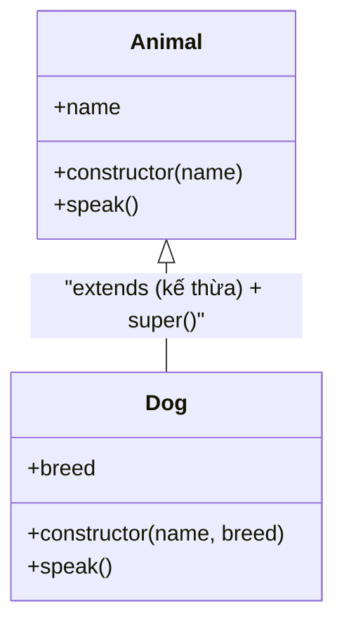

# Classes

**Class** (lớp — khuôn mẫu để tạo ra các đối tượng) là cách giúp bạn định nghĩa một "bản thiết kế" chung cho nhiều đối tượng có cùng thuộc tính và hành vi. Từ một class, bạn có thể tạo ra nhiều **instance** (thể hiện — đối tượng cụ thể) khác nhau bằng từ khoá `new`. Đây là nền tảng của lập trình hướng đối tượng (OOP) trong JavaScript, giúp code gọn gàng và dễ tái sử dụng hơn.

---

:::note[Ghi nhớ nhanh]

- ⭐ **`class` là "lớp đường" (syntactic sugar) phủ lên prototype** — cú pháp rõ ràng cho OOP, nhưng bản chất bên dưới vẫn là prototype có sẵn từ trước.
- **`constructor`, method và class field** — `constructor` chạy khi `new`; method gắn vào `prototype` (chung mọi instance); `class field` (ES2022) khai báo property trực tiếp.
- ⭐ **`extends` và `super`** — kế thừa lớp cha; trong subclass phải gọi `super()` đầu tiên trước khi dùng `this` (nếu không sẽ `ReferenceError`).
- **`static`** — thuộc về class chứ không phải instance (`MathUtils.square()`).
- **Private field `#field`** — true private của ES2022, không truy cập được từ ngoài (khác `_field` chỉ là quy ước).
- **Getter/Setter** — định nghĩa computed property; cẩn thận getter có side-effect hoặc tính toán nặng.

:::

---

## Mục lục

- [Vì sao class ra đời?](#vì-sao-class-ra-đời)
- [Khai báo class](#khai-báo-class)
- [Constructor và method](#constructor-và-method)
- [Static](#static)
- [Inheritance: extends và super](#inheritance-extends-và-super)
- [Private fields (#)](#private-fields-)
- [Getter và Setter](#getter-và-setter)
- [Câu hỏi phỏng vấn](#câu-hỏi-phỏng-vấn)

---

## Vì sao class ra đời?

**Vấn đề:** Trước ES6, muốn làm OOP trong JavaScript bạn phải dùng **constructor function** rồi gán method vào `.prototype` thủ công. Kế thừa còn rườm rà hơn: phải nối prototype chain bằng tay với `Object.create` và gọi `Parent.call(this)` trong constructor con. Dễ sai, khó đọc, nhất là với người quen Java/C#.

```js
function Animal(name) {
  this.name = name;
}
Animal.prototype.speak = function () {
  return `${this.name} makes a sound`;
};

function Dog(name) {
  Animal.call(this, name); // gọi constructor cha thủ công
}
// nối prototype chain bằng tay
Dog.prototype = Object.create(Animal.prototype);
Dog.prototype.constructor = Dog;
Dog.prototype.speak = function () {
  return `${this.name} barks`;
};

const d = new Dog("Rex");
d.speak(); // "Rex barks"
```

**Giải pháp:** `class` (ES6) là **"lớp đường"** (syntactic sugar) phủ lên prototype — cú pháp rõ ràng hơn hẳn với `constructor`, method, `extends`, `super`, `static`, getter/setter và private field (`#`). Cùng một logic nhưng gọn và dễ đọc:

```js
class Animal {
  constructor(name) {
    this.name = name;
  }
  speak() {
    return `${this.name} makes a sound`;
  }
}

class Dog extends Animal {
  speak() {
    return `${this.name} barks`;
  }
}

const d = new Dog("Rex");
d.speak(); // "Rex barks"
```

Lưu ý quan trọng: `class` **không phải** một cơ chế kế thừa mới — bản chất bên dưới vẫn là **prototype** có sẵn từ trước. Nó chỉ cho bạn một cú pháp dễ đọc, dễ bảo trì hơn.

:::tip[Dùng thực tế]

- **Model dữ liệu:** `User`, `Product`... gom thuộc tính và hành vi của một thực thể vào một chỗ.
- **Custom Error:** `class ValidationError extends Error` để phân loại lỗi rõ ràng.
- **Service / Repository:** đóng gói logic truy cập dữ liệu (ví dụ `UserRepository`).
- **Cấu trúc dữ liệu:** `Stack`, `Queue`, `LinkedList`... mỗi instance giữ state riêng.

:::

---

## Khai báo class

ES6 cung cấp cú pháp `class` — sugar cho prototype-based inheritance:

```js
class User {
  constructor(name, email) {
    this.name = name;
    this.email = email;
  }

  greet() {
    return `Hi ${this.name}`;
  }
}

const u = new User("An", "an@example.com");
u.greet(); // "Hi An"
```

Class **không hoist** như function declaration:

```js
new User(); // ReferenceError (TDZ)
class User {}
```

Class expression — gán cho biến:

```js
const User = class {
  constructor(name) {
    this.name = name;
  }
};
```

---

## Constructor và method

`constructor` chạy khi `new`:

```js
class User {
  constructor(name) {
    this.name = name;
    this.createdAt = new Date();
  }
}
```

**Class field** (ES2022) — khai báo property trực tiếp, không cần constructor:

```js
class Counter {
  count = 0;       // public field
  static instances = 0; // static field

  increment() {
    this.count++;
  }
}
```

Method được gắn vào `prototype` (chung mọi instance):

```js
const a = new Counter();
const b = new Counter();
a.increment === b.increment; // true — cùng function trên prototype
```

Arrow field — mỗi instance có function riêng (auto-bind `this`):

```js
class Counter {
  count = 0;

  increment = () => {
    this.count++;
  };
}
```

---

## Static

`static` thuộc về **class**, không phải instance:

```js
class MathUtils {
  static PI = 3.14159;

  static square(n) {
    return n * n;
  }
}

MathUtils.PI;          // 3.14159
MathUtils.square(5);   // 25

const m = new MathUtils();
m.PI;       // undefined — không có trên instance
```

Static block (ES2022) — initialize phức tạp:

```js
class App {
  static config;

  static {
    App.config = loadConfig();
  }
}
```

---

## Inheritance: extends và super

```js
class Animal {
  constructor(name) {
    this.name = name;
  }

  speak() {
    console.log(`${this.name} làm tiếng động`);
  }
}

class Dog extends Animal {
  constructor(name, breed) {
    super(name);       // bắt buộc gọi super trong constructor
    this.breed = breed;
  }

  speak() {
    super.speak();     // gọi method cha
    console.log("Woof!");
  }
}

const d = new Dog("Lulu", "Husky");
d.speak();
// "Lulu làm tiếng động"
// "Woof!"
```

Quan hệ kế thừa giữa lớp cha `Animal` và lớp con `Dog` — `Dog` thừa hưởng thuộc tính/method của `Animal` và có thể ghi đè (override) hoặc bổ sung:



:::warning[Cần lưu ý]

**Truy cập `this` trước `super()` → ReferenceError:**

```js
class Dog extends Animal {
  constructor(name) {
    this.name = name; // ReferenceError
    super(name);
  }
}
```

Lý do: trong subclass, `this` được tạo bởi `super()`. Đây là khác biệt
với ngôn ngữ khác (Java tạo `this` ngay khi constructor chạy).

→ Luôn gọi `super()` **đầu tiên** trong constructor của subclass.

:::

---

## Private fields (#)

ES2022 — true private, không truy cập từ ngoài:

```js
class Account {
  #balance = 0;
  #pin;

  constructor(pin) {
    this.#pin = pin;
  }

  deposit(amount) {
    this.#balance += amount;
  }

  getBalance(pin) {
    if (pin !== this.#pin) throw new Error("Wrong pin");
    return this.#balance;
  }
}

const acc = new Account("1234");
acc.deposit(100);
acc.#balance; // SyntaxError — không truy cập từ ngoài
acc["#balance"]; // undefined — cũng không lách được
```

:::info[Phân tích]

**`#field` vs `_field` (convention cũ):**

| | `#field` | `_field` |
|--|---------|----------|
| Chuẩn ECMAScript | **Có** (ES2022) | Không (convention) |
| Runtime check | **Có** | Không |
| Truy cập bằng `[...]` | Không (TypeError) | Có |
| Hiện trong `Object.keys` | Không | Có |
| Hiện trong DevTools | Có nhưng đánh dấu | Như public |

→ **Dùng `#field`** trong code mới. `_field` chỉ là quy ước, vẫn truy
cập và sửa được, không cản trở user "bypass" private.

Pitfall: `#field` **không sync** với `private` của TypeScript:

```ts
class A {
  private x = 1;     // TS private — compile-time
  #y = 2;            // JS private — runtime
}

const a = new A() as any;
a.x;     // 1 — TS không cản
a.#y;    // SyntaxError — JS thực sự cấm
```

Khi cần private **thực sự** (security, lib API), dùng `#`. Cho code app
thường, `private` TS đủ tốt và dễ debug hơn.

:::

---

## Getter và Setter

Define computed property:

```js
class User {
  #firstName;
  #lastName;

  constructor(first, last) {
    this.#firstName = first;
    this.#lastName = last;
  }

  get fullName() {
    return `${this.#firstName} ${this.#lastName}`;
  }

  set fullName(value) {
    [this.#firstName, this.#lastName] = value.split(" ");
  }
}

const u = new User("An", "Nguyen");
u.fullName;          // "An Nguyen" — gọi getter
u.fullName = "Binh Tran"; // gọi setter
```

:::tip[Mẹo]

**Cẩn thận với getter side-effect**:

```js
// Tệ — getter làm việc nặng mỗi lần truy cập
class Report {
  get total() {
    return this.items.reduce((s, i) => s + i.price, 0); // tính lại mỗi lần
  }
}

const r = report.total + report.total + report.total; // tính 3 lần
```

Khi computation nặng:

```js
// Cache trong field
class Report {
  #total;

  get total() {
    return this.#total ??= this.items.reduce((s, i) => s + i.price, 0);
  }

  invalidate() { this.#total = undefined; }
}
```

Hoặc dùng method `getTotal()` rõ ràng — báo cho user biết đây là computation.

:::

---

## Câu hỏi phỏng vấn

Những câu thường gặp về chủ đề này. Tự trả lời trước, rồi đối chiếu lại với nội dung phía trên.

1. `class` trong JavaScript có phải là một cơ chế kế thừa mới không? Bên dưới nó thực chất dựa trên cái gì?
2. Trước ES6 người ta làm OOP bằng constructor function và `prototype` như thế nào? Viết lại một ví dụ `class` sang dạng đó.
3. Method khai báo trong `class` nằm trên từng instance hay trên `prototype`? Điều đó ảnh hưởng gì tới bộ nhớ khi tạo hàng nghìn instance?
4. `class` có được hoist như function declaration không? Điều gì xảy ra nếu gọi `new User()` trước dòng `class User {}`?
5. Mô tả từng bước những gì thực sự diễn ra khi bạn gọi `new Foo()`.
6. `class field` (ES2022) khác gì so với gán property trong `constructor`? Thứ tự khởi tạo giữa field và thân constructor ra sao?
7. So sánh method thường và arrow function class field (`increment = () => ...`): khác nhau về `this`, về vị trí lưu trữ, và về bộ nhớ.
8. `static` là gì? Vì sao `new MathUtils().PI` cho `undefined` trong khi `MathUtils.PI` có giá trị?
9. `static block` (ES2022) dùng để làm gì? Nó chạy vào lúc nào?
10. Vì sao trong constructor của subclass phải gọi `super()` **trước** khi dùng `this`? Khác biệt này so với Java nằm ở đâu?
11. Nếu subclass không khai báo `constructor` thì chuyện gì xảy ra khi `new`?
12. `super.speak()` tìm ra method của lớp cha bằng cơ chế nào? `super` trong một `static` method trỏ tới đâu?
13. Private field `#x` khác quy ước `_x` ở những điểm nào? `_x` có thực sự private không?
14. Subclass có truy cập được `#field` của lớp cha không? Vì sao, và nếu cần chia sẻ dữ liệu thì làm thế nào?
15. `private` của TypeScript khác `#field` của JavaScript ra sao (compile-time và runtime)? Khi nào bắt buộc dùng `#`?
16. Getter/Setter dùng để làm gì? Rủi ro khi getter tính toán nặng hoặc có side-effect là gì, và cách khắc phục?
17. Kế thừa `Error` (`class ValidationError extends Error`) cần lưu ý gì để `instanceof`, `name` và stack trace hoạt động đúng?
18. `instanceof` hoạt động dựa trên cái gì? Nêu tình huống nó cho kết quả sai với kỳ vọng.
19. Khi nào nên dùng `class`, khi nào chỉ cần object thường, factory function hoặc closure? So sánh cách đóng gói dữ liệu riêng tư của mỗi hướng.
20. So sánh kế thừa (`extends`) với composition. Vì sao nhiều codebase hiện đại ưu tiên composition?
