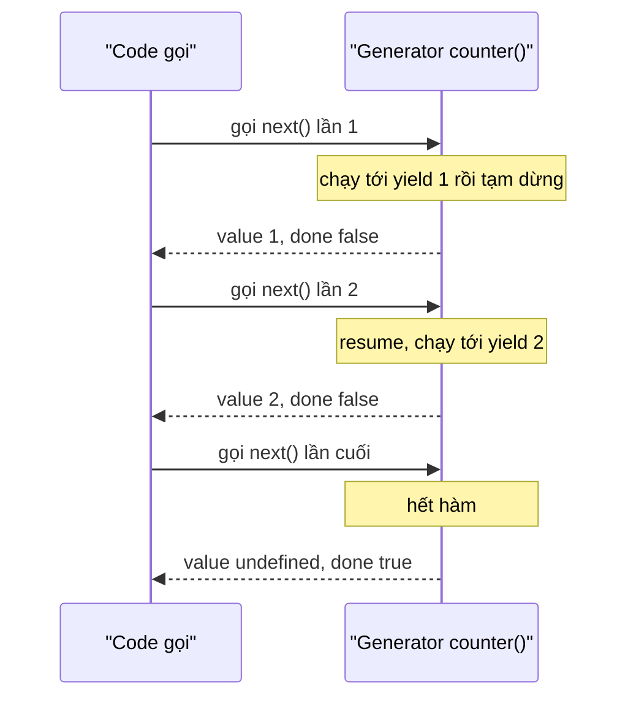
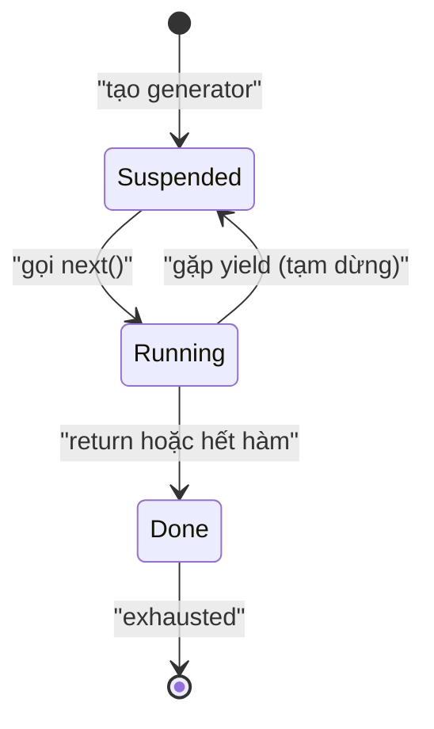

# Iterators và Generators

**Iterator** (bộ lặp — đối tượng cho phép duyệt qua từng phần tử một) là cơ chế giúp bạn đi qua lần lượt các giá trị trong một tập dữ liệu, chẳng hạn như mảng hay chuỗi. **Generator** (hàm sinh giá trị từng phần) là loại hàm đặc biệt có thể tạm dừng và tiếp tục, sinh ra từng giá trị mỗi khi được gọi thay vì trả về tất cả cùng lúc. Bài này giúp người mới hiểu cách JavaScript duyệt dữ liệu và tạo ra các chuỗi giá trị một cách linh hoạt.

[](pathname:///img/javascript/iterators-generators.webp)

---

:::note[Ghi nhớ nhanh]

- ⭐ **Iterator protocol** — object có `next()` trả về `{ value, done }`, tạo ra MỘT cách duyệt thống nhất cho mọi cấu trúc.
- **Iterable protocol** — object có `[Symbol.iterator]()` dùng được với `for...of`, spread `[...obj]`, destructuring và `Array.from`.
- ⭐ **Generator (`function*` + `yield`)** — hàm có thể pause/resume, viết iterator gọn hơn nhiều và hỗ trợ lazy evaluation (chạy được cả dãy vô hạn).
- **`yield*`** — delegate sang iterable khác; generator chỉ duyệt được 1 lần (đã exhausted thì phải gọi lại hàm).
- **Async generator + `for await...of`** — `yield` trả Promise, rất hợp xử lý stream và pagination, dừng sớm được, ít tốn memory.

:::

---

## Mục lục

- [Vì sao iterator & generator ra đời?](#vì-sao-iterator--generator-ra-đời)
- [Iterable Protocol](#iterable-protocol)
- [Iterator Protocol](#iterator-protocol)
- [Generators](#generators)
- [yield và yield*](#yield-và-yield)
- [Async Generators](#async-generators)
- [Câu hỏi phỏng vấn](#câu-hỏi-phỏng-vấn)

---

## Vì sao iterator & generator ra đời?

**Vấn đề:** Trước đây mỗi loại collection lại duyệt một kiểu khác nhau — dễ sai và khó nhớ.

```js
// Mảng: duyệt theo index
const arr = [10, 20, 30];
for (let i = 0; i < arr.length; i++) console.log(arr[i]);

// Object: for...in — duyệt cả key kế thừa từ prototype, dễ dính lỗi
const obj = { a: 1, b: 2 };
for (const k in obj) console.log(k);

// Map / Set lại có cách duyệt riêng (forEach, entries...)
// → không có MỘT cách duyệt chung cho mọi cấu trúc
```

**Giải pháp:** Iterator protocol định nghĩa `next()` trả về `{ value, done }`, tạo ra MỘT cách duyệt thống nhất. Generator (`function*` + `yield`) là cách viết iterator gọn, không cần `next()` thủ công, lại hỗ trợ tạm dừng/tiếp tục và lazy evaluation.

```js
// Một cách duyệt thống nhất cho Array, String, Map, Set...
for (const ch of "hi") console.log(ch);
for (const x of new Set([1, 2])) console.log(x);

// Generator: tạo dãy lazy, chỉ tính khi cần — chạy được cả dãy vô hạn
function* ids() {
  let n = 1;
  while (true) yield n++;
}
const gen = ids();
gen.next().value; // 1
gen.next().value; // 2 — không treo vì chỉ tính từng giá trị
```

:::tip[Dùng thực tế]

- **Duyệt dữ liệu lớn / stream:** đọc file hoặc API theo từng chunk, không nạp hết vào RAM.
- **Sinh dãy vô hạn:** tạo id tăng dần, dãy số, token... mà không cần biết trước độ dài.
- **Phân trang lazy:** tự fetch trang tiếp theo chỉ khi người dùng cần, dừng sớm được.
- **Iterable tuỳ biến:** cho object hoặc class của bạn dùng được `for...of`, spread `...`, destructuring.

:::

---

## Iterable Protocol

Object là **iterable** nếu có method `[Symbol.iterator]()` trả về iterator.
Iterable dùng được trong:

- `for...of`
- Spread `[...obj]`
- Destructuring `[a, b] = obj`
- `Array.from(obj)`

Built-in iterable: `Array`, `String`, `Map`, `Set`, `NodeList`, `arguments`.

```js
for (const ch of "hello") console.log(ch);
for (const [k, v] of new Map([["a", 1]])) console.log(k, v);

const arr = [...new Set([1, 2, 3])];
```

---

## Iterator Protocol

Iterator là object có method `next()` trả về:

```js
{ value: ..., done: false } // còn dữ liệu
{ value: undefined, done: true } // hết
```

Tạo iterable thủ công:

```js
class Range {
  constructor(start, end) {
    this.start = start;
    this.end = end;
  }

  [Symbol.iterator]() {
    let current = this.start;
    const end = this.end;

    return {
      next() {
        if (current <= end) {
          return { value: current++, done: false };
        }
        return { value: undefined, done: true };
      },
    };
  }
}

const r = new Range(1, 5);
for (const n of r) console.log(n); // 1, 2, 3, 4, 5
[...r];                              // [1, 2, 3, 4, 5]
```

---

## Generators

Generator là **function** có thể **pause** và **resume**, trả về iterator tự động.

Cú pháp `function*` + `yield`:

```js
function* counter() {
  yield 1;
  yield 2;
  yield 3;
}

const gen = counter();
gen.next(); // { value: 1, done: false }
gen.next(); // { value: 2, done: false }
gen.next(); // { value: 3, done: false }
gen.next(); // { value: undefined, done: true }
```

Mỗi lần gọi `next()`, generator **chạy tiếp tới `yield` kế tiếp rồi tạm dừng** — trả về `{ value, done }` cho code gọi, sau đó "đóng băng" lại chờ lần `next()` sau:



Nhìn theo trạng thái, generator luân phiên giữa **Suspended** (đang tạm dừng ở một `yield`) và **Running** (đang chạy), cuối cùng chuyển sang **Done** khi hết hàm:



Generator **là iterable** — dùng trong `for...of`:

```js
for (const n of counter()) console.log(n);
[...counter()]; // [1, 2, 3]
```

Generator vô hạn — lazy:

```js
function* naturals() {
  let n = 1;
  while (true) yield n++;
}

const gen = naturals();
gen.next().value; // 1
gen.next().value; // 2
// ... vô hạn, nhưng không treo vì lazy
```

:::info[Phân tích]

**Generator giúp viết iterator gọn hơn rất nhiều:**

```js
// Thủ công
class Range {
  [Symbol.iterator]() {
    let i = this.start;
    return {
      next: () => i <= this.end
        ? { value: i++, done: false }
        : { value: undefined, done: true },
    };
  }
}

// Với generator
class Range {
  *[Symbol.iterator]() {
    for (let i = this.start; i <= this.end; i++) yield i;
  }
}
```

Generator tự lưu state qua mỗi `yield` — không phải maintain `i` thủ công.

Generator hay dùng trong:

- **Redux-Saga** — quản lý async side effect (đã giảm phổ biến, thay bằng RTK Query).
- **Crawler / streaming parser** — xử lý data lớn chunk by chunk.
- **State machine** — implement workflow phức tạp.
- **Coroutine** — chia task thành step pauseable.

:::

---

## yield và yield*

`yield` trả về một giá trị mỗi lần:

```js
function* odd() {
  yield 1;
  yield 3;
  yield 5;
}
```

`yield*` delegate sang iterable khác:

```js
function* a() {
  yield 1;
  yield 2;
}

function* b() {
  yield 0;
  yield* a();   // delegate
  yield 3;
}

[...b()]; // [0, 1, 2, 3]
```

`yield` cũng **nhận giá trị vào** qua `gen.next(value)`:

```js
function* echo() {
  while (true) {
    const x = yield;
    console.log("Got:", x);
  }
}

const g = echo();
g.next();         // start (chạy đến yield đầu)
g.next("hello");  // "Got: hello"
g.next("world");  // "Got: world"
```

:::warning[Cần lưu ý]

**Generator chỉ duyệt được 1 lần:**

```js
const gen = counter();
[...gen]; // [1, 2, 3]
[...gen]; // [] — đã exhausted
```

Khác array (duyệt nhiều lần). Khi cần re-iterate, gọi lại generator
function:

```js
function* counter() { yield 1; yield 2; }

[...counter()]; // [1, 2]
[...counter()]; // [1, 2] — function mới, generator mới
```

:::

---

## Async Generators

Generator có thể là **async** — `yield` trả về Promise:

```js
async function* fetchPages(url) {
  let next = url;
  while (next) {
    const res = await fetch(next);
    const data = await res.json();
    yield data.items;
    next = data.nextPage;
  }
}

// Dùng với for await...of
for await (const items of fetchPages("/api/users")) {
  console.log(items); // mảng items mỗi trang
}
```

:::tip[Mẹo]

**Async generator** rất hợp xử lý **stream** hoặc **pagination**:

```js
// Pagination API
async function* paginate(endpoint) {
  let cursor = null;
  do {
    const url = cursor ? `${endpoint}?cursor=${cursor}` : endpoint;
    const res = await fetch(url).then(r => r.json());
    for (const item of res.items) yield item;
    cursor = res.nextCursor;
  } while (cursor);
}

for await (const user of paginate("/api/users")) {
  // xử lý từng user — tự fetch trang tiếp khi hết
  if (user.id === target) break; // dừng sớm — không fetch tiếp
}
```

So với fetch all rồi loop — async generator **lazy**, dừng sớm được, ít
memory hơn cho dataset lớn.

Node.js `fs.createReadStream` cũng support `for await...of`:

```js
for await (const chunk of fs.createReadStream("big.txt")) {
  process(chunk);
}
```

:::

---

## Câu hỏi phỏng vấn

Những câu thường gặp về chủ đề này. Tự trả lời trước, rồi bấm **Xem đáp án** để đối chiếu.

**1. `Iterable protocol` và `iterator protocol` khác nhau ở chỗ nào? Một object cần có gì để dùng được với `for...of`?**

<details className="qa">
<summary>Xem đáp án</summary>

Hai giao ước tách biệt nhưng bổ trợ nhau:

| | Iterable protocol | Iterator protocol |
|---|---|---|
| Yêu cầu | Có method `[Symbol.iterator]()` | Có method `next()` |
| Trả về | Một **iterator** | `{ value, done }` |
| Trả lời câu hỏi | "Tôi duyệt được, đây là cách lấy bộ duyệt" | "Phần tử tiếp theo là gì?" |

Để dùng với `for...of` (và spread `[...obj]`, destructuring, `Array.from`), object chỉ cần **iterable** — tức có `[Symbol.iterator]()` trả về một object đúng chuẩn iterator.

```js
const range = {
  [Symbol.iterator]() {
    let i = 1;
    return { next: () => (i <= 3 ? { value: i++, done: false } : { value: undefined, done: true }) };
  },
};

for (const n of range) console.log(n); // 1, 2, 3
```

Built-in iterable gồm `Array`, `String`, `Map`, `Set`, `NodeList`, `arguments`. Object thuần **không** iterable, nên `for (const x of {a: 1})` sẽ ném `TypeError`.

</details>

**2. `next()` trả về cái gì? Giải thích ý nghĩa của `value` và `done`, và điều gì xảy ra khi gọi `next()` sau khi đã `done`.**

<details className="qa">
<summary>Xem đáp án</summary>

`next()` trả về một object có hai property:

```js
{ value: ..., done: false }      // còn dữ liệu, value là phần tử hiện tại
{ value: undefined, done: true } // đã hết
```

- `value` — giá trị của bước hiện tại.
- `done` — `false` khi còn phần tử, `true` khi chuỗi đã kết thúc.

Khi `done` là `true`, `for...of` dừng lại và **không** lấy `value` của bước cuối đó vào vòng lặp. Đây là chỗ hay nhầm: nếu generator có `return 99`, bạn nhận `{ value: 99, done: true }` nhưng `[...gen]` sẽ **không** chứa `99`.

Gọi `next()` tiếp sau khi đã `done`: iterator đã exhausted nên mọi lời gọi sau đều trả về `{ value: undefined, done: true }` — an toàn, không ném lỗi, và thân generator không chạy thêm dòng nào nữa.

```js
function* g() { yield 1; }
const it = g();
it.next(); // { value: 1, done: false }
it.next(); // { value: undefined, done: true }
it.next(); // { value: undefined, done: true } — mãi mãi như vậy
```

</details>

**3. Vì sao `for...in` và `for...of` cho kết quả khác nhau trên cùng một mảng? Khi nào dùng cái nào?**

<details className="qa">
<summary>Xem đáp án</summary>

`for...in` duyệt **key** (tên property dạng chuỗi, kể cả key **kế thừa từ prototype**), còn `for...of` duyệt **giá trị** thông qua iterator protocol.

```js
const arr = ["a", "b"];
arr.extra = "x";

for (const k of Object.keys(arr)) {} // "0", "1", "extra"
for (const k in arr) console.log(k); // "0", "1", "extra" — index là CHUỖI
for (const v of arr) console.log(v); // "a", "b" — đúng phần tử
```

Ba vấn đề của `for...in` trên mảng: index ra dưới dạng chuỗi (`"0"` chứ không phải `0`), nó quét cả property tự thêm và property kế thừa, và thứ tự không được đảm bảo tuyệt đối trong mọi trường hợp.

Quy tắc dùng:

- **`for...of`** cho mọi iterable: mảng, chuỗi, `Map`, `Set`, `NodeList`, generator. Kèm `entries()` nếu cần cả index.
- **`for...in`** chỉ cho object thuần khi thật sự muốn duyệt key, và nên lọc bằng `Object.hasOwn(obj, k)`. Thực tế `Object.keys/entries` thường gọn và an toàn hơn.

</details>

**4. Bạn tự cài `[Symbol.iterator]` cho một class `Range` như thế nào? Mô tả từng bước và chỗ lưu state.**

<details className="qa">
<summary>Xem đáp án</summary>

Các bước: khai báo method có tên `[Symbol.iterator]`, khởi tạo biến state **bên trong** method, trả về một object có `next()` đọc và cập nhật state đó, và trả `done: true` khi vượt quá giới hạn.

```js
class Range {
  constructor(start, end) {
    this.start = start;
    this.end = end;
  }

  [Symbol.iterator]() {
    let current = this.start;   // state nằm trong closure của mỗi lần gọi
    const end = this.end;

    return {
      next() {
        if (current <= end) return { value: current++, done: false };
        return { value: undefined, done: true };
      },
    };
  }
}

const r = new Range(1, 5);
for (const n of r) console.log(n); // 1..5
[...r];                            // [1, 2, 3, 4, 5]
```

Điểm mấu chốt: `current` phải nằm **trong** `[Symbol.iterator]()`, không phải trên `this`. Mỗi lần duyệt lại gọi method này nên sinh ra một iterator mới với state riêng — nhờ vậy `Range` duyệt được nhiều lần và duyệt lồng nhau vẫn đúng. Nếu lưu state trên `this`, lần duyệt thứ hai sẽ trả về rỗng.

</details>

**5. Generator khác function thường ở điểm nào? Gọi một `function*` có chạy ngay thân hàm không?**

<details className="qa">
<summary>Xem đáp án</summary>

Function thường chạy từ đầu tới cuối trong một mạch, trả về đúng một giá trị. Generator khai báo bằng `function*`, có thể **tạm dừng ở mỗi `yield` rồi chạy tiếp**, sinh ra nhiều giá trị theo thời gian.

**Gọi `function*` KHÔNG chạy thân hàm.** Nó chỉ tạo và trả về một **generator object** (vừa là iterator vừa là iterable) ở trạng thái suspended. Thân hàm chỉ bắt đầu chạy từ lời gọi `next()` đầu tiên:

```js
function* counter() {
  console.log("bắt đầu");
  yield 1;
  yield 2;
}

const gen = counter();   // chưa in gì cả
gen.next();              // "bắt đầu" → { value: 1, done: false }
gen.next();              // { value: 2, done: false }
gen.next();              // { value: undefined, done: true }
```

Đặc tính này hay gây bất ngờ: nếu bạn đặt code kiểm tra tham số ngay đầu generator, lỗi sẽ không ném lúc gọi hàm mà mãi tới lần `next()` đầu tiên mới lộ ra. Ngoài ra generator object cũng là iterable nên dùng thẳng được với `for...of` và spread.

</details>

**6. Mô tả cơ chế pause/resume của generator: khi gặp `yield` thì chuyện gì xảy ra với call stack và state cục bộ?**

<details className="qa">
<summary>Xem đáp án</summary>

Khi gặp `yield`, generator **trả điều khiển về cho code gọi** cùng với `{ value, done }`, nhưng không bị huỷ như một hàm thường trả về. Execution context của nó — biến cục bộ, vị trí con trỏ lệnh, vòng lặp đang dở — được **lưu lại** và tách khỏi call stack, chuyển sang trạng thái *Suspended*.

Ở lần `next()` tiếp theo, engine **đẩy lại context đó lên call stack**, khôi phục nguyên trạng và chạy tiếp từ ngay sau dòng `yield` vừa dừng, cho tới `yield` kế tiếp hoặc hết hàm (*Done*).

```js
function* g() {
  let i = 0;
  while (i < 2) {
    yield i;   // dừng ở đây, i vẫn được giữ nguyên
    i++;       // lần next() sau chạy tiếp từ dòng này
  }
}
```

Nhờ vậy generator tự lưu state giùm bạn — không phải tự quản lý biến đếm như khi viết iterator thủ công. Lưu ý quan trọng: chỉ thân generator mới `yield` được, và callback bên trong nó (ví dụ trong `arr.forEach(...)`) **không** dùng được `yield`, vì callback là một hàm khác.

</details>

**7. Vì sao generator viết iterator gọn hơn cách thủ công? So sánh hai cách cài `Range`.**

<details className="qa">
<summary>Xem đáp án</summary>

Vì generator **tự lưu state qua mỗi `yield`** — bạn không phải tự tạo biến đếm, không phải tự dựng object `{ value, done }`, không phải nhớ trả `done: true` đúng lúc.

```js
// Thủ công — phải tự quản lý i và tự dựng kết quả
class Range {
  [Symbol.iterator]() {
    let i = this.start;
    return {
      next: () => i <= this.end
        ? { value: i++, done: false }
        : { value: undefined, done: true },
    };
  }
}

// Với generator — chỉ còn một vòng for
class Range {
  *[Symbol.iterator]() {
    for (let i = this.start; i <= this.end; i++) yield i;
  }
}
```

Bản generator ngắn hơn hẳn, đọc ra ngay ý định, và loại bỏ mấy lỗi kinh điển: quên `done: true`, dùng `i++` sai chỗ, so sánh nhầm `<` với `<=`. Generator object cũng đã sẵn là iterator hợp lệ nên `for...of`, spread, destructuring đều hoạt động. Ngoài ra nó còn cho sẵn `return()` và `throw()` để dọn dẹp khi vòng lặp dừng sớm — thứ mà bản thủ công phải tự cài thêm.

</details>

**8. `yield` và `yield*` khác nhau ra sao? Cho ví dụ delegate sang một iterable khác.**

<details className="qa">
<summary>Xem đáp án</summary>

`yield x` sinh ra **một giá trị duy nhất**. `yield* iterable` **uỷ quyền (delegate)**: nó duyệt hết iterable kia và lần lượt sinh ra từng phần tử của nó như thể chúng được `yield` trực tiếp trong generator hiện tại.

```js
function* a() {
  yield 1;
  yield 2;
}

function* b() {
  yield 0;
  yield* a();   // delegate — sinh ra 1 rồi 2
  yield 3;
}

[...b()]; // [0, 1, 2, 3]
```

So sánh nhanh: nếu viết `yield a()` (thiếu dấu `*`), bạn sẽ nhận **generator object** làm một phần tử duy nhất chứ không phải các giá trị bên trong — kết quả là `[0, <generator>, 3]`.

`yield*` nhận mọi iterable, không riêng generator:

```js
function* all() {
  yield* [1, 2];
  yield* "ab";
  yield* new Set([9]);
}
[...all()]; // [1, 2, "a", "b", 9]
```

Nó rất hợp để duyệt cấu trúc đệ quy (cây, thư mục lồng nhau): generator tự gọi lại chính nó bằng `yield*` cho từng nhánh con.

</details>

**9. `gen.next(value)` truyền giá trị VÀO generator hoạt động thế nào? Vì sao giá trị truyền ở lần `next()` đầu tiên bị bỏ qua?**

<details className="qa">
<summary>Xem đáp án</summary>

Biểu thức `yield` không chỉ đẩy giá trị ra mà còn **trả về** giá trị mà lần `next()` kế tiếp truyền vào. Nói cách khác, `const x = yield;` nghĩa là: tạm dừng ở đây, và khi được resume thì gán đối số của `next()` vào `x`.

```js
function* echo() {
  while (true) {
    const x = yield;
    console.log("Got:", x);
  }
}

const g = echo();
g.next();        // chạy tới yield đầu tiên rồi dừng
g.next("hello"); // "Got: hello"
g.next("world"); // "Got: world"
```

**Vì sao lần `next()` đầu bị bỏ qua?** Vì tại thời điểm đó generator **chưa dừng ở `yield` nào cả** — thân hàm còn chưa bắt đầu chạy. Giá trị truyền vào sẽ được gán cho biểu thức `yield` đang bị treo, mà lúc này không có biểu thức nào như vậy, nên nó không có chỗ để đi và bị bỏ đi. Lần `next()` đầu tiên chỉ có nhiệm vụ "khởi động" generator tới `yield` đầu tiên.

Cơ chế hai chiều này chính là nền tảng để các thư viện kiểu Redux-Saga điều khiển luồng bất đồng bộ bằng generator.

</details>

**10. `gen.return()` và `gen.throw()` dùng để làm gì? Kể một tình huống thực tế cần tới chúng.**

<details className="qa">
<summary>Xem đáp án</summary>

- **`gen.return(v)`** kết thúc generator sớm: nó trả về `{ value: v, done: true }` và đưa generator sang trạng thái done. Quan trọng là các khối `finally` trong thân hàm **vẫn được chạy**, nên đây là nơi dọn dẹp tài nguyên.
- **`gen.throw(err)`** ném một lỗi vào **đúng vị trí `yield` đang tạm dừng**, cho phép generator tự bắt bằng `try/catch` bên trong và xử lý, hoặc để lỗi thoát ra ngoài.

```js
function* readLines(file) {
  const handle = open(file);
  try {
    while (true) yield handle.readLine();
  } finally {
    handle.close();   // luôn chạy, kể cả khi dừng sớm
  }
}
```

**Tình huống thực tế:** khi bạn `break` giữa chừng một vòng `for...of` (hoặc gặp lỗi, hoặc destructuring chỉ lấy vài phần tử đầu), JavaScript **tự động gọi `gen.return()`** giùm bạn. Nhờ vậy file handle, kết nối mạng hay stream đang mở trong ví dụ trên được đóng lại thay vì rò rỉ. `gen.throw()` ít gặp hơn, chủ yếu dùng trong các thư viện điều phối luồng (Redux-Saga) để báo cho generator rằng tác vụ bất đồng bộ nó vừa yêu cầu đã thất bại.

</details>

**11. Vì sao generator chỉ duyệt được một lần trong khi array duyệt được nhiều lần? Khi cần re-iterate thì xử lý sao?**

<details className="qa">
<summary>Xem đáp án</summary>

Vì generator object **chính là iterator**, và `[Symbol.iterator]()` của nó trả về chính nó. Nó mang một con trỏ vị trí duy nhất; chạy hết là con trỏ nằm ở cuối, không tua lại được:

```js
const gen = counter();
[...gen]; // [1, 2, 3]
[...gen]; // [] — đã exhausted
```

Array thì khác: nó là **iterable** chứ không phải iterator. Mỗi lần duyệt, `[Symbol.iterator]()` tạo ra một iterator **mới** với vị trí bắt đầu từ đầu, nên duyệt bao nhiêu lần cũng được.

Cách xử lý khi cần duyệt lại:

- Gọi lại generator function để có generator mới: `[...counter()]` mỗi lần.
- Vật chất hoá kết quả ra mảng rồi dùng mảng đó: `const list = [...counter()];` — lưu ý cách này mất tính lazy và không dùng được với dãy vô hạn.
- Bọc trong một object iterable, trả generator mới ở mỗi lần duyệt:

```js
const iterable = { *[Symbol.iterator]() { yield 1; yield 2; } };
[...iterable]; // [1, 2]
[...iterable]; // [1, 2] — luôn tạo iterator mới
```

</details>

**12. `Lazy evaluation` là gì? Vì sao `while (true) yield n++` không làm treo trình duyệt?**

<details className="qa">
<summary>Xem đáp án</summary>

**Lazy evaluation** là chỉ tính một giá trị **vào đúng lúc có người cần tới nó**, thay vì tính sẵn toàn bộ. Generator lazy theo đúng nghĩa đó: mỗi `next()` chỉ chạy thêm một đoạn thân hàm cho tới `yield` kế tiếp rồi dừng lại.

```js
function* naturals() {
  let n = 1;
  while (true) yield n++;
}

const gen = naturals();
gen.next().value; // 1 — chỉ chạy đúng một vòng lặp
gen.next().value; // 2
```

Vòng `while (true)` không treo vì nó **không chạy liên tục**: sau khi sinh ra một giá trị, generator dừng lại và trả điều khiển về cho code gọi. Không có lần `next()` nào nữa thì thân hàm đứng yên mãi mãi. So sánh với một vòng `while (true)` thường — nó chiếm main thread và làm đơ trang ngay lập tức.

Lợi ích thực tế: biểu diễn được dãy vô hạn (id tăng dần, Fibonacci), xử lý dữ liệu lớn theo từng chunk mà không nạp hết vào RAM, và dừng sớm được mà không lãng phí công tính những phần tử không dùng tới.

</details>

**13. Spread `[...gen]` với một generator vô hạn thì điều gì xảy ra? Làm sao lấy an toàn N phần tử đầu?**

<details className="qa">
<summary>Xem đáp án</summary>

Spread **duyệt cho tới khi `done: true`**. Với dãy vô hạn, điều kiện đó không bao giờ tới: vòng lặp chạy mãi, chiếm main thread làm đơ trang, mảng phình lên cho tới khi hết bộ nhớ và tab crash. `for...of` không có `break`, `Array.from(gen)` hay `Promise.all` trên async generator vô hạn cũng gặp y hệt.

Cách lấy an toàn N phần tử đầu — dùng `break`:

```js
function take(iterable, n) {
  const out = [];
  for (const x of iterable) {
    if (out.length >= n) break;  // break tự gọi gen.return() để dọn dẹp
    out.push(x);
  }
  return out;
}

take(naturals(), 5); // [1, 2, 3, 4, 5]
```

Hoặc viết một generator `take` để giữ nguyên tính lazy:

```js
function* take(iterable, n) {
  let i = 0;
  for (const x of iterable) {
    if (i++ >= n) return;
    yield x;
  }
}
```

Nguyên tắc: với nguồn dữ liệu có thể vô hạn, luôn đặt một điểm dừng rõ ràng trước khi vật chất hoá ra mảng.

</details>

**14. `Async generator` và `for await...of` giải quyết bài toán nào mà generator thường không làm được?**

<details className="qa">
<summary>Xem đáp án</summary>

Generator thường chỉ sinh ra giá trị **đồng bộ** — nó không biết chờ. Muốn mỗi phần tử đến từ một thao tác bất đồng bộ (gọi API, đọc file, nhận message), bạn phải `yield` ra Promise rồi tự viết vòng lặp `await` bên ngoài, khá rườm rà.

`async function*` cho phép dùng `await` **ngay trong thân generator**, và `for await...of` tự động chờ từng giá trị:

```js
async function* fetchPages(url) {
  let next = url;
  while (next) {
    const res = await fetch(next);
    const data = await res.json();
    yield data.items;
    next = data.nextPage;
  }
}

for await (const items of fetchPages("/api/users")) {
  console.log(items);
}
```

Bài toán nó giải: **luồng dữ liệu bất đồng bộ đến theo thời gian và không biết trước độ dài** — phân trang API, đọc stream file theo chunk, nhận message từ WebSocket. So với `async/await` thường vốn trả về đúng một kết quả, async generator trả về *nhiều* kết quả nối tiếp, vẫn lazy, vẫn `break` được giữa chừng và không phải giữ toàn bộ dữ liệu trong bộ nhớ. Node.js cũng cho `for await...of` chạy thẳng trên stream (`fs.createReadStream`).

</details>

**15. Bạn xử lý phân trang API kiểu `cursor` bằng async generator như thế nào? So với fetch hết rồi loop thì lợi và hại gì?**

<details className="qa">
<summary>Xem đáp án</summary>

Generator giữ `cursor` làm state, fetch một trang, `yield` từng item, rồi lặp cho tới khi không còn cursor:

```js
async function* paginate(endpoint) {
  let cursor = null;
  do {
    const url = cursor ? `${endpoint}?cursor=${cursor}` : endpoint;
    const res = await fetch(url).then((r) => r.json());
    for (const item of res.items) yield item;
    cursor = res.nextCursor;
  } while (cursor);
}

for await (const user of paginate("/api/users")) {
  if (user.id === target) break; // dừng sớm — không fetch trang tiếp
}
```

**Lợi:** lazy nên chỉ fetch trang khi thật sự cần; dừng sớm được (tìm thấy là thoát, tiết kiệm hàng chục request); bộ nhớ chỉ giữ một trang thay vì toàn bộ dataset; phía gọi viết như duyệt một danh sách phẳng, không phải bận tâm tới cursor.

**Hại:** các request đi **tuần tự** nên nếu cần toàn bộ dữ liệu thì chậm hơn cách fetch song song; khó retry hay xử lý lỗi giữa chừng vì trạng thái nằm trong generator; không biết trước tổng số phần tử; và chỉ duyệt được một lần, muốn duyệt lại phải gọi `paginate()` mới.

</details>

**16. Kể vài tình huống thực tế bạn chọn generator (`stream`, `state machine`, sinh id, Redux-Saga). Vì sao ngày nay generator ít phổ biến hơn `async/await`?**

<details className="qa">
<summary>Xem đáp án</summary>

Những chỗ generator thật sự phát huy:

- **Stream / dữ liệu lớn:** đọc file, parse CSV hay crawl web theo từng chunk, không nạp hết vào RAM.
- **Sinh dãy vô hạn:** id tăng dần, dãy số, token — lazy nên không cần biết trước độ dài.
- **State machine / coroutine:** mỗi `yield` là một bước của workflow có thể tạm dừng, rất hợp cho luồng nhiều bước hoặc logic game theo lượt.
- **Iterable tuỳ biến:** cho class của bạn dùng được `for...of`, spread, destructuring chỉ với một `*[Symbol.iterator]()`.
- **Redux-Saga:** điều phối side effect bất đồng bộ, tận dụng khả năng truyền giá trị hai chiều và huỷ tác vụ.

**Vì sao ít phổ biến hơn `async/await`:** phần lớn nhu cầu thực tế là "chờ **một** kết quả bất đồng bộ", và `async/await` giải bài đó gọn hơn hẳn, dễ đọc, dễ debug, ai cũng hiểu ngay. Generator đòi hiểu thêm `next()`, `yield` hai chiều, `return`/`throw` — chi phí học cao mà chỉ đáng bỏ ra khi cần *nhiều* giá trị theo thời gian. Bản thân `async/await` cũng từng được transpile thành generator, cho thấy nó là lớp trừu tượng chuyên biệt hơn cho đúng trường hợp phổ biến nhất. Redux-Saga cũng đã giảm phổ biến, nhường chỗ cho RTK Query.

</details>
