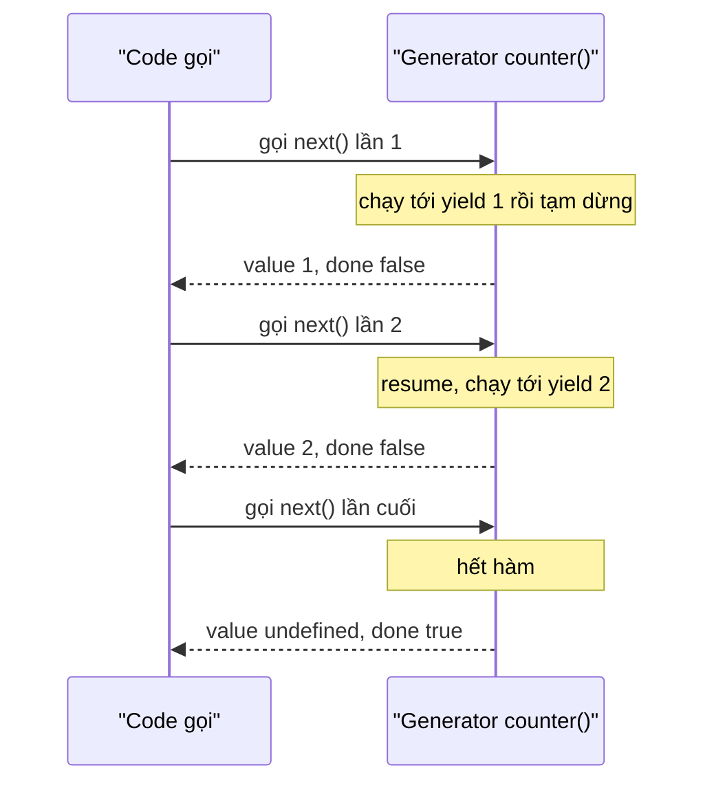
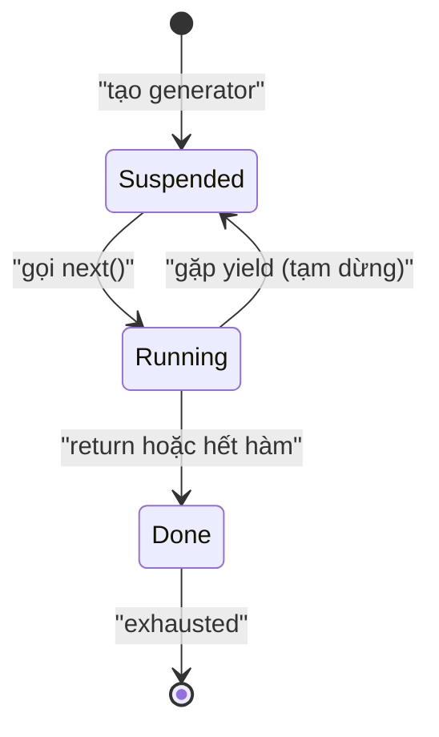

# Iterators và Generators

**Iterator** (bộ lặp — đối tượng cho phép duyệt qua từng phần tử một) là cơ chế giúp bạn đi qua lần lượt các giá trị trong một tập dữ liệu, chẳng hạn như mảng hay chuỗi. **Generator** (hàm sinh giá trị từng phần) là loại hàm đặc biệt có thể tạm dừng và tiếp tục, sinh ra từng giá trị mỗi khi được gọi thay vì trả về tất cả cùng lúc. Bài này giúp người mới hiểu cách JavaScript duyệt dữ liệu và tạo ra các chuỗi giá trị một cách linh hoạt.

---

## 🎯 Cần nắm gì sau bài này?

:::note[Ghi nhớ nhanh — ⭐ là phần quan trọng nhất]

- ⭐ **Iterator protocol** — object có `next()` trả về `{ value, done }`, tạo ra MỘT cách duyệt thống nhất cho mọi cấu trúc.
- **Iterable protocol** — object có `[Symbol.iterator]()` dùng được với `for...of`, spread `[...obj]`, destructuring và `Array.from`.
- ⭐ **Generator (`function*` + `yield`)** — hàm có thể pause/resume, viết iterator gọn hơn nhiều và hỗ trợ lazy evaluation (chạy được cả dãy vô hạn).
- **`yield*`** — delegate sang iterable khác; generator chỉ duyệt được 1 lần (đã exhausted thì phải gọi lại hàm).
- **Async generator + `for await...of`** — `yield` trả Promise, rất hợp xử lý stream và pagination, dừng sớm được, ít tốn memory.

:::

---

## Mục lục

- [Vì sao iterator & generator ra đời?](#vì-sao-iterator--generator-ra-đời)
- [Iterable Protocol](#iterable-protocol)
- [Iterator Protocol](#iterator-protocol)
- [Generators](#generators)
- [yield và yield*](#yield-và-yield)
- [Async Generators](#async-generators)

---

## Vì sao iterator & generator ra đời?

**Vấn đề:** Trước đây mỗi loại collection lại duyệt một kiểu khác nhau — dễ sai và khó nhớ.

```js
// Mảng: duyệt theo index
const arr = [10, 20, 30];
for (let i = 0; i < arr.length; i++) console.log(arr[i]);

// Object: for...in — duyệt cả key kế thừa từ prototype, dễ dính lỗi
const obj = { a: 1, b: 2 };
for (const k in obj) console.log(k);

// Map / Set lại có cách duyệt riêng (forEach, entries...)
// → không có MỘT cách duyệt chung cho mọi cấu trúc
```

**Giải pháp:** Iterator protocol định nghĩa `next()` trả về `{ value, done }`, tạo ra MỘT cách duyệt thống nhất. Generator (`function*` + `yield`) là cách viết iterator gọn, không cần `next()` thủ công, lại hỗ trợ tạm dừng/tiếp tục và lazy evaluation.

```js
// Một cách duyệt thống nhất cho Array, String, Map, Set...
for (const ch of "hi") console.log(ch);
for (const x of new Set([1, 2])) console.log(x);

// Generator: tạo dãy lazy, chỉ tính khi cần — chạy được cả dãy vô hạn
function* ids() {
  let n = 1;
  while (true) yield n++;
}
const gen = ids();
gen.next().value; // 1
gen.next().value; // 2 — không treo vì chỉ tính từng giá trị
```

:::tip[Dùng thực tế]

- **Duyệt dữ liệu lớn / stream:** đọc file hoặc API theo từng chunk, không nạp hết vào RAM.
- **Sinh dãy vô hạn:** tạo id tăng dần, dãy số, token... mà không cần biết trước độ dài.
- **Phân trang lazy:** tự fetch trang tiếp theo chỉ khi người dùng cần, dừng sớm được.
- **Iterable tuỳ biến:** cho object hoặc class của bạn dùng được `for...of`, spread `...`, destructuring.

:::

---

## Iterable Protocol

Object là **iterable** nếu có method `[Symbol.iterator]()` trả về iterator.
Iterable dùng được trong:

- `for...of`
- Spread `[...obj]`
- Destructuring `[a, b] = obj`
- `Array.from(obj)`

Built-in iterable: `Array`, `String`, `Map`, `Set`, `NodeList`, `arguments`.

```js
for (const ch of "hello") console.log(ch);
for (const [k, v] of new Map([["a", 1]])) console.log(k, v);

const arr = [...new Set([1, 2, 3])];
```

---

## Iterator Protocol

Iterator là object có method `next()` trả về:

```js
{ value: ..., done: false } // còn dữ liệu
{ value: undefined, done: true } // hết
```

Tạo iterable thủ công:

```js
class Range {
  constructor(start, end) {
    this.start = start;
    this.end = end;
  }

  [Symbol.iterator]() {
    let current = this.start;
    const end = this.end;

    return {
      next() {
        if (current <= end) {
          return { value: current++, done: false };
        }
        return { value: undefined, done: true };
      },
    };
  }
}

const r = new Range(1, 5);
for (const n of r) console.log(n); // 1, 2, 3, 4, 5
[...r];                              // [1, 2, 3, 4, 5]
```

---

## Generators

Generator là **function** có thể **pause** và **resume**, trả về iterator tự động.

Cú pháp `function*` + `yield`:

```js
function* counter() {
  yield 1;
  yield 2;
  yield 3;
}

const gen = counter();
gen.next(); // { value: 1, done: false }
gen.next(); // { value: 2, done: false }
gen.next(); // { value: 3, done: false }
gen.next(); // { value: undefined, done: true }
```

Mỗi lần gọi `next()`, generator **chạy tiếp tới `yield` kế tiếp rồi tạm dừng** — trả về `{ value, done }` cho code gọi, sau đó "đóng băng" lại chờ lần `next()` sau:



Nhìn theo trạng thái, generator luân phiên giữa **Suspended** (đang tạm dừng ở một `yield`) và **Running** (đang chạy), cuối cùng chuyển sang **Done** khi hết hàm:



Generator **là iterable** — dùng trong `for...of`:

```js
for (const n of counter()) console.log(n);
[...counter()]; // [1, 2, 3]
```

Generator vô hạn — lazy:

```js
function* naturals() {
  let n = 1;
  while (true) yield n++;
}

const gen = naturals();
gen.next().value; // 1
gen.next().value; // 2
// ... vô hạn, nhưng không treo vì lazy
```

:::info[Phân tích]

**Generator giúp viết iterator gọn hơn rất nhiều:**

```js
// Thủ công
class Range {
  [Symbol.iterator]() {
    let i = this.start;
    return {
      next: () => i <= this.end
        ? { value: i++, done: false }
        : { value: undefined, done: true },
    };
  }
}

// Với generator
class Range {
  *[Symbol.iterator]() {
    for (let i = this.start; i <= this.end; i++) yield i;
  }
}
```

Generator tự lưu state qua mỗi `yield` — không phải maintain `i` thủ công.

Generator hay dùng trong:

- **Redux-Saga** — quản lý async side effect (đã giảm phổ biến, thay bằng RTK Query).
- **Crawler / streaming parser** — xử lý data lớn chunk by chunk.
- **State machine** — implement workflow phức tạp.
- **Coroutine** — chia task thành step pauseable.

:::

---

## yield và yield*

`yield` trả về một giá trị mỗi lần:

```js
function* odd() {
  yield 1;
  yield 3;
  yield 5;
}
```

`yield*` delegate sang iterable khác:

```js
function* a() {
  yield 1;
  yield 2;
}

function* b() {
  yield 0;
  yield* a();   // delegate
  yield 3;
}

[...b()]; // [0, 1, 2, 3]
```

`yield` cũng **nhận giá trị vào** qua `gen.next(value)`:

```js
function* echo() {
  while (true) {
    const x = yield;
    console.log("Got:", x);
  }
}

const g = echo();
g.next();         // start (chạy đến yield đầu)
g.next("hello");  // "Got: hello"
g.next("world");  // "Got: world"
```

:::warning[Cần lưu ý]

**Generator chỉ duyệt được 1 lần:**

```js
const gen = counter();
[...gen]; // [1, 2, 3]
[...gen]; // [] — đã exhausted
```

Khác array (duyệt nhiều lần). Khi cần re-iterate, gọi lại generator
function:

```js
function* counter() { yield 1; yield 2; }

[...counter()]; // [1, 2]
[...counter()]; // [1, 2] — function mới, generator mới
```

:::

---

## Async Generators

Generator có thể là **async** — `yield` trả về Promise:

```js
async function* fetchPages(url) {
  let next = url;
  while (next) {
    const res = await fetch(next);
    const data = await res.json();
    yield data.items;
    next = data.nextPage;
  }
}

// Dùng với for await...of
for await (const items of fetchPages("/api/users")) {
  console.log(items); // mảng items mỗi trang
}
```

:::tip[Mẹo]

**Async generator** rất hợp xử lý **stream** hoặc **pagination**:

```js
// Pagination API
async function* paginate(endpoint) {
  let cursor = null;
  do {
    const url = cursor ? `${endpoint}?cursor=${cursor}` : endpoint;
    const res = await fetch(url).then(r => r.json());
    for (const item of res.items) yield item;
    cursor = res.nextCursor;
  } while (cursor);
}

for await (const user of paginate("/api/users")) {
  // xử lý từng user — tự fetch trang tiếp khi hết
  if (user.id === target) break; // dừng sớm — không fetch tiếp
}
```

So với fetch all rồi loop — async generator **lazy**, dừng sớm được, ít
memory hơn cho dataset lớn.

Node.js `fs.createReadStream` cũng support `for await...of`:

```js
for await (const chunk of fs.createReadStream("big.txt")) {
  process(chunk);
}
```

:::
