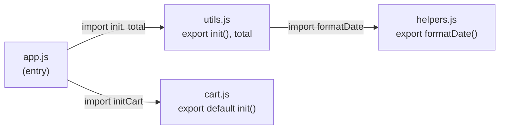

# Modules: CommonJS vs ES Modules

**Module** (mô-đun — một file code độc lập có thể chia sẻ cho file khác) giúp bạn tách chương trình thành nhiều phần nhỏ, mỗi phần lo một việc và có thể tái sử dụng. JavaScript có hai cách viết module phổ biến: **CommonJS** (chuẩn cũ dùng `require` và `module.exports`, thường gặp trong Node.js) và **ES Modules** (chuẩn hiện đại dùng `import` và `export`). Bài này giúp người mới hiểu vì sao cần chia code thành module và khác biệt giữa hai chuẩn này.

[](pathname:///img/javascript/modules.webp)

---

:::note[Ghi nhớ nhanh]

- ⭐ **ES Modules (`import`/`export`)** — mỗi file có scope riêng (không làm bẩn global), phụ thuộc khai báo tường minh; là chuẩn hiện đại năm 2026.
- **CommonJS (`require`/`module.exports`)** — chuẩn cũ của Node.js: đồng bộ, dynamic (chạy runtime), có cache.
- **Đặc điểm ESM** — `static` (top-level), async, `strict mode` mặc định và **live binding** (export là tham chiếu live, không phải copy như CJS).
- **Default vs Named export** — named dễ grep/refactor/tree-shaking (khuyên dùng cho lib/util); default hợp component chính của file.
- ⭐ **Dynamic `import()`** — trả Promise, load module runtime để lazy load / code splitting; cũng là cách import ESM từ CJS (tránh `ERR_REQUIRE_ESM`).

:::

---

## Mục lục

- [Vì sao module ra đời?](#vì-sao-module-ra-đời)
- [Lịch sử module trong JS](#lịch-sử-module-trong-js)
- [CommonJS (CJS)](#commonjs-cjs)
- [ES Modules (ESM)](#es-modules-esm)
- [Default vs Named export](#default-vs-named-export)
- [Dynamic import](#dynamic-import)
- [Interop CJS và ESM](#interop-cjs-và-esm)
- [Câu hỏi phỏng vấn](#câu-hỏi-phỏng-vấn)

---

## Vì sao module ra đời?

**Vấn đề:** Trước đây nhiều file `<script>` cùng nhét biến/hàm vào **global scope**, dễ đụng độ tên giữa các file:

```js
// utils.js — load qua <script>
var total = 0;
function init() { /* ... */ }

// cart.js — load qua <script> sau utils.js
var total = 100;            // ghi đè total của utils.js!
function init() { /* ... */ } // ghi đè luôn init() ở trên

// app.js
init();   // gọi nhầm init() nào? tuỳ thứ tự load <script>
```

Phải tự xếp thứ tự `<script>` cho đúng, khó biết file nào phụ thuộc file nào. Người ta workaround bằng **IIFE + namespace object** (gói code trong một biến global duy nhất), rồi **CommonJS** (`require`) cho Node.

**Giải pháp:** **ES Modules** (ES6) — mỗi file là một module có **scope riêng**, không làm bẩn global. Dùng `export` để chia sẻ, `import` để khai báo phụ thuộc rõ ràng:

```js
// utils.js
export let total = 0;            // named export
export function init() { /* ... */ }

// cart.js
export let total = 100;          // không đụng total của utils.js
export default function init() { /* ... */ } // default export

// app.js
import { init as initUtils, total } from "./utils.js";
import initCart from "./cart.js";

initUtils(); // rõ ràng gọi cái nào
initCart();
```

Nhờ `import`/`export`, quan hệ phụ thuộc giữa các file trở nên **tường minh** — nhìn vào là biết file nào cần file nào (đồ thị phụ thuộc):



Mỗi module có scope riêng nên không còn đụng tên; phụ thuộc khai báo tường minh; ESM luôn chạy ở **strict mode**; và bundler có thể **tree-shaking** (loại bỏ code không dùng khi build).

:::tip[Dùng thực tế]

- **Tách code theo chức năng** — mỗi tính năng một file (`auth.js`, `cart.js`...), dễ đọc, dễ test.
- **Tái sử dụng util giữa các project** — viết `formatDate` một lần rồi `import` ở nhiều nơi.
- **Import thư viện npm** — `import axios from "axios"` thay vì gắn thẻ `<script>` toàn cục.
- **Lazy load (dynamic import)** — `await import("./Heavy.js")` để chia nhỏ bundle, chỉ tải khi cần.

:::

---

## Lịch sử module trong JS

JavaScript ban đầu **không có module** — mọi file share global namespace.

Các giải pháp lần lượt:

- **CommonJS** (2009) — chuẩn của Node.js (`require`/`module.exports`).
- **AMD** (2011) — async loading cho browser (RequireJS).
- **UMD** (2014) — tương thích cả CJS và AMD.
- **ES Modules** (2015) — chuẩn chính thức của ECMAScript.

Năm 2026, **ES Modules thắng**. CommonJS vẫn dùng trong Node legacy.

---

## CommonJS (CJS)

Cú pháp của Node.js cổ điển:

```js
// math.js
function add(a, b) { return a + b; }
const PI = 3.14;

module.exports = { add, PI };
// hoặc
exports.add = add;
exports.PI = PI;
```

```js
// app.js
const { add, PI } = require("./math");
const math = require("./math");

add(1, 2);
math.PI;
```

Đặc điểm:

- **Đồng bộ** — `require` chặn thread đến khi load xong.
- **Dynamic** — `require()` chạy tại runtime, có thể conditional.
- **Có cached** — module chỉ load 1 lần.

---

## ES Modules (ESM)

Cú pháp chuẩn từ ES6:

```js
// math.js
export function add(a, b) { return a + b; }
export const PI = 3.14;

export default function multiply(a, b) { return a * b; }
```

```js
// app.js
import multiply, { add, PI } from "./math.js";
import * as math from "./math.js";

add(1, 2);
math.PI;
```

Đặc điểm:

- **Static** — `import`/`export` phải ở top-level, không trong `if`/`for`.
- **Async** — module được parse trước, load song song.
- **Strict mode** mặc định.
- **Live binding** — export là tham chiếu live, không phải copy.

:::info[Phân tích]

**Live binding** là khác biệt lớn so với CJS:

```js
// counter.mjs (ESM)
export let count = 0;
export function inc() { count++; }
```

```js
// app.mjs
import { count, inc } from "./counter.mjs";
console.log(count); // 0
inc();
console.log(count); // 1 — thay đổi reflect ngay
```

Trong CJS, value được **copy** khi require:

```js
// counter.cjs
let count = 0;
function inc() { count++; }
module.exports = { count, inc };
```

```js
// app.cjs
const { count, inc } = require("./counter.cjs");
inc();
console.log(count); // 0 — copy lúc require, không update
```

→ Khi cần share state qua module, ESM rõ ràng hơn. Hoặc dùng object
wrapper trong CJS.

:::

---

## Default vs Named export

**Named export** — đặt tên cụ thể:

```js
// utils.js
export const PI = 3.14;
export function add(a, b) { return a + b; }
export class Calc {}
```

```js
import { PI, add, Calc } from "./utils.js";
import { PI as Constant } from "./utils.js"; // rename
import * as utils from "./utils.js";
```

**Default export** — một export duy nhất, không tên:

```js
// User.js
export default class User {}
```

```js
import User from "./User.js";       // tên do caller chọn
import MyUser from "./User.js";     // OK luôn
```

Có thể trộn cả hai:

```js
// api.js
export default fetch;
export const BASE_URL = "/api";
export function get(url) {}
```

```js
import fetch, { BASE_URL, get } from "./api.js";
```

:::warning[Cần lưu ý]

**Default export không tốt khi nào?**

- **Rename không nhất quán** — mỗi file dùng tên khác → khó grep.
- **Refactor khó hơn** — đổi tên class/function không tự sync vào caller.
- **Re-export verbose hơn**:

```js
// Named — gọn
export { default as Button } from "./Button.js";
export * from "./utils.js";

// Default — phải gán tên lại
export { default as Header } from "./Header.js";
```

Nhiều style guide (Airbnb, Google) khuyên **tránh default export**.
Riêng React component, default export vẫn phổ biến vì 1 component / file.

Quy tắc thực dụng:

- Library/util — **named** (lib có nhiều export).
- Component/class chính của file — **default**.
- Nhất quán trong codebase.

:::

---

## Dynamic import

`import()` trả Promise — load module **runtime**:

```js
async function loadLodash() {
  const { default: _ } = await import("lodash");
  return _;
}

// Code splitting trong React
const LazyComponent = React.lazy(() => import("./Heavy.js"));
```

Conditional:

```js
if (userWantsAdvancedMode) {
  const { advancedFeature } = await import("./advanced.js");
  advancedFeature();
}
```

`import.meta` — metadata về module hiện tại:

```js
console.log(import.meta.url);   // URL của file
console.log(import.meta.env);   // env vars (Vite, Bun)
```

---

## Interop CJS và ESM

Vấn đề: 80% npm package từng là CJS, chuyển dần sang ESM.

Trong Node.js, **`package.json`** quyết định module format:

```json
{
  "type": "module"  // file .js → ESM
}
```

Hoặc dùng đuôi rõ ràng:

- `.mjs` — ESM
- `.cjs` — CommonJS
- `.js` — theo `"type"` trong `package.json`

**Import CJS từ ESM** — thường OK:

```js
import express from "express";       // default
import { Router } from "express";    // có thể không hoạt động
```

**Import ESM từ CJS** — **chỉ qua dynamic import**:

```js
// app.cjs
const lib = await import("esm-only-lib"); // OK
const lib = require("esm-only-lib"); // ERR_REQUIRE_ESM
```

:::info[Phân tích]

**ERR_REQUIRE_ESM** là lỗi gặp khi:

1. Package mới publish chỉ ESM (vd `node-fetch` v3, `chalk` v5).
2. Code bạn vẫn CJS.

Cách xử lý:

**1. Migrate sang ESM** (khuyến nghị):

```json
// package.json
{ "type": "module" }
```

Phải đổi: `require` → `import`, `__dirname` → `import.meta.url`, etc.

**2. Pin version cũ của package**:

```bash
npm install chalk@4  # CJS-compatible
```

**3. Dynamic import trong CJS**:

```js
async function main() {
  const { default: chalk } = await import("chalk");
  console.log(chalk.red("error"));
}
```

Node.js 22+ có **`--experimental-require-module`** cho phép `require()`
ESM trong một số trường hợp. Đang dần ổn định trong các bản gần đây.

:::

:::tip[Mẹo]

**Cho project mới năm 2026 — luôn ESM**:

```json
{
  "type": "module",
  "exports": {
    ".": {
      "import": "./dist/index.js",
      "types": "./dist/index.d.ts"
    }
  }
}
```

Tránh CJS trừ khi:
- Maintain library cũ.
- Target Node version rất cũ (≤ 12).

Bundler hiện đại (Vite, esbuild, Rollup) đều output cả ESM và CJS nếu
publish thư viện — đảm bảo tương thích cả hai phía.

:::

---

## Câu hỏi phỏng vấn

Những câu thường gặp về chủ đề này. Tự trả lời trước, rồi bấm **Xem đáp án** để đối chiếu.

**1. Trước khi có module, code JS gặp vấn đề gì với global scope? Người ta workaround bằng `IIFE` và namespace ra sao?**

<details className="qa">
<summary>Xem đáp án</summary>

Mọi file nạp bằng `<script>` đều đổ biến và hàm vào chung **global scope**. Hai file cùng khai báo `var total` hay `function init()` là ghi đè lẫn nhau, kết quả phụ thuộc thứ tự thẻ `<script>` — rất khó debug. Tệ hơn, không nhìn vào đâu biết file nào cần file nào, lập trình viên phải tự xếp thứ tự load bằng tay.

Workaround kinh điển là **IIFE** (hàm chạy ngay) kết hợp **namespace object**:

```js
var App = App || {};
App.cart = (function () {
  var total = 0;            // riêng tư, không lên global
  function init() { /* ... */ }
  return { init };          // chỉ lộ ra thứ cần
})();
App.cart.init();
```

Biến bên trong IIFE nằm trong scope hàm nên không đụng ai; cả ứng dụng chỉ chiếm đúng một biến global (`App`), mỗi module là một nhánh. Cách này giảm được đụng tên nhưng vẫn phải tự quản thứ tự load và không có đồ thị phụ thuộc tường minh — đúng chỗ CommonJS rồi ES Modules sinh ra để giải quyết.

</details>

**2. So sánh `CommonJS` và `ES Modules` về cú pháp, thời điểm resolve, và tính đồng bộ/bất đồng bộ.**

<details className="qa">
<summary>Xem đáp án</summary>

| Tiêu chí | CommonJS | ES Modules |
|---|---|---|
| Cú pháp | `require()` / `module.exports` | `import` / `export` |
| Thời điểm resolve | **Runtime** — `require()` là lời gọi hàm, chạy tới đâu load tới đó | **Parse time** — phụ thuộc phân tích tĩnh trước khi code chạy |
| Đồng bộ | Đồng bộ, chặn thread đến khi load xong | Bất đồng bộ, các module được nạp song song |
| Vị trí đặt | Bất kỳ đâu (trong `if`, trong hàm) | Chỉ top-level |
| Binding | **Copy** giá trị lúc require | **Live binding** — tham chiếu sống |
| Strict mode | Không mặc định | Luôn bật |
| Phạm vi dùng | Node.js (chuẩn cũ 2009) | Chuẩn ECMAScript, chạy cả browser lẫn Node |

Hệ quả thực tế: vì ESM static nên bundler biết chắc export nào được dùng → **tree shaking**; còn CJS dynamic thì thường phải giữ nguyên cả module. Năm 2026 ESM là mặc định cho project mới, CJS chủ yếu còn ở codebase Node legacy.

</details>

**3. "Static" của ESM nghĩa là gì? Vì sao `import` không đặt được trong `if` hay trong hàm?**

<details className="qa">
<summary>Xem đáp án</summary>

**Static** nghĩa là danh sách `import`/`export` của module được xác định **ngay lúc parse**, trước khi bất kỳ dòng code nào chạy. Engine chỉ cần đọc cú pháp là dựng xong đồ thị phụ thuộc mà không phải thực thi module.

Vì vậy `import` bắt buộc nằm ở **top-level**. Đặt trong `if` hay trong hàm thì phụ thuộc chỉ lộ ra lúc runtime, phá vỡ khả năng phân tích tĩnh:

```js
if (isDev) {
  import { log } from "./log.js"; // SyntaxError
}
```

Đổi lại ta được: nạp song song các module từ sớm (không phải chạy tới đâu load tới đó), báo lỗi sai tên export ngay lúc compile thay vì lúc chạy, và cho phép bundler **tree shaking** vì biết chắc export nào không ai dùng.

Khi thật sự cần nạp có điều kiện, dùng `import()` động — đây là dạng duy nhất được phép đặt trong `if` hoặc trong hàm, và nó trả về Promise.

</details>

**4. `Live binding` là gì? Cho ví dụ cùng một biến `count` hành xử khác nhau giữa CJS và ESM, và giải thích vì sao.**

<details className="qa">
<summary>Xem đáp án</summary>

**Live binding**: trong ESM, tên được `import` không phải bản sao giá trị mà là **tham chiếu sống** tới biến trong module gốc. Module gốc đổi giá trị thì bên import thấy ngay.

```js
// counter.mjs
export let count = 0;
export function inc() { count++; }

// app.mjs
import { count, inc } from "./counter.mjs";
console.log(count); // 0
inc();
console.log(count); // 1 — cập nhật ngay
```

CommonJS thì khác: `module.exports = { count, inc }` **copy giá trị** của `count` vào object export ngay tại thời điểm đó.

```js
// app.cjs
const { count, inc } = require("./counter.cjs");
inc();
console.log(count); // 0 — vẫn là bản copy cũ
```

Lý do: CJS export một **object bình thường**, nên `count` chỉ là một property mang giá trị tại lúc gán. ESM export một **binding** do engine quản lý. Trong CJS muốn chia sẻ state phải truy cập qua object (`counter.count`) chứ đừng destructure. Lưu ý: binding trong ESM là read-only ở phía import — gán `count = 5` từ `app.mjs` sẽ lỗi.

</details>

**5. Module trong Node có được cache không? Điều gì xảy ra khi hai file cùng `require` một module có side effect?**

<details className="qa">
<summary>Xem đáp án</summary>

Có. Node **cache module theo đường dẫn đã resolve**: lần `require` đầu tiên mới thực thi file, các lần sau trả thẳng object `module.exports` trong cache (`require.cache`). ESM cũng có module map tương tự — mỗi URL chỉ được evaluate đúng một lần.

Hệ quả: **side effect chỉ chạy một lần**, dù bao nhiêu file require nó.

```js
// db.js
console.log("connecting...");
module.exports = { conn: createConnection() };

// a.js
require("./db"); // in "connecting..." — thực thi thật
// b.js
require("./db"); // không in gì — lấy từ cache, dùng chung conn
```

Đây chính là lý do pattern singleton (connection pool, config, logger) hoạt động tự nhiên trong Node mà không cần code gì thêm.

Mặt trái: state trong module là **toàn cục dùng chung** — một file sửa thì mọi file thấy, dễ sinh lỗi khó lần. Khi viết test, muốn cô lập phải xoá cache thủ công (`delete require.cache[require.resolve("./db")]`) hoặc dùng cơ chế reset module của test runner.

</details>

**6. `Tree shaking` là gì? Vì sao CommonJS gần như không tree-shake được còn ESM thì được?**

<details className="qa">
<summary>Xem đáp án</summary>

**Tree shaking** là kỹ thuật bundler loại bỏ code được export nhưng **không ai import** khi build, giúp bundle nhỏ lại. Tên gọi hình dung việc "rung cây" cho lá chết rụng: giữ lại đúng những nhánh còn được nối tới từ entry point.

ESM tree-shake được vì `import`/`export` là **static**: bundler đọc cú pháp là biết chính xác module xuất ra gì và ai dùng gì, không cần chạy code.

```js
// utils.js xuất 20 hàm
import { add } from "./utils.js";
// bundler giữ add(), cắt 19 hàm còn lại
```

CommonJS thì `module.exports` chỉ là một object bình thường được gán lúc runtime, và `require()` là lời gọi hàm có thể nằm trong `if`, có thể nhận đường dẫn động:

```js
const name = cond ? "./a" : "./b";
const mod = require(name);         // không đoán nổi lúc build
module.exports[key] = fn;          // export gán động
```

Bundler không dám cắt gì vì không chứng minh được thứ nào chắc chắn thừa, nên gần như phải giữ nguyên cả module.

</details>

**7. Ngoài cú pháp static, còn yếu tố nào cản `tree shaking`? Trường `sideEffects` trong `package.json` dùng để làm gì?**

<details className="qa">
<summary>Xem đáp án</summary>

Những yếu tố cản tree shaking:

- **Side effect ở top-level** — module vừa nạp đã làm gì đó ra bên ngoài (gán biến global, đăng ký polyfill, `import "./styles.css"`). Cắt nó đi là đổi hành vi, nên bundler giữ lại.
- **Code CommonJS** trong node_modules (kể cả ESM đã bị transpile về CJS bởi Babel với `modules: "commonjs"`).
- **Import cả namespace** rồi truy cập động: `import * as u from "./utils.js"; u[key]()`.
- **Class có method "nặng"** — tree shaking cắt theo export, không cắt lẻ method bên trong class.
- **Getter/`Object.defineProperty`** ở top-level — bundler không dám coi là thuần tuý.

`sideEffects` là lời cam kết của package với bundler:

```json
{ "sideEffects": false }
{ "sideEffects": ["*.css", "./src/polyfill.js"] }
```

`false` nghĩa là "mọi file trong package này đều thuần tuý, cứ cắt thoải mái file nào không được import". Dạng mảng liệt kê ngoại lệ — thường là file CSS và polyfill, những thứ phải giữ. Khai báo sai (`false` trong khi thật ra có side effect) sẽ khiến bundle production mất code mà dev build vẫn chạy bình thường.

</details>

**8. Default export và named export đánh đổi ra sao về refactor, grep, auto-import của IDE và tree shaking?**

<details className="qa">
<summary>Xem đáp án</summary>

| Tiêu chí | Named export | Default export |
|---|---|---|
| Đặt tên | Cố định, caller muốn đổi phải `as` tường minh | Caller đặt tên tuỳ ý → mỗi file một tên |
| Grep/tìm kiếm | Dễ — tìm đúng một chuỗi ra mọi nơi dùng | Khó — cùng một thứ mang nhiều tên khác nhau |
| Refactor rename | IDE đổi tên đồng bộ được cả caller | Đổi tên ở nguồn không tự lan sang caller |
| Auto-import của IDE | Tốt — IDE biết chính xác tên để gợi ý | Kém hơn — IDE phải đoán tên |
| Tree shaking | Rõ ràng theo từng export | Vẫn shake được, nhưng default hay là object/class gom nhiều thứ nên cắt được ít |
| Re-export | Gọn: `export * from "./utils.js"` | Phải gán tên lại: `export { default as Header } from "./Header.js"` |

Ngược lại, default export có ưu điểm gọn cho file chỉ có một "nhân vật chính" và cho phép caller tránh trùng tên khi import nhiều component cùng tên từ nhiều thư mục.

</details>

**9. Vì sao nhiều style guide khuyên tránh default export, nhưng React component lại thường dùng default? Bạn chọn quy ước nào cho team?**

<details className="qa">
<summary>Xem đáp án</summary>

Các style guide như Airbnb, Google khuyên tránh default export vì những nhược điểm nêu ở câu trên: tên không nhất quán giữa các file nên khó grep, refactor rename không tự lan, auto-import của IDE kém chính xác, re-export dài dòng. Với một library có hàng chục export, named là lựa chọn hiển nhiên.

React component lại thường dùng default vì quy ước **một component chính trên một file**, tên file đã chính là tên component (`Button.jsx` → `Button`), nên rủi ro đặt tên lộn xộn thấp. Thêm nữa `React.lazy(() => import("./Heavy.js"))` mặc định lấy default export, và các framework routing theo file (Next.js pages) cũng bắt buộc default export cho page.

Quy ước thực dụng nên chọn:

- Util, hook, constant, service — **named export**.
- Component chính hoặc class chính của file — **default**, kèm tên hàm/class trùng tên file để stack trace và DevTools đọc được.
- Quan trọng nhất là **nhất quán trong toàn codebase** và ghi vào lint rule, vì tranh luận hai phe đều có lý.

</details>

**10. `import()` động trả về gì? Bạn dùng nó cho `code splitting` và lazy load trong React như thế nào?**

<details className="qa">
<summary>Xem đáp án</summary>

`import()` trả về một **Promise** resolve thành **module namespace object** — tức object chứa mọi export của module, trong đó default export nằm ở key `default`:

```js
const mod = await import("./math.js");
mod.add(1, 2);                          // named export
const { default: _ } = await import("lodash"); // lấy default
```

Nó không phải hàm mà là cú pháp riêng, nên bundler nhận diện được và **cắt module đó thành chunk riêng** — người dùng chỉ tải khi code thực sự chạy tới dòng đó. Đó chính là **code splitting**.

Trong React:

```js
const Heavy = React.lazy(() => import("./Heavy.js"));

<Suspense fallback={<Spinner />}>
  <Heavy />
</Suspense>
```

`React.lazy` nhận một hàm trả Promise của module có default export là component; `Suspense` hiển thị fallback trong lúc chunk đang tải. Các điểm chia chunk hợp lý nhất là theo route, theo modal/dialog nặng, và theo thư viện lớn chỉ dùng ở một màn hình (chart, editor). Nhớ xử lý lỗi mạng bằng error boundary vì `import()` có thể reject.

</details>

**11. `import.meta` chứa những gì? Trong ESM muốn lấy `__dirname` thì làm cách nào?**

<details className="qa">
<summary>Xem đáp án</summary>

`import.meta` là một object chứa **metadata về chính module đang chạy**, chỉ tồn tại trong ESM. Nội dung do host quyết định:

- `import.meta.url` — URL đầy đủ của file hiện tại (chuẩn, có ở cả browser lẫn Node).
- `import.meta.resolve(specifier)` — resolve một specifier thành URL.
- `import.meta.env` — biến môi trường, do bundler thêm vào (Vite, Bun), không phải chuẩn ECMAScript.

Trong ESM **không có** `__dirname` và `__filename` vì đó là biến do wrapper của CommonJS bơm vào. Cách lấy tương đương:

```js
import { fileURLToPath } from "node:url";
import path from "node:path";

const __filename = fileURLToPath(import.meta.url);
const __dirname = path.dirname(__filename);
```

Từ Node 20.11 trở đi có sẵn `import.meta.dirname` và `import.meta.filename`, viết gọn hơn nhiều:

```js
console.log(import.meta.dirname);
```

Tương tự, ESM cũng không có `require`; nếu cần thì tạo lại bằng `module.createRequire(import.meta.url)`.

</details>

**12. Node quyết định một file `.js` là CJS hay ESM dựa vào đâu? `.mjs` và `.cjs` khác gì?**

<details className="qa">
<summary>Xem đáp án</summary>

Node xét theo thứ tự: **đuôi file trước, rồi tới `package.json` gần nhất**.

- `.mjs` — luôn là **ESM**, bất kể `package.json` ghi gì.
- `.cjs` — luôn là **CommonJS**, bất kể `package.json` ghi gì.
- `.js` — phụ thuộc trường `"type"` của `package.json` gần nhất tính ngược lên từ file đó:

```json
{ "type": "module" }   // .js được coi là ESM
{ "type": "commonjs" } // hoặc không khai báo → .js là CJS (mặc định)
```

Nhờ vậy hai đuôi rõ nghĩa kia là "lối thoát": trong một package ESM vẫn nhét được một file cấu hình CJS bằng cách đặt tên `.cjs`, và ngược lại.

Lưu ý khi đã bật `"type": "module"`: `require`, `__dirname`, `__filename` biến mất; `import` phải ghi **đầy đủ đuôi file** (`"./math.js"`, không được `"./math"`); và `import` thư mục không tự tìm `index.js` như CJS nữa.

</details>

**13. `ERR_REQUIRE_ESM` xảy ra khi nào? Nêu ít nhất ba cách xử lý và đánh đổi của từng cách.**

<details className="qa">
<summary>Xem đáp án</summary>

Lỗi nổ ra khi code CommonJS dùng `require()` để nạp một package **chỉ publish ESM** — điển hình là `chalk` v5, `node-fetch` v3, `got` v12:

```js
const chalk = require("chalk"); // ERR_REQUIRE_ESM
```

Nguyên nhân: `require()` là đồng bộ, còn nạp ESM về bản chất là bất đồng bộ (phải resolve cả đồ thị phụ thuộc trước khi evaluate), nên Node từ chối.

Ba cách xử lý:

1. **Migrate project sang ESM** (`"type": "module"`). Đúng hướng dài hạn, nhưng phải sửa toàn bộ `require` → `import`, `__dirname` → `import.meta.url`, thêm đuôi `.js` vào mọi import nội bộ, và chỉnh lại config của test runner.
2. **Pin version cũ còn hỗ trợ CJS** — `npm install chalk@4`. Sửa một dòng là xong, nhưng đứng ngoài các bản vá bảo mật và tính năng mới, nợ kỹ thuật tích dần.
3. **Dùng `await import()` trong CJS** — `const { default: chalk } = await import("chalk")`. Không phải đổi cả project, nhưng làm hàm gọi nó thành `async`, lan ra cả chuỗi caller và không dùng được ở top-level của file CJS.

Node 22+ còn có `--experimental-require-module` cho phép `require()` một số module ESM, đang dần ổn định.

</details>

**14. Import named từ một package CJS trong ESM đôi khi thất bại — vì sao? Cách khắc phục?**

<details className="qa">
<summary>Xem đáp án</summary>

Vì CJS xác định export **lúc runtime**: `module.exports` chỉ là object được gán khi file chạy. ESM thì cần biết danh sách named export **lúc parse**, trước khi chạy. Node bắc cầu bằng cách phân tích tĩnh source CJS (module `cjs-module-lexer`) để đoán ra các named export — và phép đoán này thất bại khi package gán export theo kiểu động:

```js
// lib.cjs
module.exports = createThing();      // lexer không nhìn thấy gì
Object.assign(module.exports, more); // cũng chịu
```

Khi đó:

```js
import { Router } from "express";     // SyntaxError: không tìm thấy named export
```

Cách khắc phục chắc ăn nhất là **import default rồi destructure** — vì với CJS, default chính là `module.exports`:

```js
import express from "express";
const { Router } = express;
```

Hoặc dùng `module.createRequire(import.meta.url)` để `require` trực tiếp. Về lâu dài, giải pháp đúng là package publish kèm bản ESM thật qua trường `exports`, hoặc thay bằng package đã hỗ trợ ESM.

</details>

**15. Trường `exports` trong `package.json` dùng để làm gì? Vì sao publish cả ESM lẫn CJS dễ gây `dual package hazard`?**

<details className="qa">
<summary>Xem đáp án</summary>

`exports` khai báo **những đường vào hợp lệ** của package và ánh xạ mỗi điều kiện nạp sang một file khác nhau:

```json
{
  "exports": {
    ".": {
      "types": "./dist/index.d.ts",
      "import": "./dist/index.mjs",
      "require": "./dist/index.cjs"
    },
    "./utils": "./dist/utils.mjs"
  }
}
```

Nó vừa cho phép cùng một package phục vụ cả ESM lẫn CJS, vừa **đóng gói** — mọi đường dẫn không liệt kê đều bị chặn, người dùng không thể `require("pkg/dist/internal.js")` để chọc vào ruột package nữa.

**Dual package hazard**: khi bản ESM và bản CJS cùng được nạp trong một tiến trình (ví dụ app dùng `import`, một dependency lại `require`), Node coi đó là **hai module riêng biệt** với hai bản state độc lập. Hậu quả: singleton bị nhân đôi (hai connection pool, hai registry), `instanceof` trả `false` vì hai class khác nhau tuy cùng tên, cache và biến module không dùng chung.

Cách né: chỉ publish ESM nếu được; hoặc giữ toàn bộ state trong một file CJS lõi rồi cho bản ESM chỉ re-export lại nó, để cả hai phía nhìn vào cùng một instance.

</details>

**16. `Circular dependency` được CJS và ESM xử lý khác nhau ra sao? Hệ quả nhìn thấy trong code là gì?**

<details className="qa">
<summary>Xem đáp án</summary>

Phụ thuộc vòng là `a` import `b` mà `b` lại import `a`. Cả hai hệ đều không treo vô hạn, nhưng cách "cứu" khác nhau.

CJS: gặp vòng, `require` trả về `module.exports` **ở trạng thái dở dang** tại thời điểm đó — thường là object rỗng.

```js
// a.cjs
const b = require("./b.cjs");
module.exports.hello = () => "hi from a";

// b.cjs
const a = require("./a.cjs");
console.log(a.hello); // undefined — a chưa gán xong
```

ESM: nhờ phân tích tĩnh, engine dựng xong toàn bộ binding **trước khi** evaluate module nào. Vòng lặp không cho ra object rỗng mà cho ra binding chưa được khởi tạo:

- Truy cập một `function` khai báo bằng `function` — chạy được, vì function declaration được hoisting.
- Truy cập biến `let`/`const` chưa evaluate — ném `ReferenceError: Cannot access before initialization` (TDZ).

Nghĩa là CJS **âm thầm** đưa ra `undefined` (lỗi lộ ra tận sâu bên trong, khó lần), còn ESM **báo lỗi ngay** đúng chỗ. Dù vậy, vòng phụ thuộc vẫn là dấu hiệu thiết kế chưa ổn — nên tách phần dùng chung ra một module thứ ba.

</details>

**17. Mô tả các pha nạp ESM (`construction`, `instantiation`, `evaluation`). Việc `import` được hoisting ảnh hưởng thứ tự chạy code thế nào?**

<details className="qa">
<summary>Xem đáp án</summary>

Nạp một module ESM đi qua ba pha tách bạch:

- **Construction** — tìm (resolve specifier), tải về và parse từng file thành **Module Record**. Vì `import` là static, ngay pha này engine đã biết module con là gì và tải song song chúng, dựng ra toàn bộ đồ thị phụ thuộc.
- **Instantiation** — cấp phát ô nhớ cho mọi export và **nối binding** giữa import và export tương ứng. Chưa chạy dòng code nào, các ô nhớ còn rỗng. Đây chính là nền tảng của live binding và là lúc lỗi "không có named export đó" được phát hiện.
- **Evaluation** — chạy thật thân module, đổ giá trị vào các ô nhớ đã cấp. Mỗi module chỉ evaluate một lần, theo thứ tự depth-first: module con xong trước, module cha sau.

Về **hoisting**: mọi khai báo `import` được đưa lên đầu module, nên module phụ thuộc luôn được evaluate **trước** mọi câu lệnh trong file hiện tại — kể cả khi bạn viết `import` ở cuối file hay xen giữa code:

```js
console.log("A");
import "./side-effect.js"; // in "B" TRƯỚC "A"
```

Đó cũng là lý do không thể set biến môi trường ở đầu file rồi mong module import bên dưới đọc được — muốn vậy phải dùng `import()` động.

</details>

