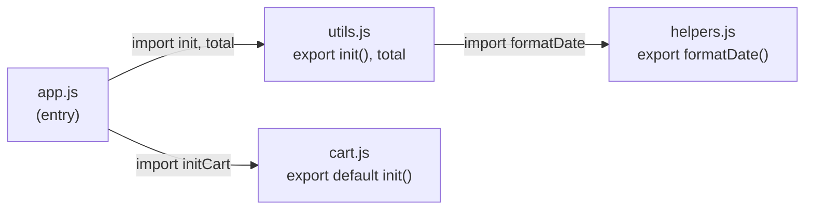

# Modules: CommonJS vs ES Modules

**Module** (mô-đun — một file code độc lập có thể chia sẻ cho file khác) giúp bạn tách chương trình thành nhiều phần nhỏ, mỗi phần lo một việc và có thể tái sử dụng. JavaScript có hai cách viết module phổ biến: **CommonJS** (chuẩn cũ dùng `require` và `module.exports`, thường gặp trong Node.js) và **ES Modules** (chuẩn hiện đại dùng `import` và `export`). Bài này giúp người mới hiểu vì sao cần chia code thành module và khác biệt giữa hai chuẩn này.

---

:::note[Ghi nhớ nhanh]

- ⭐ **ES Modules (`import`/`export`)** — mỗi file có scope riêng (không làm bẩn global), phụ thuộc khai báo tường minh; là chuẩn hiện đại năm 2026.
- **CommonJS (`require`/`module.exports`)** — chuẩn cũ của Node.js: đồng bộ, dynamic (chạy runtime), có cache.
- **Đặc điểm ESM** — `static` (top-level), async, `strict mode` mặc định và **live binding** (export là tham chiếu live, không phải copy như CJS).
- **Default vs Named export** — named dễ grep/refactor/tree-shaking (khuyên dùng cho lib/util); default hợp component chính của file.
- ⭐ **Dynamic `import()`** — trả Promise, load module runtime để lazy load / code splitting; cũng là cách import ESM từ CJS (tránh `ERR_REQUIRE_ESM`).

:::

---

## Mục lục

- [Vì sao module ra đời?](#vì-sao-module-ra-đời)
- [Lịch sử module trong JS](#lịch-sử-module-trong-js)
- [CommonJS (CJS)](#commonjs-cjs)
- [ES Modules (ESM)](#es-modules-esm)
- [Default vs Named export](#default-vs-named-export)
- [Dynamic import](#dynamic-import)
- [Interop CJS và ESM](#interop-cjs-và-esm)
- [Câu hỏi phỏng vấn](#câu-hỏi-phỏng-vấn)

---

## Vì sao module ra đời?

**Vấn đề:** Trước đây nhiều file `<script>` cùng nhét biến/hàm vào **global scope**, dễ đụng độ tên giữa các file:

```js
// utils.js — load qua <script>
var total = 0;
function init() { /* ... */ }

// cart.js — load qua <script> sau utils.js
var total = 100;            // ghi đè total của utils.js!
function init() { /* ... */ } // ghi đè luôn init() ở trên

// app.js
init();   // gọi nhầm init() nào? tuỳ thứ tự load <script>
```

Phải tự xếp thứ tự `<script>` cho đúng, khó biết file nào phụ thuộc file nào. Người ta workaround bằng **IIFE + namespace object** (gói code trong một biến global duy nhất), rồi **CommonJS** (`require`) cho Node.

**Giải pháp:** **ES Modules** (ES6) — mỗi file là một module có **scope riêng**, không làm bẩn global. Dùng `export` để chia sẻ, `import` để khai báo phụ thuộc rõ ràng:

```js
// utils.js
export let total = 0;            // named export
export function init() { /* ... */ }

// cart.js
export let total = 100;          // không đụng total của utils.js
export default function init() { /* ... */ } // default export

// app.js
import { init as initUtils, total } from "./utils.js";
import initCart from "./cart.js";

initUtils(); // rõ ràng gọi cái nào
initCart();
```

Nhờ `import`/`export`, quan hệ phụ thuộc giữa các file trở nên **tường minh** — nhìn vào là biết file nào cần file nào (đồ thị phụ thuộc):



Mỗi module có scope riêng nên không còn đụng tên; phụ thuộc khai báo tường minh; ESM luôn chạy ở **strict mode**; và bundler có thể **tree-shaking** (loại bỏ code không dùng khi build).

:::tip[Dùng thực tế]

- **Tách code theo chức năng** — mỗi tính năng một file (`auth.js`, `cart.js`...), dễ đọc, dễ test.
- **Tái sử dụng util giữa các project** — viết `formatDate` một lần rồi `import` ở nhiều nơi.
- **Import thư viện npm** — `import axios from "axios"` thay vì gắn thẻ `<script>` toàn cục.
- **Lazy load (dynamic import)** — `await import("./Heavy.js")` để chia nhỏ bundle, chỉ tải khi cần.

:::

---

## Lịch sử module trong JS

JavaScript ban đầu **không có module** — mọi file share global namespace.

Các giải pháp lần lượt:

- **CommonJS** (2009) — chuẩn của Node.js (`require`/`module.exports`).
- **AMD** (2011) — async loading cho browser (RequireJS).
- **UMD** (2014) — tương thích cả CJS và AMD.
- **ES Modules** (2015) — chuẩn chính thức của ECMAScript.

Năm 2026, **ES Modules thắng**. CommonJS vẫn dùng trong Node legacy.

---

## CommonJS (CJS)

Cú pháp của Node.js cổ điển:

```js
// math.js
function add(a, b) { return a + b; }
const PI = 3.14;

module.exports = { add, PI };
// hoặc
exports.add = add;
exports.PI = PI;
```

```js
// app.js
const { add, PI } = require("./math");
const math = require("./math");

add(1, 2);
math.PI;
```

Đặc điểm:

- **Đồng bộ** — `require` chặn thread đến khi load xong.
- **Dynamic** — `require()` chạy tại runtime, có thể conditional.
- **Có cached** — module chỉ load 1 lần.

---

## ES Modules (ESM)

Cú pháp chuẩn từ ES6:

```js
// math.js
export function add(a, b) { return a + b; }
export const PI = 3.14;

export default function multiply(a, b) { return a * b; }
```

```js
// app.js
import multiply, { add, PI } from "./math.js";
import * as math from "./math.js";

add(1, 2);
math.PI;
```

Đặc điểm:

- **Static** — `import`/`export` phải ở top-level, không trong `if`/`for`.
- **Async** — module được parse trước, load song song.
- **Strict mode** mặc định.
- **Live binding** — export là tham chiếu live, không phải copy.

:::info[Phân tích]

**Live binding** là khác biệt lớn so với CJS:

```js
// counter.mjs (ESM)
export let count = 0;
export function inc() { count++; }
```

```js
// app.mjs
import { count, inc } from "./counter.mjs";
console.log(count); // 0
inc();
console.log(count); // 1 — thay đổi reflect ngay
```

Trong CJS, value được **copy** khi require:

```js
// counter.cjs
let count = 0;
function inc() { count++; }
module.exports = { count, inc };
```

```js
// app.cjs
const { count, inc } = require("./counter.cjs");
inc();
console.log(count); // 0 — copy lúc require, không update
```

→ Khi cần share state qua module, ESM rõ ràng hơn. Hoặc dùng object
wrapper trong CJS.

:::

---

## Default vs Named export

**Named export** — đặt tên cụ thể:

```js
// utils.js
export const PI = 3.14;
export function add(a, b) { return a + b; }
export class Calc {}
```

```js
import { PI, add, Calc } from "./utils.js";
import { PI as Constant } from "./utils.js"; // rename
import * as utils from "./utils.js";
```

**Default export** — một export duy nhất, không tên:

```js
// User.js
export default class User {}
```

```js
import User from "./User.js";       // tên do caller chọn
import MyUser from "./User.js";     // OK luôn
```

Có thể trộn cả hai:

```js
// api.js
export default fetch;
export const BASE_URL = "/api";
export function get(url) {}
```

```js
import fetch, { BASE_URL, get } from "./api.js";
```

:::warning[Cần lưu ý]

**Default export không tốt khi nào?**

- **Rename không nhất quán** — mỗi file dùng tên khác → khó grep.
- **Refactor khó hơn** — đổi tên class/function không tự sync vào caller.
- **Re-export verbose hơn**:

```js
// Named — gọn
export { default as Button } from "./Button.js";
export * from "./utils.js";

// Default — phải gán tên lại
export { default as Header } from "./Header.js";
```

Nhiều style guide (Airbnb, Google) khuyên **tránh default export**.
Riêng React component, default export vẫn phổ biến vì 1 component / file.

Quy tắc thực dụng:

- Library/util — **named** (lib có nhiều export).
- Component/class chính của file — **default**.
- Nhất quán trong codebase.

:::

---

## Dynamic import

`import()` trả Promise — load module **runtime**:

```js
async function loadLodash() {
  const { default: _ } = await import("lodash");
  return _;
}

// Code splitting trong React
const LazyComponent = React.lazy(() => import("./Heavy.js"));
```

Conditional:

```js
if (userWantsAdvancedMode) {
  const { advancedFeature } = await import("./advanced.js");
  advancedFeature();
}
```

`import.meta` — metadata về module hiện tại:

```js
console.log(import.meta.url);   // URL của file
console.log(import.meta.env);   // env vars (Vite, Bun)
```

---

## Interop CJS và ESM

Vấn đề: 80% npm package từng là CJS, chuyển dần sang ESM.

Trong Node.js, **`package.json`** quyết định module format:

```json
{
  "type": "module"  // file .js → ESM
}
```

Hoặc dùng đuôi rõ ràng:

- `.mjs` — ESM
- `.cjs` — CommonJS
- `.js` — theo `"type"` trong `package.json`

**Import CJS từ ESM** — thường OK:

```js
import express from "express";       // default
import { Router } from "express";    // có thể không hoạt động
```

**Import ESM từ CJS** — **chỉ qua dynamic import**:

```js
// app.cjs
const lib = await import("esm-only-lib"); // OK
const lib = require("esm-only-lib"); // ERR_REQUIRE_ESM
```

:::info[Phân tích]

**ERR_REQUIRE_ESM** là lỗi gặp khi:

1. Package mới publish chỉ ESM (vd `node-fetch` v3, `chalk` v5).
2. Code bạn vẫn CJS.

Cách xử lý:

**1. Migrate sang ESM** (khuyến nghị):

```json
// package.json
{ "type": "module" }
```

Phải đổi: `require` → `import`, `__dirname` → `import.meta.url`, etc.

**2. Pin version cũ của package**:

```bash
npm install chalk@4  # CJS-compatible
```

**3. Dynamic import trong CJS**:

```js
async function main() {
  const { default: chalk } = await import("chalk");
  console.log(chalk.red("error"));
}
```

Node.js 22+ có **`--experimental-require-module`** cho phép `require()`
ESM trong một số trường hợp. Đang dần ổn định trong các bản gần đây.

:::

:::tip[Mẹo]

**Cho project mới năm 2026 — luôn ESM**:

```json
{
  "type": "module",
  "exports": {
    ".": {
      "import": "./dist/index.js",
      "types": "./dist/index.d.ts"
    }
  }
}
```

Tránh CJS trừ khi:
- Maintain library cũ.
- Target Node version rất cũ (≤ 12).

Bundler hiện đại (Vite, esbuild, Rollup) đều output cả ESM và CJS nếu
publish thư viện — đảm bảo tương thích cả hai phía.

:::

---

## Câu hỏi phỏng vấn

Những câu thường gặp về chủ đề này. Tự trả lời trước, rồi đối chiếu lại với nội dung phía trên.

1. Trước khi có module, code JS gặp vấn đề gì với global scope? Người ta workaround bằng `IIFE` và namespace ra sao?
2. So sánh `CommonJS` và `ES Modules` về cú pháp, thời điểm resolve, và tính đồng bộ/bất đồng bộ.
3. "Static" của ESM nghĩa là gì? Vì sao `import` không đặt được trong `if` hay trong hàm?
4. `Live binding` là gì? Cho ví dụ cùng một biến `count` hành xử khác nhau giữa CJS và ESM, và giải thích vì sao.
5. Module trong Node có được cache không? Điều gì xảy ra khi hai file cùng `require` một module có side effect?
6. `Tree shaking` là gì? Vì sao CommonJS gần như không tree-shake được còn ESM thì được?
7. Ngoài cú pháp static, còn yếu tố nào cản `tree shaking`? Trường `sideEffects` trong `package.json` dùng để làm gì?
8. Default export và named export đánh đổi ra sao về refactor, grep, auto-import của IDE và tree shaking?
9. Vì sao nhiều style guide khuyên tránh default export, nhưng React component lại thường dùng default? Bạn chọn quy ước nào cho team?
10. `import()` động trả về gì? Bạn dùng nó cho `code splitting` và lazy load trong React như thế nào?
11. `import.meta` chứa những gì? Trong ESM muốn lấy `__dirname` thì làm cách nào?
12. Node quyết định một file `.js` là CJS hay ESM dựa vào đâu? `.mjs` và `.cjs` khác gì?
13. `ERR_REQUIRE_ESM` xảy ra khi nào? Nêu ít nhất ba cách xử lý và đánh đổi của từng cách.
14. Import named từ một package CJS trong ESM đôi khi thất bại — vì sao? Cách khắc phục?
15. Trường `exports` trong `package.json` dùng để làm gì? Vì sao publish cả ESM lẫn CJS dễ gây `dual package hazard`?
16. `Circular dependency` được CJS và ESM xử lý khác nhau ra sao? Hệ quả nhìn thấy trong code là gì?
17. Mô tả các pha nạp ESM (`construction`, `instantiation`, `evaluation`). Việc `import` được hoisting ảnh hưởng thứ tự chạy code thế nào?
