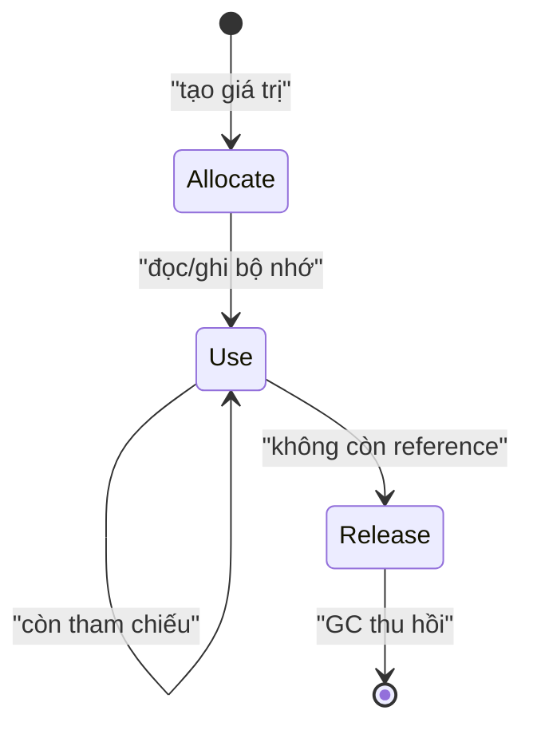
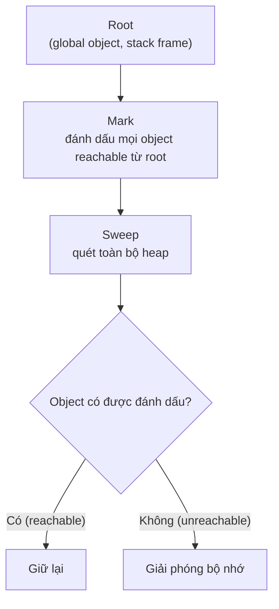

# Memory Management

**Memory Management** (quản lý bộ nhớ — cách chương trình cấp phát và thu hồi vùng nhớ) là việc JavaScript tự lo lượng bộ nhớ mà code của bạn sử dụng khi tạo biến, đối tượng hay hàm. JavaScript có **Garbage Collector** (bộ thu gom rác — tự động giải phóng vùng nhớ không còn dùng tới), nên bạn không phải xoá bộ nhớ thủ công như một số ngôn ngữ khác. Bài này giúp người mới hiểu bộ nhớ được cấp phát và giải phóng ra sao, cũng như cách tránh **memory leak** (rò rỉ bộ nhớ — bộ nhớ không được giải phóng dù không còn cần).

---

## Mục lục

- [Vì sao cần hiểu quản lý bộ nhớ?](#vì-sao-cần-hiểu-quản-lý-bộ-nhớ)
- [Memory Lifecycle](#memory-lifecycle)
- [Stack vs Heap](#stack-vs-heap)
- [Garbage Collection](#garbage-collection)
- [Reference Counting vs Mark-and-Sweep](#reference-counting-vs-mark-and-sweep)
- [Memory Leaks](#memory-leaks)

---

## Vì sao cần hiểu quản lý bộ nhớ?

**Vấn đề:**

```js
// Trong ngôn ngữ cấp thấp (C), bạn TỰ cấp phát và giải phóng:
//   int* p = malloc(sizeof(int) * 1000);  // cấp phát
//   free(p);                              // QUÊN free → memory leak
//   *p = 1;                               // dùng sau free → crash

// Ngay cả khi JS tự lo, bạn vẫn vô tình GIỮ tham chiếu khiến
// bộ nhớ KHÔNG bao giờ được thu hồi:
const data = loadHugeData();
setInterval(() => process(data), 1000); // timer + closure giữ data mãi
document.body.addEventListener("scroll", onScroll); // listener không gỡ
// → web chạy lâu dần phình RAM, chậm dần, có thể crash tab
```

**Giải pháp:**

```js
// JS có GARBAGE COLLECTOR tự thu hồi object KHÔNG còn ai tham chiếu
// (thuật toán mark-and-sweep). Hiểu cơ chế giúp chủ động tránh leak:

const id = setInterval(tick, 1000);
clearInterval(id); // gỡ timer khi không cần

function onScroll() {}
el.addEventListener("scroll", onScroll);
el.removeEventListener("scroll", onScroll); // gỡ listener

// tránh biến global "sống mãi"; dùng tham chiếu yếu cho metadata
const cache = new WeakMap(); // entry tự dọn khi object hết reference
```

:::tip[Dùng thực tế]

- **Component unmount**: gỡ `removeEventListener` (hoặc `AbortController`) khi component bị tháo, tránh listener trỏ vào DOM/node đã chết.
- **Timer/animation**: `clearInterval` / `clearTimeout` / `cancelAnimationFrame` khi rời màn hình, tránh closure giữ dữ liệu to.
- **Cache phình to**: giới hạn kích thước cache (LRU) hoặc dùng `WeakMap` để không cản GC.
- **Metadata theo object**: lưu bằng `WeakMap` (key là object) — khi object bị thu hồi, metadata tự biến mất.

:::

---

## Memory Lifecycle

Mọi ngôn ngữ đều qua 3 giai đoạn quản lý bộ nhớ:

1. **Allocate** — cấp phát bộ nhớ khi tạo giá trị.
2. **Use** — đọc/ghi bộ nhớ.
3. **Release** — giải phóng khi không cần.

JavaScript là **garbage-collected language** — bước 1 và 3 **tự động**.
Dev không có `malloc`/`free` như C, nhưng vẫn có thể tạo leak nếu không
hiểu cơ chế.



---

## Stack vs Heap

JS Engine chia bộ nhớ làm hai vùng với cách hoạt động khác nhau:

- **Stack** (ngăn xếp — vùng nhớ kiểu "vào sau ra trước", LIFO): lưu các giá
  trị có **kích thước cố định, biết trước** — các **primitive** (`number`,
  `string`, `boolean`, `null`, `undefined`, `symbol`, `bigint`) và **function
  frame** (khung hàm — vùng chứa biến cục bộ của mỗi lần gọi hàm). Cấp phát/thu
  hồi chỉ là **push/pop** nên cực nhanh.
- **Heap** (vùng nhớ động — kho lớn, không theo thứ tự): lưu các giá trị **kích
  thước thay đổi, lớn** — `object`, `array`, và phần thân của function. Cấp phát
  ở đâu tuỳ engine, và phải nhờ **GC** dọn dẹp về sau.

| | Stack | Heap |
|--|-------|------|
| Lưu | Primitive, function frame | Object, Array, Function body |
| Kích thước | Cố định, nhỏ | Linh hoạt, lớn |
| Truy cập | Bằng giá trị (by value) | Bằng tham chiếu (by reference) |
| Tốc độ | Nhanh | Chậm hơn |
| Quản lý | Tự động (push/pop) | GC |

### Primitive nằm trên stack

Primitive được lưu **trực tiếp** trên stack. Khi gán cho biến khác, giá trị được
**copy hẳn** — hai biến độc lập, sửa cái này không ảnh hưởng cái kia:

```js
let x = 10;
let y = x; // copy GIÁ TRỊ 10 sang ô nhớ mới của y

y = 20;
x; // 10 — x không đổi vì y là bản sao độc lập
```

### Object nằm trên heap, biến giữ pointer

Với object, biến trên stack chỉ chứa **pointer** (con trỏ — địa chỉ tới object
nằm trên heap), không chứa bản thân object:

```js
const name = "An";
let user = { name };  // biến `user` ở stack — chỉ giữ pointer
                      // { name: "An" } nằm ở heap
```

```text
   STACK                 HEAP
 ┌─────────┐          ┌──────────────┐
 │ user ───┼────────► │ { name:"An" }│
 └─────────┘          └──────────────┘
```

Vì biến chỉ giữ pointer nên khi gán biến này cho biến khác, ta **copy pointer,
KHÔNG copy object** — cả hai cùng trỏ tới **một** object trên heap:

```js
const a = { x: 1 };
const b = a; // b copy POINTER, không copy object

b.x = 2;
a.x; // 2 — a và b cùng trỏ tới một object trên heap
```

Đây cũng là lý do so sánh hai object luôn cho `false` nếu chúng là hai object
khác nhau trên heap — vì `===` so sánh **pointer**, không so sánh nội dung:

```js
{ x: 1 } === { x: 1 }; // false — hai object khác nhau trên heap
const c = a;
c === a;               // true — cùng một pointer
```

:::info[Phân tích]

**Vì sao primitive ở stack, object ở heap?**

Stack hoạt động theo nguyên tắc LIFO và cần **biết trước kích thước** của mỗi ô
để push/pop chính xác. Primitive có kích thước cố định (một số `number` luôn 8
byte) nên hợp với stack. Object/array có thể phình to tuỳ ý lúc chạy (thêm
property, push phần tử) → không thể đặt cố định trên stack → phải nằm ở heap, nơi
cấp phát linh hoạt.

**Hệ quả thực tế cần nhớ:**

- **Copy nông (shallow copy)**: `{ ...obj }` hay `[...arr]` chỉ copy pointer ở
  tầng đầu. Object lồng bên trong vẫn dùng chung pointer → sửa object con sẽ ảnh
  hưởng cả bản gốc. Cần **deep copy** (`structuredClone(obj)`) khi muốn tách hẳn.
- **Truyền tham số**: truyền object vào hàm là truyền pointer → hàm sửa property
  của object sẽ ảnh hưởng bên ngoài (theo nguyên tắc immutability nên trả về
  object mới thay vì mutate).
- **String "to" vẫn là primitive**: dù chuỗi dài, JS vẫn coi là giá trị bất biến
  (immutable); engine có tối ưu lưu trữ riêng nhưng về mặt ngữ nghĩa nó so sánh
  by value.

:::

---

## Garbage Collection

GC quét heap, tìm object **không còn ai dùng** và giải phóng.

**Reachability** = tiêu chí GC. Một object **reachable** nếu:

- Là **root** (global object, current stack frame).
- Được tham chiếu từ object reachable khác.

```js
let user = { name: "An" };
// { name: "An" } reachable qua biến user

user = null;
// { name: "An" } không còn reference nào → GC sẽ dọn
```

:::info[Phân tích]

**V8 dùng Generational GC** — chia object thành 2 thế hệ:

1. **Young generation (Nursery)** — object mới, GC chạy thường xuyên,
   nhanh. Object sống sót sau vài lần GC → chuyển sang old.
2. **Old generation** — object sống lâu, GC chạy ít hơn, chậm hơn (full GC).

Lý do: thực nghiệm chỉ ra **đa số object chết trẻ** (vd biến tạm trong
function). Tối ưu cho case này → throughput tổng tốt hơn.

GC trong V8 dùng nhiều thuật toán:

- **Scavenger** (young) — copy object còn sống sang vùng mới, dọn nguyên
  vùng cũ.
- **Mark-Compact** (old) — đánh dấu reachable, dồn các object liền nhau.
- **Concurrent / Incremental** — chạy song song với JS để giảm pause.

Trong code app, không cần biết chi tiết — nhưng hiểu cơ chế giúp viết
code "GC-friendly" (không tạo nhiều object short-lived khi không cần,
tránh giữ tham chiếu không cần thiết).

:::

---

## Reference Counting vs Mark-and-Sweep

**Reference Counting** (cũ, Python, Swift dùng):

- Mỗi object có **counter** số reference đang trỏ tới.
- Counter = 0 → giải phóng ngay.
- **Vấn đề**: không xử lý được **circular reference**.

```js
let a = { ref: null };
let b = { ref: null };
a.ref = b;
b.ref = a;
a = null;
b = null;
// Cả hai vẫn ref nhau → counter > 0 → leak (nếu dùng RC)
```

**Mark-and-Sweep** (JS hiện đại):

- Xuất phát từ root, **đánh dấu** tất cả object reachable.
- **Quét** heap, giải phóng object không đánh dấu.
- **Xử lý được circular** — nếu cả hai đều không reachable từ root.

```js
let a = { ref: null };
let b = { ref: null };
a.ref = b;
b.ref = a;
a = null;
b = null;
// Không reachable từ root → GC dọn cả hai
```

Có thể hình dung một chu kỳ Mark-and-Sweep gồm hai pha: **Mark** (đánh dấu mọi object còn reachable xuất phát từ root) rồi **Sweep** (quét heap, giải phóng object không được đánh dấu):



V8 (Chrome, Node, Edge) và SpiderMonkey (Firefox) đều dùng Mark-and-Sweep.

---

## Memory Leaks

Leak xảy ra khi object **không cần nữa** nhưng vẫn **reachable** → GC
không dọn được.

**1. Global biến vô tình:**

```js
function leak() {
  count = 100; // không có let/const → tạo global biến
}

leak(); // window.count tồn tại mãi
```

Fix: bật `"use strict"`, dùng `let`/`const`.

**2. Forgotten timer:**

```js
const data = loadHugeData();
setInterval(() => {
  process(data); // data bị giữ mãi
}, 1000);
```

Fix: `clearInterval` khi không cần.

**3. Event listener không remove:**

```js
function setup() {
  const node = document.getElementById("btn");
  node.addEventListener("click", () => {
    console.log(node.dataset); // closure giữ node
  });
}
// Nếu node bị remove khỏi DOM nhưng listener còn → leak
```

Fix: `removeEventListener` hoặc `AbortController`.

**4. Closure giữ biến to:**

```js
function outer() {
  const huge = new Array(1000000).fill(0);
  return function inner() {
    return 1; // không dùng huge, nhưng closure vẫn giữ
  };
}

const fn = outer();
// huge không bao giờ GC vì fn vẫn sống
```

Fix: tách closure, gán biến to thành `null` khi không cần.

**5. Detached DOM node:**

```js
const list = [];
function add() {
  const div = document.createElement("div");
  list.push(div);    // giữ reference
  document.body.appendChild(div);
}

document.body.innerHTML = ""; // xoá DOM nhưng list còn ref → leak
```

:::warning[Cần lưu ý]

**Debug memory leak** với Chrome DevTools:

1. **Performance Monitor** — theo dõi JS heap size real-time. Heap
   liên tục tăng = leak.

2. **Heap Snapshot** — chụp ảnh heap, so sánh giữa các điểm:
   - "Take snapshot" trước thao tác.
   - Làm action lặp đi lặp lại (vd open/close modal 10 lần).
   - Take snapshot tiếp.
   - "Comparison" → tìm object increase liên tục.

3. **Allocation Timeline** — record period, xem object nào được tạo
   nhiều nhất.

Pattern phổ biến gây leak trong React app:

- `useEffect` không cleanup subscription.
- Global state lưu reference component đã unmount.
- Closure trong `setInterval`/`setTimeout` không clear.
- WebSocket / SSE không đóng kết nối.

:::

:::tip[Mẹo]

**`WeakMap` / `WeakSet`** giúp tránh leak khi gắn metadata vào object
có lifecycle riêng:

```js
// Tệ — Map giữ DOM node mãi
const meta = new Map();
function track(node) {
  meta.set(node, { lastSeen: Date.now() });
}

// Tốt — WeakMap không cản GC
const meta = new WeakMap();
function track(node) {
  meta.set(node, { lastSeen: Date.now() });
}
// Khi node bị remove khỏi DOM, meta entry tự dọn
```

**`FinalizationRegistry`** (ES2021) — chạy callback khi object bị GC:

```js
const reg = new FinalizationRegistry((heldValue) => {
  console.log("Cleanup:", heldValue);
});

let obj = {};
reg.register(obj, "obj id");

obj = null; // sau khi GC chạy → log "Cleanup: obj id"
```

Dùng cho native resource (file handle, socket). **Không** đảm bảo chạy
ngay — chỉ chạy "khi nào GC quyết định".

:::
