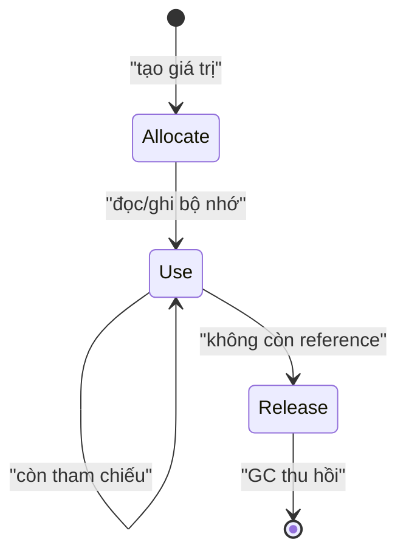
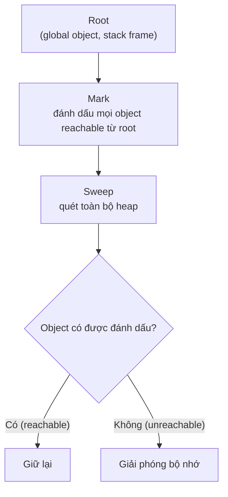

# Memory Management

**Memory Management** (quản lý bộ nhớ — cách chương trình cấp phát và thu hồi vùng nhớ) là việc JavaScript tự lo lượng bộ nhớ mà code của bạn sử dụng khi tạo biến, đối tượng hay hàm. JavaScript có **Garbage Collector** (bộ thu gom rác — tự động giải phóng vùng nhớ không còn dùng tới), nên bạn không phải xoá bộ nhớ thủ công như một số ngôn ngữ khác. Bài này giúp người mới hiểu bộ nhớ được cấp phát và giải phóng ra sao, cũng như cách tránh **memory leak** (rò rỉ bộ nhớ — bộ nhớ không được giải phóng dù không còn cần).

[](pathname:///img/javascript/memory.webp)

---

:::note[Ghi nhớ nhanh]

- ⭐ **Garbage Collector (mark-and-sweep)** — JS tự thu hồi object không còn **reachable** từ root; dev không có `malloc`/`free` như C nhưng vẫn có thể tạo leak.
- **Stack vs Heap** — primitive lưu trực tiếp trên stack (copy by value); object nằm trên heap còn biến chỉ giữ **pointer** (copy by reference), nên `===` so sánh pointer.
- ⭐ **Memory leak** — object không cần nữa nhưng vẫn reachable: global vô tình, timer/listener quên gỡ, closure giữ biến to, detached DOM node.
- **Cách tránh leak** — `clearInterval`, `removeEventListener` (hoặc `AbortController`), giới hạn cache và dùng `WeakMap`/`WeakSet` (không cản GC).
- **Reference counting vs mark-and-sweep** — reference counting kẹt ở **circular reference**; mark-and-sweep xử lý được vì xét reachability từ root.

:::

---

## Mục lục

- [Vì sao cần hiểu quản lý bộ nhớ?](#vì-sao-cần-hiểu-quản-lý-bộ-nhớ)
- [Memory Lifecycle](#memory-lifecycle)
- [Stack vs Heap](#stack-vs-heap)
- [Garbage Collection](#garbage-collection)
- [Reference Counting vs Mark-and-Sweep](#reference-counting-vs-mark-and-sweep)
- [Memory Leaks](#memory-leaks)
- [Câu hỏi phỏng vấn](#câu-hỏi-phỏng-vấn)

---

## Vì sao cần hiểu quản lý bộ nhớ?

**Vấn đề:**

```js
// Trong ngôn ngữ cấp thấp (C), bạn TỰ cấp phát và giải phóng:
//   int* p = malloc(sizeof(int) * 1000);  // cấp phát
//   free(p);                              // QUÊN free → memory leak
//   *p = 1;                               // dùng sau free → crash

// Ngay cả khi JS tự lo, bạn vẫn vô tình GIỮ tham chiếu khiến
// bộ nhớ KHÔNG bao giờ được thu hồi:
const data = loadHugeData();
setInterval(() => process(data), 1000); // timer + closure giữ data mãi
document.body.addEventListener("scroll", onScroll); // listener không gỡ
// → web chạy lâu dần phình RAM, chậm dần, có thể crash tab
```

**Giải pháp:**

```js
// JS có GARBAGE COLLECTOR tự thu hồi object KHÔNG còn ai tham chiếu
// (thuật toán mark-and-sweep). Hiểu cơ chế giúp chủ động tránh leak:

const id = setInterval(tick, 1000);
clearInterval(id); // gỡ timer khi không cần

function onScroll() {}
el.addEventListener("scroll", onScroll);
el.removeEventListener("scroll", onScroll); // gỡ listener

// tránh biến global "sống mãi"; dùng tham chiếu yếu cho metadata
const cache = new WeakMap(); // entry tự dọn khi object hết reference
```

:::tip[Dùng thực tế]

- **Component unmount**: gỡ `removeEventListener` (hoặc `AbortController`) khi component bị tháo, tránh listener trỏ vào DOM/node đã chết.
- **Timer/animation**: `clearInterval` / `clearTimeout` / `cancelAnimationFrame` khi rời màn hình, tránh closure giữ dữ liệu to.
- **Cache phình to**: giới hạn kích thước cache (LRU) hoặc dùng `WeakMap` để không cản GC.
- **Metadata theo object**: lưu bằng `WeakMap` (key là object) — khi object bị thu hồi, metadata tự biến mất.

:::

---

## Memory Lifecycle

Mọi ngôn ngữ đều qua 3 giai đoạn quản lý bộ nhớ:

1. **Allocate** — cấp phát bộ nhớ khi tạo giá trị.
2. **Use** — đọc/ghi bộ nhớ.
3. **Release** — giải phóng khi không cần.

JavaScript là **garbage-collected language** — bước 1 và 3 **tự động**.
Dev không có `malloc`/`free` như C, nhưng vẫn có thể tạo leak nếu không
hiểu cơ chế.



---

## Stack vs Heap

JS Engine chia bộ nhớ làm hai vùng với cách hoạt động khác nhau:

- **Stack** (ngăn xếp — vùng nhớ kiểu "vào sau ra trước", LIFO): lưu các giá
  trị có **kích thước cố định, biết trước** — các **primitive** (`number`,
  `string`, `boolean`, `null`, `undefined`, `symbol`, `bigint`) và **function
  frame** (khung hàm — vùng chứa biến cục bộ của mỗi lần gọi hàm). Cấp phát/thu
  hồi chỉ là **push/pop** nên cực nhanh.
- **Heap** (vùng nhớ động — kho lớn, không theo thứ tự): lưu các giá trị **kích
  thước thay đổi, lớn** — `object`, `array`, và phần thân của function. Cấp phát
  ở đâu tuỳ engine, và phải nhờ **GC** dọn dẹp về sau.

| | Stack | Heap |
|--|-------|------|
| Lưu | Primitive, function frame | Object, Array, Function body |
| Kích thước | Cố định, nhỏ | Linh hoạt, lớn |
| Truy cập | Bằng giá trị (by value) | Bằng tham chiếu (by reference) |
| Tốc độ | Nhanh | Chậm hơn |
| Quản lý | Tự động (push/pop) | GC |

### Primitive nằm trên stack

Primitive được lưu **trực tiếp** trên stack. Khi gán cho biến khác, giá trị được
**copy hẳn** — hai biến độc lập, sửa cái này không ảnh hưởng cái kia:

```js
let x = 10;
let y = x; // copy GIÁ TRỊ 10 sang ô nhớ mới của y

y = 20;
x; // 10 — x không đổi vì y là bản sao độc lập
```

### Object nằm trên heap, biến giữ pointer

Với object, biến trên stack chỉ chứa **pointer** (con trỏ — địa chỉ tới object
nằm trên heap), không chứa bản thân object:

```js
const name = "An";
let user = { name };  // biến `user` ở stack — chỉ giữ pointer
                      // { name: "An" } nằm ở heap
```

```text
   STACK                 HEAP
 ┌─────────┐          ┌──────────────┐
 │ user ───┼────────► │ { name:"An" }│
 └─────────┘          └──────────────┘
```

Vì biến chỉ giữ pointer nên khi gán biến này cho biến khác, ta **copy pointer,
KHÔNG copy object** — cả hai cùng trỏ tới **một** object trên heap:

```js
const a = { x: 1 };
const b = a; // b copy POINTER, không copy object

b.x = 2;
a.x; // 2 — a và b cùng trỏ tới một object trên heap
```

Đây cũng là lý do so sánh hai object luôn cho `false` nếu chúng là hai object
khác nhau trên heap — vì `===` so sánh **pointer**, không so sánh nội dung:

```js
{ x: 1 } === { x: 1 }; // false — hai object khác nhau trên heap
const c = a;
c === a;               // true — cùng một pointer
```

:::info[Phân tích]

**Vì sao primitive ở stack, object ở heap?**

Stack hoạt động theo nguyên tắc LIFO và cần **biết trước kích thước** của mỗi ô
để push/pop chính xác. Primitive có kích thước cố định (một số `number` luôn 8
byte) nên hợp với stack. Object/array có thể phình to tuỳ ý lúc chạy (thêm
property, push phần tử) → không thể đặt cố định trên stack → phải nằm ở heap, nơi
cấp phát linh hoạt.

**Hệ quả thực tế cần nhớ:**

- **Copy nông (shallow copy)**: `{ ...obj }` hay `[...arr]` chỉ copy pointer ở
  tầng đầu. Object lồng bên trong vẫn dùng chung pointer → sửa object con sẽ ảnh
  hưởng cả bản gốc. Cần **deep copy** (`structuredClone(obj)`) khi muốn tách hẳn.
- **Truyền tham số**: truyền object vào hàm là truyền pointer → hàm sửa property
  của object sẽ ảnh hưởng bên ngoài (theo nguyên tắc immutability nên trả về
  object mới thay vì mutate).
- **String "to" vẫn là primitive**: dù chuỗi dài, JS vẫn coi là giá trị bất biến
  (immutable); engine có tối ưu lưu trữ riêng nhưng về mặt ngữ nghĩa nó so sánh
  by value.

:::

---

## Garbage Collection

GC quét heap, tìm object **không còn ai dùng** và giải phóng.

**Reachability** = tiêu chí GC. Một object **reachable** nếu:

- Là **root** (global object, current stack frame).
- Được tham chiếu từ object reachable khác.

```js
let user = { name: "An" };
// { name: "An" } reachable qua biến user

user = null;
// { name: "An" } không còn reference nào → GC sẽ dọn
```

:::info[Phân tích]

**V8 dùng Generational GC** — chia object thành 2 thế hệ:

1. **Young generation (Nursery)** — object mới, GC chạy thường xuyên,
   nhanh. Object sống sót sau vài lần GC → chuyển sang old.
2. **Old generation** — object sống lâu, GC chạy ít hơn, chậm hơn (full GC).

Lý do: thực nghiệm chỉ ra **đa số object chết trẻ** (vd biến tạm trong
function). Tối ưu cho case này → throughput tổng tốt hơn.

GC trong V8 dùng nhiều thuật toán:

- **Scavenger** (young) — copy object còn sống sang vùng mới, dọn nguyên
  vùng cũ.
- **Mark-Compact** (old) — đánh dấu reachable, dồn các object liền nhau.
- **Concurrent / Incremental** — chạy song song với JS để giảm pause.

Trong code app, không cần biết chi tiết — nhưng hiểu cơ chế giúp viết
code "GC-friendly" (không tạo nhiều object short-lived khi không cần,
tránh giữ tham chiếu không cần thiết).

:::

---

## Reference Counting vs Mark-and-Sweep

**Reference Counting** (cũ, Python, Swift dùng):

- Mỗi object có **counter** số reference đang trỏ tới.
- Counter = 0 → giải phóng ngay.
- **Vấn đề**: không xử lý được **circular reference**.

```js
let a = { ref: null };
let b = { ref: null };
a.ref = b;
b.ref = a;
a = null;
b = null;
// Cả hai vẫn ref nhau → counter > 0 → leak (nếu dùng RC)
```

**Mark-and-Sweep** (JS hiện đại):

- Xuất phát từ root, **đánh dấu** tất cả object reachable.
- **Quét** heap, giải phóng object không đánh dấu.
- **Xử lý được circular** — nếu cả hai đều không reachable từ root.

```js
let a = { ref: null };
let b = { ref: null };
a.ref = b;
b.ref = a;
a = null;
b = null;
// Không reachable từ root → GC dọn cả hai
```

Có thể hình dung một chu kỳ Mark-and-Sweep gồm hai pha: **Mark** (đánh dấu mọi object còn reachable xuất phát từ root) rồi **Sweep** (quét heap, giải phóng object không được đánh dấu):



V8 (Chrome, Node, Edge) và SpiderMonkey (Firefox) đều dùng Mark-and-Sweep.

---

## Memory Leaks

Leak xảy ra khi object **không cần nữa** nhưng vẫn **reachable** → GC
không dọn được.

**1. Global biến vô tình:**

```js
function leak() {
  count = 100; // không có let/const → tạo global biến
}

leak(); // window.count tồn tại mãi
```

Fix: bật `"use strict"`, dùng `let`/`const`.

**2. Forgotten timer:**

```js
const data = loadHugeData();
setInterval(() => {
  process(data); // data bị giữ mãi
}, 1000);
```

Fix: `clearInterval` khi không cần.

**3. Event listener không remove:**

```js
function setup() {
  const node = document.getElementById("btn");
  node.addEventListener("click", () => {
    console.log(node.dataset); // closure giữ node
  });
}
// Nếu node bị remove khỏi DOM nhưng listener còn → leak
```

Fix: `removeEventListener` hoặc `AbortController`.

**4. Closure giữ biến to:**

```js
function outer() {
  const huge = new Array(1000000).fill(0);
  return function inner() {
    return 1; // không dùng huge, nhưng closure vẫn giữ
  };
}

const fn = outer();
// huge không bao giờ GC vì fn vẫn sống
```

Fix: tách closure, gán biến to thành `null` khi không cần.

**5. Detached DOM node:**

```js
const list = [];
function add() {
  const div = document.createElement("div");
  list.push(div);    // giữ reference
  document.body.appendChild(div);
}

document.body.innerHTML = ""; // xoá DOM nhưng list còn ref → leak
```

:::warning[Cần lưu ý]

**Debug memory leak** với Chrome DevTools:

1. **Performance Monitor** — theo dõi JS heap size real-time. Heap
   liên tục tăng = leak.

2. **Heap Snapshot** — chụp ảnh heap, so sánh giữa các điểm:
   - "Take snapshot" trước thao tác.
   - Làm action lặp đi lặp lại (vd open/close modal 10 lần).
   - Take snapshot tiếp.
   - "Comparison" → tìm object increase liên tục.

3. **Allocation Timeline** — record period, xem object nào được tạo
   nhiều nhất.

Pattern phổ biến gây leak trong React app:

- `useEffect` không cleanup subscription.
- Global state lưu reference component đã unmount.
- Closure trong `setInterval`/`setTimeout` không clear.
- WebSocket / SSE không đóng kết nối.

:::

:::tip[Mẹo]

**`WeakMap` / `WeakSet`** giúp tránh leak khi gắn metadata vào object
có lifecycle riêng:

```js
// Tệ — Map giữ DOM node mãi
const meta = new Map();
function track(node) {
  meta.set(node, { lastSeen: Date.now() });
}

// Tốt — WeakMap không cản GC
const meta = new WeakMap();
function track(node) {
  meta.set(node, { lastSeen: Date.now() });
}
// Khi node bị remove khỏi DOM, meta entry tự dọn
```

**`FinalizationRegistry`** (ES2021) — chạy callback khi object bị GC:

```js
const reg = new FinalizationRegistry((heldValue) => {
  console.log("Cleanup:", heldValue);
});

let obj = {};
reg.register(obj, "obj id");

obj = null; // sau khi GC chạy → log "Cleanup: obj id"
```

Dùng cho native resource (file handle, socket). **Không** đảm bảo chạy
ngay — chỉ chạy "khi nào GC quyết định".

:::

---

## Câu hỏi phỏng vấn

Những câu thường gặp về chủ đề này. Tự trả lời trước, rồi bấm **Xem đáp án** để đối chiếu.

**1. Vòng đời bộ nhớ trong JS gồm những giai đoạn nào? Lập trình viên can thiệp được ở giai đoạn nào?**

<details className="qa">
<summary>Xem đáp án</summary>

Mọi ngôn ngữ đều đi qua ba giai đoạn:

- **Allocate** — cấp phát bộ nhớ khi tạo giá trị (khai báo biến, tạo object, gọi hàm).
- **Use** — đọc/ghi vùng nhớ đó.
- **Release** — giải phóng khi không cần nữa.

JavaScript là **garbage-collected language**, nên bước 1 và 3 **tự động**: không có `malloc`/`free` như C, không có API nào để ép giải phóng một object cụ thể.

Lập trình viên chỉ thực sự can thiệp ở bước **Use** — cụ thể là **quản lý tham chiếu**. GC quyết định thu hồi dựa trên reachability, mà reachability lại do code của bạn tạo ra: giữ hay buông một reference chính là "ra lệnh" gián tiếp cho GC.

```js
let data = loadHugeData();
data = null;   // buông reference → GC đủ điều kiện dọn
```

Vì vậy tránh leak không phải là "gọi lệnh giải phóng" mà là **cắt đúng các sợi dây còn níu object**: `clearInterval`, `removeEventListener`, giới hạn cache, không tạo biến global vô tình.

</details>

**2. `Stack` và `heap` khác nhau thế nào? Cái gì lưu ở đâu và vì sao lại chia như vậy?**

<details className="qa">
<summary>Xem đáp án</summary>

| | Stack | Heap |
|---|---|---|
| Lưu gì | Primitive (`number`, `string`, `boolean`, `null`, `undefined`, `symbol`, `bigint`) và function frame | Object, Array, Function body |
| Kích thước | Cố định, biết trước, nhỏ | Linh hoạt, thay đổi lúc chạy, lớn |
| Truy cập | Bằng giá trị (by value) | Bằng tham chiếu (by reference) |
| Tốc độ | Rất nhanh — chỉ push/pop | Chậm hơn |
| Thu hồi | Tự động khi hàm kết thúc (pop) | Do GC |

Lý do chia: stack hoạt động theo LIFO nên phải **biết trước kích thước từng ô** mới push/pop chính xác được. Primitive có kích thước cố định nên hợp với stack. Còn object/array có thể phình ra tuỳ ý lúc chạy (thêm property, `push` phần tử) — không thể đặt cố định trên stack, phải nằm ở heap nơi cấp phát linh hoạt.

Biến trỏ tới object vẫn nằm trên stack, nhưng nó chỉ giữ **pointer** — địa chỉ tới object thật trên heap.

</details>

**3. Vì sao `{ x: 1 } === { x: 1 }` cho `false`? Giải thích theo pointer và vùng nhớ.**

<details className="qa">
<summary>Xem đáp án</summary>

Vì mỗi lần viết `{ x: 1 }`, engine **cấp phát một object mới trên heap** — hai lần viết là hai object ở hai địa chỉ khác nhau. Biến trên stack chỉ giữ **pointer** tới địa chỉ đó, và với object thì `===` so sánh **pointer chứ không so sánh nội dung**.

```js
{ x: 1 } === { x: 1 }; // false — hai địa chỉ heap khác nhau

const a = { x: 1 };
const c = a;
c === a;               // true — cùng một pointer
```

Ngược lại, primitive lưu trực tiếp giá trị trên stack nên `1 === 1` hay `"a" === "a"` đều `true` vì so sánh chính giá trị.

Hệ quả: muốn biết hai object có **nội dung** giống nhau hay không thì phải tự so sánh từng field, hoặc dùng hàm deep-equal của thư viện. Mẹo `JSON.stringify(a) === JSON.stringify(b)` chỉ đúng trong trường hợp đơn giản — nó phụ thuộc thứ tự key và làm mất `undefined`, `function`, `Date`, `Map`.

</details>

**4. `Shallow copy` và `deep copy` khác nhau ra sao? `{ ...obj }` an toàn tới đâu, khi nào cần `structuredClone`?**

<details className="qa">
<summary>Xem đáp án</summary>

**Shallow copy** chỉ sao chép **tầng đầu tiên**: property là primitive thì copy giá trị, property là object thì copy **pointer** — nghĩa là bản sao và bản gốc vẫn dùng chung object lồng bên trong.

```js
const user = { name: "An", address: { city: "HN" } };
const copy = { ...user };

copy.name = "Bình";
user.name;          // "An" — an toàn, tầng đầu đã tách

copy.address.city = "HCM";
user.address.city;  // "HCM" — vẫn chung một object!
```

**Deep copy** sao chép đệ quy toàn bộ cây, hai bên hoàn toàn độc lập.

`{ ...obj }`, `Object.assign({}, obj)`, `[...arr]` đều là shallow — an toàn khi object **phẳng** hoặc khi bạn chỉ thay tầng đầu (đúng tinh thần immutability: tạo object mới thay vì mutate). Khi dữ liệu **lồng nhiều tầng** và bạn muốn tách hẳn, dùng `structuredClone(obj)` — hàm chuẩn, xử lý được cả `Date`, `Map`, `Set` và cấu trúc vòng, nhưng không copy được `function`, `Symbol` hay DOM node.

</details>

**5. Truyền một object vào hàm là truyền theo tham chiếu hay theo giá trị? Giải thích cho thật chính xác.**

<details className="qa">
<summary>Xem đáp án</summary>

JavaScript **luôn truyền theo giá trị** — nhưng với object, cái "giá trị" được copy chính là **pointer**. Mô hình này thường gọi là *call by sharing*.

Hệ quả có hai vế:

- Hàm **sửa property** của object thì bên ngoài thấy ngay, vì cả hai pointer cùng trỏ vào một object trên heap.
- Hàm **gán lại** tham số một object mới thì bên ngoài **không đổi**, vì chỉ bản sao pointer bên trong hàm bị đổi hướng.

```js
function mutate(o) { o.x = 99; }     // sửa qua pointer
function reassign(o) { o = { x: 0 }; } // chỉ đổi bản sao pointer

const obj = { x: 1 };
mutate(obj);   obj.x; // 99
reassign(obj); obj.x; // 99 — không thành 0
```

Nếu là truyền tham chiếu thật (như `ref` trong C#), `reassign` đã đổi được biến bên ngoài.

Vì vậy, theo nguyên tắc immutability, hàm nên **trả về object mới** (`return { ...o, x: 99 }`) thay vì mutate tham số — tránh side effect ngầm cho caller.

</details>

**6. `Reachability` là gì? Khi nào một object đủ điều kiện bị `garbage collector` thu hồi?**

<details className="qa">
<summary>Xem đáp án</summary>

**Reachability** (khả năng với tới) là tiêu chí duy nhất GC dùng để quyết định giữ hay dọn một object. Một object là reachable khi:

- Nó là **root** — global object, các biến trong stack frame đang chạy, các closure còn sống.
- Hoặc nó được tham chiếu từ một object reachable khác (tính bắc cầu, đi bao nhiêu tầng cũng được).

Object **đủ điều kiện bị thu hồi** khi không còn đường đi nào từ root tới nó.

```js
let user = { name: "An" };
// reachable qua biến user

user = null;
// không còn đường từ root → GC sẽ dọn
```

Hai lưu ý quan trọng:

- "Không dùng tới nữa" **không** đồng nghĩa "không reachable". Một object bạn quên sạch nhưng vẫn nằm trong mảng global, trong closure của timer, trong Map cache thì vẫn reachable — và đó chính là định nghĩa của memory leak.
- "Đủ điều kiện" không có nghĩa là bị dọn ngay: GC chạy khi engine thấy hợp lý, thời điểm không xác định trước.

</details>

**7. So sánh `reference counting` và `mark-and-sweep`. Vì sao `circular reference` là vấn đề của cách thứ nhất?**

<details className="qa">
<summary>Xem đáp án</summary>

| | Reference counting | Mark-and-sweep |
|---|---|---|
| Cách quyết định | Mỗi object giữ một **counter** số reference trỏ tới; counter về 0 là giải phóng | Đi từ **root**, đánh dấu mọi object reachable, rồi quét dọn phần không đánh dấu |
| Thời điểm dọn | Ngay lập tức, rải đều | Theo chu kỳ, tập trung thành đợt |
| Circular reference | **Không xử lý được** | Xử lý được |
| Nơi dùng | Python (kèm cơ chế phụ), Swift (ARC) | JS hiện đại — V8, SpiderMonkey |

**Vì sao vòng tham chiếu làm khó reference counting:** hai object trỏ vào nhau thì counter của cả hai luôn ≥ 1, dù bên ngoài đã buông hết.

```js
let a = { ref: null };
let b = { ref: null };
a.ref = b;
b.ref = a;
a = null;
b = null;
// counter của cả hai vẫn là 1 → RC không dám dọn → leak
```

Mark-and-sweep không quan tâm counter mà hỏi câu khác: *"từ root có đi tới được không?"*. Cụm hai object trên đã bị cắt khỏi root nên cả cụm không được đánh dấu và bị dọn sạch. Đó là lý do JS không leak vì circular reference.

</details>

**8. Mô tả hai pha `mark` và `sweep`. Ta có kiểm soát được thời điểm GC chạy không?**

<details className="qa">
<summary>Xem đáp án</summary>

Một chu kỳ gồm hai pha:

- **Mark** — xuất phát từ tập **root** (global object, stack frame đang chạy), GC duyệt theo mọi reference như duyệt đồ thị và **đánh dấu** từng object gặp được là "còn sống".
- **Sweep** — quét toàn bộ heap: object có dấu thì giữ lại (và xoá dấu chuẩn bị cho lần sau), object không có dấu thì giải phóng. V8 còn thêm bước **compact** để dồn các object còn sống nằm liền nhau, chống phân mảnh heap.

**Không kiểm soát được thời điểm GC chạy.** Chuẩn ECMAScript không quy định gì về GC, cũng không có API kiểu `gc()` trong code ứng dụng. Engine tự quyết dựa trên áp lực bộ nhớ và trạng thái idle. Gán `obj = null` chỉ làm object **đủ điều kiện** bị dọn, không kích hoạt việc dọn.

Chỉ khi debug mới ép được: chạy Node với `--expose-gc` rồi gọi `global.gc()`, hoặc bấm nút thu gom trong tab Memory của Chrome DevTools. Đừng bao giờ đưa những thứ này vào code production.

</details>

**9. `Generational GC` của V8 hoạt động thế nào? Vì sao chia young và old generation lại hiệu quả hơn?**

<details className="qa">
<summary>Xem đáp án</summary>

V8 chia heap thành hai thế hệ:

- **Young generation (Nursery)** — nơi mọi object mới sinh ra. Vùng này nhỏ, GC (thuật toán **Scavenger**) chạy rất thường xuyên và rất nhanh: copy các object còn sống sang vùng mới rồi dọn nguyên vùng cũ một lượt. Object sống sót qua vài lần sẽ được "thăng hạng" sang old.
- **Old generation** — object đã chứng minh sống lâu. GC ở đây dùng **Mark-Compact**, chạy thưa hơn nhưng tốn kém hơn.

Hiệu quả vì dựa trên một quan sát thực nghiệm gọi là *generational hypothesis*: **đa số object chết trẻ** — biến tạm trong hàm, object trung gian của `map`/`filter`, closure ngắn hạn. Nếu quét cả heap mỗi lần thì tốn công duyệt lại hàng loạt object sống lâu vốn hầu như không đổi.

Bằng cách quét thật nhanh vùng nhỏ nơi tỷ lệ "chết" cực cao, và chỉ thỉnh thoảng mới đụng tới vùng lớn, tổng chi phí GC giảm mạnh và mỗi lần dừng cũng ngắn hơn. V8 còn chạy phần lớn công việc **concurrent/incremental** song song với JS để giảm pause.

</details>

**10. `GC pause` ảnh hưởng tới trải nghiệm UI ra sao? Viết code "GC-friendly" nghĩa là làm gì?**

<details className="qa">
<summary>Xem đáp án</summary>

GC chạy trên chính main thread, nên trong lúc nó làm việc, JS **dừng** ("stop-the-world"). Với UI chạy 60fps, mỗi frame chỉ có ~16ms; một pause vài chục ms là **rớt frame**, cuộn trang giật, animation khựng, input trễ. Full GC ở old generation nặng hơn nên dễ thấy nhất khi heap đã phình to.

Viết code GC-friendly nghĩa là giảm cả **lượng rác tạo ra** lẫn **lượng object sống lâu**:

- Tránh tạo object/array/closure mới trong vòng lặp nóng, trong handler `scroll`/`mousemove` hay trong `requestAnimationFrame` — hãy tái dùng object hoặc dùng biến cục bộ.
- Hạn chế chuỗi `map().filter().reduce()` trên mảng cực lớn trong hot path, vì mỗi bước sinh một mảng trung gian.
- Không giữ tham chiếu vô ích: gỡ timer, listener, subscription; giới hạn kích thước cache (LRU); dùng `WeakMap` cho metadata.
- Giữ **shape object ổn định** — điều này giúp cả JIT lẫn GC.
- Đẩy tính toán nặng sang `Web Worker` để rác sinh ra nằm ở heap khác, không làm khựng UI.

Quan trọng: đừng tối ưu mò — đo bằng Performance/Memory profiler trước.

</details>

**11. Kể bốn tới năm pattern `memory leak` phổ biến và cách fix từng cái.**

<details className="qa">
<summary>Xem đáp án</summary>

- **Biến global vô tình** — gán `count = 100` trong hàm mà quên `let`/`const` sẽ tạo property trên `window`, sống suốt đời trang. Fix: bật `"use strict"` (ESM mặc định có), luôn khai báo biến, dùng linter.
- **Timer bị quên** — `setInterval(() => process(data), 1000)` giữ cả callback lẫn `data` mãi mãi. Fix: lưu id và `clearInterval`/`clearTimeout`/`cancelAnimationFrame` khi rời màn hình.
- **Event listener không gỡ** — listener trỏ vào node, closure giữ node; node bị xoá khỏi DOM mà listener còn thì cả cụm vẫn reachable. Fix: `removeEventListener` đúng cùng một tham chiếu hàm, hoặc dùng `AbortController` với `{ signal }` để gỡ hàng loạt.
- **Closure giữ biến to** — hàm trả về vẫn níu nguyên scope chứa mảng hàng triệu phần tử. Fix: tách closure, hoặc gán biến to thành `null` khi dùng xong.
- **Detached DOM node** — mảng/Map còn giữ node đã bị xoá khỏi cây DOM. Fix: xoá khỏi collection khi gỡ node, hoặc dùng `WeakMap`/`WeakSet` để không cản GC.

Điểm chung của cả năm: object **không cần nữa nhưng vẫn reachable**, nên cách fix luôn là cắt đúng sợi dây còn níu nó.

</details>

**12. `Detached DOM node` là gì? Vì sao nó rất hay xuất hiện trong `SPA`?**

<details className="qa">
<summary>Xem đáp án</summary>

**Detached DOM node** là node đã bị gỡ khỏi cây DOM (người dùng không còn nhìn thấy) nhưng **JS vẫn giữ tham chiếu** tới nó, nên GC không dọn được. Node giữ cả cây con của nó, nên một node detached có thể kéo theo hàng nghìn node khác.

```js
const list = [];
function add() {
  const div = document.createElement("div");
  list.push(div);                 // mảng giữ reference
  document.body.appendChild(div);
}
document.body.innerHTML = "";     // xoá khỏi DOM, nhưng list vẫn níu → leak
```

SPA hay dính vì chúng **dựng và tháo DOM liên tục** mà không reload trang — thứ vốn là "liều thuốc reset" của web truyền thống. Các nguồn níu điển hình: biến global hoặc store lưu `ref` tới element, closure trong listener chưa gỡ, cache tự viết bằng `Map` key là node, `IntersectionObserver`/`ResizeObserver` chưa `disconnect`, và tham chiếu tới element trong `setInterval`.

Phát hiện bằng Heap Snapshot trong Chrome DevTools: lọc theo từ khoá `Detached` sẽ ra danh sách node mồ côi kèm chuỗi **retainers** chỉ đúng nơi đang giữ chúng.

</details>

**13. Closure gây leak như thế nào dù hàm bên trong không dùng tới biến to đó? Xử lý ra sao?**

<details className="qa">
<summary>Xem đáp án</summary>

Closure không bắt riêng từng biến mà gắn với cả **scope** bao quanh nó. Chừng nào hàm con còn sống thì scope đó còn reachable, kéo theo mọi biến khai báo trong đó — kể cả biến hàm con không đụng tới.

```js
function outer() {
  const huge = new Array(1000000).fill(0);
  return function inner() {
    return 1;                 // không dùng huge
  };
}
const fn = outer();           // huge vẫn bị níu qua scope của fn
```

Tình huống này rõ nhất khi **nhiều closure dùng chung một scope**: chỉ cần một hàm trong đó cần `huge` là cả scope phải giữ lại, và mọi closure anh em đều níu theo. (V8 có tối ưu loại bỏ biến chắc chắn không ai dùng, nên ví dụ đơn giản ở trên có thể không leak — nhưng đừng trông cậy vào phép tối ưu đó.)

Cách xử lý:

- Tách phần dùng biến to ra một hàm riêng, để scope trả về không chứa nó.
- Gán `huge = null` khi dùng xong, trước lúc trả về closure.
- Chỉ giữ đúng phần dữ liệu cần (`const len = huge.length`) thay vì giữ nguyên cả mảng.

</details>

**14. `WeakMap` và `WeakSet` khác `Map`/`Set` ở điểm nào? Vì sao không duyệt hay đếm được các entry của chúng?**

<details className="qa">
<summary>Xem đáp án</summary>

| | `Map` / `Set` | `WeakMap` / `WeakSet` |
|---|---|---|
| Kiểu key | Bất kỳ, kể cả primitive | Chỉ object (và symbol không đăng ký) |
| Tham chiếu tới key | **Mạnh** — cản GC | **Yếu** — không cản GC |
| Duyệt, `size`, `forEach` | Có | Không |
| API | `set/get/has/delete/clear` + iterator | Chỉ `set/get/has/delete` |

Tham chiếu yếu nghĩa là: nếu **chỉ còn** WeakMap giữ một object, object đó vẫn bị GC thu hồi và entry tương ứng tự biến mất. Đây chính là lý do dùng `WeakMap` để gắn metadata theo DOM node hay theo instance — node chết thì metadata chết theo, không leak.

```js
const meta = new WeakMap();
meta.set(node, { lastSeen: Date.now() }); // node bị remove → entry tự dọn
```

Không duyệt/đếm được vì **thời điểm GC chạy là không xác định**. Nếu cho phép `size` hay `forEach`, kết quả sẽ phụ thuộc vào việc GC vừa chạy hay chưa — chương trình trở nên bất định và còn để lộ hành vi bên trong của GC. Cấm duyệt là cách giữ ngữ nghĩa của ngôn ngữ luôn tất định.

</details>

**15. Khi nào dùng `WeakRef` và `FinalizationRegistry`? Vì sao không nên phụ thuộc vào chúng cho logic nghiệp vụ?**

<details className="qa">
<summary>Xem đáp án</summary>

Cả hai đều là ES2021, dành cho các tình huống **nâng cao**:

- **`WeakRef`** — giữ một tham chiếu yếu tới object, lấy ra bằng `.deref()` (trả về `undefined` nếu object đã bị thu hồi). Dùng cho cache "có thì tốt, mất cũng không sao".
- **`FinalizationRegistry`** — đăng ký một callback chạy *sau khi* object bị GC, thường để dọn tài nguyên ngoài heap JS (file handle, socket, bộ nhớ WASM).

```js
const reg = new FinalizationRegistry((held) => console.log("Cleanup:", held));
let obj = {};
reg.register(obj, "obj id");
obj = null; // callback chạy "khi nào GC quyết định"
```

Không nên đặt nghiệp vụ lên chúng vì hành vi **không xác định**: spec không đảm bảo callback bao giờ chạy, hay có chạy hay không. GC có thể không chạy trước khi trang đóng; engine khác nhau cho kết quả khác nhau; object sống lâu hơn bạn tưởng vì một tối ưu nào đó. Lỗi sinh ra từ đây cực khó tái hiện.

Nguyên tắc: dọn dẹp quan trọng phải **tường minh** — `clearInterval`, `removeEventListener`, `close()`, hàm cleanup của `useEffect`. Coi `FinalizationRegistry` chỉ là lưới an toàn cuối.

</details>

**16. Nghi ngờ một app React bị rò rỉ bộ nhớ, bạn dùng Chrome DevTools điều tra theo các bước nào (Performance Monitor, `heap snapshot`, so sánh snapshot)?**

<details className="qa">
<summary>Xem đáp án</summary>

Quy trình ba bước, từ "có leak không" tới "leak ở đâu":

Xác nhận có leak bằng **Performance Monitor** (tab More tools): bật *JS heap size*, *DOM Nodes*, *Event listeners*, rồi lặp đi lặp lại thao tác nghi ngờ (mở/đóng modal, chuyển route). Nếu sau mỗi chu kỳ đường heap tăng dần và **không tụt về mức nền** dù đã bấm thu gom rác, đó là leak — răng cưa lên xuống đều thì bình thường.

Khoanh vùng bằng **Heap Snapshot** (tab Memory), dùng kỹ thuật ba ảnh: chụp ảnh 1 ở trạng thái nền → làm thao tác nghi ngờ 10 lần rồi quay lại trạng thái nền → chụp ảnh 2 → lặp lại lần nữa → chụp ảnh 3. Chọn chế độ **Comparison** giữa ảnh 3 và ảnh 2, sắp xếp theo *Delta*: constructor nào tăng đều theo số vòng lặp chính là thủ phạm. Lọc chữ `Detached` để soi DOM node mồ côi.

Truy nguyên nhân: click vào object, xem panel **Retainers** — nó chỉ ra chuỗi tham chiếu từ root xuống object, tức đúng chỗ code đang níu. Cần biết object sinh ra từ đâu thì dùng **Allocation instrumentation on timeline** để lấy stack trace lúc cấp phát.

</details>

**17. Trong React, những chỗ nào hay bị quên cleanup và gây leak? Nêu cách phòng tránh có hệ thống.**

<details className="qa">
<summary>Xem đáp án</summary>

Những chỗ hay quên:

- `useEffect` đăng ký subscription, `addEventListener`, `IntersectionObserver`/`ResizeObserver` mà không trả về hàm cleanup.
- `setInterval`/`setTimeout`/`requestAnimationFrame` không được clear khi component unmount.
- WebSocket, SSE, hoặc stream không `close()`.
- Global store (Redux, Zustand, context ngoài) còn giữ reference tới dữ liệu hoặc callback của component đã unmount.
- `fetch` đang bay, khi xong lại `setState` vào component đã chết.

Cách phòng tránh có hệ thống:

```js
useEffect(() => {
  const controller = new AbortController();
  const { signal } = controller;

  window.addEventListener("resize", onResize, { signal });
  fetch(url, { signal }).then(setData);
  const id = setInterval(tick, 1000);

  return () => { controller.abort(); clearInterval(id); };
}, []);
```

Quy tắc: **mỗi effect đăng ký thứ gì thì phải trả về cleanup gỡ đúng thứ đó**. Dùng một `AbortController` chung cho cả listener lẫn `fetch` là cách gọn nhất. Ngoài ra nên bật StrictMode ở dev (React mount–unmount–mount lại để phơi bày effect thiếu cleanup), viết custom hook đóng gói sẵn phần dọn dẹp, bật rule `react-hooks/exhaustive-deps`, và định kỳ soi heap snapshot cho các luồng chính.

</details>
