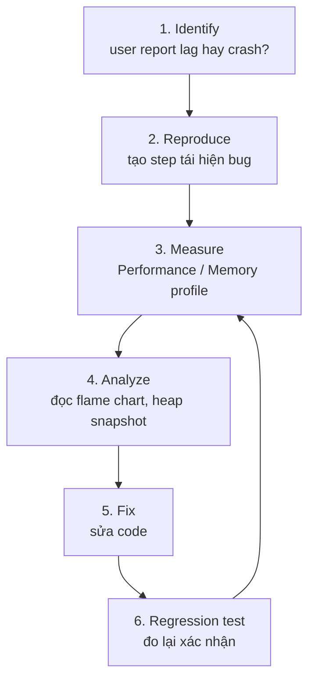

# Browser DevTools

**Browser DevTools** (công cụ phát triển tích hợp trong trình duyệt) là bộ công cụ giúp bạn xem, kiểm tra và gỡ lỗi (debug) trang web ngay trong trình duyệt như Chrome hay Firefox. Bạn có thể dùng nó để xem cấu trúc HTML, chạy lệnh JavaScript trong **Console** (bảng điều khiển nhập lệnh), theo dõi yêu cầu mạng và tìm lỗi trong code. Đây là công cụ không thể thiếu cho người mới học khi muốn hiểu chuyện gì đang xảy ra bên trong trang web của mình.

[](pathname:///img/javascript/devtools.webp)

---

:::note[Ghi nhớ nhanh]

- ⭐ **Console API** — không chỉ `console.log`: còn `table`, `group`, `time`, `count`, `assert`, `trace`, `dir` và shortcut trong browser (`$0`, `$$()`, `copy()`).
- ⭐ **Sources Panel (Debugger)** — đặt breakpoint (kể cả conditional/logpoint), `debugger`, step over/into/out, xem Call Stack & Scope; source map giúp debug về code gốc.
- **Network Panel** — inspect request (Headers/Payload/Preview/Timing), throttling giả lập mạng chậm, "Copy as fetch" để replay request.
- **Performance Panel** — record và đọc flame chart để tìm long task (>50ms), layout thrashing, re-render thừa.
- **Memory Panel** — heap snapshot / allocation timeline / sampling để debug memory leak.

:::

---

## Mục lục

- [Mở DevTools](#mở-devtools)
- [Console API](#console-api)
- [Sources Panel (Debugger)](#sources-panel-debugger)
- [Network Panel](#network-panel)
- [Performance Panel](#performance-panel)
- [Memory Panel](#memory-panel)
- [Câu hỏi phỏng vấn](#câu-hỏi-phỏng-vấn)

---

## Mở DevTools

- **Windows / Linux**: `F12`, `Ctrl + Shift + I`
- **Mac**: `Cmd + Option + I`
- Click chuột phải → "Inspect"

---

## Console API

```js
console.log(value);
console.warn(message);
console.error(message);
console.info(message);
console.debug(message);

// Format
console.log("User: %s, age: %d", name, age);
console.log("%cBig red", "color: red; font-size: 30px");

// Group
console.group("Auth");
console.log("Step 1");
console.log("Step 2");
console.groupEnd();

// Table
console.table(users);

// Timer
console.time("fetch");
await fetch(url);
console.timeEnd("fetch");

// Counter
console.count("click");
console.countReset("click");

// Assertion (chỉ log khi false)
console.assert(user, "User missing");

// Trace
console.trace("Where am I called from?");

// Dir — explore object đầy đủ
console.dir(domElement);
```

:::tip[Mẹo]

**Console shortcut trong browser:**

- `$0`, `$1`... — element đã chọn trong Elements panel (`$0` = mới nhất).
- `$_` — kết quả expression trước.
- `$$("selector")` — `document.querySelectorAll` ngắn gọn.
- `$x("xpath")` — XPath query.
- `copy(obj)` — copy ra clipboard.
- `clear()` — xóa console.
- `monitor(fn)` / `unmonitor(fn)` — log mỗi lần fn được gọi.
- `monitorEvents(node, "click")` — log mọi event.
- `debug(fn)` — auto break khi fn được gọi.

```js
// Test selector nhanh
$$(".btn")[0].click();

// Inspect element gần nhất
console.log($0.parentElement);
```

:::

---

## Sources Panel (Debugger)

Tab **Sources** để **debug bằng breakpoint**.

**Đặt breakpoint:**

- Click số dòng → breakpoint dòng.
- **Conditional breakpoint** — right-click → "Add conditional...":

```js
// Chỉ break khi điều kiện đúng
user.id === 42
```

- **Logpoint** — log không stop:

```js
console.log("user", user)  // chỉ log, không pause
```

**Code-level breakpoint:**

```js
function process(data) {
  debugger; // dừng ở đây khi DevTools mở
  // ...
}
```

**Control khi đã pause:**

- **Step over (F10)** — chạy 1 dòng, không vào function.
- **Step into (F11)** — vào trong function.
- **Step out (Shift+F11)** — chạy hết function hiện tại.
- **Continue (F8)** — chạy đến breakpoint tiếp theo.
- **Watch** — track giá trị expression.
- **Call Stack** — xem chuỗi function gọi.
- **Scope** — xem biến local/closure/global.

:::info[Phân tích]

**Source map** — debug code minified/transpiled như code gốc:

```js
// Code production: bundle.min.js
// Có file bundle.min.js.map ánh xạ về src/index.ts gốc
```

Khi DevTools tìm thấy `.map`, breakpoint sẽ đặt được vào **file
TypeScript gốc**, không phải JS đã build.

Source map có 3 chế độ:

- **inline**: data URI embedded trong file (dễ debug nhưng to).
- **separate**: file `.map` riêng, link qua `//# sourceMappingURL=...` (chuẩn production).
- **hidden**: chỉ deploy `.map` lên server riêng (Sentry) cho monitoring.

Sentry, Bugsnag, Rollbar đều cần source map upload để de-minify stack
trace từ user — đây là phần quan trọng của observability cho frontend.

:::

---

## Network Panel

Xem mọi request HTTP/WebSocket.

**Filter:**

- All / Fetch/XHR / JS / CSS / Img / Media / WS.
- Search box (text trong URL, header).
- "Hide data URLs" / "3rd party requests".

**Inspect request:**

- **Headers** — request/response header.
- **Payload** — body gửi đi.
- **Preview** — JSON/image rendered đẹp.
- **Response** — raw body.
- **Initiator** — code nào trigger.
- **Timing** — DNS, connect, TTFB, download.

**Throttling** — giả lập mạng chậm:

- "Online", "Fast 3G", "Slow 3G", "Offline".
- Hữu ích test loading state, timeout, retry.

**Block request URL** — right-click → "Block request URL":

- Test app khi 1 endpoint fail.
- Reproduce bug timing.

:::tip[Mẹo]

**Copy as fetch** — right-click request → "Copy" → "Copy as fetch":

```js
fetch("https://api.example.com/users", {
  headers: { "Content-Type": "application/json", "Authorization": "Bearer ..." },
  method: "POST",
  body: JSON.stringify({ name: "An" }),
});
```

Paste vào console để **replay request** với thông số khác — không phải
tạo lại curl tay.

Cũng có **"Copy as cURL"** để chạy ngoài terminal/Postman.

:::

---

## Performance Panel

Record period → phân tích bottleneck.

**Flame chart** — xem function nào chạy lâu:

- Trục X = thời gian.
- Trục Y = call stack.
- Hover để xem chi tiết.

**Web Vitals overlay** — LCP, FID, CLS metrics.

**Frame chart** — render frame timing (xanh = OK, đỏ = jank > 50ms).

Pattern thường tìm:

- **Long task** (>50ms) — block main thread.
- **Layout thrashing** — read DOM rồi write nhiều lần.
- **Excessive re-render** trong React (kết hợp React DevTools).

---

## Memory Panel

3 loại snapshot:

- **Heap snapshot** — chụp ảnh memory tại 1 thời điểm.
- **Allocation timeline** — track object tạo theo thời gian.
- **Allocation sampling** — light-weight, sample ngẫu nhiên.

(Xem chi tiết debug leak ở phần [Memory Management](../19-memory/1_memory.md).)

:::info[Phân tích]

**Workflow debug performance/memory chuẩn:**

1. **Identify** — user report lag / app crash? Lab metrics gì?
2. **Reproduce** — tạo step rõ ràng để gặp bug.
3. **Measure** — Performance / Memory profile.
4. **Analyze** — đọc flame chart, snapshot.
5. **Fix** — viết code, đo lại confirm.
6. **Regression test** — thêm performance test nếu được.



**Đừng optimize mò** — luôn có data trước khi sửa. "Premature
optimization is the root of all evil" — code đơn giản, đúng trước,
nhanh sau.

Các nguồn khác cần biết khi debug:

- **Lighthouse** — audit Performance, A11y, SEO, PWA.
- **Web Vitals** (Chrome ext) — Core Web Vitals real-time.
- **React DevTools** — component tree, profiler.
- **Vue DevTools / Svelte DevTools** — tương ứng.
- **Redux DevTools** — time-travel state.

:::

:::tip[Mẹo]

**Debug production code** với DevTools:

1. Mở DevTools.
2. Tab Sources → tìm file (kể cả đã minify).
3. Click `{ }` ở góc dưới để **prettify** code minified.
4. Đặt breakpoint, refresh.
5. Có source map → đặt được breakpoint vào file gốc.

Combo với **"Local Overrides"** trong Sources → cho phép **sửa file
production** trong DevTools và reload sẽ dùng file đã sửa. Test fix
trước khi deploy mà không cần dev environment.

:::

---

## Câu hỏi phỏng vấn

Những câu thường gặp về chủ đề này. Tự trả lời trước, rồi bấm **Xem đáp án** để đối chiếu.

**1. Ngoài `console.log`, bạn hay dùng những API console nào và trong tình huống nào (`table`, `group`, `time`, `count`, `assert`, `dir`, `trace`)?**

<details className="qa">
<summary>Xem đáp án</summary>

- `console.table(users)` — in mảng object thành **bảng** có cột sắp xếp được; hợp khi soi danh sách kết quả API thay vì mở từng object.
- `console.group("Auth")` / `console.groupEnd()` — gom log thành nhóm gập được, rất hợp cho log nhiều bước của một luồng (login, checkout).
- `console.time("fetch")` / `console.timeEnd("fetch")` — đo thời gian một đoạn code, nhanh hơn tự trừ `Date.now()`.
- `console.count("click")` — đếm số lần chạy qua một dòng; phát hiện handler bị gắn hai lần hoặc component re-render thừa.
- `console.assert(user, "User missing")` — chỉ log khi điều kiện **sai**, dùng kiểm tra giả định mà không làm bẩn console.
- `console.dir(el)` — in DOM element dưới dạng **object có property** thay vì dạng cây HTML như `console.log`.
- `console.trace()` — in stack trace tại chỗ, trả lời câu hỏi "hàm này ai gọi?" khi luồng gọi đi qua nhiều tầng.

Ngoài ra `console.warn`/`error` tô màu và gom được theo mức lọc, `%c` cho phép style log để đánh dấu nhóm quan trọng.

</details>

**2. Bạn `console.log` một object rồi sau đó sửa object đó — vì sao console lại hiển thị giá trị đã đổi? Cách tránh?**

<details className="qa">
<summary>Xem đáp án</summary>

Vì `console.log` với object **không chụp ảnh giá trị** mà chỉ giữ **tham chiếu** tới object trên heap. Dòng log hiện ra dạng thu gọn; chỉ tới lúc bạn bấm mũi tên mở ra, DevTools mới đọc nội dung — mà lúc đó object đã bị sửa rồi.

```js
const user = { name: "An" };
console.log(user);   // mở ra sau thì thấy name: "Bình"
user.name = "Bình";
```

Cách tránh:

- Log một **bản chụp**: `console.log(structuredClone(user))` hoặc `console.log(JSON.parse(JSON.stringify(user)))`.
- Log giá trị **primitive** cần quan tâm: `console.log(user.name)` — primitive được copy nên giữ nguyên.
- `console.table(user)` cũng render ngay tại thời điểm gọi.
- Tốt nhất là dùng **breakpoint** thay vì log: dừng đúng chỗ và xem trạng thái thật trong panel Scope, không phải đoán.

Lưu ý mảng/object lớn cũng bị vậy, và đây là nguồn gốc của rất nhiều giờ debug "rõ ràng tôi đã log ra mà giá trị vẫn sai".

</details>

**3. `$0`, `$$()`, `copy()` và `monitorEvents()` trong console dùng để làm gì?**

<details className="qa">
<summary>Xem đáp án</summary>

Đây là các **tiện ích riêng của console DevTools**, không phải API JavaScript — gõ trong code sẽ lỗi.

- `$0` — element đang chọn trong panel Elements; `$1`, `$2`... là các element chọn trước đó. Rất tiện để thao tác nhanh: `$0.parentElement`, `$0.getBoundingClientRect()`.
- `$$("selector")` — viết tắt của `document.querySelectorAll`, nhưng trả về **mảng thật** nên dùng được `map`/`filter` ngay. Anh em của nó là `$("selector")` cho một phần tử và `$x("xpath")` cho XPath.
- `copy(obj)` — chép giá trị ra **clipboard** (tự stringify nếu là object). Hợp khi cần lấy nguyên payload JSON dán sang chỗ khác.
- `monitorEvents(node, "click")` — log mọi event thuộc loại chỉ định xảy ra trên node đó, gỡ bằng `unmonitorEvents(node)`. Dùng khi không biết event nào đang bắn, hoặc nghi handler gắn nhiều lần.

```js
$$(".btn").map((b) => b.textContent);
copy($0.outerHTML);
```

Nhóm này còn có `monitor(fn)` (log mỗi lần hàm được gọi kèm tham số), `debug(fn)` (tự dừng khi hàm chạy) và `clear()`.

</details>

**4. Breakpoint theo dòng, `conditional breakpoint` và `logpoint` khác nhau ra sao? Khi nào bạn chọn logpoint thay vì thêm `console.log` vào code?**

<details className="qa">
<summary>Xem đáp án</summary>

| Loại | Hành vi | Dùng khi |
|---|---|---|
| Breakpoint dòng | Dừng **mọi lần** chạy qua dòng đó | Muốn soi kỹ trạng thái, call stack, scope |
| Conditional breakpoint | Chỉ dừng khi biểu thức đúng (`user.id === 42`) | Vòng lặp nghìn vòng, chỉ một case lỗi |
| Logpoint | **Không dừng**, chỉ in ra console biểu thức bạn viết | Muốn theo dõi giá trị nhưng giữ luồng chạy liên tục |

Chọn **logpoint** thay vì `console.log` trong code khi:

- Không muốn **sửa source** — tránh commit nhầm log rác, tránh phải build/deploy lại.
- Đang debug **code production** hoặc code trong `node_modules` mà bạn không sở hữu.
- Cần thêm/bớt/đổi điểm log liên tục trong lúc đang chạy, không muốn reload mỗi lần.
- Đang debug trên máy người khác hoặc trên môi trường staging.

Ngược lại, `console.log` trong code vẫn hợp lý khi log cần **tồn tại lâu dài** (logging có chủ đích cho vận hành) hoặc cần chạy cả ở CI, ở server — vì logpoint chỉ sống trong DevTools của riêng bạn và mất khi đổi máy.

</details>

**5. DevTools còn những loại breakpoint nào khác (DOM change, XHR/fetch, event listener, pause on exception)? Kể tình huống thực tế dùng từng loại.**

<details className="qa">
<summary>Xem đáp án</summary>

- **DOM breakpoint** — right-click node trong Elements, chọn *Break on* với ba lựa chọn: subtree modifications, attribute modifications, node removal. Tình huống: một class cứ tự bị gỡ, hoặc phần tử biến mất không rõ ai xoá — đặt breakpoint là DevTools chỉ thẳng dòng code thủ phạm.
- **XHR/fetch breakpoint** — dừng khi URL chứa một chuỗi. Tình huống: app gọi `/api/user` hai lần mà không biết chỗ nào gọi, hoặc cần bắt đúng request gửi sai payload để xem call stack.
- **Event listener breakpoint** — dừng khi một loại event bắn (`click`, `keydown`, `load`, timer...). Tình huống: bấm nút mà không biết handler nằm ở file nào, nhất là với thư viện bên thứ ba hoặc code đã minify.
- **Pause on exceptions** — nút hình bát giác, có thêm tuỳ chọn dừng cả ở exception **đã được catch**. Tình huống: lỗi bị `try/catch` nuốt mất, chỉ hiện thông báo chung chung; bật lên là dừng đúng dòng ném lỗi với nguyên vẹn scope.

Ngoài ra còn **function breakpoint** bằng cách gõ `debug(fn)` trong console, và breakpoint cho `requestAnimationFrame`/timer trong nhóm event listener.

</details>

**6. `Step over`, `step into`, `step out` khác nhau thế nào? Khi nào cần dùng cái nào?**

<details className="qa">
<summary>Xem đáp án</summary>

Khi chương trình đang dừng ở một dòng:

- **Step over (F10)** — chạy trọn dòng hiện tại rồi dừng ở dòng kế. Nếu dòng đó gọi hàm, hàm vẫn chạy đầy đủ nhưng debugger **không đi vào trong**. Dùng khi bạn tin hàm đó đúng và chỉ muốn theo dõi luồng ở tầng hiện tại.
- **Step into (F11)** — nếu dòng hiện tại gọi hàm thì **nhảy vào trong** hàm đó, dừng ở dòng đầu tiên. Dùng khi nghi lỗi nằm bên trong hàm được gọi.
- **Step out (Shift+F11)** — chạy nốt hàm hiện tại rồi dừng ngay tại chỗ gọi nó. Dùng khi lỡ step into nhầm vào thư viện, hoặc đã xem đủ và muốn quay lên tầng trên.

Kèm theo là **Continue (F8)** — chạy tiếp tới breakpoint kế.

Chiến thuật thường dùng: step over để lướt nhanh tìm dòng làm giá trị sai, thấy nghi ngờ thì step into để đào sâu, đào xong thì step out quay lên. DevTools còn có tính năng bỏ qua script thư viện (*Ignore list*) để step into không rơi vào code của React hay lodash.

</details>

**7. Panel `Scope` và `Watch` khác nhau chỗ nào? Đọc `Call Stack` giúp gì khi truy ngược nguyên nhân lỗi?**

<details className="qa">
<summary>Xem đáp án</summary>

- **Scope** liệt kê **tự động** mọi biến đang nhìn thấy được tại điểm dừng, chia theo tầng: Local (biến trong hàm, `this`, tham số), Closure (biến bắt từ scope cha), Block, Global. Bạn không khai báo gì, DevTools tự dựng theo scope chain.
- **Watch** là danh sách **bạn tự thêm**: mỗi dòng là một biểu thức bất kỳ (`user.items.length`, `a > b`, `arr.filter(x => x.ok).length`) được tính lại sau mỗi bước step. Hợp khi cần theo dõi một giá trị dẫn xuất mà Scope không hiển thị sẵn, hoặc theo dõi xuyên nhiều hàm.

**Call Stack** cho biết chuỗi các hàm đã gọi để tới điểm hiện tại, đáy stack là nơi khởi nguồn. Nó trả lời câu "vì sao code này lại chạy?" — khác với breakpoint chỉ nói "code này đang chạy". Click vào một frame là nhảy tới đúng dòng gọi, và panel Scope đổi theo frame đó, nên bạn **truy ngược được giá trị sai bắt nguồn từ tầng nào**. Với async, DevTools nối cả *async stack trace* để nhìn xuyên qua Promise và callback của timer.

</details>

**8. `Source map` là gì? Ba chế độ inline, separate và hidden đánh đổi ra sao? Vì sao không nên public map cho code nhạy cảm?**

<details className="qa">
<summary>Xem đáp án</summary>

**Source map** là file ánh xạ từng vị trí trong code đã build (minify, bundle, transpile từ TypeScript/JSX) về đúng **dòng, cột trong file gốc**. Nhờ nó, DevTools hiển thị và đặt breakpoint ngay trên `src/index.ts` thay vì `bundle.min.js`.

| Chế độ | Cách hoạt động | Đánh đổi |
|---|---|---|
| Inline | Nhúng thẳng dưới dạng data URI trong file JS | Debug tiện, không cần file phụ; file phình rất to nên chỉ hợp môi trường dev |
| Separate | File `.map` riêng, trỏ tới bằng `//# sourceMappingURL=...` | Chuẩn phổ biến; browser chỉ tải khi mở DevTools nên không ảnh hưởng người dùng thường |
| Hidden | Vẫn sinh `.map` nhưng **không** kèm comment trỏ tới, chỉ upload lên dịch vụ giám sát | Người ngoài không lấy được source; muốn de-minify phải qua Sentry/Bugsnag |

Không nên public map cho code nhạy cảm vì map **chứa nguyên văn source gốc** (trường `sourcesContent`) — tức là phơi bày toàn bộ code chưa minify: comment nội bộ, tên biến thật, logic kiểm tra quyền, endpoint ẩn, đôi khi cả khoá lọt vào build. Với sản phẩm thương mại hoặc phần logic nhạy cảm, dùng chế độ **hidden**: vẫn giữ được khả năng đọc stack trace từ user qua Sentry mà không cho cả thế giới đọc source.

</details>

**9. Phải debug code production đã minify mà không có source map — bạn làm gì?**

<details className="qa">
<summary>Xem đáp án</summary>

Các bước theo thứ tự:

1. Mở tab **Sources**, tìm file rồi bấm nút `{ }` (*Pretty print*) ở góc dưới — code minify được format lại thành nhiều dòng, đủ để đặt breakpoint chính xác theo dòng.
2. Khoanh vùng bằng breakpoint **không phụ thuộc tên hàm**: event listener breakpoint cho `click`, XHR/fetch breakpoint theo URL endpoint, hoặc DOM breakpoint trên phần tử bị lỗi. Đây là cách hiệu quả nhất vì tên hàm đã bị đổi thành `a`, `t`, `n`.
3. Bật **Pause on exceptions** (kèm cả caught) để dừng ngay tại nơi ném lỗi.
4. Dùng console để dò: `$0` cho element đang chọn, `monitorEvents` để biết event nào bắn, `console.trace()` hoặc panel Call Stack để lần ngược người gọi.
5. Chuỗi ký tự **không bị minify** — search text hiển thị trên UI hoặc tên key JSON trong tab Sources thường dẫn thẳng tới đoạn code liên quan.
6. Có giả thuyết rồi thì dùng **Local Overrides** để sửa file production ngay trong DevTools và reload kiểm chứng.

Và rút kinh nghiệm: cấu hình build sinh source map **hidden** rồi upload lên Sentry, để lần sau không phải làm khổ như vậy.

</details>

**10. Trong Network panel, đọc phần `Timing` (DNS, connect, `TTFB`, download) giúp chẩn đoán điều gì? `TTFB` cao thì nghi ngờ ở đâu?**

<details className="qa">
<summary>Xem đáp án</summary>

Tab **Timing** tách tổng thời gian một request thành từng chặng, cho biết **nút thắt nằm ở đâu** thay vì chỉ thấy "chậm":

- **Queueing / Stalled** lâu — trình duyệt đang chờ vì quá nhiều request song song cùng host, hoặc bị chặn bởi request ưu tiên cao hơn. Hướng xử lý: giảm số request, dùng HTTP/2, gộp tài nguyên.
- **DNS Lookup** lâu — phân giải tên miền chậm, hay gặp với domain thứ ba lạ; cân nhắc `dns-prefetch`, `preconnect`.
- **Initial connection / SSL** lâu — bắt tay TCP và TLS tốn kém, thường do khoảng cách địa lý tới server hoặc thiếu keep-alive.
- **Waiting (TTFB)** — thời gian từ lúc gửi xong request tới byte đầu tiên của response.
- **Content Download** lâu — response quá nặng hoặc băng thông thấp; xử lý bằng nén, phân trang, giảm payload.

**TTFB cao** nghĩa là server suy nghĩ lâu hoặc đường truyền xa. Nghi ngờ theo thứ tự: query database chậm/thiếu index, xử lý phía backend nặng, gọi chuỗi service phụ thuộc, cold start của serverless, thiếu cache hoặc CDN, chuỗi redirect thừa, và cuối cùng là độ trễ mạng do server đặt xa người dùng. Tab **Initiator** giúp xác định request đó do code nào phát sinh.

</details>

**11. "Copy as fetch", "Copy as cURL" và "Block request URL" dùng vào việc gì trong thực tế?**

<details className="qa">
<summary>Xem đáp án</summary>

- **Copy as fetch** — chép request thành đoạn `fetch()` đầy đủ header, method, body. Dán vào console để **replay** request với tham số khác mà không cần thao tác lại cả luồng UI: thử đổi body, bỏ bớt header xem cái nào bắt buộc, gọi lặp để tái hiện lỗi. Rất nhanh khi cần dựng lại một case lỗi mà QA báo.

```js
fetch("https://api.example.com/users", {
  method: "POST",
  headers: { "Content-Type": "application/json" },
  body: JSON.stringify({ name: "An" }),
});
```

- **Copy as cURL** — cùng ý tưởng nhưng chạy ngoài terminal, hoặc import thẳng vào Postman/Insomnia. Hữu ích khi cần đưa cho backend một lệnh tái hiện chính xác, hoặc test không phụ thuộc trình duyệt.
- **Block request URL** (right-click → Block) — chặn một URL hoặc cả domain rồi reload, để xem app xoay xở ra sao: có hiện trạng thái lỗi tử tế không, có retry không, có sập trắng màn hình không. Cũng dùng để kiểm chứng một script bên thứ ba (analytics, quảng cáo) có phải là nguyên nhân gây chậm hay gây bug hay không.

Lưu ý: request chép ra có kèm cookie và token — đừng dán vào issue công khai.

</details>

**12. `Throttling` mạng dùng để kiểm thử những gì? Kể một loại bug chỉ lộ ra khi mạng chậm.**

<details className="qa">
<summary>Xem đáp án</summary>

Máy dev luôn có mạng nhanh, nên nhiều vấn đề không bao giờ xuất hiện. Bật throttling (*Fast 3G*, *Slow 3G*, *Offline*) trong Network panel để kiểm thử:

- **Loading state** — skeleton/spinner có hiện không, hay màn hình trắng hàng giây.
- **Xử lý timeout và retry** — có báo lỗi tử tế không, có cho thử lại không.
- **Hành vi offline** — service worker, cache, thông báo mất mạng.
- **Thứ tự tải tài nguyên** — font, ảnh, script chặn render tới mức nào; CLS khi ảnh tải muộn.

Bug kinh điển chỉ lộ khi mạng chậm là **race condition trong tìm kiếm theo từng ký tự**: gõ "ab" bắn hai request, request của "a" về **sau** request của "ab" và ghi đè kết quả — người dùng gõ "ab" mà thấy kết quả của "a". Trên mạng nhanh gần như không bao giờ gặp. Khắc phục bằng debounce, huỷ request cũ bằng `AbortController`, hoặc kiểm tra request trả về có khớp truy vấn hiện tại không.

Các bug họ hàng: double-submit do nút không bị disable trong lúc chờ, và `setState` trên component đã unmount.

</details>

**13. Đọc `flame chart` trong Performance panel như thế nào? `Long task` là gì và vì sao lấy ngưỡng 50ms?**

<details className="qa">
<summary>Xem đáp án</summary>

Cách đọc flame chart:

- **Trục X là thời gian**, nên **bề ngang của một khối = thời gian hàm đó chiếm**. Khối càng rộng càng đáng ngờ.
- **Trục Y là call stack**: khối nằm dưới gọi khối nằm trên nó (trong Chrome, stack đổ xuống dưới). Nhìn theo chiều dọc là thấy chuỗi gọi.
- Khối rộng ở **tầng sâu nhất** thường chính là nơi thực sự tốn thời gian, còn khối rộng ở tầng trên chỉ là tổng của con.
- Hover để xem self time (thời gian của riêng hàm) và total time; dùng tab **Bottom-Up** để xếp hạng theo self time, **Call Tree** để nhìn theo cây.
- Dải Frames phía trên cho biết frame nào bị giật; task bị đánh dấu **tam giác đỏ** là long task.

**Long task** là tác vụ chiếm main thread liên tục **trên 50ms**. Trong khoảng đó, trình duyệt không xử lý được input, không render được frame — người dùng bấm mà không thấy phản hồi.

Ngưỡng 50ms đến từ mô hình RAIL: phản hồi một thao tác trong vòng **100ms** thì người dùng cảm thấy tức thì. Chừa khoảng nửa ngân sách đó cho các việc trình duyệt phải làm thêm (xử lý event, render), nên mỗi khối công việc JS nên gói dưới 50ms. Cách chữa: cắt nhỏ tác vụ, `requestIdleCallback`, hoặc đẩy sang Web Worker.

</details>

**14. `Layout thrashing` là gì? Nhận biết nó trên Performance panel ra sao và sửa thế nào?**

<details className="qa">
<summary>Xem đáp án</summary>

**Layout thrashing** (forced synchronous layout) xảy ra khi code **xen kẽ đọc và ghi DOM** trong cùng một vòng lặp. Mỗi lần ghi làm layout "bẩn"; ngay sau đó lại đọc một thuộc tính hình học (`offsetHeight`, `getBoundingClientRect`, `scrollTop`, `getComputedStyle`) thì trình duyệt buộc phải **tính lại layout ngay lập tức** thay vì gộp lại làm một lần cuối frame.

```js
// Xấu — N lần layout
items.forEach((el) => {
  el.style.width = el.offsetWidth + 10 + "px"; // ghi rồi đọc, lặp lại
});

// Tốt — đọc hết, rồi ghi hết
const widths = items.map((el) => el.offsetWidth);
items.forEach((el, i) => (el.style.width = widths[i] + 10 + "px"));
```

Nhận biết trên Performance panel: record rồi tìm các khối **Layout** màu tím lặp lại dày đặc trong một task, kèm cảnh báo **"Forced reflow is a likely performance bottleneck"**; click vào là DevTools chỉ ra đúng dòng code gây ra.

Cách sửa: tách thành **pha đọc rồi pha ghi** (mẫu batch như thư viện FastDOM), gom thay đổi vào `requestAnimationFrame`, cache kết quả đo thay vì đo trong vòng lặp, ưu tiên animate bằng `transform`/`opacity` (chỉ chạy composite, không layout), và dùng `IntersectionObserver` thay cho việc đọc vị trí liên tục trong `scroll`.

</details>

**15. Ba kiểu profiling trong Memory panel (`heap snapshot`, `allocation timeline`, `allocation sampling`) khác nhau ra sao? Khi nào dùng so sánh snapshot?**

<details className="qa">
<summary>Xem đáp án</summary>

| Kiểu | Bản chất | Dùng khi |
|---|---|---|
| Heap snapshot | Ảnh chụp toàn bộ heap tại **một thời điểm**, liệt kê mọi object kèm chuỗi retainer | Muốn biết hiện đang giữ những gì và **ai** đang giữ |
| Allocation instrumentation on timeline | Ghi liên tục, hiển thị object được cấp phát **theo trục thời gian**, cột xanh là còn sống | Muốn biết object sinh ra **lúc nào** và từ **stack nào** |
| Allocation sampling | Lấy mẫu theo xác suất, chi phí rất thấp, quy về từng hàm | Cần theo dõi **phiên dài** hoặc môi trường gần production mà không làm chậm app |

Đánh đổi: snapshot chính xác và giàu thông tin nhưng nặng, làm dừng app một nhịp; timeline cho biết thời điểm nhưng chỉ ghi được khoảng ngắn; sampling nhẹ nhất nhưng kém chi tiết.

**So sánh snapshot** dùng khi nghi có leak: chụp ảnh ở trạng thái nền, lặp thao tác nghi ngờ nhiều lần rồi quay lại trạng thái nền, chụp tiếp, lặp thêm một vòng rồi chụp ảnh thứ ba. Chọn chế độ *Comparison* giữa hai ảnh cuối và sắp theo **Delta**: constructor nào tăng đều theo số vòng chính là thủ phạm. Lọc chữ `Detached` để tìm DOM node mồ côi, rồi đọc panel **Retainers** để lần ra đoạn code đang níu chúng.

</details>

**16. `Local Overrides` dùng làm gì? Kể tình huống bạn xác minh được một bug production mà không cần deploy.**

<details className="qa">
<summary>Xem đáp án</summary>

**Local Overrides** (tab Sources → Overrides) cho phép lưu một bản sao file của trang xuống thư mục trên máy, sửa nó ngay trong DevTools, và từ đó trở đi trình duyệt **dùng bản đã sửa thay cho file tải từ server** — kể cả sau khi reload. Áp dụng được cho JS, CSS, HTML, và cả response của request (Network → Override content).

Tình huống thực tế: production báo lỗi nút "Thanh toán" không chạy trên một số tài khoản, nghi do thiếu kiểm tra null trên một trường tuỳ chọn. Thay vì sửa code, chờ CI build, deploy staging rồi mới biết đúng sai, bạn:

1. Bật Overrides, mở `bundle.min.js`, bấm pretty print.
2. Sửa thẳng đoạn nghi ngờ, thêm optional chaining, lưu lại.
3. Reload trang production, đăng nhập đúng tài khoản lỗi và thử lại.

Bấm được nút là giả thuyết đúng — lúc này mới sửa trong source thật và mở PR, với bằng chứng chắc chắn.

Lưu ý: override chỉ tồn tại trên máy bạn, không ảnh hưởng người dùng khác; nhớ tắt sau khi xong, kẻo hôm sau ngồi debug một file mà mình quên là đã bị ghi đè.

</details>

**17. Mô tả quy trình debug performance của bạn từ lúc user báo lag cho tới khi xác nhận đã fix.**

<details className="qa">
<summary>Xem đáp án</summary>

Sáu bước, đi lần lượt và không nhảy cóc:

1. **Identify** — làm rõ "lag" là gì: chậm lúc tải hay chậm lúc tương tác, ở màn hình nào, thiết bị và mạng ra sao. Đối chiếu với số liệu thật (Core Web Vitals từ RUM, log) chứ không chỉ cảm nhận.
2. **Reproduce** — dựng các bước tái hiện ổn định. Nếu chỉ xảy ra trên máy yếu hoặc mạng kém thì bật **CPU throttling 4x/6x** và **Network throttling** để mô phỏng, vì máy dev quá mạnh sẽ giấu vấn đề.
3. **Measure** — record Performance (hoặc Memory nếu nghi leak) đúng đoạn thao tác gây chậm. Có số liệu trước khi sửa để còn so sánh.
4. **Analyze** — đọc flame chart tìm long task, khối rộng ở stack sâu, cảnh báo forced reflow; dùng Bottom-Up xếp theo self time; nếu là React thì kết hợp Profiler của React DevTools để tìm re-render thừa.
5. **Fix** — sửa **một** nguyên nhân rõ ràng nhất, đo lại ngay để xác nhận đúng chỗ đó tạo ra khác biệt, rồi mới sang nguyên nhân kế.
6. **Regression test** — chốt bằng số liệu trước/sau, thêm budget hoặc kiểm tra Lighthouse trong CI để không tái diễn, và theo dõi metric thật sau khi deploy.

Nguyên tắc xuyên suốt: **không tối ưu mò** — luôn có dữ liệu trước khi sửa, và mỗi lần chỉ đổi một thứ.

</details>
