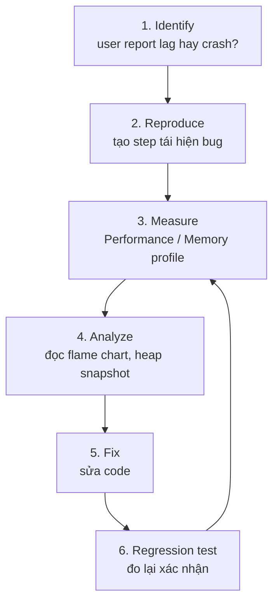

# Browser DevTools

**Browser DevTools** (công cụ phát triển tích hợp trong trình duyệt) là bộ công cụ giúp bạn xem, kiểm tra và gỡ lỗi (debug) trang web ngay trong trình duyệt như Chrome hay Firefox. Bạn có thể dùng nó để xem cấu trúc HTML, chạy lệnh JavaScript trong **Console** (bảng điều khiển nhập lệnh), theo dõi yêu cầu mạng và tìm lỗi trong code. Đây là công cụ không thể thiếu cho người mới học khi muốn hiểu chuyện gì đang xảy ra bên trong trang web của mình.

---

:::note[Ghi nhớ nhanh]

- ⭐ **Console API** — không chỉ `console.log`: còn `table`, `group`, `time`, `count`, `assert`, `trace`, `dir` và shortcut trong browser (`$0`, `$$()`, `copy()`).
- ⭐ **Sources Panel (Debugger)** — đặt breakpoint (kể cả conditional/logpoint), `debugger`, step over/into/out, xem Call Stack & Scope; source map giúp debug về code gốc.
- **Network Panel** — inspect request (Headers/Payload/Preview/Timing), throttling giả lập mạng chậm, "Copy as fetch" để replay request.
- **Performance Panel** — record và đọc flame chart để tìm long task (>50ms), layout thrashing, re-render thừa.
- **Memory Panel** — heap snapshot / allocation timeline / sampling để debug memory leak.

:::

---

## Mục lục

- [Mở DevTools](#mở-devtools)
- [Console API](#console-api)
- [Sources Panel (Debugger)](#sources-panel-debugger)
- [Network Panel](#network-panel)
- [Performance Panel](#performance-panel)
- [Memory Panel](#memory-panel)
- [Câu hỏi phỏng vấn](#câu-hỏi-phỏng-vấn)

---

## Mở DevTools

- **Windows / Linux**: `F12`, `Ctrl + Shift + I`
- **Mac**: `Cmd + Option + I`
- Click chuột phải → "Inspect"

---

## Console API

```js
console.log(value);
console.warn(message);
console.error(message);
console.info(message);
console.debug(message);

// Format
console.log("User: %s, age: %d", name, age);
console.log("%cBig red", "color: red; font-size: 30px");

// Group
console.group("Auth");
console.log("Step 1");
console.log("Step 2");
console.groupEnd();

// Table
console.table(users);

// Timer
console.time("fetch");
await fetch(url);
console.timeEnd("fetch");

// Counter
console.count("click");
console.countReset("click");

// Assertion (chỉ log khi false)
console.assert(user, "User missing");

// Trace
console.trace("Where am I called from?");

// Dir — explore object đầy đủ
console.dir(domElement);
```

:::tip[Mẹo]

**Console shortcut trong browser:**

- `$0`, `$1`... — element đã chọn trong Elements panel (`$0` = mới nhất).
- `$_` — kết quả expression trước.
- `$$("selector")` — `document.querySelectorAll` ngắn gọn.
- `$x("xpath")` — XPath query.
- `copy(obj)` — copy ra clipboard.
- `clear()` — xóa console.
- `monitor(fn)` / `unmonitor(fn)` — log mỗi lần fn được gọi.
- `monitorEvents(node, "click")` — log mọi event.
- `debug(fn)` — auto break khi fn được gọi.

```js
// Test selector nhanh
$$(".btn")[0].click();

// Inspect element gần nhất
console.log($0.parentElement);
```

:::

---

## Sources Panel (Debugger)

Tab **Sources** để **debug bằng breakpoint**.

**Đặt breakpoint:**

- Click số dòng → breakpoint dòng.
- **Conditional breakpoint** — right-click → "Add conditional...":

```js
// Chỉ break khi điều kiện đúng
user.id === 42
```

- **Logpoint** — log không stop:

```js
console.log("user", user)  // chỉ log, không pause
```

**Code-level breakpoint:**

```js
function process(data) {
  debugger; // dừng ở đây khi DevTools mở
  // ...
}
```

**Control khi đã pause:**

- **Step over (F10)** — chạy 1 dòng, không vào function.
- **Step into (F11)** — vào trong function.
- **Step out (Shift+F11)** — chạy hết function hiện tại.
- **Continue (F8)** — chạy đến breakpoint tiếp theo.
- **Watch** — track giá trị expression.
- **Call Stack** — xem chuỗi function gọi.
- **Scope** — xem biến local/closure/global.

:::info[Phân tích]

**Source map** — debug code minified/transpiled như code gốc:

```js
// Code production: bundle.min.js
// Có file bundle.min.js.map ánh xạ về src/index.ts gốc
```

Khi DevTools tìm thấy `.map`, breakpoint sẽ đặt được vào **file
TypeScript gốc**, không phải JS đã build.

Source map có 3 chế độ:

- **inline**: data URI embedded trong file (dễ debug nhưng to).
- **separate**: file `.map` riêng, link qua `//# sourceMappingURL=...` (chuẩn production).
- **hidden**: chỉ deploy `.map` lên server riêng (Sentry) cho monitoring.

Sentry, Bugsnag, Rollbar đều cần source map upload để de-minify stack
trace từ user — đây là phần quan trọng của observability cho frontend.

:::

---

## Network Panel

Xem mọi request HTTP/WebSocket.

**Filter:**

- All / Fetch/XHR / JS / CSS / Img / Media / WS.
- Search box (text trong URL, header).
- "Hide data URLs" / "3rd party requests".

**Inspect request:**

- **Headers** — request/response header.
- **Payload** — body gửi đi.
- **Preview** — JSON/image rendered đẹp.
- **Response** — raw body.
- **Initiator** — code nào trigger.
- **Timing** — DNS, connect, TTFB, download.

**Throttling** — giả lập mạng chậm:

- "Online", "Fast 3G", "Slow 3G", "Offline".
- Hữu ích test loading state, timeout, retry.

**Block request URL** — right-click → "Block request URL":

- Test app khi 1 endpoint fail.
- Reproduce bug timing.

:::tip[Mẹo]

**Copy as fetch** — right-click request → "Copy" → "Copy as fetch":

```js
fetch("https://api.example.com/users", {
  headers: { "Content-Type": "application/json", "Authorization": "Bearer ..." },
  method: "POST",
  body: JSON.stringify({ name: "An" }),
});
```

Paste vào console để **replay request** với thông số khác — không phải
tạo lại curl tay.

Cũng có **"Copy as cURL"** để chạy ngoài terminal/Postman.

:::

---

## Performance Panel

Record period → phân tích bottleneck.

**Flame chart** — xem function nào chạy lâu:

- Trục X = thời gian.
- Trục Y = call stack.
- Hover để xem chi tiết.

**Web Vitals overlay** — LCP, FID, CLS metrics.

**Frame chart** — render frame timing (xanh = OK, đỏ = jank > 50ms).

Pattern thường tìm:

- **Long task** (>50ms) — block main thread.
- **Layout thrashing** — read DOM rồi write nhiều lần.
- **Excessive re-render** trong React (kết hợp React DevTools).

---

## Memory Panel

3 loại snapshot:

- **Heap snapshot** — chụp ảnh memory tại 1 thời điểm.
- **Allocation timeline** — track object tạo theo thời gian.
- **Allocation sampling** — light-weight, sample ngẫu nhiên.

(Xem chi tiết debug leak ở phần [Memory Management](../19-memory/1_memory.md).)

:::info[Phân tích]

**Workflow debug performance/memory chuẩn:**

1. **Identify** — user report lag / app crash? Lab metrics gì?
2. **Reproduce** — tạo step rõ ràng để gặp bug.
3. **Measure** — Performance / Memory profile.
4. **Analyze** — đọc flame chart, snapshot.
5. **Fix** — viết code, đo lại confirm.
6. **Regression test** — thêm performance test nếu được.



**Đừng optimize mò** — luôn có data trước khi sửa. "Premature
optimization is the root of all evil" — code đơn giản, đúng trước,
nhanh sau.

Các nguồn khác cần biết khi debug:

- **Lighthouse** — audit Performance, A11y, SEO, PWA.
- **Web Vitals** (Chrome ext) — Core Web Vitals real-time.
- **React DevTools** — component tree, profiler.
- **Vue DevTools / Svelte DevTools** — tương ứng.
- **Redux DevTools** — time-travel state.

:::

:::tip[Mẹo]

**Debug production code** với DevTools:

1. Mở DevTools.
2. Tab Sources → tìm file (kể cả đã minify).
3. Click `{ }` ở góc dưới để **prettify** code minified.
4. Đặt breakpoint, refresh.
5. Có source map → đặt được breakpoint vào file gốc.

Combo với **"Local Overrides"** trong Sources → cho phép **sửa file
production** trong DevTools và reload sẽ dùng file đã sửa. Test fix
trước khi deploy mà không cần dev environment.

:::

---

## Câu hỏi phỏng vấn

Những câu thường gặp về chủ đề này. Tự trả lời trước, rồi đối chiếu lại với nội dung phía trên.

1. Ngoài `console.log`, bạn hay dùng những API console nào và trong tình huống nào (`table`, `group`, `time`, `count`, `assert`, `dir`, `trace`)?
2. Bạn `console.log` một object rồi sau đó sửa object đó — vì sao console lại hiển thị giá trị đã đổi? Cách tránh?
3. `$0`, `$$()`, `copy()` và `monitorEvents()` trong console dùng để làm gì?
4. Breakpoint theo dòng, `conditional breakpoint` và `logpoint` khác nhau ra sao? Khi nào bạn chọn logpoint thay vì thêm `console.log` vào code?
5. DevTools còn những loại breakpoint nào khác (DOM change, XHR/fetch, event listener, pause on exception)? Kể tình huống thực tế dùng từng loại.
6. `Step over`, `step into`, `step out` khác nhau thế nào? Khi nào cần dùng cái nào?
7. Panel `Scope` và `Watch` khác nhau chỗ nào? Đọc `Call Stack` giúp gì khi truy ngược nguyên nhân lỗi?
8. `Source map` là gì? Ba chế độ inline, separate và hidden đánh đổi ra sao? Vì sao không nên public map cho code nhạy cảm?
9. Phải debug code production đã minify mà không có source map — bạn làm gì?
10. Trong Network panel, đọc phần `Timing` (DNS, connect, `TTFB`, download) giúp chẩn đoán điều gì? `TTFB` cao thì nghi ngờ ở đâu?
11. "Copy as fetch", "Copy as cURL" và "Block request URL" dùng vào việc gì trong thực tế?
12. `Throttling` mạng dùng để kiểm thử những gì? Kể một loại bug chỉ lộ ra khi mạng chậm.
13. Đọc `flame chart` trong Performance panel như thế nào? `Long task` là gì và vì sao lấy ngưỡng 50ms?
14. `Layout thrashing` là gì? Nhận biết nó trên Performance panel ra sao và sửa thế nào?
15. Ba kiểu profiling trong Memory panel (`heap snapshot`, `allocation timeline`, `allocation sampling`) khác nhau ra sao? Khi nào dùng so sánh snapshot?
16. `Local Overrides` dùng làm gì? Kể tình huống bạn xác minh được một bug production mà không cần deploy.
17. Mô tả quy trình debug performance của bạn từ lúc user báo lag cho tới khi xác nhận đã fix.
