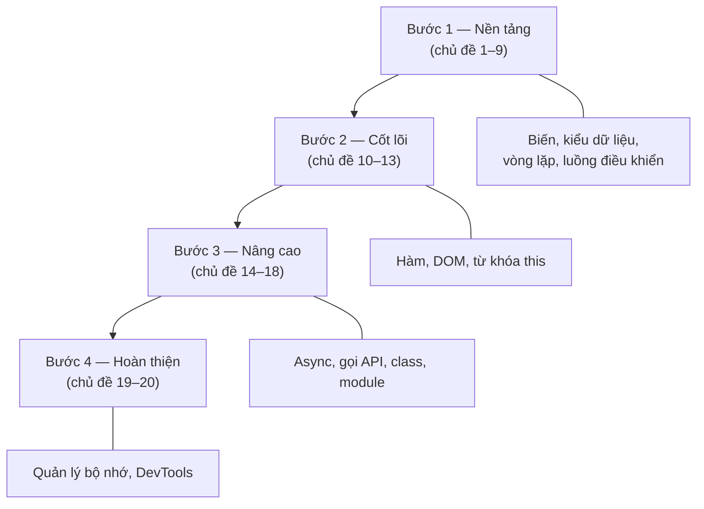

# Lộ trình học JavaScript

Chào mừng bạn đến với lộ trình học JavaScript dành cho người mới bắt đầu. Tài liệu này sẽ dẫn dắt bạn từ những khái niệm cơ bản nhất cho tới các chủ đề nâng cao, theo một trình tự dễ hiểu và dễ thực hành.

## 🎯 Cần nắm gì sau bài này?

:::note[Ghi nhớ nhanh]

- ⭐ **JavaScript là ngôn ngữ của web** — ban đầu chạy trong trình duyệt, nay chạy cả phía máy chủ nhờ `Node.js`.
- **Một ngôn ngữ, nhiều lĩnh vực** — dùng được cho cả frontend lẫn backend, nên rất đáng học đầu tiên.
- ⭐ **Học tuần tự theo 4 bước** — Nền tảng (chủ đề 1–9) → Cốt lõi (10–13) → Nâng cao (14–18) → Hoàn thiện (19–20).
- **Lộ trình gồm 20 nhóm chủ đề** — sắp xếp từ cơ bản đến nâng cao, mỗi chủ đề dựa trên chủ đề trước.
- **Thực hành ngay sau mỗi bài** — tự gõ code và mắc lỗi giúp hiểu sâu hơn nhiều so với chỉ đọc.

:::

## JavaScript là gì?

JavaScript (thường viết tắt là JS) là một **ngôn ngữ lập trình** (programming language) của web. Ban đầu, nó được tạo ra để chạy bên trong **trình duyệt** (browser) như Chrome, Firefox hay Safari, giúp các trang web trở nên sống động và có khả năng tương tác.

Ngày nay, JavaScript không chỉ giới hạn trong trình duyệt. Với sự ra đời của **Node.js** (môi trường chạy JavaScript bên ngoài trình duyệt), bạn còn có thể dùng JavaScript để viết cả phần **máy chủ** (server), tức là phần xử lý logic và dữ liệu phía sau của ứng dụng.

## JavaScript làm được gì?

- **Tương tác với người dùng trên web**: thay đổi nội dung trang, xử lý nút bấm, hiển thị thông báo, kiểm tra biểu mẫu (form).
- **Tạo hiệu ứng động**: ảnh trượt, menu mở ra/thu lại, hoạt ảnh (animation).
- **Giao tiếp với máy chủ**: gửi và nhận dữ liệu mà không cần tải lại trang.
- **Viết phần máy chủ với Node.js**: xây dựng **API** (giao diện lập trình ứng dụng), kết nối cơ sở dữ liệu, xử lý nghiệp vụ.
- **Xây dựng ứng dụng di động và desktop**: thông qua các nền tảng dựa trên JavaScript.

## Vì sao nên học JavaScript?

- **Ngôn ngữ phổ biến nhất của web**: hầu hết mọi trang web hiện đại đều dùng JavaScript. Học JS gần như là bắt buộc nếu bạn muốn làm web.
- **Một ngôn ngữ, nhiều lĩnh vực**: bạn có thể dùng JS cho cả phía **giao diện** (frontend) lẫn phía **máy chủ** (backend), tiết kiệm thời gian học nhiều ngôn ngữ khác nhau.
- **Cộng đồng lớn**: rất nhiều tài liệu, thư viện miễn phí và người sẵn sàng giúp đỡ khi bạn gặp khó khăn.
- **Cơ hội việc làm cao**: nhu cầu tuyển lập trình viên JavaScript luôn rất lớn.
- **Dễ bắt đầu**: chỉ cần một trình duyệt là bạn đã có thể viết và chạy thử JavaScript ngay lập tức.

## Lộ trình học

Bảng dưới đây liệt kê 20 nhóm chủ đề bạn sẽ học, sắp xếp theo thứ tự từ cơ bản đến nâng cao.

| #  | Chủ đề | Mô tả ngắn |
|----|--------|------------|
| 1  | Giới thiệu (Introduction) | Tổng quan về JavaScript, cách viết và chạy dòng code đầu tiên. |
| 2  | Biến (Variables) | Cách khai báo và lưu trữ giá trị bằng `var`, `let`, `const`. |
| 3  | Kiểu dữ liệu (Data Types) | Các loại dữ liệu cơ bản: số, chuỗi, boolean, null, undefined. |
| 4  | Ép kiểu (Type Casting) | Cách chuyển đổi giá trị từ kiểu này sang kiểu khác. |
| 5  | Cấu trúc dữ liệu (Data Structures) | Làm việc với mảng (array) và đối tượng (object). |
| 6  | So sánh bằng (Equality Comparisons) | Phân biệt `==` và `===`, cách JS so sánh các giá trị. |
| 7  | Vòng lặp và lặp (Loops and Iterations) | Lặp lại công việc với `for`, `while`, `for...of`. |
| 8  | Luồng điều khiển (Control Flow) | Ra quyết định trong code với `if`, `else`, `switch`. |
| 9  | Biểu thức và toán tử (Expressions & Operators) | Các phép toán, phép logic và cách kết hợp giá trị. |
| 10 | Hàm (Functions) | Đóng gói code để tái sử dụng, truyền tham số và trả về kết quả. |
| 11 | DOM APIs | Truy cập và thay đổi nội dung trang web bằng JavaScript. |
| 12 | Chế độ nghiêm ngặt (Strict Mode) | Bật chế độ kiểm tra lỗi chặt chẽ hơn để viết code an toàn. |
| 13 | Từ khóa `this` (this keyword) | Hiểu `this` trỏ tới đối tượng nào trong từng ngữ cảnh. |
| 14 | JavaScript bất đồng bộ (Asynchronous JavaScript) | Xử lý tác vụ chờ với callback, Promise và `async/await`. |
| 15 | Làm việc với API (Working with APIs) | Gửi và nhận dữ liệu từ máy chủ qua mạng. |
| 16 | Lớp (Classes) | Lập trình hướng đối tượng với `class`, kế thừa và phương thức. |
| 17 | Iterator và Generator (Iterators and Generators) | Tạo và duyệt qua các chuỗi giá trị tùy chỉnh. |
| 18 | Mô-đun (Modules) | Chia code thành nhiều tệp với `import` và `export`. |
| 19 | Quản lý bộ nhớ (Memory Management) | Cách JS cấp phát và thu hồi bộ nhớ tự động. |
| 20 | Công cụ cho lập trình viên trên trình duyệt (Browser DevTools) | Gỡ lỗi (debug) và kiểm tra code ngay trong trình duyệt. |

## Học theo thứ tự nào?

Nếu bạn là **người mới hoàn toàn**, hãy học lần lượt từ chủ đề số 1 đến số 20. Mỗi chủ đề được sắp xếp để dựa trên kiến thức của chủ đề trước đó:

- **Bước 1 — Nền tảng (chủ đề 1–9):** Nắm vững biến, kiểu dữ liệu, vòng lặp và luồng điều khiển. Đây là phần quan trọng nhất, đừng vội bỏ qua.
- **Bước 2 — Cốt lõi (chủ đề 10–13):** Học về hàm, thao tác với trang web qua DOM, và hiểu rõ từ khóa `this`.
- **Bước 3 — Nâng cao (chủ đề 14–18):** Làm quen với code bất đồng bộ, gọi API, lập trình hướng đối tượng và chia nhỏ dự án thành nhiều mô-đun.
- **Bước 4 — Hoàn thiện (chủ đề 19–20):** Hiểu cách JavaScript quản lý bộ nhớ và sử dụng thành thạo công cụ gỡ lỗi trên trình duyệt.

Sơ đồ dưới đây tóm tắt 4 bước học, mỗi bước xây trên nền tảng của bước trước:

**Lời khuyên:** Hãy thực hành ngay sau mỗi chủ đề. Viết lại code bằng tay, thử thay đổi giá trị và quan sát kết quả. Việc tự gõ và mắc lỗi sẽ giúp bạn hiểu sâu hơn rất nhiều so với chỉ đọc lý thuyết.

Chúc bạn học tốt và sớm trở thành một lập trình viên JavaScript tự tin!
