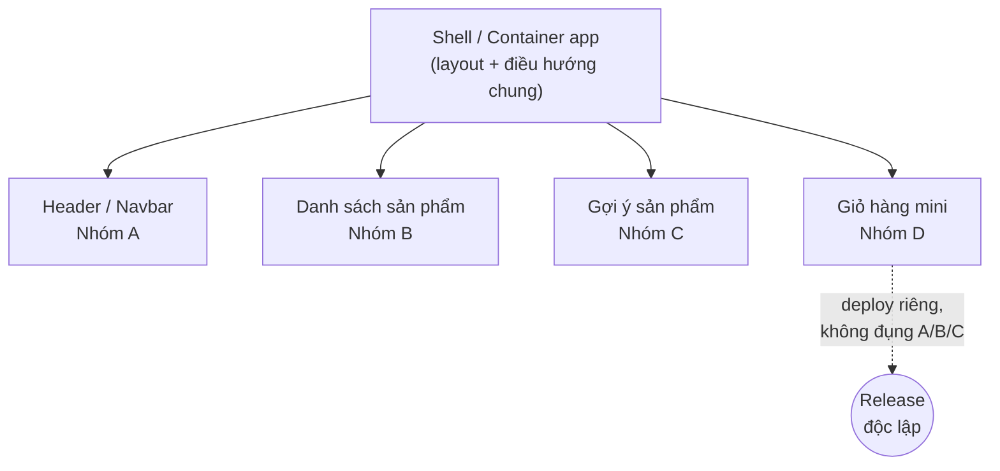

# Micro-frontend là gì?

Bài này giải thích khái niệm **micro-frontend** — vì sao nó ra đời, nó khác một
ứng dụng **monolith** (khối nguyên) thế nào, và một trang web được "ghép" từ nhiều
mảnh ra sao. Hiểu phần nền tảng này giúp bạn nắm được *vấn đề* mà micro-frontend
sinh ra để giải quyết, trước khi đi vào *cách làm* ở các bài sau.

---

:::note[Ghi nhớ nhanh]

- ⭐ **Micro-frontend chia frontend thành nhiều mảnh độc lập** — mỗi mảnh do một nhóm tự chủ phát triển và `deploy` riêng, rồi ghép thành một trang liền mạch.
- ⭐ **`Độc lập deploy` là đặc tính quan trọng nhất** — nếu các mảnh vẫn phải build/deploy cùng nhau thì chưa phải micro-frontend thật.
- **Là tư tưởng `microservices` cho frontend** — giải quyết vấn đề quy mô *tổ chức*, không phải vấn đề kỹ thuật.
- **Thường có một app "vỏ" (`shell`/container)** — lo việc tải, ghép các mảnh và điều hướng chung.
- **`Monolith` frontend** tốt cho app nhỏ nhưng gây giẫm chân, deploy rủi ro, build chậm khi nhiều nhóm cùng làm.

:::

---

## Mục lục

- [Vấn đề: frontend monolith phình to](#vấn-đề-frontend-monolith-phình-to)
- [Micro-frontend là gì?](#micro-frontend-là-gì-1)
- [Một trang ghép từ nhiều mảnh](#một-trang-ghép-từ-nhiều-mảnh)
- [Liên hệ với microservices](#liên-hệ-với-microservices)
- [Những đặc tính cốt lõi](#những-đặc-tính-cốt-lõi)
- [Tóm tắt](#tóm-tắt)
- [Câu hỏi phỏng vấn](#câu-hỏi-phỏng-vấn)

---

## Vấn đề: frontend monolith phình to

**Monolith** (khối nguyên) là khi toàn bộ ứng dụng frontend nằm trong **một
codebase**, **một lần build**, **một lần deploy**. Với app nhỏ, đây là lựa chọn
tốt nhất — đơn giản, dễ hiểu.

Nhưng khi app lớn lên và **nhiều nhóm** cùng làm trên một codebase, các vấn đề
xuất hiện:

- **Giẫm chân nhau** — nhiều nhóm cùng sửa một repo, **merge conflict** (xung đột
  khi gộp code) liên tục.
- **Deploy rủi ro** — một thay đổi nhỏ ở góc trang cũng bắt **build & deploy lại
  toàn bộ** ứng dụng; lỗi ở một chỗ có thể làm sập cả trang.
- **Kẹt công nghệ** — muốn nâng cấp framework hay đổi thư viện thì "đụng đâu vỡ
  đó", vì mọi thứ dính chặt vào nhau.
- **Build chậm** — codebase càng lớn, thời gian build/test càng lâu.

> Đây đều là **vấn đề về quy mô tổ chức**, không phải vấn đề thuần kỹ thuật. Đó là
> lý do micro-frontend chỉ thực sự đáng giá khi app *và* đội ngũ đủ lớn.

## Micro-frontend là gì?

**Micro-frontend** (vi giao diện) là kiến trúc chia ứng dụng frontend thành nhiều
**mảnh nhỏ độc lập**, mỗi mảnh:

- Phụ trách **một mảng tính năng** của trang (vd: tìm kiếm, giỏ hàng, hồ sơ
  người dùng).
- Do **một nhóm tự chủ** phát triển, kiểm thử, **deploy riêng**.
- Có thể (không bắt buộc) dùng **công nghệ riêng**.

Các mảnh này được **ghép lại lúc chạy** thành một trang web duy nhất — người dùng
hoàn toàn không biết bên dưới là nhiều ứng dụng.

> Hãy hình dung: nếu **microservices** chia *backend* thành nhiều dịch vụ nhỏ, thì
> **micro-frontend** chia *frontend* theo đúng tinh thần đó.

## Một trang ghép từ nhiều mảnh

Ví dụ một trang thương mại điện tử:

```text
┌──────────────────────────────────────────────┐
│  Header / Navbar            (Nhóm A)          │  ← micro-frontend 1
├───────────────┬──────────────────────────────┤
│               │                              │
│  Bộ lọc       │   Danh sách sản phẩm          │  ← micro-frontend 2
│  (Nhóm B)     │   (Nhóm B)                    │
│               │                              │
├───────────────┴──────────────────────────────┤
│  Gợi ý "có thể bạn thích"   (Nhóm C)          │  ← micro-frontend 3
├──────────────────────────────────────────────┤
│  Giỏ hàng mini              (Nhóm D)          │  ← micro-frontend 4
└──────────────────────────────────────────────┘
```

Mỗi vùng là một micro-frontend deploy độc lập. Nhóm D có thể cập nhật giỏ hàng và
release **mà không cần** nhóm A/B/C build lại gì cả.

> Thường có thêm một ứng dụng **"vỏ" (shell / container app)** — đóng vai trò bộ
> khung: tải các mảnh, sắp xếp layout, lo điều hướng chung. Ta sẽ gặp lại khái
> niệm shell ở phần Module Federation.

Sơ đồ dưới đây cho thấy shell là "nhạc trưởng" tải và sắp xếp các mảnh, mỗi mảnh do một nhóm sở hữu và deploy riêng:



## Liên hệ với microservices

| | Microservices (backend) | Micro-frontend (frontend) |
| --- | --- | --- |
| Chia nhỏ cái gì | Dịch vụ phía server | Giao diện phía client |
| Đơn vị độc lập | Mỗi service tự deploy | Mỗi mảnh UI tự deploy |
| Giao tiếp | Qua API/mạng | Ghép lúc build hoặc lúc runtime |
| Mục tiêu chung | Nhóm tự chủ, deploy độc lập, scale tổ chức |  |

Micro-frontend kế thừa cả **ưu điểm** (tự chủ, độc lập) lẫn **cái giá** (phức tạp
vận hành) của microservices — sẽ bàn kỹ ở bài 3 của mục này.

## Những đặc tính cốt lõi

Một kiến trúc micro-frontend "đúng nghĩa" thường hướng tới:

1. **Độc lập deploy** — đặc tính *quan trọng nhất*. Mỗi mảnh release theo nhịp
   riêng.
2. **Nhóm tự chủ** — mỗi nhóm sở hữu trọn vẹn một mảng (từ UI tới logic).
3. **Cô lập lỗi & style** — lỗi hay CSS của mảnh này không nên làm hỏng mảnh khác.
4. **Hợp đồng rõ ràng** — các mảnh giao tiếp qua giao diện đã thống nhất (props,
   sự kiện), không "thò tay" vào ruột nhau.

:::tip Độc lập deploy là thước đo thật
Nếu các "mảnh" của bạn vẫn phải build và deploy **cùng nhau**, thì đó chưa phải
micro-frontend thật — chỉ là chia thư mục cho gọn. Khả năng **deploy riêng** mới
là điểm mấu chốt.
:::

## Tóm tắt

- **Monolith frontend** gộp tất cả vào một codebase/một deploy — tốt cho app nhỏ,
  nhưng đau đầu khi nhiều nhóm và app lớn.
- **Micro-frontend** chia giao diện thành nhiều **mảnh độc lập**, mỗi mảnh do một
  nhóm tự chủ, **deploy riêng**, rồi ghép thành một trang liền mạch.
- Đây là tư tưởng **microservices áp dụng cho frontend**, giải quyết **vấn đề quy
  mô tổ chức**.
- Thường có một app **"vỏ" (shell)** lo việc ghép các mảnh và điều hướng chung.
- Đặc tính quan trọng nhất là **độc lập deploy**; kèm theo là nhóm tự chủ, cô lập
  lỗi, và hợp đồng giao tiếp rõ ràng.

Bài tiếp theo: **các cách tích hợp** các mảnh lại với nhau.

---

## Câu hỏi phỏng vấn

Những câu thường gặp về chủ đề này. Tự trả lời trước, rồi bấm **Xem đáp án** để đối chiếu.

**1. `Micro-frontend` là gì? Giải thích cho người chưa biết bằng ví dụ một trang thương mại điện tử.**

<details className="qa">
<summary>Xem đáp án</summary>

Micro-frontend là kiến trúc chia ứng dụng frontend thành nhiều **mảnh nhỏ độc lập**, mỗi mảnh phụ trách một mảng tính năng, do một nhóm tự chủ phát triển và **deploy riêng**, rồi được **ghép lại lúc chạy** thành một trang duy nhất.

Ví dụ trang thương mại điện tử:

- **Header/Navbar** — nhóm A
- **Bộ lọc + danh sách sản phẩm** — nhóm B
- **Gợi ý "có thể bạn thích"** — nhóm C
- **Giỏ hàng mini** — nhóm D

Nhóm D sửa giỏ hàng và release mà không cần A/B/C build lại gì cả. Người dùng mở trang chỉ thấy một website liền mạch, hoàn toàn không biết bên dưới là bốn ứng dụng khác nhau.

Thường có thêm một app **"vỏ" (shell/container)** đóng vai trò bộ khung: tải các mảnh, sắp xếp layout và lo điều hướng chung.

</details>

**2. Frontend `monolith` gặp những vấn đề gì khi nhiều nhóm cùng làm? Đó là vấn đề kỹ thuật hay vấn đề tổ chức?**

<details className="qa">
<summary>Xem đáp án</summary>

Monolith là toàn bộ frontend nằm trong một codebase, một lần build, một lần deploy. Khi app lớn và nhiều nhóm cùng làm:

- **Giẫm chân nhau** — nhiều nhóm sửa chung một repo, merge conflict liên tục.
- **Deploy rủi ro** — một thay đổi nhỏ ở góc trang cũng bắt build & deploy lại toàn bộ; lỗi một chỗ có thể làm sập cả trang.
- **Kẹt công nghệ** — muốn nâng cấp framework hay đổi thư viện thì "đụng đâu vỡ đó" vì mọi thứ dính chặt nhau.
- **Build chậm** — codebase càng lớn, build/test càng lâu.

Đây chủ yếu là **vấn đề về quy mô tổ chức**, không phải vấn đề thuần kỹ thuật: bản thân monolith không hề chậm hay sai, nó chỉ trở thành điểm nghẽn khi số nhóm cùng chạm vào tăng lên. Vì vậy micro-frontend chỉ đáng giá khi app *và* đội ngũ đủ lớn.

</details>

**3. Vì sao "độc lập deploy" được coi là đặc tính quan trọng nhất? Làm sao kiểm chứng hệ thống của bạn thật sự đạt được điều đó?**

<details className="qa">
<summary>Xem đáp án</summary>

Vì đó chính là thứ giải quyết vấn đề gốc: mỗi nhóm release theo nhịp riêng, không phải xếp hàng chờ nhau, không kéo cả trang vào rủi ro khi sửa một góc nhỏ. Mọi lợi ích khác (nhóm tự chủ, giảm giẫm chân, giảm thời gian build) đều là hệ quả của nó.

Cách kiểm chứng rất đơn giản: thử **deploy một mảnh mà không build lại bất kỳ mảnh nào khác**, và xem thay đổi có lên production không.

- Nếu phải build lại shell hoặc các mảnh khác → chưa độc lập.
- Nếu phải release đồng bộ nhiều repo cùng lúc → chưa độc lập.
- Nếu mỗi nhóm có pipeline riêng, artifact riêng, và trang tự lấy phiên bản mới lúc runtime → đạt.

Nếu các "mảnh" vẫn phải build và deploy cùng nhau thì đó chỉ là chia thư mục cho gọn, chưa phải micro-frontend thật.

</details>

**4. Chia thư mục hoặc dựng `monorepo` nhiều package đã phải là micro-frontend chưa? Khác nhau ở đâu?**

<details className="qa">
<summary>Xem đáp án</summary>

Chưa. Chia thư mục hay tách package trong monorepo là **tách mã nguồn**, còn micro-frontend là **tách vòng đời release**.

| Tiêu chí | Monorepo nhiều package | Micro-frontend |
| --- | --- | --- |
| Ranh giới | Thư mục / package | Ứng dụng chạy độc lập |
| Build | Một lần build chung | Mỗi mảnh build riêng |
| Deploy | Một artifact duy nhất | Nhiều artifact, release riêng nhịp |
| Khi sửa 1 mảnh | Phải phát hành lại cả app | Chỉ đẩy mảnh đó lên |

Monorepo vẫn rất tốt cho việc chia sẻ code, chuẩn hoá lint/test và refactor xuyên package — nhưng nếu cuối cùng vẫn chỉ có một lần build và một lần deploy, thì nó vẫn là monolith được sắp xếp gọn gàng. Thước đo duy nhất vẫn là: có deploy riêng được không.

</details>

**5. So sánh micro-frontend với `microservices`: điểm giống, điểm khác, và cái giá phải trả.**

<details className="qa">
<summary>Xem đáp án</summary>

Micro-frontend là tư tưởng microservices áp dụng cho tầng giao diện.

| | Microservices (backend) | Micro-frontend (frontend) |
| --- | --- | --- |
| Chia nhỏ cái gì | Dịch vụ phía server | Giao diện phía client |
| Đơn vị độc lập | Mỗi service tự deploy | Mỗi mảnh UI tự deploy |
| Giao tiếp | Qua API/mạng | Ghép lúc build hoặc lúc runtime |
| Mục tiêu chung | Nhóm tự chủ, deploy độc lập, scale tổ chức | |

**Giống:** cùng hướng tới nhóm tự chủ, ranh giới theo mảng nghiệp vụ, độc lập deploy.

**Khác:** service chạy trên nhiều tiến trình/máy riêng, còn các mảnh frontend cuối cùng vẫn **chung một tab trình duyệt** — chung DOM, chung CSS, chung bộ nhớ, chung ngân sách tải. Vì vậy cô lập khó hơn nhiều so với backend.

**Cái giá:** phức tạp vận hành, trùng lặp dependency, bundle phình, khó debug xuyên mảnh và hợp đồng giữa các mảnh phải quản lý cẩn thận.

</details>

**6. Vai trò của app `shell` (container) là gì? Nó lo những việc nào và rủi ro gì khi shell phình to?**

<details className="qa">
<summary>Xem đáp án</summary>

Shell (container app) là "nhạc trưởng" — bộ khung tải và sắp xếp các mảnh. Việc của nó:

- **Tải các micro-frontend** và quyết định mảnh nào hiển thị ở đâu.
- **Layout chung** — khung trang, vùng chứa cho từng mảnh.
- **Điều hướng chung** — route cấp cao, quyết định route nào thuộc mảnh nào.
- Các mối quan tâm xuyên suốt: xác thực, theme, cô lập lỗi khi một mảnh hỏng.

**Rủi ro khi shell phình to:** shell dần trở thành một monolith mới. Mọi nhóm đều phải sửa shell để thêm tính năng, nên nó lại thành điểm nghẽn và phải deploy liên tục — đúng thứ mà kiến trúc này muốn tránh. Nguyên tắc là giữ shell **mỏng**: chỉ lo ghép mảnh và điều hướng, đẩy logic nghiệp vụ xuống các mảnh.

</details>

**7. Kể các cách tích hợp micro-frontend (build-time, `iframe`, Web Components, `Module Federation`, server-side include) và đánh đổi của từng cách.**

<details className="qa">
<summary>Xem đáp án</summary>

| Cách | Ghép lúc nào | Đánh đổi |
| --- | --- | --- |
| Build-time (npm package) | Lúc build | Đơn giản, tối ưu tốt — nhưng **mất độc lập deploy**, phải build lại shell mỗi lần mảnh đổi |
| `iframe` | Runtime | Cô lập CSS/JS mạnh nhất — nhưng khó chia sẻ state, routing và kích thước động, UX kém |
| Web Components | Runtime | Chuẩn của trình duyệt, không phụ thuộc framework, Shadow DOM cô lập style — cần bọc thêm cho React/Vue |
| `Module Federation` | Runtime | Chia sẻ được dependency, giữ độc lập deploy, DX tốt — phụ thuộc bundler và cấu hình version |
| Server-side include / SSR | Lúc render trên server | Tốt cho SEO và first paint — cần hạ tầng server, tương tác phía client vẫn phải xử lý riêng |

Nguyên tắc chọn: ưu tiên cách đơn giản nhất đáp ứng được yêu cầu độc lập deploy. Nếu tất cả dùng chung một framework và một bundler thì Module Federation thường là lựa chọn cân bằng nhất.

</details>

**8. `Module Federation` khác `single-spa` ở điểm nào? Khi nào bạn chọn cái nào?**

<details className="qa">
<summary>Xem đáp án</summary>

Hai thứ giải quyết hai lớp vấn đề khác nhau và có thể dùng chung.

| | `Module Federation` | `single-spa` |
| --- | --- | --- |
| Bản chất | Cơ chế của bundler để **nạp module từ app khác lúc runtime** | Framework **điều phối vòng đời** các app con |
| Lo việc gì | Tải code, chia sẻ dependency | Mount/unmount app theo route |
| Phụ thuộc | Bundler (webpack/Rspack/Vite plugin) | Không phụ thuộc bundler |

Chọn **Module Federation** khi bạn kiểm soát được bundler, muốn chia sẻ `react`/`react-dom` để tránh tải trùng, và chủ yếu cần "mượn component/module" giữa các app.

Chọn **single-spa** khi cần ghép nhiều app viết bằng framework khác nhau, mỗi app có vòng đời riêng theo route.

Thực tế nhiều hệ thống dùng single-spa để điều phối và Module Federation để nạp code.

</details>

**9. Cô lập CSS giữa các mảnh làm bằng cách nào (`Shadow DOM`, CSS Modules, quy ước prefix)? Đánh đổi của mỗi cách?**

<details className="qa">
<summary>Xem đáp án</summary>

| Cách | Mức cô lập | Đánh đổi |
| --- | --- | --- |
| `Shadow DOM` | Mạnh nhất, style không rò cả hai chiều | Khó chia sẻ theme/biến chung, một số thư viện UI và portal hoạt động không đúng |
| CSS Modules / CSS-in-JS | Tốt — tên class được băm tự động | Không chặn được selector toàn cục và reset CSS của mảnh khác |
| Quy ước prefix (BEM, namespace) | Yếu nhất, dựa vào kỷ luật con người | Rẻ và dễ áp dụng, nhưng chỉ cần một người quên là rò style |

Thực tế hay kết hợp: CSS Modules cho phần lớn component, cộng thêm quy ước prefix cho class toàn cục, và cấm tuyệt đối việc một mảnh ghi đè selector toàn cục như `body` hay thẻ trần. Biến CSS (`custom properties`) là cách chia sẻ theme an toàn nhất vì chúng xuyên qua được ranh giới mà không mang theo quy tắc layout.

</details>

**10. Các mảnh giao tiếp với nhau ra sao mà không coupling chặt (custom event, props/callback từ shell, shared store)? Vì sao nên hạn chế shared global state?**

<details className="qa">
<summary>Xem đáp án</summary>

Nguyên tắc chung là các mảnh giao tiếp qua **hợp đồng rõ ràng**, không "thò tay" vào ruột nhau.

- **Props/callback từ shell** — shell truyền dữ liệu xuống và nhận callback lên. Rõ ràng nhất, hợp với quan hệ cha–con.
- **Custom event trên `window`** — mảnh này phát sự kiện, mảnh kia lắng nghe, hai bên không cần biết nhau. Hợp với thông báo kiểu "đã thêm vào giỏ".
- **Shared store** — một store dùng chung cho nhiều mảnh.

Nên **hạn chế shared global state** vì nó tạo coupling ngầm: các mảnh phải cùng biết hình dạng state, đổi một field là phải deploy đồng bộ nhiều mảnh — mất luôn tính độc lập deploy. Nó còn khiến việc debug khó hơn (ai đã sửa state?) và buộc các mảnh dùng chung một thư viện state. Nếu bắt buộc phải có, hãy giữ nó tối thiểu: chỉ dữ liệu thật sự dùng chung như người dùng đăng nhập, theme, ngôn ngữ.

</details>

**11. Xử lý dependency trùng lặp thế nào khi mỗi mảnh bundle React riêng? `Shared singleton` có rủi ro gì nếu version lệch nhau?**

<details className="qa">
<summary>Xem đáp án</summary>

Nếu mỗi mảnh tự bundle React, người dùng phải tải React nhiều lần — bundle phình và có thể xuất hiện nhiều bản React cùng chạy, làm hỏng hook và context. Cách xử lý phổ biến:

- Khai báo các thư viện lõi (`react`, `react-dom`, router) là **shared**, để chỉ một bản được tải và dùng chung.
- Đánh dấu `singleton` cho những thư viện **bắt buộc chỉ tồn tại một instance** — đặc biệt là React, vì hook dựa vào state nội bộ của chính bản React đó.
- Khai báo khoảng version chấp nhận được để bundler chọn bản phù hợp.

**Rủi ro khi version lệch:** với `singleton`, cả hệ thống buộc phải dùng một bản duy nhất, nên một mảnh cần API mới hơn có thể chạy sai hoặc cảnh báo version không tương thích. Ngược lại, nếu tắt singleton để mỗi bên tự dùng bản riêng thì lại vỡ hook/context. Thực tế phải thống nhất lịch nâng cấp React chung cho mọi nhóm — đây là ràng buộc lớn nhất của kiến trúc này.

</details>

**12. Routing giữa shell và các mảnh phân chia trách nhiệm ra sao? Deep link cùng nút back/forward xử lý thế nào?**

<details className="qa">
<summary>Xem đáp án</summary>

Chia hai tầng:

- **Shell giữ route cấp cao** — quyết định tiền tố URL nào thuộc mảnh nào, ví dụ `/cart` thuộc mảnh giỏ hàng, `/search` thuộc mảnh tìm kiếm.
- **Mỗi mảnh tự lo route con** bên trong tiền tố của mình, không được biết gì về route của mảnh khác.

Để deep link và nút back/forward hoạt động đúng, cả hệ thống phải dùng **một nguồn sự thật duy nhất là URL của trình duyệt** (History API), không được mỗi mảnh giữ state điều hướng riêng. Thực tế nghĩa là: chỉ một router instance sở hữu history, các mảnh còn lại nhận history đó từ shell thay vì tự tạo. Nếu hai router cùng ghi vào history, back sẽ nhảy sai hoặc phải bấm hai lần. Khi mở thẳng một deep link, shell phải đọc URL, tải đúng mảnh tương ứng rồi mới render — nên cần trạng thái loading cho khoảng thời gian tải mảnh đó.

</details>

**13. Cô lập lỗi: một mảnh crash thì làm sao để không sập cả trang? Bạn cài đặt cơ chế nào?**

<details className="qa">
<summary>Xem đáp án</summary>

Cô lập lỗi là một trong bốn đặc tính cốt lõi: lỗi của mảnh này không được làm hỏng mảnh khác. Cách làm:

- Bọc mỗi mảnh trong một **error boundary** ở shell, hiển thị nội dung thay thế thay vì trang trắng.
- Xử lý cả **lỗi lúc tải** mảnh (mạng lỗi, remote deploy hỏng) — có fallback hoặc ẩn khu vực đó đi.
- Gửi lỗi về hệ thống giám sát kèm nhãn của mảnh, để biết nhóm nào phải xử lý.

```jsx
<ErrorBoundary fallback={<CartUnavailable />}>
  <Suspense fallback={<Skeleton />}>
    <RemoteCart />
  </Suspense>
</ErrorBoundary>
```

Lưu ý error boundary chỉ bắt lỗi lúc render; lỗi trong event handler hoặc promise phải tự bắt. Ngoài ra nên phân loại mảnh: mảnh không thiết yếu (gợi ý sản phẩm) thì ẩn luôn, mảnh thiết yếu (giỏ hàng) thì cần thông báo rõ và cho người dùng thử lại.

</details>

**14. Mỗi nhóm dùng một framework khác nhau nghe rất hấp dẫn — thực tế bạn có khuyến khích không? Vì sao?**

<details className="qa">
<summary>Xem đáp án</summary>

Không khuyến khích. Đây là khả năng *có thể* của micro-frontend, không phải mục tiêu — bài học nói rõ mỗi mảnh "có thể (không bắt buộc) dùng công nghệ riêng".

Cái giá khi trộn framework:

- **Bundle phình** — người dùng tải cả React lẫn Vue lẫn Angular cho một trang.
- **Không chia sẻ được gì** — component chung, design system, util đều phải viết lại nhiều lần.
- **Khó luân chuyển người** — lập trình viên không sang giúp nhóm khác được.
- **Cô lập và giao tiếp phức tạp hơn** — phải bọc qua Web Components hoặc lớp adapter.

Giá trị thật của kiến trúc này là **độc lập deploy và nhóm tự chủ**, không phải tự do chọn framework. Trường hợp trộn framework hợp lý nhất là **di trú dần** một hệ thống cũ: mảnh mới viết bằng framework mới, mảnh cũ giữ nguyên, và đó là trạng thái tạm thời có lộ trình kết thúc.

</details>

**15. Micro-frontend ảnh hưởng thế nào tới bundle size, thời gian tải lần đầu và `Core Web Vitals`? Giảm thiểu bằng cách nào?**

<details className="qa">
<summary>Xem đáp án</summary>

Ảnh hưởng thường là **xấu đi** nếu không cẩn thận:

- **Bundle size** tăng do dependency trùng lặp giữa các mảnh.
- **Thời gian tải lần đầu** dài hơn vì phải tải shell trước, rồi mới biết cần tải mảnh nào — thêm một vòng mạng nối tiếp.
- **Core Web Vitals**: LCP chậm do chuỗi tải nối tiếp; CLS dễ tăng vì các mảnh xuất hiện lệch thời điểm làm layout nhảy.

Giảm thiểu:

- Khai báo **shared dependency** cho các thư viện lõi để không tải trùng.
- **Lazy load** mảnh dưới màn hình đầu, chỉ tải khi cần.
- **Preload/prefetch** manifest của các mảnh quan trọng ngay từ shell để rút ngắn chuỗi nối tiếp.
- Đặt **skeleton có kích thước cố định** cho mỗi vùng để tránh layout nhảy.
- Cân nhắc render phía server cho phần trên màn hình đầu.
- Đặt **ngân sách bundle** cho từng mảnh và giám sát bằng số liệu thực tế.

</details>

**16. Quản lý version và hợp đồng giữa shell với các remote ra sao? Nếu một remote deploy hỏng thì chuyện gì xảy ra và bạn rollback thế nào?**

<details className="qa">
<summary>Xem đáp án</summary>

Vì các mảnh được ghép **lúc chạy**, shell không biết trước nội dung của remote — nên hợp đồng phải rõ ràng và ổn định: mỗi remote chỉ phơi ra một số module đã thống nhất, với props và sự kiện cố định. Thay đổi hợp đồng phải theo kiểu cộng thêm, đổi phá vỡ thì phải phơi ra tên module mới thay vì sửa tại chỗ.

Về version, thường có hai hướng: shell trỏ tới địa chỉ "mới nhất" của remote (mảnh tự chủ hoàn toàn, nhưng rủi ro cao hơn), hoặc trỏ tới một phiên bản cố định và nâng có kiểm soát (an toàn hơn, bớt tự chủ).

**Khi một remote deploy hỏng:** trang vẫn phải sống — vùng đó hiện fallback nhờ error boundary, phần còn lại hoạt động bình thường. Rollback là **trỏ lại artifact phiên bản trước** của chính remote đó, không cần đụng tới shell hay các mảnh khác. Đây cũng chính là lợi ích của độc lập deploy: phạm vi sự cố và phạm vi rollback đều được thu hẹp.

</details>

**17. Testing và `CI/CD` của kiến trúc này khác monolith ra sao? `Integration test` chạy ở đâu và ai chịu trách nhiệm?**

<details className="qa">
<summary>Xem đáp án</summary>

Khác biệt lớn nhất: monolith có **một pipeline** kiểm thử toàn bộ trước khi deploy; micro-frontend có **nhiều pipeline độc lập**, và không bao giờ có thời điểm mọi mảnh được test cùng nhau trước khi ra production.

Cách tổ chức thường thấy:

- **Unit/component test** — mỗi nhóm tự chạy trong pipeline của mình, chặn merge nếu hỏng.
- **Contract test** — kiểm tra mảnh vẫn phơi ra đúng module và đúng hình dạng props/sự kiện đã cam kết. Đây là lớp thay thế cho việc build chung.
- **Integration/E2E test** — chạy trên một môi trường đã ghép đầy đủ shell và các mảnh, sau khi deploy chứ không phải trước.

Trách nhiệm: mỗi nhóm chịu trách nhiệm test mảnh của mình và không phá hợp đồng; nhóm sở hữu shell (hoặc nhóm nền tảng) chịu trách nhiệm bộ E2E cho các luồng xuyên mảnh. Kèm theo cần giám sát production và khả năng rollback nhanh, vì test trước deploy không còn phủ được toàn hệ thống.

</details>

**18. Khi nào KHÔNG nên dùng micro-frontend? Ngưỡng nào về số nhóm và quy mô app thì đánh đổi mới đáng?**

<details className="qa">
<summary>Xem đáp án</summary>

Không nên dùng khi:

- **App nhỏ, một nhóm làm** — monolith là lựa chọn tốt nhất: đơn giản, dễ hiểu, build nhanh.
- Vấn đề thật ra là **code lộn xộn**, không phải xung đột giữa các nhóm — cái cần là refactor và tách module, không phải tách deploy.
- Đội chưa có **hạ tầng CI/CD, giám sát, rollback** đủ mạnh — micro-frontend sẽ nhân số mảnh cần vận hành lên nhiều lần.
- Sản phẩm cần **first load cực nhanh** và không chịu được chi phí tải nối tiếp.

Về ngưỡng, không có con số tuyệt đối, chỉ có tín hiệu: từ khoảng **ba nhóm trở lên cùng chạm vào một codebase**, merge conflict và lịch release bắt đầu chặn nhau, build chậm tới mức làm chậm vòng phản hồi. Nói cách khác, dùng micro-frontend khi **chi phí phối hợp giữa các nhóm đã lớn hơn chi phí vận hành nhiều ứng dụng** — vì đây là giải pháp cho vấn đề tổ chức, không phải vấn đề kỹ thuật.

</details>
