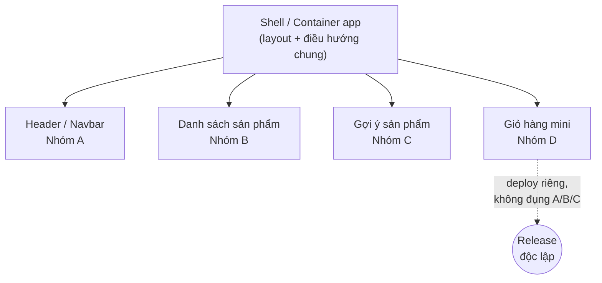

# Micro-frontend là gì?

Bài này giải thích khái niệm **micro-frontend** — vì sao nó ra đời, nó khác một
ứng dụng **monolith** (khối nguyên) thế nào, và một trang web được "ghép" từ nhiều
mảnh ra sao. Hiểu phần nền tảng này giúp bạn nắm được *vấn đề* mà micro-frontend
sinh ra để giải quyết, trước khi đi vào *cách làm* ở các bài sau.

---

:::note[Ghi nhớ nhanh]

- ⭐ **Micro-frontend chia frontend thành nhiều mảnh độc lập** — mỗi mảnh do một nhóm tự chủ phát triển và `deploy` riêng, rồi ghép thành một trang liền mạch.
- ⭐ **`Độc lập deploy` là đặc tính quan trọng nhất** — nếu các mảnh vẫn phải build/deploy cùng nhau thì chưa phải micro-frontend thật.
- **Là tư tưởng `microservices` cho frontend** — giải quyết vấn đề quy mô *tổ chức*, không phải vấn đề kỹ thuật.
- **Thường có một app "vỏ" (`shell`/container)** — lo việc tải, ghép các mảnh và điều hướng chung.
- **`Monolith` frontend** tốt cho app nhỏ nhưng gây giẫm chân, deploy rủi ro, build chậm khi nhiều nhóm cùng làm.

:::

---

## Mục lục

- [Vấn đề: frontend monolith phình to](#vấn-đề-frontend-monolith-phình-to)
- [Micro-frontend là gì?](#micro-frontend-là-gì-1)
- [Một trang ghép từ nhiều mảnh](#một-trang-ghép-từ-nhiều-mảnh)
- [Liên hệ với microservices](#liên-hệ-với-microservices)
- [Những đặc tính cốt lõi](#những-đặc-tính-cốt-lõi)
- [Tóm tắt](#tóm-tắt)

---

## Vấn đề: frontend monolith phình to

**Monolith** (khối nguyên) là khi toàn bộ ứng dụng frontend nằm trong **một
codebase**, **một lần build**, **một lần deploy**. Với app nhỏ, đây là lựa chọn
tốt nhất — đơn giản, dễ hiểu.

Nhưng khi app lớn lên và **nhiều nhóm** cùng làm trên một codebase, các vấn đề
xuất hiện:

- **Giẫm chân nhau** — nhiều nhóm cùng sửa một repo, **merge conflict** (xung đột
  khi gộp code) liên tục.
- **Deploy rủi ro** — một thay đổi nhỏ ở góc trang cũng bắt **build & deploy lại
  toàn bộ** ứng dụng; lỗi ở một chỗ có thể làm sập cả trang.
- **Kẹt công nghệ** — muốn nâng cấp framework hay đổi thư viện thì "đụng đâu vỡ
  đó", vì mọi thứ dính chặt vào nhau.
- **Build chậm** — codebase càng lớn, thời gian build/test càng lâu.

> Đây đều là **vấn đề về quy mô tổ chức**, không phải vấn đề thuần kỹ thuật. Đó là
> lý do micro-frontend chỉ thực sự đáng giá khi app *và* đội ngũ đủ lớn.

## Micro-frontend là gì?

**Micro-frontend** (vi giao diện) là kiến trúc chia ứng dụng frontend thành nhiều
**mảnh nhỏ độc lập**, mỗi mảnh:

- Phụ trách **một mảng tính năng** của trang (vd: tìm kiếm, giỏ hàng, hồ sơ
  người dùng).
- Do **một nhóm tự chủ** phát triển, kiểm thử, **deploy riêng**.
- Có thể (không bắt buộc) dùng **công nghệ riêng**.

Các mảnh này được **ghép lại lúc chạy** thành một trang web duy nhất — người dùng
hoàn toàn không biết bên dưới là nhiều ứng dụng.

> Hãy hình dung: nếu **microservices** chia *backend* thành nhiều dịch vụ nhỏ, thì
> **micro-frontend** chia *frontend* theo đúng tinh thần đó.

## Một trang ghép từ nhiều mảnh

Ví dụ một trang thương mại điện tử:

```text
┌──────────────────────────────────────────────┐
│  Header / Navbar            (Nhóm A)          │  ← micro-frontend 1
├───────────────┬──────────────────────────────┤
│               │                              │
│  Bộ lọc       │   Danh sách sản phẩm          │  ← micro-frontend 2
│  (Nhóm B)     │   (Nhóm B)                    │
│               │                              │
├───────────────┴──────────────────────────────┤
│  Gợi ý "có thể bạn thích"   (Nhóm C)          │  ← micro-frontend 3
├──────────────────────────────────────────────┤
│  Giỏ hàng mini              (Nhóm D)          │  ← micro-frontend 4
└──────────────────────────────────────────────┘
```

Mỗi vùng là một micro-frontend deploy độc lập. Nhóm D có thể cập nhật giỏ hàng và
release **mà không cần** nhóm A/B/C build lại gì cả.

> Thường có thêm một ứng dụng **"vỏ" (shell / container app)** — đóng vai trò bộ
> khung: tải các mảnh, sắp xếp layout, lo điều hướng chung. Ta sẽ gặp lại khái
> niệm shell ở phần Module Federation.

Sơ đồ dưới đây cho thấy shell là "nhạc trưởng" tải và sắp xếp các mảnh, mỗi mảnh do một nhóm sở hữu và deploy riêng:



## Liên hệ với microservices

| | Microservices (backend) | Micro-frontend (frontend) |
| --- | --- | --- |
| Chia nhỏ cái gì | Dịch vụ phía server | Giao diện phía client |
| Đơn vị độc lập | Mỗi service tự deploy | Mỗi mảnh UI tự deploy |
| Giao tiếp | Qua API/mạng | Ghép lúc build hoặc lúc runtime |
| Mục tiêu chung | Nhóm tự chủ, deploy độc lập, scale tổ chức |  |

Micro-frontend kế thừa cả **ưu điểm** (tự chủ, độc lập) lẫn **cái giá** (phức tạp
vận hành) của microservices — sẽ bàn kỹ ở bài 3 của mục này.

## Những đặc tính cốt lõi

Một kiến trúc micro-frontend "đúng nghĩa" thường hướng tới:

1. **Độc lập deploy** — đặc tính *quan trọng nhất*. Mỗi mảnh release theo nhịp
   riêng.
2. **Nhóm tự chủ** — mỗi nhóm sở hữu trọn vẹn một mảng (từ UI tới logic).
3. **Cô lập lỗi & style** — lỗi hay CSS của mảnh này không nên làm hỏng mảnh khác.
4. **Hợp đồng rõ ràng** — các mảnh giao tiếp qua giao diện đã thống nhất (props,
   sự kiện), không "thò tay" vào ruột nhau.

:::tip Độc lập deploy là thước đo thật
Nếu các "mảnh" của bạn vẫn phải build và deploy **cùng nhau**, thì đó chưa phải
micro-frontend thật — chỉ là chia thư mục cho gọn. Khả năng **deploy riêng** mới
là điểm mấu chốt.
:::

## Tóm tắt

- **Monolith frontend** gộp tất cả vào một codebase/một deploy — tốt cho app nhỏ,
  nhưng đau đầu khi nhiều nhóm và app lớn.
- **Micro-frontend** chia giao diện thành nhiều **mảnh độc lập**, mỗi mảnh do một
  nhóm tự chủ, **deploy riêng**, rồi ghép thành một trang liền mạch.
- Đây là tư tưởng **microservices áp dụng cho frontend**, giải quyết **vấn đề quy
  mô tổ chức**.
- Thường có một app **"vỏ" (shell)** lo việc ghép các mảnh và điều hướng chung.
- Đặc tính quan trọng nhất là **độc lập deploy**; kèm theo là nhóm tự chủ, cô lập
  lỗi, và hợp đồng giao tiếp rõ ràng.

Bài tiếp theo: **các cách tích hợp** các mảnh lại với nhau.
