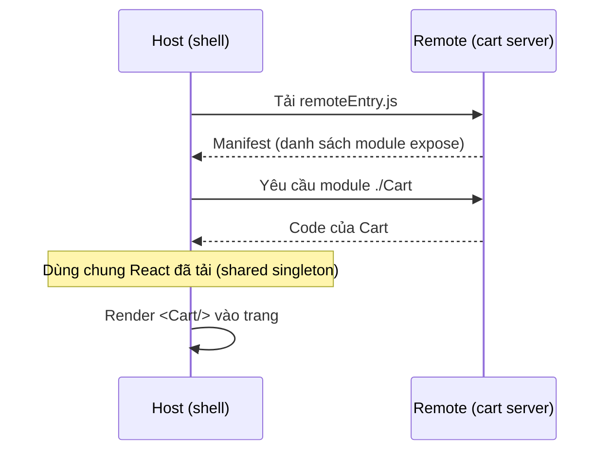

# Module Federation là gì?

**Module Federation** là kỹ thuật cho phép một ứng dụng JavaScript **tải code từ
một ứng dụng khác lúc runtime** (lúc chạy), đồng thời **chia sẻ thư viện chung**
(như React) để tránh tải trùng. Đây là nền tảng phổ biến nhất để xây
micro-frontend kiểu runtime. Bài này giải thích các khái niệm cốt lõi —
**host/remote**, **exposes/remotes**, **shared** — trước khi vào demo thực hành ở
bài sau.

---

:::note[Ghi nhớ nhanh]

- ⭐ **`Module Federation` cho phép tải code app khác lúc `runtime` + chia sẻ thư viện chung** — ngay tại tầng bundler (Webpack 5, Rspack, Vite...).
- ⭐ **`shared` + `singleton` (nhất là React)** tránh tải trùng và lỗi đa-bản (*"Invalid hook call"*).
- **`Remote` *expose* module, `Host` *remotes* (tiêu thụ) chúng** — một app có thể đóng cả hai vai.
- **Ba trường cấu hình cốt lõi**: `exposes` (remote mở gì), `remotes` (host dùng ai), `shared` (chia sẻ thư viện).
- **Mỗi remote sinh `remoteEntry.js` làm cửa ngõ** — host chỉ cần URL của nó nên remote `deploy` độc lập được.
- **`Module Federation 2.0`** (`@module-federation/enhanced`) thêm manifest, type hinting và hỗ trợ nhiều bundler.

:::

---

## Mục lục

- [Vấn đề Module Federation giải quyết](#vấn-đề-module-federation-giải-quyết)
- [Host và Remote](#host-và-remote)
- [Ba khái niệm cấu hình: exposes, remotes, shared](#ba-khái-niệm-cấu-hình-exposes-remotes-shared)
- [remoteEntry.js — cửa ngõ của một remote](#remoteentryjs--cửa-ngõ-của-một-remote)
- [Chia sẻ dependency & singleton](#chia-sẻ-dependency--singleton)
- [Module Federation 2.0](#module-federation-20)
- [Tóm tắt](#tóm-tắt)

---

## Vấn đề Module Federation giải quyết

Ở bài "Các cách tích hợp", cách **runtime qua JavaScript** là linh hoạt nhất
nhưng có hai bài toán khó:

1. Làm sao một app **tải được code** của app khác lúc chạy, một cách gọn gàng?
2. Làm sao **không tải trùng** React (và các thư viện lớn) ở mỗi mảnh?

**Module Federation** (ra đời cùng **Webpack 5**, nay có cả cho Rspack, Vite...)
giải quyết đúng hai bài toán này ở tầng **bundler** (công cụ đóng gói code).

## Host và Remote

Module Federation có hai vai trò:

| Vai trò | Vai trò là gì | Ví dụ |
| --- | --- | --- |
| **Remote** | App **cung cấp** (expose) module ra ngoài | App "giỏ hàng" xuất ra component `Cart` |
| **Host** | App **tiêu thụ** (consume) module từ remote | App "vỏ" tải `Cart` về và render |

> Một app có thể **vừa là host vừa là remote** — vừa cung cấp module của mình, vừa
> dùng module của app khác. Trong micro-frontend, app **"vỏ" (shell)** thường là
> host chính, còn mỗi mảnh là một remote.

```text
   HOST (shell)                         REMOTE (cart)
   ┌──────────────┐   tải lúc runtime   ┌──────────────┐
   │  remotes: {  │ ──────────────────► │  exposes: {  │
   │   cart: ...  │                     │   ./Cart     │
   │  }           │ ◄────────────────── │  }           │
   └──────────────┘   trả về <Cart/>    └──────────────┘
```

## Ba khái niệm cấu hình: exposes, remotes, shared

Toàn bộ Module Federation xoay quanh **ba trường** trong cấu hình plugin:

- **`exposes`** — (ở remote) khai báo module nào được "mở ra" cho bên ngoài dùng.
- **`remotes`** — (ở host) khai báo những remote nào app này sẽ tải về.
- **`shared`** — (ở cả hai) khai báo thư viện dùng chung để **chia sẻ thay vì tải
  trùng** (vd `react`, `react-dom`).

```js
// Ở REMOTE: mở component Button ra ngoài
exposes: {
  './Button': './src/Button',
}

// Ở HOST: khai báo sẽ dùng remote tên "ui"
remotes: {
  ui: 'ui@http://localhost:3001/remoteEntry.js',
}

// Ở CẢ HAI: chia sẻ React
shared: { react: { singleton: true }, 'react-dom': { singleton: true } }
```

## remoteEntry.js — cửa ngõ của một remote

Mỗi remote, khi build, sinh ra một file đặc biệt thường tên **`remoteEntry.js`**.
Đây là **bản kê khai (manifest)**: nó liệt kê remote này expose những gì và tải
chúng ra sao.

Host chỉ cần biết **URL của `remoteEntry.js`** là có thể tải module của remote về
lúc chạy:

```text
ui@http://localhost:3001/remoteEntry.js
└┬┘ └──────────────┬──────────────────┘
 │                 └─ URL tới file manifest của remote
 └─ tên (name) của remote, khớp với "name" khai trong plugin của remote
```

> Vì host tải `remoteEntry.js` **lúc runtime**, remote có thể được **deploy lại
> độc lập**: chỉ cần URL giữ nguyên, host tự động nhận bản mới ở lần tải sau — đây
> chính là **độc lập deploy** mà micro-frontend hướng tới.

Toàn bộ quá trình host lấy component `Cart` từ remote diễn ra lúc chạy như sau:



## Chia sẻ dependency & singleton

Nếu host và 4 remote đều dùng React, mà mỗi bên tải React riêng thì trang sẽ tải
React **5 lần** — rất nặng, và còn gây lỗi (vd nhiều bản React khác nhau làm hỏng
hook).

Trường **`shared`** giải quyết: các app **dùng chung một bản** thư viện đã tải.
Vài tuỳ chọn quan trọng:

| Tuỳ chọn | Ý nghĩa |
| --- | --- |
| `singleton: true` | Toàn trang chỉ dùng **một thực thể duy nhất** của thư viện (bắt buộc cho React để hook hoạt động đúng) |
| `requiredVersion` | Phiên bản yêu cầu; giúp cảnh báo khi lệch version |
| `eager: true` | Đưa thư viện vào bundle ngay (không tải bất đồng bộ) — dùng thận trọng vì làm nặng bundle ban đầu |

:::warning React phải là singleton
React và `react-dom` gần như luôn cần `singleton: true`. Nếu để mỗi mảnh chạy bản
React riêng, bạn sẽ gặp lỗi hook khó hiểu (vd *"Invalid hook call"*).
:::

## Module Federation 2.0

Phiên bản gốc đi cùng Webpack 5. **Module Federation 2.0** (qua package
**`@module-federation/enhanced`**) bổ sung nhiều thứ hữu ích:

- **Manifest** chuẩn hoá + **Federation Runtime** để tải module linh hoạt hơn.
- **Gợi ý kiểu (type hinting)** tự động cho TypeScript giữa các app.
- **Hệ thống plugin runtime** để mở rộng.
- Hỗ trợ nhiều bundler: **Webpack, Rspack, Vite** (qua plugin tương ứng).

> Ở demo bài sau ta dùng cấu hình Webpack 5 kinh điển cho dễ hiểu; khi làm dự án
> thật, hãy cân nhắc `@module-federation/enhanced` để có thêm manifest và type
> safety.

## Tóm tắt

- **Module Federation** cho phép một app **tải code app khác lúc runtime** và
  **chia sẻ thư viện chung**, ngay tại tầng bundler (Webpack 5, Rspack, Vite...).
- **Remote** *expose* module; **Host** *remotes* (tiêu thụ) chúng. Một app có thể
  đóng cả hai vai.
- Ba trường cốt lõi: **`exposes`** (remote mở gì), **`remotes`** (host dùng ai),
  **`shared`** (chia sẻ thư viện).
- Mỗi remote sinh **`remoteEntry.js`** làm cửa ngõ; host chỉ cần URL của nó →
  remote **deploy độc lập** được.
- **`shared` + `singleton`** tránh tải trùng và lỗi đa-bản React.
- **Module Federation 2.0** (`@module-federation/enhanced`) thêm manifest, type
  hinting, plugin runtime, hỗ trợ nhiều bundler.

Bài tiếp theo: **demo thực hành** dựng host + remote với React.
