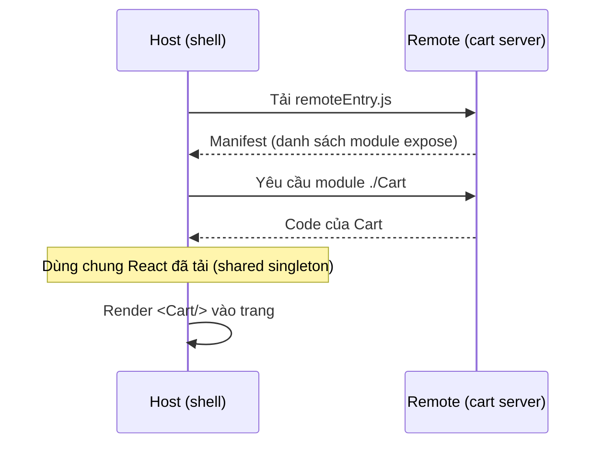

# Module Federation là gì?

**Module Federation** là kỹ thuật cho phép một ứng dụng JavaScript **tải code từ
một ứng dụng khác lúc runtime** (lúc chạy), đồng thời **chia sẻ thư viện chung**
(như React) để tránh tải trùng. Đây là nền tảng phổ biến nhất để xây
micro-frontend kiểu runtime. Bài này giải thích các khái niệm cốt lõi —
**host/remote**, **exposes/remotes**, **shared** — trước khi vào demo thực hành ở
bài sau.

---

:::note[Ghi nhớ nhanh]

- ⭐ **`Module Federation` cho phép tải code app khác lúc `runtime` + chia sẻ thư viện chung** — ngay tại tầng bundler (Webpack 5, Rspack, Vite...).
- ⭐ **`shared` + `singleton` (nhất là React)** tránh tải trùng và lỗi đa-bản (*"Invalid hook call"*).
- **`Remote` *expose* module, `Host` *remotes* (tiêu thụ) chúng** — một app có thể đóng cả hai vai.
- **Ba trường cấu hình cốt lõi**: `exposes` (remote mở gì), `remotes` (host dùng ai), `shared` (chia sẻ thư viện).
- **Mỗi remote sinh `remoteEntry.js` làm cửa ngõ** — host chỉ cần URL của nó nên remote `deploy` độc lập được.
- **`Module Federation 2.0`** (`@module-federation/enhanced`) thêm manifest, type hinting và hỗ trợ nhiều bundler.

:::

---

## Mục lục

- [Vấn đề Module Federation giải quyết](#vấn-đề-module-federation-giải-quyết)
- [Host và Remote](#host-và-remote)
- [Ba khái niệm cấu hình: exposes, remotes, shared](#ba-khái-niệm-cấu-hình-exposes-remotes-shared)
- [remoteEntry.js — cửa ngõ của một remote](#remoteentryjs--cửa-ngõ-của-một-remote)
- [Chia sẻ dependency & singleton](#chia-sẻ-dependency--singleton)
- [Module Federation 2.0](#module-federation-20)
- [Tóm tắt](#tóm-tắt)
- [Câu hỏi phỏng vấn](#câu-hỏi-phỏng-vấn)

---

## Vấn đề Module Federation giải quyết

Ở bài "Các cách tích hợp", cách **runtime qua JavaScript** là linh hoạt nhất
nhưng có hai bài toán khó:

1. Làm sao một app **tải được code** của app khác lúc chạy, một cách gọn gàng?
2. Làm sao **không tải trùng** React (và các thư viện lớn) ở mỗi mảnh?

**Module Federation** (ra đời cùng **Webpack 5**, nay có cả cho Rspack, Vite...)
giải quyết đúng hai bài toán này ở tầng **bundler** (công cụ đóng gói code).

## Host và Remote

Module Federation có hai vai trò:

| Vai trò | Vai trò là gì | Ví dụ |
| --- | --- | --- |
| **Remote** | App **cung cấp** (expose) module ra ngoài | App "giỏ hàng" xuất ra component `Cart` |
| **Host** | App **tiêu thụ** (consume) module từ remote | App "vỏ" tải `Cart` về và render |

> Một app có thể **vừa là host vừa là remote** — vừa cung cấp module của mình, vừa
> dùng module của app khác. Trong micro-frontend, app **"vỏ" (shell)** thường là
> host chính, còn mỗi mảnh là một remote.

```text
   HOST (shell)                         REMOTE (cart)
   ┌──────────────┐   tải lúc runtime   ┌──────────────┐
   │  remotes: {  │ ──────────────────► │  exposes: {  │
   │   cart: ...  │                     │   ./Cart     │
   │  }           │ ◄────────────────── │  }           │
   └──────────────┘   trả về <Cart/>    └──────────────┘
```

## Ba khái niệm cấu hình: exposes, remotes, shared

Toàn bộ Module Federation xoay quanh **ba trường** trong cấu hình plugin:

- **`exposes`** — (ở remote) khai báo module nào được "mở ra" cho bên ngoài dùng.
- **`remotes`** — (ở host) khai báo những remote nào app này sẽ tải về.
- **`shared`** — (ở cả hai) khai báo thư viện dùng chung để **chia sẻ thay vì tải
  trùng** (vd `react`, `react-dom`).

```js
// Ở REMOTE: mở component Button ra ngoài
exposes: {
  './Button': './src/Button',
}

// Ở HOST: khai báo sẽ dùng remote tên "ui"
remotes: {
  ui: 'ui@http://localhost:3001/remoteEntry.js',
}

// Ở CẢ HAI: chia sẻ React
shared: { react: { singleton: true }, 'react-dom': { singleton: true } }
```

## remoteEntry.js — cửa ngõ của một remote

Mỗi remote, khi build, sinh ra một file đặc biệt thường tên **`remoteEntry.js`**.
Đây là **bản kê khai (manifest)**: nó liệt kê remote này expose những gì và tải
chúng ra sao.

Host chỉ cần biết **URL của `remoteEntry.js`** là có thể tải module của remote về
lúc chạy:

```text
ui@http://localhost:3001/remoteEntry.js
└┬┘ └──────────────┬──────────────────┘
 │                 └─ URL tới file manifest của remote
 └─ tên (name) của remote, khớp với "name" khai trong plugin của remote
```

> Vì host tải `remoteEntry.js` **lúc runtime**, remote có thể được **deploy lại
> độc lập**: chỉ cần URL giữ nguyên, host tự động nhận bản mới ở lần tải sau — đây
> chính là **độc lập deploy** mà micro-frontend hướng tới.

Toàn bộ quá trình host lấy component `Cart` từ remote diễn ra lúc chạy như sau:



## Chia sẻ dependency & singleton

Nếu host và 4 remote đều dùng React, mà mỗi bên tải React riêng thì trang sẽ tải
React **5 lần** — rất nặng, và còn gây lỗi (vd nhiều bản React khác nhau làm hỏng
hook).

Trường **`shared`** giải quyết: các app **dùng chung một bản** thư viện đã tải.
Vài tuỳ chọn quan trọng:

| Tuỳ chọn | Ý nghĩa |
| --- | --- |
| `singleton: true` | Toàn trang chỉ dùng **một thực thể duy nhất** của thư viện (bắt buộc cho React để hook hoạt động đúng) |
| `requiredVersion` | Phiên bản yêu cầu; giúp cảnh báo khi lệch version |
| `eager: true` | Đưa thư viện vào bundle ngay (không tải bất đồng bộ) — dùng thận trọng vì làm nặng bundle ban đầu |

:::warning React phải là singleton
React và `react-dom` gần như luôn cần `singleton: true`. Nếu để mỗi mảnh chạy bản
React riêng, bạn sẽ gặp lỗi hook khó hiểu (vd *"Invalid hook call"*).
:::

## Module Federation 2.0

Phiên bản gốc đi cùng Webpack 5. **Module Federation 2.0** (qua package
**`@module-federation/enhanced`**) bổ sung nhiều thứ hữu ích:

- **Manifest** chuẩn hoá + **Federation Runtime** để tải module linh hoạt hơn.
- **Gợi ý kiểu (type hinting)** tự động cho TypeScript giữa các app.
- **Hệ thống plugin runtime** để mở rộng.
- Hỗ trợ nhiều bundler: **Webpack, Rspack, Vite** (qua plugin tương ứng).

> Ở demo bài sau ta dùng cấu hình Webpack 5 kinh điển cho dễ hiểu; khi làm dự án
> thật, hãy cân nhắc `@module-federation/enhanced` để có thêm manifest và type
> safety.

## Tóm tắt

- **Module Federation** cho phép một app **tải code app khác lúc runtime** và
  **chia sẻ thư viện chung**, ngay tại tầng bundler (Webpack 5, Rspack, Vite...).
- **Remote** *expose* module; **Host** *remotes* (tiêu thụ) chúng. Một app có thể
  đóng cả hai vai.
- Ba trường cốt lõi: **`exposes`** (remote mở gì), **`remotes`** (host dùng ai),
  **`shared`** (chia sẻ thư viện).
- Mỗi remote sinh **`remoteEntry.js`** làm cửa ngõ; host chỉ cần URL của nó →
  remote **deploy độc lập** được.
- **`shared` + `singleton`** tránh tải trùng và lỗi đa-bản React.
- **Module Federation 2.0** (`@module-federation/enhanced`) thêm manifest, type
  hinting, plugin runtime, hỗ trợ nhiều bundler.

Bài tiếp theo: **demo thực hành** dựng host + remote với React.

---

## Câu hỏi phỏng vấn

Những câu thường gặp về chủ đề này. Tự trả lời trước, rồi bấm **Xem đáp án** để đối chiếu.

**1. `Module Federation` giải quyết hai bài toán nào của cách tích hợp runtime? Vì sao phải giải ở tầng bundler?**

<details className="qa">
<summary>Xem đáp án</summary>

Hai bài toán:

1. Làm sao một app **tải được code** của app khác lúc chạy, một cách gọn gàng.
2. Làm sao **không tải trùng** React và các thư viện lớn ở mỗi mảnh.

Phải giải ở tầng **bundler** vì chính bundler mới là nơi biết mọi thứ cần thiết: nó quyết định code được chia thành những chunk nào, module nào phụ thuộc module nào, và tên module được ánh xạ ra sao sau khi đóng gói. Tự viết tay bằng `import()` động thì bạn chỉ tải được file, còn việc "hai app đang dùng chung một bản React" thì không cách nào biết — vì sau khi build, mỗi bên đã nhúng React vào bundle của mình rồi.

Module Federation can thiệp đúng vào lúc build để chừa lại chỗ trống cho các module dùng chung, rồi lúc chạy mới khớp chúng lại với nhau qua một "kho chia sẻ" (shared scope).

</details>

**2. Phân biệt `host` và `remote`. Khi nào một app vừa đóng vai host vừa đóng vai remote?**

<details className="qa">
<summary>Xem đáp án</summary>

| Vai trò | Vai trò là gì | Ví dụ |
| --- | --- | --- |
| **Remote** | App **cung cấp** (expose) module ra ngoài | App "giỏ hàng" xuất ra component `Cart` |
| **Host** | App **tiêu thụ** (consume) module từ remote | App "vỏ" tải `Cart` về và render |

Đây là **vai trò**, không phải loại app — một app khai `exposes` là remote, khai `remotes` là host, và khai cả hai thì đóng cả hai vai.

Trường hợp thường gặp: trong micro-frontend, shell là host chính và mỗi mảnh là một remote. Nhưng mảnh "giỏ hàng" có thể vừa expose component `Cart` cho shell, vừa tiêu thụ component `ProductCard` từ mảnh "sản phẩm" — lúc đó nó vừa là remote vừa là host. Ngoài ra, khi chạy độc lập lúc phát triển, một remote thường cũng là host của chính nó để render app đầy đủ.

</details>

**3. Ba trường `exposes`, `remotes`, `shared` được khai ở đâu và mỗi trường làm gì?**

<details className="qa">
<summary>Xem đáp án</summary>

- **`exposes`** — khai ở **remote**: module nào được "mở ra" cho bên ngoài dùng.
- **`remotes`** — khai ở **host**: những remote nào app này sẽ tải về.
- **`shared`** — khai ở **cả hai**: thư viện dùng chung để chia sẻ thay vì tải trùng.

```js
// Ở REMOTE: mở component Button ra ngoài
exposes: {
  './Button': './src/Button',
}

// Ở HOST: khai báo sẽ dùng remote tên "ui"
remotes: {
  ui: 'ui@http://localhost:3001/remoteEntry.js',
}

// Ở CẢ HAI: chia sẻ React
shared: { react: { singleton: true }, 'react-dom': { singleton: true } }
```

Lưu ý `shared` phải khai ở cả hai phía mới có tác dụng: nếu chỉ host khai, remote vẫn tự đóng gói React của riêng nó. Ngoài ra `name` của mỗi app cũng bắt buộc, vì nó là định danh để host gọi tới remote.

</details>

**4. `remoteEntry.js` chứa những gì, host dùng nó ra sao, và vì sao nhờ nó mà remote deploy độc lập được?**

<details className="qa">
<summary>Xem đáp án</summary>

`remoteEntry.js` là file được sinh ra khi remote build, đóng vai trò **bản kê khai (manifest)** kiêm cửa ngõ: nó liệt kê remote này expose những module nào, các module đó nằm ở chunk nào, và khai báo những thư viện mà remote sẵn sàng đưa vào kho chia sẻ.

Host chỉ cần biết **URL của file này**. Lúc chạy, host tải `remoteEntry.js` về, khởi tạo shared scope, rồi yêu cầu đúng module mình cần — remote trả về code của module đó.

Vì host chỉ giữ **URL** chứ không giữ code, remote có thể build và deploy lại bất cứ lúc nào: chỉ cần URL giữ nguyên, host tự động nhận bản mới ở lần tải sau mà không phải build lại gì cả. Đây chính là cơ chế tạo ra **độc lập deploy** — đặc tính cốt lõi của micro-frontend.

</details>

**5. Trong chuỗi `ui@http://localhost:3001/remoteEntry.js`, phần trước dấu `@` là gì và phải khớp với khai báo nào bên remote?**

<details className="qa">
<summary>Xem đáp án</summary>

Phần trước dấu `@` là **tên (name) của remote**, phần sau là **URL tới file manifest** của nó:

```text
ui@http://localhost:3001/remoteEntry.js
└┬┘ └──────────────┬──────────────────┘
 │                 └─ URL tới file manifest của remote
 └─ tên (name) của remote
```

Tên này phải **khớp chính xác với trường `name`** khai trong plugin Module Federation ở phía remote. Lý do: khi `remoteEntry.js` được tải về, nó tự đăng ký một biến toàn cục theo đúng cái tên đó; host tìm remote qua chính biến ấy. Nếu hai bên đặt tên lệch nhau, host tải file về thành công nhưng không tìm thấy remote và báo lỗi kiểu "không định nghĩa" — một lỗi rất hay gặp và dễ nhầm với lỗi mạng.

Còn khoá bên trái trong `remotes` (ở ví dụ cũng là `ui`) là bí danh dùng khi `import`, không bắt buộc trùng tên remote.

</details>

**6. Cơ chế `shared` hoạt động thế nào — khi cả host và remote cùng cung cấp một thư viện thì bản nào được dùng?**

<details className="qa">
<summary>Xem đáp án</summary>

Bundler không nhúng cứng thư viện đã khai `shared` vào chỗ dùng, mà thay bằng một lời gọi tra cứu tới **shared scope** — một kho chung nằm trong bộ nhớ trang.

Lúc chạy, mỗi app (host và từng remote) **đăng ký bản thư viện của mình kèm số phiên bản** vào kho đó. Khi một module cần `react`, nó hỏi kho thay vì dùng bản riêng, và kho trả về bản **phiên bản cao nhất thoả mãn yêu cầu** của bên đang hỏi. Các bản còn lại nằm im, không được tải chunk về.

Với `singleton: true`, kho chỉ giữ **một thực thể duy nhất** cho toàn trang, nên mọi app bắt buộc dùng chung bản đó; nếu có bên yêu cầu phiên bản không tương thích, bundler ghi cảnh báo nhưng vẫn chạy tiếp.

Nếu bên nào **không khai** thư viện đó là shared, bên đó sẽ dùng bản riêng đã đóng gói sẵn — và bạn lại có nhiều bản React trên cùng một trang.

</details>

**7. `singleton: true` nghĩa là gì? Vì sao `react` và `react-dom` gần như luôn cần, và chuyện gì xảy ra nếu thiếu?**

<details className="qa">
<summary>Xem đáp án</summary>

`singleton: true` nghĩa là **toàn trang chỉ dùng một thực thể duy nhất** của thư viện, kể cả khi các app khai những phiên bản khác nhau.

React cần điều này vì hook không phải hàm thuần: khi bạn gọi `useState`, React ghi vào **state nội bộ của chính bản React đang render**. Nếu component đến từ remote dùng bản React khác với bản đang render cây component, lời gọi hook rơi vào một bản không đang render — React không tìm thấy ngữ cảnh và báo lỗi. `react-dom` cũng phải đi cùng bản với `react` vì hai gói này chia sẻ nội bộ với nhau.

Nếu thiếu `singleton`, triệu chứng điển hình là lỗi *"Invalid hook call"*, ngoài ra còn Context bị "thủng" (Provider của bản này không tới được consumer của bản kia), `React.lazy`/`Suspense` hoạt động sai, và tất nhiên là tải trùng React nhiều lần.

</details>

**8. `requiredVersion` và `strictVersion` khác nhau ra sao? Xử lý thế nào khi hai mảnh cần hai bản major khác nhau của cùng một thư viện?**

<details className="qa">
<summary>Xem đáp án</summary>

| Tuỳ chọn | Ý nghĩa |
| --- | --- |
| `requiredVersion` | Khoảng phiên bản mà app này yêu cầu; nếu bản trong kho chung không thoả, bundler **cảnh báo** nhưng vẫn chạy tiếp |
| `strictVersion` | Biến cảnh báo đó thành **lỗi** — thà hỏng ngay còn hơn chạy sai âm thầm |

Khi hai mảnh cần hai bản major khác nhau, có mấy hướng:

- **Ưu tiên số một: đồng bộ phiên bản.** Với React thì gần như bắt buộc, vì nó phải là singleton — cả tổ chức phải có lịch nâng cấp chung.
- Với thư viện **không cần singleton** (thư viện tiện ích, định dạng ngày tháng), bỏ `singleton` và cho phép mỗi mảnh dùng bản riêng — trả giá bằng dung lượng nhưng an toàn.
- Dùng **lớp adapter** trong mảnh cũ để nó chạy được với bản mới, rồi mới thống nhất.
- Bật `strictVersion` ở môi trường phát triển để phát hiện lệch sớm, thay vì để lỗi lộ ra trên production.

</details>

**9. `eager: true` làm gì? Vì sao thường bật ở host nhưng không bật ở remote?**

<details className="qa">
<summary>Xem đáp án</summary>

`eager: true` đưa thư viện **vào thẳng bundle ban đầu** thay vì tải bất đồng bộ. Nhờ đó thư viện có mặt ngay từ khi trang khởi động và được đăng ký sẵn vào shared scope — đổi lại bundle đầu tiên nặng hơn, nên tài liệu ghi rõ là **dùng thận trọng**.

Host thường là bên **khởi động trang**: nó phải render được ngay, và nó là nơi tự nhiên nhất để cung cấp bản React dùng chung cho cả trang. Đặt `eager: true` ở host cũng là cách nhanh nhất để thoát lỗi *"Shared module is not available for eager consumption"* khi entry của host import React một cách đồng bộ.

Remote thì ngược lại: nó **luôn được host tải về bất đồng bộ**, nên tới lúc code của nó chạy thì shared scope đã sẵn sàng — không cần eager. Nếu bật eager ở remote, remote sẽ nhét thêm một bản React vào bundle của chính nó, đúng thứ mà `shared` sinh ra để tránh.

</details>

**10. Vì sao cần `async boundary`? Lỗi *"Shared module is not available for eager consumption"* xảy ra trong tình huống nào?**

<details className="qa">
<summary>Xem đáp án</summary>

Vì việc khởi tạo shared scope là **bất đồng bộ**: trang phải tải xong và thương lượng xong các thư viện dùng chung thì mới biết dùng bản React nào. Nếu file entry `import` React một cách **đồng bộ** ngay dòng đầu, nó đòi thư viện trước khi kho chia sẻ kịp sẵn sàng — đó chính là lúc xuất hiện lỗi *"Shared module is not available for eager consumption"*.

Cách xử lý kinh điển là tách một **async boundary**: entry không làm gì ngoài việc import động file khởi động thật.

```js
// index.js — chỉ có một dòng, tạo async boundary
import('./bootstrap')

// bootstrap.js — nơi thật sự import React và render
import React from 'react'
import { createRoot } from 'react-dom/client'
```

Lúc này mọi thứ bên trong `bootstrap` đều chạy sau khi shared scope đã khởi tạo xong. Cách thay thế là bật `eager: true`, nhưng nó làm nặng bundle ban đầu nên async boundary vẫn là lựa chọn được ưa chuộng hơn.

</details>

**11. Khai remote tĩnh trong config khác gì `dynamic remote` (URL quyết định lúc chạy)? Khi nào bắt buộc phải dùng dynamic?**

<details className="qa">
<summary>Xem đáp án</summary>

| | Remote tĩnh | Dynamic remote |
| --- | --- | --- |
| URL nằm ở đâu | Trong config, cố định lúc build | Quyết định lúc chạy |
| Đổi URL | Phải build lại host | Không cần build lại |
| Danh sách remote | Biết trước, cố định | Có thể thay đổi theo người dùng/môi trường |
| Độ phức tạp | Thấp, `import` thẳng như module thường | Cao hơn, phải tự khởi tạo và nạp |

Bắt buộc dùng dynamic khi:

- **Nhiều môi trường** dev/staging/prod dùng chung một artifact host — URL lấy từ cấu hình runtime.
- **Danh sách mảnh thay đổi được**, ví dụ hệ thống plugin hoặc mỗi khách hàng bật một bộ tính năng khác nhau.
- Cần **A/B test hoặc canary**: cùng một tên remote nhưng trỏ tới hai phiên bản khác nhau tuỳ người dùng.
- Cần **rollback nhanh** bằng cách đổi URL mà không đụng tới host.

Module Federation 2.0 hỗ trợ việc này thuận tiện hơn nhờ manifest và Federation Runtime, thay vì phải tự viết đoạn nạp thủ công.

</details>

**12. Làm sao quản lý URL của các remote qua nhiều môi trường dev/staging/prod mà không phải build lại host?**

<details className="qa">
<summary>Xem đáp án</summary>

Nguyên tắc: **không nhúng URL vào bundle lúc build**, vì như vậy mỗi môi trường lại cần một bản build riêng và bạn không còn triển khai được cùng một artifact.

Các cách thường dùng:

- **File cấu hình runtime** — host tải một file JSON nhỏ (không cache hoặc cache rất ngắn) chứa ánh xạ tên remote sang URL, rồi mới nạp remote theo đó.
- **Biến toàn cục do server chèn vào HTML** khi trả trang, khác nhau theo môi trường.
- **Đường dẫn tương đối hoặc cùng domain** — mỗi mảnh nằm dưới một đường dẫn cố định và để tầng reverse proxy trỏ về đúng nơi theo môi trường.
- **Tên miền theo môi trường** kèm quy ước đặt tên nhất quán, host chỉ ghép chuỗi.

Kèm theo nên có: kiểm tra hợp lệ danh sách URL lúc khởi động, fallback khi một remote không tải được, và cơ chế đổi URL nóng để rollback nhanh. Cách này cũng chính là nền cho canary — chỉ cần đổi giá trị trong file cấu hình.

</details>

**13. Host nạp code từ domain khác lúc runtime có rủi ro bảo mật gì? Bạn giảm thiểu bằng `CORS`, `CSP`, `SRI` hay cách nào khác?**

<details className="qa">
<summary>Xem đáp án</summary>

Rủi ro cốt lõi: code của remote chạy **trong chính origin của host**, với đầy đủ quyền — đọc được DOM, cookie, `localStorage` và token của người dùng. Không có sandbox như iframe. Vì vậy một remote bị chiếm quyền, hoặc một domain remote bị chiếm, đồng nghĩa với việc toàn bộ trang bị chiếm.

Các lớp phòng thủ:

- **HTTPS bắt buộc** cho mọi remote, tránh bị chèn code trên đường truyền.
- **`CORS`** — cấu hình đúng ở phía remote để trình duyệt cho phép host tải; đây là điều kiện hoạt động, không phải lớp bảo vệ.
- **`CSP`** với `script-src` chỉ liệt kê đúng những domain remote được phép — đây là lớp có giá trị nhất, chặn việc nạp code từ nguồn lạ.
- **`SRI`** về lý thuyết là mạnh nhất, nhưng khó áp cho `remoteEntry.js` vì file này đổi theo mỗi lần deploy trong khi hash phải biết trước; thực tế chỉ dùng được khi bạn ghim phiên bản cố định.
- **Kiểm soát nguồn gốc**: chỉ nạp remote do tổ chức mình sở hữu, kiểm soát quyền ghi lên bucket/CDN, bật audit log và review thay đổi.
- Coi việc thêm một remote mới là **quyết định bảo mật**, không phải thao tác cấu hình thông thường.

</details>

**14. Nên đặt chính sách cache và versioning cho `remoteEntry.js` thế nào để vừa nhận bản mới nhanh, vừa không vỡ phiên người dùng đang mở?**

<details className="qa">
<summary>Xem đáp án</summary>

Ý tưởng chung là tách hai loại file:

- **`remoteEntry.js`** — tên cố định nên **không được cache lâu** (no-cache hoặc TTL rất ngắn, kèm revalidate). Nếu cache lâu, người dùng sẽ mãi dùng bản cũ và bạn mất luôn lợi ích deploy độc lập.
- **Các chunk mà nó trỏ tới** — tên có hash nên **cache dài, bất biến**. Tên đổi mỗi lần nội dung đổi nên không bao giờ lấy nhầm.

Vấn đề với phiên đang mở: người dùng đã tải `remoteEntry.js` cũ, đang giữ tab mở, rồi bạn deploy bản mới. Khi họ điều hướng tới một mảnh chưa tải, host đi tìm chunk cũ — nếu chunk đó đã bị xoá thì lỗi tải chunk.

Cách giảm thiểu:

- **Giữ lại artifact của vài bản build trước** thay vì xoá ngay khi deploy.
- **Deploy theo thư mục phiên bản** và chỉ đổi con trỏ, để bản cũ vẫn truy cập được.
- **Bắt lỗi tải chunk** rồi gợi ý người dùng tải lại trang, hoặc tự reload một lần.
- Thông báo khi có bản mới với những phiên mở lâu.

</details>

**15. `Module Federation 2.0` (`@module-federation/enhanced`) bổ sung gì so với bản gốc của Webpack 5?**

<details className="qa">
<summary>Xem đáp án</summary>

Bản gốc đi cùng Webpack 5 và gắn chặt với Webpack. Module Federation 2.0, qua package `@module-federation/enhanced`, bổ sung:

- **Manifest chuẩn hoá** kèm **Federation Runtime** — tải module linh hoạt hơn, thuận tiện cho dynamic remote thay vì phải tự viết đoạn nạp thủ công.
- **Gợi ý kiểu (type hinting) tự động cho TypeScript** giữa các app — giải quyết điểm yếu lớn nhất của bản gốc.
- **Hệ thống plugin runtime** để mở rộng hành vi nạp module.
- **Hỗ trợ nhiều bundler**: Webpack, Rspack, Vite qua plugin tương ứng — không còn bị khoá vào Webpack.

Lời khuyên thực dụng: học cấu hình Webpack 5 kinh điển trước cho dễ hiểu bản chất, nhưng khi làm dự án thật thì cân nhắc `@module-federation/enhanced` để có thêm manifest và type safety.

</details>

**16. Làm sao có type safety TypeScript giữa host và remote khi module chỉ tồn tại lúc runtime?**

<details className="qa">
<summary>Xem đáp án</summary>

Vấn đề gốc: `import('ui/Button')` không trỏ tới file nào trong dự án host, nên TypeScript không biết kiểu và mặc định coi là `any` — bạn mất hoàn toàn kiểm tra kiểu ở đúng chỗ dễ vỡ nhất.

Các cách xử lý, từ thủ công tới tự động:

- **Khai báo kiểu thủ công** trong một file `.d.ts` ở host, tự mô tả module mà remote phơi ra. Đơn giản nhưng phải tự giữ cho khớp, và không ai cảnh báo khi lệch.
- **Package hợp đồng dùng chung** — một npm package chỉ chứa type, cả host và remote cùng phụ thuộc. Có phiên bản rõ ràng, nhưng phải nâng ở cả hai bên.
- **Type hinting tự động của Module Federation 2.0** — remote sinh ra khai báo kiểu khi build, host tải về và dùng như type thật. Đây là cách sát nhất với thực tế, vì type luôn đi kèm bản build tương ứng.

Dù chọn cách nào, type chỉ kiểm tra lúc build; vẫn nên có **contract test** để bắt lệch hợp đồng lúc chạy.

</details>
