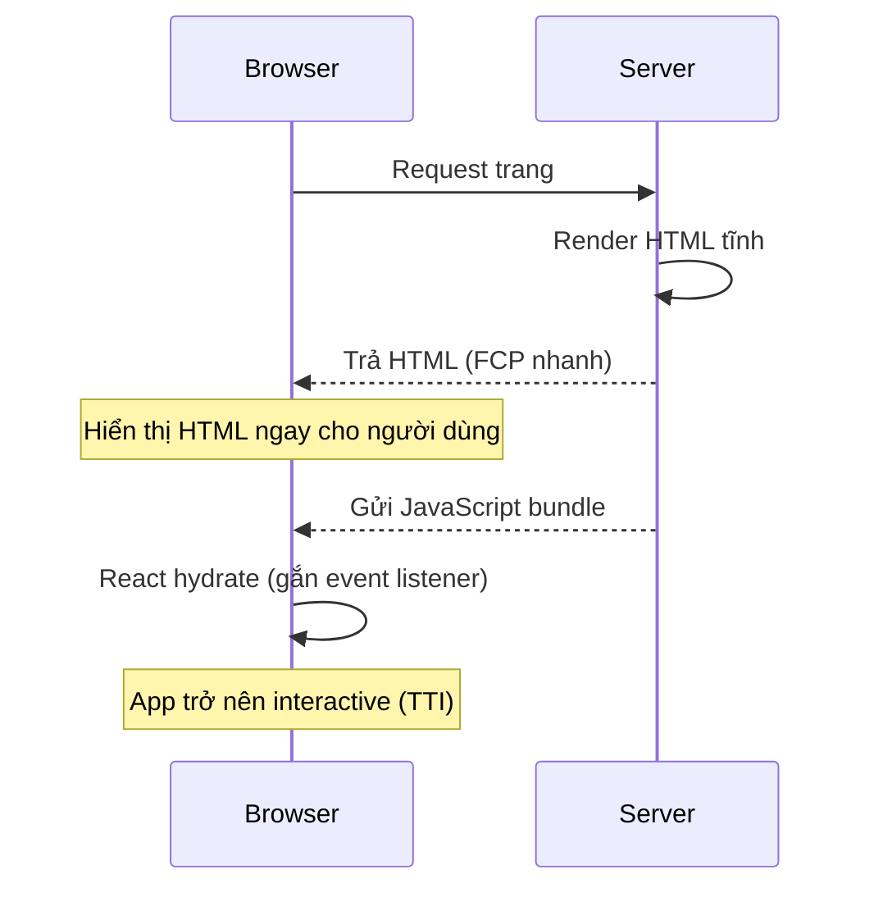

# Tại sao chọn Next.js?

**Next.js** là một **framework** (bộ khung phát triển) xây dựng trên thư viện React, giúp tạo ứng dụng web nhanh và tối ưu sẵn. Nó bổ sung các tính năng mà React thuần còn thiếu như **SSR** (server-side rendering — kết xuất trang ở phía máy chủ), định tuyến tự động và tối ưu hiệu năng. Bài này giải thích vì sao Next.js là lựa chọn phổ biến cho người mới bắt đầu.

[](pathname:///img/nextjs/why-nextjs.webp)

---

:::note[Ghi nhớ nhanh]

- ⭐ **Next.js là framework full-stack React** (do Vercel làm) — bổ sung routing file-based, SSR/SSG/ISR, Server Components lên React thuần.
- ⭐ **SSR gửi HTML render sẵn rồi hydrate** — FCP nhanh và SEO tốt hơn SPA (SPA phải tải JS rồi mới render).
- **Dùng Next.js khi** cần SEO, SSR/SSG cho first paint nhanh, app có cả public page + dashboard, hoặc cần Server Components/Actions.
- **Không cần khi** làm internal tool không SEO, hoặc đã có backend riêng + frontend SPA → Vite đủ.
- **Đánh đổi:** learning curve App Router cao, cache layer phức tạp, vendor lock-in một số feature.

:::

---

## Mục lục

- [Next.js là gì?](#nextjs-là-gì)
- [Vấn đề Next.js giải quyết](#vấn-đề-nextjs-giải-quyết)
- [SPA vs SSR](#spa-vs-ssr)
- [Tại sao chọn frontend framework?](#tại-sao-chọn-frontend-framework)
- [Tại sao chọn Next.js trong số React framework?](#tại-sao-chọn-nextjs-trong-số-react-framework)
- [Câu hỏi phỏng vấn](#câu-hỏi-phỏng-vấn)

---

## Next.js là gì?

**Next.js** là framework full-stack React do **Vercel** phát triển. Nó
bổ sung lên React:

- **Routing** file-based.
- **Server-side rendering (SSR)**, **Static generation (SSG)**, **ISR**.
- **Server Components**, **Server Actions** (React 19).
- **Image, Font, Script** optimization.
- **Bundler** (Turbopack/Webpack).
- **Build / deploy** workflow.

---

## Vấn đề Next.js giải quyết

React core chỉ là **UI library** — không giải quyết:

- Routing.
- Data fetching.
- Rendering strategy (SSR/SSG/CSR).
- SEO.
- Performance optimization.
- Deployment.

Trước Next.js, dev phải **tự ghép** Webpack + React Router + Redux + Express
+ tools khác → mỗi project setup khác nhau.

Next.js đóng gói **best practice** thành framework — install xong là code
được.

---

## SPA vs SSR

| | SPA (Single Page App) | SSR (Server-Side Rendering) |
|--|----------------------|-----------------------------|
| Render lần đầu | Browser tải JS rồi render | Server render HTML, gửi về |
| Bundle | Lớn (toàn app) | Nhỏ hơn (theo route) |
| TTI (Time to Interactive) | Chậm | Nhanh hơn |
| SEO | Khó (crawler phải chạy JS) | Tốt |
| Server cần thiết | CDN tĩnh | Node server hoặc edge |

```
SPA flow:
[Browser] → load index.html (empty) → load JS → fetch data → render

SSR flow:
[Browser] → request page → [Server] render HTML → return → hydrate JS
```

Luồng SSR kèm bước hydration mô tả bằng sequence diagram:



:::info[Phân tích]

**Hydration** — bước quan trọng trong SSR:

1. Server render HTML tĩnh, gửi về browser.
2. Browser hiển thị HTML ngay (FCP nhanh).
3. JavaScript download trong background.
4. React "hydrate" — gắn event listener vào HTML đã có.
5. App trở nên interactive (TTI).

Hydration mismatch (HTML server khác với React client render) → bug khó debug.
Một số nguyên nhân:

- `Date.now()`, `Math.random()` khác giữa server/client.
- `typeof window === "undefined"` check rồi render khác.
- Browser extension thêm DOM.
- Locale formatter khác (server UTC vs client local).

→ Server Components (React 19) giảm hydration cost — chỉ Client Component
cần hydrate.

:::

---

## Tại sao chọn frontend framework?

So với React thuần + Vite SPA:

**Framework như Next.js bổ sung:**

- **SEO** — Google crawler dễ index.
- **Performance** — code splitting tự động, optimize asset.
- **Convention** — file-based routing, project structure.
- **Server functions** — Server Actions thay API routes.
- **DX** — fast refresh, error overlay, image/font optimization.

**Khi nào KHÔNG cần framework:**

- Internal tool, dashboard (không cần SEO).
- App đăng nhập ngay (không có public page).
- Prototype nhanh, ít route.

→ Khi đó **Vite + React + React Router** đủ và đơn giản hơn.

---

## Tại sao chọn Next.js trong số React framework?

| | Next.js | Remix/RR v7 | Astro | TanStack Start |
|--|---------|-------------|-------|----------------|
| Tuổi | 2016 (chín) | 2020 (chín) | 2021 | 2024 (early) |
| Routing | File-based | File-based | File-based | File-based |
| Rendering | SSR/SSG/ISR/RSC | SSR/SPA | Island | SSR |
| Server Components | **First-class** | Partial | Không | Đang implement |
| Server Actions | **Có** | Action loader | Không | Đang implement |
| Image Optimization | **Built-in** | Cần lib | Built-in | Cần lib |
| Vendor | Vercel | Shopify | Open source | Open source |
| Ecosystem | **Lớn nhất** | Vừa | Vừa | Mới |
| Popularity 2026 | **#1** | Tăng | Tăng | Early |

:::info[Phân tích]

**Lợi thế cụ thể của Next.js 2026:**

1. **React 19 first-class** — Server Components, Actions, `use`,
   `useActionState` đều tested kỹ trong Next.js.
2. **Turbopack** stable — bundler bằng Rust, dev nhanh hơn nhiều.
3. **App Router** đã mature — phần lớn breaking change đã xong.
4. **Ecosystem rộng**:
   - **Vercel hosting** — deploy 1 click.
   - **next-auth / Auth.js** — auth provider phổ biến nhất.
   - **next-intl** — i18n.
   - **next-mdx-remote** — MDX content.
   - Mọi UI library đều có Next.js example.
5. **Documentation** chất lượng cao, có App Router playground.

**Trade-off:**

- **Learning curve cao** với App Router (boundary, cache layer).
- **Vendor lock-in** một số feature (Edge Functions, ISR có cache provider).
- **Bundle to** hơn Vite SPA cùng tính năng.

Phần lớn project React production hiện đại chọn Next.js vì **ít rủi ro**:
ecosystem rộng, ai cũng biết, tuyển dev dễ.

:::

:::tip[Mẹo]

**Khi nào dùng Next.js?**

✅ Có khi:

- Cần SEO (blog, marketing, e-commerce).
- Cần SSR/SSG cho first paint nhanh.
- App có cả public page + dashboard.
- Cần Server Components (đỡ bundle JS).
- Cần Server Actions (không tạo API route).

❌ Không khi:

- Internal tool, không SEO.
- Backend riêng (Java, Go) + frontend SPA → Vite đủ.
- Cần control bundle tối đa.
- App offline-first / PWA-heavy.
- Cần kiểm soát build cực kỳ chi tiết.

:::

:::warning[Cần lưu ý]

**Next.js không phải "React thuần"** — nó có quy ước riêng:

- File structure cố định (`app/`, `page.tsx`, `layout.tsx`).
- Server vs Client component boundary.
- Cache layer phức tạp (Data Cache, Router Cache, Full Route Cache).
- Special files: `loading.tsx`, `error.tsx`, `not-found.tsx`.

Học Next.js = **học framework**, không chỉ học React. Đầu tư 2-3 tuần để
nắm App Router model là đáng — sau đó productive nhanh.

:::

---

## Câu hỏi phỏng vấn

Những câu thường gặp về chủ đề này. Tự trả lời trước, rồi bấm **Xem đáp án** để đối chiếu.

**1. Next.js là gì, và nó bổ sung những gì lên React thuần?**

<details className="qa">
<summary>Xem đáp án</summary>

Next.js là **framework full-stack React** do **Vercel** phát triển. React core chỉ là một UI library — nó lo việc render component, còn mọi thứ quanh đó bạn phải tự lắp. Next.js đóng gói sẵn phần "quanh đó":

- **Routing** file-based — thư mục và file trong `app/` chính là URL.
- **Rendering strategy**: SSR, SSG, ISR — chọn theo từng route.
- **Server Components** và **Server Actions** (React 19).
- **Tối ưu asset** built-in: Image, Font, Script.
- **Bundler** (Turbopack/Webpack) và workflow build/deploy.

Điểm mấu chốt khi trả lời phỏng vấn: Next.js không thay thế React, nó **bọc quanh React** và biến một tập best practice rời rạc thành convention thống nhất — cài xong là code được, không phải tự cấu hình lại từ đầu cho mỗi project.

</details>

**2. Vì sao React core một mình không đủ cho ứng dụng production? Trước Next.js dev phải tự ghép những mảnh nào?**

<details className="qa">
<summary>Xem đáp án</summary>

React core cố tình giữ phạm vi hẹp — chỉ là **UI library**. Nó không trả lời được các câu hỏi bắt buộc của một app production:

- Routing — điều hướng giữa các trang.
- Data fetching — lấy dữ liệu ở đâu, lúc nào.
- Rendering strategy — CSR, SSR hay SSG.
- SEO — crawler đọc được gì.
- Performance — code splitting, tối ưu asset.
- Deployment — build ra gì, chạy ở đâu.

Trước Next.js, dev phải **tự ghép** Webpack + React Router + Redux + Express và một loạt tool khác. Hệ quả là mỗi project có setup khác nhau, người mới vào phải học lại từ đầu, và chất lượng phụ thuộc kinh nghiệm người dựng. Next.js chuẩn hoá bộ ghép đó thành framework có convention rõ ràng.

</details>

**3. So sánh `SPA` và `SSR` về first paint, `TTI`, kích thước bundle, SEO và yêu cầu hạ tầng.**

<details className="qa">
<summary>Xem đáp án</summary>

| | SPA (Single Page App) | SSR (Server-Side Rendering) |
|--|----------------------|-----------------------------|
| Render lần đầu | Browser tải JS rồi mới render | Server render HTML, gửi về sẵn |
| Bundle | Lớn (toàn app) | Nhỏ hơn (chia theo route) |
| TTI | Chậm | Nhanh hơn |
| SEO | Khó — crawler phải chạy JS | Tốt — HTML có sẵn nội dung |
| Hạ tầng | CDN tĩnh là đủ | Cần Node server hoặc edge |

Luồng khác nhau rất rõ:

```
SPA:  Browser → index.html (rỗng) → tải JS → fetch data → render
SSR:  Browser → request → Server render HTML → trả về → hydrate JS
```

SSR đổi lấy first paint nhanh và SEO tốt bằng cái giá là phải có server chạy thật, cộng thêm bước hydration ở client.

</details>

**4. Giải thích `hydration`: các bước từ lúc server trả HTML tới lúc app trở nên interactive.**

<details className="qa">
<summary>Xem đáp án</summary>

**Hydration** là bước React "gắn sự sống" vào HTML tĩnh mà server đã render. Trình tự:

1. Server render HTML tĩnh và gửi về browser.
2. Browser hiển thị HTML ngay — người dùng thấy nội dung, **FCP nhanh**.
3. JavaScript bundle được tải về trong background.
4. React hydrate — dựng lại cây component trên client và **gắn event listener** vào đúng các node HTML đã có sẵn.
5. App trở nên interactive — đây là mốc **TTI**.

Điểm dễ bị hỏi thêm: giữa bước 2 và bước 5 có một khoảng trang nhìn thì đầy đủ nhưng bấm chưa ăn. Server Components (React 19) giảm chi phí này vì chỉ Client Component mới cần hydrate, phần còn lại không gửi JS về client.

</details>

**5. `Hydration mismatch` xảy ra khi nào? Kể vài nguyên nhân thực tế và cách phòng tránh.**

<details className="qa">
<summary>Xem đáp án</summary>

**Hydration mismatch** xảy ra khi HTML server render **khác** với cây mà React render ở client trong lần đầu — React phát hiện lệch và cảnh báo, UI có thể nhảy hoặc hỏng. Đây là loại bug khó debug vì chỉ xuất hiện ở lần render đầu.

Nguyên nhân thường gặp:

- Giá trị không tất định: `Date.now()`, `Math.random()` khác nhau giữa hai phía.
- Check `typeof window === "undefined"` rồi render nhánh khác nhau.
- Browser extension chèn thêm DOM vào trang.
- Formatter theo locale/timezone — server chạy UTC, client chạy giờ local.

Cách phòng tránh: giữ render lần đầu **tất định**, đẩy phần phụ thuộc browser xuống `useEffect` (render sau khi mount), truyền timestamp/locale xuống như props thay vì tự tính hai lần, và chỉ dùng `suppressHydrationWarning` cho những node thật sự không tránh được.

</details>

**6. `CSR`, `SSR`, `SSG`, `ISR` khác nhau thế nào? Cho ví dụ loại trang phù hợp với từng chiến lược.**

<details className="qa">
<summary>Xem đáp án</summary>

| Chiến lược | HTML sinh ra lúc nào | Phù hợp với |
|---|---|---|
| CSR | Ở browser, sau khi tải JS | Dashboard sau đăng nhập, internal tool |
| SSR | Ở server, mỗi request | Trang cá nhân hoá, dữ liệu đổi liên tục |
| SSG | Lúc build | Landing page, docs, blog ít đổi |
| ISR | Lúc build, rồi tái sinh nền theo chu kỳ | Trang sản phẩm, tin tức, catalog lớn |

Cách nhớ: trục chính là **thời điểm render** và **độ tươi của dữ liệu**. CSR rẻ hạ tầng nhất nhưng kém SEO; SSG nhanh nhất và rẻ nhất khi phục vụ nhưng dữ liệu đóng băng tại thời điểm build; SSR luôn tươi nhưng mỗi request đều tốn server; ISR là điểm giữa của SSG và SSR. Trong Next.js App Router, các chiến lược này chọn theo từng route chứ không phải cho cả app.

</details>

**7. `ISR` hoạt động ra sao và nó gỡ được hạn chế nào của `SSG`?**

<details className="qa">
<summary>Xem đáp án</summary>

Hạn chế của **SSG** thuần: HTML chỉ sinh ra lúc build. Dữ liệu đổi thì phải build lại toàn site, và với site vài chục nghìn trang thì thời gian build trở nên không chấp nhận được.

**ISR** (Incremental Static Regeneration) gỡ đúng hai điểm đó: trang vẫn được phục vụ dưới dạng tĩnh, nhưng sau một khoảng thời gian cấu hình sẵn, request tiếp theo sẽ kích hoạt việc **render lại ở nền**. Người dùng đang truy cập vẫn nhận bản cũ ngay lập tức, bản mới thay thế cho các request sau. Ngoài ra trang có thể được sinh lần đầu theo nhu cầu thay vì phải dựng hết lúc build.

Kết quả: giữ được tốc độ và chi phí của tĩnh, nhưng dữ liệu vẫn tự làm mới mà không cần deploy lại — đúng nhu cầu của e-commerce hay trang tin.

</details>

**8. Server Components giảm chi phí `hydration` bằng cách nào? Nó khác `SSR` truyền thống ở đâu?**

<details className="qa">
<summary>Xem đáp án</summary>

SSR truyền thống render HTML ở server, nhưng **toàn bộ component vẫn được gửi kèm JS xuống client** để hydrate. Nghĩa là bạn trả tiền hai lần: một lần render ở server, một lần dựng lại cây ở client.

**Server Components** thay đổi điều đó: component chạy ở server và **không gửi JS của nó về client**. Chỉ những component được đánh dấu là Client Component mới vào bundle và mới cần hydrate. Hệ quả:

- Bundle nhỏ hơn, hydration ít việc hơn → TTI tốt hơn.
- Component server truy cập trực tiếp dữ liệu (DB, secret) mà không lộ ra client.

Ranh giới server/client vì thế trở thành khái niệm phải nắm — và cũng là phần khiến learning curve của App Router cao hơn hẳn Pages Router.

</details>

**9. Server Actions thay thế API route trong tình huống nào, và khi nào bạn vẫn cần API route riêng?**

<details className="qa">
<summary>Xem đáp án</summary>

**Server Actions** hợp nhất form/mutation với server: bạn viết một hàm chạy ở server và gọi thẳng từ component, không phải dựng endpoint rồi tự `fetch` sang. Nó thay được API route trong các tình huống nội bộ app:

- Submit form, tạo/sửa/xoá bản ghi.
- Mutation gắn liền với UI và cần revalidate lại trang ngay sau đó.

Vẫn cần **API route riêng** khi endpoint phải phục vụ bên ngoài vòng đời render của Next.js:

- Client khác gọi vào: mobile app, third-party, server khác.
- Webhook từ dịch vụ ngoài (payment, CI...).
- Cần kiểm soát HTTP ở mức thấp: method, header, status code, streaming, CORS.
- Public API có versioning, hoặc cần tài liệu hoá cho bên thứ ba.

Quy tắc ngắn: mutation nội bộ thì dùng Server Action; hợp đồng HTTP với bên ngoài thì dùng API route.

</details>

**10. Ngoài việc render sẵn HTML, Next.js còn hỗ trợ SEO bằng những cơ chế nào?**

<details className="qa">
<summary>Xem đáp án</summary>

HTML render sẵn chỉ là nền móng. Next.js còn cung cấp:

- **Metadata API** — khai báo `title`, `description`, Open Graph, Twitter card ngay trong `layout.tsx` / `page.tsx`; với trang động thì sinh metadata theo dữ liệu của từng route.
- **Sitemap và robots** sinh bằng file quy ước trong `app/`, không cần script build riêng.
- **Canonical URL** và alternates ngôn ngữ khai báo cùng chỗ với metadata.
- **Tối ưu Core Web Vitals** — thành phần Image lo kích thước/format/lazy load, tối ưu font tránh layout shift, code splitting tự động theo route. Các chỉ số này ảnh hưởng trực tiếp tới xếp hạng.
- **Cấu trúc route rõ ràng** — URL sạch, phân tầng theo thư mục, dễ nhúng dữ liệu có cấu trúc (JSON-LD) cho từng trang.

Nói cách khác: SSR/SSG giúp crawler **đọc được**, phần còn lại giúp nó **hiểu và xếp hạng tốt**.

</details>

**11. Khi nào bạn khuyên KHÔNG dùng Next.js mà chọn `Vite` + React + React Router?**

<details className="qa">
<summary>Xem đáp án</summary>

Khi những thứ Next.js đắt giá nhất — SEO, SSR, Server Components — lại không phải nhu cầu của project:

- **Internal tool, dashboard** nằm sau đăng nhập, không có trang public nào cần crawler.
- App **đăng nhập ngay từ đầu**, không có landing page.
- Đã có **backend riêng** (Java, Go, .NET) và frontend chỉ là SPA gọi API.
- Cần **kiểm soát bundle và build cực kỳ chi tiết**.
- App offline-first / PWA-heavy, prototype nhanh với ít route.

Trong các trường hợp đó, Vite + React + React Router đơn giản hơn, deploy chỉ cần CDN tĩnh, không phải học model server/client boundary và cache nhiều tầng. Lập luận cần đưa ra khi phỏng vấn: chọn framework theo **ràng buộc của sản phẩm**, không theo độ phổ biến.

</details>

**12. Kể các tầng cache của Next.js (`Data Cache`, `Router Cache`, `Full Route Cache`) và tình huống chúng gây bug *dữ liệu cũ*.**

<details className="qa">
<summary>Xem đáp án</summary>

App Router có nhiều tầng cache chồng lên nhau:

- **Data Cache** — cache kết quả fetch ở phía server, dùng lại giữa các request và giữa các lần deploy.
- **Full Route Cache** — cache luôn HTML/payload đã render của một route tĩnh trên server.
- **Router Cache** — cache ở phía client, giữ payload của các route đã ghé để điều hướng qua lại tức thì.

Bug dữ liệu cũ hay gặp:

- Vừa mutation xong nhưng quên revalidate → trang vẫn đọc từ Data Cache.
- Route bị suy ra là tĩnh, dữ liệu đổi mà HTML vẫn là bản build cũ.
- Điều hướng back/forward thấy dữ liệu cũ vì Router Cache phục vụ bản trong bộ nhớ, dù server đã mới.

Cách xử lý: sau mỗi mutation phải revalidate đúng path hoặc tag, và với dữ liệu thật sự động thì khai báo route là dynamic thay vì hy vọng cache tự hết hạn.

</details>

**13. Những đánh đổi của Next.js — learning curve `App Router`, cache nhiều tầng, vendor lock-in — bạn giảm thiểu ra sao?**

<details className="qa">
<summary>Xem đáp án</summary>

Ba đánh đổi và cách giảm thiểu:

- **Learning curve App Router** — boundary server/client, special file (`loading.tsx`, `error.tsx`, `not-found.tsx`), convention thư mục. Giảm thiểu bằng cách đầu tư 2-3 tuần học model cho tử tế ngay từ đầu, thống nhất quy ước trong team, và đẩy ranh giới Client Component xuống càng thấp trong cây càng tốt.
- **Cache nhiều tầng** — viết rõ trong code chiến lược cache của từng route, revalidate theo tag thay vì đoán, và kiểm tra hành vi cache trên bản production build chứ không chỉ ở dev.
- **Vendor lock-in** — một số feature gắn với Vercel (Edge Functions, cache provider cho ISR). Giảm thiểu bằng cách cô lập chúng sau một lớp abstraction mỏng và kiểm thử self-host định kỳ.

Đổi lại là ecosystem lớn nhất, tài liệu tốt và dễ tuyển người — lý do phần lớn project production vẫn chọn Next.js vì **ít rủi ro**.

</details>

**14. Self-host Next.js ngoài Vercel (Node server, Docker, edge runtime) cần lưu ý những gì?**

<details className="qa">
<summary>Xem đáp án</summary>

Self-host hoàn toàn khả thi, nhưng phải tự lo những thứ Vercel làm sẵn:

- **Runtime**: chạy Next.js bằng Node server. Với Docker thì build image gọn (multi-stage, output standalone) và đảm bảo đúng phiên bản Node.
- **Biến môi trường**: phân biệt biến chỉ có ở server với biến được nhúng vào bundle client; biến nhúng được cố định **lúc build**, nên đổi giá trị phải build lại.
- **Cache và ISR**: nhiều instance thì cache trên đĩa của từng instance sẽ lệch nhau — cần cache dùng chung hoặc chấp nhận dữ liệu không đồng nhất.
- **Tối ưu ảnh**: thành phần Image cần nơi xử lý ảnh; tự host thì phải cấp CPU/bộ nhớ hoặc trỏ sang CDN ngoài.
- **Edge runtime** không có đủ API Node — route viết cho edge cần kiểm tra lại khi chạy trên hạ tầng của mình.

Ngoài ra còn log, health check, graceful shutdown và CDN đứng trước để phục vụ asset tĩnh.

</details>
