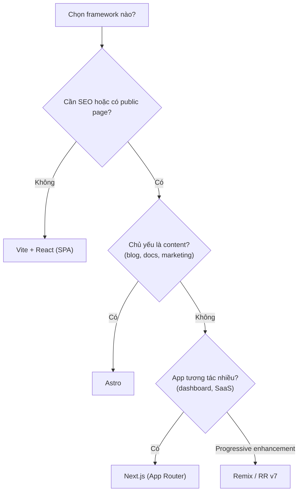

# JavaScript và React Frameworks

Trước khi học Next.js, bạn cần nắm vững **JavaScript** (ngôn ngữ lập trình của web) và **React** (thư viện xây dựng giao diện theo component). Một **framework** (bộ khung) như Next.js, Remix hay Astro được xây dựng dựa trên React để bổ sung định tuyến, kết xuất và công cụ phát triển. Bài này điểm qua kiến thức nền cần có và so sánh các framework phổ biến.

---

:::note[Ghi nhớ nhanh]

- ⭐ **Nền tảng cần trước Next.js:** JS hiện đại (ES6+, `async/await`, Web Standards API) và React (JSX, hooks, React 19 Server Components).
- **Next.js vs Remix:** Next dùng Server Components + `fetch()`; Remix dùng `loader`/`action`, mạnh về progressive enhancement (form chạy cả khi tắt JS).
- **Astro** là content-focused, HTML tĩnh JS opt-in — hợp blog/docs/marketing; **TanStack Start** mới, type-safe end-to-end, đáng theo dõi.
- ⭐ **Đa số dự án mới 2026 chọn Next.js** vì ít rủi ro, ecosystem lớn, dễ tuyển dev.

:::

---

## Mục lục

- [JavaScript Basics cần biết](#javascript-basics-cần-biết)
- [React Basics cần biết](#react-basics-cần-biết)
- [Next.js vs Remix](#nextjs-vs-remix)
- [Astro vs Next.js](#astro-vs-nextjs)
- [TanStack Start](#tanstack-start)

---

## JavaScript Basics cần biết

Trước khi học Next.js, đảm bảo nắm chắc JS hiện đại. Tham khảo
[JavaScript roadmap](/docs/javascript/01-gioi-thieu/1_javascript-la-gi):

- ES6+: arrow, destructuring, spread/rest, template literal, modules.
- Promise + async/await.
- Array methods: map, filter, reduce, find.
- Object: spread, destructure, optional chaining `?.`, nullish `??`.
- Fetch API, FormData, Request/Response.
- Module: `import`/`export`, dynamic `import()`.

Next.js hiện đại dùng nhiều **Web Standards API** (Request, Response,
FormData, Headers) — cần quen.

---

## React Basics cần biết

Tham khảo [React roadmap](/docs/react/01-chuan-bi/1_chuan-bi):

- JSX.
- Function component, props.
- Hooks: useState, useEffect, useContext, useRef, useMemo, useCallback.
- Custom hooks.
- Conditional rendering, lists/keys.
- Event handling.
- Component composition.
- Suspense, Error Boundary.

Năm 2026, **React 19** features đặc biệt quan trọng cho Next.js App Router:

- **Server Components** — chạy server, không vào bundle.
- **`use` hook** — đọc Promise/Context.
- **Actions** — form submit server-side.
- **`useActionState`, `useFormStatus`, `useOptimistic`**.

---

## Next.js vs Remix

| | Next.js | Remix (React Router v7) |
|--|---------|------------------------|
| Vendor | Vercel | Shopify (open source) |
| Routing | App Router (file-based) | File-based (flat) |
| Data fetching | Server Components, `fetch()` | `loader` function |
| Mutations | Server Actions | `action` function |
| Form | `<form action={fn}>` (React 19) | `<Form>` (Remix Form) |
| Caching | Multi-layer built-in | Browser cache + manual |
| Streaming | Suspense + RSC | `defer()` |
| Deployment | Vercel-optimized | Any Node/Edge |

```tsx
// Next.js App Router
// app/users/page.tsx (Server Component)
async function UsersPage() {
  const users = await db.user.findMany();
  return <UserList users={users} />;
}

// app/users/actions.ts
"use server";
export async function createUser(formData: FormData) {
  await db.user.create({ data: { name: formData.get("name") } });
}
```

```tsx
// Remix
// app/routes/users.tsx
export async function loader() {
  return await db.user.findMany();
}

export async function action({ request }) {
  const formData = await request.formData();
  await db.user.create({ data: { name: formData.get("name") } });
  return redirect("/users");
}

export default function UsersPage() {
  const users = useLoaderData();
  return <UserList users={users} />;
}
```

:::info[Phân tích]

**Khi nào chọn Remix thay Next.js?**

- Cần **progressive enhancement** — form work cả khi JS tắt.
- Quen pattern **loader/action** rõ ràng.
- Không cần Server Components.
- Triển khai trên platform không phải Vercel (Cloudflare, AWS Lambda).
- Team thích **web standards** hơn convention.

Remix merge thành React Router v7 (2024) — vẫn maintain, nhưng React 19 +
Server Components Next.js đang dominate market share.

:::

---

## Astro vs Next.js

Astro **không phải React framework** mà là **content-focused multi-framework**.

```astro
---
const posts = await fetchPosts();
---

<Layout>
  <h1>Blog</h1>
  {posts.map(post => (
    <article>
      <h2>{post.title}</h2>
    </article>
  ))}

  <SearchBox client:visible />  {/* React, chỉ hydrate khi visible */}
</Layout>
```

| | Next.js | Astro |
|--|---------|-------|
| Default | React JS hydrated | HTML tĩnh, JS opt-in |
| Multi-framework | Chỉ React | React, Vue, Svelte, Solid |
| Markdown/MDX | Cần setup | First-class |
| SEO | Rất tốt | **Xuất sắc** |
| Interactive app | **Tốt** | Hạn chế |
| Bundle JS | Lớn | **Rất nhỏ** |

Khi nào Astro:

- **Content site** — blog, docs, marketing landing.
- Performance Lighthouse 100 ưu tiên.
- Có pages tĩnh + vài island interactive.

Khi nào Next.js:

- **Dashboard, SaaS, e-commerce** — nhiều state, navigation, interaction.
- Cần Server Components data flow.

→ Nhiều dự án dùng **cả hai**: marketing site (Astro) + app (Next.js).

---

## TanStack Start

[TanStack Start](https://tanstack.com/start) — framework mới (2024+),
**type-safe end-to-end**, dựa trên TanStack Router.

```tsx
// app/routes/users/$userId.tsx
import { createFileRoute } from "@tanstack/react-router";

export const Route = createFileRoute("/users/$userId")({
  loader: async ({ params }) => fetchUser(params.userId),
  component: UserPage,
});

function UserPage() {
  const { userId } = Route.useParams();    // type: string
  const user = Route.useLoaderData();       // type: User
  return <div>{user.name}</div>;
}
```

Đặc điểm:

- **Type-safe param + search params** (qua Zod schema).
- **Server functions** type-safe.
- **TanStack Query integration** mượt.
- **SSR + streaming**.

Vẫn early stage. Đáng theo dõi cho 2027+ — nếu cần TS-heavy, type-safe
API trong project mới.

---

## Tóm lại

| Tình huống | Framework |
|-----------|-----------|
| Blog, docs, marketing | **Astro** |
| Dashboard, SaaS, e-commerce có SEO | **Next.js** (App Router) |
| Form-heavy app, progressive enhancement | **Remix / RR v7** |
| Type-safe, modern, project mới | **TanStack Start** (theo dõi) |
| SPA không SEO | **Vite + React** (không cần framework) |

Cây quyết định chọn framework theo nhu cầu dự án:



:::tip[Mẹo]

**Quy tắc lựa chọn framework:**

1. App cần **SEO** + có public page → cần SSR → **Next.js** hoặc Astro.
2. App là **internal tool** → Vite SPA.
3. **Content site** (blog, docs) → Astro.
4. **Existing team**: dùng framework team đã biết. Switch chi phí cao.
5. **Hosting constraint**: cloudflare/AWS Lambda → Remix/Astro tốt hơn.

Đa số dự án mới 2026 chọn **Next.js** — ít rủi ro, tài liệu nhiều, dev
nhiều.

:::
