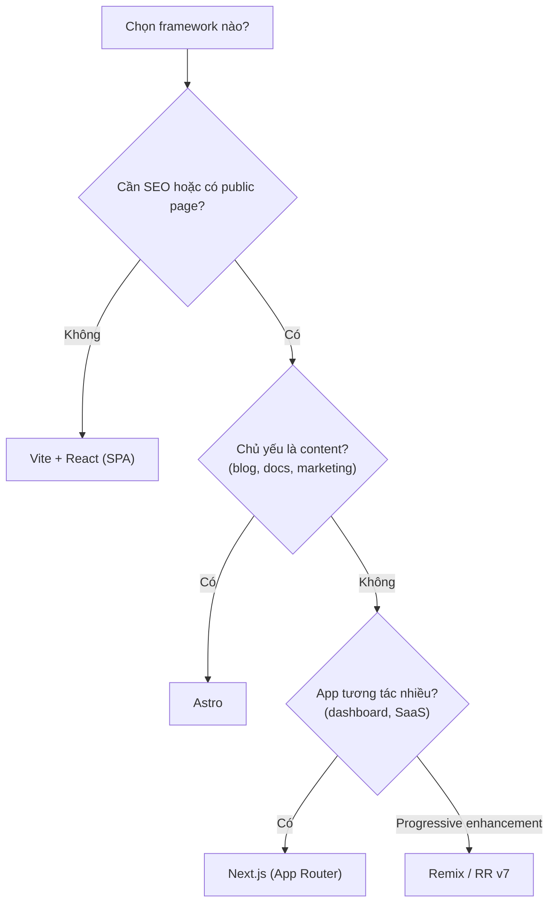

# JavaScript và React Frameworks

Trước khi học Next.js, bạn cần nắm vững **JavaScript** (ngôn ngữ lập trình của web) và **React** (thư viện xây dựng giao diện theo component). Một **framework** (bộ khung) như Next.js, Remix hay Astro được xây dựng dựa trên React để bổ sung định tuyến, kết xuất và công cụ phát triển. Bài này điểm qua kiến thức nền cần có và so sánh các framework phổ biến.

[](pathname:///img/nextjs/javascript-react-frameworks.webp)

---

:::note[Ghi nhớ nhanh]

- ⭐ **Nền tảng cần trước Next.js:** JS hiện đại (ES6+, `async/await`, Web Standards API) và React (JSX, hooks, React 19 Server Components).
- **Next.js vs Remix:** Next dùng Server Components + `fetch()`; Remix dùng `loader`/`action`, mạnh về progressive enhancement (form chạy cả khi tắt JS).
- **Astro** là content-focused, HTML tĩnh JS opt-in — hợp blog/docs/marketing; **TanStack Start** mới, type-safe end-to-end, đáng theo dõi.
- ⭐ **Đa số dự án mới 2026 chọn Next.js** vì ít rủi ro, ecosystem lớn, dễ tuyển dev.

:::

---

## Mục lục

- [JavaScript Basics cần biết](#javascript-basics-cần-biết)
- [React Basics cần biết](#react-basics-cần-biết)
- [Next.js vs Remix](#nextjs-vs-remix)
- [Astro vs Next.js](#astro-vs-nextjs)
- [TanStack Start](#tanstack-start)
- [Câu hỏi phỏng vấn](#câu-hỏi-phỏng-vấn)

---

## JavaScript Basics cần biết

Trước khi học Next.js, đảm bảo nắm chắc JS hiện đại. Tham khảo
[JavaScript roadmap](/docs/javascript/01-gioi-thieu/1_javascript-la-gi):

- ES6+: arrow, destructuring, spread/rest, template literal, modules.
- Promise + async/await.
- Array methods: map, filter, reduce, find.
- Object: spread, destructure, optional chaining `?.`, nullish `??`.
- Fetch API, FormData, Request/Response.
- Module: `import`/`export`, dynamic `import()`.

Next.js hiện đại dùng nhiều **Web Standards API** (Request, Response,
FormData, Headers) — cần quen.

---

## React Basics cần biết

Tham khảo [React roadmap](/docs/react/01-chuan-bi/1_chuan-bi):

- JSX.
- Function component, props.
- Hooks: useState, useEffect, useContext, useRef, useMemo, useCallback.
- Custom hooks.
- Conditional rendering, lists/keys.
- Event handling.
- Component composition.
- Suspense, Error Boundary.

Năm 2026, **React 19** features đặc biệt quan trọng cho Next.js App Router:

- **Server Components** — chạy server, không vào bundle.
- **`use` hook** — đọc Promise/Context.
- **Actions** — form submit server-side.
- **`useActionState`, `useFormStatus`, `useOptimistic`**.

---

## Next.js vs Remix

| | Next.js | Remix (React Router v7) |
|--|---------|------------------------|
| Vendor | Vercel | Shopify (open source) |
| Routing | App Router (file-based) | File-based (flat) |
| Data fetching | Server Components, `fetch()` | `loader` function |
| Mutations | Server Actions | `action` function |
| Form | `<form action={fn}>` (React 19) | `<Form>` (Remix Form) |
| Caching | Multi-layer built-in | Browser cache + manual |
| Streaming | Suspense + RSC | `defer()` |
| Deployment | Vercel-optimized | Any Node/Edge |

```tsx
// Next.js App Router
// app/users/page.tsx (Server Component)
async function UsersPage() {
  const users = await db.user.findMany();
  return <UserList users={users} />;
}

// app/users/actions.ts
"use server";
export async function createUser(formData: FormData) {
  await db.user.create({ data: { name: formData.get("name") } });
}
```

```tsx
// Remix
// app/routes/users.tsx
export async function loader() {
  return await db.user.findMany();
}

export async function action({ request }) {
  const formData = await request.formData();
  await db.user.create({ data: { name: formData.get("name") } });
  return redirect("/users");
}

export default function UsersPage() {
  const users = useLoaderData();
  return <UserList users={users} />;
}
```

:::info[Phân tích]

**Khi nào chọn Remix thay Next.js?**

- Cần **progressive enhancement** — form work cả khi JS tắt.
- Quen pattern **loader/action** rõ ràng.
- Không cần Server Components.
- Triển khai trên platform không phải Vercel (Cloudflare, AWS Lambda).
- Team thích **web standards** hơn convention.

Remix merge thành React Router v7 (2024) — vẫn maintain, nhưng React 19 +
Server Components Next.js đang dominate market share.

:::

---

## Astro vs Next.js

Astro **không phải React framework** mà là **content-focused multi-framework**.

```astro
---
const posts = await fetchPosts();
---

<Layout>
  <h1>Blog</h1>
  {posts.map(post => (
    <article>
      <h2>{post.title}</h2>
    </article>
  ))}

  <SearchBox client:visible />  {/* React, chỉ hydrate khi visible */}
</Layout>
```

| | Next.js | Astro |
|--|---------|-------|
| Default | React JS hydrated | HTML tĩnh, JS opt-in |
| Multi-framework | Chỉ React | React, Vue, Svelte, Solid |
| Markdown/MDX | Cần setup | First-class |
| SEO | Rất tốt | **Xuất sắc** |
| Interactive app | **Tốt** | Hạn chế |
| Bundle JS | Lớn | **Rất nhỏ** |

Khi nào Astro:

- **Content site** — blog, docs, marketing landing.
- Performance Lighthouse 100 ưu tiên.
- Có pages tĩnh + vài island interactive.

Khi nào Next.js:

- **Dashboard, SaaS, e-commerce** — nhiều state, navigation, interaction.
- Cần Server Components data flow.

→ Nhiều dự án dùng **cả hai**: marketing site (Astro) + app (Next.js).

---

## TanStack Start

[TanStack Start](https://tanstack.com/start) — framework mới (2024+),
**type-safe end-to-end**, dựa trên TanStack Router.

```tsx
// app/routes/users/$userId.tsx
import { createFileRoute } from "@tanstack/react-router";

export const Route = createFileRoute("/users/$userId")({
  loader: async ({ params }) => fetchUser(params.userId),
  component: UserPage,
});

function UserPage() {
  const { userId } = Route.useParams();    // type: string
  const user = Route.useLoaderData();       // type: User
  return <div>{user.name}</div>;
}
```

Đặc điểm:

- **Type-safe param + search params** (qua Zod schema).
- **Server functions** type-safe.
- **TanStack Query integration** mượt.
- **SSR + streaming**.

Vẫn early stage. Đáng theo dõi cho 2027+ — nếu cần TS-heavy, type-safe
API trong project mới.

---

## Tóm lại

| Tình huống | Framework |
|-----------|-----------|
| Blog, docs, marketing | **Astro** |
| Dashboard, SaaS, e-commerce có SEO | **Next.js** (App Router) |
| Form-heavy app, progressive enhancement | **Remix / RR v7** |
| Type-safe, modern, project mới | **TanStack Start** (theo dõi) |
| SPA không SEO | **Vite + React** (không cần framework) |

Cây quyết định chọn framework theo nhu cầu dự án:



:::tip[Mẹo]

**Quy tắc lựa chọn framework:**

1. App cần **SEO** + có public page → cần SSR → **Next.js** hoặc Astro.
2. App là **internal tool** → Vite SPA.
3. **Content site** (blog, docs) → Astro.
4. **Existing team**: dùng framework team đã biết. Switch chi phí cao.
5. **Hosting constraint**: cloudflare/AWS Lambda → Remix/Astro tốt hơn.

Đa số dự án mới 2026 chọn **Next.js** — ít rủi ro, tài liệu nhiều, dev
nhiều.

:::

---

## Câu hỏi phỏng vấn

Những câu thường gặp về chủ đề này. Tự trả lời trước, rồi bấm **Xem đáp án** để đối chiếu.

**1. Phân biệt *thư viện* và *framework*. React thuộc loại nào, và vì sao điều đó dẫn tới sự ra đời của Next.js hay Remix?**

<details className="qa">
<summary>Xem đáp án</summary>

**Thư viện** là code bạn gọi — bạn giữ quyền điều khiển luồng chương trình. **Framework** là code gọi bạn — nó định sẵn cấu trúc, convention và vòng đời, bạn điền phần của mình vào chỗ trống.

React là **thư viện UI**: nó chỉ lo render component theo state. Nó cố tình không quyết định giúp bạn routing, data fetching, rendering strategy hay build/deploy.

Chính khoảng trống đó dẫn tới framework như Next.js, Remix, Astro: chúng bọc quanh React và đưa ra câu trả lời có sẵn cho những phần React bỏ ngỏ — thư mục nào thành URL, dữ liệu lấy ở server hay client, HTML sinh lúc build hay lúc request. Đổi lại sự tiện lợi, bạn phải theo convention của framework, và chi phí chuyển đổi về sau không hề nhỏ.

</details>

**2. Những kiến thức JavaScript nào là bắt buộc trước khi học Next.js? Vì sao Web Standards API (`Request`, `Response`, `FormData`) ngày càng quan trọng?**

<details className="qa">
<summary>Xem đáp án</summary>

Cần chắc JS hiện đại trước khi động vào Next.js:

- ES6+: arrow function, destructuring, spread/rest, template literal, modules.
- `Promise` và `async/await`.
- Array methods: `map`, `filter`, `reduce`, `find`.
- Object: spread, optional chaining `?.`, nullish `??`.
- Module: `import`/`export`, dynamic `import()`.

Web Standards API ngày càng quan trọng vì Next.js hiện đại **xây trên chuẩn web thay vì API riêng của framework**. Route handler nhận vào `Request` và trả về `Response`; form gửi lên dưới dạng `FormData`; header thao tác qua `Headers`. Lợi ích là kiến thức mang đi được: cùng một API đó chạy ở trình duyệt, ở Node hiện đại và ở edge runtime của Cloudflare hay Deno. Học chuẩn web một lần, dùng được ở mọi framework — thay vì học lại abstraction của từng bên.

</details>

**3. Vì sao `Promise` và `async/await` là nền tảng cho việc lấy dữ liệu trong Server Components?**

<details className="qa">
<summary>Xem đáp án</summary>

Server Component là **hàm async chạy ở server**: nó có thể `await` thẳng trong thân component để lấy dữ liệu, không cần `useEffect` rồi setState như mô hình client cũ.

```tsx
async function UsersPage() {
  const users = await db.user.findMany();
  return <UserList users={users} />;
}
```

Muốn đọc được đoạn này phải nắm `Promise`: `await` chờ một Promise resolve, lỗi bắt bằng `try/catch`, nhiều request độc lập thì chạy song song bằng `Promise.all` thay vì `await` tuần tự gây waterfall. Ngoài ra `fetch()` trả về Promise, và React 19 còn có hook `use` để đọc Promise trực tiếp. Không hiểu Promise thì không lý giải được vì sao dữ liệu đã có sẵn ngay trong HTML gửi về, và cũng không tối ưu được thứ tự lấy dữ liệu.

</details>

**4. Kể các hook React cơ bản, và cho biết hook nào KHÔNG dùng được trong Server Component. Vì sao?**

<details className="qa">
<summary>Xem đáp án</summary>

Các hook cơ bản: `useState`, `useEffect`, `useContext`, `useRef`, `useMemo`, `useCallback`, cộng thêm custom hook do bạn tự viết.

Trong **Server Component**, gần như toàn bộ nhóm trên đều **không dùng được**: `useState`, `useEffect`, `useRef`, `useCallback`, `useMemo` và cả event handler.

Lý do: Server Component chỉ chạy **một lần ở server** rồi sinh ra kết quả gửi về client. Nó không có vòng đời trên trình duyệt, không re-render theo state, không có DOM để gắn effect hay ref. Những hook đó vốn sinh ra cho mô hình state + re-render ở client — đặt vào server thì vô nghĩa.

Cần tương tác thì tách phần đó ra **Client Component** (đánh dấu `"use client"`) và giữ ranh giới càng thấp trong cây càng tốt.

</details>

**5. React 19 mang tới những gì cho framework — Server Components, `use`, Actions, `useActionState`, `useOptimistic`?**

<details className="qa">
<summary>Xem đáp án</summary>

React 19 là nền cho App Router hiện đại:

- **Server Components** — component chạy ở server, **không vào bundle** client, truy cập dữ liệu trực tiếp.
- **`use`** — hook đọc Promise hoặc Context, cho phép "unwrap" dữ liệu bất đồng bộ ngay trong render.
- **Actions** — hàm server gắn thẳng vào form, xử lý submit mà không cần dựng API endpoint.
- **`useActionState`** — giữ state trả về từ action (kết quả, lỗi validate).
- **`useFormStatus`** — biết form đang submit hay không, để disable nút hoặc hiện spinner.
- **`useOptimistic`** — cập nhật UI lạc quan trước khi server trả lời, rollback nếu thất bại.

Gộp lại, chúng dịch chuyển công việc từ client sang server: bundle nhỏ hơn, ít hydration hơn, và mutation viết gọn hơn hẳn so với pattern `useEffect` + `fetch` + state cũ.

</details>

**6. So sánh mô hình lấy dữ liệu của Next.js (Server Components + `fetch()`) với Remix (`loader` / `action`).**

<details className="qa">
<summary>Xem đáp án</summary>

| | Next.js | Remix (React Router v7) |
|--|---------|------------------------|
| Đọc dữ liệu | Server Components, `await fetch()`/query ngay trong component | Hàm `loader` export riêng theo route |
| Ghi dữ liệu | Server Actions | Hàm `action` |
| Nơi khai báo | Rải theo cây component | Tập trung ở file route |
| Form | `form action` của React 19 | Component `Form` của Remix |
| Streaming | Suspense + RSC | `defer()` |

Next.js đặt việc lấy dữ liệu **ngay chỗ cần dùng** — component nào cần thì tự `await`, tránh phải kéo dữ liệu qua nhiều tầng props. Remix tách bạch rõ: một route có đúng một `loader` để đọc và một `action` để ghi, dữ liệu lấy ra bằng `useLoaderData`.

Đổi lại: Next.js linh hoạt hơn nhưng dễ tạo waterfall nếu bất cẩn; Remix rõ ràng và dễ suy luận hơn nhưng dữ liệu phải chảy từ route xuống.

</details>

**7. `Progressive enhancement` là gì? Vì sao Remix mạnh ở điểm này, và Next.js đáp ứng tới đâu với `form action` của React 19?**

<details className="qa">
<summary>Xem đáp án</summary>

**Progressive enhancement** là xây trang sao cho chức năng cốt lõi vẫn chạy khi JavaScript chưa tải xong hoặc bị tắt, rồi JS chỉ **nâng cấp** trải nghiệm lên (validate tức thì, optimistic UI, không reload trang).

Remix mạnh ở đây vì nó bám sát nền tảng web: một route có `action`, và component `Form` render ra thẻ form HTML thật. Không có JS thì trình duyệt vẫn submit form theo cách truyền thống và `action` vẫn chạy — luồng không gãy.

Next.js đáp ứng được nhờ `form action` của React 19: form trỏ thẳng vào một Server Action, nên submit cơ bản vẫn hoạt động mà không cần JS. Nhưng các tiện ích như `useOptimistic`, `useFormStatus` hay phần UI trong Client Component thì cần JS. Nói cách khác Next.js hỗ trợ được, còn Remix coi đó là triết lý mặc định.

</details>

**8. Astro khác Next.js ở triết lý nào? Giải thích `Islands architecture` và chỉ thị kiểu `client:visible`.**

<details className="qa">
<summary>Xem đáp án</summary>

Astro **không phải React framework** mà là framework **content-focused, đa framework**. Triết lý ngược với Next.js: mặc định gửi **HTML tĩnh, JS là opt-in**; trong khi Next.js mặc định là app React có hydrate.

**Islands architecture**: trang chủ yếu là HTML tĩnh, chỉ một vài "hòn đảo" nhỏ là component tương tác thật sự (ô tìm kiếm, carousel, nút like). Mỗi island hydrate độc lập, phần còn lại của trang không tốn một byte JS nào.

Chỉ thị `client:` quyết định **khi nào** island được hydrate — `client:visible` nghĩa là chỉ tải và hydrate khi component lọt vào viewport:

```astro
<SearchBox client:visible />
```

Kết quả: bundle rất nhỏ, Lighthouse gần như tuyệt đối — rất hợp blog, docs, marketing; nhưng hạn chế khi app cần nhiều state và điều hướng phức tạp.

</details>

**9. Khi nào một sản phẩm nên dùng cả Astro lẫn Next.js? Bạn đặt ranh giới ở đâu?**

<details className="qa">
<summary>Xem đáp án</summary>

Dùng cả hai khi sản phẩm có **hai loại trang với nhu cầu trái ngược nhau**: phần nội dung công khai cần SEO tối đa và bundle nhỏ, phần ứng dụng cần state, điều hướng và tương tác dày đặc.

Ranh giới tự nhiên là **trước và sau đăng nhập**:

- **Astro** cho marketing site, blog, docs, landing page — nội dung chủ yếu tĩnh, viết bằng Markdown/MDX, vài island tương tác.
- **Next.js** cho dashboard, SaaS, e-commerce — nhiều state, Server Components, Server Actions.

Cái giá phải trả là hai codebase, hai pipeline deploy và phải chia sẻ design system, phân tích, session giữa hai bên. Chỉ nên tách khi phần nội dung đủ lớn để bù lại chi phí đó; sản phẩm nhỏ thì một Next.js duy nhất gọn hơn nhiều.

</details>

**10. TanStack Start hướng tới điều gì? *Type-safe end-to-end* nghĩa là gì với route params và search params?**

<details className="qa">
<summary>Xem đáp án</summary>

TanStack Start là framework mới (2024+) dựng trên TanStack Router, đặt cược vào **type safety xuyên suốt** thay vì convention.

*Type-safe end-to-end* nghĩa là kiểu dữ liệu được suy ra và kiểm tra từ URL cho tới dữ liệu render, không phải ép kiểu thủ công:

```tsx
export const Route = createFileRoute("/users/$userId")({
  loader: async ({ params }) => fetchUser(params.userId),
  component: UserPage,
});

const { userId } = Route.useParams();   // suy ra là string
const user = Route.useLoaderData();     // suy ra là User
```

Với **route params**, khai báo route sinh ra kiểu cho `useParams` — gõ sai tên param là lỗi biên dịch chứ không phải `undefined` lúc runtime. Với **search params**, chúng được khai báo qua schema (thường là Zod), nên vừa được validate vừa được gõ kiểu, và cả link điều hướng cũng bị kiểm tra.

Vẫn còn early stage — đáng theo dõi hơn là đưa vào production ngay.

</details>

**11. Nếu ràng buộc hosting là Cloudflare Workers hoặc AWS Lambda, lựa chọn framework của bạn thay đổi thế nào?**

<details className="qa">
<summary>Xem đáp án</summary>

Ràng buộc hosting đẩy tiêu chí lên đầu, vì không phải framework nào cũng chạy thoải mái ngoài Vercel.

- **Cloudflare Workers** dùng runtime kiểu edge, không có đủ API Node. Remix/React Router v7 và Astro sinh ra đã bám web standards nên hợp tự nhiên. Next.js chạy được nhưng phải chú ý route nào ở edge runtime, và một số feature gắn với hạ tầng Vercel (cache provider cho ISR, Edge Functions) sẽ phải thay thế.
- **AWS Lambda** thì Remix/Astro deploy thẳng dễ hơn; Next.js self-host được nhưng cần cân nhắc cold start, tối ưu ảnh và cache dùng chung giữa nhiều instance.

Nguyên tắc: nếu bắt buộc rời Vercel, hãy ưu tiên framework **bám web standards và deploy được ở bất kỳ Node/Edge nào**, đồng thời kiểm thử self-host ngay từ đầu dự án chứ không để đến lúc sắp lên production.

</details>

**12. Cho một sản phẩm gồm trang marketing, blog và dashboard nội bộ — bạn chọn framework nào cho từng phần và vì sao?**

<details className="qa">
<summary>Xem đáp án</summary>

Chia theo đặc tính từng phần:

- **Trang marketing** — nội dung tĩnh, cần SEO và Lighthouse cao, thay đổi chủ yếu là nội dung: **Astro**, vài island cho form liên hệ hoặc search.
- **Blog** — Markdown/MDX là first-class ở Astro, bundle JS gần như bằng không: cũng **Astro**, chung codebase với marketing.
- **Dashboard nội bộ** — sau đăng nhập, không cần SEO, nhiều state và tương tác: **Vite + React + React Router** là đủ và đơn giản nhất.

Nếu team nhỏ và không muốn nuôi hai codebase, gộp tất cả vào **một Next.js** cũng là lựa chọn hợp lý: route công khai để tĩnh/ISR, route dashboard để dynamic. Chi phí là bundle to hơn và phải học App Router; đổi lại chỉ có một pipeline, một design system, một nơi deploy.

</details>

**13. Việc Remix hợp nhất vào React Router v7 ảnh hưởng thế nào tới quyết định chọn framework hôm nay?**

<details className="qa">
<summary>Xem đáp án</summary>

Remix hợp nhất vào **React Router v7** (2024) nên ranh giới giữa "dùng React Router" và "dùng Remix" gần như biến mất — cùng một dự án, có thể bắt đầu ở chế độ SPA rồi bật dần các tính năng framework như `loader`/`action` và SSR.

Ảnh hưởng tới quyết định hôm nay:

- **Tích cực**: hạ rủi ro chọn nhầm — React Router vốn đã có mặt trong vô số codebase, nâng cấp dần dễ hơn là viết lại. Nó vẫn được maintain và vẫn là lựa chọn tốt cho app form-heavy, progressive enhancement, hoặc hosting ngoài Vercel.
- **Cần cân nhắc**: tên gọi và tài liệu có giai đoạn chuyển đổi gây nhầm lẫn, và về Server Components thì Next.js đi trước khá xa cùng với thị phần lớn hơn.

Kết luận thực dụng: có sẵn React Router thì lộ trình nâng cấp rất mượt; còn dự án mới cần RSC và ecosystem rộng thì Next.js vẫn là mặc định ít rủi ro.

</details>

**14. Những yếu tố phi kỹ thuật nào (tuyển dụng, ecosystem, kinh nghiệm team) nên ảnh hưởng tới quyết định chọn framework? Chi phí chuyển đổi về sau ra sao?**

<details className="qa">
<summary>Xem đáp án</summary>

Framework là quyết định sống nhiều năm, nên yếu tố phi kỹ thuật cân nặng không kém phần kỹ thuật:

- **Kinh nghiệm team** — dùng thứ team đã biết thường thắng thứ "tốt hơn trên giấy". Chi phí học lại là chi phí thật.
- **Tuyển dụng** — framework phổ biến thì tuyển nhanh, người mới vào productive sớm.
- **Ecosystem và tài liệu** — thư viện auth, i18n, UI, ví dụ sẵn có quyết định bạn tự viết bao nhiêu.
- **Độ chín và cam kết duy trì** — ai đứng sau, breaking change có dày không.

**Chi phí chuyển đổi về sau rất cao**: routing, data fetching, ranh giới server/client và cách deploy đều thấm vào toàn bộ codebase, nên đổi framework gần như là viết lại chứ không phải refactor. Vì thế đa số dự án mới 2026 chọn Next.js — không hẳn vì nó tốt nhất ở mọi mặt, mà vì đó là lựa chọn **ít rủi ro** nhất.

</details>
