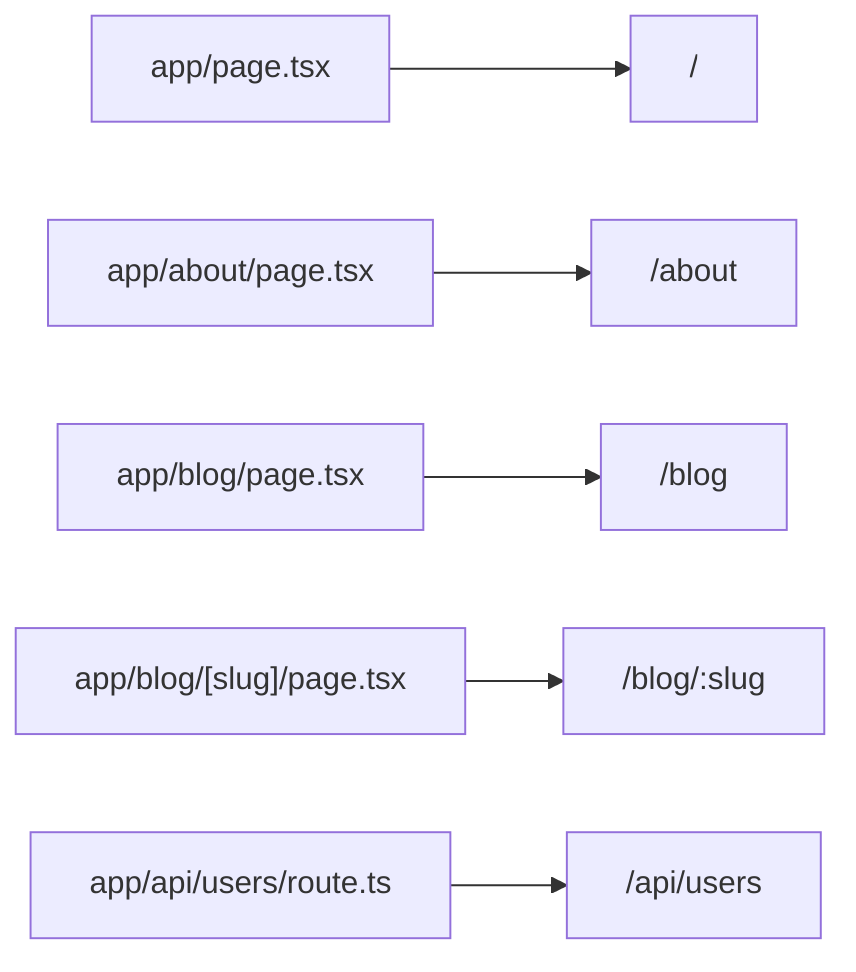

# Tạo project Next.js

`create-next-app` là công cụ dòng lệnh chính thức giúp tạo nhanh một **project** (dự án) Next.js với cấu trúc thư mục và cấu hình mặc định. Sau khi tạo, bạn có thể chạy **dev server** (máy chủ phát triển có tự động tải lại) để xem ứng dụng ngay. Bài này hướng dẫn các bước khởi tạo và làm quen với cấu trúc thư mục cơ bản.

---

:::note[Ghi nhớ nhanh]

- ⭐ **Tạo project bằng `npx create-next-app@latest`** — wizard hỏi TypeScript, Tailwind, App Router, Turbopack, import alias.
- **File-based routing:** routes nằm trong `app/`, mỗi `page.tsx` = một route.
- **Dev:** `npm run dev` (Fast Refresh, HMR, error overlay); **Production:** phải `npm run build` rồi mới `npm run start`.
- **Build report ký hiệu:** `○` Static (build time), `ƒ` Dynamic (mỗi request), `●` ISR (revalidate định kỳ).
- ⭐ **App Router là default 2026;** Pages Router vẫn được hỗ trợ vô thời hạn cho codebase cũ.

:::

---

## Mục lục

- [create-next-app](#create-next-app)
- [Cấu trúc thư mục](#cấu-trúc-thư-mục)
- [File-based routing cơ bản](#file-based-routing-cơ-bản)
- [Chạy dev server](#chạy-dev-server)
- [Build production](#build-production)
- [Câu hỏi phỏng vấn](#câu-hỏi-phỏng-vấn)

---

## create-next-app

CLI chính thức để tạo project mới:

```bash
npx create-next-app@latest my-app
```

Wizard sẽ hỏi:

```
✔ Would you like to use TypeScript? Yes
✔ Would you like to use ESLint? Yes
✔ Would you like to use Tailwind CSS? Yes
✔ Would you like to use `src/` directory? No
✔ Would you like to use App Router? Yes (khuyến nghị)
✔ Would you like to use Turbopack? Yes
✔ Customize default import alias? @/*
```

Tạo nhanh với flag:

```bash
npx create-next-app@latest my-app \
  --typescript \
  --tailwind \
  --app \
  --turbopack \
  --import-alias "@/*"
```

```bash
cd my-app
npm run dev
```

Mở `http://localhost:3000`.

---

## Cấu trúc thư mục

Project mặc định (App Router):

```
my-app/
├── app/                    # routes
│   ├── layout.tsx          # root layout (mandatory)
│   ├── page.tsx            # homepage /
│   ├── globals.css
│   └── favicon.ico
├── public/                 # static assets
│   ├── next.svg
│   └── vercel.svg
├── next.config.ts          # config Next.js
├── tsconfig.json
├── package.json
├── postcss.config.mjs
└── README.md
```

Nếu bạn chọn `src/`:

```
src/
└── app/                    # routes nằm trong src/app
```

:::info[Phân tích]

**Khi nào dùng `src/`?**

- **Có**: code separate khỏi config (next.config, tsconfig ở root).
- **Không**: ngắn hơn — file imports `from "@/app/..."` ngắn.

Đa số project chọn **không** dùng `src/` để gọn. Có `src/` khi:

- Monorepo (cần phân tách rõ).
- Team đã quen pattern src/ từ project khác.

Quyết định một lần — không nên đổi giữa chừng.

:::

---

## File-based routing cơ bản

Mỗi file `page.tsx` trong `app/` = một route:

```
app/
├── page.tsx              → /
├── about/
│   └── page.tsx          → /about
├── blog/
│   ├── page.tsx          → /blog
│   └── [slug]/
│       └── page.tsx      → /blog/:slug
└── api/
    └── users/
        └── route.ts      → /api/users
```

Sơ đồ ánh xạ đường dẫn file trong `app/` sang URL thực tế:



Component cơ bản:

```tsx
// app/page.tsx
export default function HomePage() {
  return (
    <main>
      <h1>Home</h1>
    </main>
  );
}
```

Route với param:

```tsx
// app/blog/[slug]/page.tsx
export default function BlogPost({
  params,
}: {
  params: Promise<{ slug: string }>;
}) {
  return <p>{/* await params */}</p>;
}
```

(Next.js 15+: `params` là Promise, phải `await` trong Server Component.)

---

## Chạy dev server

```bash
npm run dev
# server: http://localhost:3000
# Turbopack: nhanh hơn Webpack 10-100x
```

Đặc điểm dev mode:

- **Fast Refresh** — đổi component, state giữ nguyên.
- **Error overlay** — lỗi hiện trên trình duyệt với stack trace.
- **Hot Module Replacement** — không reload cả app.
- **Type checking** chạy nền (Next.js 15+).

Khi dev với Turbopack, lần đầu compile chậm — sau đó **cực nhanh** do
incremental.

---

## Build production

```bash
npm run build    # build cho production
npm run start    # chạy production server
```

Output trong `.next/`:

```
.next/
├── server/         # SSR bundle
├── static/         # static asset + chunks
├── cache/          # build cache
└── BUILD_ID
```

Build report:

```
Route (app)                         Size    First Load JS
┌ ○ /                              5.2 kB     85 kB
├ ○ /about                         2.1 kB     82 kB
└ ƒ /blog/[slug]                   3.5 kB     83 kB

○ (Static)   prerendered as static content
ƒ (Dynamic)  server-rendered on demand
```

Symbol:

- **○ Static** — pre-render tại build time (SSG).
- **ƒ Dynamic** — render mỗi request (SSR).
- **● ISR** — pre-render + revalidate định kỳ.

:::tip[Mẹo]

**Analyze bundle** — xem chi tiết bundle size:

```bash
npm install -D @next/bundle-analyzer
```

```ts
// next.config.ts
import withBundleAnalyzer from "@next/bundle-analyzer";

const analyzer = withBundleAnalyzer({
  enabled: process.env.ANALYZE === "true",
});

export default analyzer({
  // ... config thường
});
```

Chạy:

```bash
ANALYZE=true npm run build
```

Mở file HTML report → thấy dependency nào chiếm bundle lớn.

:::

:::warning[Cần lưu ý]

**`npm run start` không phải dev mode** — nó là production server đọc
build từ `.next/`. Phải:

1. `npm run build` trước.
2. `npm run start` sau.

Khi dev, dùng `npm run dev`.

Để **simulate production** trong dev:

```bash
npm run build && npm run start
```

Test:
- Bundle size thật.
- ISR behavior.
- Static generation.
- Caching layer.

Đôi khi dev và production behavior khác nhau (cache, hydration). Luôn
test build production trước khi deploy.

:::

:::info[Phân tích]

**Pages Router vs App Router** — Next.js có 2 routing system:

| | Pages Router (cũ) | App Router (mới) |
|--|------------------|-----------------|
| Folder | `pages/` | `app/` |
| Data fetch | `getServerSideProps`, `getStaticProps` | `async` component, `fetch()` |
| Layouts | `_app.tsx`, `_document.tsx` | `layout.tsx` nested |
| Server Components | Không | **Có** (default) |
| Streaming | Hạn chế | **Suspense + RSC** |
| Loading state | Custom | `loading.tsx` |
| Error handling | Custom | `error.tsx` |

Năm 2026, **App Router là default**. Pages Router vẫn được hỗ trợ
**vô thời hạn** — dùng cho:

- Migrate dần codebase cũ.
- Có dependency chưa compat (rare).
- Team chưa sẵn sàng học Server Components.

Project mới: **luôn App Router**. Tài liệu sau đây tập trung App Router.

:::

---

## Câu hỏi phỏng vấn

Những câu thường gặp về chủ đề này. Tự trả lời trước, rồi đối chiếu lại với nội dung phía trên.

1. `create-next-app` làm những gì? Các lựa chọn trong wizard ảnh hưởng thế nào tới project về sau?
2. Dùng thư mục `src/` hay không: đánh đổi là gì, và vì sao nên quyết định một lần ngay từ đầu?
3. `import alias` kiểu `@/*` được cấu hình ở đâu và giải quyết vấn đề gì?
4. File-based routing trong thư mục `app/` hoạt động ra sao? URL tương ứng của `app/blog/[slug]/page.tsx` là gì?
5. Phân biệt vai trò của `page.tsx`, `layout.tsx` và `route.ts`. Root layout bắt buộc phải có những gì?
6. Các file đặc biệt `loading.tsx`, `error.tsx`, `not-found.tsx` hoạt động thế nào, và liên quan ra sao tới `Suspense` / `Error Boundary`?
7. Vì sao từ Next.js 15, `params` và `searchParams` là `Promise`? Điều đó ảnh hưởng thế nào tới code cũ?
8. `npm run dev` khác `npm run build` cộng `npm run start` ở điểm nào? Vì sao không được chạy dev server cho production?
9. Fast Refresh và `HMR` khác nhau ra sao? Khi nào Fast Refresh làm mất state của component?
10. Turbopack khác Webpack ở đâu? Vì sao lần compile đầu chậm rồi sau đó lại rất nhanh?
11. Đọc build report: các ký hiệu `○`, `ƒ`, `●` nghĩa là gì? Vì sao một route bạn tưởng là static lại thành dynamic?
12. `First Load JS` trong báo cáo build đo cái gì, và khác gì với cột Size?
13. Bạn dùng `@next/bundle-analyzer` thế nào để tìm dependency làm phình bundle, và xử lý tiếp ra sao?
14. Thư mục `.next/` chứa những gì? Cái nào nên đưa vào Docker image và cái nào không nên commit?
15. Thư mục `public/` khác gì với việc import asset trực tiếp trong code?
16. So sánh `Pages Router` và `App Router`. Khi nào một dự án vẫn nên ở lại `Pages Router`?
