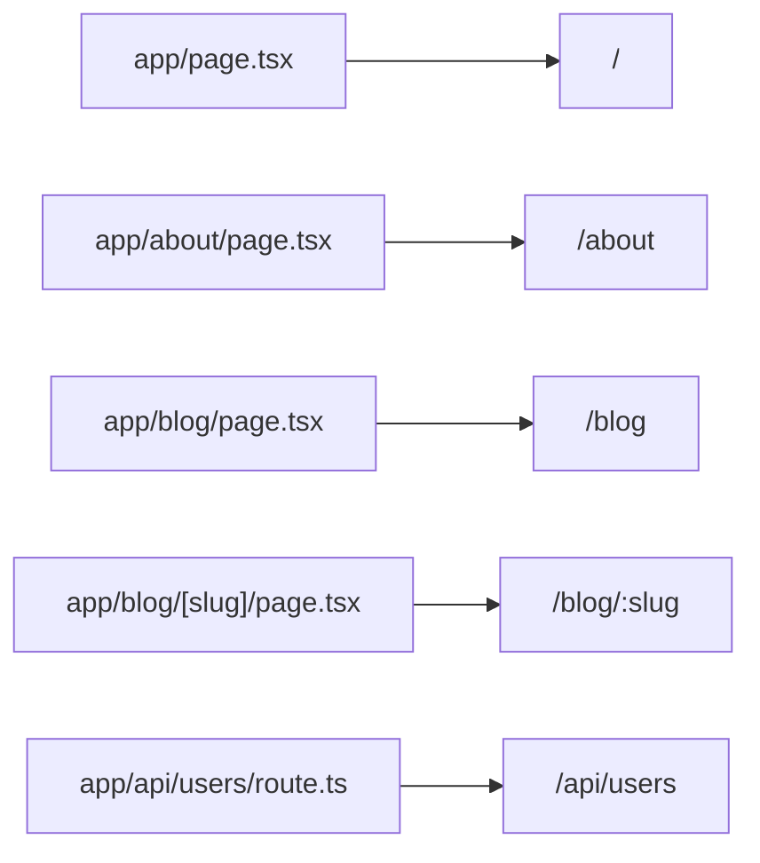

# Tạo project Next.js

`create-next-app` là công cụ dòng lệnh chính thức giúp tạo nhanh một **project** (dự án) Next.js với cấu trúc thư mục và cấu hình mặc định. Sau khi tạo, bạn có thể chạy **dev server** (máy chủ phát triển có tự động tải lại) để xem ứng dụng ngay. Bài này hướng dẫn các bước khởi tạo và làm quen với cấu trúc thư mục cơ bản.

[](pathname:///img/nextjs/create-next-app.webp)

---

:::note[Ghi nhớ nhanh]

- ⭐ **Tạo project bằng `npx create-next-app@latest`** — wizard hỏi TypeScript, Tailwind, App Router, Turbopack, import alias.
- **File-based routing:** routes nằm trong `app/`, mỗi `page.tsx` = một route.
- **Dev:** `npm run dev` (Fast Refresh, HMR, error overlay); **Production:** phải `npm run build` rồi mới `npm run start`.
- **Build report ký hiệu:** `○` Static (build time), `ƒ` Dynamic (mỗi request), `●` ISR (revalidate định kỳ).
- ⭐ **App Router là default 2026;** Pages Router vẫn được hỗ trợ vô thời hạn cho codebase cũ.

:::

---

## Mục lục

- [create-next-app](#create-next-app)
- [Cấu trúc thư mục](#cấu-trúc-thư-mục)
- [File-based routing cơ bản](#file-based-routing-cơ-bản)
- [Chạy dev server](#chạy-dev-server)
- [Build production](#build-production)
- [Câu hỏi phỏng vấn](#câu-hỏi-phỏng-vấn)

---

## create-next-app

CLI chính thức để tạo project mới:

```bash
npx create-next-app@latest my-app
```

Wizard sẽ hỏi:

```
✔ Would you like to use TypeScript? Yes
✔ Would you like to use ESLint? Yes
✔ Would you like to use Tailwind CSS? Yes
✔ Would you like to use `src/` directory? No
✔ Would you like to use App Router? Yes (khuyến nghị)
✔ Would you like to use Turbopack? Yes
✔ Customize default import alias? @/*
```

Tạo nhanh với flag:

```bash
npx create-next-app@latest my-app \
  --typescript \
  --tailwind \
  --app \
  --turbopack \
  --import-alias "@/*"
```

```bash
cd my-app
npm run dev
```

Mở `http://localhost:3000`.

---

## Cấu trúc thư mục

Project mặc định (App Router):

```
my-app/
├── app/                    # routes
│   ├── layout.tsx          # root layout (mandatory)
│   ├── page.tsx            # homepage /
│   ├── globals.css
│   └── favicon.ico
├── public/                 # static assets
│   ├── next.svg
│   └── vercel.svg
├── next.config.ts          # config Next.js
├── tsconfig.json
├── package.json
├── postcss.config.mjs
└── README.md
```

Nếu bạn chọn `src/`:

```
src/
└── app/                    # routes nằm trong src/app
```

:::info[Phân tích]

**Khi nào dùng `src/`?**

- **Có**: code separate khỏi config (next.config, tsconfig ở root).
- **Không**: ngắn hơn — file imports `from "@/app/..."` ngắn.

Đa số project chọn **không** dùng `src/` để gọn. Có `src/` khi:

- Monorepo (cần phân tách rõ).
- Team đã quen pattern src/ từ project khác.

Quyết định một lần — không nên đổi giữa chừng.

:::

---

## File-based routing cơ bản

Mỗi file `page.tsx` trong `app/` = một route:

```
app/
├── page.tsx              → /
├── about/
│   └── page.tsx          → /about
├── blog/
│   ├── page.tsx          → /blog
│   └── [slug]/
│       └── page.tsx      → /blog/:slug
└── api/
    └── users/
        └── route.ts      → /api/users
```

Sơ đồ ánh xạ đường dẫn file trong `app/` sang URL thực tế:



Component cơ bản:

```tsx
// app/page.tsx
export default function HomePage() {
  return (
    <main>
      <h1>Home</h1>
    </main>
  );
}
```

Route với param:

```tsx
// app/blog/[slug]/page.tsx
export default function BlogPost({
  params,
}: {
  params: Promise<{ slug: string }>;
}) {
  return <p>{/* await params */}</p>;
}
```

(Next.js 15+: `params` là Promise, phải `await` trong Server Component.)

---

## Chạy dev server

```bash
npm run dev
# server: http://localhost:3000
# Turbopack: nhanh hơn Webpack 10-100x
```

Đặc điểm dev mode:

- **Fast Refresh** — đổi component, state giữ nguyên.
- **Error overlay** — lỗi hiện trên trình duyệt với stack trace.
- **Hot Module Replacement** — không reload cả app.
- **Type checking** chạy nền (Next.js 15+).

Khi dev với Turbopack, lần đầu compile chậm — sau đó **cực nhanh** do
incremental.

---

## Build production

```bash
npm run build    # build cho production
npm run start    # chạy production server
```

Output trong `.next/`:

```
.next/
├── server/         # SSR bundle
├── static/         # static asset + chunks
├── cache/          # build cache
└── BUILD_ID
```

Build report:

```
Route (app)                         Size    First Load JS
┌ ○ /                              5.2 kB     85 kB
├ ○ /about                         2.1 kB     82 kB
└ ƒ /blog/[slug]                   3.5 kB     83 kB

○ (Static)   prerendered as static content
ƒ (Dynamic)  server-rendered on demand
```

Symbol:

- **○ Static** — pre-render tại build time (SSG).
- **ƒ Dynamic** — render mỗi request (SSR).
- **● ISR** — pre-render + revalidate định kỳ.

:::tip[Mẹo]

**Analyze bundle** — xem chi tiết bundle size:

```bash
npm install -D @next/bundle-analyzer
```

```ts
// next.config.ts
import withBundleAnalyzer from "@next/bundle-analyzer";

const analyzer = withBundleAnalyzer({
  enabled: process.env.ANALYZE === "true",
});

export default analyzer({
  // ... config thường
});
```

Chạy:

```bash
ANALYZE=true npm run build
```

Mở file HTML report → thấy dependency nào chiếm bundle lớn.

:::

:::warning[Cần lưu ý]

**`npm run start` không phải dev mode** — nó là production server đọc
build từ `.next/`. Phải:

1. `npm run build` trước.
2. `npm run start` sau.

Khi dev, dùng `npm run dev`.

Để **simulate production** trong dev:

```bash
npm run build && npm run start
```

Test:
- Bundle size thật.
- ISR behavior.
- Static generation.
- Caching layer.

Đôi khi dev và production behavior khác nhau (cache, hydration). Luôn
test build production trước khi deploy.

:::

:::info[Phân tích]

**Pages Router vs App Router** — Next.js có 2 routing system:

| | Pages Router (cũ) | App Router (mới) |
|--|------------------|-----------------|
| Folder | `pages/` | `app/` |
| Data fetch | `getServerSideProps`, `getStaticProps` | `async` component, `fetch()` |
| Layouts | `_app.tsx`, `_document.tsx` | `layout.tsx` nested |
| Server Components | Không | **Có** (default) |
| Streaming | Hạn chế | **Suspense + RSC** |
| Loading state | Custom | `loading.tsx` |
| Error handling | Custom | `error.tsx` |

Năm 2026, **App Router là default**. Pages Router vẫn được hỗ trợ
**vô thời hạn** — dùng cho:

- Migrate dần codebase cũ.
- Có dependency chưa compat (rare).
- Team chưa sẵn sàng học Server Components.

Project mới: **luôn App Router**. Tài liệu sau đây tập trung App Router.

:::

---

## Câu hỏi phỏng vấn

Những câu thường gặp về chủ đề này. Tự trả lời trước, rồi bấm **Xem đáp án** để đối chiếu.

**1. `create-next-app` làm những gì? Các lựa chọn trong wizard ảnh hưởng thế nào tới project về sau?**

<details className="qa">
<summary>Xem đáp án</summary>

`create-next-app` là CLI chính thức tạo project mới: `npx create-next-app@latest my-app`. Nó dựng sẵn cấu trúc thư mục, cài dependency, sinh file cấu hình và script trong `package.json` — cài xong là `npm run dev` chạy được ngay.

Wizard hỏi những lựa chọn để lại dấu vết lâu dài:

- **TypeScript** — sinh `tsconfig.json`, file `.tsx`; thêm sau được nhưng phải chuyển đổi cả codebase.
- **ESLint** — cấu hình lint mặc định.
- **Tailwind CSS** — cài PostCSS và `globals.css`; đổi hướng styling về sau khá tốn công.
- **Thư mục `src/`** — quyết định nơi đặt toàn bộ code, đổi giữa chừng phải sửa đường dẫn hàng loạt.
- **App Router** — quyết định lớn nhất, kéo theo Server Components và toàn bộ model dữ liệu.
- **Turbopack** — bundler cho dev.
- **Import alias** `@/*` — ghi vào `tsconfig.json`.

Dùng flag tương ứng nếu muốn bỏ qua wizard.

</details>

**2. Dùng thư mục `src/` hay không: đánh đổi là gì, và vì sao nên quyết định một lần ngay từ đầu?**

<details className="qa">
<summary>Xem đáp án</summary>

Hai cách đều hợp lệ, khác nhau ở chỗ đặt code:

- **Có `src/`** — code nằm gọn trong `src/app`, tách bạch với file cấu hình ở root (`next.config.ts`, `tsconfig.json`, `package.json`). Hợp với monorepo hoặc team đã quen pattern này từ project khác.
- **Không có `src/`** — `app/` nằm thẳng ở root, đường dẫn ngắn hơn, ít một tầng lồng. Đa số project chọn cách này cho gọn.

Nên **quyết định một lần ngay từ đầu** vì đổi giữa chừng phải di chuyển toàn bộ cây thư mục, sửa lại import alias, đường dẫn trong cấu hình, script và cả các quy ước nội bộ của team. Git history cũng bị nhiễu bởi một commit "move file" khổng lồ, khiến review và truy vết thay đổi về sau khó hơn hẳn. Đây là loại chi phí thuần tuý không đổi lại lợi ích gì.

</details>

**3. `import alias` kiểu `@/*` được cấu hình ở đâu và giải quyết vấn đề gì?**

<details className="qa">
<summary>Xem đáp án</summary>

`import alias` được cấu hình trong `tsconfig.json` (hoặc `jsconfig.json`), ở mục `paths` — `create-next-app` sinh sẵn khi bạn chọn `@/*` trong wizard.

Nó giải quyết vấn đề **đường dẫn tương đối dài và dễ vỡ**:

```ts
// Không alias: đếm dấu chấm mỏi mắt, đổi thư mục là gãy
import { Button } from "../../../components/ui/button";

// Có alias: đường dẫn tuyệt đối tính từ gốc project
import { Button } from "@/components/ui/button";
```

Lợi ích cụ thể: di chuyển file không phải sửa lại import, đọc code biết ngay module nằm ở đâu trong cây thư mục, và copy một dòng import giữa các file không bị sai tầng. Nếu chọn `src/` thì alias trỏ vào `src/`, còn không thì trỏ vào root — nhưng cách viết trong code vẫn y hệt.

</details>

**4. File-based routing trong thư mục `app/` hoạt động ra sao? URL tương ứng của `app/blog/[slug]/page.tsx` là gì?**

<details className="qa">
<summary>Xem đáp án</summary>

Trong App Router, **cấu trúc thư mục chính là URL**. Mỗi thư mục con trong `app/` là một đoạn đường dẫn, và file `page.tsx` bên trong nó biến đoạn đó thành một route truy cập được:

```
app/page.tsx                 → /
app/about/page.tsx           → /about
app/blog/page.tsx            → /blog
app/blog/[slug]/page.tsx     → /blog/:slug
app/api/users/route.ts       → /api/users
```

Thư mục đặt tên trong ngoặc vuông là **dynamic segment** — nó khớp với bất kỳ giá trị nào và truyền giá trị đó vào component qua `params`.

Vậy `app/blog/[slug]/page.tsx` ứng với URL `/blog/:slug` — ví dụ `/blog/hoc-nextjs` sẽ cho `slug` bằng `"hoc-nextjs"`. Thư mục không chứa `page.tsx` thì không tạo ra route, chỉ dùng để nhóm file hoặc chứa layout.

</details>

**5. Phân biệt vai trò của `page.tsx`, `layout.tsx` và `route.ts`. Root layout bắt buộc phải có những gì?**

<details className="qa">
<summary>Xem đáp án</summary>

Ba file, ba vai trò khác nhau:

- **`page.tsx`** — UI của một route cụ thể, và là thứ khiến thư mục đó trở thành URL truy cập được. Không có nó thì thư mục chỉ là nơi chứa file.
- **`layout.tsx`** — khung bao quanh các route con, **lồng nhau** theo cây thư mục và **giữ nguyên state khi điều hướng** giữa các route cùng layout (thanh nav, sidebar không bị dựng lại).
- **`route.ts`** — không render UI mà xử lý HTTP, export handler theo method (`GET`, `POST`...) và trả về `Response`. Một thư mục đã có `route.ts` thì không đặt `page.tsx` cùng chỗ.

**Root layout** (`app/layout.tsx`) là bắt buộc và đặc biệt: nó phải tự render thẻ `html` và `body`, vì đây là layout ngoài cùng bao cả ứng dụng. Đây cũng là nơi khai báo metadata gốc và nạp CSS toàn cục.

</details>

**6. Các file đặc biệt `loading.tsx`, `error.tsx`, `not-found.tsx` hoạt động thế nào, và liên quan ra sao tới `Suspense` / `Error Boundary`?**

<details className="qa">
<summary>Xem đáp án</summary>

Ba file đặc biệt cho phép khai báo trạng thái của route bằng file thay vì viết tay boilerplate:

- **`loading.tsx`** — Next.js tự bọc nội dung route trong một `Suspense` boundary và dùng file này làm fallback. Trong lúc Server Component còn đang lấy dữ liệu, người dùng thấy skeleton ngay thay vì màn hình trắng.
- **`error.tsx`** — được bọc thành **Error Boundary** cho nhánh route đó. Nó phải là Client Component, nhận `error` và `reset` để cho phép thử lại mà không reload cả trang.
- **`not-found.tsx`** — UI hiển thị khi route không tồn tại hoặc khi code chủ động báo không tìm thấy dữ liệu.

Điểm quan trọng: chúng đặt ở **cấp thư mục nào thì áp dụng cho nhánh đó**, nên có thể có loading/error riêng cho từng khu vực. Lỗi ở một nhánh không làm sập cả app, và phần còn lại của layout vẫn hiển thị bình thường.

</details>

**7. Vì sao từ Next.js 15, `params` và `searchParams` là `Promise`? Điều đó ảnh hưởng thế nào tới code cũ?**

<details className="qa">
<summary>Xem đáp án</summary>

Từ Next.js 15, `params` và `searchParams` là **`Promise`** thay vì object đồng bộ:

```tsx
export default async function BlogPost({
  params,
}: {
  params: Promise<{ slug: string }>;
}) {
  const { slug } = await params;
  return <p>{slug}</p>;
}
```

Lý do: đọc chúng khiến route trở thành dynamic. Biến thành Promise cho phép Next.js **không chặn việc render** ở phần không phụ thuộc vào chúng — phần tĩnh vẫn được chuẩn bị trước, phần cần request mới chờ. Điều này ăn khớp với mô hình streaming và render theo từng phần.

Ảnh hưởng tới code cũ: mọi chỗ truy cập thẳng `params.slug` đều phải đổi thành `await params` trước, kéo theo component phải là `async`. Đây là breaking change khi nâng cấp, nhưng có codemod hỗ trợ chuyển đổi hàng loạt.

</details>

**8. `npm run dev` khác `npm run build` cộng `npm run start` ở điểm nào? Vì sao không được chạy dev server cho production?**

<details className="qa">
<summary>Xem đáp án</summary>

- **`npm run dev`** chạy dev server: biên dịch theo yêu cầu, giữ source map đầy đủ, bật Fast Refresh, HMR và error overlay hiện stack trace ngay trên trình duyệt. Mục tiêu là vòng lặp sửa–xem thật nhanh.
- **`npm run build`** biên dịch toàn bộ ra `.next/`: minify, code splitting, pre-render các route tĩnh, sinh build report. **`npm run start`** chỉ phục vụ kết quả đã build đó — nó không compile gì thêm, nên phải build trước rồi mới start.

Không dùng dev server cho production vì nó **chậm hơn nhiều lần** (compile lúc chạy, không minify, bundle lớn), tốn bộ nhớ, và **để lộ thông tin nội bộ** qua error overlay cùng source map. Ngoài ra hành vi cache, ISR và static generation ở dev khác production, nên phải `npm run build && npm run start` để kiểm thử đúng thứ sẽ chạy thật.

</details>

**9. Fast Refresh và `HMR` khác nhau ra sao? Khi nào Fast Refresh làm mất state của component?**

<details className="qa">
<summary>Xem đáp án</summary>

**HMR** (Hot Module Replacement) là cơ chế chung của bundler: thay module đã đổi ngay trong trang đang chạy, không reload cả app. Nó không biết gì về React.

**Fast Refresh** là lớp bên trên HMR, hiểu React: khi bạn sửa một component, nó render lại đúng component đó và **giữ nguyên state** — đang gõ dở form hay mở dở modal thì vẫn nguyên.

Fast Refresh **mất state** trong các trường hợp:

- File không chỉ export component mà còn export giá trị khác, hoặc export không phải component thuần.
- Sửa file nằm ngoài component: hook dùng chung, module util, file cấu hình.
- Đổi vị trí/thứ tự hook, làm cấu trúc component thay đổi bản chất.
- Lỗi runtime khiến component bị unmount, hoặc sửa root layout.

Khi đó nó tự hạ cấp thành full reload — đó là hành vi có chủ đích để tránh state sai lệch.

</details>

**10. Turbopack khác Webpack ở đâu? Vì sao lần compile đầu chậm rồi sau đó lại rất nhanh?**

<details className="qa">
<summary>Xem đáp án</summary>

**Webpack** viết bằng JavaScript, đã rất chín và ecosystem plugin khổng lồ. **Turbopack** viết bằng Rust, thiết kế quanh việc biên dịch **incremental** và tận dụng đa luồng — nhanh hơn Webpack rất nhiều trong vòng lặp dev, và là lựa chọn mặc định khi tạo project mới.

Lần compile đầu chậm vì chưa có gì để tái sử dụng: phải đọc, phân giải và biên dịch toàn bộ module trong phạm vi cần thiết, đồng thời **dựng cache** ánh xạ từng đơn vị công việc.

Những lần sau nhanh vì Turbopack chỉ làm lại **đúng phần bị ảnh hưởng** bởi thay đổi, phần còn lại lấy thẳng từ cache. Nó cũng biên dịch theo nhu cầu — route nào bạn mở thì mới biên dịch route đó, thay vì dựng cả app. Vì vậy dự án càng lớn thì khác biệt càng rõ.

</details>

**11. Đọc build report: các ký hiệu `○`, `ƒ`, `●` nghĩa là gì? Vì sao một route bạn tưởng là static lại thành dynamic?**

<details className="qa">
<summary>Xem đáp án</summary>

Ký hiệu trong build report cho biết route được render lúc nào:

- **`○` Static** — pre-render tại build time (SSG), phục vụ như file tĩnh.
- **`ƒ` Dynamic** — render ở server **mỗi request** (SSR).
- **`●` ISR** — pre-render sẵn nhưng revalidate định kỳ.

Route tưởng static mà thành dynamic thường vì trong cây component có thứ **phụ thuộc vào request**, khiến Next.js buộc phải render lúc chạy:

- Đọc `cookies()`, `headers()`, hoặc `searchParams`.
- `fetch` được khai báo là không cache, hoặc dùng option buộc lấy dữ liệu tươi.
- Route khai báo tường minh là dynamic.
- Dùng API chỉ có ý nghĩa trong ngữ cảnh một request cụ thể.

Chỉ cần một component sâu trong cây đụng vào những thứ đó là **cả route** chuyển sang dynamic. Cách xử lý: cô lập phần cần dữ liệu tươi vào một nhánh riêng bọc trong `Suspense`, giữ phần còn lại tĩnh.

</details>

**12. `First Load JS` trong báo cáo build đo cái gì, và khác gì với cột Size?**

<details className="qa">
<summary>Xem đáp án</summary>

Trong build report có hai cột dễ nhầm:

- **Size** — phần JS **của riêng route đó**, tức những chunk chỉ route này dùng.
- **First Load JS** — **tổng** JS mà trình duyệt phải tải để hiển thị route đó lần đầu: phần riêng của route **cộng** các chunk dùng chung (framework React, runtime Next.js, code trong root layout, shared chunk giữa các route).

Vì vậy First Load JS luôn lớn hơn Size, và trong ví dụ của bài, một route chỉ 2.1 kB vẫn có First Load JS 82 kB — gần như toàn bộ đến từ phần dùng chung.

Con số đáng quan tâm khi tối ưu là **First Load JS**, vì đó mới là thứ người dùng thực sự phải tải trước khi trang trở nên interactive. Muốn giảm nó thì phải nhắm vào phần dùng chung: bớt thư viện nặng ở root layout, thu hẹp Client Component, import động những gì không cần ngay.

</details>

**13. Bạn dùng `@next/bundle-analyzer` thế nào để tìm dependency làm phình bundle, và xử lý tiếp ra sao?**

<details className="qa">
<summary>Xem đáp án</summary>

Cài và bật analyzer qua biến môi trường:

```bash
npm install -D @next/bundle-analyzer
ANALYZE=true npm run build
```

Trong `next.config.ts`, bọc config bằng `withBundleAnalyzer` với `enabled` phụ thuộc `process.env.ANALYZE`. Build xong mở file HTML report — treemap hiển thị mỗi ô là một module, diện tích tỉ lệ với dung lượng, nên dependency phình to lộ ra ngay.

Xử lý tiếp theo, theo thứ tự ưu tiên:

- Thư viện chỉ dùng ở server → đẩy vào Server Component để nó không vào bundle client.
- Thư viện nặng nhưng dùng muộn (chart, editor, modal) → import động, tải khi cần.
- Import cả package chỉ để lấy một hàm → import đúng phần cần, hoặc thay bằng thư viện nhẹ hơn.
- Trùng lặp nhiều phiên bản của cùng một package → thống nhất version.

Sau mỗi thay đổi, build lại và đối chiếu First Load JS để biết có thực sự cải thiện.

</details>

**14. Thư mục `.next/` chứa những gì? Cái nào nên đưa vào Docker image và cái nào không nên commit?**

<details className="qa">
<summary>Xem đáp án</summary>

`.next/` là **kết quả build**, gồm:

- `server/` — bundle dùng cho SSR và các hàm chạy ở server.
- `static/` — asset tĩnh và chunk JS/CSS có hash trong tên.
- `cache/` — cache của build và của dữ liệu.
- `BUILD_ID` — định danh của lần build.

**Không commit `.next/`** — đây là artifact sinh ra tự động, thay đổi mỗi lần build, làm phình repo và gây conflict vô nghĩa. `create-next-app` đã đưa nó vào `.gitignore` sẵn.

Với **Docker**: không copy `.next/` từ máy cá nhân vào image. Hãy build bên trong image theo dạng multi-stage — stage build sinh ra `.next/`, stage chạy chỉ nhận phần cần thiết (output standalone cùng `.next/static` và `public/`). Riêng `.next/cache` thì không nên đưa vào image cuối, nhưng nên lưu lại giữa các lần chạy CI để build nhanh hơn.

</details>

**15. Thư mục `public/` khác gì với việc import asset trực tiếp trong code?**

<details className="qa">
<summary>Xem đáp án</summary>

Hai cách phục vụ asset khác nhau về bản chất:

- **`public/`** — file được copy nguyên vẹn ra gốc web. `public/logo.png` truy cập bằng `/logo.png`. Tên file **không đổi**, không qua xử lý, không có hash. Bundler không biết gì về nó nên sai đường dẫn chỉ phát hiện lúc chạy.
- **Import trực tiếp trong code** — file đi qua bundler: được hash vào tên nên cache vĩnh viễn an toàn, sai đường dẫn báo lỗi ngay lúc build, và với ảnh thì import còn mang theo kích thước để tránh layout shift khi dùng với thành phần Image.

Chọn thế nào: `public/` cho những file cần URL cố định và có thể đoán trước — `favicon`, `robots.txt`, `sitemap`, ảnh chia sẻ mạng xã hội, file tải về. Import trực tiếp cho asset thuộc về giao diện — icon, ảnh minh hoạ, font — vì được tối ưu và kiểm tra tự động.

</details>

**16. So sánh `Pages Router` và `App Router`. Khi nào một dự án vẫn nên ở lại `Pages Router`?**

<details className="qa">
<summary>Xem đáp án</summary>

| | Pages Router (cũ) | App Router (mới) |
|--|------------------|-----------------|
| Thư mục | `pages/` | `app/` |
| Lấy dữ liệu | `getServerSideProps`, `getStaticProps` | Component `async`, `fetch()` |
| Layout | `_app.tsx`, `_document.tsx` | `layout.tsx` lồng nhau |
| Server Components | Không | Có, và là mặc định |
| Streaming | Hạn chế | Suspense + RSC |
| Loading / Error | Tự viết | `loading.tsx` / `error.tsx` |

Năm 2026 **App Router là mặc định**, và project mới nên luôn chọn nó. Pages Router vẫn được hỗ trợ **vô thời hạn**, nên vẫn hợp lý khi:

- Codebase cũ đang chạy ổn định, migrate dần từng route thay vì viết lại.
- Còn dependency chưa tương thích với App Router.
- Team chưa sẵn sàng đầu tư học model Server Components.

Hai router chạy song song được trong cùng một project, nên chiến lược an toàn là giữ phần cũ và viết route mới bằng App Router.

</details>
