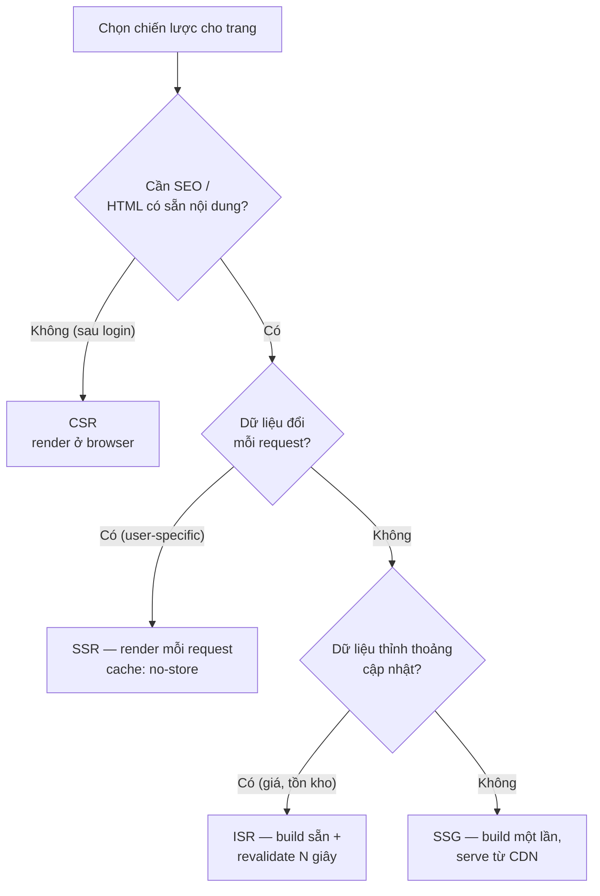
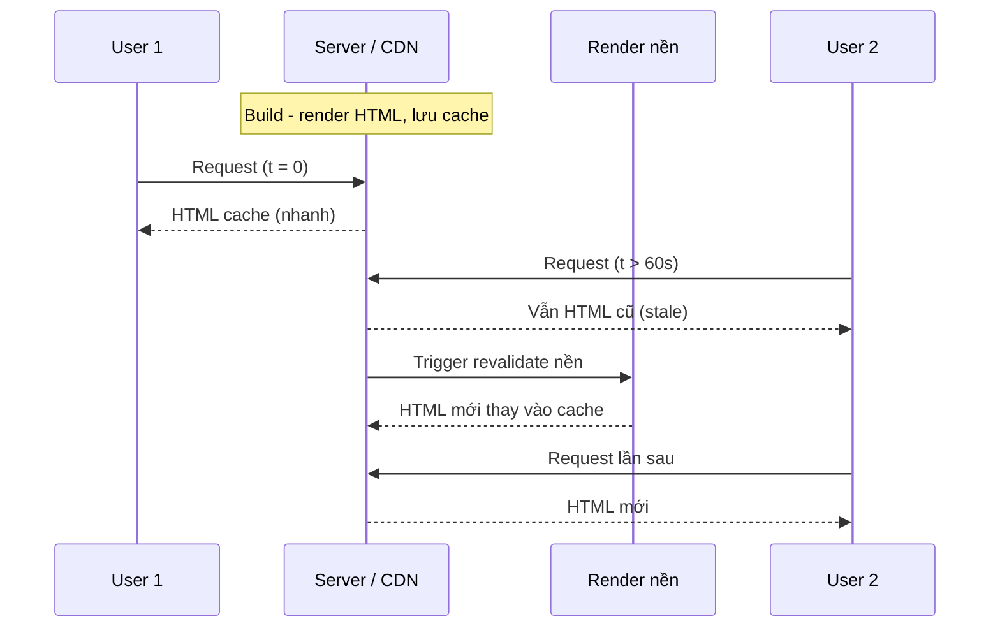

# Rendering Strategies

**Rendering strategy** (chiến lược kết xuất) là cách Next.js tạo ra HTML cho trang: ở phía máy chủ, lúc build, hay ngay trên trình duyệt. Mỗi cách như **SSR** (kết xuất phía máy chủ), **SSG** (tạo trang tĩnh lúc build) hay **ISR** (tạo lại trang tĩnh theo từng phần) có ưu nhược điểm riêng về tốc độ và độ mới của dữ liệu. Bài này giúp bạn hiểu và chọn đúng chiến lược cho từng trang.

[](pathname:///img/nextjs/rendering-strategies.webp)

---

:::note[Ghi nhớ nhanh]

- ⭐ **4 chiến lược:** SSR (render mỗi request), SSG (render lúc build), ISR (build + revalidate định kỳ), CSR (render ở browser).
- ⭐ **App Router bỏ `getStaticProps`/`getServerSideProps`** — chọn mode qua `fetch` options: mặc định → Static, `next: { revalidate: N }` → ISR, `cache: "no-store"`/`cookies()`/`searchParams` → Dynamic (SSR).
- **ISR là sweet spot** cho e-commerce/content: nhanh như SSG, tươi như SSR; làm mới on-demand bằng `revalidatePath`/`revalidateTag`.
- **Server Components** là mặc định — chạy trên server, không vào bundle, `await` data trực tiếp; chỉ `"use client"` cho phần interactive.
- **Mental model mới:** nghĩ về *data* (static hay dynamic), Next.js tự quyết rendering mode.

:::

---

## Mục lục

- [Vì sao có nhiều chiến lược rendering?](#vì-sao-có-nhiều-chiến-lược-rendering)
- [4 chiến lược rendering](#4-chiến-lược-rendering)
- [SSR (Server-Side Rendering)](#ssr-server-side-rendering)
- [SSG (Static Site Generation)](#ssg-static-site-generation)
- [ISR (Incremental Static Regeneration)](#isr-incremental-static-regeneration)
- [CSR (Client-Side Rendering)](#csr-client-side-rendering)
- [Server Components](#server-components)
- [Câu hỏi phỏng vấn](#câu-hỏi-phỏng-vấn)

---

## Vì sao có nhiều chiến lược rendering?

**Vấn đề:** React SPA thuần render hoàn toàn ở client (CSR). Trình duyệt nhận về một trang gần như trống rồi mới chạy JS để dựng nội dung:

```jsx
// CSR thuần: HTML ban đầu rỗng, mọi thứ render ở client
function ProductPage() {
  const [product, setProduct] = useState(null);

  useEffect(() => {
    fetch("/api/products/1")
      .then((r) => r.json())
      .then(setProduct);
  }, []);

  if (!product) return <p>Loading...</p>; // trang trắng lúc đầu
  return <h1>{product.name}</h1>;
}
```

Hệ quả: **trang trắng lúc đầu**, **SEO kém** (bot thấy HTML rỗng), **tải chậm trên máy yếu** (phải chờ JS chạy xong). Nhưng cũng không phải trang nào cũng nên render sẵn — trang cá nhân hoá cần dữ liệu mới mỗi lần. **Một cách render không hợp mọi loại trang.**

**Giải pháp:** Next.js hỗ trợ **nhiều chiến lược** để chọn theo từng trang, cân bằng giữa tốc độ, SEO và độ tươi của dữ liệu:

```tsx
// SSG: build sẵn HTML lúc build — blog, landing (nhanh + SEO tốt)
export default async function BlogPost() {
  const post = await fetch("https://api.example.com/post").then((r) => r.json());
  return <article>{post.title}</article>; // tĩnh, phục vụ ngay
}

// SSR: render mỗi request — trang cá nhân hoá
export default async function Dashboard() {
  const data = await fetch("https://api.example.com/me", {
    cache: "no-store", // luôn render mới mỗi request
  }).then((r) => r.json());
  return <h1>Xin chào {data.name}</h1>;
}

// ISR: build sẵn + tự làm mới định kỳ — trang sản phẩm
export default async function Product() {
  const product = await fetch("https://api.example.com/product", {
    next: { revalidate: 60 }, // làm mới mỗi 60 giây
  }).then((r) => r.json());
  return <h1>{product.name}</h1>;
}
```

:::tip[Dùng thực tế]

- **Blog / trang marketing** → SSG: build sẵn một lần, phục vụ siêu nhanh và SEO tốt.
- **Dashboard cá nhân hoá** → SSR: render mỗi request để luôn hiển thị dữ liệu của đúng người dùng.
- **Trang sản phẩm e-commerce** → ISR: build sẵn cho nhanh nhưng tự làm mới định kỳ khi giá/tồn kho đổi.
- **Phần tương tác (nút, form, filter)** → CSR: chạy ở client để phản hồi tức thì với thao tác người dùng.

:::

---

## 4 chiến lược rendering

Next.js hỗ trợ tất cả các mode rendering:

| Mode | Khi nào render | Khi nào dùng |
|------|---------------|--------------|
| **SSR** | Mỗi request | Data đổi mỗi request (user-specific) |
| **SSG** | Build time | Content tĩnh (blog, docs) |
| **ISR** | Build + revalidate định kỳ | Content updatable (e-commerce) |
| **CSR** | Browser | Dashboard sau login, không SEO |

Sơ đồ dưới đây tóm tắt cách chọn chiến lược theo đặc điểm dữ liệu của trang:



App Router thay đổi cách định nghĩa — không còn `getStaticProps`/
`getServerSideProps`. Thay vào đó dùng **fetch options + revalidate**.

---

## SSR (Server-Side Rendering)

Render HTML **mỗi request** trên server.

```tsx
// app/users/[id]/page.tsx
export default async function UserPage({ params }) {
  const { id } = await params;
  const user = await fetch(`https://api.example.com/users/${id}`, {
    cache: "no-store", // ép SSR
  }).then(r => r.json());

  return <div>{user.name}</div>;
}
```

`cache: "no-store"` → render mỗi request, không cache.

Hoặc dùng dynamic API trong component → tự thành SSR:

```tsx
import { cookies } from "next/headers";

export default async function ProfilePage() {
  const cookieStore = await cookies();
  const token = cookieStore.get("token");
  // dùng cookies → page là SSR
}
```

:::info[Phân tích]

**SSR phù hợp khi:**

- Page **user-specific** (dashboard, profile).
- Data **thay đổi mỗi request** (real-time, personalized).
- Cần đọc **cookie, header, IP**.
- SEO + fresh data đồng thời.

Trade-off:

- **Slower TTFB** — server phải render mỗi request.
- **Cần Node.js runtime** chạy (hoặc Edge).
- **Khó scale** với traffic cao (mỗi request CPU).

→ Cân nhắc **ISR** thay SSR khi data không cần real-time.

:::

---

## SSG (Static Site Generation)

Render HTML **tại build time** — serve như file tĩnh.

```tsx
// app/blog/[slug]/page.tsx
export async function generateStaticParams() {
  const posts = await fetchPosts();
  return posts.map(p => ({ slug: p.slug }));
}

export default async function BlogPost({ params }) {
  const { slug } = await params;
  const post = await fetchPost(slug); // chạy build time
  return <article>{post.content}</article>;
}
```

`generateStaticParams` báo Next.js list `slug` cần pre-render. Khi build:

- Mọi `/blog/:slug` được render thành HTML.
- Deploy lên CDN — serve nhanh nhất.

Phù hợp:

- **Blog, docs, marketing** — content không đổi thường xuyên.
- **Product detail** — số lượng giới hạn.
- **Landing page**.

---

## ISR (Incremental Static Regeneration)

Kết hợp SSG + revalidate — pre-render tại build, **refresh background** sau X giây.

```tsx
export default async function ProductPage({ params }) {
  const { id } = await params;
  const product = await fetch(`/api/products/${id}`, {
    next: { revalidate: 60 }, // revalidate sau 60s
  }).then(r => r.json());

  return <ProductDetail product={product} />;
}
```

Flow:

1. Build: render `/products/123`, save HTML.
2. User 1 request lúc t=0 → serve HTML cũ ngay (fast).
3. Sau 60s, user 2 request → serve HTML cũ + trigger revalidate background.
4. Lần sau request → serve HTML mới.



**On-demand revalidation** — trigger từ API hoặc Server Action:

```ts
import { revalidatePath, revalidateTag } from "next/cache";

// Sau khi update DB
revalidatePath("/products/123");
revalidateTag("products");
```

:::tip[Mẹo]

**ISR là sweet spot** cho e-commerce, content site:

- **Speed như SSG** (CDN cached HTML).
- **Fresh như SSR** (revalidate khi cần).
- **Scale tốt** (không tạo load mỗi request).

E-commerce điển hình:

```tsx
// Product page
export default async function Product({ params }) {
  const product = await fetch(`/api/products/${(await params).id}`, {
    next: { revalidate: 3600, tags: [`product-${id}`] },
  }).then(r => r.json());
}

// Khi admin update product → revalidate tag tương ứng
revalidateTag(`product-${id}`);
```

Page mới sẽ ngay lập tức có data mới — user không phải đợi cache TTL.

:::

---

## CSR (Client-Side Rendering)

Render trong browser — Server Component trả về Client Component:

```tsx
"use client";

import { useState, useEffect } from "react";

export default function Dashboard() {
  const [data, setData] = useState(null);

  useEffect(() => {
    fetch("/api/dashboard").then(r => r.json()).then(setData);
  }, []);

  if (!data) return <Spinner />;
  return <div>{data.title}</div>;
}
```

CSR phù hợp:

- **Sau login** — không cần SEO.
- **Real-time** — WebSocket, polling.
- **Interactive heavy** — editor, game, dashboard.

→ Nhưng vẫn nên dùng **Server Component cho shell** + Client Component
chỉ cho interactive part. Đừng "use client" toàn app.

---

## Server Components

Mặc định trong App Router. Server Component:

- Chạy **trên server**, không vào client bundle.
- Có thể `await` data, đọc DB, đọc file.
- Không có hook (useState, useEffect).
- Không có event handler (`onClick`).

```tsx
// app/page.tsx — Server Component (default)
async function HomePage() {
  const data = await fetchData(); // server-side
  return (
    <main>
      <h1>{data.title}</h1>
      <InteractiveButton /> {/* Client component */}
    </main>
  );
}
```

```tsx
// app/InteractiveButton.tsx
"use client";

import { useState } from "react";

export default function InteractiveButton() {
  const [count, setCount] = useState(0);
  return <button onClick={() => setCount(c => c + 1)}>{count}</button>;
}
```

:::info[Phân tích]

**Render mode quyết định bởi feature page dùng:**

| Dùng | Mode |
|------|------|
| `fetch(url)` không option | **Static** (build time) |
| `fetch(url, { next: { revalidate: N } })` | **ISR** |
| `fetch(url, { cache: "no-store" })` | **Dynamic** (SSR) |
| `cookies()`, `headers()` | **Dynamic** (SSR) |
| `searchParams` prop | **Dynamic** (SSR) |
| Tất cả static | **Static** |

Next.js tự detect — không phải khai báo SSR/SSG/ISR thủ công. Build
output cho biết mỗi route mode nào:

```
○ /                    Static
ƒ /dashboard           Dynamic
● /products/[id]       ISR (3600s)
```

→ **Mental model mới**: nghĩ về **data**, không phải về "rendering mode".
Data static → page static. Data dynamic → page dynamic.

:::

:::warning[Cần lưu ý]

**`output: "export"`** — chế độ Static Export, mọi page phải static:

```ts
// next.config.ts
export default {
  output: "export",
};
```

Hạn chế:

- Không Server Actions.
- Không Image Optimization (cần `unoptimized: true`).
- Không Middleware.
- Không API routes (route handlers).
- Không dynamic API (`cookies`, `headers`).

→ Chỉ dùng khi cần deploy **CDN tĩnh** (S3, GitHub Pages, Cloudflare Pages).
Nếu cần feature đầy đủ, deploy lên Node server (Vercel, AWS Amplify, Railway).

:::

---

## Câu hỏi phỏng vấn

Những câu thường gặp về chủ đề này. Tự trả lời trước, rồi bấm **Xem đáp án** để đối chiếu.

**1. Giải thích sự khác nhau giữa `SSR`, `SSG`, `ISR` và `CSR` — mỗi cách tạo HTML ở thời điểm nào?**

<details className="qa">
<summary>Xem đáp án</summary>

| Chiến lược | HTML tạo ra lúc nào | Đặc điểm |
|---|---|---|
| **SSG** | Build time | Serve như file tĩnh từ CDN, nhanh nhất, dữ liệu đóng băng tại lúc build |
| **ISR** | Build time, rồi tái sinh nền sau N giây | Nhanh như SSG nhưng tự làm mới |
| **SSR** | Mỗi request, ở server | Luôn tươi, đọc được cookie/header, TTFB chậm hơn |
| **CSR** | Trong browser, sau khi tải JS | HTML ban đầu gần như rỗng, SEO kém |

Trục phân biệt chỉ có hai: **render ở đâu** (server hay browser) và **render lúc nào** (build hay request). SSG và ISR trả lời trước; SSR trả lời đúng lúc được hỏi; CSR đẩy toàn bộ việc dựng nội dung sang máy người dùng. Trong Next.js, các chiến lược này chọn theo **từng route** chứ không phải cho cả ứng dụng.

</details>

**2. Cho ba trang: blog marketing, dashboard sau đăng nhập, trang chi tiết sản phẩm e-commerce — bạn chọn chiến lược nào cho từng trang và lập luận ra sao?**

<details className="qa">
<summary>Xem đáp án</summary>

- **Blog marketing** → **SSG**. Nội dung hiếm khi đổi và ai xem cũng thấy giống nhau, nên build sẵn một lần rồi phục vụ từ CDN: nhanh nhất, rẻ nhất, SEO tốt nhất. Có sửa bài thì deploy lại hoặc thêm revalidate dài.
- **Dashboard sau đăng nhập** → **SSR** hoặc CSR. Dữ liệu phụ thuộc đúng người dùng đang đăng nhập nên không thể cache chung; phải đọc cookie/session mỗi request. Không cần SEO vì bot không vào được sau đăng nhập.
- **Trang chi tiết sản phẩm e-commerce** → **ISR**. Cần SEO và tốc độ như trang tĩnh, nhưng giá và tồn kho thỉnh thoảng đổi. Build sẵn rồi `revalidate` định kỳ; khi admin sửa sản phẩm thì `revalidateTag` để cập nhật ngay không phải chờ hết TTL.

Lập luận chung: hỏi **dữ liệu có phụ thuộc người dùng không** và **đổi nhanh cỡ nào**, câu trả lời sẽ tự ra chiến lược.

</details>

**3. Trong `App Router`, `getStaticProps` và `getServerSideProps` đi đâu mất? Giờ khai báo chiến lược render bằng cách nào?**

<details className="qa">
<summary>Xem đáp án</summary>

Trong App Router chúng **không còn tồn tại** — đó là API của Pages Router. Thay vì khai báo chiến lược ở cấp trang bằng một hàm export, giờ chiến lược được **suy ra từ cách bạn lấy dữ liệu**:

```tsx
// Static (mặc định) — tương đương getStaticProps
const a = await fetch(url);

// ISR
const b = await fetch(url, { next: { revalidate: 60 } });

// Dynamic / SSR — tương đương getServerSideProps
const c = await fetch(url, { cache: "no-store" });
```

Ngoài ra, chạm vào `cookies()`, `headers()` hoặc `searchParams` cũng đẩy route sang Dynamic. `generateStaticParams` thay cho `getStaticPaths` để liệt kê các param cần pre-render.

Mental model đổi hẳn: bạn mô tả **dữ liệu** là tĩnh hay động, Next.js tự quyết rendering mode và in kết quả ra trong build output.

</details>

**4. Những yếu tố nào khiến Next.js tự chuyển một route từ Static sang Dynamic?**

<details className="qa">
<summary>Xem đáp án</summary>

Một route mặc định là Static; nó chuyển sang Dynamic khi trong cây component có thứ phụ thuộc vào request cụ thể:

- `fetch` với `cache: "no-store"` — ép lấy dữ liệu tươi mỗi lần.
- Gọi **dynamic API**: `cookies()`, `headers()`.
- Đọc prop `searchParams` của page.
- Khai báo tường minh route là dynamic trong file.

Điểm hay bị bỏ sót: chỉ cần **một component nằm sâu trong cây** đụng vào những thứ đó là **cả route** chuyển sang Dynamic — kể cả khi 90% nội dung trang hoàn toàn tĩnh. Ví dụ một thanh header đọc cookie để hiện tên người dùng cũng đủ làm cả trang mất tính tĩnh.

Cách kiểm soát: cô lập phần phụ thuộc request vào một nhánh riêng bọc trong `Suspense`, để phần còn lại vẫn được pre-render.

</details>

**5. `cache: "no-store"` và `next: { revalidate: N }` khác nhau ra sao về hành vi cache và độ tươi dữ liệu?**

<details className="qa">
<summary>Xem đáp án</summary>

| | `cache: "no-store"` | `next: { revalidate: N }` |
|---|---|---|
| Cache | Không cache gì cả | Cache kết quả, coi là còn tươi trong N giây |
| Thời điểm lấy dữ liệu | Mỗi request | Khi bản cache quá N giây thì tái sinh ở nền |
| Route thành | Dynamic (SSR) | ISR |
| Độ tươi | Luôn mới tuyệt đối | Trễ tối đa khoảng N giây |
| Tải lên backend | Mỗi request một lần gọi | Nhiều nhất một lần gọi mỗi N giây |

Chọn `no-store` khi dữ liệu **không được phép cũ dù chỉ một giây** hoặc riêng theo từng người dùng — số dư tài khoản, giỏ hàng, dashboard cá nhân.

Chọn `revalidate` khi chấp nhận một khoảng trễ nhỏ để đổi lấy tốc độ và giảm tải backend — giá sản phẩm, danh sách bài viết, trang tin. Đây cũng là lựa chọn mặc định nên cân nhắc trước, vì `no-store` đẩy toàn bộ chi phí render về phía server.

</details>

**6. Mô tả từng bước luồng của `ISR`: người dùng request ngay sau khi hết hạn revalidate sẽ nhận HTML cũ hay mới, và vì sao?**

<details className="qa">
<summary>Xem đáp án</summary>

Luồng ISR theo từng bước:

1. **Build**: render `/products/123` và lưu HTML vào cache.
2. **User 1 request lúc t = 0**: nhận ngay HTML từ cache — rất nhanh.
3. **User 2 request lúc t > 60s** (đã quá hạn revalidate): **vẫn nhận HTML cũ**, đồng thời request này **kích hoạt việc render lại ở nền**.
4. **Render nền xong**: HTML mới thay vào cache.
5. **Request tiếp theo**: nhận HTML mới.

Vậy người dùng request ngay sau khi hết hạn nhận **HTML cũ**. Lý do là mô hình *stale-while-revalidate*: ưu tiên trả lời tức thì thay vì bắt người dùng đứng chờ render. Nếu chặn để render mới, request đó sẽ chậm đúng bằng SSR — mất luôn lợi thế của ISR.

Hệ quả cần nhớ: người "xui" nhất chỉ thấy dữ liệu cũ thêm **một lượt** chứ không phải mãi mãi.

</details>

**7. Vì sao `ISR` được coi là điểm cân bằng giữa `SSG` và `SSR`? Đánh đổi phải chấp nhận là gì?**

<details className="qa">
<summary>Xem đáp án</summary>

ISR đứng giữa vì nó lấy điểm mạnh của cả hai:

- **Tốc độ như SSG** — phục vụ HTML đã cache, đi qua CDN, TTFB rất thấp.
- **Độ tươi gần như SSR** — dữ liệu tự làm mới theo chu kỳ, hoặc làm mới ngay bằng `revalidatePath` / `revalidateTag`.
- **Scale tốt** — mỗi chu kỳ chỉ render lại một lần, không tạo tải theo từng request.

Đánh đổi phải chấp nhận:

- Dữ liệu có thể **cũ** trong khoảng tối đa N giây, và request đầu tiên sau khi hết hạn chắc chắn nhận bản cũ.
- **Không cá nhân hoá được** — cache dùng chung cho mọi người, nên không dùng cho trang phụ thuộc người dùng.
- Cần hạ tầng hỗ trợ cache dùng chung; self-host nhiều instance thì cache dễ lệch nhau.
- Thêm một tầng cache phải suy luận, dễ sinh bug dữ liệu cũ nếu quên revalidate sau khi mutation.

</details>

**8. `revalidatePath` và `revalidateTag` khác nhau thế nào? Tình huống nào bắt buộc phải dùng `revalidateTag`?**

<details className="qa">
<summary>Xem đáp án</summary>

Cả hai đều dùng để làm mới cache theo yêu cầu, khác ở **đơn vị nhắm tới**:

- **`revalidatePath("/products/123")`** — làm mới theo **đường dẫn**. Biết chính xác URL nào bị ảnh hưởng thì dùng cách này.
- **`revalidateTag("products")`** — làm mới theo **nhãn** gắn vào các lần fetch. Mọi dữ liệu mang nhãn đó, dù nằm ở bao nhiêu route, đều được đánh dấu cũ cùng lúc.

Bắt buộc dùng `revalidateTag` khi **một mẩu dữ liệu xuất hiện ở nhiều trang không đoán trước được**: sửa một sản phẩm thì ngoài trang chi tiết còn có trang danh mục, trang tìm kiếm, trang khuyến mãi, widget "sản phẩm liên quan" trên vô số trang khác. Liệt kê hết path là bất khả thi và rất dễ sót.

Cách dùng: khi fetch thì gắn `tags`, khi mutation xong thì gọi `revalidateTag` với đúng nhãn đó.

</details>

**9. `generateStaticParams` giải quyết vấn đề gì? Nếu người dùng truy cập một `slug` không nằm trong danh sách trả về thì điều gì xảy ra?**

<details className="qa">
<summary>Xem đáp án</summary>

`generateStaticParams` trả lời câu hỏi: với route động như `app/blog/[slug]/page.tsx`, **lúc build Next.js phải render sẵn những giá trị `slug` nào?** Không có nó thì Next.js không thể biết danh sách bài viết để pre-render.

```tsx
export async function generateStaticParams() {
  const posts = await fetchPosts();
  return posts.map((p) => ({ slug: p.slug }));
}
```

Mỗi phần tử trả về sinh ra một trang HTML tĩnh lúc build.

Nếu người dùng vào một `slug` **không** nằm trong danh sách, hành vi mặc định là Next.js **render trang đó theo yêu cầu** rồi cache lại cho các lần sau — tức là ISR theo nhu cầu. Nếu dữ liệu thực sự không tồn tại, code nên chủ động báo không tìm thấy để trả về trang 404. Ngoài ra có thể cấu hình để **chỉ** chấp nhận các param đã liệt kê, mọi giá trị khác trả 404 ngay.

</details>

**10. Server Component và Client Component khác nhau ở những điểm nào? Cái nào là mặc định trong `App Router`?**

<details className="qa">
<summary>Xem đáp án</summary>

| | Server Component | Client Component |
|---|---|---|
| Nơi chạy | Server | Server (lần đầu) rồi hydrate ở browser |
| Vào bundle client | Không | Có |
| Lấy dữ liệu | `await` trực tiếp, đọc DB, đọc file | Qua API, thường trong `useEffect` |
| Hook state/effect | Không | Có |
| Event handler | Không | Có |
| Truy cập secret | Được | Không |
| Đánh dấu | Mặc định | `"use client"` ở đầu file |

**Server Component là mặc định** trong App Router — bạn không phải viết gì thêm.

Cách phối hợp đúng: dùng Server Component làm khung ngoài (lấy dữ liệu, render nội dung), và chỉ tách những mảnh thực sự cần tương tác thành Client Component rồi lồng vào. Ranh giới `"use client"` nên nằm càng thấp trong cây càng tốt.

</details>

**11. Vì sao Server Component không dùng được `useState`, `useEffect` hay `onClick`? Giới hạn này đến từ đâu?**

<details className="qa">
<summary>Xem đáp án</summary>

Vì Server Component chạy **một lần duy nhất ở server** rồi sinh ra kết quả gửi về client — nó **không tồn tại** trong trình duyệt.

- `useState` vô nghĩa vì không có chu kỳ re-render trên client để state tồn tại qua đó.
- `useEffect` vô nghĩa vì không có DOM, không có thời điểm "sau khi mount".
- `onClick` không gửi được về client: hàm không serialize được thành HTML, và không có JS của component đó trong bundle để gắn listener.

Giới hạn này đến trực tiếp từ thiết kế: đổi lấy việc **không gửi JS của component xuống client** — bundle nhỏ hơn, hydration nhẹ hơn, và truy cập được DB hay secret an toàn. Không thể vừa muốn không gửi JS vừa muốn có tương tác trong cùng một component.

Cần tương tác thì tách ra Client Component và lồng nó vào Server Component.

</details>

**12. Vì sao đặt `"use client"` ở component gốc của cả app là một lựa chọn tồi? Hậu quả cụ thể là gì?**

<details className="qa">
<summary>Xem đáp án</summary>

Đặt `"use client"` ở gốc khiến **toàn bộ cây bên dưới** trở thành Client Component — vì tính chất này lan xuống mọi component con. Kết quả là bạn quay về mô hình SPA cũ và mất sạch lợi ích của App Router:

- **Bundle phình to** — mọi component, cùng mọi thư viện chúng import, đều vào bundle client.
- **Hydration nặng** — React phải dựng lại toàn bộ cây trên trình duyệt, TTI chậm.
- **Mất quyền truy cập trực tiếp dữ liệu** — không `await` DB được nữa, phải dựng API route rồi `useEffect` + `fetch`, sinh ra loading spinner và waterfall.
- **Rủi ro lộ secret** — code chạy ở client nên không được đụng vào khoá bí mật.

Cách làm đúng: giữ Server Component ở lớp ngoài, đẩy `"use client"` xuống đúng những lá cần state hoặc event handler — nút, form, filter, modal.

</details>

**13. `SSR` ảnh hưởng thế nào tới `TTFB` và khả năng scale khi traffic tăng? Bạn giảm tải bằng cách nào?**

<details className="qa">
<summary>Xem đáp án</summary>

Với SSR, mỗi request đều phải chờ server lấy dữ liệu và render trước khi gửi byte đầu tiên, nên **TTFB cao hơn** SSG/ISR và phụ thuộc trực tiếp vào tốc độ backend. Về scale, mỗi request tiêu CPU và bộ nhớ thật, nên traffic tăng gấp đôi thì tải server cũng tăng gấp đôi — không có CDN nào đỡ hộ.

Cách giảm tải, theo thứ tự hiệu quả:

- Chuyển sang **ISR** nếu dữ liệu không cần tươi tuyệt đối — đây là đòn bẩy lớn nhất.
- **Thu hẹp phạm vi dynamic**: giữ phần lớn trang tĩnh, chỉ bọc mảnh cá nhân hoá trong `Suspense` và stream về sau.
- **Cache ở tầng dữ liệu** thay vì gọi backend mỗi lần; gọi song song bằng `Promise.all` để tránh waterfall.
- Đặt **CDN** phía trước để phục vụ asset tĩnh, và cache những response dùng chung.

</details>

**14. `streaming` với `Suspense` cải thiện trải nghiệm ra sao khi một phần dữ liệu trong trang tải rất chậm?**

<details className="qa">
<summary>Xem đáp án</summary>

Không có streaming, server phải chờ **mọi** dữ liệu xong mới gửi HTML — một API chậm kéo cả trang đứng im, người dùng nhìn màn hình trắng.

Với `Suspense`, bạn bọc riêng phần chậm lại. Server gửi ngay phần HTML đã sẵn sàng (header, nav, nội dung chính) cùng với fallback của phần chậm; khi dữ liệu về, nó được **stream tiếp** xuống và thay chỗ fallback mà không cần reload.

```tsx
<Suspense fallback={<ReviewsSkeleton />}>
  <Reviews productId={id} />
</Suspense>
```

Lợi ích cụ thể: FCP và LCP không còn bị mẩu chậm nhất quyết định, người dùng thấy bố cục ngay nên cảm giác nhanh hơn hẳn, và phần chậm có skeleton rõ ràng thay vì trang trắng. Trong App Router, đặt file `loading.tsx` chính là cách khai báo một `Suspense` boundary cho cả route.

</details>

**15. Build output hiển thị các ký hiệu như `○`, `ƒ`, `●` — mỗi ký hiệu nghĩa là gì và bạn dùng chúng để debug rendering mode thế nào?**

<details className="qa">
<summary>Xem đáp án</summary>

Ký hiệu trong build output cho biết mode của từng route:

- **`○` Static** — pre-render tại build time.
- **`ƒ` Dynamic** — render ở server mỗi request.
- **`●` ISR** — pre-render và revalidate định kỳ, thường in kèm khoảng thời gian.

```
○ /                    Static
ƒ /dashboard           Dynamic
● /products/[id]       ISR (3600s)
```

Cách dùng để debug: sau mỗi lần `npm run build`, đối chiếu output với **ý định** của bạn. Route tưởng tĩnh mà hiện `ƒ` nghĩa là đâu đó trong cây có thứ phụ thuộc request. Route tưởng ISR mà hiện `○` nghĩa là `revalidate` chưa có tác dụng.

Đây là cách kiểm chứng rẻ nhất, vì mental model của App Router là suy diễn ngầm — build output là nơi duy nhất cho bạn thấy Next.js đã suy ra điều gì.

</details>

**16. Một trang lẽ ra phải static nhưng build ra Dynamic — bạn điều tra nguyên nhân theo trình tự nào?**

<details className="qa">
<summary>Xem đáp án</summary>

Điều tra theo trình tự từ rộng đến hẹp:

1. **Xác nhận hiện trạng** — chạy `npm run build`, xem route đó đúng là `ƒ` thay vì `○`.
2. **Rà dynamic API** — tìm trong toàn nhánh route xem có gọi `cookies()` hay `headers()` không, kể cả trong component dùng chung hay layout cha.
3. **Rà prop của page** — có nhận và đọc `searchParams` không.
4. **Rà các lần fetch** — có chỗ nào đặt `cache: "no-store"` hoặc khai báo route là dynamic không.
5. **Đi ngược cây component** — nhớ rằng chỉ một component lá cũng đủ làm cả route thành dynamic; bisect bằng cách tạm thay component nghi ngờ bằng nội dung tĩnh để khoanh vùng.
6. **Xử lý** — nếu phần dynamic là thật sự cần, cô lập nó vào một nhánh bọc `Suspense` để phần còn lại được pre-render; nếu là vô tình, bỏ hoặc thay bằng dữ liệu truyền từ trên xuống.

</details>

**17. Trang cần vừa cá nhân hoá vừa SEO tốt — bạn kết hợp các chiến lược ra sao để đạt cả hai?**

<details className="qa">
<summary>Xem đáp án</summary>

Ý tưởng là **tách trang thành hai phần** theo tính chất dữ liệu, thay vì ép cả trang vào một chiến lược:

- **Phần công khai, giống nhau với mọi người** — tiêu đề, mô tả, nội dung chính, dữ liệu có cấu trúc cho SEO: để **static hoặc ISR**. Đây chính là phần crawler đọc, nên nó phải có sẵn trong HTML.
- **Phần cá nhân hoá** — tên người dùng, giỏ hàng, giá riêng, gợi ý: tách thành nhánh riêng, bọc `Suspense` và **stream** về sau, hoặc để Client Component tự lấy sau khi mount.

Nhờ vậy bot nhận HTML đầy đủ nội dung cần index, còn người dùng vẫn thấy phần riêng của mình xuất hiện ngay sau đó.

Ngoài ra, không đặt dữ liệu cá nhân hoá ở layout cấp cao, vì nó sẽ kéo toàn bộ nhánh bên dưới sang dynamic. Nguyên tắc: **để nội dung SEO càng tĩnh càng tốt, đẩy phần cá nhân hoá xuống càng sâu càng tốt.**

</details>

**18. `output: "export"` đánh đổi những tính năng nào? Khi nào chấp nhận được và khi nào là sai lầm?**

<details className="qa">
<summary>Xem đáp án</summary>

`output: "export"` xuất toàn bộ site thành HTML tĩnh, nên mọi thứ cần server đều mất:

- Không Server Actions.
- Không Image Optimization (phải bật `unoptimized`).
- Không Middleware.
- Không API routes / route handlers.
- Không dynamic API như `cookies()`, `headers()`.
- Không SSR và không ISR — mọi trang phải static.

**Chấp nhận được** khi site thuần nội dung và phải deploy lên hạ tầng chỉ phục vụ file tĩnh: GitHub Pages, S3, Cloudflare Pages. Docs, blog, landing page rơi vào nhóm này, và đổi lại là chi phí gần bằng không cùng độ ổn định rất cao.

**Là sai lầm** khi sản phẩm có đăng nhập, form gửi dữ liệu, nội dung cá nhân hoá hoặc dữ liệu cần tươi. Chọn `export` trong những trường hợp đó nghĩa là sẽ phải dựng backend riêng cho từng tính năng bị thiếu — cuối cùng tốn hơn là chạy một Node server ngay từ đầu.

</details>

**19. `hydration` là gì trong bối cảnh Next.js, và lỗi hydration mismatch thường xuất phát từ đâu?**

<details className="qa">
<summary>Xem đáp án</summary>

Trong Next.js, **hydration** là bước React gắn tương tác vào HTML mà server đã render sẵn: browser hiển thị HTML ngay (FCP nhanh), rồi JS tải về, React dựng lại cây component ở client và gắn event listener vào đúng các node có sẵn — lúc đó trang mới thực sự bấm được.

**Hydration mismatch** xảy ra khi HTML từ server khác với những gì client render ở lần đầu. Nguồn gốc thường gặp:

- Giá trị không tất định: `Date.now()`, `Math.random()`.
- Kiểm tra `typeof window === "undefined"` rồi render hai nhánh khác nhau.
- Định dạng theo locale hoặc timezone — server chạy UTC, client chạy giờ local.
- Browser extension chèn thêm DOM vào trang.

Phòng tránh: giữ render đầu tiên tất định, đẩy phần phụ thuộc trình duyệt xuống `useEffect`, và truyền thời gian/locale xuống như props thay vì tính lại ở hai phía.

</details>

**20. Nếu API backend chậm và không ổn định, bạn chọn chiến lược rendering + caching nào để trang vẫn phục vụ được người dùng?**

<details className="qa">
<summary>Xem đáp án</summary>

Mục tiêu là **tách sự sống của trang khỏi sự ổn định của backend**:

- **Ưu tiên ISR** thay vì SSR. Trang phục vụ từ cache nên backend chậm không kéo TTFB xuống, và mỗi chu kỳ chỉ gọi API một lần thay vì mỗi request một lần.
- **Tăng thời gian revalidate** và dùng `revalidateTag` để làm mới chủ động khi có thay đổi thật — vừa tươi vừa không phụ thuộc vào TTL ngắn.
- **Stream phần rủi ro**: bọc mảnh phụ thuộc API chậm trong `Suspense` để phần còn lại của trang hiện ngay.
- **Phòng thủ khi gọi API**: đặt timeout, `Promise.all` cho các lời gọi độc lập để tránh waterfall, và bắt lỗi ở từng mảnh bằng `error.tsx` riêng cho nhánh đó thay vì để sập cả trang.
- **Có phương án dự phòng**: khi API lỗi thì tiếp tục phục vụ bản cache cũ và hiển thị dữ liệu cũ còn hơn hiện trang trắng.

</details>
