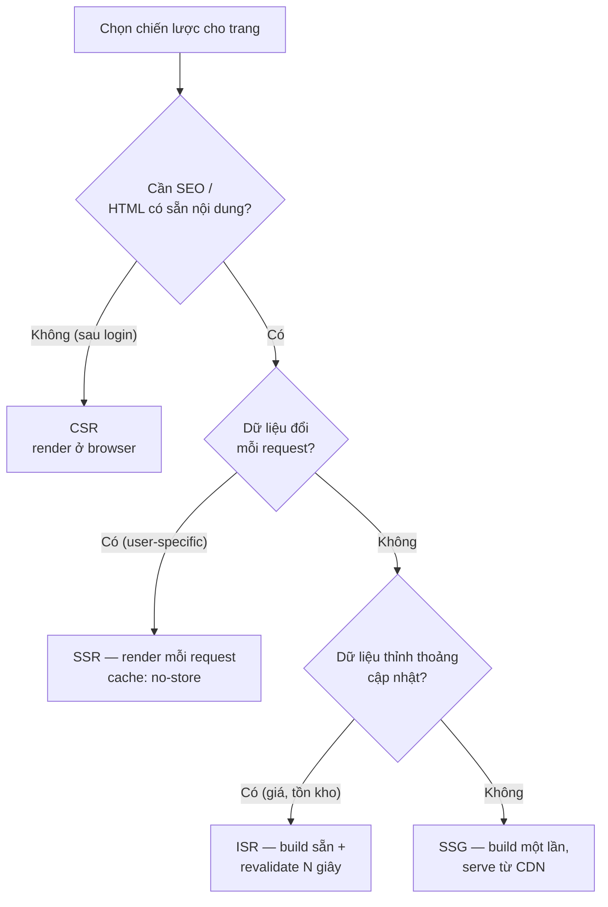
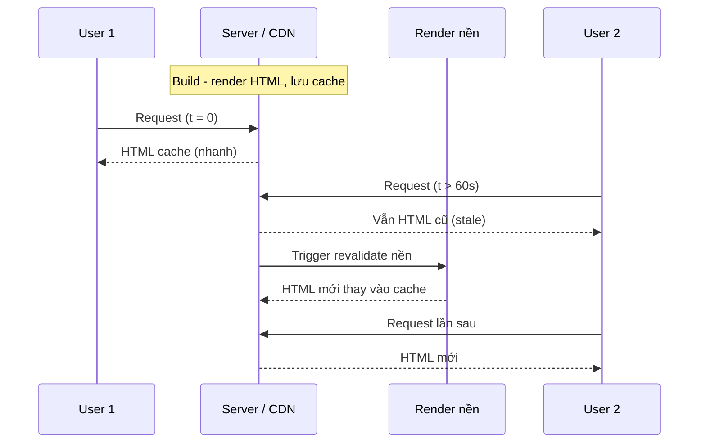

# Rendering Strategies

**Rendering strategy** (chiến lược kết xuất) là cách Next.js tạo ra HTML cho trang: ở phía máy chủ, lúc build, hay ngay trên trình duyệt. Mỗi cách như **SSR** (kết xuất phía máy chủ), **SSG** (tạo trang tĩnh lúc build) hay **ISR** (tạo lại trang tĩnh theo từng phần) có ưu nhược điểm riêng về tốc độ và độ mới của dữ liệu. Bài này giúp bạn hiểu và chọn đúng chiến lược cho từng trang.

---

:::note[Ghi nhớ nhanh]

- ⭐ **4 chiến lược:** SSR (render mỗi request), SSG (render lúc build), ISR (build + revalidate định kỳ), CSR (render ở browser).
- ⭐ **App Router bỏ `getStaticProps`/`getServerSideProps`** — chọn mode qua `fetch` options: mặc định → Static, `next: { revalidate: N }` → ISR, `cache: "no-store"`/`cookies()`/`searchParams` → Dynamic (SSR).
- **ISR là sweet spot** cho e-commerce/content: nhanh như SSG, tươi như SSR; làm mới on-demand bằng `revalidatePath`/`revalidateTag`.
- **Server Components** là mặc định — chạy trên server, không vào bundle, `await` data trực tiếp; chỉ `"use client"` cho phần interactive.
- **Mental model mới:** nghĩ về *data* (static hay dynamic), Next.js tự quyết rendering mode.

:::

---

## Mục lục

- [Vì sao có nhiều chiến lược rendering?](#vì-sao-có-nhiều-chiến-lược-rendering)
- [4 chiến lược rendering](#4-chiến-lược-rendering)
- [SSR (Server-Side Rendering)](#ssr-server-side-rendering)
- [SSG (Static Site Generation)](#ssg-static-site-generation)
- [ISR (Incremental Static Regeneration)](#isr-incremental-static-regeneration)
- [CSR (Client-Side Rendering)](#csr-client-side-rendering)
- [Server Components](#server-components)
- [Câu hỏi phỏng vấn](#câu-hỏi-phỏng-vấn)

---

## Vì sao có nhiều chiến lược rendering?

**Vấn đề:** React SPA thuần render hoàn toàn ở client (CSR). Trình duyệt nhận về một trang gần như trống rồi mới chạy JS để dựng nội dung:

```jsx
// CSR thuần: HTML ban đầu rỗng, mọi thứ render ở client
function ProductPage() {
  const [product, setProduct] = useState(null);

  useEffect(() => {
    fetch("/api/products/1")
      .then((r) => r.json())
      .then(setProduct);
  }, []);

  if (!product) return <p>Loading...</p>; // trang trắng lúc đầu
  return <h1>{product.name}</h1>;
}
```

Hệ quả: **trang trắng lúc đầu**, **SEO kém** (bot thấy HTML rỗng), **tải chậm trên máy yếu** (phải chờ JS chạy xong). Nhưng cũng không phải trang nào cũng nên render sẵn — trang cá nhân hoá cần dữ liệu mới mỗi lần. **Một cách render không hợp mọi loại trang.**

**Giải pháp:** Next.js hỗ trợ **nhiều chiến lược** để chọn theo từng trang, cân bằng giữa tốc độ, SEO và độ tươi của dữ liệu:

```tsx
// SSG: build sẵn HTML lúc build — blog, landing (nhanh + SEO tốt)
export default async function BlogPost() {
  const post = await fetch("https://api.example.com/post").then((r) => r.json());
  return <article>{post.title}</article>; // tĩnh, phục vụ ngay
}

// SSR: render mỗi request — trang cá nhân hoá
export default async function Dashboard() {
  const data = await fetch("https://api.example.com/me", {
    cache: "no-store", // luôn render mới mỗi request
  }).then((r) => r.json());
  return <h1>Xin chào {data.name}</h1>;
}

// ISR: build sẵn + tự làm mới định kỳ — trang sản phẩm
export default async function Product() {
  const product = await fetch("https://api.example.com/product", {
    next: { revalidate: 60 }, // làm mới mỗi 60 giây
  }).then((r) => r.json());
  return <h1>{product.name}</h1>;
}
```

:::tip[Dùng thực tế]

- **Blog / trang marketing** → SSG: build sẵn một lần, phục vụ siêu nhanh và SEO tốt.
- **Dashboard cá nhân hoá** → SSR: render mỗi request để luôn hiển thị dữ liệu của đúng người dùng.
- **Trang sản phẩm e-commerce** → ISR: build sẵn cho nhanh nhưng tự làm mới định kỳ khi giá/tồn kho đổi.
- **Phần tương tác (nút, form, filter)** → CSR: chạy ở client để phản hồi tức thì với thao tác người dùng.

:::

---

## 4 chiến lược rendering

Next.js hỗ trợ tất cả các mode rendering:

| Mode | Khi nào render | Khi nào dùng |
|------|---------------|--------------|
| **SSR** | Mỗi request | Data đổi mỗi request (user-specific) |
| **SSG** | Build time | Content tĩnh (blog, docs) |
| **ISR** | Build + revalidate định kỳ | Content updatable (e-commerce) |
| **CSR** | Browser | Dashboard sau login, không SEO |

Sơ đồ dưới đây tóm tắt cách chọn chiến lược theo đặc điểm dữ liệu của trang:



App Router thay đổi cách định nghĩa — không còn `getStaticProps`/
`getServerSideProps`. Thay vào đó dùng **fetch options + revalidate**.

---

## SSR (Server-Side Rendering)

Render HTML **mỗi request** trên server.

```tsx
// app/users/[id]/page.tsx
export default async function UserPage({ params }) {
  const { id } = await params;
  const user = await fetch(`https://api.example.com/users/${id}`, {
    cache: "no-store", // ép SSR
  }).then(r => r.json());

  return <div>{user.name}</div>;
}
```

`cache: "no-store"` → render mỗi request, không cache.

Hoặc dùng dynamic API trong component → tự thành SSR:

```tsx
import { cookies } from "next/headers";

export default async function ProfilePage() {
  const cookieStore = await cookies();
  const token = cookieStore.get("token");
  // dùng cookies → page là SSR
}
```

:::info[Phân tích]

**SSR phù hợp khi:**

- Page **user-specific** (dashboard, profile).
- Data **thay đổi mỗi request** (real-time, personalized).
- Cần đọc **cookie, header, IP**.
- SEO + fresh data đồng thời.

Trade-off:

- **Slower TTFB** — server phải render mỗi request.
- **Cần Node.js runtime** chạy (hoặc Edge).
- **Khó scale** với traffic cao (mỗi request CPU).

→ Cân nhắc **ISR** thay SSR khi data không cần real-time.

:::

---

## SSG (Static Site Generation)

Render HTML **tại build time** — serve như file tĩnh.

```tsx
// app/blog/[slug]/page.tsx
export async function generateStaticParams() {
  const posts = await fetchPosts();
  return posts.map(p => ({ slug: p.slug }));
}

export default async function BlogPost({ params }) {
  const { slug } = await params;
  const post = await fetchPost(slug); // chạy build time
  return <article>{post.content}</article>;
}
```

`generateStaticParams` báo Next.js list `slug` cần pre-render. Khi build:

- Mọi `/blog/:slug` được render thành HTML.
- Deploy lên CDN — serve nhanh nhất.

Phù hợp:

- **Blog, docs, marketing** — content không đổi thường xuyên.
- **Product detail** — số lượng giới hạn.
- **Landing page**.

---

## ISR (Incremental Static Regeneration)

Kết hợp SSG + revalidate — pre-render tại build, **refresh background** sau X giây.

```tsx
export default async function ProductPage({ params }) {
  const { id } = await params;
  const product = await fetch(`/api/products/${id}`, {
    next: { revalidate: 60 }, // revalidate sau 60s
  }).then(r => r.json());

  return <ProductDetail product={product} />;
}
```

Flow:

1. Build: render `/products/123`, save HTML.
2. User 1 request lúc t=0 → serve HTML cũ ngay (fast).
3. Sau 60s, user 2 request → serve HTML cũ + trigger revalidate background.
4. Lần sau request → serve HTML mới.



**On-demand revalidation** — trigger từ API hoặc Server Action:

```ts
import { revalidatePath, revalidateTag } from "next/cache";

// Sau khi update DB
revalidatePath("/products/123");
revalidateTag("products");
```

:::tip[Mẹo]

**ISR là sweet spot** cho e-commerce, content site:

- **Speed như SSG** (CDN cached HTML).
- **Fresh như SSR** (revalidate khi cần).
- **Scale tốt** (không tạo load mỗi request).

E-commerce điển hình:

```tsx
// Product page
export default async function Product({ params }) {
  const product = await fetch(`/api/products/${(await params).id}`, {
    next: { revalidate: 3600, tags: [`product-${id}`] },
  }).then(r => r.json());
}

// Khi admin update product → revalidate tag tương ứng
revalidateTag(`product-${id}`);
```

Page mới sẽ ngay lập tức có data mới — user không phải đợi cache TTL.

:::

---

## CSR (Client-Side Rendering)

Render trong browser — Server Component trả về Client Component:

```tsx
"use client";

import { useState, useEffect } from "react";

export default function Dashboard() {
  const [data, setData] = useState(null);

  useEffect(() => {
    fetch("/api/dashboard").then(r => r.json()).then(setData);
  }, []);

  if (!data) return <Spinner />;
  return <div>{data.title}</div>;
}
```

CSR phù hợp:

- **Sau login** — không cần SEO.
- **Real-time** — WebSocket, polling.
- **Interactive heavy** — editor, game, dashboard.

→ Nhưng vẫn nên dùng **Server Component cho shell** + Client Component
chỉ cho interactive part. Đừng "use client" toàn app.

---

## Server Components

Mặc định trong App Router. Server Component:

- Chạy **trên server**, không vào client bundle.
- Có thể `await` data, đọc DB, đọc file.
- Không có hook (useState, useEffect).
- Không có event handler (`onClick`).

```tsx
// app/page.tsx — Server Component (default)
async function HomePage() {
  const data = await fetchData(); // server-side
  return (
    <main>
      <h1>{data.title}</h1>
      <InteractiveButton /> {/* Client component */}
    </main>
  );
}
```

```tsx
// app/InteractiveButton.tsx
"use client";

import { useState } from "react";

export default function InteractiveButton() {
  const [count, setCount] = useState(0);
  return <button onClick={() => setCount(c => c + 1)}>{count}</button>;
}
```

:::info[Phân tích]

**Render mode quyết định bởi feature page dùng:**

| Dùng | Mode |
|------|------|
| `fetch(url)` không option | **Static** (build time) |
| `fetch(url, { next: { revalidate: N } })` | **ISR** |
| `fetch(url, { cache: "no-store" })` | **Dynamic** (SSR) |
| `cookies()`, `headers()` | **Dynamic** (SSR) |
| `searchParams` prop | **Dynamic** (SSR) |
| Tất cả static | **Static** |

Next.js tự detect — không phải khai báo SSR/SSG/ISR thủ công. Build
output cho biết mỗi route mode nào:

```
○ /                    Static
ƒ /dashboard           Dynamic
● /products/[id]       ISR (3600s)
```

→ **Mental model mới**: nghĩ về **data**, không phải về "rendering mode".
Data static → page static. Data dynamic → page dynamic.

:::

:::warning[Cần lưu ý]

**`output: "export"`** — chế độ Static Export, mọi page phải static:

```ts
// next.config.ts
export default {
  output: "export",
};
```

Hạn chế:

- Không Server Actions.
- Không Image Optimization (cần `unoptimized: true`).
- Không Middleware.
- Không API routes (route handlers).
- Không dynamic API (`cookies`, `headers`).

→ Chỉ dùng khi cần deploy **CDN tĩnh** (S3, GitHub Pages, Cloudflare Pages).
Nếu cần feature đầy đủ, deploy lên Node server (Vercel, AWS Amplify, Railway).

:::

---

## Câu hỏi phỏng vấn

Những câu thường gặp về chủ đề này. Tự trả lời trước, rồi đối chiếu lại với nội dung phía trên.

1. Giải thích sự khác nhau giữa `SSR`, `SSG`, `ISR` và `CSR` — mỗi cách tạo HTML ở thời điểm nào?
2. Cho ba trang: blog marketing, dashboard sau đăng nhập, trang chi tiết sản phẩm e-commerce — bạn chọn chiến lược nào cho từng trang và lập luận ra sao?
3. Trong `App Router`, `getStaticProps` và `getServerSideProps` đi đâu mất? Giờ khai báo chiến lược render bằng cách nào?
4. Những yếu tố nào khiến Next.js tự chuyển một route từ Static sang Dynamic?
5. `cache: "no-store"` và `next: { revalidate: N }` khác nhau ra sao về hành vi cache và độ tươi dữ liệu?
6. Mô tả từng bước luồng của `ISR`: người dùng request ngay sau khi hết hạn revalidate sẽ nhận HTML cũ hay mới, và vì sao?
7. Vì sao `ISR` được coi là điểm cân bằng giữa `SSG` và `SSR`? Đánh đổi phải chấp nhận là gì?
8. `revalidatePath` và `revalidateTag` khác nhau thế nào? Tình huống nào bắt buộc phải dùng `revalidateTag`?
9. `generateStaticParams` giải quyết vấn đề gì? Nếu người dùng truy cập một `slug` không nằm trong danh sách trả về thì điều gì xảy ra?
10. Server Component và Client Component khác nhau ở những điểm nào? Cái nào là mặc định trong `App Router`?
11. Vì sao Server Component không dùng được `useState`, `useEffect` hay `onClick`? Giới hạn này đến từ đâu?
12. Vì sao đặt `"use client"` ở component gốc của cả app là một lựa chọn tồi? Hậu quả cụ thể là gì?
13. `SSR` ảnh hưởng thế nào tới `TTFB` và khả năng scale khi traffic tăng? Bạn giảm tải bằng cách nào?
14. `streaming` với `Suspense` cải thiện trải nghiệm ra sao khi một phần dữ liệu trong trang tải rất chậm?
15. Build output hiển thị các ký hiệu như `○`, `ƒ`, `●` — mỗi ký hiệu nghĩa là gì và bạn dùng chúng để debug rendering mode thế nào?
16. Một trang lẽ ra phải static nhưng build ra Dynamic — bạn điều tra nguyên nhân theo trình tự nào?
17. Trang cần vừa cá nhân hoá vừa SEO tốt — bạn kết hợp các chiến lược ra sao để đạt cả hai?
18. `output: "export"` đánh đổi những tính năng nào? Khi nào chấp nhận được và khi nào là sai lầm?
19. `hydration` là gì trong bối cảnh Next.js, và lỗi hydration mismatch thường xuất phát từ đâu?
20. Nếu API backend chậm và không ổn định, bạn chọn chiến lược rendering + caching nào để trang vẫn phục vụ được người dùng?
