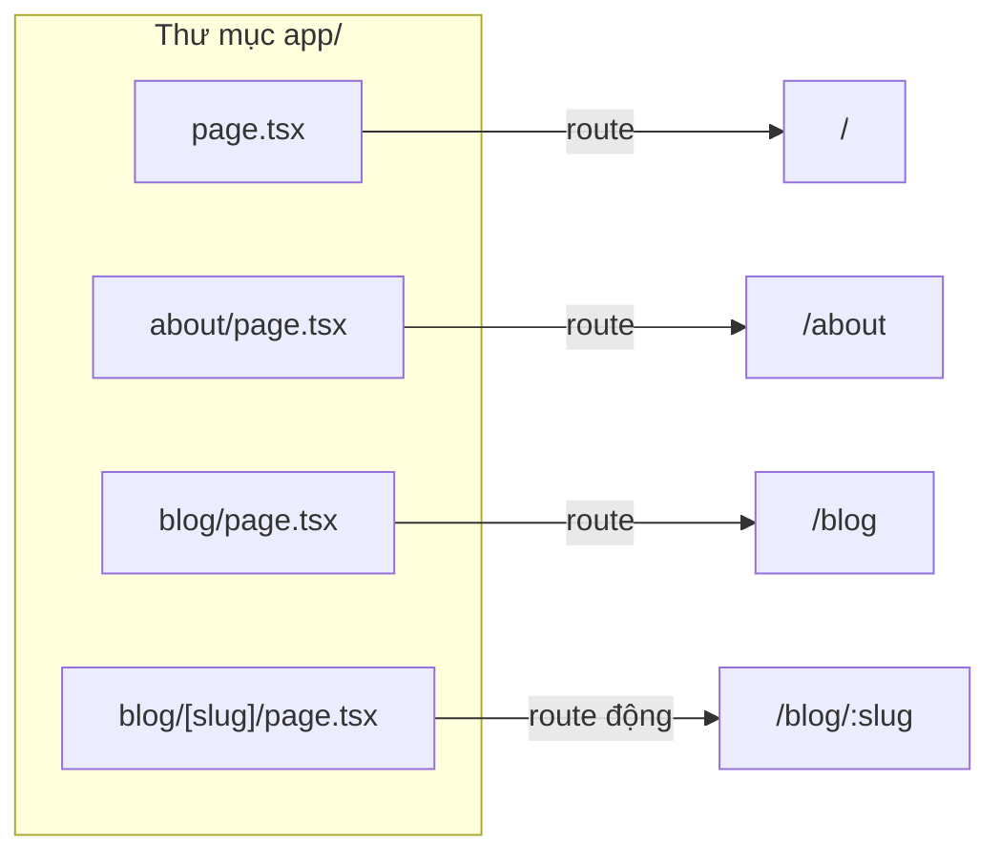

# Routing Basics

**Routing** (định tuyến — ánh xạ URL tới trang hiển thị) là cách Next.js quyết định nội dung nào xuất hiện ứng với mỗi địa chỉ web. Trong App Router, các khái niệm nền tảng gồm **page** (trang nội dung), **layout** (bố cục chung cho nhiều trang) và **template** (bố cục tạo mới lại sau mỗi lần điều hướng). Bài này giới thiệu những thuật ngữ định tuyến cốt lõi mà người mới cần biết.

---

:::note[Ghi nhớ nhanh]

- ⭐ **File-based routing:** cấu trúc thư mục `app/` = cấu trúc URL; tạo file là có route, folder = segment.
- **File đặc biệt:** `page.tsx` (UI route), `layout.tsx` (UI chung, KHÔNG re-render khi navigate), `template.tsx` (re-mount mỗi lần), `loading.tsx`, `error.tsx`, `not-found.tsx`.
- ⭐ **Next.js 15+: `params` và `searchParams` là Promise** — phải `await` (trong Client Component dùng `useParams()`).
- **Root layout là mandatory:** phải có `<html>` + `<body>` và chỉ có một.
- **`error.tsx` phải là Client Component** và không bắt được lỗi của layout cùng cấp (cần `error.tsx` cấp trên).

:::

---

## Mục lục

- [Vì sao Next.js dùng file-based routing?](#vì-sao-nextjs-dùng-file-based-routing)
- [Routing Terminology](#routing-terminology)
- [Pages](#pages)
- [Layouts](#layouts)
- [Templates](#templates)
- [Loading UI và Streaming](#loading-ui-và-streaming)
- [Error States](#error-states)
- [Not Found](#not-found)

---

## Vì sao Next.js dùng file-based routing?

**Vấn đề:**

Với React Router thuần, bạn phải **khai báo route thủ công** trong code: dựng mảng route, import từng component, ghép path. Cấu trúc URL dễ **lệch** với cấu trúc file, và khi app lớn lên thì rất khó nắm tổng thể.

```tsx
// React Router — phải tự khai báo từng route
import { createBrowserRouter } from "react-router-dom";
import Home from "./pages/Home";
import About from "./pages/About";
import BlogPost from "./pages/BlogPost";

const router = createBrowserRouter([
  { path: "/", element: <Home /> },
  { path: "/about", element: <About /> },
  { path: "/blog/:slug", element: <BlogPost /> }, // dễ quên, dễ lệch file
]);
```

**Giải pháp:**

Next.js dùng **file-based routing**: cấu trúc **thư mục = cấu trúc URL**. Tạo file là tự có route, không cần cấu hình. Các quy ước file đặc biệt (`page`, `layout`, `loading`, `error`) làm route trực quan và ít boilerplate.

```tsx
// Next.js — chỉ cần tạo file, route tự sinh
// app/page.tsx              → /
// app/about/page.tsx        → /about
// app/blog/[slug]/page.tsx  → /blog/:slug

export default function AboutPage() {
  return <h1>About</h1>;
}
```

:::tip[Dùng thực tế]

- **Thêm trang mới**: tạo `app/about/page.tsx` → tự có route `/about`, khỏi sửa file config nào khác.
- **Route động**: đặt tên folder `[id]` (ví dụ `app/products/[id]/page.tsx`) → match `/products/123` tự động.
- **Layout dùng chung**: thêm `layout.tsx` trong folder → mọi route con tự kế thừa navbar, sidebar.
- **Trạng thái loading/error**: thêm `loading.tsx` hoặc `error.tsx` theo quy ước → Next.js tự gắn Suspense / Error Boundary, không phải viết tay.

:::

---

## Routing Terminology

App Router dùng các **file đặc biệt** trong `app/`:

| File | Vai trò |
|------|---------|
| `page.tsx` | UI của route (mandatory để route accessible) |
| `layout.tsx` | Shared UI cho subtree route |
| `template.tsx` | Như layout nhưng re-mount mỗi navigation |
| `loading.tsx` | Loading UI tự động với Suspense |
| `error.tsx` | Error boundary cho subtree |
| `not-found.tsx` | UI khi gọi `notFound()` |
| `route.ts` | API route handler |
| `global-error.tsx` | Error boundary root |

Folder không phải file đặc biệt = **segment** trong URL:

```
app/
├── page.tsx                → /
├── about/page.tsx          → /about
└── blog/
    ├── page.tsx            → /blog
    └── [slug]/page.tsx     → /blog/:slug
```

Nhìn dạng sơ đồ, mỗi `page.tsx` trong cây thư mục ánh xạ thẳng sang một URL:



---

## Pages

`page.tsx` = UI render tại route đó.

```tsx
// app/about/page.tsx
export default function AboutPage() {
  return <h1>About</h1>;
}
```

Page nhận `params` và `searchParams`:

```tsx
// app/blog/[slug]/page.tsx
export default async function BlogPost({
  params,
  searchParams,
}: {
  params: Promise<{ slug: string }>;
  searchParams: Promise<{ page?: string }>;
}) {
  const { slug } = await params;
  const { page = "1" } = await searchParams;

  return <article>{slug} (page {page})</article>;
}
```

:::warning[Cần lưu ý]

**Next.js 15+: `params` và `searchParams` là Promise.** Phải `await`:

```tsx
// Next.js 14 (cũ)
export default function Page({ params }: { params: { slug: string } }) {
  return <p>{params.slug}</p>;
}

// Next.js 15+
export default async function Page({
  params,
}: {
  params: Promise<{ slug: string }>;
}) {
  const { slug } = await params;
  return <p>{slug}</p>;
}
```

Lý do: cho phép Next.js **start render trước** khi resolve params (streaming).

Trong Client Component, dùng hook `useParams()` thay thế.

:::

---

## Layouts

`layout.tsx` wrap UI con. Layout **không re-render** khi navigate giữa
child route → tốt cho navbar, sidebar.

```tsx
// app/layout.tsx — root layout (mandatory)
export default function RootLayout({
  children,
}: {
  children: React.ReactNode;
}) {
  return (
    <html lang="vi">
      <body>
        <Header />
        <main>{children}</main>
        <Footer />
      </body>
    </html>
  );
}
```

Nested layout:

```tsx
// app/dashboard/layout.tsx
export default function DashboardLayout({ children }) {
  return (
    <div className="flex">
      <Sidebar />
      <div className="flex-1">{children}</div>
    </div>
  );
}
```

Khi navigate `/dashboard/users` → `/dashboard/settings`:

- **Root layout**: không re-render.
- **Dashboard layout**: không re-render.
- **Page content**: re-render.

→ Preserve state, scroll position, focus của shared UI.

:::info[Phân tích]

**Root layout là mandatory** với 3 yêu cầu:

1. Có `<html>` và `<body>` tag.
2. Đặt ngay trong `app/layout.tsx`.
3. Chỉ có **một** root layout.

Hierarchy:

```
<RootLayout>
  <SectionLayout>
    <Page />
  </SectionLayout>
</RootLayout>
```

Mỗi layout nest có **independent data fetch** — không phụ thuộc nhau,
fetch song song.

```tsx
// app/layout.tsx (root)
async function RootLayout({ children }) {
  const user = await fetchUser();
  return <html><body>{children}</body></html>;
}

// app/dashboard/layout.tsx
async function DashboardLayout({ children }) {
  const stats = await fetchStats(); // chạy song song với root
  return <div>{stats.count} | {children}</div>;
}
```

Lợi ích: page initial load nhanh hơn vì parallel data.

:::

---

## Templates

`template.tsx` tương tự layout nhưng **re-mount mỗi navigation** → state
+ effect chạy lại.

```tsx
// app/template.tsx
export default function Template({ children }) {
  return <div className="page-transition">{children}</div>;
}
```

Use case:

- Animation page transition.
- Reset state mỗi page (form, search input).
- Effect chạy lại mỗi navigate (analytics, scroll-to-top).

→ Hiếm dùng. Hầu hết case dùng `layout.tsx`.

---

## Loading UI và Streaming

`loading.tsx` tự động wrap page trong Suspense:

```tsx
// app/dashboard/loading.tsx
export default function Loading() {
  return <Skeleton />;
}

// app/dashboard/page.tsx
export default async function Dashboard() {
  const data = await fetchSlowData(); // Loading.tsx hiển thị trong khi await
  return <DataView data={data} />;
}
```

Equivalent:

```tsx
<Suspense fallback={<Loading />}>
  <Dashboard />
</Suspense>
```

Loading UI **streams** từ server → user thấy ngay shell + skeleton, content
fill in khi sẵn sàng.

---

## Error States

`error.tsx` = Error Boundary tự động:

```tsx
"use client"; // bắt buộc

export default function Error({
  error,
  reset,
}: {
  error: Error;
  reset: () => void;
}) {
  return (
    <div>
      <h2>Đã có lỗi</h2>
      <p>{error.message}</p>
      <button onClick={reset}>Thử lại</button>
    </div>
  );
}
```

- `error` — Error object.
- `reset` — function thử lại render.
- Phải là Client Component.

Phạm vi: bắt lỗi của **sibling page + nested route**, không bắt lỗi của
layout cùng cấp.

**`global-error.tsx`** — bắt lỗi root layout (rare):

```tsx
"use client";

export default function GlobalError({ error, reset }) {
  return (
    <html>
      <body>
        <h2>App crashed</h2>
        <button onClick={reset}>Retry</button>
      </body>
    </html>
  );
}
```

---

## Not Found

`not-found.tsx` — UI khi gọi `notFound()` hoặc URL không tồn tại:

```tsx
// app/blog/[slug]/not-found.tsx
export default function NotFound() {
  return <p>Bài viết không tồn tại</p>;
}
```

```tsx
// app/blog/[slug]/page.tsx
import { notFound } from "next/navigation";

export default async function BlogPost({ params }) {
  const post = await fetchPost((await params).slug);
  if (!post) notFound(); // throw → render not-found.tsx
  return <article>{post.content}</article>;
}
```

:::tip[Mẹo]

**File special đầy đủ cho route**:

```
app/dashboard/
├── layout.tsx       # shared UI
├── template.tsx     # re-mount UI (rare)
├── loading.tsx      # loading UI
├── error.tsx        # error UI
├── not-found.tsx    # 404
├── page.tsx         # actual page
└── route.ts         # API (alternative cho page.tsx)
```

Một segment **chỉ có một** trong `page.tsx` hoặc `route.ts` — không
cùng tồn tại.

:::

:::info[Phân tích]

**Composition order** của file special:

```jsx
// Pseudo-render:
<Layout>
  <Template>
    <ErrorBoundary fallback={<Error />}>
      <Suspense fallback={<Loading />}>
        <NotFoundBoundary fallback={<NotFound />}>
          <Page />
        </NotFoundBoundary>
      </Suspense>
    </ErrorBoundary>
  </Template>
</Layout>
```

Hiểu order này giúp:

- Biết `loading.tsx` không bắt được error → cần `error.tsx`.
- Biết `error.tsx` không bắt được lỗi layout → cần `error.tsx` cấp trên.
- Biết `notFound()` cần `not-found.tsx` trong route đó hoặc cấp trên.

:::
