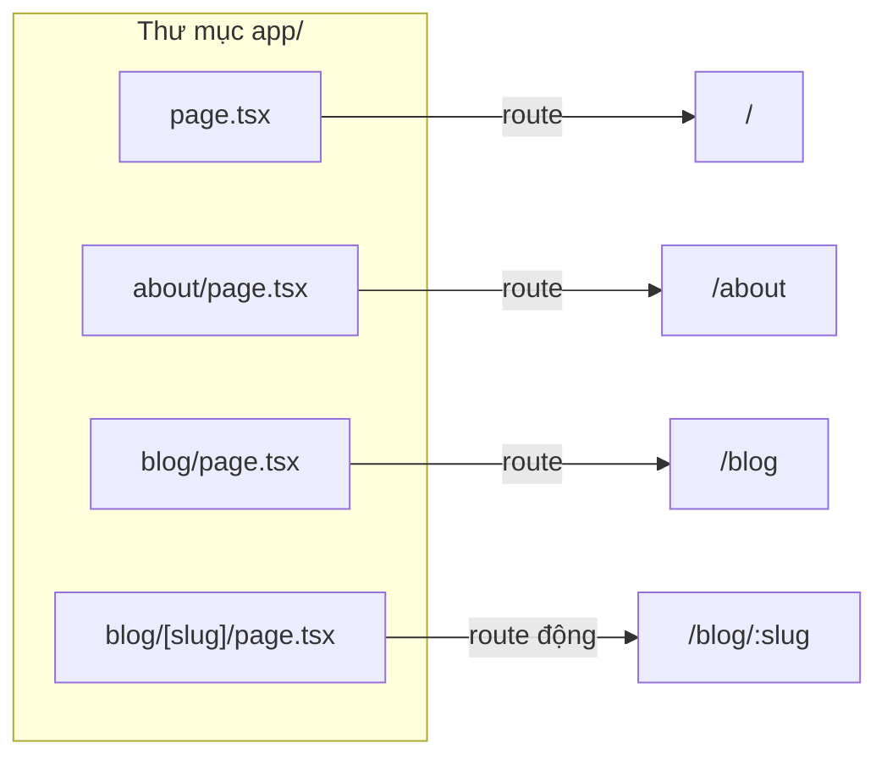

# Routing Basics

**Routing** (định tuyến — ánh xạ URL tới trang hiển thị) là cách Next.js quyết định nội dung nào xuất hiện ứng với mỗi địa chỉ web. Trong App Router, các khái niệm nền tảng gồm **page** (trang nội dung), **layout** (bố cục chung cho nhiều trang) và **template** (bố cục tạo mới lại sau mỗi lần điều hướng). Bài này giới thiệu những thuật ngữ định tuyến cốt lõi mà người mới cần biết.

[](pathname:///img/nextjs/routing-basics.webp)

---

:::note[Ghi nhớ nhanh]

- ⭐ **File-based routing:** cấu trúc thư mục `app/` = cấu trúc URL; tạo file là có route, folder = segment.
- **File đặc biệt:** `page.tsx` (UI route), `layout.tsx` (UI chung, KHÔNG re-render khi navigate), `template.tsx` (re-mount mỗi lần), `loading.tsx`, `error.tsx`, `not-found.tsx`.
- ⭐ **Next.js 15+: `params` và `searchParams` là Promise** — phải `await` (trong Client Component dùng `useParams()`).
- **Root layout là mandatory:** phải có `<html>` + `<body>` và chỉ có một.
- **`error.tsx` phải là Client Component** và không bắt được lỗi của layout cùng cấp (cần `error.tsx` cấp trên).

:::

---

## Mục lục

- [Vì sao Next.js dùng file-based routing?](#vì-sao-nextjs-dùng-file-based-routing)
- [Routing Terminology](#routing-terminology)
- [Pages](#pages)
- [Layouts](#layouts)
- [Templates](#templates)
- [Loading UI và Streaming](#loading-ui-và-streaming)
- [Error States](#error-states)
- [Not Found](#not-found)
- [Câu hỏi phỏng vấn](#câu-hỏi-phỏng-vấn)

---

## Vì sao Next.js dùng file-based routing?

**Vấn đề:**

Với React Router thuần, bạn phải **khai báo route thủ công** trong code: dựng mảng route, import từng component, ghép path. Cấu trúc URL dễ **lệch** với cấu trúc file, và khi app lớn lên thì rất khó nắm tổng thể.

```tsx
// React Router — phải tự khai báo từng route
import { createBrowserRouter } from "react-router-dom";
import Home from "./pages/Home";
import About from "./pages/About";
import BlogPost from "./pages/BlogPost";

const router = createBrowserRouter([
  { path: "/", element: <Home /> },
  { path: "/about", element: <About /> },
  { path: "/blog/:slug", element: <BlogPost /> }, // dễ quên, dễ lệch file
]);
```

**Giải pháp:**

Next.js dùng **file-based routing**: cấu trúc **thư mục = cấu trúc URL**. Tạo file là tự có route, không cần cấu hình. Các quy ước file đặc biệt (`page`, `layout`, `loading`, `error`) làm route trực quan và ít boilerplate.

```tsx
// Next.js — chỉ cần tạo file, route tự sinh
// app/page.tsx              → /
// app/about/page.tsx        → /about
// app/blog/[slug]/page.tsx  → /blog/:slug

export default function AboutPage() {
  return <h1>About</h1>;
}
```

:::tip[Dùng thực tế]

- **Thêm trang mới**: tạo `app/about/page.tsx` → tự có route `/about`, khỏi sửa file config nào khác.
- **Route động**: đặt tên folder `[id]` (ví dụ `app/products/[id]/page.tsx`) → match `/products/123` tự động.
- **Layout dùng chung**: thêm `layout.tsx` trong folder → mọi route con tự kế thừa navbar, sidebar.
- **Trạng thái loading/error**: thêm `loading.tsx` hoặc `error.tsx` theo quy ước → Next.js tự gắn Suspense / Error Boundary, không phải viết tay.

:::

---

## Routing Terminology

App Router dùng các **file đặc biệt** trong `app/`:

| File | Vai trò |
|------|---------|
| `page.tsx` | UI của route (mandatory để route accessible) |
| `layout.tsx` | Shared UI cho subtree route |
| `template.tsx` | Như layout nhưng re-mount mỗi navigation |
| `loading.tsx` | Loading UI tự động với Suspense |
| `error.tsx` | Error boundary cho subtree |
| `not-found.tsx` | UI khi gọi `notFound()` |
| `route.ts` | API route handler |
| `global-error.tsx` | Error boundary root |

Folder không phải file đặc biệt = **segment** trong URL:

```
app/
├── page.tsx                → /
├── about/page.tsx          → /about
└── blog/
    ├── page.tsx            → /blog
    └── [slug]/page.tsx     → /blog/:slug
```

Nhìn dạng sơ đồ, mỗi `page.tsx` trong cây thư mục ánh xạ thẳng sang một URL:



---

## Pages

`page.tsx` = UI render tại route đó.

```tsx
// app/about/page.tsx
export default function AboutPage() {
  return <h1>About</h1>;
}
```

Page nhận `params` và `searchParams`:

```tsx
// app/blog/[slug]/page.tsx
export default async function BlogPost({
  params,
  searchParams,
}: {
  params: Promise<{ slug: string }>;
  searchParams: Promise<{ page?: string }>;
}) {
  const { slug } = await params;
  const { page = "1" } = await searchParams;

  return <article>{slug} (page {page})</article>;
}
```

:::warning[Cần lưu ý]

**Next.js 15+: `params` và `searchParams` là Promise.** Phải `await`:

```tsx
// Next.js 14 (cũ)
export default function Page({ params }: { params: { slug: string } }) {
  return <p>{params.slug}</p>;
}

// Next.js 15+
export default async function Page({
  params,
}: {
  params: Promise<{ slug: string }>;
}) {
  const { slug } = await params;
  return <p>{slug}</p>;
}
```

Lý do: cho phép Next.js **start render trước** khi resolve params (streaming).

Trong Client Component, dùng hook `useParams()` thay thế.

:::

---

## Layouts

`layout.tsx` wrap UI con. Layout **không re-render** khi navigate giữa
child route → tốt cho navbar, sidebar.

```tsx
// app/layout.tsx — root layout (mandatory)
export default function RootLayout({
  children,
}: {
  children: React.ReactNode;
}) {
  return (
    <html lang="vi">
      <body>
        <Header />
        <main>{children}</main>
        <Footer />
      </body>
    </html>
  );
}
```

Nested layout:

```tsx
// app/dashboard/layout.tsx
export default function DashboardLayout({ children }) {
  return (
    <div className="flex">
      <Sidebar />
      <div className="flex-1">{children}</div>
    </div>
  );
}
```

Khi navigate `/dashboard/users` → `/dashboard/settings`:

- **Root layout**: không re-render.
- **Dashboard layout**: không re-render.
- **Page content**: re-render.

→ Preserve state, scroll position, focus của shared UI.

:::info[Phân tích]

**Root layout là mandatory** với 3 yêu cầu:

1. Có `<html>` và `<body>` tag.
2. Đặt ngay trong `app/layout.tsx`.
3. Chỉ có **một** root layout.

Hierarchy:

```
<RootLayout>
  <SectionLayout>
    <Page />
  </SectionLayout>
</RootLayout>
```

Mỗi layout nest có **independent data fetch** — không phụ thuộc nhau,
fetch song song.

```tsx
// app/layout.tsx (root)
async function RootLayout({ children }) {
  const user = await fetchUser();
  return <html><body>{children}</body></html>;
}

// app/dashboard/layout.tsx
async function DashboardLayout({ children }) {
  const stats = await fetchStats(); // chạy song song với root
  return <div>{stats.count} | {children}</div>;
}
```

Lợi ích: page initial load nhanh hơn vì parallel data.

:::

---

## Templates

`template.tsx` tương tự layout nhưng **re-mount mỗi navigation** → state
+ effect chạy lại.

```tsx
// app/template.tsx
export default function Template({ children }) {
  return <div className="page-transition">{children}</div>;
}
```

Use case:

- Animation page transition.
- Reset state mỗi page (form, search input).
- Effect chạy lại mỗi navigate (analytics, scroll-to-top).

→ Hiếm dùng. Hầu hết case dùng `layout.tsx`.

---

## Loading UI và Streaming

`loading.tsx` tự động wrap page trong Suspense:

```tsx
// app/dashboard/loading.tsx
export default function Loading() {
  return <Skeleton />;
}

// app/dashboard/page.tsx
export default async function Dashboard() {
  const data = await fetchSlowData(); // Loading.tsx hiển thị trong khi await
  return <DataView data={data} />;
}
```

Equivalent:

```tsx
<Suspense fallback={<Loading />}>
  <Dashboard />
</Suspense>
```

Loading UI **streams** từ server → user thấy ngay shell + skeleton, content
fill in khi sẵn sàng.

---

## Error States

`error.tsx` = Error Boundary tự động:

```tsx
"use client"; // bắt buộc

export default function Error({
  error,
  reset,
}: {
  error: Error;
  reset: () => void;
}) {
  return (
    <div>
      <h2>Đã có lỗi</h2>
      <p>{error.message}</p>
      <button onClick={reset}>Thử lại</button>
    </div>
  );
}
```

- `error` — Error object.
- `reset` — function thử lại render.
- Phải là Client Component.

Phạm vi: bắt lỗi của **sibling page + nested route**, không bắt lỗi của
layout cùng cấp.

**`global-error.tsx`** — bắt lỗi root layout (rare):

```tsx
"use client";

export default function GlobalError({ error, reset }) {
  return (
    <html>
      <body>
        <h2>App crashed</h2>
        <button onClick={reset}>Retry</button>
      </body>
    </html>
  );
}
```

---

## Not Found

`not-found.tsx` — UI khi gọi `notFound()` hoặc URL không tồn tại:

```tsx
// app/blog/[slug]/not-found.tsx
export default function NotFound() {
  return <p>Bài viết không tồn tại</p>;
}
```

```tsx
// app/blog/[slug]/page.tsx
import { notFound } from "next/navigation";

export default async function BlogPost({ params }) {
  const post = await fetchPost((await params).slug);
  if (!post) notFound(); // throw → render not-found.tsx
  return <article>{post.content}</article>;
}
```

:::tip[Mẹo]

**File special đầy đủ cho route**:

```
app/dashboard/
├── layout.tsx       # shared UI
├── template.tsx     # re-mount UI (rare)
├── loading.tsx      # loading UI
├── error.tsx        # error UI
├── not-found.tsx    # 404
├── page.tsx         # actual page
└── route.ts         # API (alternative cho page.tsx)
```

Một segment **chỉ có một** trong `page.tsx` hoặc `route.ts` — không
cùng tồn tại.

:::

:::info[Phân tích]

**Composition order** của file special:

```jsx
// Pseudo-render:
<Layout>
  <Template>
    <ErrorBoundary fallback={<Error />}>
      <Suspense fallback={<Loading />}>
        <NotFoundBoundary fallback={<NotFound />}>
          <Page />
        </NotFoundBoundary>
      </Suspense>
    </ErrorBoundary>
  </Template>
</Layout>
```

Hiểu order này giúp:

- Biết `loading.tsx` không bắt được error → cần `error.tsx`.
- Biết `error.tsx` không bắt được lỗi layout → cần `error.tsx` cấp trên.
- Biết `notFound()` cần `not-found.tsx` trong route đó hoặc cấp trên.

:::

---

## Câu hỏi phỏng vấn

Những câu thường gặp về chủ đề này. Tự trả lời trước, rồi bấm **Xem đáp án** để đối chiếu.

**1. `file-based routing` trong `App Router` hoạt động thế nào? File nào mới thực sự tạo ra một URL truy cập được?**

<details className="qa">
<summary>Xem đáp án</summary>

Trong App Router, **cấu trúc thư mục `app/` chính là cấu trúc URL**. Mỗi thư mục con là một **segment** của đường dẫn, không cần khai báo route ở bất kỳ file cấu hình nào.

Nhưng thư mục thôi chưa đủ: chỉ khi trong thư mục có **`page.tsx`** thì route đó mới truy cập được. Thư mục chỉ chứa `layout.tsx` hay component phụ sẽ tạo ra segment nhưng URL đó trả về 404.

```
app/page.tsx              → /
app/about/page.tsx        → /about
app/blog/page.tsx         → /blog
app/blog/[slug]/page.tsx  → /blog/:slug
```

Thư mục đặt trong ngoặc vuông là **dynamic segment**, khớp với mọi giá trị và truyền vào qua `params`.

Ngoại lệ duy nhất: **`route.ts`** cũng tạo ra một endpoint truy cập được, nhưng nó trả về `Response` chứ không render UI.

</details>

**2. So với khai báo route thủ công kiểu React Router, file-based routing được gì và mất gì?**

<details className="qa">
<summary>Xem đáp án</summary>

**Được:**

- Không có bước khai báo thủ công — tạo file là có route, không thể quên đăng ký hay để URL lệch với vị trí file.
- Nhìn cây thư mục là biết sơ đồ URL của cả app, rất lợi khi người mới vào dự án.
- Các quy ước `layout`, `loading`, `error`, `not-found` cắt bỏ phần lớn boilerplate — không phải tự bọc `Suspense` hay Error Boundary.
- Code splitting theo route diễn ra tự động.

**Mất:**

- Route không còn là dữ liệu trong code, nên khó sinh route động theo cấu hình hoặc theo điều kiện lúc chạy.
- Phải thuộc convention: tên file đặc biệt, ngoặc vuông, quy tắc nhóm thư mục — sai tên là route im lặng không xuất hiện.
- Đổi URL đồng nghĩa với di chuyển thư mục, kéo theo sửa import.
- Ít tự do hơn khi cần logic khớp route phức tạp.

</details>

**3. Liệt kê các file đặc biệt trong thư mục `app/` và vai trò của từng file.**

<details className="qa">
<summary>Xem đáp án</summary>

| File | Vai trò |
|------|---------|
| `page.tsx` | UI của route; bắt buộc để route truy cập được |
| `layout.tsx` | UI dùng chung cho cả nhánh route bên dưới |
| `template.tsx` | Như layout nhưng re-mount mỗi lần điều hướng |
| `loading.tsx` | Loading UI, tự bọc trong `Suspense` |
| `error.tsx` | Error Boundary cho nhánh route đó |
| `not-found.tsx` | UI khi gọi `notFound()` hoặc URL không tồn tại |
| `route.ts` | Handler cho API route |
| `global-error.tsx` | Error Boundary cấp root, bắt lỗi của root layout |

Điểm cần nhớ: các file này **áp dụng theo nhánh** — đặt ở thư mục nào thì có hiệu lực cho thư mục đó và mọi route con. Nhờ vậy mỗi khu vực của app có thể có loading và error riêng. Thư mục không chứa file đặc biệt nào thì đơn thuần là một segment trong URL.

</details>

**4. `layout.tsx` và `template.tsx` khác nhau ở điểm cốt lõi nào? Cho một tình huống bắt buộc phải dùng `template.tsx`.**

<details className="qa">
<summary>Xem đáp án</summary>

Điểm cốt lõi: **`layout.tsx` giữ nguyên instance khi điều hướng, `template.tsx` tạo mới lại mỗi lần**.

| | `layout.tsx` | `template.tsx` |
|---|---|---|
| Khi navigate | Không re-render, giữ state | Re-mount, state reset |
| Effect | Chạy một lần | Chạy lại mỗi lần điều hướng |
| Dùng cho | Navbar, sidebar, khung chung | Animation, reset state, effect lặp lại |

Tình huống bắt buộc dùng `template.tsx`: **animation chuyển trang**. Hiệu ứng vào trang chỉ chạy khi component được mount; nếu dùng layout thì nó tồn tại xuyên suốt và animation chỉ chạy đúng một lần rồi thôi.

Tương tự với những việc phải lặp lại mỗi lần điều hướng: ghi nhận lượt xem cho analytics, cuộn về đầu trang, hoặc reset một ô tìm kiếm dùng chung để không mang giá trị cũ sang trang mới.

`template.tsx` hiếm khi cần — mặc định nên chọn `layout.tsx`.

</details>

**5. Vì sao layout không re-render khi điều hướng giữa các route con? Điều đó mang lại lợi ích gì cho trải nghiệm người dùng?**

<details className="qa">
<summary>Xem đáp án</summary>

Vì App Router coi layout là **phần chung không đổi** của nhánh route: khi bạn đi từ `/dashboard/users` sang `/dashboard/settings`, chỉ segment cuối thay đổi, còn root layout và dashboard layout vẫn là cùng một instance React nên không bị unmount.

Lợi ích cho người dùng:

- **Giữ state** của UI dùng chung — sidebar đang mở vẫn mở, tab đã chọn vẫn giữ, dữ liệu đã tải không phải tải lại.
- **Giữ vị trí cuộn và focus** — danh sách điều hướng dài không nhảy về đầu sau mỗi lần bấm.
- **Điều hướng nhanh hơn** — chỉ phần nội dung được render lại, không dựng lại cả cây.
- **Không nhấp nháy** — khung trang đứng yên, cảm giác như ứng dụng desktop.

Hệ quả cần lưu ý ở chiều ngược lại: effect trong layout **không chạy lại** sau mỗi lần điều hướng, nên việc nào cần lặp lại thì phải đặt ở `template.tsx` hoặc trong chính page.

</details>

**6. `root layout` có những ràng buộc bắt buộc nào và vì sao Next.js đặt ra các ràng buộc đó?**

<details className="qa">
<summary>Xem đáp án</summary>

Root layout (`app/layout.tsx`) có ba ràng buộc:

1. Phải tự render thẻ `html` và `body`.
2. Phải nằm ngay tại `app/layout.tsx`.
3. Chỉ được có **một** root layout.

Lý do: root layout là thứ **bao trọn mọi response HTML** của ứng dụng. Next.js không tự sinh khung tài liệu, nên nếu bạn không render `html` và `body` thì không có trang HTML hợp lệ để gửi đi. Đặt nó ở vị trí cố định giúp framework biết chắc điểm bắt đầu của cây render, còn quy tắc chỉ một bản thì tránh tình huống mơ hồ hai khung tài liệu chồng nhau.

Đây cũng là nơi tự nhiên để khai báo `lang`, nạp CSS toàn cục, đặt metadata gốc và các provider dùng chung cho cả app. Vì nó không bao giờ re-render, tránh đặt dữ liệu cá nhân hoá ở đây — sẽ kéo cả app sang dynamic.

</details>

**7. Từ Next.js 15, `params` và `searchParams` trở thành `Promise` — lý do kỹ thuật là gì và code cũ phải sửa thế nào?**

<details className="qa">
<summary>Xem đáp án</summary>

Lý do kỹ thuật: đọc `params` hoặc `searchParams` gắn liền với một request cụ thể. Biến chúng thành `Promise` cho phép Next.js **bắt đầu render phần không phụ thuộc vào chúng trước**, thay vì chặn toàn bộ trang cho tới khi có giá trị — ăn khớp với mô hình streaming và render theo từng phần.

Code cũ phải chuyển từ truy cập đồng bộ sang `await`, kéo theo component phải là `async`:

```tsx
// Next.js 14
export default function Page({ params }: { params: { slug: string } }) {
  return <p>{params.slug}</p>;
}

// Next.js 15+
export default async function Page({
  params,
}: {
  params: Promise<{ slug: string }>;
}) {
  const { slug } = await params;
  return <p>{slug}</p>;
}
```

Kiểu TypeScript cũng phải đổi theo. Đây là breaking change khi nâng cấp, nhưng có codemod chính thức để chuyển hàng loạt.

</details>

**8. Trong Client Component không `await` được `params`, vậy bạn lấy tham số route bằng cách nào?**

<details className="qa">
<summary>Xem đáp án</summary>

Client Component không phải là hàm `async` nên không `await` được. Thay vào đó dùng các hook điều hướng của Next.js:

```tsx
"use client";
import { useParams, useSearchParams } from "next/navigation";

export default function Filter() {
  const { slug } = useParams();            // tham số route
  const searchParams = useSearchParams();  // query string
  const page = searchParams.get("page") ?? "1";
  return <p>{slug} — trang {page}</p>;
}
```

`useParams()` trả về các dynamic segment của route hiện tại, `useSearchParams()` cho phép đọc query string.

Cách thứ hai, thường tốt hơn: để **Server Component cha `await` params rồi truyền xuống dưới dạng props**. Như vậy Client Component chỉ nhận dữ liệu thuần, dễ test hơn và không phụ thuộc vào ngữ cảnh router — đúng tinh thần đẩy ranh giới `"use client"` xuống càng thấp càng tốt.

</details>

**9. `loading.tsx` thực chất tương đương với cấu trúc React nào? Muốn nhiều vùng loading riêng biệt trong cùng một trang thì làm gì?**

<details className="qa">
<summary>Xem đáp án</summary>

`loading.tsx` thực chất là cách khai báo bằng file cho một **`Suspense` boundary** bọc quanh nội dung route:

```tsx
<Suspense fallback={<Loading />}>
  <Page />
</Suspense>
```

Next.js tự tạo cấu trúc này, nên bạn chỉ cần tạo file là có ngay skeleton hiển thị trong lúc Server Component còn đang lấy dữ liệu, và phần shell được stream về trước.

Muốn **nhiều vùng loading riêng biệt** trong cùng một trang thì tự viết `Suspense` quanh từng mảnh, mỗi mảnh một fallback riêng:

```tsx
<Suspense fallback={<StatsSkeleton />}>
  <Stats />
</Suspense>
<Suspense fallback={<ChartSkeleton />}>
  <Chart />
</Suspense>
```

Mỗi vùng hiện ra độc lập ngay khi dữ liệu của nó sẵn sàng, thay vì cả trang phải chờ mảnh chậm nhất. `loading.tsx` chỉ cho một fallback duy nhất ở cấp route.

</details>

**10. Vì sao `error.tsx` bắt buộc phải là Client Component? Prop `reset` hoạt động ra sao?**

<details className="qa">
<summary>Xem đáp án</summary>

`error.tsx` bắt buộc khai báo `"use client"` vì nó là một **Error Boundary của React**, mà Error Boundary chỉ tồn tại ở phía client — nó phải giữ state "đang lỗi hay không" và bắt được cả lỗi xảy ra trong lúc render ở trình duyệt. Ngoài ra nó cần gắn `onClick` cho nút thử lại, tức là cần event handler.

Prop `reset` là hàm do React cung cấp: gọi nó sẽ **xoá trạng thái lỗi và render lại nhánh route đó**, không reload cả trang nên state của layout bên ngoài vẫn nguyên.

```tsx
"use client";
export default function Error({ error, reset }: { error: Error; reset: () => void }) {
  return <button onClick={reset}>Thử lại</button>;
}
```

Hữu ích khi lỗi chỉ là tạm thời — mạng chập chờn, API timeout. Nếu nguyên nhân chưa biến mất thì lần render lại vẫn lỗi và boundary hiện lại.

</details>

**11. `error.tsx` không bắt được loại lỗi nào? Bạn xử lý lỗi xảy ra ở root layout bằng cách nào?**

<details className="qa">
<summary>Xem đáp án</summary>

`error.tsx` bắt lỗi của **page cùng cấp và các route con bên dưới**, nhưng **không bắt được lỗi của `layout.tsx` cùng cấp** — vì theo thứ tự lồng nhau, layout nằm **ngoài** Error Boundary đó, nên lỗi của nó rơi ra ngoài phạm vi.

Cách xử lý: đặt `error.tsx` ở **cấp cha** để bọc được layout bị lỗi.

Riêng lỗi ở **root layout** thì không còn cấp cha nào nữa — phải dùng **`global-error.tsx`**. File này thay thế toàn bộ trang khi bị kích hoạt, nên nó phải tự render thẻ `html` và `body` giống root layout, và cũng phải là Client Component:

```tsx
"use client";
export default function GlobalError({ error, reset }) {
  return <html><body><button onClick={reset}>Thử lại</button></body></html>;
}
```

Trường hợp này hiếm xảy ra, nhưng nếu không có file đó thì lỗi root layout sẽ cho người dùng một màn hình lỗi trần trụi.

</details>

**12. Trình bày thứ tự lồng nhau của `layout`, `template`, `error`, `loading`, `page` — hiểu thứ tự này giúp bạn debug điều gì?**

<details className="qa">
<summary>Xem đáp án</summary>

Thứ tự lồng nhau khi Next.js dựng một route:

```jsx
<Layout>
  <Template>
    <ErrorBoundary fallback={<Error />}>
      <Suspense fallback={<Loading />}>
        <NotFoundBoundary fallback={<NotFound />}>
          <Page />
        </NotFoundBoundary>
      </Suspense>
    </ErrorBoundary>
  </Template>
</Layout>
```

Hiểu thứ tự này giúp debug ba nhóm vấn đề hay gặp:

- `loading.tsx` nằm **trong** Error Boundary nên nó không bắt lỗi — muốn xử lý lỗi phải có `error.tsx`.
- `error.tsx` nằm **trong** layout cùng cấp nên lỗi của layout lọt ra ngoài — phải đặt `error.tsx` ở cấp trên.
- `notFound()` cần `not-found.tsx` trong chính route đó hoặc ở cấp cha, vì nó tìm boundary gần nhất đi lên.

Nói ngắn: thứ tự quyết định **cái gì bọc cái gì**, và một boundary chỉ bắt được những gì nằm bên trong nó.

</details>

**13. `notFound()` hoạt động thế nào? Next.js tìm `not-found.tsx` ở đâu khi hàm này được gọi?**

<details className="qa">
<summary>Xem đáp án</summary>

`notFound()` là hàm import từ `next/navigation`. Gọi nó sẽ **ném ra một lỗi đặc biệt** mà Next.js nhận diện được — vì vậy code phía sau không chạy tiếp, không cần `return`:

```tsx
import { notFound } from "next/navigation";

export default async function BlogPost({ params }) {
  const post = await fetchPost((await params).slug);
  if (!post) notFound();
  return <article>{post.content}</article>;
}
```

Khi lỗi đó được ném, Next.js đi **ngược lên cây route từ vị trí hiện tại** để tìm `not-found.tsx` gần nhất và render nó — trước hết trong chính segment đó, không có thì lên segment cha, cuối cùng là `app/not-found.tsx`. Nếu không có file nào, Next.js dùng trang 404 mặc định.

Nhờ cơ chế theo nhánh này, mỗi khu vực có thể có trang không tìm thấy riêng, ví dụ blog hiển thị "Bài viết không tồn tại" còn khu sản phẩm hiển thị thông điệp khác.

</details>

**14. Một segment có thể vừa có `page.tsx` vừa có `route.ts` không? Điều gì xảy ra nếu cố tình đặt cả hai?**

<details className="qa">
<summary>Xem đáp án</summary>

**Không.** Một segment chỉ được có **một trong hai**: `page.tsx` hoặc `route.ts`, chúng không cùng tồn tại.

Lý do là cả hai cùng tranh nhau xử lý **một URL duy nhất** nhưng theo hai cách loại trừ nhau: `page.tsx` render UI và trả về HTML, còn `route.ts` xử lý HTTP thô và trả về `Response`. Khi có request `GET` tới URL đó, Next.js không có căn cứ nào để chọn — nên xung đột này bị coi là lỗi cấu hình.

Nếu cố tình đặt cả hai, build sẽ báo lỗi chỉ rõ segment bị xung đột.

Cách xử lý đúng khi cần cả trang lẫn API cho cùng một tài nguyên: tách chúng ra hai đường dẫn riêng — ví dụ `app/products/page.tsx` cho giao diện và `app/api/products/route.ts` cho endpoint. Cách này cũng làm URL rõ nghĩa hơn cho người đọc code.

</details>

**15. Khi nhiều layout lồng nhau cùng fetch dữ liệu, chúng chạy tuần tự hay song song? Điều đó ảnh hưởng thế nào tới thời gian tải trang?**

<details className="qa">
<summary>Xem đáp án</summary>

Chúng fetch **song song**. Mỗi layout lồng nhau có phần lấy dữ liệu **độc lập**, không chờ nhau:

```tsx
async function RootLayout({ children }) {
  const user = await fetchUser();
  return <html><body>{children}</body></html>;
}

async function DashboardLayout({ children }) {
  const stats = await fetchStats(); // chạy song song với root
  return <div>{stats.count} | {children}</div>;
}
```

Ảnh hưởng tới thời gian tải: tổng thời gian chờ bằng **lời gọi chậm nhất**, không phải tổng các lời gọi — tránh được waterfall và làm trang hiện ra nhanh hơn hẳn.

Lưu ý điều này chỉ đúng **giữa các layout khác cấp**. Trong cùng một component, nếu bạn `await` tuần tự thì vẫn tạo waterfall — phải gom lại bằng `Promise.all`. Ngoài ra, mảnh dữ liệu chậm nên bọc `Suspense` để nó không giữ chân cả trang.

</details>
