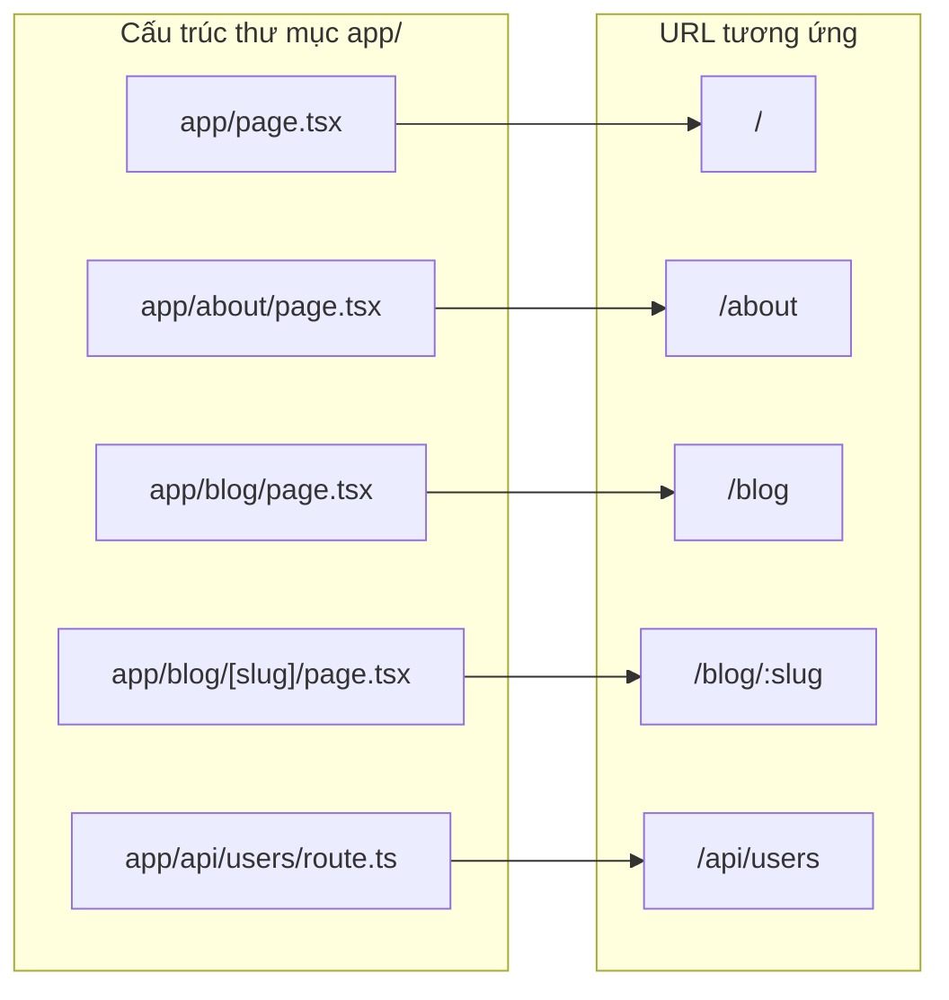

# Pages Router vs App Router

Next.js có hai hệ thống định tuyến song song: **Pages Router** (router cũ, dùng thư mục `pages/`) và **App Router** (router mới, dùng thư mục `app/` và được khuyến nghị). Cả hai đều dựa trên cấu trúc thư mục để tạo URL, nhưng App Router hỗ trợ thêm Server Components và bố cục lồng nhau. Bài này so sánh hai router để bạn biết nên chọn loại nào.

---

:::note[Ghi nhớ nhanh]

- ⭐ **Hai router song song:** Pages Router (`pages/`, cũ) và App Router (`app/`, khuyến nghị) — có thể chạy chung trong một project.
- ⭐ **App Router mặc định Server Components,** fetch data ngay trong `async` component, hỗ trợ nested layout + streaming/Suspense.
- **Data fetching:** Pages Router dùng `getServerSideProps`/`getStaticProps`; App Router thay bằng `async` component + `fetch` options.
- **Migrate dần** từng route (hai router chạy song song); API `pages/api/*` → `route.ts` dùng Web Standards Request/Response.
- **Dự án mới → App Router;** dự án cũ đang ổn cứ giữ nguyên — Pages Router không bị bỏ rơi.

:::

---

## Mục lục

- [Vì sao có App Router & Pages Router?](#vì-sao-có-app-router--pages-router)
- [Hai router song song](#hai-router-song-song)
- [Pages Router (legacy)](#pages-router-legacy)
- [App Router (khuyến nghị)](#app-router-khuyến-nghị)
- [So sánh chi tiết](#so-sánh-chi-tiết)
- [Migration strategy](#migration-strategy)

---

## Vì sao có App Router & Pages Router?

**Vấn đề:** Pages Router (cũ) tải nhiều JS xuống client, data fetching tách rời khỏi component:

```tsx
// pages/blog/[slug].tsx — fetch nằm NGOÀI component
export const getServerSideProps = async ({ params }) => {
  const post = await fetchPost(params.slug); // tách rời UI
  return { props: { post } };
};

export default function BlogPost({ post }) {
  // toàn bộ component này ship JS xuống client
  return <article>{post.content}</article>;
}
```

Hệ quả: khó chia nhỏ để tải dần (streaming), layout lồng nhau bất tiện, bundle JS phình to.

**Giải pháp:** App Router (Next 13+, dựa trên React Server Components) — mặc định render ở server (ít JS xuống client), fetch data NGAY trong async component, nested layout, streaming/Suspense, `loading`/`error` theo quy ước file:

```tsx
// app/blog/[slug]/page.tsx — Server Component, fetch NGAY trong component
export default async function BlogPost({ params }) {
  const { slug } = await params;
  const post = await fetchPost(slug); // chạy server, không ship JS
  return <article>{post.content}</article>;
}
```

Pages Router vẫn tồn tại để hỗ trợ codebase cũ. Quan trọng là hiểu **vì sao có 2** và **khi nào dùng cái nào**.

:::tip[Dùng thực tế]

- **Dự án mới** → dùng App Router để tận dụng Server Components, streaming, nested layout.
- **Bảo trì dự án cũ** đang chạy ổn trên Pages Router → cứ giữ nguyên, không cần đập đi xây lại.
- **Cần giảm bundle JS** → tận dụng Server Components của App Router để bớt JS xuống client.
- **Codebase lớn** → migrate dần từng route từ `pages/` sang `app/`, hai router chạy song song trong lúc chuyển.

:::

---

## Hai router song song

Next.js hỗ trợ **cả hai router** trong cùng project:

```
my-app/
├── app/      # App Router (mới)
└── pages/    # Pages Router (cũ)
```

Cả hai chạy song song — Next.js merge route:

- `app/dashboard/page.tsx` → `/dashboard`
- `pages/profile.tsx` → `/profile`

→ Migrate dần dần. Nhưng **project mới: chỉ dùng App Router**.

---

## Pages Router (legacy)

Cấu trúc cũ:

```
pages/
├── _app.tsx
├── _document.tsx
├── index.tsx              → /
├── about.tsx              → /about
├── blog/
│   ├── index.tsx          → /blog
│   └── [slug].tsx         → /blog/:slug
└── api/
    └── users.ts           → /api/users
```

Data fetching qua **special function**:

```tsx
// pages/blog/[slug].tsx
import { GetServerSideProps } from "next";

export const getServerSideProps: GetServerSideProps = async ({ params }) => {
  const post = await fetchPost(params.slug);
  return { props: { post } };
};

export default function BlogPost({ post }) {
  return <article>{post.content}</article>;
}
```

Các function chính:

| Function | Khi nào |
|----------|---------|
| `getStaticProps` | SSG — build time |
| `getStaticPaths` | List slug cho dynamic SSG |
| `getServerSideProps` | SSR — mỗi request |
| `getInitialProps` | Legacy SSR (avoid) |

---

## App Router (khuyến nghị)

```
app/
├── layout.tsx
├── page.tsx              → /
├── about/
│   └── page.tsx          → /about
├── blog/
│   ├── page.tsx          → /blog
│   └── [slug]/
│       └── page.tsx      → /blog/:slug
└── api/
    └── users/
        └── route.ts      → /api/users
```

Data fetching **trong component** (Server Component):

```tsx
// app/blog/[slug]/page.tsx
export default async function BlogPost({ params }) {
  const { slug } = await params;
  const post = await fetchPost(slug); // chạy server
  return <article>{post.content}</article>;
}
```

Không có `getServerSideProps` / `getStaticProps` — fetch trực tiếp trong
async component, control behavior qua `fetch` options.

Cách Next.js ánh xạ cấu trúc thư mục `app/` thành URL:



---

## So sánh chi tiết

| Feature | Pages Router | App Router |
|---------|-------------|-----------|
| Folder | `pages/` | `app/` |
| Route file | `pages/about.tsx` | `app/about/page.tsx` |
| Layout | `_app.tsx` (single) | `layout.tsx` (nested) |
| Document | `_document.tsx` | Trong root layout |
| Server Components | **Không** | **Default** |
| Server Actions | Không | **Có** |
| Data fetching | `getServerSideProps` / `getStaticProps` | `async` component + `fetch` |
| Streaming | Hạn chế | **Suspense + RSC** |
| Loading state | Custom | `loading.tsx` |
| Error handling | `_error.tsx` + custom | `error.tsx` per route |
| API | `pages/api/*` | `route.ts` per folder |
| Middleware | Cùng `middleware.ts` | Cùng `middleware.ts` |

---

## Migration strategy

**Migrate dần** từng route, không phải rewrite toàn bộ:

**Bước 1** — Tạo `app/` cạnh `pages/`:

```
my-app/
├── app/
│   └── layout.tsx     # root layout mới
├── pages/             # giữ nguyên
└── ...
```

Pages Router config từ `_app.tsx` cần chuyển sang `app/layout.tsx`:

```tsx
// app/layout.tsx
import "./globals.css";

export default function RootLayout({ children }) {
  return (
    <html>
      <body>{children}</body>
    </html>
  );
}
```

**Bước 2** — Migrate từng route:

```
pages/blog/[slug].tsx  →  app/blog/[slug]/page.tsx
```

Đổi `getServerSideProps` → async component:

```tsx
// Cũ (pages/blog/[slug].tsx)
export const getServerSideProps = async ({ params }) => {
  const post = await fetchPost(params.slug);
  return { props: { post } };
};

export default function Post({ post }) { /* ... */ }

// Mới (app/blog/[slug]/page.tsx)
export default async function Post({ params }) {
  const { slug } = await params;
  const post = await fetchPost(slug);
  return /* ... */;
}
```

**Bước 3** — Migrate API:

```ts
// Cũ (pages/api/users.ts)
import { NextApiRequest, NextApiResponse } from "next";

export default async function handler(
  req: NextApiRequest,
  res: NextApiResponse
) {
  const users = await db.user.findMany();
  res.json(users);
}

// Mới (app/api/users/route.ts)
export async function GET() {
  const users = await db.user.findMany();
  return Response.json(users);
}
```

Mới dùng **Web Standards** Request/Response thay vì Node API.

:::info[Phân tích]

**Migration challenges thường gặp:**

1. **Server vs Client Components** — page App Router default Server.
   Code dùng `useState`, `useEffect` phải đánh dấu `"use client"`.

2. **Data fetching pattern khác** — không còn `getServerSideProps`.
   Phải dùng `fetch()` trong component hoặc gọi function trực tiếp.

3. **Routing API khác**:
   - `useRouter()` từ `next/router` (Pages) → `next/navigation` (App).
   - `router.push()` API hơi khác.
   - `useSearchParams()`, `usePathname()` thay router.query.

4. **Style** — `_app.tsx` import CSS → `globals.css` trong root layout.

5. **Image, Link, Script** — API tương đương, không phải đổi.

Migrate có rủi ro. Plan:

- Đọc kỹ migration guide official.
- Migrate từng route một, test kỹ.
- Giữ Pages Router cho route phức tạp chưa sẵn sàng.
- Không cần migrate hết — Pages Router maintain lâu dài.

:::

:::tip[Mẹo]

**Khi nào nên migrate sang App Router?**

✅ Có lý do migrate:

- Cần **Server Components** (giảm bundle JS).
- Cần **Server Actions** (đơn giản hoá form).
- Cần **streaming** + Suspense.
- Cần **nested layout** native.
- Pages Router cũ cản phát triển feature mới.

❌ Không cần migrate:

- App đang chạy ổn, không có vấn đề.
- Team chưa quen React 19 + Server Components.
- Có dependency không compat với App Router.
- Resource hạn chế (migrate tốn 1-3 tháng cho app trung).

App Router là **tương lai**, nhưng Pages Router **không bị bỏ rơi**. Quyết
định dựa trên giá trị mang lại, không phải hype.

:::

:::warning[Cần lưu ý]

**Có thể trộn App Router + Pages Router** nhưng có limit:

- **Middleware** áp dụng cho cả hai.
- **_app.tsx** chỉ cho route trong `pages/`.
- **Root layout** trong `app/` chỉ cho route trong `app/`.
- **Same URL không thể có cả hai** — Next.js báo lỗi.
- **CSS global** — chia làm 2: `_app.tsx` cho pages, `layout.tsx` cho app.

Trong giai đoạn migration, cấu trúc lai này chấp nhận được. Mục tiêu
cuối: chỉ còn `app/`.

:::
