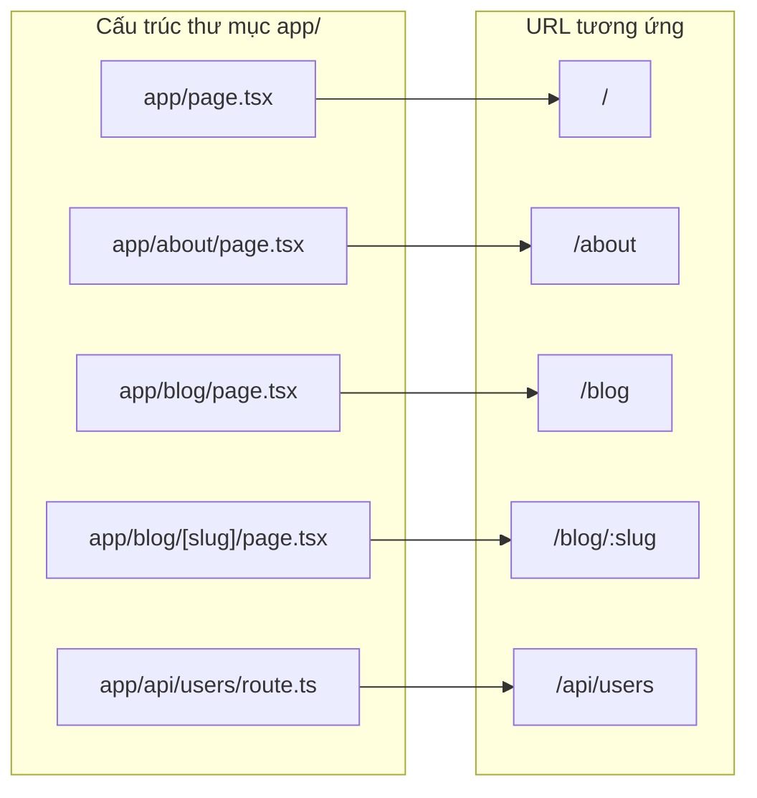

# Pages Router vs App Router

Next.js có hai hệ thống định tuyến song song: **Pages Router** (router cũ, dùng thư mục `pages/`) và **App Router** (router mới, dùng thư mục `app/` và được khuyến nghị). Cả hai đều dựa trên cấu trúc thư mục để tạo URL, nhưng App Router hỗ trợ thêm Server Components và bố cục lồng nhau. Bài này so sánh hai router để bạn biết nên chọn loại nào.

[](pathname:///img/nextjs/types-of-routers.webp)

---

:::note[Ghi nhớ nhanh]

- ⭐ **Hai router song song:** Pages Router (`pages/`, cũ) và App Router (`app/`, khuyến nghị) — có thể chạy chung trong một project.
- ⭐ **App Router mặc định Server Components,** fetch data ngay trong `async` component, hỗ trợ nested layout + streaming/Suspense.
- **Data fetching:** Pages Router dùng `getServerSideProps`/`getStaticProps`; App Router thay bằng `async` component + `fetch` options.
- **Migrate dần** từng route (hai router chạy song song); API `pages/api/*` → `route.ts` dùng Web Standards Request/Response.
- **Dự án mới → App Router;** dự án cũ đang ổn cứ giữ nguyên — Pages Router không bị bỏ rơi.

:::

---

## Mục lục

- [Vì sao có App Router & Pages Router?](#vì-sao-có-app-router--pages-router)
- [Hai router song song](#hai-router-song-song)
- [Pages Router (legacy)](#pages-router-legacy)
- [App Router (khuyến nghị)](#app-router-khuyến-nghị)
- [So sánh chi tiết](#so-sánh-chi-tiết)
- [Migration strategy](#migration-strategy)
- [Câu hỏi phỏng vấn](#câu-hỏi-phỏng-vấn)

---

## Vì sao có App Router & Pages Router?

**Vấn đề:** Pages Router (cũ) tải nhiều JS xuống client, data fetching tách rời khỏi component:

```tsx
// pages/blog/[slug].tsx — fetch nằm NGOÀI component
export const getServerSideProps = async ({ params }) => {
  const post = await fetchPost(params.slug); // tách rời UI
  return { props: { post } };
};

export default function BlogPost({ post }) {
  // toàn bộ component này ship JS xuống client
  return <article>{post.content}</article>;
}
```

Hệ quả: khó chia nhỏ để tải dần (streaming), layout lồng nhau bất tiện, bundle JS phình to.

**Giải pháp:** App Router (Next 13+, dựa trên React Server Components) — mặc định render ở server (ít JS xuống client), fetch data NGAY trong async component, nested layout, streaming/Suspense, `loading`/`error` theo quy ước file:

```tsx
// app/blog/[slug]/page.tsx — Server Component, fetch NGAY trong component
export default async function BlogPost({ params }) {
  const { slug } = await params;
  const post = await fetchPost(slug); // chạy server, không ship JS
  return <article>{post.content}</article>;
}
```

Pages Router vẫn tồn tại để hỗ trợ codebase cũ. Quan trọng là hiểu **vì sao có 2** và **khi nào dùng cái nào**.

:::tip[Dùng thực tế]

- **Dự án mới** → dùng App Router để tận dụng Server Components, streaming, nested layout.
- **Bảo trì dự án cũ** đang chạy ổn trên Pages Router → cứ giữ nguyên, không cần đập đi xây lại.
- **Cần giảm bundle JS** → tận dụng Server Components của App Router để bớt JS xuống client.
- **Codebase lớn** → migrate dần từng route từ `pages/` sang `app/`, hai router chạy song song trong lúc chuyển.

:::

---

## Hai router song song

Next.js hỗ trợ **cả hai router** trong cùng project:

```
my-app/
├── app/      # App Router (mới)
└── pages/    # Pages Router (cũ)
```

Cả hai chạy song song — Next.js merge route:

- `app/dashboard/page.tsx` → `/dashboard`
- `pages/profile.tsx` → `/profile`

→ Migrate dần dần. Nhưng **project mới: chỉ dùng App Router**.

---

## Pages Router (legacy)

Cấu trúc cũ:

```
pages/
├── _app.tsx
├── _document.tsx
├── index.tsx              → /
├── about.tsx              → /about
├── blog/
│   ├── index.tsx          → /blog
│   └── [slug].tsx         → /blog/:slug
└── api/
    └── users.ts           → /api/users
```

Data fetching qua **special function**:

```tsx
// pages/blog/[slug].tsx
import { GetServerSideProps } from "next";

export const getServerSideProps: GetServerSideProps = async ({ params }) => {
  const post = await fetchPost(params.slug);
  return { props: { post } };
};

export default function BlogPost({ post }) {
  return <article>{post.content}</article>;
}
```

Các function chính:

| Function | Khi nào |
|----------|---------|
| `getStaticProps` | SSG — build time |
| `getStaticPaths` | List slug cho dynamic SSG |
| `getServerSideProps` | SSR — mỗi request |
| `getInitialProps` | Legacy SSR (avoid) |

---

## App Router (khuyến nghị)

```
app/
├── layout.tsx
├── page.tsx              → /
├── about/
│   └── page.tsx          → /about
├── blog/
│   ├── page.tsx          → /blog
│   └── [slug]/
│       └── page.tsx      → /blog/:slug
└── api/
    └── users/
        └── route.ts      → /api/users
```

Data fetching **trong component** (Server Component):

```tsx
// app/blog/[slug]/page.tsx
export default async function BlogPost({ params }) {
  const { slug } = await params;
  const post = await fetchPost(slug); // chạy server
  return <article>{post.content}</article>;
}
```

Không có `getServerSideProps` / `getStaticProps` — fetch trực tiếp trong
async component, control behavior qua `fetch` options.

Cách Next.js ánh xạ cấu trúc thư mục `app/` thành URL:



---

## So sánh chi tiết

| Feature | Pages Router | App Router |
|---------|-------------|-----------|
| Folder | `pages/` | `app/` |
| Route file | `pages/about.tsx` | `app/about/page.tsx` |
| Layout | `_app.tsx` (single) | `layout.tsx` (nested) |
| Document | `_document.tsx` | Trong root layout |
| Server Components | **Không** | **Default** |
| Server Actions | Không | **Có** |
| Data fetching | `getServerSideProps` / `getStaticProps` | `async` component + `fetch` |
| Streaming | Hạn chế | **Suspense + RSC** |
| Loading state | Custom | `loading.tsx` |
| Error handling | `_error.tsx` + custom | `error.tsx` per route |
| API | `pages/api/*` | `route.ts` per folder |
| Middleware | Cùng `middleware.ts` | Cùng `middleware.ts` |

---

## Migration strategy

**Migrate dần** từng route, không phải rewrite toàn bộ:

**Bước 1** — Tạo `app/` cạnh `pages/`:

```
my-app/
├── app/
│   └── layout.tsx     # root layout mới
├── pages/             # giữ nguyên
└── ...
```

Pages Router config từ `_app.tsx` cần chuyển sang `app/layout.tsx`:

```tsx
// app/layout.tsx
import "./globals.css";

export default function RootLayout({ children }) {
  return (
    <html>
      <body>{children}</body>
    </html>
  );
}
```

**Bước 2** — Migrate từng route:

```
pages/blog/[slug].tsx  →  app/blog/[slug]/page.tsx
```

Đổi `getServerSideProps` → async component:

```tsx
// Cũ (pages/blog/[slug].tsx)
export const getServerSideProps = async ({ params }) => {
  const post = await fetchPost(params.slug);
  return { props: { post } };
};

export default function Post({ post }) { /* ... */ }

// Mới (app/blog/[slug]/page.tsx)
export default async function Post({ params }) {
  const { slug } = await params;
  const post = await fetchPost(slug);
  return /* ... */;
}
```

**Bước 3** — Migrate API:

```ts
// Cũ (pages/api/users.ts)
import { NextApiRequest, NextApiResponse } from "next";

export default async function handler(
  req: NextApiRequest,
  res: NextApiResponse
) {
  const users = await db.user.findMany();
  res.json(users);
}

// Mới (app/api/users/route.ts)
export async function GET() {
  const users = await db.user.findMany();
  return Response.json(users);
}
```

Mới dùng **Web Standards** Request/Response thay vì Node API.

:::info[Phân tích]

**Migration challenges thường gặp:**

1. **Server vs Client Components** — page App Router default Server.
   Code dùng `useState`, `useEffect` phải đánh dấu `"use client"`.

2. **Data fetching pattern khác** — không còn `getServerSideProps`.
   Phải dùng `fetch()` trong component hoặc gọi function trực tiếp.

3. **Routing API khác**:
   - `useRouter()` từ `next/router` (Pages) → `next/navigation` (App).
   - `router.push()` API hơi khác.
   - `useSearchParams()`, `usePathname()` thay router.query.

4. **Style** — `_app.tsx` import CSS → `globals.css` trong root layout.

5. **Image, Link, Script** — API tương đương, không phải đổi.

Migrate có rủi ro. Plan:

- Đọc kỹ migration guide official.
- Migrate từng route một, test kỹ.
- Giữ Pages Router cho route phức tạp chưa sẵn sàng.
- Không cần migrate hết — Pages Router maintain lâu dài.

:::

:::tip[Mẹo]

**Khi nào nên migrate sang App Router?**

✅ Có lý do migrate:

- Cần **Server Components** (giảm bundle JS).
- Cần **Server Actions** (đơn giản hoá form).
- Cần **streaming** + Suspense.
- Cần **nested layout** native.
- Pages Router cũ cản phát triển feature mới.

❌ Không cần migrate:

- App đang chạy ổn, không có vấn đề.
- Team chưa quen React 19 + Server Components.
- Có dependency không compat với App Router.
- Resource hạn chế (migrate tốn 1-3 tháng cho app trung).

App Router là **tương lai**, nhưng Pages Router **không bị bỏ rơi**. Quyết
định dựa trên giá trị mang lại, không phải hype.

:::

:::warning[Cần lưu ý]

**Có thể trộn App Router + Pages Router** nhưng có limit:

- **Middleware** áp dụng cho cả hai.
- **_app.tsx** chỉ cho route trong `pages/`.
- **Root layout** trong `app/` chỉ cho route trong `app/`.
- **Same URL không thể có cả hai** — Next.js báo lỗi.
- **CSS global** — chia làm 2: `_app.tsx` cho pages, `layout.tsx` cho app.

Trong giai đoạn migration, cấu trúc lai này chấp nhận được. Mục tiêu
cuối: chỉ còn `app/`.

:::

---

## Câu hỏi phỏng vấn

Những câu thường gặp về chủ đề này. Tự trả lời trước, rồi bấm **Xem đáp án** để đối chiếu.

**1. `Pages Router` và `App Router` khác nhau thế nào về cấu trúc thư mục và quy ước đặt tên file?**

<details className="qa">
<summary>Xem đáp án</summary>

Pages Router lấy **tên file** làm route, App Router lấy **tên thư mục** làm route còn file chỉ đóng vai trò quy ước.

| | Pages Router | App Router |
|---|---|---|
| Thư mục gốc | `pages/` | `app/` |
| Route `/about` | `pages/about.tsx` | `app/about/page.tsx` |
| Dynamic route | `pages/blog/[slug].tsx` | `app/blog/[slug]/page.tsx` |
| Layout | `_app.tsx` (một cái duy nhất) | `layout.tsx` (lồng nhau theo từng cấp) |
| Document | `_document.tsx` | gộp vào root layout |
| API | `pages/api/users.ts` | `app/api/users/route.ts` |

Điểm mấu chốt: trong `app/`, một thư mục **chỉ trở thành URL khi có `page.tsx`** (hoặc `route.ts`). Nhờ vậy bạn có thể đặt component, test, style ngay cạnh route mà không vô tình tạo ra URL — điều không làm được ở `pages/`. App Router còn có thêm các file quy ước như `loading.tsx`, `error.tsx`, `template.tsx` đặt ngay trong thư mục route.

</details>

**2. Vì sao Next.js giới thiệu `App Router` trong khi `Pages Router` vẫn chạy tốt? Vấn đề gốc mà nó giải quyết là gì?**

<details className="qa">
<summary>Xem đáp án</summary>

Pages Router có ba hạn chế gốc rễ:

- **Bundle JS phình to** — mọi page component đều ship xuống client, kể cả phần chỉ hiển thị dữ liệu tĩnh.
- **Data fetching tách rời UI** — `getServerSideProps` nằm ngoài component, dữ liệu phải chảy qua props, càng lồng sâu càng khó truyền.
- **Layout lồng nhau bất tiện và không streaming được** — chỉ có một `_app.tsx`, trang phải chờ toàn bộ dữ liệu xong mới render.

App Router (Next 13+) dựa trên **React Server Components** để giải đúng ba thứ đó: component mặc định chạy ở server nên không ship JS, `fetch` nằm ngay trong `async` component đúng chỗ cần dữ liệu, layout lồng theo cấu trúc thư mục, và Suspense cho phép **streaming** từng mảnh UI. Nói ngắn gọn: App Router không phải "cú pháp mới cho vui" mà là hệ quả của việc React đổi mô hình render.

</details>

**3. Hai router có chạy song song trong cùng một project được không? Những ràng buộc nào cần biết?**

<details className="qa">
<summary>Xem đáp án</summary>

Được — Next.js merge route từ cả `app/` và `pages/`, nên `app/dashboard/page.tsx` cho `/dashboard` còn `pages/profile.tsx` cho `/profile` cùng hoạt động. Đây chính là cơ chế cho phép migrate dần từng route.

Các ràng buộc cần nhớ:

- **Không được trùng URL** giữa hai router — Next.js sẽ báo lỗi.
- `_app.tsx` và `_document.tsx` **chỉ áp dụng cho route trong `pages/`**; root `layout.tsx` chỉ áp dụng cho route trong `app/`.
- **CSS global bị chia đôi**: import trong `_app.tsx` cho phía pages, trong `app/layout.tsx` cho phía app — dễ trùng lặp style trong giai đoạn chuyển.
- **`middleware.ts` áp dụng cho cả hai** router, nên đây là chỗ duy nhất logic dùng chung được.

Cấu trúc lai chấp nhận được trong giai đoạn migration, nhưng mục tiêu cuối vẫn là chỉ còn `app/`.

</details>

**4. Cách fetch dữ liệu ở hai router khác nhau ra sao? Hãy so sánh bằng một ví dụ cụ thể.**

<details className="qa">
<summary>Xem đáp án</summary>

Pages Router dùng **special function** export ra ngoài component, Next.js gọi nó rồi bơm kết quả vào props:

```tsx
// pages/blog/[slug].tsx
export const getServerSideProps = async ({ params }) => {
  const post = await fetchPost(params.slug);
  return { props: { post } };
};

export default function BlogPost({ post }) {
  return <article>{post.content}</article>;
}
```

App Router bỏ hẳn các function đó — component là `async` và fetch ngay bên trong:

```tsx
// app/blog/[slug]/page.tsx
export default async function BlogPost({ params }) {
  const { slug } = await params;
  const post = await fetchPost(slug); // chạy ở server
  return <article>{post.content}</article>;
}
```

Khác biệt cốt lõi: ở Pages Router chỉ **page cấp cao nhất** mới fetch được, dữ liệu phải truyền xuống qua props. Ở App Router **bất kỳ Server Component nào** cũng fetch được ngay chỗ cần dùng, và hành vi cache/revalidate được điều khiển qua options của `fetch` thay vì qua tên function.

</details>

**5. Ở `Pages Router`, `_app.tsx` và `_document.tsx` đảm nhiệm việc gì? Trong `App Router` chúng được thay bằng gì?**

<details className="qa">
<summary>Xem đáp án</summary>

- **`_app.tsx`** là component bọc quanh **mọi page**: nơi import CSS global, đặt provider (theme, store, react-query), giữ state xuyên suốt các lần chuyển trang. Nhược điểm: chỉ có một cái duy nhất cho toàn app.
- **`_document.tsx`** tuỳ biến phần khung HTML do server render ra — thẻ `html`, `body`, `lang`, font link, script chèn sớm. Nó chỉ chạy ở server, không chạy lại khi điều hướng phía client.

Trong App Router, cả hai được gộp vào **`app/layout.tsx`** (root layout). Root layout bắt buộc phải tự render thẻ `html` và `body` — phần việc trước kia của `_document.tsx` — đồng thời là chỗ import `globals.css` và đặt provider, thay cho `_app.tsx`. Ưu điểm: layout có thể **lồng nhau**, mỗi thư mục route tự có `layout.tsx` riêng, thay vì dồn hết vào một file.

</details>

**6. Mặc định component ở mỗi router là Server hay Client? Điều này ảnh hưởng thế nào tới kích thước bundle JS?**

<details className="qa">
<summary>Xem đáp án</summary>

- **Pages Router: mọi component đều là Client Component.** Kể cả khi dữ liệu lấy ở server qua `getServerSideProps`, bản thân component vẫn được ship xuống client để hydrate.
- **App Router: mặc định là Server Component.** Muốn chuyển sang client phải khai báo `"use client"` ở đầu file.

Ảnh hưởng tới bundle:

- Server Component **không ship JS** xuống client — chỉ gửi kết quả render. Thư viện chỉ dùng trong Server Component (ví dụ thư viện format markdown, SDK truy vấn DB) cũng không nằm trong bundle.
- Chỉ phần thực sự cần tương tác (`useState`, `useEffect`, event handler) mới đánh dấu `"use client"` và mới tính vào bundle.

Nguyên tắc thực hành: đẩy `"use client"` xuống **càng gần lá càng tốt** — tách nút bấm ra component riêng thay vì đánh dấu cả trang là client, nếu không lợi thế về bundle mất sạch.

</details>

**7. `useRouter` từ `next/router` và từ `next/navigation` khác nhau ra sao? `router.query` được thay bằng những hook nào?**

<details className="qa">
<summary>Xem đáp án</summary>

Hai hook trùng tên nhưng thuộc hai router khác nhau và **không thay thế lẫn nhau** — import nhầm sẽ lỗi runtime.

| | `next/router` (Pages) | `next/navigation` (App) |
|---|---|---|
| Object trả về | có `pathname`, `query`, `asPath`, `events`... | chỉ còn các method điều hướng |
| Đọc URL | `router.query`, `router.pathname` | tách thành các hook riêng |
| Dùng ở đâu | component bất kỳ | chỉ trong Client Component |

Ở App Router, `router.query` bị tách làm hai phần:

- **`useParams()`** — lấy dynamic segment, ví dụ `[slug]` trong `/blog/abc`.
- **`useSearchParams()`** — lấy query string (`?page=2`), trả về đối tượng dạng `URLSearchParams` (read-only).
- **`usePathname()`** — lấy đường dẫn hiện tại, thay cho `router.pathname`.

Ngoài ra `useRouter` của `next/navigation` chỉ giữ `push`, `replace`, `back`, `forward`, `refresh` — không còn `router.events`, muốn theo dõi chuyển trang phải dùng `usePathname` kết hợp `useEffect`.

</details>

**8. Chuyển `pages/api/users.ts` sang `app/api/users/route.ts` cần đổi những gì về `Request` và `Response`?**

<details className="qa">
<summary>Xem đáp án</summary>

Thay đổi lớn nhất: bỏ `NextApiRequest`/`NextApiResponse` kiểu Node để dùng **Web Standards** `Request`/`Response`, và thay một handler duy nhất bằng **một hàm export cho mỗi HTTP method**.

```ts
// Cũ — pages/api/users.ts
export default async function handler(req: NextApiRequest, res: NextApiResponse) {
  const users = await db.user.findMany();
  res.json(users);
}

// Mới — app/api/users/route.ts
export async function GET() {
  const users = await db.user.findMany();
  return Response.json(users);
}
```

Những điểm phải sửa theo:

- Không còn `res.status().json()` — phải **return** một `Response`, dùng `Response.json(data, { status: 201 })`.
- Phân biệt method bằng tên hàm export (`GET`, `POST`, `PUT`, `DELETE`...) thay vì `if (req.method === "POST")`.
- Đọc body bằng `await request.json()` thay vì `req.body` đã được parse sẵn.
- Query string lấy từ `new URL(request.url).searchParams` thay vì `req.query`.

</details>

**9. Vì sao Route Handler dùng Web Standards lại là hướng đi tốt hơn so với `NextApiRequest`/`NextApiResponse`?**

<details className="qa">
<summary>Xem đáp án</summary>

Vì `Request`/`Response` là **API chuẩn của nền tảng web**, không phải API riêng của Next.js hay của Node:

- **Chạy được ở nhiều runtime** — Node.js, Edge runtime, Cloudflare Workers, Deno... đều hiểu cùng một interface, nên cùng đoạn code deploy được ở nhiều nơi mà không phải viết lại.
- **Kiến thức chuyển được** — ai đã quen `fetch` phía client là đã quen `Request`/`Response`; không cần học thêm một bộ API riêng chỉ để viết backend Next.js.
- **Dễ test hơn** — chỉ cần tạo một `Request` thuần và kiểm tra `Response` trả về, không phải mock cả cặp `req`/`res` với hàng loạt method như `res.status().json()`.
- **Mô hình trả về rõ ràng hơn** — handler là hàm nhận vào và trả ra, thay vì "ghi vào object `res`" theo kiểu Express, vốn dễ quên gọi hoặc gọi hai lần.

Đổi lại, bạn mất vài tiện ích tự động của Node API (body parse sẵn, `req.query`), phải tự làm bằng API chuẩn.

</details>

**10. Bạn lập kế hoạch migrate một app lớn từ `Pages Router` sang `App Router` như thế nào để giảm thiểu rủi ro?**

<details className="qa">
<summary>Xem đáp án</summary>

Nguyên tắc: **migrate dần từng route, không rewrite toàn bộ**, tận dụng việc hai router chạy song song.

1. **Chuẩn bị** — nâng Next.js lên bản hỗ trợ App Router, đọc migration guide chính thức, rà soát dependency xem cái nào chưa tương thích Server Components.
2. **Tạo `app/` cạnh `pages/`** — dựng `app/layout.tsx` làm root layout, chuyển phần CSS global và provider từ `_app.tsx` sang.
3. **Chọn route dễ và ít rủi ro nhất trước** — trang tĩnh, trang marketing — để team làm quen mô hình trước khi đụng vào luồng nghiệp vụ.
4. **Migrate từng route:** `pages/blog/[slug].tsx` → `app/blog/[slug]/page.tsx`, đổi `getServerSideProps` thành `async` component, đổi import router sang `next/navigation`.
5. **Test kỹ sau mỗi route** và deploy từng phần, thay vì gộp một PR khổng lồ.
6. **Không ép migrate hết** — route phức tạp chưa sẵn sàng cứ để lại ở `pages/`, vì Pages Router vẫn được maintain lâu dài.

</details>

**11. Những khó khăn thường gặp nhất khi migrate là gì và bạn xử lý từng cái ra sao?**

<details className="qa">
<summary>Xem đáp án</summary>

Các vướng mắc điển hình:

- **Server vs Client Component** — page trong `app/` mặc định là Server, nên mọi code dùng `useState`, `useEffect`, event handler đều lỗi. *Xử lý:* tách phần tương tác ra component riêng và đánh dấu `"use client"` ở mức lá, không bọc cả trang.
- **Đổi pattern data fetching** — không còn `getServerSideProps`/`getStaticProps`. *Xử lý:* gọi `fetch` hoặc gọi thẳng hàm truy vấn ngay trong `async` component, điều khiển cache qua options của `fetch`.
- **API routing đổi** — `useRouter` phải đổi import sang `next/navigation`, `router.query` tách thành `useParams`/`useSearchParams`, `usePathname` thay `router.pathname`.
- **CSS global** — import từ `_app.tsx` phải chuyển sang root layout; trong giai đoạn lai phải giữ cả hai chỗ.
- **Dependency cũ** — thư viện phụ thuộc vào context phía client có thể phải bọc `"use client"` hoặc thay thế.

Ngược lại, `next/image`, `next/link`, `next/script` gần như giữ nguyên API, không phải sửa.

</details>

**12. Trong tình huống nào bạn sẽ khuyên team KHÔNG migrate sang `App Router`?**

<details className="qa">
<summary>Xem đáp án</summary>

Khi chi phí migrate lớn hơn giá trị thu về:

- **App đang chạy ổn, không có vấn đề thực sự** về bundle size, hiệu năng hay khả năng phát triển feature — migrate chỉ vì "mới hơn" là chạy theo hype.
- **Team chưa quen React Server Components** — mô hình server/client là thay đổi tư duy, không phải đổi cú pháp; migrate lúc chưa nắm vững dễ đẻ ra bug khó lần.
- **Có dependency chưa tương thích** với App Router, chưa có phương án thay thế.
- **Nguồn lực hạn chế** — với một app cỡ trung, migrate có thể ngốn vài tháng; nếu quý này phải ship tính năng cho khách thì đó là đánh đổi tồi.

Lập luận nền tảng: **Pages Router không bị bỏ rơi**, vẫn được maintain. App Router là tương lai, nhưng quyết định nên dựa trên giá trị cụ thể mang lại (Server Components, Server Actions, streaming, nested layout), không dựa trên phiên bản mới nhất.

</details>

**13. Trong giai đoạn trộn hai router, `middleware`, CSS global và layout được áp dụng như thế nào?**

<details className="qa">
<summary>Xem đáp án</summary>

- **`middleware.ts`** — dùng chung, nằm ở gốc project và áp dụng cho **cả hai router**. Đây là thuận lợi: logic auth, redirect, i18n viết một lần vẫn bảo vệ được route ở cả `pages/` lẫn `app/` trong suốt quá trình chuyển.
- **CSS global** — bị chia đôi. File import trong `_app.tsx` chỉ ảnh hưởng route của `pages/`; file import trong `app/layout.tsx` chỉ ảnh hưởng route của `app/`. Thực tế thường phải import cùng một `globals.css` ở cả hai chỗ để giao diện đồng nhất, và chấp nhận bị nạp trùng trong giai đoạn lai.
- **Layout** — `_app.tsx` và `_document.tsx` **không** áp dụng cho route trong `app/`; ngược lại root `layout.tsx` **không** áp dụng cho route trong `pages/`. Hệ quả là header/footer dùng chung phải được duy trì ở hai nơi cho tới khi migrate xong.

Vì vậy nên rút ngắn giai đoạn lai, đừng để kéo dài nhiều quý.

</details>

**14. Nếu cùng một URL tồn tại ở cả `pages/` và `app/` thì điều gì xảy ra?**

<details className="qa">
<summary>Xem đáp án</summary>

Next.js **báo lỗi conflict** chứ không âm thầm chọn một trong hai. Ví dụ tồn tại đồng thời `pages/about.tsx` và `app/about/page.tsx` — cả hai cùng ánh xạ ra `/about` — thì build (hoặc dev server) sẽ dừng lại và chỉ rõ route bị trùng.

Đây là thiết kế có chủ ý và hợp lý: nếu Next.js tự chọn theo một thứ tự ưu tiên ngầm, developer rất dễ sửa nhầm file mà không hiểu vì sao thay đổi không có tác dụng, hoặc tệ hơn là deploy nhầm phiên bản cũ của trang.

Hệ quả khi migrate: quy trình đúng là **tạo file ở `app/` rồi xoá file tương ứng ở `pages/` trong cùng một bước**, không giữ cả hai để "phòng hờ". Nếu muốn giữ bản cũ để rollback, hãy dùng git thay vì để hai file cùng tồn tại trên cùng URL.

</details>

**15. Những tính năng nào chỉ `App Router` có mà `Pages Router` không thể làm được?**

<details className="qa">
<summary>Xem đáp án</summary>

Những thứ gắn liền với React Server Components, Pages Router không có:

- **Server Components** — render ở server và không ship JS xuống client, giúp cắt giảm bundle.
- **Server Actions** — gọi hàm chạy trên server thẳng từ form/handler, không cần tự tạo API endpoint.
- **Nested layout** — mỗi cấp thư mục có `layout.tsx` riêng, giữ được state khi điều hướng giữa các route con; Pages Router chỉ có một `_app.tsx`.
- **Streaming + Suspense** — gửi UI xuống theo từng mảnh khi dữ liệu sẵn sàng, thay vì chờ toàn bộ trang.
- **File quy ước theo route** — `loading.tsx` và `error.tsx` đặt ngay trong thư mục route, thay cho việc tự viết loading state và một `_error.tsx` dùng chung.
- **Route Handler theo Web Standards** — `route.ts` dùng `Request`/`Response` chuẩn, chạy được ở nhiều runtime.

Ngược lại, `middleware.ts` là thứ **cả hai router dùng chung** — không phải lợi thế riêng của App Router.

</details>
