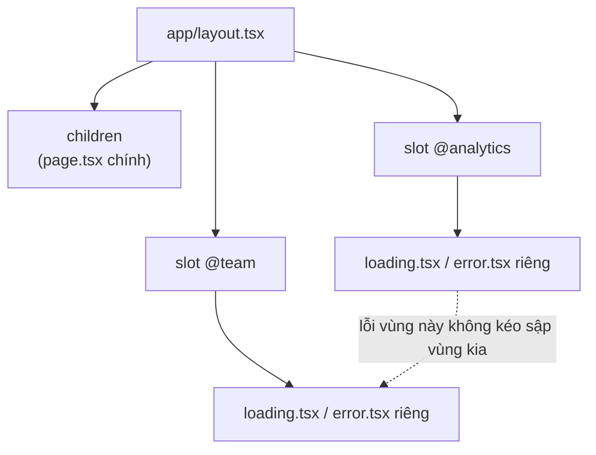
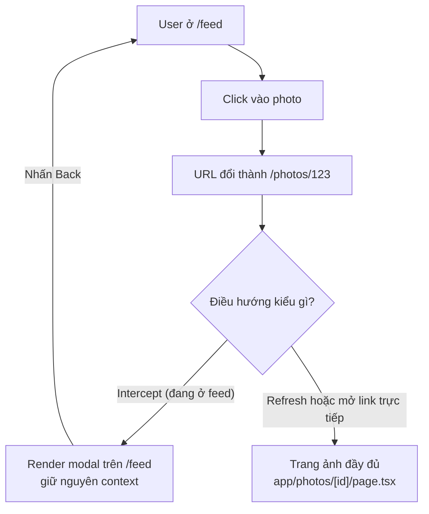

# Routing Patterns

**Routing pattern** (mẫu định tuyến) là các kỹ thuật đặt tên thư mục đặc biệt để tạo URL linh hoạt hơn trong Next.js. Bài này giới thiệu **dynamic route** (route động — URL chứa tham số thay đổi như `/blog/[id]`), **catch-all route** (route bắt mọi đoạn URL còn lại) và **route group** (nhóm route để tổ chức mà không ảnh hưởng đường dẫn). Đây là những mẫu giúp bạn xử lý các trang có cấu trúc URL phức tạp.

[](pathname:///img/nextjs/routing-patterns.webp)

---

:::note[Ghi nhớ nhanh]

- ⭐ **Dynamic route `[id]`** cho param động; **catch-all `[...slug]`** khớp 1+ segment, **optional `[[...slug]]`** khớp 0+ segment.
- ⭐ **Route Groups `(name)`** gom route và đổi layout mà KHÔNG làm đổi URL (ví dụ public vs sau login).
- **Parallel Routes `@slot`** render nhiều vùng song song trong một layout, mỗi slot có `loading`/`error` độc lập.
- **Intercepting Routes `(.)`/`(..)`** mở modal giữ context, refresh/share link thì ra trang đầy đủ (modal ảnh kiểu Instagram).
- **Đừng overengineer:** dynamic routes + route groups đủ cho ~90% case; chỉ dùng Parallel/Intercepting khi UX thực sự cần.

:::

---

## Mục lục

- [Vì sao cần các routing pattern?](#vì-sao-cần-các-routing-pattern)
- [Dynamic Routes](#dynamic-routes)
- [Catch-all Routes](#catch-all-routes)
- [Optional Catch-all](#optional-catch-all)
- [Route Groups](#route-groups)
- [Parallel Routes](#parallel-routes)
- [Intercepting Routes](#intercepting-routes)
- [Câu hỏi phỏng vấn](#câu-hỏi-phỏng-vấn)

---

## Vì sao cần các routing pattern?

**Vấn đề:** Bố cục thực tế phức tạp hơn nhiều so với "1 URL = 1 trang". Routing cơ bản không diễn tả được các nhu cầu sau:

```
1. Muốn nhóm route theo layout (public vs sau login)
   nhưng KHÔNG muốn URL có thêm /marketing, /app
2. Trang dashboard cần hiển thị NHIỀU vùng độc lập
   (analytics + team + notifications), mỗi vùng load/lỗi riêng
3. Click ảnh trong feed → mở modal nhưng URL vẫn đổi để
   share được; refresh thì ra trang ảnh đầy đủ
4. URL có tham số động (/users/5) hoặc không xác định độ sâu
   (/docs/a/b/c) — không thể tạo từng file thủ công
```

**Giải pháp:** App Router cung cấp các pattern đặt tên thư mục đặc biệt, mỗi pattern giải một bài toán trên:

```tsx
app/
├── (marketing)/          // route group: gom route, KHÔNG đổi URL
│   └── about/page.tsx    // → /about (không có /marketing)
├── @analytics/page.tsx   // parallel route: render song song nhiều vùng
├── @team/page.tsx        // mỗi slot có loading/error riêng
├── feed/
│   └── @modal/(..)photos/[id]/page.tsx  // intercepting: mở modal giữ context
├── users/[id]/page.tsx   // dynamic: /users/1, /users/2
└── docs/[...slug]/page.tsx  // catch-all: /docs/a/b/c (sâu tùy ý)
```

:::tip[Dùng thực tế]

- **Nhóm route theo layout:** gom trang public và trang sau login bằng `(marketing)` / `(app)`, mỗi nhóm dùng layout riêng mà URL vẫn sạch.
- **Dashboard nhiều panel độc lập:** dùng parallel routes `@analytics`, `@team` để analytics và team load song song, panel này lỗi không kéo sập panel kia.
- **Modal ảnh giữ URL:** intercepting route mở ảnh dạng modal trên feed, URL đổi để share được, refresh thì ra trang ảnh đầy đủ (Instagram, Pinterest).
- **Route động sản phẩm/danh mục nhiều cấp:** `[category]/[product]` cho trang sản phẩm, `[...slug]` cho cây tài liệu/CMS sâu tùy ý.

:::

---

## Dynamic Routes

Route với **param động** — dùng `[name]`:

```
app/blog/[slug]/page.tsx     → /blog/hello, /blog/about-me
app/users/[id]/page.tsx      → /users/1, /users/2
```

Truy cập param:

```tsx
// app/users/[id]/page.tsx
export default async function UserPage({
  params,
}: {
  params: Promise<{ id: string }>;
}) {
  const { id } = await params;
  return <p>User {id}</p>;
}
```

Nested dynamic:

```
app/[category]/[product]/page.tsx
→ /electronics/laptop
```

```tsx
const { category, product } = await params;
// category: "electronics", product: "laptop"
```

---

## Catch-all Routes

`[...slug]` — match **1 hoặc nhiều segment**:

```
app/docs/[...slug]/page.tsx
→ /docs/a
→ /docs/a/b
→ /docs/a/b/c
```

```tsx
export default async function DocsPage({
  params,
}: {
  params: Promise<{ slug: string[] }>;
}) {
  const { slug } = await params;
  // slug = ["a", "b", "c"]
  return <div>{slug.join(" / ")}</div>;
}
```

**Không match** `/docs` (không có segment).

---

## Optional Catch-all

`[[...slug]]` — match **0 hoặc nhiều segment**:

```
app/docs/[[...slug]]/page.tsx
→ /docs
→ /docs/a
→ /docs/a/b
```

```tsx
const { slug } = await params;
// slug undefined cho /docs
// slug = ["a"] cho /docs/a
```

Phù hợp với app như Notion, CMS — route động + có root page.

---

## Route Groups

`(name)` — gom route **không ảnh hưởng URL**:

```
app/
├── (marketing)/
│   ├── layout.tsx           # layout marketing
│   ├── about/page.tsx       → /about (không có /marketing)
│   └── pricing/page.tsx     → /pricing
└── (app)/
    ├── layout.tsx           # layout app sau login
    ├── dashboard/page.tsx   → /dashboard
    └── settings/page.tsx    → /settings
```

Lợi ích:

- **Layout khác nhau** cho các nhóm route.
- **Organize file** mà không tạo nested URL.
- **Cô lập concern** (public vs authenticated).

:::info[Phân tích]

**Use case phổ biến cho route group:**

**1. Public + Auth layout:**

```
app/
├── (public)/
│   ├── layout.tsx       # navbar marketing
│   ├── page.tsx         → /
│   ├── about/page.tsx   → /about
│   └── pricing/page.tsx → /pricing
└── (app)/
    ├── layout.tsx       # navbar dashboard
    ├── dashboard/page.tsx
    └── settings/page.tsx
```

**2. Tách auth wrap riêng:**

```
app/
├── (auth)/
│   ├── login/page.tsx
│   ├── register/page.tsx
│   └── layout.tsx       # centered card layout
└── (main)/
    ├── layout.tsx       # full app layout
    └── ...
```

Mỗi group có layout riêng — không phải condition trong 1 layout chung.

:::

---

## Parallel Routes

Render **nhiều page cùng lúc** trong 1 layout, qua **slot** `@name`:

```
app/
├── layout.tsx
├── @analytics/
│   └── page.tsx           # slot @analytics
├── @team/
│   └── page.tsx           # slot @team
└── page.tsx
```

```tsx
// app/layout.tsx
export default function Layout({
  children,
  analytics,
  team,
}: {
  children: React.ReactNode;
  analytics: React.ReactNode;
  team: React.ReactNode;
}) {
  return (
    <div className="grid grid-cols-2">
      <div>{children}</div>
      <div>
        {analytics}
        {team}
      </div>
    </div>
  );
}
```

Use case:

- **Dashboard với widget độc lập** — analytics, team, notifications load
  song song.
- **Modal route** — kết hợp với Intercepting Routes.
- **Tab giữ scroll** — mỗi tab là parallel slot.

**Independent error/loading**:

```
app/
├── @analytics/
│   ├── page.tsx
│   ├── error.tsx       # chỉ analytics fail không ảnh hưởng team
│   └── loading.tsx
└── @team/
    ├── page.tsx
    └── error.tsx
```

Mỗi slot có error/loading riêng — granular UX.

Cách layout kết hợp `children` với các slot song song, mỗi slot có `loading`/`error` độc lập:



---

## Intercepting Routes

**Intercept** một route để render trong layout hiện tại thay vì navigate
full:

```
app/
├── feed/
│   ├── page.tsx              # /feed
│   └── @modal/
│       └── (..)photos/[id]/
│           └── page.tsx      # intercept /photos/:id
└── photos/
    └── [id]/
        └── page.tsx          # /photos/:id (page thật)
```

Convention:

- `(.)` cùng cấp.
- `(..)` cấp trên.
- `(..)(..)` 2 cấp trên.
- `(...)` từ root.

Use case **kinh điển — Instagram modal photo**:

```
1. User ở /feed
2. Click vào photo → URL = /photos/123
3. Instead of full navigate, render modal trên /feed
4. Refresh page → vào /photos/123 trang thật
```

Luồng intercepting route quyết định render modal hay trang đầy đủ:



```tsx
// app/feed/@modal/(..)photos/[id]/page.tsx
import { Modal } from "@/components/Modal";

export default async function PhotoModal({ params }) {
  const photo = await fetchPhoto((await params).id);
  return (
    <Modal>
      
    </Modal>
  );
}
```

```tsx
// app/photos/[id]/page.tsx — full page, dùng khi refresh
export default async function PhotoPage({ params }) {
  const photo = await fetchPhoto((await params).id);
  return ;
}
```

:::info[Phân tích]

**Intercepting Routes cực kỳ powerful cho UX**:

Cho phép **deep linking** + **seamless modal**:

- Click photo trong feed → modal mở, URL đổi.
- User share URL → người khác mở thấy **full page** (không modal).
- Back button → đóng modal, về feed.
- Refresh → full page (không lost context).

Đây là pattern khó implement với SPA thường — yêu cầu coordinate router
+ modal state + URL state. Next.js App Router làm tự nhiên qua file
convention.

Pinterest, Twitter, Instagram đều dùng pattern này.

:::

:::tip[Mẹo]

**Combine Parallel + Intercepting**:

Route layout với slot `@modal` + intercept là pattern hoàn chỉnh cho modal:

```
app/
├── @modal/
│   └── default.tsx       # render null khi không có intercept
├── layout.tsx
├── feed/
│   ├── page.tsx
│   └── (..)photos/[id]/
│       └── page.tsx      # intercept khi đang ở feed
└── photos/
    └── [id]/
        └── page.tsx      # full page
```

```tsx
// app/layout.tsx
export default function Layout({ children, modal }) {
  return (
    <>
      {children}
      {modal} {/* render modal slot */}
    </>
  );
}

// app/@modal/default.tsx
export default function Default() {
  return null; // không có gì để hiển thị mặc định
}
```

`default.tsx` cần thiết — fallback khi slot không match route.

:::

:::warning[Cần lưu ý]

**Routing pattern này phức tạp** — đừng dùng overengineer:

- Đa số app **không cần** Parallel/Intercepting.
- Dynamic routes + Route Groups đủ cho 90% case.
- Chỉ dùng Parallel/Intercepting khi UX **thực sự cần** (modal deep link,
  dashboard widget độc lập).

Trade-off:

- File structure phức tạp hơn.
- Debug khó hơn (parallel slot không hiện trong nav).
- Team mới onboard phải đọc docs.

Bắt đầu đơn giản, scale lên khi cần.

:::

---

## Câu hỏi phỏng vấn

Những câu thường gặp về chủ đề này. Tự trả lời trước, rồi bấm **Xem đáp án** để đối chiếu.

**1. Dynamic route `[id]` hoạt động thế nào? Bạn truy cập giá trị param trong Server Component ra sao?**

<details className="qa">
<summary>Xem đáp án</summary>

Đặt tên thư mục trong cặp ngoặc vuông là biến đoạn URL đó thành **param động**: `app/users/[id]/page.tsx` khớp `/users/1`, `/users/2`... với một file duy nhất thay vì tạo thủ công từng trang.

Trong App Router, `params` được truyền vào page dưới dạng **Promise**, nên phải `await`:

```tsx
// app/users/[id]/page.tsx
export default async function UserPage({
  params,
}: {
  params: Promise<{ id: string }>;
}) {
  const { id } = await params;
  return <p>User {id}</p>;
}
```

Vài điểm hay bị hỏi thêm:

- Giá trị param **luôn là `string`**, kể cả khi URL là số — cần tự ép kiểu và validate.
- Ở Client Component không nhận được prop `params`, phải dùng hook `useParams()` từ `next/navigation`.
- Tên trong ngoặc vuông chính là key của object `params`, nên `[category]/[product]` cho ra hai key tương ứng.

</details>

**2. `[...slug]` và `[[...slug]]` khác nhau ở đâu? Hãy minh hoạ bằng các URL cụ thể.**

<details className="qa">
<summary>Xem đáp án</summary>

Cả hai đều là catch-all — gom mọi đoạn URL còn lại vào một mảng — nhưng khác nhau ở chỗ có khớp trường hợp **không còn đoạn nào** hay không.

| | `[...slug]` (catch-all) | `[[...slug]]` (optional catch-all) |
|---|---|---|
| Số segment khớp | 1 trở lên | 0 trở lên |
| `/docs` | không khớp | khớp |
| `/docs/a` | khớp, `slug = ["a"]` | khớp, `slug = ["a"]` |
| `/docs/a/b/c` | khớp, `slug = ["a","b","c"]` | khớp, `slug = ["a","b","c"]` |

Với `app/docs/[[...slug]]/page.tsx`, khi vào `/docs` thì `slug` là `undefined` — nhớ xử lý trường hợp này trước khi gọi `slug.join(...)`:

```tsx
const { slug } = await params;
const path = slug?.join("/") ?? "root";
```

Optional catch-all hợp với app kiểu Notion hay CMS: vừa có trang gốc `/docs`, vừa có cây tài liệu sâu tuỳ ý, tất cả trong một file.

</details>

**3. Với `app/docs/[...slug]/page.tsx`, URL `/docs` có khớp không? Vì sao và cách khắc phục là gì?**

<details className="qa">
<summary>Xem đáp án</summary>

**Không khớp.** `[...slug]` yêu cầu **ít nhất một segment** sau `/docs`, nên `/docs/a` khớp còn `/docs` thì không — truy cập `/docs` sẽ ra 404 nếu không có route nào khác nhận.

Hai cách khắc phục:

- **Đổi sang optional catch-all** `app/docs/[[...slug]]/page.tsx` — khớp cả `/docs` lẫn mọi cấp sâu hơn, chỉ cần xử lý thêm trường hợp `slug` là `undefined`. Phù hợp khi trang gốc và trang con dùng chung một logic render.
- **Thêm một page tĩnh riêng** `app/docs/page.tsx` bên cạnh `[...slug]`. Route tĩnh được ưu tiên hơn catch-all nên `/docs` sẽ vào file này. Phù hợp khi trang `/docs` là trang mục lục có giao diện khác hẳn trang nội dung.

Chọn cách nào tuỳ vào việc trang gốc có dùng chung logic với trang con hay không — nếu khác hẳn thì tách file rõ ràng hơn là nhét `if` vào optional catch-all.

</details>

**4. Nested dynamic route `[category]/[product]` sinh ra object `params` như thế nào?**

<details className="qa">
<summary>Xem đáp án</summary>

Mỗi cặp ngoặc vuông đóng góp **một key** vào `params`, tên key chính là tên thư mục. Với `app/[category]/[product]/page.tsx` và URL `/electronics/laptop`:

```tsx
const { category, product } = await params;
// category: "electronics"
// product:  "laptop"
```

Kiểu của nó là `Promise<{ category: string; product: string }>`.

Lưu ý khi làm thật:

- `params` chỉ chứa các segment động **trên đường dẫn tới chính page đó** — layout ở cấp `[category]` chỉ thấy `category`, không thấy `product`.
- Giá trị lấy từ URL nên **không tin được**: phải kiểm tra category/product có tồn tại trong DB không, nếu không thì gọi `notFound()`.
- Giá trị đã được decode sẵn, nên slug có dấu hoặc khoảng trắng mã hoá trong URL sẽ về dạng chuỗi bình thường.

</details>

**5. `route group` `(name)` ảnh hưởng gì tới URL? Nó giải quyết bài toán tổ chức nào?**

<details className="qa">
<summary>Xem đáp án</summary>

Thư mục đặt trong cặp ngoặc tròn **hoàn toàn không xuất hiện trong URL**. Ví dụ `app/(marketing)/about/page.tsx` cho ra `/about`, không phải `/marketing/about`.

Bài toán nó giải: bình thường trong App Router, muốn nhóm route lại thì phải tạo thư mục cha, mà thư mục cha lại lập tức thêm một đoạn vào URL. Route group tách rời hai việc đó — **tổ chức file** và **cấu trúc URL** không còn phải trùng nhau.

Ba lợi ích chính:

- **Layout khác nhau cho từng nhóm** — mỗi group có `layout.tsx` riêng, không phải viết `if` trong một layout chung.
- **Gom file theo nghiệp vụ** mà không sinh ra URL lồng nhau vô nghĩa.
- **Cô lập mối quan tâm** — nhóm public và nhóm cần đăng nhập nằm tách bạch, nhìn cây thư mục là thấy ngay ranh giới.

</details>

**6. Làm sao dùng route group để có hai layout khác nhau cho khu vực public và khu vực sau đăng nhập mà URL vẫn sạch?**

<details className="qa">
<summary>Xem đáp án</summary>

Tạo hai group song song, mỗi group có `layout.tsx` riêng:

```
app/
├── (public)/
│   ├── layout.tsx        # navbar marketing
│   ├── page.tsx          → /
│   ├── about/page.tsx    → /about
│   └── pricing/page.tsx  → /pricing
└── (app)/
    ├── layout.tsx        # sidebar dashboard
    ├── dashboard/page.tsx  → /dashboard
    └── settings/page.tsx   → /settings
```

URL không hề có `/public` hay `/app` — người dùng chỉ thấy `/about`, `/dashboard`. Trong khi đó trang marketing được bọc bởi layout có navbar giới thiệu, còn trang sau login được bọc bởi layout có sidebar.

Vài điểm cần nhớ:

- Chỉ **một group được chứa `page.tsx` ứng với `/`** — nếu hai group cùng định nghĩa route gốc sẽ conflict.
- Root `app/layout.tsx` vẫn tồn tại và bọc tất cả; layout của group là lớp lồng bên trong.
- Có thể thêm group `(auth)` cho `login`/`register` với layout dạng thẻ căn giữa, tách hẳn khỏi hai nhóm trên.

</details>

**7. `parallel routes` với slot `@name` là gì? Layout nhận các slot bằng cách nào?**

<details className="qa">
<summary>Xem đáp án</summary>

Thư mục bắt đầu bằng `@` tạo ra một **slot** — một vùng route độc lập được render **song song** cùng lúc trong một layout. Giống route group, tên slot không xuất hiện trong URL.

Layout nhận mỗi slot như **một prop cùng tên** với thư mục, bên cạnh `children`:

```tsx
// app/layout.tsx
export default function Layout({
  children,
  analytics,
  team,
}: {
  children: React.ReactNode;
  analytics: React.ReactNode;
  team: React.ReactNode;
}) {
  return (
    <div className="grid grid-cols-2">
      <div>{children}</div>
      <div>
        {analytics}
        {team}
      </div>
    </div>
  );
}
```

Ở đây `app/@analytics/page.tsx` thành prop `analytics`, `app/@team/page.tsx` thành prop `team`, còn `app/page.tsx` vẫn vào `children`. Use case điển hình: dashboard nhiều widget độc lập, tab giữ được scroll, và kết hợp với intercepting route để làm modal.

</details>

**8. Vì sao việc mỗi slot có `loading.tsx` và `error.tsx` riêng lại quan trọng với trải nghiệm dashboard?**

<details className="qa">
<summary>Xem đáp án</summary>

Vì các widget trên dashboard thường lấy dữ liệu từ những nguồn khác nhau, tốc độ và độ tin cậy khác nhau. Nếu chúng dùng chung một loading và một error boundary thì:

- Widget nhanh phải **chờ widget chậm nhất** mới hiện ra — cả trang đứng im dù 90% dữ liệu đã sẵn sàng.
- Một API lỗi kéo sập **toàn bộ dashboard**, người dùng mất luôn những phần vẫn chạy tốt.

Khi mỗi slot có file riêng:

```
app/
├── @analytics/
│   ├── page.tsx
│   ├── loading.tsx   # skeleton riêng cho analytics
│   └── error.tsx     # analytics lỗi, team vẫn hiển thị
└── @team/
    ├── page.tsx
    └── error.tsx
```

Mỗi vùng tự stream ra khi dữ liệu của nó xong, tự hiện skeleton khi đang chờ, tự hiện thông báo lỗi kèm nút thử lại khi hỏng. Đây chính là ý nghĩa của "granular UX" — độ chi tiết của trạng thái khớp với độ chi tiết của dữ liệu.

</details>

**9. `default.tsx` trong parallel route dùng để làm gì? Thiếu nó thì gặp vấn đề gì khi refresh hoặc điều hướng?**

<details className="qa">
<summary>Xem đáp án</summary>

`default.tsx` là **nội dung dự phòng của một slot khi slot đó không khớp route hiện tại**. Với slot modal, nó thường trả về `null` vì mặc định không có modal nào cần hiện:

```tsx
// app/@modal/default.tsx
export default function Default() {
  return null;
}
```

Vì sao cần: khi điều hướng phía client, Next.js còn nhớ trạng thái trước đó của từng slot. Nhưng khi **tải lại trang (full page load)**, nó không có gì để khôi phục — nếu URL hiện tại không khớp route nào trong slot và slot cũng không có `default.tsx`, Next.js sẽ báo 404.

Hệ quả thực tế: làm modal bằng slot `@modal` mà quên `default.tsx` thì click mở modal vẫn chạy, nhưng refresh ở một URL bình thường (hoặc mở link trực tiếp) lại lỗi — một bug rất dễ lọt qua dev vì lúc dev toàn điều hướng bằng click.

</details>

**10. `intercepting routes` giải quyết vấn đề UX nào? Giải thích ý nghĩa của `(.)`, `(..)`, `(..)(..)` và `(...)`.**

<details className="qa">
<summary>Xem đáp án</summary>

Vấn đề UX: người dùng đang ở một trang danh sách, click vào một mục và muốn xem chi tiết **mà không mất ngữ cảnh** (vị trí cuộn, bộ lọc) — tức là mở dạng modal. Nhưng URL vẫn phải đổi để share được, và khi mở link đó trực tiếp thì phải ra trang đầy đủ. Intercepting route cho phép **cùng một URL render hai cách khác nhau** tuỳ theo người dùng đến từ đâu.

Quy ước tiền tố, đọc giống đường dẫn tương đối nhưng tính theo **cấu trúc route**:

| Tiền tố | Ý nghĩa |
|---|---|
| `(.)` | chặn route cùng cấp |
| `(..)` | chặn route ở cấp trên một bậc |
| `(..)(..)` | chặn route ở cấp trên hai bậc |
| `(...)` | chặn route tính từ thư mục `app` gốc |

Ví dụ `app/feed/@modal/(..)photos/[id]/page.tsx` chặn `/photos/:id` — vốn nằm ngoài `feed`, tức trên một cấp — để render thành modal khi người dùng đang ở `/feed`.

</details>

**11. Thiết kế feed ảnh kiểu Instagram: click ảnh mở modal, share link hoặc refresh thì ra trang đầy đủ — bạn tổ chức cấu trúc thư mục thế nào?**

<details className="qa">
<summary>Xem đáp án</summary>

Kết hợp **parallel route** (slot `@modal`) với **intercepting route**:

```
app/
├── layout.tsx            # render {children} và {modal}
├── @modal/
│   └── default.tsx       # trả về null khi không có modal
├── feed/
│   ├── page.tsx          # /feed
│   └── (..)photos/[id]/
│       └── page.tsx      # bản modal, chặn /photos/:id
└── photos/
    └── [id]/
        └── page.tsx      # trang ảnh đầy đủ, dùng khi vào trực tiếp
```

Layout ghép hai phần lại:

```tsx
export default function Layout({ children, modal }) {
  return (
    <>
      {children}
      {modal}
    </>
  );
}
```

Luồng chạy: đang ở `/feed` click ảnh → URL thành `/photos/123` nhưng route bị chặn nên chỉ render modal chồng lên feed; nhấn Back → modal đóng, về `/feed`; refresh hoặc mở link từ người khác → không có gì để chặn nên vào thẳng `app/photos/[id]/page.tsx` là trang đầy đủ. Hai file hiển thị cùng dữ liệu nên nhớ tách phần lấy dữ liệu ra dùng chung.

</details>

**12. Vì sao pattern modal kèm deep link rất khó làm trong SPA thông thường, còn `App Router` lại làm được tự nhiên?**

<details className="qa">
<summary>Xem đáp án</summary>

Trong SPA thường, bạn phải tự **đồng bộ ba nguồn trạng thái**: URL, state của router, và state đóng/mở của modal. Kéo theo hàng loạt việc thủ công:

- Khi mở modal phải tự `pushState` để URL đổi, khi đóng phải tự pop lại đúng một bước.
- Phải phân biệt được "người dùng vừa click từ trong app" và "người dùng mở link từ ngoài vào" để quyết định render modal hay trang đầy đủ — thường phải nhét cờ vào history state.
- Phải giữ trang nền sống trong lúc modal mở, nếu không đóng modal xong danh sách bị render lại, mất vị trí cuộn.
- Nút Back của trình duyệt rất dễ lệch pha với state của modal.

App Router chuyển toàn bộ việc đó thành **quy ước file**: slot `@modal` giữ vùng modal tách khỏi `children`, tiền tố `(..)` khai báo route nào bị chặn, `default.tsx` xử lý trường hợp không có modal. Bản thân router đã biết phân biệt điều hướng phía client với tải trang mới, nên logic "modal hay full page" không cần bạn viết dòng nào.

</details>

**13. Khi nhiều route cùng có thể khớp một URL (route tĩnh, dynamic, catch-all), Next.js ưu tiên cái nào?**

<details className="qa">
<summary>Xem đáp án</summary>

Ưu tiên theo mức độ **cụ thể giảm dần** — cái nào mô tả URL chặt chẽ hơn thì thắng:

1. **Route tĩnh** — `app/blog/new/page.tsx`
2. **Route động** — `app/blog/[slug]/page.tsx`
3. **Catch-all** — `app/blog/[...slug]/page.tsx`
4. **Optional catch-all** — `app/blog/[[...slug]]/page.tsx`

Ví dụ với URL `/blog/new`: nếu tồn tại cả `blog/new/page.tsx` và `blog/[slug]/page.tsx` thì file tĩnh được chọn, `[slug]` không bao giờ nhận giá trị `"new"`.

Hai hệ quả thực tế:

- Muốn có trang đặc biệt nằm giữa một nhóm route động (ví dụ `/users/me` bên cạnh `/users/[id]`) thì cứ tạo thư mục tĩnh, không cần viết `if` trong page động.
- Đặt catch-all ở gốc (`app/[[...slug]]`) làm "trang CMS bắt tất" vẫn an toàn, vì mọi route cụ thể hơn đều thắng nó — nó chỉ nhận phần còn lại.

</details>

**14. Kết hợp `generateStaticParams` với dynamic route như thế nào để pre-render? Xử lý ra sao với param chưa được pre-render?**

<details className="qa">
<summary>Xem đáp án</summary>

`generateStaticParams` khai báo **danh sách param cần render sẵn lúc build** cho một route động — vai trò tương đương `getStaticPaths` bên Pages Router:

```tsx
// app/blog/[slug]/page.tsx
export async function generateStaticParams() {
  const posts = await fetchPosts();
  return posts.map((p) => ({ slug: p.slug })); // key trùng tên thư mục
}

export default async function Post({ params }) {
  const { slug } = await params;
  // ...
}
```

Với param **không nằm trong danh sách** đó, hành vi phụ thuộc `dynamicParams`:

- **`dynamicParams = true`** (mặc định) — Next.js render on-demand ở lần truy cập đầu rồi cache lại, tức là kiểu incremental. Hợp với blog/e-commerce liên tục thêm bài mới mà không muốn build lại.
- **`export const dynamicParams = false`** — mọi param ngoài danh sách trả về **404**. Hợp khi tập giá trị đóng và cố định (danh sách ngôn ngữ, danh mục cố định).

Với catch-all, mỗi phần tử trả về là một mảng: `{ slug: ["a", "b"] }`.

</details>

**15. Khi nào bạn KHÔNG nên dùng parallel hoặc intercepting route? Những trade-off nào cần cân nhắc với team?**

<details className="qa">
<summary>Xem đáp án</summary>

Không nên dùng khi **UX không thực sự đòi hỏi**. Đa số ứng dụng chỉ cần dynamic route và route group là đủ cho khoảng 90% tình huống. Cụ thể nên bỏ qua khi:

- Modal chỉ là hộp xác nhận, form ngắn — không cần URL riêng, không cần share link thì dùng state phía client đơn giản hơn nhiều.
- Dashboard chỉ có vài widget lấy từ cùng một nguồn dữ liệu — một `page.tsx` với `Suspense` là đủ.
- Team chưa quen App Router, dự án đang gấp.

Các trade-off phải nói rõ với team:

- **Cấu trúc thư mục khó đọc hơn** — `@slot` và `(..)` không tự giải thích, người mới vào phải đọc docs mới hiểu.
- **Debug khó hơn** — slot không hiện ra trong URL nên khi UI sai rất khó lần ngược về file nào đang render.
- **Nhiều file quy ước dễ quên** — thiếu `default.tsx` là vỡ lúc refresh, một lỗi chỉ lộ ra ở production.

Nguyên tắc: bắt đầu đơn giản, chỉ nâng cấp khi có nhu cầu cụ thể chứng minh được.

</details>
