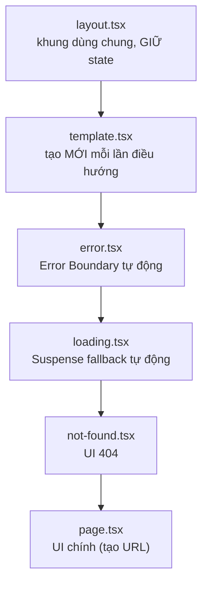

# Structuring Routes và API Endpoints

Bài này hướng dẫn cách tổ chức thư mục route sao cho gọn gàng và dễ bảo trì khi dự án lớn dần. Bạn sẽ làm quen với **co-location** (đặt các file liên quan cạnh nhau trong cùng thư mục route), **private folder** (thư mục bắt đầu bằng `_` không tạo URL) và **route handler** (file xử lý yêu cầu API ngay trong thư mục `app/`). Đây là nền tảng để xây dựng cả trang giao diện lẫn **API endpoint** (điểm cuối API — đường dẫn nhận và trả dữ liệu).

[](pathname:///img/nextjs/route-structure.webp)

---

:::note[Ghi nhớ nhanh]

- ⭐ **Đặt đúng tên file đặc biệt là Next tự nối** — `layout.tsx`, `page.tsx`, `loading.tsx`, `error.tsx`, `not-found.tsx`, `template.tsx` được lồng tự động quanh `page.tsx`, giảm boilerplate.
- ⭐ **Route Handler `route.ts`** — tạo API endpoint bằng cách export hàm theo method (`GET`, `POST`, `PUT`, `DELETE`...); method không có handler tự trả `405`.
- **Co-location** — đặt component/util/type riêng cạnh route dùng nó để dễ tìm, dễ xoá; dùng chung nhiều nơi thì mới nâng lên `components/` gốc.
- **Private folder `_name`** — thư mục bắt đầu bằng `_` không tạo route, dùng chứa code helper.
- **Route handler dùng Web Standards** — `Request`/`Response` thay cho `req`/`res` cũ, chạy được cả Edge Runtime, dễ port và test.
- **Route Handler vs Server Action** — Route Handler cho API public/webhook/OAuth/stream; đa số mutation form trong app nên dùng Server Action vì gọn và type-safe.

:::

---

## Mục lục

- [Vì sao có quy ước file cho route?](#vì-sao-có-quy-ước-file-cho-route)
- [Folder structure tốt](#folder-structure-tốt)
- [Co-location](#co-location)
- [Private folder _name](#private-folder-_name)
- [Route Handlers (API)](#route-handlers-api)
- [Method handlers](#method-handlers)
- [Request và Response](#request-và-response)
- [Câu hỏi phỏng vấn](#câu-hỏi-phỏng-vấn)

---

## Vì sao có quy ước file cho route?

**Vấn đề:** Mỗi route thường cần nhiều thứ đi kèm: UI chính, layout dùng chung, trạng thái loading, xử lý lỗi, trang 404. Nếu tự dựng và nối thủ công thì code lặp và rất dễ quên một mảnh:

```tsx
// app/dashboard/page.tsx — phải tự nối mọi thứ bằng tay
export default function DashboardPage() {
  return (
    <ErrorBoundary fallback={<ErrorView />}>      {/* tự bọc lỗi */}
      <Suspense fallback={<Skeleton />}>          {/* tự bọc loading */}
        <SharedLayout>                            {/* tự lồng layout */}
          <DashboardContent />
        </SharedLayout>
      </Suspense>
    </ErrorBoundary>
  );
}
// → route nào cũng lặp lại boilerplate này, thiếu một lớp là vỡ
```

**Giải pháp:** Next.js dùng **quy ước tên file** đặc biệt trong thư mục route. Đặt đúng tên file là Next tự nối lại với nhau → ít boilerplate, nhất quán:

```tsx
// app/dashboard/
// ├── layout.tsx     → khung bao quanh, GIỮ state khi điều hướng giữa các trang con
// ├── page.tsx       → UI chính của route (cái duy nhất tạo URL)
// ├── loading.tsx    → Suspense fallback TỰ ĐỘNG khi page đang tải
// ├── error.tsx      → Error Boundary TỰ ĐỘNG bắt lỗi của route
// ├── not-found.tsx  → UI cho 404 (gọi notFound() hoặc route không khớp)
// └── template.tsx   → giống layout nhưng tạo MỚI mỗi lần điều hướng (reset state)

// page.tsx giờ chỉ cần lo UI — Next tự bọc layout/loading/error quanh nó
export default async function DashboardPage() {
  const data = await getDashboardData();
  return <DashboardContent data={data} />;
}
```

Thứ tự Next.js lồng các special file bao quanh `page.tsx` (ngoài cùng vào trong):



:::tip[Dùng thực tế]

- **`layout.tsx` dùng chung cho nhóm trang:** sidebar + navbar bọc mọi trang trong `dashboard/`, không re-render và giữ nguyên state khi chuyển qua lại giữa các trang con.
- **`loading.tsx` hiện skeleton tự động:** chỉ cần tạo file, Next bọc `<Suspense>` quanh `page.tsx` — người dùng thấy skeleton ngay trong lúc data fetch.
- **`error.tsx` bắt lỗi từng phần:** lỗi trong một route chỉ làm hỏng đúng vùng đó kèm nút "Thử lại", các phần còn lại của trang vẫn chạy bình thường.
- **`not-found.tsx` tuỳ biến 404:** trang "Không tìm thấy" riêng cho từng nhóm route (ví dụ 404 của khu blog khác 404 của khu shop).

:::

---

## Folder structure tốt

Pattern phổ biến — **organize theo feature**:

```
app/
├── (marketing)/
│   ├── layout.tsx
│   ├── page.tsx
│   └── pricing/page.tsx
│
├── (app)/
│   ├── layout.tsx
│   ├── dashboard/
│   │   ├── page.tsx
│   │   ├── _components/
│   │   │   ├── Chart.tsx
│   │   │   └── StatCard.tsx
│   │   └── _utils/
│   │       └── format.ts
│   └── settings/
│       ├── page.tsx
│       ├── account/page.tsx
│       └── billing/page.tsx
│
├── api/
│   └── users/
│       └── route.ts
│
└── layout.tsx
```

---

## Co-location

Đặt **component, util, type** liên quan **cạnh route** dùng nó:

```
app/dashboard/
├── page.tsx
├── components/
│   ├── Chart.tsx       # chỉ dùng ở dashboard
│   └── StatCard.tsx
├── utils/
│   └── format.ts
└── types.ts
```

Lợi ích:

- **Dễ tìm** — code nằm cạnh nơi dùng.
- **Easy to delete** — xoá folder = xoá feature.
- **Encapsulation** — không "leak" ra ngoài.

:::info[Phân tích]

**Phân biệt 3 nơi đặt code**:

| Vị trí | Khi nào |
|--------|---------|
| `app/feature/components/X.tsx` | Component **chỉ feature đó** dùng |
| `components/X.tsx` (root) | Component **dùng ở nhiều feature** |
| `components/ui/Button.tsx` | Design system primitive |

Pattern shadcn/ui:

```
app/
├── dashboard/
│   ├── page.tsx
│   └── components/StatCard.tsx
│
components/
├── ui/                  # shadcn copy-paste
│   ├── button.tsx
│   ├── card.tsx
│   └── dialog.tsx
└── shared/              # custom component shared
    └── PageHeader.tsx
```

Refactor pattern khi component được dùng ở nơi thứ 2 → **move lên root**
`components/`. Không cố giữ trong feature folder.

:::

---

## Private folder _name

Folder bắt đầu bằng `_` → **không được Next.js coi là route**:

```
app/
├── _components/         # private, không route
├── _utils/              # private
└── dashboard/
    └── page.tsx
```

`_components` và `_utils` chứa code helper. Folder thường (`components/`)
**cũng không tạo route** trừ khi có `page.tsx` — nhưng `_` là rõ ý đồ
hơn.

---

## Route Handlers (API)

Tạo API endpoint trong App Router — file `route.ts`:

```ts
// app/api/users/route.ts
export async function GET() {
  const users = await db.user.findMany();
  return Response.json(users);
}

export async function POST(request: Request) {
  const body = await request.json();
  const user = await db.user.create({ data: body });
  return Response.json(user, { status: 201 });
}
```

Endpoint:

- `GET /api/users` → list users.
- `POST /api/users` → create.

Dynamic API:

```ts
// app/api/users/[id]/route.ts
export async function GET(
  request: Request,
  { params }: { params: Promise<{ id: string }> }
) {
  const { id } = await params;
  const user = await db.user.findUnique({ where: { id } });

  if (!user) {
    return Response.json({ error: "Not found" }, { status: 404 });
  }
  return Response.json(user);
}
```

---

## Method handlers

Export function tương ứng method:

```ts
// app/api/users/route.ts
export async function GET()    { /* ... */ }
export async function POST()   { /* ... */ }
export async function PUT()    { /* ... */ }
export async function PATCH()  { /* ... */ }
export async function DELETE() { /* ... */ }
export async function HEAD()   { /* ... */ }
export async function OPTIONS(){ /* ... */ }
```

Method nào không có handler → Next.js trả `405 Method Not Allowed` tự động.

---

## Request và Response

Route handler dùng **Web Standards** API:

```ts
export async function POST(request: Request) {
  // Read body
  const json = await request.json();
  const text = await request.text();
  const formData = await request.formData();

  // Headers
  const auth = request.headers.get("Authorization");

  // URL & query
  const url = new URL(request.url);
  const id = url.searchParams.get("id");

  // Cookies
  const cookies = request.headers.get("Cookie");

  return Response.json({ ok: true });
}
```

`Response` API:

```ts
// JSON
Response.json({ data });

// Text
new Response("Hello", { headers: { "Content-Type": "text/plain" } });

// Stream
const stream = new ReadableStream({ ... });
new Response(stream);

// Redirect
Response.redirect("/login", 302);

// Status + headers
Response.json(
  { error: "Forbidden" },
  { status: 403, headers: { "X-Custom": "..." } }
);
```

:::info[Phân tích]

**Next.js Web Standards** vs **Node API cũ**:

| Cũ (Pages Router API) | Mới (App Router Route Handler) |
|----------------------|--------------------------------|
| `req.body` (parsed) | `await request.json()` |
| `req.query` | `new URL(req.url).searchParams` |
| `res.status(200).json({})` | `Response.json({}, { status: 200 })` |
| `res.setHeader(...)` | `Response(..., { headers })` |

Lợi ích Web Standards:

- **Tương thích Edge Runtime** — không cần Node.
- **Portable** — code chạy được trên Bun, Deno, Cloudflare Workers, Vercel Edge.
- **Streaming native** — `ReadableStream` standard.
- **Test dễ** — không cần mock Node API.

→ Đây là direction của toàn web ecosystem — Hono, Bun, Deno đều dùng
Web Standards.

:::

:::tip[Mẹo]

**Pattern wrapper cho API route**:

```ts
// lib/api.ts
export async function withAuth<T>(
  request: Request,
  handler: (user: User) => Promise<T>
): Promise<Response> {
  try {
    const token = request.headers.get("Authorization")?.replace("Bearer ", "");
    if (!token) return Response.json({ error: "Unauthorized" }, { status: 401 });

    const user = await verifyToken(token);
    const result = await handler(user);
    return Response.json(result);
  } catch (err) {
    return Response.json({ error: err.message }, { status: 500 });
  }
}
```

```ts
// app/api/profile/route.ts
import { withAuth } from "@/lib/api";

export async function GET(request: Request) {
  return withAuth(request, async (user) => {
    return await db.user.findUnique({ where: { id: user.id } });
  });
}
```

Auth + error handling trung tâm → mọi route ngắn, consistent.

:::

:::warning[Cần lưu ý]

**Route Handler vs Server Action — khi nào dùng cái nào?**

| | Route Handler | Server Action |
|--|---------------|---------------|
| Use case | API public, third-party | Form mutation từ component |
| Public? | **Có** (URL accessible) | Không (internal RPC) |
| Method | GET, POST, PUT, DELETE... | POST only |
| Schema validation | Tự làm | Tự làm (Zod) |
| Type-safe | Phải khai báo client | **Tự động** từ function |

→ Server Actions thay thế cho **CRUD trong app**. Route Handler cần khi:

- **API public** cho client khác (mobile, third-party).
- **Webhook receiver**.
- **OAuth callback**.
- **Stream**, **SSE**, **file upload** đặc biệt.

Trong App Router, đa số mutation form đi qua Server Action — gọn hơn,
type-safe.

:::

---

## Câu hỏi phỏng vấn

Những câu thường gặp về chủ đề này. Tự trả lời trước, rồi bấm **Xem đáp án** để đối chiếu.

**1. `co-location` là gì? Đặt component và util cạnh route dùng nó mang lại lợi ích cụ thể nào?**

<details className="qa">
<summary>Xem đáp án</summary>

**Co-location** là đặt mọi thứ chỉ phục vụ một route — component, util, type, test — **ngay trong thư mục của route đó**, thay vì gom hết vào các thư mục chung theo loại file:

```
app/dashboard/
├── page.tsx
├── components/
│   ├── Chart.tsx       # chỉ dashboard dùng
│   └── StatCard.tsx
├── utils/format.ts
└── types.ts
```

Lợi ích cụ thể:

- **Dễ tìm** — sửa dashboard thì mở đúng một thư mục, không phải nhảy qua lại giữa `components/`, `utils/`, `types/` ở gốc.
- **Dễ xoá** — bỏ một feature là xoá nguyên thư mục, không để lại component mồ côi mà không ai dám xoá vì sợ chỗ khác còn dùng.
- **Cô lập phạm vi** — nhìn vị trí file là biết ngay phạm vi ảnh hưởng: file trong `app/dashboard/` thì sửa nó chỉ ảnh hưởng dashboard.

Điều này làm được nhờ trong App Router, thư mục **chỉ tạo URL khi có `page.tsx`** — đặt file thường ở đó hoàn toàn an toàn.

</details>

**2. Khi nào một component nên được nâng từ thư mục feature lên `components/` ở gốc? Tiêu chí quyết định là gì?**

<details className="qa">
<summary>Xem đáp án</summary>

Tiêu chí đơn giản và dứt khoát: **khi nó bắt đầu được dùng ở nơi thứ hai**. Đừng đoán trước "sau này chắc dùng lại" rồi đặt sẵn lên gốc — đó là cách nhanh nhất để `components/` biến thành bãi rác.

Ba tầng đặt code thường dùng:

| Vị trí | Dành cho |
|---|---|
| `app/feature/components/X.tsx` | component **chỉ feature đó** dùng |
| `components/shared/X.tsx` | component dùng ở **nhiều feature** |
| `components/ui/Button.tsx` | primitive của design system (kiểu shadcn/ui) |

Quy trình refactor: feature thứ hai cần dùng → chuyển file lên `components/`, sửa import ở cả hai nơi, và nhân dịp đó rà lại API của component cho đủ tổng quát (bỏ những prop chỉ đúng với feature ban đầu). Đừng cố giữ nó nằm trong thư mục feature rồi import chéo giữa các feature — đó là dấu hiệu rõ ràng của coupling sai hướng và sẽ rất khó gỡ về sau.

</details>

**3. Một thư mục thường trong `app/` có tự tạo route không? `_folder` khác gì so với thư mục thường?**

<details className="qa">
<summary>Xem đáp án</summary>

**Không.** Thư mục trong `app/` chỉ trở thành URL truy cập được khi bên trong có `page.tsx` (hoặc `route.ts`). Vì vậy `app/dashboard/components/Chart.tsx` không hề tạo ra `/dashboard/components` — đây chính là điều làm co-location an toàn.

`_folder` (tên bắt đầu bằng gạch dưới) là **private folder**: Next.js loại nó và toàn bộ cây con ra khỏi hệ thống routing:

```
app/
├── _components/     # private, chắc chắn không bao giờ là route
├── _utils/
└── dashboard/page.tsx
```

Khác biệt thực tế giữa hai cách:

- Thư mục thường: không tạo route **chừng nào chưa có `page.tsx`** — lỡ tay thêm `page.tsx` vào là sinh URL ngoài ý muốn.
- `_folder`: không bao giờ tạo route, kể cả có `page.tsx` bên trong. Nó cũng **tuyên bố rõ ý đồ** cho người đọc code: đây là code nội bộ, không phải route.

Nếu tên thư mục cần bắt đầu bằng ký tự `%5F` thật trong URL thì dùng mã hoá, nhưng trường hợp này rất hiếm.

</details>

**4. Vì sao chỉ `page.tsx` (hoặc `route.ts`) mới làm cho một segment trở nên truy cập được qua URL?**

<details className="qa">
<summary>Xem đáp án</summary>

Vì Next.js tách bạch hai việc: **cấu trúc thư mục mô tả đường dẫn**, còn **file quy ước quyết định cái gì được công khai**. Một thư mục chỉ nói "nếu có route ở đây thì URL sẽ là thế này", nó không tự động mở cửa.

Đây là lựa chọn thiết kế quan trọng vì:

- Cho phép **co-location** — đặt component, util, test, ảnh ngay cạnh route mà không vô tình tạo ra URL rác hay rò rỉ file nội bộ ra ngoài. Ở Pages Router, mỗi file trong `pages/` là một route nên không làm được điều này.
- Cho phép các **file quy ước khác** (`layout.tsx`, `loading.tsx`, `error.tsx`, `template.tsx`, `not-found.tsx`) tồn tại trong cùng thư mục với vai trò riêng, thay vì cũng bị hiểu thành route.
- Phân biệt rõ **route UI** (`page.tsx`) với **route API** (`route.ts`). Hai file này không được nằm cùng một thư mục vì cùng ánh xạ ra một URL — sẽ conflict.

</details>

**5. Cách tạo API endpoint bằng `route.ts` — bạn export những gì để xử lý `GET` và `POST`?**

<details className="qa">
<summary>Xem đáp án</summary>

Tạo file `route.ts` trong thư mục tương ứng với đường dẫn, rồi **export một hàm cho mỗi HTTP method**, tên hàm viết hoa đúng tên method:

```ts
// app/api/users/route.ts
export async function GET() {
  const users = await db.user.findMany();
  return Response.json(users);
}

export async function POST(request: Request) {
  const body = await request.json();
  const user = await db.user.create({ data: body });
  return Response.json(user, { status: 201 });
}
```

Kết quả: `GET /api/users` trả về danh sách, `POST /api/users` tạo mới.

Những điểm cần nhớ:

- Handler **phải `return` một `Response`**, không có object `res` để ghi vào.
- Các method được hỗ trợ: `GET`, `POST`, `PUT`, `PATCH`, `DELETE`, `HEAD`, `OPTIONS`.
- Thư mục chứa `route.ts` **không được có `page.tsx`** — cùng một URL không thể vừa là trang vừa là API.
- Không bắt buộc phải đặt trong `app/api/`; đó chỉ là quy ước cho dễ đọc.

</details>

**6. Nếu client gọi một HTTP method chưa có handler tương ứng thì Next.js phản hồi thế nào?**

<details className="qa">
<summary>Xem đáp án</summary>

Next.js tự trả về **`405 Method Not Allowed`** — bạn không phải viết dòng nào để xử lý.

Ví dụ `app/api/users/route.ts` chỉ export `GET` và `POST`; khi client gửi `DELETE /api/users`, Next.js đáp `405` thay vì `404` hay gọi nhầm handler khác.

Đây là khác biệt đáng chú ý so với Pages Router: ở đó chỉ có một `handler` duy nhất, bạn phải tự viết `switch` theo `req.method` và tự trả `405` cho nhánh mặc định — rất hay bị quên, dẫn tới việc một `POST` nhầm lại chạy đúng logic của `GET`.

Vài điểm liên quan:

- `HEAD` được suy ra từ `GET` nếu bạn không định nghĩa riêng.
- `OPTIONS` được xử lý tự động ở mức cơ bản; nếu cần CORS tuỳ biến thì tự export `OPTIONS` và trả về các header thích hợp.
- Việc tách handler theo method còn giúp code sạch hơn và dễ đọc hơn hẳn so với một khối `switch` dài.

</details>

**7. Route handler đọc body, query string và header ra sao? So sánh với `req.body` và `req.query` của `Pages Router`.**

<details className="qa">
<summary>Xem đáp án</summary>

Route handler dùng đối tượng `Request` chuẩn của web, nên mọi thứ đều là method của nó:

```ts
export async function POST(request: Request) {
  const json = await request.json();        // body JSON
  const form = await request.formData();    // body dạng form
  const auth = request.headers.get("Authorization");
  const id = new URL(request.url).searchParams.get("id");
  return Response.json({ ok: true });
}
```

So với Pages Router:

| Việc cần làm | Pages Router | Route Handler |
|---|---|---|
| Đọc body | `req.body` (đã parse sẵn) | `await request.json()` / `.text()` / `.formData()` |
| Query string | `req.query` | `new URL(request.url).searchParams` |
| Header | `req.headers.x` | `request.headers.get("x")` |
| Trả kết quả | `res.status(200).json(data)` | `return Response.json(data, { status: 200 })` |

Khác biệt tư duy: bên cũ body được parse sẵn và đồng bộ; bên mới body là **stream**, phải `await` và **chỉ đọc được một lần** — gọi `request.json()` hai lần sẽ lỗi. Nếu cần cả body thô lẫn JSON (ví dụ để verify chữ ký webhook) thì đọc `text()` một lần rồi tự `JSON.parse`.

</details>

**8. Vì sao chuyển sang Web Standards `Request`/`Response` lại quan trọng cho Edge Runtime, tính portable và khả năng test?**

<details className="qa">
<summary>Xem đáp án</summary>

Vì `Request`/`Response` là API của **nền tảng web**, không phụ thuộc vào Node.js:

- **Edge Runtime** — môi trường edge không có đầy đủ Node API (`http.IncomingMessage`, stream của Node...). Code viết theo Web Standards chạy được ở cả Node runtime lẫn Edge mà không phải phân nhánh.
- **Portable** — cùng một handler về mặt khái niệm chạy được trên Bun, Deno, Cloudflare Workers, Vercel Edge. Cả hệ sinh thái đang đi hướng này: Hono, Bun, Deno đều lấy `Request`/`Response` làm interface chuẩn.
- **Test dễ** — muốn test chỉ cần tạo một `Request` thật rồi kiểm tra `Response` trả về:

```ts
const res = await POST(new Request("http://x/api/users", {
  method: "POST",
  body: JSON.stringify({ name: "A" }),
}));
expect(res.status).toBe(201);
```

Không phải mock cặp `req`/`res` với hàng loạt method nối chuỗi như `res.status().json()`.

- **Streaming sẵn có** — `ReadableStream` là chuẩn, nên SSE hay stream file không cần API riêng của framework.

</details>

**9. Route handler động `app/api/users/[id]/route.ts` nhận `params` như thế nào và cần lưu ý gì ở Next.js 15?**

<details className="qa">
<summary>Xem đáp án</summary>

`params` đến qua **tham số thứ hai** của handler, sau `request`:

```ts
// app/api/users/[id]/route.ts
export async function GET(
  request: Request,
  { params }: { params: Promise<{ id: string }> }
) {
  const { id } = await params;
  const user = await db.user.findUnique({ where: { id } });
  if (!user) {
    return Response.json({ error: "Not found" }, { status: 404 });
  }
  return Response.json(user);
}
```

Lưu ý quan trọng ở Next.js 15: **`params` là một `Promise`**, phải `await` mới lấy được giá trị — trước đây nó là object thường. Đây là thay đổi breaking rất hay gặp khi nâng cấp; quên `await` thì `id` sẽ là `undefined` và query trả về rỗng một cách khó hiểu. Điều tương tự cũng áp dụng cho `searchParams` của page, `cookies()` và `headers()`.

Ngoài ra, `id` luôn là `string` lấy thẳng từ URL nên phải **validate trước khi đưa vào truy vấn**, và trả `404` gọn gàng thay vì để lỗi tràn ra ngoài.

</details>

**10. `Route Handler` và `Server Action` khác nhau ở những điểm nào? Trường hợp nào bắt buộc phải dùng Route Handler?**

<details className="qa">
<summary>Xem đáp án</summary>

| | Route Handler | Server Action |
|---|---|---|
| Bản chất | HTTP endpoint có URL công khai | lời gọi hàm server từ component (RPC nội bộ) |
| Ai gọi được | mọi client biết URL | chỉ chính app đó |
| Method | GET, POST, PUT, DELETE... | chỉ POST |
| Kiểu dữ liệu | phải tự khai báo lại ở client | suy ra tự động từ chữ ký hàm |
| Dùng cho | API, webhook, stream | mutation từ form trong app |

Bắt buộc dùng **Route Handler** khi:

- **API công khai** cho client khác — app mobile, đối tác bên thứ ba.
- **Nhận webhook** từ Stripe, GitHub... vì bên ngoài chỉ gọi được URL HTTP.
- **OAuth callback** — nhà cung cấp redirect về một URL cụ thể.
- **Stream / SSE / tải file** với header và định dạng phản hồi tuỳ biến.

Còn lại, trong App Router đa số mutation qua form nên dùng **Server Action** vì gọn hơn, type-safe và không phải tự dựng endpoint chỉ để app tự gọi chính mình.

</details>

**11. Server Action có an toàn hơn Route Handler không? Bạn validate input và kiểm soát quyền truy cập ra sao?**

<details className="qa">
<summary>Xem đáp án</summary>

**Không.** Server Action tuy không có URL để gõ vào trình duyệt, nhưng nó vẫn là một endpoint HTTP được sinh ra và có thể bị gọi trực tiếp. Chữ ký hàm có kiểu rõ ràng chỉ giúp ích **lúc viết code**, không phải rào chắn lúc chạy — TypeScript biến mất sau khi build.

Vì vậy Server Action phải được đối xử **y hệt một API công khai**:

- **Validate input ở server** bằng schema (Zod...) cho mọi trường, kể cả trường "chắc chắn đúng" vì đã validate ở form phía client.
- **Kiểm tra xác thực ngay trong từng action**, không dựa vào việc "nút này chỉ hiện với admin" — UI ẩn không phải là bảo mật.
- **Kiểm tra phân quyền theo từng bản ghi**: người dùng đăng nhập rồi vẫn phải xác minh họ sở hữu bản ghi đang sửa.
- **Không trả lỗi kỹ thuật ra ngoài** — log chi tiết ở server, trả thông điệp chung cho client.

Cùng bộ nguyên tắc đó áp dụng nguyên vẹn cho Route Handler; khác biệt duy nhất là Route Handler còn cần nghĩ thêm về CORS và rate limit vì nó công khai.

</details>

**12. Làm sao tập trung xử lý authentication và error cho nhiều route handler mà không lặp code ở từng file?**

<details className="qa">
<summary>Xem đáp án</summary>

Viết một **hàm wrapper dùng chung** rồi để mỗi handler chỉ còn phần nghiệp vụ:

```ts
// lib/api.ts
export async function withAuth<T>(
  request: Request,
  handler: (user: User) => Promise<T>
): Promise<Response> {
  try {
    const token = request.headers.get("Authorization")?.replace("Bearer ", "");
    if (!token) return Response.json({ error: "Unauthorized" }, { status: 401 });
    const user = await verifyToken(token);
    return Response.json(await handler(user));
  } catch (err) {
    return Response.json({ error: "Internal error" }, { status: 500 });
  }
}
```

```ts
// app/api/profile/route.ts
export async function GET(request: Request) {
  return withAuth(request, async (user) =>
    db.user.findUnique({ where: { id: user.id } })
  );
}
```

Lợi ích: auth và xử lý lỗi nằm một chỗ, mọi route ngắn và nhất quán về định dạng phản hồi. Có thể xếp chồng thêm các wrapper khác (validate schema, rate limit, logging).

Bổ sung: những việc chạy trước mọi request theo pattern URL — chặn khu vực cần đăng nhập, redirect, thêm header — nên đặt ở `middleware.ts` thay vì lặp trong từng handler.

</details>

**13. Route handler có được cache không? Điều gì khiến một handler `GET` chuyển thành dynamic?**

<details className="qa">
<summary>Xem đáp án</summary>

Ở Next.js 15, route handler **mặc định không được cache** — mỗi request đều chạy lại handler. (Ở các bản trước, handler `GET` "thuần" từng được cache mặc định, và sự thay đổi này gây khá nhiều bất ngờ khi nâng cấp, nên câu hỏi thường xoay quanh đúng chỗ đó.)

Muốn cache thì phải **chủ động khai báo** trong file route:

```ts
export const dynamic = "force-static";   // ép render tĩnh lúc build
export const revalidate = 3600;          // làm mới sau mỗi giờ
```

Những thứ khiến một handler **không thể tĩnh** (luôn dynamic):

- Dùng tham số `request` — đọc `request.url`, header, body.
- Dùng `cookies()` hoặc `headers()`.
- Là method khác `GET` (`POST`, `PUT`, `DELETE`... luôn chạy động).
- Khai báo `export const dynamic = "force-dynamic"`.

Nguyên tắc chung: phản hồi phụ thuộc vào **đặc điểm của từng request** thì không thể cache chung cho mọi người. Endpoint trả dữ liệu riêng của người dùng mà lại bị cache là một lỗi bảo mật nghiêm trọng, nên hãy kiểm tra kỹ trước khi bật cache.

</details>

**14. Nhận webhook từ bên thứ ba (Stripe, GitHub) trong route handler cần lưu ý gì về body thô, chữ ký và idempotency?**

<details className="qa">
<summary>Xem đáp án</summary>

Ba điểm phải làm đúng:

- **Body thô** — chữ ký được tính trên **chuỗi byte gốc**, nên phải đọc `await request.text()` rồi mới `JSON.parse` từ chính chuỗi đó. Nếu parse ra object rồi `stringify` lại để verify, chỉ cần khác một dấu cách hay thứ tự khoá là chữ ký sai. Nhớ rằng body chỉ đọc được một lần.
- **Verify chữ ký** — lấy header chữ ký (ví dụ `Stripe-Signature`, `X-Hub-Signature-256`), tính HMAC bằng secret lưu trong biến môi trường và so sánh bằng hàm **so sánh thời gian hằng định** để tránh timing attack. Chưa verify xong thì **chưa xử lý gì cả** — endpoint webhook là công khai, ai cũng gọi được. Nhiều nhà cung cấp còn kèm timestamp để chặn replay, nên hãy từ chối sự kiện quá cũ.
- **Idempotency** — webhook có thể được gửi lại nhiều lần cho cùng một sự kiện. Lưu `event.id` đã xử lý vào DB và bỏ qua nếu đã thấy, để không trừ tiền hay gửi mail hai lần.

Cuối cùng: trả `2xx` thật nhanh rồi đẩy việc nặng sang hàng đợi — nhà cung cấp sẽ retry nếu bạn phản hồi chậm hoặc lỗi.

</details>

**15. Với một app lớn, bạn tổ chức thư mục theo feature hay theo loại file? Hãy lập luận và mô tả cấu trúc bạn đề xuất.**

<details className="qa">
<summary>Xem đáp án</summary>

**Theo feature** cho phần lớn code, chỉ để lại ở gốc những thứ thực sự dùng chung. Lý do: người ta sửa code theo **tính năng**, không theo loại file — gom theo loại khiến một thay đổi nhỏ phải mở năm thư mục khác nhau, và không ai dám xoá file vì không biết còn ai dùng.

Cấu trúc đề xuất:

```
app/
├── (marketing)/          # nhóm public, layout riêng
│   ├── layout.tsx
│   └── pricing/page.tsx
├── (app)/                # nhóm sau đăng nhập
│   ├── layout.tsx
│   └── dashboard/
│       ├── page.tsx
│       ├── _components/  # chỉ dashboard dùng
│       └── _utils/
├── api/users/route.ts
└── layout.tsx
components/
├── ui/                   # primitive design system
└── shared/               # component dùng nhiều feature
lib/                      # logic dùng chung: db, auth, api wrapper
```

Ba nguyên tắc đi kèm: route group `(name)` để tách layout mà URL vẫn sạch; `_folder` cho code nội bộ của feature; và chỉ nâng một file lên gốc **khi nó có người dùng thứ hai**, không nâng sẵn theo dự đoán.

</details>
