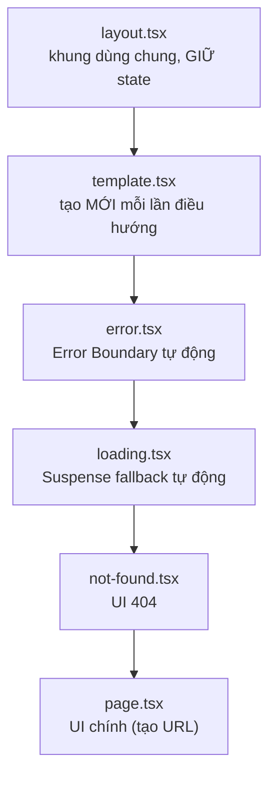

# Structuring Routes và API Endpoints

Bài này hướng dẫn cách tổ chức thư mục route sao cho gọn gàng và dễ bảo trì khi dự án lớn dần. Bạn sẽ làm quen với **co-location** (đặt các file liên quan cạnh nhau trong cùng thư mục route), **private folder** (thư mục bắt đầu bằng `_` không tạo URL) và **route handler** (file xử lý yêu cầu API ngay trong thư mục `app/`). Đây là nền tảng để xây dựng cả trang giao diện lẫn **API endpoint** (điểm cuối API — đường dẫn nhận và trả dữ liệu).

---

:::note[Ghi nhớ nhanh]

- ⭐ **Đặt đúng tên file đặc biệt là Next tự nối** — `layout.tsx`, `page.tsx`, `loading.tsx`, `error.tsx`, `not-found.tsx`, `template.tsx` được lồng tự động quanh `page.tsx`, giảm boilerplate.
- ⭐ **Route Handler `route.ts`** — tạo API endpoint bằng cách export hàm theo method (`GET`, `POST`, `PUT`, `DELETE`...); method không có handler tự trả `405`.
- **Co-location** — đặt component/util/type riêng cạnh route dùng nó để dễ tìm, dễ xoá; dùng chung nhiều nơi thì mới nâng lên `components/` gốc.
- **Private folder `_name`** — thư mục bắt đầu bằng `_` không tạo route, dùng chứa code helper.
- **Route handler dùng Web Standards** — `Request`/`Response` thay cho `req`/`res` cũ, chạy được cả Edge Runtime, dễ port và test.
- **Route Handler vs Server Action** — Route Handler cho API public/webhook/OAuth/stream; đa số mutation form trong app nên dùng Server Action vì gọn và type-safe.

:::

---

## Mục lục

- [Vì sao có quy ước file cho route?](#vì-sao-có-quy-ước-file-cho-route)
- [Folder structure tốt](#folder-structure-tốt)
- [Co-location](#co-location)
- [Private folder _name](#private-folder-_name)
- [Route Handlers (API)](#route-handlers-api)
- [Method handlers](#method-handlers)
- [Request và Response](#request-và-response)
- [Câu hỏi phỏng vấn](#câu-hỏi-phỏng-vấn)

---

## Vì sao có quy ước file cho route?

**Vấn đề:** Mỗi route thường cần nhiều thứ đi kèm: UI chính, layout dùng chung, trạng thái loading, xử lý lỗi, trang 404. Nếu tự dựng và nối thủ công thì code lặp và rất dễ quên một mảnh:

```tsx
// app/dashboard/page.tsx — phải tự nối mọi thứ bằng tay
export default function DashboardPage() {
  return (
    <ErrorBoundary fallback={<ErrorView />}>      {/* tự bọc lỗi */}
      <Suspense fallback={<Skeleton />}>          {/* tự bọc loading */}
        <SharedLayout>                            {/* tự lồng layout */}
          <DashboardContent />
        </SharedLayout>
      </Suspense>
    </ErrorBoundary>
  );
}
// → route nào cũng lặp lại boilerplate này, thiếu một lớp là vỡ
```

**Giải pháp:** Next.js dùng **quy ước tên file** đặc biệt trong thư mục route. Đặt đúng tên file là Next tự nối lại với nhau → ít boilerplate, nhất quán:

```tsx
// app/dashboard/
// ├── layout.tsx     → khung bao quanh, GIỮ state khi điều hướng giữa các trang con
// ├── page.tsx       → UI chính của route (cái duy nhất tạo URL)
// ├── loading.tsx    → Suspense fallback TỰ ĐỘNG khi page đang tải
// ├── error.tsx      → Error Boundary TỰ ĐỘNG bắt lỗi của route
// ├── not-found.tsx  → UI cho 404 (gọi notFound() hoặc route không khớp)
// └── template.tsx   → giống layout nhưng tạo MỚI mỗi lần điều hướng (reset state)

// page.tsx giờ chỉ cần lo UI — Next tự bọc layout/loading/error quanh nó
export default async function DashboardPage() {
  const data = await getDashboardData();
  return <DashboardContent data={data} />;
}
```

Thứ tự Next.js lồng các special file bao quanh `page.tsx` (ngoài cùng vào trong):



:::tip[Dùng thực tế]

- **`layout.tsx` dùng chung cho nhóm trang:** sidebar + navbar bọc mọi trang trong `dashboard/`, không re-render và giữ nguyên state khi chuyển qua lại giữa các trang con.
- **`loading.tsx` hiện skeleton tự động:** chỉ cần tạo file, Next bọc `<Suspense>` quanh `page.tsx` — người dùng thấy skeleton ngay trong lúc data fetch.
- **`error.tsx` bắt lỗi từng phần:** lỗi trong một route chỉ làm hỏng đúng vùng đó kèm nút "Thử lại", các phần còn lại của trang vẫn chạy bình thường.
- **`not-found.tsx` tuỳ biến 404:** trang "Không tìm thấy" riêng cho từng nhóm route (ví dụ 404 của khu blog khác 404 của khu shop).

:::

---

## Folder structure tốt

Pattern phổ biến — **organize theo feature**:

```
app/
├── (marketing)/
│   ├── layout.tsx
│   ├── page.tsx
│   └── pricing/page.tsx
│
├── (app)/
│   ├── layout.tsx
│   ├── dashboard/
│   │   ├── page.tsx
│   │   ├── _components/
│   │   │   ├── Chart.tsx
│   │   │   └── StatCard.tsx
│   │   └── _utils/
│   │       └── format.ts
│   └── settings/
│       ├── page.tsx
│       ├── account/page.tsx
│       └── billing/page.tsx
│
├── api/
│   └── users/
│       └── route.ts
│
└── layout.tsx
```

---

## Co-location

Đặt **component, util, type** liên quan **cạnh route** dùng nó:

```
app/dashboard/
├── page.tsx
├── components/
│   ├── Chart.tsx       # chỉ dùng ở dashboard
│   └── StatCard.tsx
├── utils/
│   └── format.ts
└── types.ts
```

Lợi ích:

- **Dễ tìm** — code nằm cạnh nơi dùng.
- **Easy to delete** — xoá folder = xoá feature.
- **Encapsulation** — không "leak" ra ngoài.

:::info[Phân tích]

**Phân biệt 3 nơi đặt code**:

| Vị trí | Khi nào |
|--------|---------|
| `app/feature/components/X.tsx` | Component **chỉ feature đó** dùng |
| `components/X.tsx` (root) | Component **dùng ở nhiều feature** |
| `components/ui/Button.tsx` | Design system primitive |

Pattern shadcn/ui:

```
app/
├── dashboard/
│   ├── page.tsx
│   └── components/StatCard.tsx
│
components/
├── ui/                  # shadcn copy-paste
│   ├── button.tsx
│   ├── card.tsx
│   └── dialog.tsx
└── shared/              # custom component shared
    └── PageHeader.tsx
```

Refactor pattern khi component được dùng ở nơi thứ 2 → **move lên root**
`components/`. Không cố giữ trong feature folder.

:::

---

## Private folder _name

Folder bắt đầu bằng `_` → **không được Next.js coi là route**:

```
app/
├── _components/         # private, không route
├── _utils/              # private
└── dashboard/
    └── page.tsx
```

`_components` và `_utils` chứa code helper. Folder thường (`components/`)
**cũng không tạo route** trừ khi có `page.tsx` — nhưng `_` là rõ ý đồ
hơn.

---

## Route Handlers (API)

Tạo API endpoint trong App Router — file `route.ts`:

```ts
// app/api/users/route.ts
export async function GET() {
  const users = await db.user.findMany();
  return Response.json(users);
}

export async function POST(request: Request) {
  const body = await request.json();
  const user = await db.user.create({ data: body });
  return Response.json(user, { status: 201 });
}
```

Endpoint:

- `GET /api/users` → list users.
- `POST /api/users` → create.

Dynamic API:

```ts
// app/api/users/[id]/route.ts
export async function GET(
  request: Request,
  { params }: { params: Promise<{ id: string }> }
) {
  const { id } = await params;
  const user = await db.user.findUnique({ where: { id } });

  if (!user) {
    return Response.json({ error: "Not found" }, { status: 404 });
  }
  return Response.json(user);
}
```

---

## Method handlers

Export function tương ứng method:

```ts
// app/api/users/route.ts
export async function GET()    { /* ... */ }
export async function POST()   { /* ... */ }
export async function PUT()    { /* ... */ }
export async function PATCH()  { /* ... */ }
export async function DELETE() { /* ... */ }
export async function HEAD()   { /* ... */ }
export async function OPTIONS(){ /* ... */ }
```

Method nào không có handler → Next.js trả `405 Method Not Allowed` tự động.

---

## Request và Response

Route handler dùng **Web Standards** API:

```ts
export async function POST(request: Request) {
  // Read body
  const json = await request.json();
  const text = await request.text();
  const formData = await request.formData();

  // Headers
  const auth = request.headers.get("Authorization");

  // URL & query
  const url = new URL(request.url);
  const id = url.searchParams.get("id");

  // Cookies
  const cookies = request.headers.get("Cookie");

  return Response.json({ ok: true });
}
```

`Response` API:

```ts
// JSON
Response.json({ data });

// Text
new Response("Hello", { headers: { "Content-Type": "text/plain" } });

// Stream
const stream = new ReadableStream({ ... });
new Response(stream);

// Redirect
Response.redirect("/login", 302);

// Status + headers
Response.json(
  { error: "Forbidden" },
  { status: 403, headers: { "X-Custom": "..." } }
);
```

:::info[Phân tích]

**Next.js Web Standards** vs **Node API cũ**:

| Cũ (Pages Router API) | Mới (App Router Route Handler) |
|----------------------|--------------------------------|
| `req.body` (parsed) | `await request.json()` |
| `req.query` | `new URL(req.url).searchParams` |
| `res.status(200).json({})` | `Response.json({}, { status: 200 })` |
| `res.setHeader(...)` | `Response(..., { headers })` |

Lợi ích Web Standards:

- **Tương thích Edge Runtime** — không cần Node.
- **Portable** — code chạy được trên Bun, Deno, Cloudflare Workers, Vercel Edge.
- **Streaming native** — `ReadableStream` standard.
- **Test dễ** — không cần mock Node API.

→ Đây là direction của toàn web ecosystem — Hono, Bun, Deno đều dùng
Web Standards.

:::

:::tip[Mẹo]

**Pattern wrapper cho API route**:

```ts
// lib/api.ts
export async function withAuth<T>(
  request: Request,
  handler: (user: User) => Promise<T>
): Promise<Response> {
  try {
    const token = request.headers.get("Authorization")?.replace("Bearer ", "");
    if (!token) return Response.json({ error: "Unauthorized" }, { status: 401 });

    const user = await verifyToken(token);
    const result = await handler(user);
    return Response.json(result);
  } catch (err) {
    return Response.json({ error: err.message }, { status: 500 });
  }
}
```

```ts
// app/api/profile/route.ts
import { withAuth } from "@/lib/api";

export async function GET(request: Request) {
  return withAuth(request, async (user) => {
    return await db.user.findUnique({ where: { id: user.id } });
  });
}
```

Auth + error handling trung tâm → mọi route ngắn, consistent.

:::

:::warning[Cần lưu ý]

**Route Handler vs Server Action — khi nào dùng cái nào?**

| | Route Handler | Server Action |
|--|---------------|---------------|
| Use case | API public, third-party | Form mutation từ component |
| Public? | **Có** (URL accessible) | Không (internal RPC) |
| Method | GET, POST, PUT, DELETE... | POST only |
| Schema validation | Tự làm | Tự làm (Zod) |
| Type-safe | Phải khai báo client | **Tự động** từ function |

→ Server Actions thay thế cho **CRUD trong app**. Route Handler cần khi:

- **API public** cho client khác (mobile, third-party).
- **Webhook receiver**.
- **OAuth callback**.
- **Stream**, **SSE**, **file upload** đặc biệt.

Trong App Router, đa số mutation form đi qua Server Action — gọn hơn,
type-safe.

:::

---

## Câu hỏi phỏng vấn

Những câu thường gặp về chủ đề này. Tự trả lời trước, rồi đối chiếu lại với nội dung phía trên.

1. `co-location` là gì? Đặt component và util cạnh route dùng nó mang lại lợi ích cụ thể nào?
2. Khi nào một component nên được nâng từ thư mục feature lên `components/` ở gốc? Tiêu chí quyết định là gì?
3. Một thư mục thường trong `app/` có tự tạo route không? `_folder` khác gì so với thư mục thường?
4. Vì sao chỉ `page.tsx` (hoặc `route.ts`) mới làm cho một segment trở nên truy cập được qua URL?
5. Cách tạo API endpoint bằng `route.ts` — bạn export những gì để xử lý `GET` và `POST`?
6. Nếu client gọi một HTTP method chưa có handler tương ứng thì Next.js phản hồi thế nào?
7. Route handler đọc body, query string và header ra sao? So sánh với `req.body` và `req.query` của `Pages Router`.
8. Vì sao chuyển sang Web Standards `Request`/`Response` lại quan trọng cho Edge Runtime, tính portable và khả năng test?
9. Route handler động `app/api/users/[id]/route.ts` nhận `params` như thế nào và cần lưu ý gì ở Next.js 15?
10. `Route Handler` và `Server Action` khác nhau ở những điểm nào? Trường hợp nào bắt buộc phải dùng Route Handler?
11. Server Action có an toàn hơn Route Handler không? Bạn validate input và kiểm soát quyền truy cập ra sao?
12. Làm sao tập trung xử lý authentication và error cho nhiều route handler mà không lặp code ở từng file?
13. Route handler có được cache không? Điều gì khiến một handler `GET` chuyển thành dynamic?
14. Nhận webhook từ bên thứ ba (Stripe, GitHub) trong route handler cần lưu ý gì về body thô, chữ ký và idempotency?
15. Với một app lớn, bạn tổ chức thư mục theo feature hay theo loại file? Hãy lập luận và mô tả cấu trúc bạn đề xuất.
