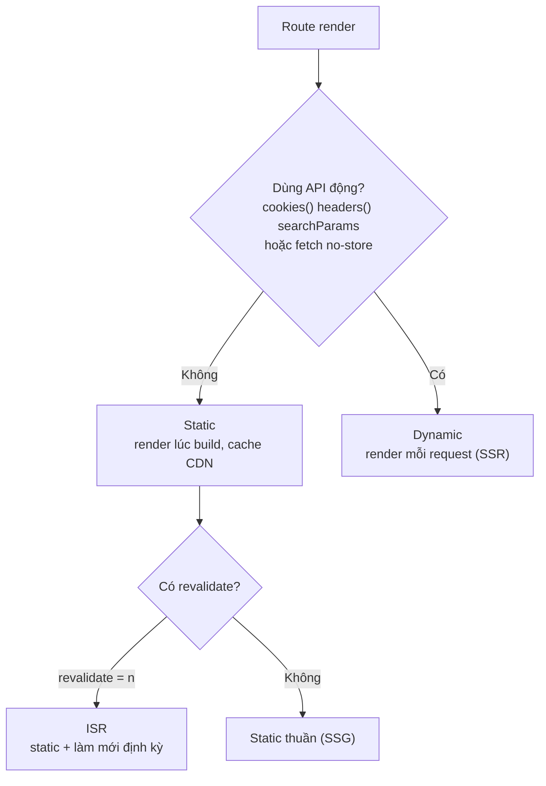
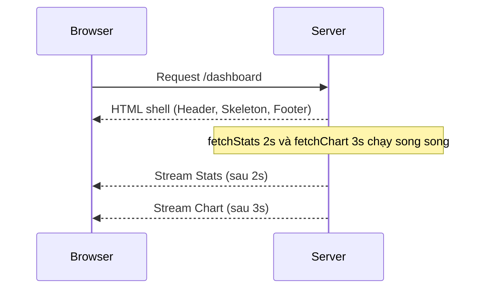

# Static vs Dynamic, Streaming, Redirects

Trong Next.js, mỗi route có thể được render **tĩnh** (static — dựng sẵn HTML lúc build, phục vụ nhanh cho mọi người dùng) hoặc **động** (dynamic — dựng lại theo từng request khi cần dữ liệu thay đổi liên tục). Bài này cũng giới thiệu **streaming** (gửi từng phần giao diện về trình duyệt ngay khi sẵn sàng thay vì đợi toàn bộ) và **redirect** (chuyển hướng người dùng sang URL khác). Hiểu các khái niệm này giúp bạn cân bằng giữa tốc độ và độ tươi mới của dữ liệu.

---

:::note[Ghi nhớ nhanh]

- ⭐ **Next.js tự detect static hay dynamic** — dùng API động (`cookies()`, `headers()`, `searchParams`, `fetch` với `no-store`) sẽ thành dynamic (render mỗi request); còn lại là static (build sẵn, cache CDN).
- ⭐ **Streaming qua `<Suspense>`** — bọc phần data nặng để gửi HTML shell trước rồi stream từng phần; các phần chạy song song nên tổng thời gian bằng phần chậm nhất.
- **Ép kiểu render** — `export const dynamic = "force-static" | "force-dynamic"`, `revalidate` cho ISR, `runtime = "edge" | "nodejs"`; đa số nên để tự detect.
- **`loading.tsx`** tương đương bọc `<Suspense>` quanh cả page ở mức navigation.
- **`redirect()` thực chất throw** `NEXT_REDIRECT` — không cần try/catch, đặt ngoài khối try hoặc rethrow khi bắt lỗi.
- **Rewrite khác redirect** — rewrite giữ nguyên URL nhưng serve nội dung từ đích khác (proxy API, A/B test); redirect đổi URL hiển thị.

:::

---

## Mục lục

- [Vì sao phân biệt route tĩnh và động?](#vì-sao-phân-biệt-route-tĩnh-và-động)
- [Static vs Dynamic](#static-vs-dynamic)
- [Force static / dynamic](#force-static--dynamic)
- [Streaming với Suspense](#streaming-với-suspense)
- [Redirects](#redirects)
- [Rewrites](#rewrites)
- [Câu hỏi phỏng vấn](#câu-hỏi-phỏng-vấn)

---

## Vì sao phân biệt route tĩnh và động?

**Vấn đề:** Không phải trang nào cũng giống nhau. Trang nội dung cố định (about, blog) có thể dựng **sẵn một lần** để phục vụ siêu nhanh và cache trên CDN. Nhưng trang phụ thuộc vào request (cookie, search params, dữ liệu thay đổi liên tục) thì **phải render lúc chạy**. Nếu xử lý đồng nhất cho cả hai sẽ vừa chậm vừa sai dữ liệu.

```tsx
// Cùng một cách render cho mọi trang → sai
// Trang giỏ hàng cache sẵn → user A thấy giỏ hàng của user B (sai)
// Trang about render lại mỗi request → chậm vô ích
export default async function Page() {
  const data = await fetch("..."); // không rõ static hay dynamic?
  return <div>{/* ... */}</div>;
}
```

**Giải pháp:** Next.js **tự quyết định** static (render lúc build, cache CDN) hay dynamic (render mỗi request) dựa vào cách bạn dùng API động (`cookies()`, `headers()`, `searchParams`, `fetch` với `no-store`) hoặc cấu hình (`dynamic`, `revalidate`). Hiểu cơ chế này để chủ động tối ưu.

```tsx
// Static — không dùng API động → cache CDN, siêu nhanh
export default async function AboutPage() {
  const data = await fetch("https://api.example.com/about");
  return <div>{/* ... */}</div>;
}

// Dynamic — dùng cookies() → render mỗi request
import { cookies } from "next/headers";

export default async function CartPage() {
  const cart = (await cookies()).get("cart");
  return <div>{/* ... */}</div>;
}
```

:::tip[Dùng thực tế]

- **Blog, landing page**: để static — dựng sẵn, cache CDN, tải tức thì.
- **Giỏ hàng, trang cá nhân hoá**: dynamic — render theo từng người dùng.
- **Cần dữ liệu luôn mới**: ép động bằng `fetch(url, { cache: "no-store" })`.
- **Trang sản phẩm**: dùng ISR (`revalidate = 60`) — static nhưng tự làm mới định kỳ.

:::

---

## Static vs Dynamic

Next.js **tự detect** mỗi route là static hay dynamic dựa vào feature
page dùng:

| Page dùng | Kết quả |
|-----------|---------|
| Chỉ static fetch (`fetch()` không option) | **Static** |
| `fetch()` với `cache: "no-store"` | **Dynamic** |
| `cookies()`, `headers()` | **Dynamic** |
| `searchParams` prop | **Dynamic** |
| `params` đơn thuần | **Static** (với `generateStaticParams`) |

Cây quyết định Next.js dùng để chọn kiểu render cho một route:



Build report:

```
○ /                           Static
○ /about                      Static
ƒ /dashboard                  Dynamic
● /blog/[slug]                ISR (revalidate 60s)
```

---

## Force static / dynamic

Export config từ page/layout/route:

```tsx
// Force static
export const dynamic = "force-static";

// Force dynamic
export const dynamic = "force-dynamic";

// Default — Next.js detect
export const dynamic = "auto";

// Error nếu detect không khớp expectation
export const dynamic = "error";
```

Revalidate time:

```tsx
export const revalidate = 60; // revalidate every 60s
// hoặc
export const revalidate = 0;  // no cache (dynamic)
// hoặc
export const revalidate = false; // cache forever
```

Force runtime:

```tsx
export const runtime = "nodejs";  // default
export const runtime = "edge";    // Edge Runtime
```

:::info[Phân tích]

**Khi nào cần force?**

- **`force-static`**: page chỉ dùng external API nhưng muốn cache build time.
- **`force-dynamic`**: page có data thay đổi mỗi request nhưng chưa dùng
  dynamic API.

Đa số trường hợp: **để Next.js tự detect**. Force chỉ khi đặc biệt.

Cẩn thận: nếu code dùng `cookies()` nhưng `dynamic = "force-static"` →
**build error**. Khai báo đúng với code thực tế.

:::

---

## Streaming với Suspense

Page có data nặng → **stream** dần, không đợi hết mới render:

```tsx
// app/dashboard/page.tsx
import { Suspense } from "react";

export default function Dashboard() {
  return (
    <div>
      <Header />

      <Suspense fallback={<StatsSkeleton />}>
        <Stats />  {/* slow data */}
      </Suspense>

      <Suspense fallback={<ChartSkeleton />}>
        <Chart />  {/* slow data khác */}
      </Suspense>

      <Footer />
    </div>
  );
}

async function Stats() {
  const stats = await fetchStats(); // await 2s
  return <StatsCard stats={stats} />;
}

async function Chart() {
  const data = await fetchChart(); // await 3s
  return <ChartView data={data} />;
}
```

Flow:

1. Browser nhận HTML ngay: Header + skeleton + Footer.
2. Server tiếp tục stream `Stats` khi `fetchStats()` resolve.
3. Server stream `Chart` khi `fetchChart()` resolve.
4. Stats và Chart load **song song** — total = max(2s, 3s) = 3s.

So với không Suspense — phải đợi cả 2s + 3s = 5s.

Luồng stream từng phần giao diện về trình duyệt:



:::tip[Mẹo]

**`loading.tsx` = Suspense wrap page**:

```tsx
// app/dashboard/loading.tsx
export default function Loading() {
  return <PageSkeleton />;
}

// Equivalent
<Suspense fallback={<PageSkeleton />}>
  <DashboardPage />
</Suspense>
```

Loading.tsx ở page level. Suspense thủ công cho **section trong page** —
combine cả hai cho UX tốt:

```tsx
// app/dashboard/page.tsx
export default function Dashboard() {
  return (
    <>
      <PageHeader />  {/* render ngay với layout */}

      <Suspense fallback={<StatsSkeleton />}>
        <Stats />
      </Suspense>

      <Suspense fallback={<ChartSkeleton />}>
        <Chart />
      </Suspense>
    </>
  );
}
```

- `loading.tsx` show khi navigation đến page.
- Sau khi page mount → Suspense con stream từng section.

:::

---

## Redirects

**Server-side redirect** trong component/route handler:

```ts
import { redirect } from "next/navigation";

export default async function ProfilePage() {
  const user = await getCurrentUser();
  if (!user) redirect("/login");

  return <div>{user.name}</div>;
}
```

**Permanent redirect**:

```ts
import { permanentRedirect } from "next/navigation";
permanentRedirect("/new-url"); // 308
```

**Config-based redirect** — `next.config.ts`:

```ts
export default {
  redirects: async () => [
    {
      source: "/old-blog/:slug",
      destination: "/blog/:slug",
      permanent: true,
    },
    {
      source: "/admin",
      destination: "/dashboard",
      permanent: false,
      has: [{ type: "cookie", key: "role", value: "admin" }],
    },
  ],
};
```

**Client-side navigation**:

```tsx
"use client";
import { useRouter } from "next/navigation";

function Button() {
  const router = useRouter();
  return <button onClick={() => router.push("/dashboard")}>Go</button>;
}
```

:::warning[Cần lưu ý]

**`redirect()` throw error** — nó không return:

```ts
async function action() {
  await save();
  redirect("/success"); // throw NEXT_REDIRECT internally
  console.log("không bao giờ chạy"); // unreachable
}
```

→ Không cần wrap try/catch cho `redirect()`. Đặt **ngoài try/catch**:

```ts
try {
  await dangerous();
} catch (err) {
  // handle error
}
redirect("/done"); // ngoài try/catch
```

Hoặc throw mới ra để `redirect` bubble:

```ts
try {
  await dangerous();
  redirect("/done");
} catch (err) {
  if (isRedirectError(err)) throw err; // rethrow
  // handle err thật
}
```

:::

---

## Rewrites

Rewrite **giữ URL** nhưng serve từ destination khác:

```ts
// next.config.ts
export default {
  rewrites: async () => [
    {
      source: "/about",
      destination: "/about-us",
    },
    {
      source: "/api/proxy/:path*",
      destination: "https://external-api.com/:path*",
    },
  ],
};
```

Khác **redirect**:

- **Redirect** — browser navigate URL mới, URL hiển thị thay đổi.
- **Rewrite** — server serve content từ destination, URL **không đổi**.

Use case rewrite:

- **Proxy API** — frontend gọi `/api/x`, Next.js rewrite về backend khác.
- **A/B test** — serve 2 version cùng URL.
- **SEO migration** — content ở `/new-path` nhưng vẫn ở URL `/old-path`.

:::info[Phân tích]

**Headers config** — set HTTP headers:

```ts
// next.config.ts
export default {
  headers: async () => [
    {
      source: "/(.*)",
      headers: [
        { key: "X-Frame-Options", value: "DENY" },
        { key: "X-Content-Type-Options", value: "nosniff" },
        { key: "Referrer-Policy", value: "strict-origin-when-cross-origin" },
      ],
    },
    {
      source: "/api/:path*",
      headers: [
        { key: "Access-Control-Allow-Origin", value: "*" },
      ],
    },
  ],
};
```

Pattern này cho **security header** chung cho mọi route.

Mạnh hơn `<meta>` tag — server-side, áp dụng cho mọi response (kể cả
asset).

:::

---

## Câu hỏi phỏng vấn

Những câu thường gặp về chủ đề này. Tự trả lời trước, rồi đối chiếu lại với nội dung phía trên.

1. Phân biệt `static rendering` và `dynamic rendering` trong Next.js: mỗi kiểu render lúc nào, HTML được tạo ra ở đâu và cache ở đâu?
2. Next.js dựa vào đâu để **tự động** quyết định một route là static hay dynamic? Kể các API/tình huống làm route bị chuyển sang dynamic.
3. Vì sao chỉ cần gọi `cookies()` hay `headers()` trong một component là cả route bị đẩy sang dynamic? Điều đó ảnh hưởng gì tới CDN cache?
4. `fetch(url)` mặc định, `fetch(url, { cache: "no-store" })` và `export const revalidate = 60` khác nhau thế nào về kết quả render?
5. `ISR` (Incremental Static Regeneration) hoạt động ra sao? Người dùng đầu tiên sau khi hết hạn `revalidate` nhìn thấy dữ liệu cũ hay mới?
6. Giải thích 4 giá trị của `export const dynamic`: `auto`, `force-static`, `force-dynamic`, `error`. Khi nào bạn thực sự cần ép thay vì để tự detect?
7. Điều gì xảy ra nếu code dùng `cookies()` nhưng route lại khai báo `dynamic = "force-static"`? Bạn xử lý thế nào?
8. `streaming` với `<Suspense>` hoạt động ra sao ở tầng HTTP? Vì sao nó cải thiện `TTFB` và cảm nhận tốc độ của người dùng?
9. Có 2 khối dữ liệu chậm 2s và 3s trong cùng một page: đặt chúng trong 2 `<Suspense>` riêng so với không dùng `<Suspense>` thì tổng thời gian khác nhau thế nào và vì sao?
10. `loading.tsx` khác gì với việc bọc `<Suspense>` thủ công quanh từng section? Khi nào nên dùng cả hai cùng lúc?
11. Đặt `<Suspense>` sai chỗ có thể gây hại gì (ví dụ layout shift, fallback nhấp nháy, hoặc không stream được)? Bạn chọn ranh giới `Suspense` theo tiêu chí nào?
12. So sánh `redirect()` và `permanentRedirect()` của `next/navigation`, và mã trạng thái HTTP tương ứng.
13. Vì sao `redirect()` không cần `return` và code sau nó không chạy? Đặt `redirect()` trong khối `try/catch` gây lỗi gì và cách khắc phục?
14. So sánh `redirect` và `rewrite`: URL trên thanh địa chỉ, số lần round-trip, và use case điển hình của từng loại.
15. Khi nào bạn cấu hình `redirects`/`rewrites` trong `next.config.ts` thay vì gọi `redirect()` trong component, và ngược lại?
16. Set security header (`X-Frame-Options`, `Content-Security-Policy`...) qua `headers` trong `next.config.ts` có lợi gì so với dùng thẻ `meta` trong HTML?
17. `export const runtime = "edge"` ảnh hưởng gì tới khả năng render static/dynamic và tới những API bạn được dùng trong route?
18. Một trang sản phẩm e-commerce cần vừa nhanh vừa có giá cập nhật gần thời gian thực: bạn chọn chiến lược render nào và giải thích trade-off?
