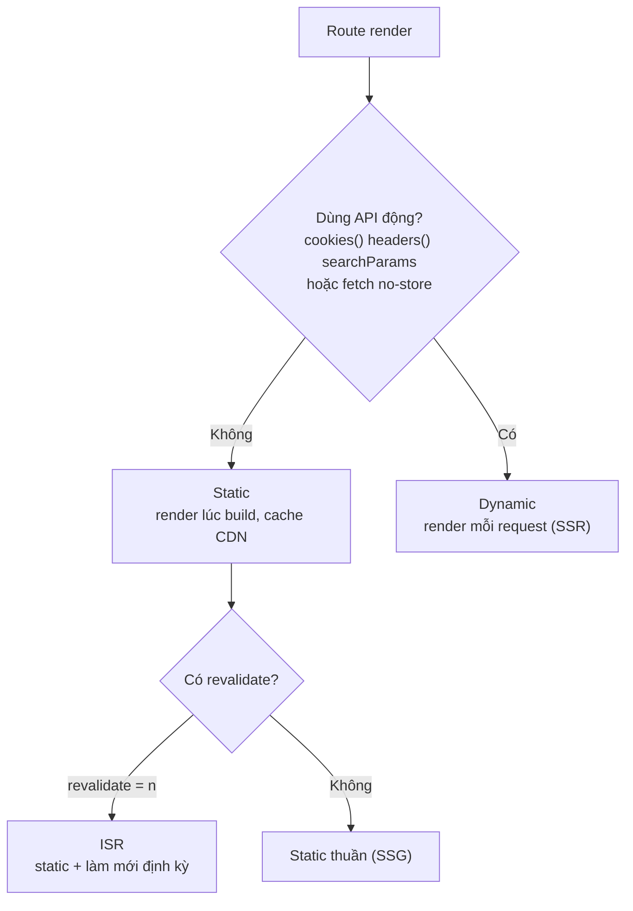
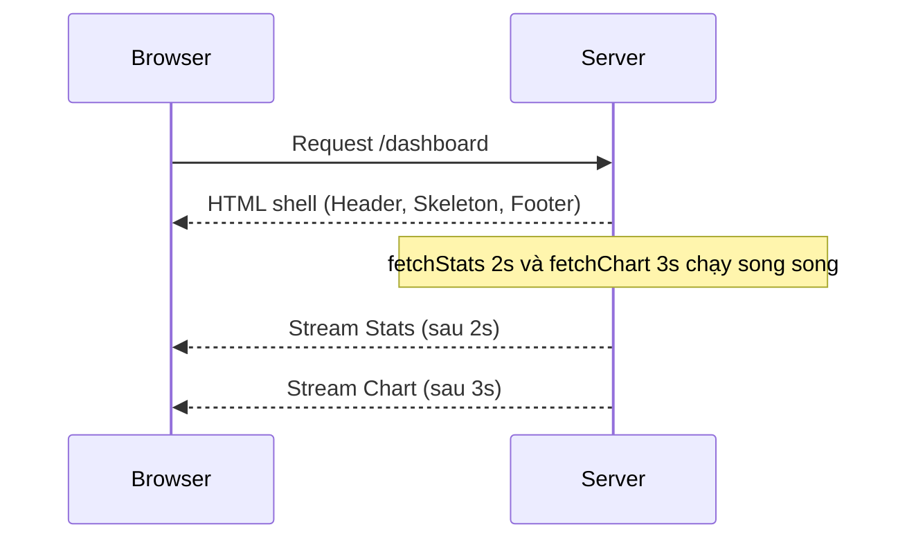

# Static vs Dynamic, Streaming, Redirects

Trong Next.js, mỗi route có thể được render **tĩnh** (static — dựng sẵn HTML lúc build, phục vụ nhanh cho mọi người dùng) hoặc **động** (dynamic — dựng lại theo từng request khi cần dữ liệu thay đổi liên tục). Bài này cũng giới thiệu **streaming** (gửi từng phần giao diện về trình duyệt ngay khi sẵn sàng thay vì đợi toàn bộ) và **redirect** (chuyển hướng người dùng sang URL khác). Hiểu các khái niệm này giúp bạn cân bằng giữa tốc độ và độ tươi mới của dữ liệu.

[](pathname:///img/nextjs/static-vs-dynamic.webp)

---

:::note[Ghi nhớ nhanh]

- ⭐ **Next.js tự detect static hay dynamic** — dùng API động (`cookies()`, `headers()`, `searchParams`, `fetch` với `no-store`) sẽ thành dynamic (render mỗi request); còn lại là static (build sẵn, cache CDN).
- ⭐ **Streaming qua `<Suspense>`** — bọc phần data nặng để gửi HTML shell trước rồi stream từng phần; các phần chạy song song nên tổng thời gian bằng phần chậm nhất.
- **Ép kiểu render** — `export const dynamic = "force-static" | "force-dynamic"`, `revalidate` cho ISR, `runtime = "edge" | "nodejs"`; đa số nên để tự detect.
- **`loading.tsx`** tương đương bọc `<Suspense>` quanh cả page ở mức navigation.
- **`redirect()` thực chất throw** `NEXT_REDIRECT` — không cần try/catch, đặt ngoài khối try hoặc rethrow khi bắt lỗi.
- **Rewrite khác redirect** — rewrite giữ nguyên URL nhưng serve nội dung từ đích khác (proxy API, A/B test); redirect đổi URL hiển thị.

:::

---

## Mục lục

- [Vì sao phân biệt route tĩnh và động?](#vì-sao-phân-biệt-route-tĩnh-và-động)
- [Static vs Dynamic](#static-vs-dynamic)
- [Force static / dynamic](#force-static--dynamic)
- [Streaming với Suspense](#streaming-với-suspense)
- [Redirects](#redirects)
- [Rewrites](#rewrites)
- [Câu hỏi phỏng vấn](#câu-hỏi-phỏng-vấn)

---

## Vì sao phân biệt route tĩnh và động?

**Vấn đề:** Không phải trang nào cũng giống nhau. Trang nội dung cố định (about, blog) có thể dựng **sẵn một lần** để phục vụ siêu nhanh và cache trên CDN. Nhưng trang phụ thuộc vào request (cookie, search params, dữ liệu thay đổi liên tục) thì **phải render lúc chạy**. Nếu xử lý đồng nhất cho cả hai sẽ vừa chậm vừa sai dữ liệu.

```tsx
// Cùng một cách render cho mọi trang → sai
// Trang giỏ hàng cache sẵn → user A thấy giỏ hàng của user B (sai)
// Trang about render lại mỗi request → chậm vô ích
export default async function Page() {
  const data = await fetch("..."); // không rõ static hay dynamic?
  return <div>{/* ... */}</div>;
}
```

**Giải pháp:** Next.js **tự quyết định** static (render lúc build, cache CDN) hay dynamic (render mỗi request) dựa vào cách bạn dùng API động (`cookies()`, `headers()`, `searchParams`, `fetch` với `no-store`) hoặc cấu hình (`dynamic`, `revalidate`). Hiểu cơ chế này để chủ động tối ưu.

```tsx
// Static — không dùng API động → cache CDN, siêu nhanh
export default async function AboutPage() {
  const data = await fetch("https://api.example.com/about");
  return <div>{/* ... */}</div>;
}

// Dynamic — dùng cookies() → render mỗi request
import { cookies } from "next/headers";

export default async function CartPage() {
  const cart = (await cookies()).get("cart");
  return <div>{/* ... */}</div>;
}
```

:::tip[Dùng thực tế]

- **Blog, landing page**: để static — dựng sẵn, cache CDN, tải tức thì.
- **Giỏ hàng, trang cá nhân hoá**: dynamic — render theo từng người dùng.
- **Cần dữ liệu luôn mới**: ép động bằng `fetch(url, { cache: "no-store" })`.
- **Trang sản phẩm**: dùng ISR (`revalidate = 60`) — static nhưng tự làm mới định kỳ.

:::

---

## Static vs Dynamic

Next.js **tự detect** mỗi route là static hay dynamic dựa vào feature
page dùng:

| Page dùng | Kết quả |
|-----------|---------|
| Chỉ static fetch (`fetch()` không option) | **Static** |
| `fetch()` với `cache: "no-store"` | **Dynamic** |
| `cookies()`, `headers()` | **Dynamic** |
| `searchParams` prop | **Dynamic** |
| `params` đơn thuần | **Static** (với `generateStaticParams`) |

Cây quyết định Next.js dùng để chọn kiểu render cho một route:



Build report:

```
○ /                           Static
○ /about                      Static
ƒ /dashboard                  Dynamic
● /blog/[slug]                ISR (revalidate 60s)
```

---

## Force static / dynamic

Export config từ page/layout/route:

```tsx
// Force static
export const dynamic = "force-static";

// Force dynamic
export const dynamic = "force-dynamic";

// Default — Next.js detect
export const dynamic = "auto";

// Error nếu detect không khớp expectation
export const dynamic = "error";
```

Revalidate time:

```tsx
export const revalidate = 60; // revalidate every 60s
// hoặc
export const revalidate = 0;  // no cache (dynamic)
// hoặc
export const revalidate = false; // cache forever
```

Force runtime:

```tsx
export const runtime = "nodejs";  // default
export const runtime = "edge";    // Edge Runtime
```

:::info[Phân tích]

**Khi nào cần force?**

- **`force-static`**: page chỉ dùng external API nhưng muốn cache build time.
- **`force-dynamic`**: page có data thay đổi mỗi request nhưng chưa dùng
  dynamic API.

Đa số trường hợp: **để Next.js tự detect**. Force chỉ khi đặc biệt.

Cẩn thận: nếu code dùng `cookies()` nhưng `dynamic = "force-static"` →
**build error**. Khai báo đúng với code thực tế.

:::

---

## Streaming với Suspense

Page có data nặng → **stream** dần, không đợi hết mới render:

```tsx
// app/dashboard/page.tsx
import { Suspense } from "react";

export default function Dashboard() {
  return (
    <div>
      <Header />

      <Suspense fallback={<StatsSkeleton />}>
        <Stats />  {/* slow data */}
      </Suspense>

      <Suspense fallback={<ChartSkeleton />}>
        <Chart />  {/* slow data khác */}
      </Suspense>

      <Footer />
    </div>
  );
}

async function Stats() {
  const stats = await fetchStats(); // await 2s
  return <StatsCard stats={stats} />;
}

async function Chart() {
  const data = await fetchChart(); // await 3s
  return <ChartView data={data} />;
}
```

Flow:

1. Browser nhận HTML ngay: Header + skeleton + Footer.
2. Server tiếp tục stream `Stats` khi `fetchStats()` resolve.
3. Server stream `Chart` khi `fetchChart()` resolve.
4. Stats và Chart load **song song** — total = max(2s, 3s) = 3s.

So với không Suspense — phải đợi cả 2s + 3s = 5s.

Luồng stream từng phần giao diện về trình duyệt:



:::tip[Mẹo]

**`loading.tsx` = Suspense wrap page**:

```tsx
// app/dashboard/loading.tsx
export default function Loading() {
  return <PageSkeleton />;
}

// Equivalent
<Suspense fallback={<PageSkeleton />}>
  <DashboardPage />
</Suspense>
```

Loading.tsx ở page level. Suspense thủ công cho **section trong page** —
combine cả hai cho UX tốt:

```tsx
// app/dashboard/page.tsx
export default function Dashboard() {
  return (
    <>
      <PageHeader />  {/* render ngay với layout */}

      <Suspense fallback={<StatsSkeleton />}>
        <Stats />
      </Suspense>

      <Suspense fallback={<ChartSkeleton />}>
        <Chart />
      </Suspense>
    </>
  );
}
```

- `loading.tsx` show khi navigation đến page.
- Sau khi page mount → Suspense con stream từng section.

:::

---

## Redirects

**Server-side redirect** trong component/route handler:

```ts
import { redirect } from "next/navigation";

export default async function ProfilePage() {
  const user = await getCurrentUser();
  if (!user) redirect("/login");

  return <div>{user.name}</div>;
}
```

**Permanent redirect**:

```ts
import { permanentRedirect } from "next/navigation";
permanentRedirect("/new-url"); // 308
```

**Config-based redirect** — `next.config.ts`:

```ts
export default {
  redirects: async () => [
    {
      source: "/old-blog/:slug",
      destination: "/blog/:slug",
      permanent: true,
    },
    {
      source: "/admin",
      destination: "/dashboard",
      permanent: false,
      has: [{ type: "cookie", key: "role", value: "admin" }],
    },
  ],
};
```

**Client-side navigation**:

```tsx
"use client";
import { useRouter } from "next/navigation";

function Button() {
  const router = useRouter();
  return <button onClick={() => router.push("/dashboard")}>Go</button>;
}
```

:::warning[Cần lưu ý]

**`redirect()` throw error** — nó không return:

```ts
async function action() {
  await save();
  redirect("/success"); // throw NEXT_REDIRECT internally
  console.log("không bao giờ chạy"); // unreachable
}
```

→ Không cần wrap try/catch cho `redirect()`. Đặt **ngoài try/catch**:

```ts
try {
  await dangerous();
} catch (err) {
  // handle error
}
redirect("/done"); // ngoài try/catch
```

Hoặc throw mới ra để `redirect` bubble:

```ts
try {
  await dangerous();
  redirect("/done");
} catch (err) {
  if (isRedirectError(err)) throw err; // rethrow
  // handle err thật
}
```

:::

---

## Rewrites

Rewrite **giữ URL** nhưng serve từ destination khác:

```ts
// next.config.ts
export default {
  rewrites: async () => [
    {
      source: "/about",
      destination: "/about-us",
    },
    {
      source: "/api/proxy/:path*",
      destination: "https://external-api.com/:path*",
    },
  ],
};
```

Khác **redirect**:

- **Redirect** — browser navigate URL mới, URL hiển thị thay đổi.
- **Rewrite** — server serve content từ destination, URL **không đổi**.

Use case rewrite:

- **Proxy API** — frontend gọi `/api/x`, Next.js rewrite về backend khác.
- **A/B test** — serve 2 version cùng URL.
- **SEO migration** — content ở `/new-path` nhưng vẫn ở URL `/old-path`.

:::info[Phân tích]

**Headers config** — set HTTP headers:

```ts
// next.config.ts
export default {
  headers: async () => [
    {
      source: "/(.*)",
      headers: [
        { key: "X-Frame-Options", value: "DENY" },
        { key: "X-Content-Type-Options", value: "nosniff" },
        { key: "Referrer-Policy", value: "strict-origin-when-cross-origin" },
      ],
    },
    {
      source: "/api/:path*",
      headers: [
        { key: "Access-Control-Allow-Origin", value: "*" },
      ],
    },
  ],
};
```

Pattern này cho **security header** chung cho mọi route.

Mạnh hơn `<meta>` tag — server-side, áp dụng cho mọi response (kể cả
asset).

:::

---

## Câu hỏi phỏng vấn

Những câu thường gặp về chủ đề này. Tự trả lời trước, rồi bấm **Xem đáp án** để đối chiếu.

**1. Phân biệt `static rendering` và `dynamic rendering` trong Next.js: mỗi kiểu render lúc nào, HTML được tạo ra ở đâu và cache ở đâu?**

<details className="qa">
<summary>Xem đáp án</summary>

| | Static rendering | Dynamic rendering |
|---|---|---|
| Render lúc nào | lúc **build** (hoặc lúc revalidate) | lúc **mỗi request** |
| HTML tạo ở đâu | máy build, một lần cho mọi người | server, riêng cho từng request |
| Cache ở đâu | CDN / edge, phục vụ ngay | không cache chung được |
| Tốc độ | nhanh nhất, gần như tức thì | chậm hơn, phụ thuộc thời gian fetch |
| Dùng cho | landing page, blog, tài liệu | giỏ hàng, dashboard, trang cá nhân hoá |

Điểm mấu chốt: static nghĩa là **một bản HTML dùng chung cho tất cả mọi người**, nên mới cache được trên CDN. Khi nội dung phụ thuộc vào người đang xem (cookie, header, query string) thì không thể dùng chung, buộc phải render lại theo từng request.

Trong build report bạn thấy ký hiệu phân biệt: `○` cho static, `ƒ` cho dynamic, `●` cho ISR. Đây là chỗ đầu tiên nên kiểm tra khi nghi ngờ một trang bị rơi sang dynamic ngoài ý muốn.

</details>

**2. Next.js dựa vào đâu để tự động quyết định một route là static hay dynamic? Kể các API/tình huống làm route bị chuyển sang dynamic.**

<details className="qa">
<summary>Xem đáp án</summary>

Next.js **không bắt bạn khai báo** — nó nhìn vào code xem route có dùng thứ gì phụ thuộc request hay không. Không dùng gì thì mặc định là static.

Những thứ đẩy route sang **dynamic**:

- `cookies()` và `headers()` từ `next/headers`.
- Đọc prop `searchParams` của page.
- `fetch(url, { cache: "no-store" })`.
- `export const revalidate = 0`.
- `export const dynamic = "force-dynamic"`.
- Route handler dùng đối tượng `request`, hoặc method khác `GET`.

Còn lại vẫn static:

| Page dùng | Kết quả |
|---|---|
| `fetch()` không option | Static |
| `params` đơn thuần | Static (kèm `generateStaticParams`) |
| `fetch` với `next: { revalidate: n }` | Static có làm mới định kỳ (ISR) |

Cơ chế này rất tiện nhưng cũng dễ "rò rỉ": chỉ cần một component con sâu bên trong gọi `cookies()` là cả route mất tính tĩnh, nên khi tối ưu phải rà cả cây component.

</details>

**3. Vì sao chỉ cần gọi `cookies()` hay `headers()` trong một component là cả route bị đẩy sang dynamic? Điều đó ảnh hưởng gì tới CDN cache?**

<details className="qa">
<summary>Xem đáp án</summary>

Vì đơn vị được render và cache là **cả route**, không phải từng component. Khi một component bất kỳ trong cây đọc cookie hay header, kết quả HTML của route đó **khác nhau giữa các người dùng**, nên Next.js không còn cách nào dựng sẵn một bản dùng chung lúc build — buộc phải render lại theo từng request.

Ảnh hưởng tới CDN:

- Trang mất khả năng cache chung trên edge, mỗi request phải đi về tận server gốc — TTFB tăng, tải lên server tăng.
- Nếu vẫn cố cache một trang phụ thuộc cookie thì hậu quả là **rò rỉ dữ liệu**: người dùng A nhìn thấy giỏ hàng hay thông tin cá nhân của người dùng B. Đây chính là lý do Next.js chủ động chặn, chứ không để bạn tự xoay xở.

Cách giảm thiệt hại: đừng để phần cá nhân hoá lan ra cả trang. Giữ khung trang tĩnh, đẩy phần đọc cookie xuống một component nhỏ và bọc trong `Suspense` để nó stream riêng, hoặc lấy dữ liệu đó từ phía client sau khi trang đã hiển thị.

</details>

**4. `fetch(url)` mặc định, `fetch(url, { cache: "no-store" })` và `export const revalidate = 60` khác nhau thế nào về kết quả render?**

<details className="qa">
<summary>Xem đáp án</summary>

| Cách viết | Hành vi |
|---|---|
| `fetch(url)` mặc định | không ép route thành dynamic — route vẫn có thể được render tĩnh và phục vụ từ cache |
| `fetch(url, { cache: "no-store" })` | luôn gọi lại nguồn dữ liệu, đẩy route sang **dynamic**, render mỗi request |
| `export const revalidate = 60` | route vẫn **static**, nhưng bản dựng sẵn được làm mới sau mỗi 60 giây — đây chính là ISR |

Cách chọn:

- Dữ liệu gần như không đổi (nội dung marketing, tài liệu) → để mặc định.
- Dữ liệu phải chính xác tuyệt đối tại thời điểm xem (số dư, tồn kho lúc thanh toán) → `no-store`.
- Dữ liệu đổi vừa phải và chịu được trễ vài chục giây (giá sản phẩm, danh sách bài viết) → `revalidate`, vì nó cho tốc độ của static mà vẫn tươi.

Lưu ý: `revalidate` còn khai báo được ở mức từng lời gọi `fetch` qua `next: { revalidate: n }`, cho phép các phần dữ liệu khác nhau trong cùng trang có nhịp làm mới khác nhau.

</details>

**5. `ISR` (Incremental Static Regeneration) hoạt động ra sao? Người dùng đầu tiên sau khi hết hạn `revalidate` nhìn thấy dữ liệu cũ hay mới?**

<details className="qa">
<summary>Xem đáp án</summary>

ISR là **static có hạn sử dụng**: trang được dựng sẵn và phục vụ từ cache, nhưng sau khoảng thời gian `revalidate` thì bản cache bị đánh dấu là cũ và sẽ được dựng lại.

Người dùng đầu tiên đến sau khi hết hạn **vẫn nhận bản cũ**. Đây là mô hình *stale-while-revalidate*: phục vụ ngay bản cache có sẵn để không ai phải chờ, đồng thời kích hoạt việc dựng lại **ở nền**. Khi bản mới xong, nó thay thế bản cũ trong cache và những người đến sau mới thấy dữ liệu mới.

```tsx
export const revalidate = 60; // bản dựng sẵn "sống" 60 giây
```

Hệ quả cần nói rõ với team:

- Không bao giờ có ai phải chờ build — đổi lại, dữ liệu có thể trễ tới khoảng `revalidate` cộng thêm thời gian dựng lại.
- Không phù hợp cho dữ liệu buộc phải chính xác tức thời.
- Khi cần cập nhật ngay sau một thao tác (ví dụ vừa sửa bài viết trong CMS), dùng revalidate theo yêu cầu bằng `revalidatePath` hoặc `revalidateTag` thay vì chờ hết hạn.

</details>

**6. Giải thích 4 giá trị của `export const dynamic`: `auto`, `force-static`, `force-dynamic`, `error`. Khi nào bạn thực sự cần ép thay vì để tự detect?**

<details className="qa">
<summary>Xem đáp án</summary>

| Giá trị | Ý nghĩa |
|---|---|
| `auto` | mặc định — Next.js tự suy ra từ code, ưu tiên static khi có thể |
| `force-static` | ép render tĩnh; các API động sẽ không cho giá trị thật |
| `force-dynamic` | ép render mỗi request, bỏ qua mọi cơ hội cache |
| `error` | giữ tĩnh và **báo lỗi lúc build** nếu code dùng API động |

Đa số trường hợp nên để `auto`. Chỉ ép khi có lý do cụ thể:

- **`force-dynamic`** — trang lấy dữ liệu đổi liên tục nhưng không tình cờ dùng API động nào, nên bị Next.js hiểu nhầm là tĩnh.
- **`force-static`** — trang chỉ gọi API bên ngoài và bạn muốn chốt nội dung tại thời điểm build.
- **`error`** — hữu ích nhất trong thực tế: dùng như một **rào chắn**. Bạn tuyên bố "trang này phải tĩnh", và nếu ai đó lỡ thêm `cookies()` vào một component con thì build gãy ngay, thay vì âm thầm mất hiệu năng mà vài tuần sau mới phát hiện.

</details>

**7. Điều gì xảy ra nếu code dùng `cookies()` nhưng route lại khai báo `dynamic = "force-static"`? Bạn xử lý thế nào?**

<details className="qa">
<summary>Xem đáp án</summary>

Hai khai báo mâu thuẫn nhau: bạn bảo "hãy dựng sẵn một bản dùng chung" trong khi code lại đòi dữ liệu riêng của từng người. Next.js không thể chiều cả hai — kết quả là **build báo lỗi**, hoặc các API động không trả về giá trị thật (cookie rỗng), dẫn tới trang render sai một cách khó hiểu.

Cách xử lý, tuỳ vào ý định thật sự:

- **Trang đúng là cần cá nhân hoá** → bỏ `force-static`, để `auto` và chấp nhận route là dynamic.
- **Trang đúng là nên tĩnh, chỉ một phần nhỏ cần cookie** → giữ khung trang tĩnh, tách phần đọc cookie ra component riêng bọc trong `Suspense` để nó stream động, hoặc chuyển phần đó sang Client Component lấy dữ liệu sau khi trang đã hiện.
- **Không rõ vì sao route bị dynamic** → dùng `dynamic = "error"` để build chỉ đúng chỗ đang gọi API động.

Nguyên tắc chung: khai báo phải **khớp với code thực tế**, đừng dùng `force-*` để che giấu một vấn đề kiến trúc.

</details>

**8. `streaming` với `<Suspense>` hoạt động ra sao ở tầng HTTP? Vì sao nó cải thiện `TTFB` và cảm nhận tốc độ của người dùng?**

<details className="qa">
<summary>Xem đáp án</summary>

Ở tầng HTTP, server **không đóng response ngay** mà giữ kết nối mở và gửi HTML thành nhiều mảnh (chunked transfer). Mảnh đầu tiên là "shell" — phần đã render xong cùng các fallback của `Suspense`. Mỗi khi một component bất đồng bộ hoàn tất, server đẩy tiếp một mảnh HTML kèm đoạn script nhỏ để thay thế đúng vị trí fallback.

Vì sao tốt hơn:

- **TTFB giảm** — byte đầu tiên rời server ngay khi shell sẵn sàng, không phải chờ lời gọi dữ liệu chậm nhất. Trước đây toàn bộ trang bị chặn bởi phần chậm nhất.
- **Cảm nhận tốc độ tăng** — người dùng thấy header, khung trang và skeleton gần như tức thì, biết rằng trang đang hoạt động thay vì nhìn màn hình trắng.
- **Nội dung quan trọng lên trước** — bạn chủ động quyết định phần nào nằm trong shell, phần nào chờ được.

Lưu ý: streaming **không làm dữ liệu về nhanh hơn**; nó chỉ sắp xếp lại thứ tự hiển thị để người dùng không phải chờ tất cả cùng một lúc.

</details>

**9. Có 2 khối dữ liệu chậm 2s và 3s trong cùng một page: đặt chúng trong 2 `<Suspense>` riêng so với không dùng `<Suspense>` thì tổng thời gian khác nhau thế nào và vì sao?**

<details className="qa">
<summary>Xem đáp án</summary>

```tsx
<Suspense fallback={<StatsSkeleton />}>
  <Stats />   {/* fetch 2s */}
</Suspense>

<Suspense fallback={<ChartSkeleton />}>
  <Chart />   {/* fetch 3s */}
</Suspense>
```

- **Không dùng `Suspense`, await tuần tự trong cùng một component:** hai lời gọi nối đuôi nhau, tổng là **2s + 3s = 5s**, và trong suốt 5s đó người dùng không thấy gì cả.
- **Hai `Suspense` riêng:** hai component bắt đầu fetch cùng lúc và render độc lập, tổng là **max(2s, 3s) = 3s**. Hơn nữa shell xuất hiện gần như tức thì, `Stats` hiện ở giây thứ 2, `Chart` ở giây thứ 3.

Lý do: mỗi ranh giới `Suspense` là một đơn vị chờ riêng, nên phần chậm không chặn phần nhanh, và Next.js khởi động các nhánh song song thay vì nối tiếp.

Lưu ý: nếu vẫn viết `await fetchStats()` rồi `await fetchChart()` trong **cùng một** component thì dù có bọc `Suspense` cũng vẫn là 5s — muốn song song phải tách thành hai component, hoặc dùng `Promise.all`.

</details>

**10. `loading.tsx` khác gì với việc bọc `<Suspense>` thủ công quanh từng section? Khi nào nên dùng cả hai cùng lúc?**

<details className="qa">
<summary>Xem đáp án</summary>

`loading.tsx` tương đương việc Next.js tự bọc một `Suspense` quanh **toàn bộ page** ở mức điều hướng:

```tsx
// app/dashboard/loading.tsx
export default function Loading() {
  return <PageSkeleton />;
}
// ≈ <Suspense fallback={<PageSkeleton />}><DashboardPage /></Suspense>
```

Khác biệt:

| | `loading.tsx` | `Suspense` thủ công |
|---|---|---|
| Phạm vi | cả page | từng section bạn chọn |
| Kích hoạt | khi điều hướng tới route | khi component bên trong đang chờ dữ liệu |
| Mức kiểm soát | thô, chỉ một fallback | chi tiết, mỗi vùng một skeleton |

Nên dùng **cả hai** cho trải nghiệm tốt nhất: `loading.tsx` lo khoảnh khắc chuyển trang để người dùng thấy phản hồi ngay sau khi bấm; bên trong page, bọc `Suspense` quanh từng khối dữ liệu chậm để header và phần nhẹ hiện trước, các widget nặng stream sau. Phần render được ngay (tiêu đề, nav) thì để ngoài mọi ranh giới `Suspense`.

</details>

**11. Đặt `<Suspense>` sai chỗ có thể gây hại gì (ví dụ layout shift, fallback nhấp nháy, hoặc không stream được)? Bạn chọn ranh giới `Suspense` theo tiêu chí nào?**

<details className="qa">
<summary>Xem đáp án</summary>

Các kiểu sai thường gặp:

- **Bọc quá rộng** — quấn `Suspense` quanh gần hết trang thì chỉ còn một khối chờ khổng lồ, mất hẳn lợi ích stream: người dùng nhìn một skeleton to tướng đúng như khi chưa có streaming.
- **Bọc quá hẹp và quá nhiều** — hàng chục skeleton nhỏ hiện rồi biến mất lệch nhịp, tạo cảm giác giật và nhấp nháy.
- **Fallback không cùng kích thước với nội dung thật** — khi nội dung thay chỗ skeleton, layout nhảy (CLS xấu).
- **Fallback quá "nhẹ"** cho nội dung về rất nhanh — nó chỉ loé lên vài chục mili giây rồi mất, gây nhiễu hơn là hữu ích.

Tiêu chí chọn ranh giới:

- Đặt quanh **một khối dữ liệu độc lập** có nghĩa với người dùng: bảng thống kê, biểu đồ, danh sách bình luận.
- Phần nào render được ngay thì để **ngoài** mọi ranh giới, để nó vào shell.
- Skeleton nên **chiếm đúng kích thước** của nội dung thật.
- Dữ liệu nhanh và ổn định thì đừng bọc; chỉ bọc cái thực sự chậm.

</details>

**12. So sánh `redirect()` và `permanentRedirect()` của `next/navigation`, và mã trạng thái HTTP tương ứng.**

<details className="qa">
<summary>Xem đáp án</summary>

Cả hai đều chuyển hướng phía server, khác nhau ở **tính vĩnh viễn** và do đó ở mã trạng thái:

| | `redirect()` | `permanentRedirect()` |
|---|---|---|
| Ý nghĩa | tạm thời | vĩnh viễn |
| Mã HTTP | **307** | **308** |
| Trình duyệt / SEO | không ghi nhớ, không chuyển "sức mạnh" SEO | được cache, công cụ tìm kiếm chuyển sang URL mới |

Vì sao dùng 307/308 thay cho 302/301 cũ: hai mã mới **giữ nguyên HTTP method và body** của request gốc, nên một `POST` vẫn là `POST` sau khi chuyển hướng — tránh lỗi âm thầm khi redirect trong Server Action.

Khi nào dùng cái nào:

- **`redirect()`** cho điều kiện thay đổi theo ngữ cảnh: chưa đăng nhập thì về `/login`, xử lý xong form thì sang trang kết quả.
- **`permanentRedirect()`** khi URL đã đổi hẳn: đổi cấu trúc đường dẫn, gộp trang, di chuyển tên miền.

Cẩn thận với 308: trình duyệt cache rất lâu, đặt nhầm thì người dùng bị kẹt ở URL sai cho tới khi xoá cache.

</details>

**13. Vì sao `redirect()` không cần `return` và code sau nó không chạy? Đặt `redirect()` trong khối `try/catch` gây lỗi gì và cách khắc phục?**

<details className="qa">
<summary>Xem đáp án</summary>

Vì `redirect()` **ném ra một lỗi đặc biệt** (`NEXT_REDIRECT`) chứ không return. Lỗi này bay lên trên và được Next.js bắt để phát ra phản hồi chuyển hướng, nên mọi dòng sau nó là code không bao giờ chạy:

```ts
await save();
redirect("/success");
console.log("không bao giờ chạy");
```

Vấn đề với `try/catch`: khối `catch` của bạn sẽ **nuốt mất** lỗi đó, Next.js không nhận được tín hiệu, và kết quả là chuyển hướng không xảy ra — thường kèm theo một thông báo lỗi lạ do code chạy tiếp trong trạng thái không mong đợi.

Hai cách khắc phục:

```ts
// Cách 1 — đặt redirect NGOÀI try/catch (khuyến nghị)
try {
  await dangerous();
} catch (err) {
  // xử lý lỗi thật
}
redirect("/done");

// Cách 2 — nhận ra và ném lại
try {
  await dangerous();
  redirect("/done");
} catch (err) {
  if (isRedirectError(err)) throw err;
  // xử lý lỗi thật
}
```

Cách 1 gọn và ít rủi ro hơn, nên ưu tiên.

</details>

**14. So sánh `redirect` và `rewrite`: URL trên thanh địa chỉ, số lần round-trip, và use case điển hình của từng loại.**

<details className="qa">
<summary>Xem đáp án</summary>

| | Redirect | Rewrite |
|---|---|---|
| URL trên thanh địa chỉ | **đổi** sang đích | **giữ nguyên** URL người dùng gõ |
| Round-trip | 2 lượt — server trả 3xx, trình duyệt gọi lại URL mới | 1 lượt — server tự lấy nội dung từ đích và trả về |
| Trình duyệt có biết không | có, thấy rõ trong network | không, hoàn toàn trong suốt |
| Ảnh hưởng SEO | báo cho công cụ tìm kiếm là URL đã đổi | URL công khai không đổi |

Use case điển hình:

- **Redirect** — URL cũ đã bỏ, gộp trang trùng nội dung, chặn người chưa đăng nhập và đưa về `/login`, chuẩn hoá đường dẫn.
- **Rewrite** — proxy API (frontend gọi `/api/x`, Next.js chuyển tiếp sang backend khác để tránh CORS và giấu domain nội bộ), A/B test hai phiên bản trên cùng một URL, giữ URL cũ đẹp trong khi nội dung đã chuyển sang đường dẫn mới.

Nói ngắn gọn: redirect **thay đổi thứ người dùng thấy**, rewrite **thay đổi thứ server lấy về**.

</details>

**15. Khi nào bạn cấu hình `redirects`/`rewrites` trong `next.config.ts` thay vì gọi `redirect()` trong component, và ngược lại?**

<details className="qa">
<summary>Xem đáp án</summary>

Dùng **`next.config.ts`** khi quy tắc mang tính **hạ tầng**, áp theo mẫu URL và không cần biết gì về dữ liệu:

```ts
redirects: async () => [
  { source: "/old-blog/:slug", destination: "/blog/:slug", permanent: true },
];
```

Phù hợp cho: đổi cấu trúc URL sau khi tái cấu trúc site, gom tên miền, proxy API. Ưu điểm là quy tắc chạy rất sớm, nằm một chỗ dễ rà soát, và không cần render trang nào cả.

Dùng **`redirect()` trong component hoặc Server Action** khi quyết định **phụ thuộc vào dữ liệu hoặc nghiệp vụ**:

```ts
const user = await getCurrentUser();
if (!user) redirect("/login");
if (!user.hasPaid) redirect("/billing");
```

Phù hợp cho: kiểm tra đăng nhập/phân quyền, chuyển hướng sau khi lưu form, điều hướng theo trạng thái tài khoản.

Còn `middleware.ts` nằm ở giữa: chạy trước mọi request, xem được cookie và header nên làm được các quy tắc đơn giản dựa trên phiên đăng nhập, nhưng không nên nhét truy vấn cơ sở dữ liệu nặng vào đó.

</details>

**16. Set security header (`X-Frame-Options`, `Content-Security-Policy`...) qua `headers` trong `next.config.ts` có lợi gì so với dùng thẻ `meta` trong HTML?**

<details className="qa">
<summary>Xem đáp án</summary>

Header HTTP mạnh hơn hẳn thẻ `meta` vì nó là **hợp đồng ở tầng giao thức**, do server phát ra trước cả khi trình duyệt bắt đầu dựng trang:

- **Áp dụng cho mọi phản hồi**, kể cả ảnh, file JSON, API — thẻ `meta` chỉ tồn tại trong tài liệu HTML.
- **Nhiều chính sách chỉ hoạt động ở dạng header** — `X-Frame-Options`, `Strict-Transport-Security`, `X-Content-Type-Options` bị bỏ qua nếu đặt bằng `meta`.
- **Có hiệu lực sớm hơn** — trình duyệt biết luật trước khi parse HTML, nên không có khe hở cho nội dung độc hại chạy trước.
- **Không sửa được từ phía client** — script trên trang không thể gỡ một header, nhưng có thể xoá thẻ `meta` khỏi DOM.
- **Cấu hình tập trung** — khai báo một lần cho `source: "/(.*)"` là cả site được bảo vệ, không phụ thuộc lập trình viên có nhớ thêm thẻ vào từng layout hay không.

</details>

**17. `export const runtime = "edge"` ảnh hưởng gì tới khả năng render static/dynamic và tới những API bạn được dùng trong route?**

<details className="qa">
<summary>Xem đáp án</summary>

Khai báo này chuyển route sang chạy trên **Edge Runtime** — môi trường nhẹ, gọn, đặt gần người dùng về mặt địa lý, thay cho Node.js mặc định.

Ảnh hưởng tới API được dùng — đây mới là phần quan trọng:

- Chỉ có **Web Standards**: `fetch`, `Request`, `Response`, `URL`, `TextEncoder`, Web Crypto.
- **Không có API Node**: `fs`, `net`, `child_process`, và các thư viện dùng native module. Nhiều driver cơ sở dữ liệu kết nối TCP trực tiếp cũng không chạy — phải dùng bản giao tiếp qua HTTP.
- Giới hạn **kích thước bundle** chặt hơn và thời gian thực thi ngắn hơn.

Ảnh hưởng tới kiểu render: edge nghiêng hẳn về **dynamic** — lợi ích của nó là xử lý request ngay tại điểm gần người dùng với cold start rất thấp, chứ không phải dựng sẵn lúc build.

Vì vậy chỉ nên chọn `edge` cho những route nhẹ, nhạy độ trễ (kiểm tra phiên, cá nhân hoá đơn giản, chuyển hướng theo vùng). Route cần thư viện nặng hoặc truy cập hệ thống thì cứ để `nodejs`.

</details>

**18. Một trang sản phẩm e-commerce cần vừa nhanh vừa có giá cập nhật gần thời gian thực: bạn chọn chiến lược render nào và giải thích trade-off?**

<details className="qa">
<summary>Xem đáp án</summary>

Không chọn một kiểu cho cả trang, mà **chia trang theo độ tươi của từng phần**:

- **Khung sản phẩm tĩnh hoặc ISR** — tên, mô tả, ảnh, thông số hầu như không đổi. Dùng `generateStaticParams` cho các sản phẩm bán chạy, kèm `revalidate` khoảng vài phút. Phần này được cache CDN nên hiện gần như tức thì.
- **Giá và tồn kho stream riêng** — tách thành component bọc trong `Suspense`, lấy dữ liệu với `cache: "no-store"`. Người dùng thấy toàn bộ trang ngay, ô giá hiện skeleton trong vài trăm mili giây rồi điền vào.
- **Làm mới chủ động** — khi giá đổi trong hệ thống quản trị, gọi `revalidateTag` để đẩy bản mới thay vì chờ hết hạn.

Trade-off phải nói rõ:

- Kiến trúc phức tạp hơn một trang `force-dynamic` thuần.
- Trong khoảnh khắc đầu, giá chưa có — nếu skeleton không đúng kích thước sẽ gây layout shift.
- Vẫn có cửa sổ dữ liệu cũ rất ngắn; ở bước thanh toán phải **xác thực lại giá ở server**, tuyệt đối không tin con số đang hiển thị trên trang.

</details>
