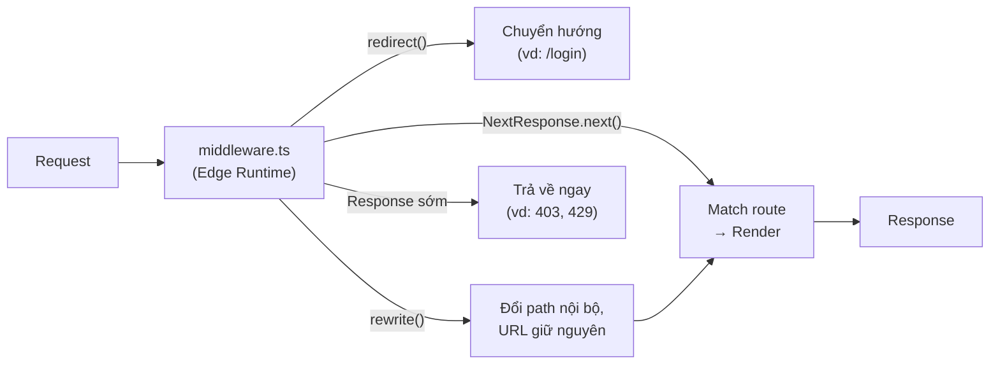

# Middleware Basics

**Middleware** (lớp trung gian xử lý request) là đoạn code chạy trước khi request đến được trang hoặc route đích trong Next.js. Nó cho phép bạn kiểm tra, chỉnh sửa hoặc chuyển hướng request một cách tập trung — ví dụ kiểm tra đăng nhập, đổi ngôn ngữ, hay viết lại đường dẫn. Bài này giới thiệu cách tạo middleware cơ bản và những trường hợp dùng phổ biến cho người mới.

[](pathname:///img/nextjs/middleware-basics.webp)

---

:::note[Ghi nhớ nhanh]

- ⭐ **Middleware chạy TRƯỚC route, cho nhiều path cùng lúc** — tập trung logic như auth/redirect thay vì lặp ở từng trang, và xử lý sớm trước khi render.
- ⭐ **File `middleware.ts` ở root** export hàm `middleware(request)` và `config.matcher` — trả `NextResponse.next()`, `.redirect()`, `.rewrite()` hoặc response sớm.
- **Chạy trên Edge Runtime** — cực nhanh, gần user, nhưng KHÔNG có Node API (`fs`, `path`), không DB client Node cũ, giới hạn 1MB bundle và CPU time.
- **Use case phổ biến** — auth check, geo redirect, A/B testing, rate limiting, logging, header injection.
- **`matcher`** giới hạn route áp dụng; pattern negative lookahead loại trừ static asset để tăng performance.
- **Chỉ 1 file middleware toàn project** — không có nested middleware; khi phức tạp thì compose các helper function từ `lib/middleware/*.ts`.

:::

---

## Mục lục

- [Vì sao có middleware trong Next.js?](#vì-sao-có-middleware-trong-nextjs)
- [Middleware là gì?](#middleware-là-gì)
- [Tạo middleware](#tạo-middleware)
- [Use cases phổ biến](#use-cases-phổ-biến)
- [Hạn chế của middleware](#hạn-chế-của-middleware)
- [Câu hỏi phỏng vấn](#câu-hỏi-phỏng-vấn)

---

## Vì sao có middleware trong Next.js?

**Vấn đề:**

```ts
// Một số việc cần làm TRƯỚC KHI request đến trang/route handler,
// và cho NHIỀU route cùng lúc: check đăng nhập để chặn/redirect,
// đổi locale, A/B test, chặn bot.

// app/dashboard/page.tsx
export default async function DashboardPage() {
  const token = await getToken();
  if (!token) redirect("/login"); // logic này lặp ở MỌI trang
  // ...render
}

// app/settings/page.tsx
export default async function SettingsPage() {
  const token = await getToken();
  if (!token) redirect("/login"); // lặp lại y hệt
  // ...render
}
// → Lặp code + xử lý TRỄ (sau khi đã bắt đầu render trang).
```

**Giải pháp:**

```ts
// middleware.ts — chạy ở EDGE, TRƯỚC mọi request khớp matcher.
// Đọc request → redirect / rewrite / next, set cookie/header.
// Xử lý TẬP TRUNG, SỚM và NHANH cho nhiều route cùng lúc.
import { NextResponse } from "next/server";
import type { NextRequest } from "next/server";

export function middleware(request: NextRequest) {
  const token = request.cookies.get("token");
  if (!token) {
    return NextResponse.redirect(new URL("/login", request.url));
  }
  return NextResponse.next();
}

export const config = {
  matcher: ["/dashboard/:path*", "/settings/:path*"],
};
```

:::tip[Dùng thực tế]

- **Bảo vệ route cần auth** — không có token thì redirect `/login` ngay, không render trang.
- **Chuyển hướng theo ngôn ngữ/khu vực** — đổi locale theo `geo`/header trước khi vào trang.
- **A/B testing** — chia nhánh người dùng và rewrite sang biến thể phù hợp.
- **Thêm header bảo mật** — gắn header chuẩn cho mọi response một chỗ duy nhất.

:::

---

## Middleware là gì?

**Middleware** chạy **trước khi request đến route** — intercept để
modify response, redirect, set header, check auth.

Flow:

```
Request → Middleware → Match route → Render → Response
              ↓
       Có thể: redirect, rewrite, set header, response sớm
```

Sơ đồ vòng đời request khi đi qua middleware — 4 hướng xử lý có thể xảy ra:



Middleware chạy trên **Edge Runtime** (mặc định) → cực nhanh, gần user.

---

## Tạo middleware

File `middleware.ts` ở **root** của project (cùng cấp `app/`):

```ts
// middleware.ts
import { NextResponse } from "next/server";
import type { NextRequest } from "next/server";

export function middleware(request: NextRequest) {
  console.log("Request đến:", request.url);
  return NextResponse.next();
}

export const config = {
  matcher: "/dashboard/:path*",
};
```

- `request` — `NextRequest` (extend Web Request).
- `return NextResponse.next()` — cho request đi tiếp.
- `config.matcher` — route nào áp dụng middleware.

---

## Use cases phổ biến

**1. Authentication check**:

```ts
export function middleware(request: NextRequest) {
  const token = request.cookies.get("token");

  if (!token) {
    return NextResponse.redirect(new URL("/login", request.url));
  }

  return NextResponse.next();
}

export const config = {
  matcher: ["/dashboard/:path*", "/settings/:path*"],
};
```

**2. Geo redirect** — redirect theo quốc gia:

```ts
export function middleware(request: NextRequest) {
  const country = request.geo?.country || "US";

  if (country === "VN" && !request.nextUrl.pathname.startsWith("/vi")) {
    return NextResponse.redirect(
      new URL(`/vi${request.nextUrl.pathname}`, request.url)
    );
  }

  return NextResponse.next();
}
```

**3. A/B testing**:

```ts
export function middleware(request: NextRequest) {
  const variant = request.cookies.get("ab-variant")?.value;

  if (!variant) {
    const newVariant = Math.random() < 0.5 ? "a" : "b";
    const response = NextResponse.next();
    response.cookies.set("ab-variant", newVariant);
    return response;
  }

  if (variant === "b" && request.nextUrl.pathname === "/") {
    return NextResponse.rewrite(new URL("/variant-b", request.url));
  }

  return NextResponse.next();
}
```

**4. Rate limiting** (đơn giản, production nên dùng Upstash):

```ts
const rateLimits = new Map<string, number>();

export function middleware(request: NextRequest) {
  const ip = request.headers.get("x-forwarded-for") || "unknown";
  const count = rateLimits.get(ip) || 0;

  if (count > 100) {
    return NextResponse.json({ error: "Too many requests" }, { status: 429 });
  }

  rateLimits.set(ip, count + 1);
  setTimeout(() => rateLimits.delete(ip), 60_000); // reset 1 phút

  return NextResponse.next();
}
```

**5. Logging/Analytics**:

```ts
export async function middleware(request: NextRequest) {
  console.log(`${request.method} ${request.url}`);
  // Hoặc gửi đến analytics service
  return NextResponse.next();
}
```

**6. Header injection**:

```ts
export function middleware(request: NextRequest) {
  const response = NextResponse.next();

  response.headers.set("X-Custom-Header", "value");
  response.headers.set("X-Request-Id", crypto.randomUUID());

  return response;
}
```

---

## Hạn chế của middleware

:::warning[Cần lưu ý]

**Middleware chạy trên Edge Runtime** — có giới hạn:

- **Không có Node.js APIs** (`fs`, `path`, `process`).
- **Không có database client** Node-based (Prisma client cũ — cần Prisma
  Accelerate).
- **Code size limit** — 1MB sau bundle.
- **CPU time limit** — vài chục ms (Vercel limits).
- **Không truy cập `app/` data directly** — phải qua API call hoặc cookie.

→ Logic phức tạp (database query, heavy computation) **không đặt trong
middleware**. Đặt trong Server Component hoặc route handler.

Middleware **chỉ nên làm**:

- Check cookie/header.
- Redirect/rewrite simple.
- Set header.
- Light fetch (KV store, edge config).

:::

:::info[Phân tích]

**Edge Runtime vs Node Runtime**:

| | Edge | Node |
|--|------|------|
| Khởi động | **Cold start ~ms** | Cold start ~s |
| Latency | Thấp (gần user) | Cao hơn |
| Node API | **Không** (chỉ Web Standards) | Đầy đủ |
| Database driver | HTTP-based (Neon, Upstash, Planetscale) | Bất kỳ |
| File system | Không | Có |
| CPU/memory limit | Chặt | Lỏng hơn |

Middleware mặc định Edge. Route handler có thể chọn:

```ts
export const runtime = "edge";    // hoặc "nodejs"
```

Trade-off:

- **Edge** cho global fast access, light logic, auth check.
- **Node** cho database query, file processing, third-party SDK Node-only.

:::

:::tip[Mẹo]

**Matcher syntax** — chọn route áp dụng middleware:

```ts
export const config = {
  matcher: [
    // Đơn giản
    "/dashboard/:path*",

    // Nhiều pattern
    ["/api/:path*", "/admin/:path*"],

    // Negative lookahead — exclude
    {
      source: "/((?!api|_next/static|_next/image|favicon.ico).*)",
      missing: [
        { type: "header", key: "x-skip-middleware" },
      ],
    },
  ],
};
```

Pattern phổ biến — exclude static asset:

```ts
matcher: "/((?!api|_next/static|_next/image|favicon.ico|.*\\.).*)"
```

→ Middleware chỉ chạy với page request, bỏ qua asset → performance tốt hơn.

:::

---

## Order matters

Middleware chạy theo **thứ tự** trong file. Có thể compose nhiều check:

```ts
export async function middleware(request: NextRequest) {
  // 1. Block bot
  const ua = request.headers.get("user-agent") || "";
  if (isBlockedBot(ua)) {
    return new NextResponse("Forbidden", { status: 403 });
  }

  // 2. Geo redirect
  if (needsGeoRedirect(request)) {
    return NextResponse.redirect(getGeoUrl(request));
  }

  // 3. Auth check
  if (isProtectedPath(request.nextUrl.pathname)) {
    const token = request.cookies.get("token");
    if (!token) return NextResponse.redirect(new URL("/login", request.url));
  }

  // 4. Set header
  const response = NextResponse.next();
  response.headers.set("X-Request-Id", crypto.randomUUID());
  return response;
}
```

:::warning[Cần lưu ý]

**Chỉ có 1 file `middleware.ts`** trong toàn project — không có "nested
middleware" như framework khác.

Khi cần phức tạp:

- Compose function trong middleware chính.
- Dùng `matcher` để chia logic theo path.
- Helper function trong `lib/middleware/*.ts`.

```ts
import { authMiddleware } from "@/lib/middleware/auth";
import { geoMiddleware } from "@/lib/middleware/geo";

export async function middleware(request: NextRequest) {
  const authResponse = await authMiddleware(request);
  if (authResponse) return authResponse;

  const geoResponse = await geoMiddleware(request);
  if (geoResponse) return geoResponse;

  return NextResponse.next();
}
```

:::

---

## Câu hỏi phỏng vấn

Những câu thường gặp về chủ đề này. Tự trả lời trước, rồi bấm **Xem đáp án** để đối chiếu.

**1. `middleware` trong Next.js là gì và nó chạy ở thời điểm nào trong vòng đời một request?**

<details className="qa">
<summary>Xem đáp án</summary>

Middleware là đoạn code chạy **trước khi request tới được route đích** — trước cả khi Next.js quyết định render page nào hay gọi route handler nào:

```
Request → Middleware → Match route → Render → Response
              ↓
    redirect / rewrite / set header / trả response sớm
```

Vì chạy sớm và áp cho nhiều path cùng lúc, nó là chỗ tự nhiên để đặt các việc mang tính **chắn cổng**: kiểm tra token đăng nhập, chuyển hướng theo ngôn ngữ, chia nhánh A/B, chặn bot, gắn header.

So với việc viết kiểm tra trong từng page:

- Không phải lặp cùng một đoạn `if (!token) redirect("/login")` ở mọi trang.
- Xử lý **sớm hơn** — chặn ngay ở edge, không tốn công bắt đầu render một trang rồi mới bỏ.

Middleware mặc định chạy trên **Edge Runtime**, gần người dùng về mặt địa lý nên độ trễ rất thấp.

</details>

**2. File `middleware.ts` phải đặt ở đâu, export những gì, và Next.js gọi nó ra sao?**

<details className="qa">
<summary>Xem đáp án</summary>

Đặt `middleware.ts` ở **thư mục gốc của project**, cùng cấp với `app/` (nếu dùng thư mục `src/` thì đặt trong `src/`). Tên file là bắt buộc — Next.js tìm đúng tên này.

Export hai thứ:

```ts
import { NextResponse } from "next/server";
import type { NextRequest } from "next/server";

export function middleware(request: NextRequest) {
  return NextResponse.next();
}

export const config = {
  matcher: "/dashboard/:path*",
};
```

- **`middleware(request)`** — hàm xử lý, nhận một `NextRequest` (mở rộng từ `Request` chuẩn, thêm các tiện ích như `request.cookies` và `request.nextUrl`). Hàm có thể là `async`.
- **`config.matcher`** — khai báo những đường dẫn mà middleware được áp dụng. Bỏ qua thì middleware chạy cho **mọi** request, kể cả file tĩnh.

Next.js gọi hàm này cho từng request khớp matcher và dùng giá trị trả về để quyết định tiếp: đi tiếp, chuyển hướng, viết lại đường dẫn, hay trả về ngay.

</details>

**3. Kể các giá trị trả về hợp lệ từ middleware (`NextResponse.next()`, `.redirect()`, `.rewrite()`, response tự tạo) và hệ quả của từng loại.**

<details className="qa">
<summary>Xem đáp án</summary>

| Giá trị trả về | Hệ quả |
|---|---|
| `NextResponse.next()` | cho request đi tiếp tới route bình thường; vẫn gắn thêm được header hoặc cookie lên response |
| `NextResponse.redirect(url)` | trả mã 3xx, trình duyệt gọi lại URL mới, **thanh địa chỉ đổi** |
| `NextResponse.rewrite(url)` | phục vụ nội dung từ đường dẫn khác nhưng **URL giữ nguyên**, người dùng không biết |
| Response tự tạo | kết thúc request ngay tại middleware, ví dụ `403` chặn bot hay `429` khi vượt giới hạn |

Ví dụ gắn thêm thông tin mà vẫn cho đi tiếp:

```ts
const response = NextResponse.next();
response.headers.set("X-Request-Id", crypto.randomUUID());
response.cookies.set("ab-variant", "b");
return response;
```

Ghi nhớ khác biệt cốt lõi: `redirect` **đổi thứ người dùng thấy**, `rewrite` **đổi thứ server lấy về**, `next()` không đổi gì ngoài những header/cookie bạn thêm vào, còn response tự tạo thì cắt đứt luôn hành trình của request.

</details>

**4. `config.matcher` dùng để làm gì? So sánh `/dashboard/:path` với `/dashboard/:path*` — chúng khớp những URL nào?**

<details className="qa">
<summary>Xem đáp án</summary>

`matcher` giới hạn **middleware chạy cho những đường dẫn nào**. Không khai báo thì nó chạy cho mọi request, gây lãng phí và dễ sinh lỗi.

Khác biệt giữa hai pattern nằm ở dấu `*`:

| Pattern | Khớp | Không khớp |
|---|---|---|
| `/dashboard/:path` | `/dashboard/settings` (đúng **một** segment) | `/dashboard`, `/dashboard/a/b` |
| `/dashboard/:path*` | `/dashboard`, `/dashboard/a`, `/dashboard/a/b/c` (**không hoặc nhiều** segment) | các đường dẫn ngoài `/dashboard` |

Vì vậy để bảo vệ cả một khu vực, gần như luôn dùng dạng có `*`:

```ts
export const config = {
  matcher: ["/dashboard/:path*", "/settings/:path*"],
};
```

Nếu chỉ viết `/dashboard/:path`, bạn để lọt chính trang `/dashboard` và mọi trang con sâu hơn một cấp — một lỗ hổng xác thực rất dễ mắc và khó phát hiện vì trang chính vẫn "trông có vẻ" được bảo vệ.

Ngoài chuỗi, `matcher` còn nhận dạng object với `source` kèm điều kiện `has` / `missing` theo header hoặc cookie.

</details>

**5. Vì sao pattern matcher thực tế thường loại trừ `_next/static`, `_next/image`, `favicon.ico`? Không loại trừ thì hậu quả là gì?**

<details className="qa">
<summary>Xem đáp án</summary>

Vì những đường dẫn đó là **tài nguyên tĩnh** — bundle JS, CSS, ảnh đã tối ưu, favicon — và chúng chiếm phần lớn số request của một trang. Cho middleware chạy trên chúng là làm việc vô ích.

Pattern quen thuộc dùng negative lookahead để loại trừ:

```ts
matcher: "/((?!api|_next/static|_next/image|favicon.ico|.*\\.).*)";
```

Hậu quả nếu không loại trừ:

- **Tốn tài nguyên và tiền** — mỗi lần tải một trang có thể kéo theo hàng chục request asset, mỗi request lại kích hoạt một lượt chạy edge function.
- **Chậm hơn** — mọi asset phải đi qua một lớp xử lý thừa.
- **Lỗi logic** — nếu middleware redirect khi thiếu token, nó sẽ redirect luôn cả file JS và CSS, khiến trang login gãy giao diện hoặc rơi vào vòng lặp chuyển hướng.

Nguyên tắc: middleware chỉ nên chạy với **request điều hướng của người dùng**, không chạy với asset.

</details>

**6. Middleware chạy trên `edge runtime`: điều đó nghĩa là những API nào KHÔNG dùng được, và vì sao?**

<details className="qa">
<summary>Xem đáp án</summary>

Edge Runtime là môi trường nhẹ chỉ cung cấp **Web Standards**, không phải Node.js đầy đủ. Không dùng được:

- **Module hệ thống của Node** — `fs`, `path`, `net`, `child_process`, phần lớn `process`.
- **Native module** (addon viết bằng C++) và các thư viện phụ thuộc chúng.
- **Driver database kết nối TCP trực tiếp** — phải dùng bản giao tiếp qua HTTP (Neon, Upstash, PlanetScale) hoặc một lớp proxy.
- Các API sinh code lúc chạy như `eval` / `new Function`.

Còn dùng được: `fetch`, `Request`/`Response`, `URL`, `TextEncoder`, Web Crypto (`crypto.subtle`, `crypto.randomUUID`).

**Vì sao bị giới hạn:** edge function được nhân bản ra hàng trăm điểm hiện diện trên toàn cầu và phải khởi động trong vài mili giây. Muốn vậy thì môi trường phải cực nhỏ — không thể mang theo cả bộ API hệ thống của Node, và cũng không nên cho phép truy cập file hay mở kết nối TCP dài hạn từ một môi trường phù du như vậy.

</details>

**7. So sánh `edge runtime` và `nodejs runtime` về cold start, độ trễ, API khả dụng, driver database và giới hạn CPU/bộ nhớ.**

<details className="qa">
<summary>Xem đáp án</summary>

| | Edge Runtime | Node Runtime |
|---|---|---|
| Cold start | rất nhỏ, cỡ mili giây | lớn hơn, cỡ giây |
| Độ trễ | thấp — chạy gần người dùng | cao hơn — chạy ở vùng đã chọn |
| API | chỉ Web Standards | đầy đủ API Node |
| Driver database | phải qua HTTP (Neon, Upstash, PlanetScale) | bất kỳ driver nào |
| Hệ thống file | không có | có |
| CPU / bộ nhớ | giới hạn chặt, bundle nhỏ | thoải mái hơn |

Middleware **luôn chạy ở edge**, không đổi được. Route handler và page thì chọn được:

```ts
export const runtime = "edge"; // hoặc "nodejs"
```

Cách chọn: **edge** cho logic nhẹ, nhạy độ trễ, cần chạy gần người dùng — kiểm tra phiên đăng nhập, chuyển hướng, cá nhân hoá đơn giản. **Node** cho truy vấn cơ sở dữ liệu, xử lý file, thư viện chỉ chạy được trên Node, hoặc bất cứ việc gì tốn CPU.

</details>

**8. Vì sao không nên query database trực tiếp trong middleware? Nếu bắt buộc phải lấy dữ liệu, bạn làm cách nào?**

<details className="qa">
<summary>Xem đáp án</summary>

Ba lý do:

- **Kỹ thuật** — edge không mở được kết nối TCP nên phần lớn driver database không chạy; connection pool cũng vô nghĩa khi hàm được nhân bản ở hàng trăm vị trí.
- **Hiệu năng** — middleware chạy cho **mọi** request khớp matcher. Thêm một truy vấn là cộng độ trễ vào từng lần tải trang, và rất dễ đụng giới hạn CPU time vốn chỉ vài chục mili giây.
- **Địa lý** — edge ở gần người dùng nhưng database thì ở một vùng cố định, nên truy vấn từ edge có khi còn **chậm hơn** truy vấn từ server thường.

Nếu vẫn cần dữ liệu ở middleware:

- Đặt thông tin tối thiểu vào **cookie đã ký** hoặc **JWT** rồi chỉ verify chữ ký — không cần chạm tới database.
- Dùng **KV store hoặc edge config** (Upstash, Vercel Edge Config) vốn thiết kế cho đúng tình huống này, truy cập qua HTTP và rất nhanh.
- Chuyển việc kiểm tra nặng xuống **Server Component hoặc route handler**, nơi có Node runtime đầy đủ.

</details>

**9. Middleware có giới hạn bundle size và CPU time — điều này ảnh hưởng thế nào tới việc chọn thư viện (ví dụ thư viện JWT) đưa vào middleware?**

<details className="qa">
<summary>Xem đáp án</summary>

Mọi thứ bạn `import` vào `middleware.ts` đều bị gộp vào bundle chạy ở edge, mà bundle này bị giới hạn dung lượng (khoảng 1MB sau khi đóng gói) và thời gian CPU chỉ vài chục mili giây. Vì vậy tiêu chí chọn thư viện đổi hẳn:

- **Phải tương thích Web Standards** — thư viện dựa trên module `crypto` của Node sẽ không chạy. Với JWT, `jsonwebtoken` là ví dụ điển hình không dùng được ở edge; thay bằng `jose`, vốn xây trên Web Crypto.
- **Phải nhẹ và tree-shakeable** — đừng kéo cả một SDK đồ sộ chỉ để dùng một hàm nhỏ.
- **Phải rẻ về CPU** — verify chữ ký JWT thì được, nhưng băm mật khẩu kiểu bcrypt với chi phí cao thì hoàn toàn sai chỗ.

Nguyên tắc chung: middleware chỉ nên **đọc và quyết định** — đọc cookie, verify chữ ký, so khớp đường dẫn — chứ không phải nơi làm việc nặng. Việc nặng để Server Component hay route handler lo.

</details>

**10. Next.js chỉ cho phép một file middleware cho cả project. Khi logic phức tạp (auth + i18n + A/B test + rate limit), bạn tổ chức code thế nào?**

<details className="qa">
<summary>Xem đáp án</summary>

Không có middleware lồng nhau, nên phải tự **ghép các hàm nhỏ** trong một file duy nhất. Mỗi mối quan tâm tách ra một helper trong `lib/middleware/*.ts`, mỗi helper trả về một response nếu nó muốn kết thúc request, hoặc trả về rỗng để nhường cho bước sau:

```ts
import { authMiddleware } from "@/lib/middleware/auth";
import { geoMiddleware } from "@/lib/middleware/geo";

export async function middleware(request: NextRequest) {
  const authResponse = await authMiddleware(request);
  if (authResponse) return authResponse;

  const geoResponse = await geoMiddleware(request);
  if (geoResponse) return geoResponse;

  return NextResponse.next();
}
```

Kèm theo hai kỹ thuật:

- **Dùng `matcher` để thu hẹp phạm vi** — chỉ những path cần mới vào middleware.
- **Rẽ nhánh theo đường dẫn ngay đầu hàm** — `if (pathname.startsWith("/api"))` thì chạy nhóm kiểm tra của API, tránh chạy mọi thứ cho mọi request.

Lợi ích: mỗi helper test được độc lập, file chính đọc như một danh sách các bước, và thứ tự các bước hiện rõ ràng thay vì nằm lẫn trong một hàm dài.

</details>

**11. Thứ tự các bước kiểm tra bên trong middleware quan trọng ra sao? Cho ví dụ sắp xếp sai gây lỗi logic.**

<details className="qa">
<summary>Xem đáp án</summary>

Rất quan trọng, vì middleware chạy tuần tự và **bước nào trả về response trước thì các bước sau không chạy nữa**. Thứ tự hợp lý là từ rẻ và chặn mạnh nhất tới đắt và cụ thể nhất:

```ts
// 1. Chặn bot           → rẻ, loại bỏ sớm
// 2. Rate limit         → bảo vệ trước khi làm gì thêm
// 3. Chuyển hướng ngôn ngữ / khu vực
// 4. Kiểm tra đăng nhập
// 5. Gắn header rồi next()
```

Vài cách sắp xếp sai và hậu quả:

- **Kiểm tra đăng nhập trước khi chuyển hướng ngôn ngữ** — người dùng bị đưa về `/login` rồi mới bị đổi sang `/vi/login`, thành hai lần chuyển hướng, và nếu hai bước cùng tác động lên đường dẫn thì dễ rơi vào vòng lặp.
- **Rate limit đặt sau các bước nặng** — kẻ tấn công vẫn khiến bạn tốn công xử lý trước khi bị chặn, tức là giới hạn gần như vô dụng.
- **Gắn header rồi mới redirect** — response `next()` đã tạo bị vứt bỏ, header không bao giờ tới được client.
- **Chặn bot đặt cuối cùng** — mọi bước tốn kém phía trước đều đã chạy cho request mà cuối cùng bị từ chối.

</details>

**12. Middleware vs Server Component check vs route handler check: đặt logic xác thực ở đâu và vì sao chỉ dựa vào middleware là không đủ an toàn?**

<details className="qa">
<summary>Xem đáp án</summary>

Ba tầng có ba vai trò khác nhau:

- **Middleware** — chắn thô, cải thiện trải nghiệm: chưa có token thì đưa về `/login` ngay, không tốn công render. Nó chỉ nên kiểm tra **có phiên hợp lệ hay không**.
- **Server Component / lớp truy cập dữ liệu** — kiểm tra **quyền thật** trước khi đọc dữ liệu: người này có thuộc tổ chức đó không, có sở hữu bản ghi đang mở không.
- **Route handler / Server Action** — kiểm tra lại y hệt, vì chúng là điểm vào độc lập mà client có thể gọi thẳng.

Vì sao middleware một mình không đủ:

- Nó chỉ chạy với **đường dẫn khớp matcher**; sai một dấu `*` là lọt cả một nhánh route.
- Nó thường chỉ biết cookie có tồn tại hay không, **không biết phân quyền theo từng bản ghi**.
- Server Action và route handler có thể bị gọi trực tiếp, và không phải lúc nào cũng nằm trong phạm vi matcher.

Nguyên tắc: **kiểm tra quyền ở nơi dữ liệu được truy cập**, còn middleware là lớp tiện lợi phía trước, không phải lớp bảo vệ cuối cùng.

</details>

**13. Triển khai A/B testing bằng middleware: bạn dùng `rewrite` hay `redirect`, lưu variant ở đâu, và làm sao giữ trải nghiệm ổn định giữa các lần truy cập?**

<details className="qa">
<summary>Xem đáp án</summary>

Dùng **`rewrite`**, không dùng `redirect`. Redirect làm URL đổi thành `/variant-b`, người dùng nhìn thấy mình đang bị thử nghiệm, link chia sẻ ra ngoài bị lệch, và tốn thêm một lượt round-trip. Rewrite giữ URL là `/` trong khi vẫn phục vụ nội dung của biến thể.

Variant lưu trong **cookie** — gán một lần rồi dùng lại cho các lần sau:

```ts
export function middleware(request: NextRequest) {
  const variant = request.cookies.get("ab-variant")?.value;

  if (!variant) {
    const next = Math.random() < 0.5 ? "a" : "b";
    const response = NextResponse.next();
    response.cookies.set("ab-variant", next);
    return response;
  }

  if (variant === "b" && request.nextUrl.pathname === "/") {
    return NextResponse.rewrite(new URL("/variant-b", request.url));
  }

  return NextResponse.next();
}
```

Giữ trải nghiệm ổn định (sticky) chính là nhờ cookie: một người luôn thấy cùng một biến thể, nếu không thì dữ liệu thử nghiệm vô nghĩa và giao diện nhảy qua lại mỗi lần tải trang. Nhớ đặt thời hạn cookie đủ dài phủ hết thời gian thử nghiệm, và gửi variant kèm sự kiện analytics để quy kết kết quả.

</details>

**14. Redirect theo vị trí địa lý trong middleware: lấy thông tin geo từ đâu, và làm sao tránh redirect loop?**

<details className="qa">
<summary>Xem đáp án</summary>

Thông tin vị trí không tự có trong request mà do **nền tảng hosting suy ra từ IP rồi gắn vào** — trên Vercel là `request.geo` hoặc các header dạng `x-vercel-ip-country`, các nền tảng edge khác có header tương đương. Vì vậy ở môi trường local nó thường rỗng, phải có giá trị mặc định.

Tránh vòng lặp bằng cách **kiểm tra đường dẫn đã ở đúng đích chưa trước khi chuyển hướng**:

```ts
const country = request.geo?.country || "US";
const { pathname } = request.nextUrl;

if (country === "VN" && !pathname.startsWith("/vi")) {
  return NextResponse.redirect(new URL(`/vi${pathname}`, request.url));
}
return NextResponse.next();
```

Thiếu điều kiện `!pathname.startsWith("/vi")` thì `/vi/home` lại bị đổi thành `/vi/vi/home` và cứ thế mãi.

Các điểm cần lưu ý thêm:

- **Nhớ lựa chọn của người dùng** bằng cookie locale, và ưu tiên nó hơn suy đoán từ IP — người dùng đã chủ động đổi ngôn ngữ mà lần sau vẫn bị ép về ngôn ngữ theo IP là trải nghiệm rất khó chịu.
- Loại trừ asset và `/api` khỏi matcher, nếu không chính chúng cũng bị thêm tiền tố ngôn ngữ và hỏng.
- Cân nhắc `rewrite` thay vì `redirect` nếu muốn URL giữ nguyên.

</details>

**15. Middleware ảnh hưởng thế nào tới khả năng cache static/CDN của một route? Có làm route trở nên dynamic không?**

<details className="qa">
<summary>Xem đáp án</summary>

Middleware **không đổi phân loại static/dynamic của route** — trong build report, một trang tĩnh vẫn hiện là static và HTML của nó vẫn được dựng sẵn.

Cái nó đổi là **đường đi của request**: mọi request khớp matcher đều phải chạy qua edge function trước, nên không còn được phục vụ thuần tuý từ cache CDN nữa. Hệ quả:

- Mỗi request tốn thêm một lượt thực thi middleware — thường chỉ vài mili giây, nhưng là chi phí có thật cả về độ trễ lẫn tiền.
- Nếu middleware làm việc nặng, chính nó trở thành nút cổ chai cho một trang vốn rất nhanh.
- `rewrite` trong middleware khiến URL người dùng thấy và nội dung thực tế khác nhau, cần cẩn thận khi đặt quy tắc cache theo đường dẫn.

Vì vậy hai việc nên làm: **thu hẹp matcher** để asset và những route không cần thiết không đi qua middleware, và **giữ middleware thật mỏng**. Muốn cá nhân hoá sâu thì đừng ép vào middleware — dùng render động cho đúng phần cần, giữ phần còn lại tĩnh.

</details>

**16. Bạn debug middleware ra sao khi nó chạy đúng ở local nhưng sai trên production edge?**

<details className="qa">
<summary>Xem đáp án</summary>

Trước hết liệt kê những khác biệt hay gây ra tình trạng này:

- **Header và geo** — `request.geo`, `x-forwarded-for`, header quốc gia chỉ có giá trị thật trên production; ở local chúng rỗng nên nhánh code tương ứng không bao giờ chạy.
- **Biến môi trường** — biến chưa khai báo trên nền tảng, hoặc secret không được cấp cho edge.
- **Thư viện không tương thích edge** — ở local vẫn chạy nhờ môi trường dễ tính, lên production thì lỗi.
- **Trạng thái trong bộ nhớ** — biến kiểu `Map` dùng để rate limit chỉ đúng khi có một tiến trình; trên edge có hàng trăm phiên bản nên đếm sai.
- **Matcher** — regex khớp khác đi khi có `basePath` hoặc domain phụ.

Cách lần ra:

- **Log qua response header** — gắn `x-debug-country`, `x-debug-matched` vào `NextResponse.next()` rồi xem trong tab Network; hiệu quả hơn `console.log` vì log ở edge thường rời rạc.
- Xem **log runtime của nền tảng**, lọc theo request id mà chính middleware sinh ra.
- Tái hiện bằng bản build production chạy local, giả lập header geo bằng công cụ gửi request thủ công.
- Thu hẹp dần: tạm rút middleware còn mỗi `NextResponse.next()`, rồi thêm lại từng bước cho tới khi lỗi tái hiện.

</details>
