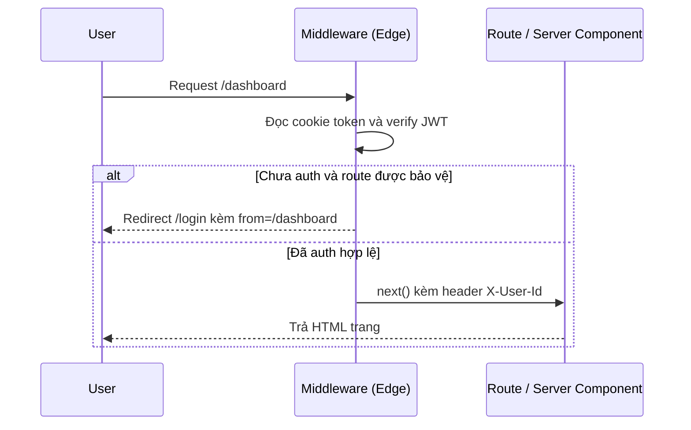

# Cookies, Headers, Auth trong Middleware

Bài này đi sâu vào các tính năng thường dùng bên trong **middleware** (lớp trung gian xử lý request) của Next.js. Bạn sẽ làm việc với **cookies** (mẩu dữ liệu nhỏ trình duyệt lưu để ghi nhớ trạng thái người dùng), **headers** (thông tin đi kèm mỗi request/response) và **authentication** (xác thực — kiểm tra danh tính người dùng). Đây là nền tảng để xây dựng các luồng đăng nhập và giới hạn truy cập ngay tại lớp trung gian.

[](pathname:///img/nextjs/middleware-features.webp)

---

:::note[Ghi nhớ nhanh]

- ⭐ **Đọc/ghi cookie qua `request.cookies` và `response.cookies`** — auth token luôn đặt `httpOnly + secure + sameSite=lax`, tránh lưu dữ liệu nhạy cảm trong cookie client đọc được.
- ⭐ **Auth pattern chuẩn** — middleware `jwtVerify` chữ ký JWT (không query DB ở Edge), redirect user chưa auth khỏi route bảo vệ, rồi truyền `X-User-Id` xuống Server Component.
- **Truyền data xuống downstream** — set header rồi `NextResponse.next({ request: { headers } })`, Server Component đọc lại qua `headers()` từ `next/headers`.
- **Rate limiting** — Edge không giữ memory bền, dùng KV store ngoài như Upstash (`@upstash/ratelimit`).
- **CORS** — xử lý preflight `OPTIONS` và set `Access-Control-*`; API có credentials nên whitelist origin thay vì `*`.
- **Compose middleware** — helper `compose(...fns)` short-circuit khi một hàm trả `NextResponse`, cho qua khi trả `null`.

:::

---

## Mục lục

- [Vì sao middleware có các tính năng này?](#vì-sao-middleware-có-các-tính-năng-này)
- [Cookies API](#cookies-api)
- [Headers API](#headers-api)
- [Authentication pattern](#authentication-pattern)
- [Rate Limiting với Upstash](#rate-limiting-với-upstash)
- [CORS](#cors)
- [Câu hỏi phỏng vấn](#câu-hỏi-phỏng-vấn)

---

## Vì sao middleware có các tính năng này?

**Vấn đề:**

```ts
// Middleware chạy cho MỌI request trước khi tới route.
// Nếu áp dụng tràn lan → mỗi ảnh, file tĩnh, API đều bị chặn lại xử lý → tốn kém.
export function middleware(request: NextRequest) {
  // Làm sao đọc token đăng nhập? Làm sao chặn user chưa auth?
  // Làm sao truyền dữ liệu xuống Server Component?
  // Làm sao cho phép cross-origin? Một hàm thô không đủ.
}
```

Middleware nằm ở lớp trung gian (chạy ở Edge, gần user) nên cần đủ khả năng xử lý request đa dạng: nhận diện người dùng, chặn/cho qua, cá nhân hoá — nhưng nếu chạy cho cả tài nguyên không cần thiết thì lãng phí.

**Giải pháp:**

```ts
// matcher → chỉ chạy cho route cần, bỏ qua file tĩnh để tránh phí.
export const config = {
  matcher: ["/((?!_next/static|_next/image|favicon.ico).*)"],
};

export async function middleware(request: NextRequest) {
  // cookies → đọc/ghi trạng thái người dùng (token đăng nhập)
  const token = request.cookies.get("token")?.value;

  // headers → đọc thông tin request, truyền data xuống downstream
  const requestHeaders = new Headers(request.headers);
  requestHeaders.set("X-User-Id", "u123");

  // redirect → chặn user chưa auth khỏi route bảo vệ
  if (!token) return NextResponse.redirect(new URL("/login", request.url));

  // next + headers → forward dữ liệu xuống Server Component
  return NextResponse.next({ request: { headers: requestHeaders } });
}
```

Mỗi tính năng phục vụ một nhu cầu cụ thể: `matcher` giới hạn phạm vi chạy; `cookies`/`headers` đọc-ghi trạng thái và truyền dữ liệu; `redirect` điều hướng theo điều kiện; `NextResponse.next()` cho request đi tiếp.

Luồng middleware xử lý một request trước khi tới route:



:::tip[Dùng thực tế]

- **`matcher` giới hạn phạm vi**: chỉ chạy middleware cho `/api/:path*` hoặc loại trừ file tĩnh — tránh xử lý thừa cho ảnh, font, favicon.
- **`headers` truyền data xuống component**: middleware verify token rồi set `X-User-Id` để Server Component đọc lại mà không phải verify lần nữa.
- **`redirect` theo auth**: user chưa đăng nhập vào `/dashboard` thì đẩy về `/login`, kèm `?from=` để quay lại sau khi đăng nhập.
- **`cookies` cho phiên đăng nhập**: đọc cookie `token` ở mọi request để xác thực, set cookie `httpOnly + secure` khi login, xoá khi logout.

:::

---

## Cookies API

**Đọc cookie**:

```ts
export function middleware(request: NextRequest) {
  const token = request.cookies.get("token");           // cookie object
  const value = request.cookies.get("token")?.value;    // string
  const all = request.cookies.getAll();
  const has = request.cookies.has("token");
}
```

**Set cookie** trên response:

```ts
const response = NextResponse.next();

response.cookies.set("token", "abc123");
response.cookies.set({
  name: "session",
  value: "xyz",
  httpOnly: true,
  secure: true,
  sameSite: "lax",
  maxAge: 60 * 60 * 24 * 7, // 7 ngày
  path: "/",
});

response.cookies.delete("old-cookie");

return response;
```

**Trong Server Component / Server Action**:

```ts
import { cookies } from "next/headers";

export default async function Page() {
  const cookieStore = await cookies();
  const token = cookieStore.get("token");
  return /* ... */;
}

// Server Action — có thể set/delete
"use server";
export async function logout() {
  const cookieStore = await cookies();
  cookieStore.delete("token");
}
```

:::warning[Cần lưu ý]

**Cookie security flags** quan trọng:

| Flag | Mục đích |
|------|----------|
| `httpOnly: true` | JS không đọc được — bảo vệ XSS |
| `secure: true` | Chỉ HTTPS |
| `sameSite: "lax"` | CSRF protection |
| `sameSite: "strict"` | Chặt hơn — block cross-site request |
| `maxAge` | Lifetime (giây) |
| `path: "/"` | Áp dụng cho domain |

**Auth token cookie**: luôn `httpOnly + secure + sameSite=lax`.

```ts
response.cookies.set({
  name: "session",
  value: token,
  httpOnly: true,
  secure: process.env.NODE_ENV === "production",
  sameSite: "lax",
  maxAge: 60 * 60 * 24 * 30,
});
```

Tránh lưu data nhạy cảm trong client-readable cookie.

:::

---

## Headers API

**Đọc header**:

```ts
const auth = request.headers.get("Authorization");
const userAgent = request.headers.get("User-Agent");
const allHeaders = request.headers;
```

**Set header trên response**:

```ts
const response = NextResponse.next();
response.headers.set("X-Custom", "value");
response.headers.append("Set-Cookie", "name=val");
return response;
```

**Set header cho downstream** (forward đến route):

```ts
const requestHeaders = new Headers(request.headers);
requestHeaders.set("X-User-Id", userId);

return NextResponse.next({
  request: { headers: requestHeaders },
});

// Server Component đọc được header này
import { headers } from "next/headers";
export default async function Page() {
  const h = await headers();
  const userId = h.get("X-User-Id");
}
```

→ Pattern truyền data từ middleware xuống component qua header.

---

## Authentication pattern

**Pattern hoàn chỉnh** — JWT trong cookie:

```ts
// middleware.ts
import { NextResponse } from "next/server";
import { jwtVerify } from "jose";
import type { NextRequest } from "next/server";

const PROTECTED_PATHS = ["/dashboard", "/settings", "/api/private"];
const PUBLIC_PATHS = ["/login", "/register"];

export async function middleware(request: NextRequest) {
  const path = request.nextUrl.pathname;
  const token = request.cookies.get("token")?.value;

  const isProtected = PROTECTED_PATHS.some(p => path.startsWith(p));
  const isPublic = PUBLIC_PATHS.includes(path);

  // Verify token
  let user = null;
  if (token) {
    try {
      const { payload } = await jwtVerify(
        token,
        new TextEncoder().encode(process.env.JWT_SECRET)
      );
      user = payload;
    } catch {
      // Token invalid
    }
  }

  // Logged in user → không cho vào login/register
  if (user && isPublic) {
    return NextResponse.redirect(new URL("/dashboard", request.url));
  }

  // Not logged in → redirect khỏi protected route
  if (!user && isProtected) {
    const loginUrl = new URL("/login", request.url);
    loginUrl.searchParams.set("from", path);
    return NextResponse.redirect(loginUrl);
  }

  // Pass user id to downstream
  if (user) {
    const requestHeaders = new Headers(request.headers);
    requestHeaders.set("X-User-Id", user.sub as string);
    return NextResponse.next({
      request: { headers: requestHeaders },
    });
  }

  return NextResponse.next();
}

export const config = {
  matcher: ["/((?!_next/static|_next/image|favicon.ico).*)"],
};
```

:::info[Phân tích]

**Tại sao verify token trong middleware?**

1. **Reject sớm** — không tốn render server-side cho user unauthenticated.
2. **Redirect early** — UX tốt hơn (không flash content rồi redirect).
3. **Shared logic** — không phải check ở từng page.
4. **Edge runtime** → check nhanh, gần user.

Trade-off:

- **JWT verify cần secret accessible Edge** — không phải mọi auth lib
  hỗ trợ.
- **DB lookup không hợp Edge** — verify chỉ qua signature.

**Pattern thực tế**:

1. Login → server tạo JWT, set cookie.
2. Middleware verify JWT signature (không DB).
3. Pass user id qua header → Server Component fetch user fresh từ DB.
4. Logout → clear cookie.

Auth library hỗ trợ Next.js App Router:

- **Auth.js (NextAuth v5)** — phổ biến nhất.
- **Clerk** — SaaS, dễ setup.
- **Lucia Auth** — DIY, low-level.
- **WorkOS** — enterprise.
- **Supabase Auth** — kết hợp DB.

:::

---

## Rate Limiting với Upstash

Edge Runtime không có memory persist → cần KV store ngoài.

```bash
npm install @upstash/ratelimit @upstash/redis
```

```ts
import { Ratelimit } from "@upstash/ratelimit";
import { Redis } from "@upstash/redis";
import { NextResponse } from "next/server";

const ratelimit = new Ratelimit({
  redis: Redis.fromEnv(),
  limiter: Ratelimit.slidingWindow(10, "10 s"), // 10 req / 10 sec
});

export async function middleware(request: NextRequest) {
  const ip = request.headers.get("x-forwarded-for") || "anonymous";
  const { success, limit, remaining } = await ratelimit.limit(ip);

  if (!success) {
    return NextResponse.json(
      { error: "Too many requests" },
      { status: 429, headers: { "X-RateLimit-Remaining": String(remaining) } }
    );
  }

  return NextResponse.next();
}

export const config = {
  matcher: "/api/:path*",
};
```

---

## CORS

Cho phép cross-origin request:

```ts
export function middleware(request: NextRequest) {
  // Handle preflight
  if (request.method === "OPTIONS") {
    return new NextResponse(null, {
      status: 204,
      headers: {
        "Access-Control-Allow-Origin": "*",
        "Access-Control-Allow-Methods": "GET, POST, PUT, DELETE, OPTIONS",
        "Access-Control-Allow-Headers": "Content-Type, Authorization",
        "Access-Control-Max-Age": "86400",
      },
    });
  }

  // Normal request
  const response = NextResponse.next();
  response.headers.set("Access-Control-Allow-Origin", "*");
  return response;
}

export const config = {
  matcher: "/api/:path*",
};
```

:::warning[Cần lưu ý]

**`Access-Control-Allow-Origin: *`** rủi ro với API có credentials. Đối
với API private, dùng whitelist:

```ts
const allowed = ["https://app.example.com", "https://admin.example.com"];
const origin = request.headers.get("Origin") || "";

if (allowed.includes(origin)) {
  response.headers.set("Access-Control-Allow-Origin", origin);
  response.headers.set("Access-Control-Allow-Credentials", "true");
}
```

:::

:::tip[Mẹo]

**Helper function compose middleware**:

```ts
// lib/middleware.ts
type MiddlewareFn = (req: NextRequest) => Promise<NextResponse | null>;

export function compose(...fns: MiddlewareFn[]) {
  return async (req: NextRequest) => {
    for (const fn of fns) {
      const result = await fn(req);
      if (result) return result; // short-circuit
    }
    return NextResponse.next();
  };
}

// middleware.ts
import { authMiddleware, geoMiddleware, rateLimit } from "@/lib/middleware";

export const middleware = compose(rateLimit, authMiddleware, geoMiddleware);
```

Mỗi function trả `NextResponse` (stop chain) hoặc `null` (cho qua).

:::

---

## Câu hỏi phỏng vấn

Những câu thường gặp về chủ đề này. Tự trả lời trước, rồi bấm **Xem đáp án** để đối chiếu.

**1. Đọc và ghi cookie trong middleware khác nhau thế nào giữa `request.cookies` và `response.cookies`?**

<details className="qa">
<summary>Xem đáp án</summary>

Hai đối tượng nằm ở hai chiều khác nhau của vòng đời request:

- `request.cookies` — **đọc** những cookie trình duyệt gửi lên. API gồm `get("token")` (trả về cookie object), `get("token")?.value` (lấy chuỗi), `getAll()`, `has("token")`.
- `response.cookies` — **ghi** lệnh `Set-Cookie` cho trình duyệt: `set(name, value)`, `set({ name, value, httpOnly, secure, sameSite, maxAge, path })`, `delete("old-cookie")`.

```ts
const token = request.cookies.get("token")?.value; // đọc
const response = NextResponse.next();
response.cookies.set({ name: "session", value: "xyz", httpOnly: true });
return response; // phải trả chính response đã set
```

Lưu ý: ghi vào `response.cookies` không làm thay đổi `request.cookies` của chính request đang chạy — cookie mới chỉ có hiệu lực từ request kế tiếp. Trong Server Component / Server Action thì dùng `cookies()` từ `next/headers`; Server Component chỉ đọc được, còn set/delete phải làm trong Server Action hoặc route handler.

</details>

**2. Vì sao cookie chứa token xác thực phải có `httpOnly`, `secure`, `sameSite`? Mỗi thuộc tính chống được nguy cơ gì?**

<details className="qa">
<summary>Xem đáp án</summary>

Ba flag chặn ba hướng tấn công khác nhau:

| Flag | Chống nguy cơ |
|---|---|
| `httpOnly: true` | **XSS** — JavaScript phía client không đọc được `document.cookie`, kẻ tấn công chèn script cũng không lấy được token |
| `secure: true` | **Nghe lén đường truyền** — cookie chỉ gửi qua HTTPS, không lộ qua HTTP plaintext |
| `sameSite: "lax"` | **CSRF** — trình duyệt không gửi cookie kèm request cross-site dạng ghi (POST từ site lạ) |

```ts
response.cookies.set({
  name: "session",
  value: token,
  httpOnly: true,
  secure: process.env.NODE_ENV === "production",
  sameSite: "lax",
  maxAge: 60 * 60 * 24 * 30,
});
```

Thêm `maxAge` để token tự hết hạn và `path: "/"` để giới hạn phạm vi. Nguyên tắc chung: không lưu dữ liệu nhạy cảm trong cookie mà client đọc được — cookie client-readable chỉ nên chứa thứ vô hại như theme hay locale.

</details>

**3. So sánh `sameSite=lax` và `sameSite=strict`: chọn cái nào cho cookie phiên đăng nhập và vì sao?**

<details className="qa">
<summary>Xem đáp án</summary>

| Tiêu chí | `lax` | `strict` |
|---|---|---|
| Request cross-site dạng ghi (POST) | Không gửi cookie | Không gửi cookie |
| Điều hướng top-level từ site khác (click link) | **Có gửi** | **Không gửi** |
| Mức bảo vệ CSRF | Tốt | Chặt hơn |
| Trải nghiệm | Mượt | Dễ "tưởng như đã logout" |

Với cookie phiên đăng nhập thông thường, `lax` là lựa chọn cân bằng và cũng là mặc định của phần lớn trình duyệt hiện nay: user click link từ email hay Google vào `/dashboard` vẫn ở trạng thái đã đăng nhập, trong khi form POST từ site lạ vẫn bị chặn.

`strict` hợp với thao tác cực nhạy cảm (trang quản trị, ngân hàng) hoặc dùng làm cookie phụ bên cạnh cookie phiên. Nhược điểm: mọi lần vào site từ nguồn ngoài đều thấy màn hình chưa đăng nhập, rất khó chịu. Nếu dùng `sameSite: "none"` (cho iframe, cross-domain) thì bắt buộc kèm `secure: true`.

</details>

**4. Middleware muốn truyền dữ liệu (ví dụ `X-User-Id`) xuống Server Component thì làm thế nào? Server Component đọc lại ra sao?**

<details className="qa">
<summary>Xem đáp án</summary>

Clone header của request, set thêm giá trị, rồi forward bằng `NextResponse.next()` với option `request`:

```ts
const requestHeaders = new Headers(request.headers);
requestHeaders.set("X-User-Id", userId);

return NextResponse.next({
  request: { headers: requestHeaders },
});
```

Phía route, Server Component đọc lại bằng `headers()` của `next/headers`:

```ts
import { headers } from "next/headers";

export default async function Page() {
  const h = await headers();
  const userId = h.get("X-User-Id");
}
```

Đây là pattern chuẩn để middleware verify token một lần rồi chia sẻ kết quả xuống dưới, tránh verify lại ở từng page. Lưu ý chỉ truyền dữ liệu nhỏ, không nhạy cảm (id, role, locale) — header có giới hạn kích thước. Và vì client cũng có thể tự gửi header `X-User-Id` giả, middleware phải luôn **ghi đè** header này chứ không được tin giá trị đến từ request.

</details>

**5. Vì sao phải dùng `NextResponse.next({ request: { headers } })` thay vì chỉ set header lên response khi muốn downstream đọc được?**

<details className="qa">
<summary>Xem đáp án</summary>

Vì hai chỗ set header phục vụ hai đối tượng khác nhau:

- `response.headers.set(...)` sửa **response header** — chỉ trình duyệt/CDN nhận được, route handler và Server Component phía sau hoàn toàn không thấy.
- `NextResponse.next({ request: { headers } })` sửa **request header được forward tiếp** — chính là thứ `headers()` trong Server Component đọc ra.

```ts
const response = NextResponse.next();
response.headers.set("X-User-Id", id);   // Server Component KHÔNG đọc được

const requestHeaders = new Headers(request.headers);
requestHeaders.set("X-User-Id", id);
return NextResponse.next({ request: { headers: requestHeaders } }); // đọc được
```

Cần clone `new Headers(request.headers)` vì đối tượng header gốc của request là read-only. Đây là lỗi rất hay gặp: middleware set header, Server Component gọi `headers().get()` lại nhận `null`, nguyên nhân chỉ vì set nhầm chiều.

</details>

**6. Phân biệt request header và response header trong middleware: cái nào ảnh hưởng tới trình duyệt, cái nào ảnh hưởng tới code phía sau?**

<details className="qa">
<summary>Xem đáp án</summary>

| | Request header | Response header |
|---|---|---|
| Chiều đi | Client → server, rồi middleware → route | Server → client |
| Cách set trong middleware | `NextResponse.next({ request: { headers } })` | `response.headers.set(...)` |
| Ai đọc được | Route handler, Server Component qua `headers()` | Trình duyệt, CDN, proxy |
| Dùng cho | Truyền `X-User-Id`, locale, geo xuống downstream | `Set-Cookie`, `Cache-Control`, `Access-Control-*`, `Content-Security-Policy` |

Nói gọn: muốn **code phía sau** biết điều gì thì sửa request header; muốn **trình duyệt hoặc tầng cache** hành xử theo ý mình thì sửa response header. Một số header như `Set-Cookie` bắt buộc nằm ở response (dùng `response.cookies.set` hoặc `headers.append("Set-Cookie", ...)` để không ghi đè cookie đã có). Có thể làm cả hai trong cùng một lần xử lý: forward request header đã sửa, đồng thời set thêm response header bảo mật.

</details>

**7. Vì sao trong middleware nên `jwtVerify` (kiểm chữ ký JWT) thay vì gọi database để kiểm tra phiên đăng nhập?**

<details className="qa">
<summary>Xem đáp án</summary>

Middleware chạy ở **Edge runtime**, gần user và cho gần như mọi request. Ràng buộc và hệ quả:

- Edge không chạy được driver database Node truyền thống (TCP socket), và mở kết nối DB từ hàng chục vùng biên là bài toán connection pool rất tệ.
- Mỗi request đều query DB sẽ cộng thêm độ trễ vào **toàn bộ** traffic, phá luôn lợi thế "chạy gần user".

`jwtVerify` chỉ cần secret/public key và vài phép tính mật mã trong bộ nhớ — nhanh, không I/O, hợp Edge:

```ts
const { payload } = await jwtVerify(
  token,
  new TextEncoder().encode(process.env.JWT_SECRET)
);
```

Trade-off: verify chữ ký chỉ chứng minh token do server mình ký và chưa hết hạn, **không** biết tài khoản đã bị khoá hay phiên đã bị thu hồi. Vì vậy pattern thực tế là: middleware verify chữ ký và chặn sớm, rồi truyền `X-User-Id` xuống để Server Component fetch dữ liệu user tươi từ DB và kiểm tra trạng thái thật.

</details>

**8. Chỉ decode JWT mà không verify chữ ký thì lỗ hổng là gì? Mô tả một kịch bản tấn công.**

<details className="qa">
<summary>Xem đáp án</summary>

JWT gồm ba phần `header.payload.signature`, trong đó header và payload chỉ là **base64url — không mã hoá**. Ai cũng decode được, và quan trọng hơn: ai cũng **tạo được** một payload tuỳ ý. Chữ ký là thứ duy nhất chứng minh token do server mình phát hành.

Kịch bản: kẻ tấn công đăng ký tài khoản thường, lấy cookie token của mình, decode payload thấy `{ "sub": "u123", "role": "user" }`. Hắn sửa thành `{ "sub": "u1", "role": "admin" }`, base64 lại, ghép với chữ ký cũ (hoặc chữ ký rác) rồi gắn vào cookie. Middleware nếu chỉ decode sẽ đọc ra `role: "admin"` và cho vào `/dashboard` quản trị.

Biến thể kinh điển khác là tấn công `alg: "none"` — đổi thuật toán trong header thành `none` và bỏ trống chữ ký. Phòng thủ: luôn dùng `jwtVerify` với secret, ép danh sách thuật toán cho phép, kiểm `exp`/`iss`/`aud`, và bọc trong `try/catch` để token hỏng bị coi như chưa đăng nhập.

</details>

**9. Sau khi middleware đã chặn route bảo vệ, vì sao Server Component / route handler vẫn cần kiểm tra quyền lần nữa?**

<details className="qa">
<summary>Xem đáp án</summary>

Middleware là lớp lọc sớm để cải thiện UX và tiết kiệm render, **không phải** biên giới bảo mật cuối cùng:

- `matcher` rất dễ bỏ sót đường dẫn — thêm route mới, đổi cấu trúc thư mục là middleware im lặng không chạy cho route đó.
- Middleware chỉ verify chữ ký JWT, không biết user đã bị khoá, đã bị hạ quyền hay phiên đã bị thu hồi.
- Nó chỉ xét theo **path**, trong khi phân quyền thật thường theo **tài nguyên**: user hợp lệ vẫn không được xem đơn hàng của người khác.
- Server Action, route handler, RSC có thể được gọi theo các đường mà middleware không phủ hết.

Nguyên tắc **defense in depth**: middleware chặn sớm và redirect đẹp, còn nơi thực sự đọc/ghi dữ liệu phải tự kiểm tra danh tính và quyền trên từng bản ghi trước khi trả kết quả. Đặt kiểm tra càng gần tầng dữ liệu càng khó bị đi vòng.

</details>

**10. Thiết kế luồng redirect người dùng chưa đăng nhập về `/login`: làm sao ghi nhớ trang họ định vào để quay lại sau khi đăng nhập?**

<details className="qa">
<summary>Xem đáp án</summary>

Đính path gốc vào query string của URL login, rồi sau khi đăng nhập thành công thì đọc lại và điều hướng về:

```ts
if (!user && isProtected) {
  const loginUrl = new URL("/login", request.url);
  loginUrl.searchParams.set("from", path);
  return NextResponse.redirect(loginUrl);
}
```

Trang `/login` đọc `searchParams.from`, sau khi xác thực xong thì `redirect(from ?? "/dashboard")`. Ngược lại, user **đã** đăng nhập mà vào `/login` thì đẩy thẳng về `/dashboard` cho gọn.

Điểm cần cẩn thận là **open redirect**: giá trị `from` đến từ URL nên hoàn toàn do người dùng kiểm soát. Phải whitelist — chỉ chấp nhận path nội bộ bắt đầu bằng `/` và không bắt đầu bằng `//` hay chứa scheme, nếu không thì fallback về trang mặc định. Nếu muốn giữ nguyên cả query của trang đích, dùng `request.nextUrl.pathname + request.nextUrl.search` thay vì chỉ pathname.

</details>

**11. Vì sao không thể `rate limiting` bằng biến trong bộ nhớ ở `edge runtime`? Giải pháp thay thế là gì?**

<details className="qa">
<summary>Xem đáp án</summary>

Edge runtime chạy trên nhiều instance ngắn hạn, phân tán khắp các vùng và có thể bị huỷ hay khởi tạo lại bất cứ lúc nào. Một biến `Map` đếm số request vì thế:

- không được chia sẻ giữa các instance — mỗi vùng đếm riêng, hạn mức thực tế nhân lên theo số vùng;
- mất sạch khi instance bị thu hồi, kẻ tấn công chỉ cần đợi hoặc đổi vùng.

Giải pháp là đưa bộ đếm ra **KV store ngoài** truy cập được từ Edge qua HTTP, ví dụ Upstash Redis:

```ts
const ratelimit = new Ratelimit({
  redis: Redis.fromEnv(),
  limiter: Ratelimit.slidingWindow(10, "10 s"),
});

const ip = request.headers.get("x-forwarded-for") || "anonymous";
const { success, remaining } = await ratelimit.limit(ip);
if (!success) return NextResponse.json({ error: "Too many requests" }, { status: 429 });
```

Kết hợp với `matcher: "/api/:path*"` để chỉ tính hạn mức cho API, tránh tốn một lượt gọi Redis cho mỗi file tĩnh.

</details>

**12. Chọn khoá cho rate limit theo IP, theo user id, hay theo cả hai — trade-off là gì với người dùng sau NAT/proxy?**

<details className="qa">
<summary>Xem đáp án</summary>

- **Theo IP**: dùng được cho cả request chưa đăng nhập, hợp với endpoint login/register. Nhược điểm lớn là cả một văn phòng, trường học hay mạng di động dùng chung NAT sẽ ra **một IP** — chặn nhầm hàng loạt người vô tội. Ngược lại kẻ tấn công có thể xoay IP qua proxy/IPv6 để né.
- **Theo user id**: công bằng và chính xác, nhưng chỉ áp dụng được sau khi xác thực — không bảo vệ được chính luồng đăng nhập hay các endpoint public.

Thực tế nên dùng **cả hai**: khoá theo user id khi đã đăng nhập, fallback sang IP khi chưa, và đặt thêm hạn mức IP rộng hơn làm lớp chặn lạm dụng thô. Với endpoint nhạy cảm như login, khoá kết hợp `ip + email` để tránh brute-force một tài khoản mà không khoá nhầm cả mạng.

Lưu ý kỹ thuật: `x-forwarded-for` có thể là danh sách và bị client giả mạo — chỉ tin giá trị do proxy/CDN tin cậy của mình ghi vào.

</details>

**13. Trả `429 Too Many Requests` thì nên kèm header nào để client biết khi nào thử lại?**

<details className="qa">
<summary>Xem đáp án</summary>

Header quan trọng nhất là **`Retry-After`** — số giây (hoặc một mốc thời gian HTTP-date) client nên đợi trước khi gửi lại. Đây là header chuẩn HTTP, client và thư viện retry đều hiểu.

Bổ sung nhóm header hạn mức để client tự điều tiết trước khi bị chặn:

```ts
return NextResponse.json(
  { error: "Too many requests" },
  {
    status: 429,
    headers: {
      "Retry-After": "10",
      "X-RateLimit-Limit": String(limit),
      "X-RateLimit-Remaining": String(remaining),
      "X-RateLimit-Reset": String(reset),
    },
  }
);
```

Trong đó `limit` là hạn mức cửa sổ hiện tại, `remaining` là số lượt còn lại, `reset` là mốc thời gian cửa sổ mở lại. Nên trả nhóm `X-RateLimit-*` cho cả response thành công chứ không chỉ khi 429, để client biết mình đang tiến gần ngưỡng. Phía client thì xử lý bằng exponential backoff kèm jitter, đừng retry ngay lập tức.

</details>

**14. `CORS` là gì và vì sao request `OPTIONS` (preflight) cần xử lý riêng trong middleware?**

<details className="qa">
<summary>Xem đáp án</summary>

**CORS** (Cross-Origin Resource Sharing) là cơ chế để server nói với trình duyệt rằng origin nào được phép đọc response của mình. Mặc định same-origin policy chặn JS ở `https://app.a.com` đọc dữ liệu từ `https://api.b.com`; server phải trả `Access-Control-Allow-Origin` thì trình duyệt mới cho qua.

Với request "không đơn giản" (method `PUT`/`DELETE`, có header `Authorization` hay `Content-Type: application/json`), trình duyệt **tự gửi trước** một request `OPTIONS` để hỏi phép. Request này không mang body, không nên đi vào logic auth hay rate limit, và phải được trả lời ngay:

```ts
if (request.method === "OPTIONS") {
  return new NextResponse(null, {
    status: 204,
    headers: {
      "Access-Control-Allow-Origin": "*",
      "Access-Control-Allow-Methods": "GET, POST, PUT, DELETE, OPTIONS",
      "Access-Control-Allow-Headers": "Content-Type, Authorization",
      "Access-Control-Max-Age": "86400",
    },
  });
}
```

`Access-Control-Max-Age` cho phép trình duyệt cache kết quả preflight, giảm số round-trip thừa.

</details>

**15. Vì sao API có `credentials` (cookie) không được đặt `Access-Control-Allow-Origin: *`? Cách whitelist origin đúng.**

<details className="qa">
<summary>Xem đáp án</summary>

Bản thân spec CORS cấm kết hợp này: khi `Access-Control-Allow-Credentials: true`, trình duyệt **từ chối** response có `Access-Control-Allow-Origin: *` và bắt buộc phải là một origin cụ thể. Lý do bảo mật rõ ràng — nếu cho phép, bất kỳ site nào cũng có thể gọi API của bạn kèm cookie phiên của nạn nhân và đọc được dữ liệu trả về, tức là CSRF có khả năng đọc.

Cách làm đúng là phản chiếu origin sau khi đối chiếu whitelist:

```ts
const allowed = ["https://app.example.com", "https://admin.example.com"];
const origin = request.headers.get("Origin") || "";

if (allowed.includes(origin)) {
  response.headers.set("Access-Control-Allow-Origin", origin);
  response.headers.set("Access-Control-Allow-Credentials", "true");
}
```

Đi kèm nên set `Vary: Origin` để cache không phục vụ nhầm header của origin khác. Tuyệt đối không so khớp kiểu `origin.endsWith("example.com")` — `evil-example.com` sẽ lọt.

</details>

**16. Viết một hàm `compose(...fns)` cho middleware: mỗi hàm trả `NextResponse` hoặc `null` nghĩa là gì, và vì sao cần short-circuit?**

<details className="qa">
<summary>Xem đáp án</summary>

Quy ước: mỗi middleware con trả `NextResponse` nghĩa là "tôi đã quyết định xong response này, dừng chuỗi", trả `null` nghĩa là "tôi không có ý kiến, cho đi tiếp".

```ts
type MiddlewareFn = (req: NextRequest) => Promise<NextResponse | null>;

export function compose(...fns: MiddlewareFn[]) {
  return async (req: NextRequest) => {
    for (const fn of fns) {
      const result = await fn(req);
      if (result) return result; // short-circuit
    }
    return NextResponse.next();
  };
}

export const middleware = compose(rateLimit, authMiddleware, geoMiddleware);
```

Short-circuit là bắt buộc vì một request chỉ có **một** response: nếu `rateLimit` đã trả 429 mà vẫn chạy tiếp `authMiddleware` thì vừa lãng phí, vừa có nguy cơ ghi đè quyết định trước đó. Thứ tự các hàm cũng là thứ tự ưu tiên — chặn rẻ và quan trọng trước (rate limit, auth), xử lý phụ trợ sau. Lợi ích: mỗi mối quan tâm nằm trong một file nhỏ, dễ test riêng.

</details>

**17. Middleware set `Content-Security-Policy` với `nonce` cho mỗi request: cơ chế hoạt động và điều gì có thể hỏng nếu route được cache?**

<details className="qa">
<summary>Xem đáp án</summary>

Cơ chế: mỗi request, middleware sinh một chuỗi ngẫu nhiên dùng một lần (`nonce`), đưa vào response header `Content-Security-Policy` dạng `script-src 'nonce-<giá trị>'`, đồng thời forward nonce xuống downstream qua request header để các thẻ `<script>` render ra mang đúng thuộc tính `nonce`. Trình duyệt chỉ thực thi script có nonce khớp — script do kẻ tấn công chèn vào không đoán được giá trị nên bị chặn, đó là cách chống XSS mạnh hơn nhiều so với whitelist domain.

Điều kiện sống còn là **nonce phải mới ở mỗi request**. Nếu HTML được cache (static generation, CDN, Full Route Cache) thì HTML cũ giữ nonce cũ, trong khi middleware vẫn sinh header nonce mới cho mỗi lượt truy cập — hai giá trị lệch nhau và toàn bộ script hợp lệ bị chặn, trang trắng hoặc mất tương tác. Vì vậy route dùng CSP nonce phải render động, và không được để tầng cache lưu lại HTML chứa nonce.

</details>
