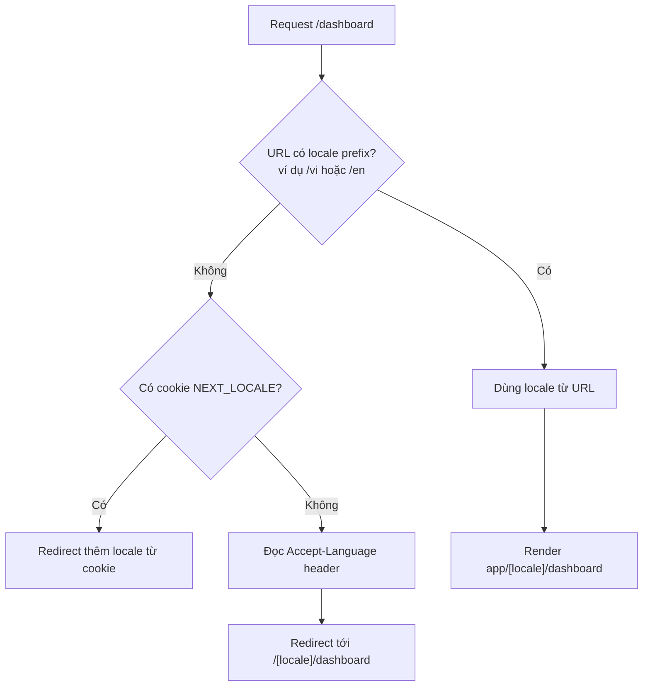

# Internationalization (i18n)

**i18n** (internationalization — đa ngôn ngữ) là việc xây dựng ứng dụng để có thể hiển thị nhiều ngôn ngữ và định dạng theo từng vùng (ngày tháng, tiền tệ...). Trong Next.js, bạn thường dùng **locale** (mã ngôn ngữ/vùng, ví dụ `vi`, `en`) gắn vào URL để chọn nội dung phù hợp cho người dùng. Bài này giới thiệu khái niệm i18n và cách triển khai đa ngôn ngữ cho người mới học.

[](pathname:///img/nextjs/i18n.webp)

---

:::note[Ghi nhớ nhanh]

- ⭐ **App Router KHÔNG có i18n built-in** (khác Pages Router) — phải dùng thư viện; `next-intl` được khuyến nghị vì hỗ trợ TS tốt nhất và cả Server lẫn Client Component.
- ⭐ **URL theo locale bằng subpath** (`/vi`, `/en`) — đơn giản, SEO tốt; tách chuỗi ra file `messages/[locale].json` theo key.
- **`useTranslations` và `useFormatter`** của next-intl — lấy chuỗi dịch và format số/ngày/tiền theo locale.
- **Format qua `Intl` API chuẩn web** — `Intl.DateTimeFormat`, `Intl.NumberFormat`, `Intl.RelativeTimeFormat`, `Intl.PluralRules`; next-intl bọc lại các API này.
- **Dynamic locale loading** — `import(\`./messages/${locale}.json\`)` chỉ load file cần, giảm bundle mỗi user.
- **RTL và SEO** — set `dir` trên `<html>`, dùng Tailwind logical properties (`ms-*`, `ps-*`), thêm hreflang tag và sitemap per locale.

:::

---

## Mục lục

- [Vì sao cần i18n?](#vì-sao-cần-i18n)
- [Khái niệm i18n](#khái-niệm-i18n)
- [Cấu trúc URL i18n](#cấu-trúc-url-i18n)
- [next-intl (khuyến nghị)](#next-intl-khuyến-nghị)
- [Dynamic Locale Loading](#dynamic-locale-loading)
- [Date, number, plural](#date-number-plural)
- [Câu hỏi phỏng vấn](#câu-hỏi-phỏng-vấn)

---

## Vì sao cần i18n?

**Vấn đề:** Viết cứng (hardcode) chữ tiếng Việt/Anh thẳng vào component thì không phục vụ được người dùng nhiều ngôn ngữ. Số, ngày, tiền tệ mỗi vùng định dạng khác nhau, và SEO đa ngôn ngữ cần URL theo locale. Sửa tay cho từng ngôn ngữ là bất khả thi.

```tsx
function ProductPage() {
  return (
    <main>
      <h1>Sản phẩm nổi bật</h1>
      <p>Giá: 1234567 VND</p>
      <p>Ngày đăng: 5/5/2026</p>
      {/* Người dùng tiếng Anh không đọc được, giá/ngày sai định dạng vùng */}
    </main>
  );
}
```

**Giải pháp:** Dùng **i18n** (internationalization) — tách chuỗi ra file dịch theo locale, chọn ngôn ngữ theo URL/cookie/header, format số-ngày theo locale qua `Intl`, và routing theo locale (`/en`, `/vi`). Next.js hỗ trợ routing locale kết hợp thư viện như `next-intl`.

```tsx
import { useTranslations, useFormatter } from "next-intl";

function ProductPage() {
  const t = useTranslations("product");
  const format = useFormatter();

  return (
    <main>
      <h1>{t("featured")}</h1>
      <p>{format.number(1234567, { style: "currency", currency: "VND" })}</p>
      <p>{format.dateTime(new Date(), { dateStyle: "long" })}</p>
      {/* Tự đổi chữ + định dạng theo locale trên URL (/vi, /en) */}
    </main>
  );
}
```

:::tip[Dùng thực tế]

- **Web đa ngôn ngữ** — cùng một codebase phục vụ người dùng nhiều quốc gia.
- **SEO theo URL locale** — `/vi` và `/en` giúp Google index từng phiên bản ngôn ngữ.
- **Format theo vùng** — giá tiền, ngày tháng hiển thị đúng chuẩn của từng nước.
- **Đổi ngôn ngữ runtime** — người dùng chuyển ngôn ngữ ngay trên giao diện.

:::

---

## Khái niệm i18n

**Internationalization (i18n)** — chuẩn bị app cho nhiều ngôn ngữ/quốc gia.
**Localization (l10n)** — translate cho locale cụ thể.

Cần xử lý:

- **Translation strings** — key → text per locale.
- **Plural** — "1 item" vs "2 items" (rule khác mỗi ngôn ngữ).
- **Date/time format** — `DD/MM/YYYY` (VN) vs `MM/DD/YYYY` (US).
- **Number/currency** — `1,234.56` vs `1.234,56`.
- **RTL** — Arabic, Hebrew layout phải đảo.
- **Locale detection** — từ URL, cookie, browser header.

App Router **không có built-in i18n** (Pages Router có). Phải dùng thư
viện.

---

## Cấu trúc URL i18n

**Subpath** (phổ biến):

```
/en/dashboard
/vi/dashboard
/fr/dashboard
```

**Subdomain**:

```
en.example.com
vi.example.com
```

**Domain**:

```
example.com (US)
example.vn (Vietnam)
```

Khuyến nghị **subpath** — đơn giản, SEO tốt, không phải config domain.

Luồng chọn locale và redirect khi URL chưa có locale prefix:



---

## next-intl (khuyến nghị)

[next-intl](https://next-intl.dev) — thư viện i18n cho App Router.

```bash
npm install next-intl
```

**Setup**:

```ts
// i18n.ts
import { getRequestConfig } from "next-intl/server";
import { notFound } from "next/navigation";

const locales = ["en", "vi", "ja"];

export default getRequestConfig(async ({ locale }) => {
  if (!locales.includes(locale)) notFound();

  return {
    messages: (await import(`./messages/${locale}.json`)).default,
  };
});
```

**Cấu trúc folder**:

```
app/
├── [locale]/
│   ├── layout.tsx
│   ├── page.tsx
│   └── dashboard/page.tsx
├── i18n.ts
└── messages/
    ├── en.json
    ├── vi.json
    └── ja.json
```

**Message file**:

```json
// messages/vi.json
{
  "home": {
    "title": "Xin chào",
    "description": "Đây là trang chủ"
  },
  "dashboard": {
    "welcome": "Chào mừng {name}",
    "stats": {
      "users": "{count, plural, =0 {Không có} =1 {1 người dùng} other {# người dùng}}"
    }
  }
}
```

**Dùng trong Server Component**:

```tsx
import { useTranslations } from "next-intl";

export default function HomePage() {
  const t = useTranslations("home");

  return (
    <main>
      <h1>{t("title")}</h1>
      <p>{t("description")}</p>
    </main>
  );
}
```

**Dùng trong Client Component**:

```tsx
"use client";
import { useTranslations } from "next-intl";

export default function Counter() {
  const t = useTranslations("dashboard.stats");
  return <p>{t("users", { count: 5 })}</p>; // "5 người dùng"
}
```

:::info[Phân tích]

**next-intl features:**

- **Type-safe** — message key có autocomplete TS.
- **Format** — date, number, currency built-in qua `Intl`.
- **Plural** — ICU MessageFormat.
- **Rich text** — `t.rich("key", { b: chunks => <b>{chunks}</b> })`.
- **Server + Client Components** đều support.
- **Routing helper** — `<Link>` tự thêm locale prefix.

```tsx
import { Link } from "@/navigation"; // re-export từ next-intl

<Link href="/dashboard" locale="vi">Vào</Link>
```

Library alternative:

- **next-i18next** — wrapper cho `i18next` Pages Router.
- **react-intl** — của FormatJS, mature.
- **lingui** — extract message tự động.
- **Paraglide JS** — tree-shake mọi message không dùng.

**next-intl** dominate App Router market 2026 — TS support tốt nhất.

:::

---

## Dynamic Locale Loading

Load message **lazy** theo locale — không bundle hết:

```ts
// i18n.ts
export default getRequestConfig(async ({ locale }) => ({
  messages: (await import(`./messages/${locale}.json`)).default,
}));
```

Dynamic import chỉ load file cần thiết → bundle nhỏ hơn cho từng user.

**Code splitting theo locale**:

```ts
const messages = {
  en: () => import("./messages/en.json"),
  vi: () => import("./messages/vi.json"),
  ja: () => import("./messages/ja.json"),
};

const data = await messages[locale]();
```

Chỉ ~5-10KB JSON load cho user thấy locale của họ.

---

## Date, number, plural

Dùng **Intl API** built-in (web standard):

```ts
// Date
new Intl.DateTimeFormat("vi-VN", {
  dateStyle: "full",
  timeStyle: "short",
}).format(new Date());
// "Thứ Hai, 5 tháng 5, 2026 lúc 14:30"

// Number
new Intl.NumberFormat("vi-VN").format(1234567);
// "1.234.567"

// Currency
new Intl.NumberFormat("vi-VN", {
  style: "currency",
  currency: "VND",
}).format(1234567);
// "1.234.567 ₫"

// Relative time
new Intl.RelativeTimeFormat("vi", { numeric: "auto" }).format(-1, "day");
// "hôm qua"

// Plural rules
new Intl.PluralRules("vi").select(2);
// "other" (tiếng Việt không phân biệt 1 vs nhiều)
```

next-intl wrap các API này:

```tsx
import { useFormatter } from "next-intl";

function Component() {
  const format = useFormatter();

  return (
    <>
      <p>{format.dateTime(new Date(), { dateStyle: "full" })}</p>
      <p>{format.number(1234567, { style: "currency", currency: "VND" })}</p>
      <p>{format.relativeTime(new Date(Date.now() - 60_000))}</p>
    </>
  );
}
```

:::warning[Cần lưu ý]

**RTL languages (Arabic, Hebrew)** cần xử lý layout:

```tsx
// app/[locale]/layout.tsx
import { getLocaleDirection } from "@/utils/locale";

export default async function LocaleLayout({ children, params }) {
  const { locale } = await params;
  const dir = getLocaleDirection(locale); // "ltr" hoặc "rtl"

  return (
    <html lang={locale} dir={dir}>
      <body>{children}</body>
    </html>
  );
}
```

Tailwind CSS có **logical properties** support RTL native:

```jsx
// Cũ — fixed left
<div className="ml-4 pl-2 text-left">

// Mới — logical, tự đảo cho RTL
<div className="ms-4 ps-2 text-start">
```

`ms-4` = margin-inline-start, tự thành margin-left (LTR) hoặc margin-right
(RTL).

:::

:::tip[Mẹo]

**SEO i18n best practices:**

1. **Hreflang tag** trong `<head>`:

```tsx
<link rel="alternate" hrefLang="en" href="https://example.com/en" />
<link rel="alternate" hrefLang="vi" href="https://example.com/vi" />
<link rel="alternate" hrefLang="x-default" href="https://example.com" />
```

2. **Sitemap per locale** — generate qua `next-sitemap` hoặc `app/sitemap.ts`.

3. **`Accept-Language`** header detect locale lần đầu, redirect URL có locale.

4. **Locale trong URL** — không phải query param (`?lang=vi` SEO kém hơn `/vi`).

next-intl handle hầu hết tự động qua middleware.

:::

---

## Câu hỏi phỏng vấn

Những câu thường gặp về chủ đề này. Tự trả lời trước, rồi bấm **Xem đáp án** để đối chiếu.

**1. Phân biệt `i18n` (internationalization) và `l10n` (localization) — mỗi việc do ai làm và gồm những gì?**

<details className="qa">
<summary>Xem đáp án</summary>

| | `i18n` (internationalization) | `l10n` (localization) |
|---|---|---|
| Bản chất | Chuẩn bị app để **có thể** phục vụ nhiều ngôn ngữ/vùng | Tạo nội dung cho **một** locale cụ thể |
| Ai làm | Lập trình viên | Người dịch, biên tập, marketing |
| Làm một lần hay lặp lại | Một lần, cho cả hệ thống | Lặp lại cho mỗi ngôn ngữ mới |
| Gồm những gì | Tách chuỗi ra file theo key, routing theo locale, format qua `Intl`, hỗ trợ RTL, phát hiện locale | Dịch nội dung, chọn cách xưng hô, chỉnh hình ảnh, đơn vị tiền, quy định pháp lý từng nước |

Cách nhớ: i18n là **hạ tầng**, l10n là **nội dung** chạy trên hạ tầng đó. Làm i18n tốt thì thêm một ngôn ngữ mới chỉ là thêm một file `messages/[locale].json` — không phải sửa component. Ngược lại nếu hardcode chữ vào JSX thì mỗi lần l10n đều phải đụng vào code.

</details>

**2. App Router có hỗ trợ `i18n` sẵn như Pages Router không? Điều này thay đổi cách bạn triển khai thế nào?**

<details className="qa">
<summary>Xem đáp án</summary>

Không. Pages Router có cấu hình `i18n` built-in trong `next.config.js` (khai báo `locales`, `defaultLocale`, Next tự lo routing và redirect). **App Router bỏ hẳn phần này** — bạn phải tự dựng hoặc dùng thư viện.

Hệ quả với cách triển khai:

- Tự tạo segment động `app/[locale]/...` và đặt toàn bộ route bên trong.
- Tự viết middleware để phát hiện locale (URL → cookie → `Accept-Language`) và redirect khi URL thiếu prefix.
- Tự lo nạp file dịch, truyền context cho Client Component, format số/ngày.
- Tự xử lý hreflang, sitemap theo locale.

Vì vậy thực tế gần như ai cũng dùng thư viện. `next-intl` được khuyến nghị cho App Router: hỗ trợ TypeScript tốt nhất, chạy được cả Server lẫn Client Component, kèm middleware và `Link` tự thêm locale prefix. Lựa chọn khác: `react-intl`, `lingui`, `Paraglide JS`; còn `next-i18next` vốn dành cho Pages Router.

</details>

**3. So sánh 3 kiểu định tuyến đa ngôn ngữ: subpath (`/vi/...`), subdomain, và domain riêng — trade-off về SEO, hạ tầng và chi phí.**

<details className="qa">
<summary>Xem đáp án</summary>

| | Subpath `/vi/...` | Subdomain `vi.example.com` | Domain riêng `example.vn` |
|---|---|---|---|
| Hạ tầng | Một app, một domain — đơn giản nhất | Cần DNS + chứng chỉ wildcard | Mỗi nước một domain, hosting/DNS riêng |
| Chi phí | Thấp | Trung bình | Cao (mua và duy trì nhiều domain) |
| SEO | Dồn toàn bộ uy tín về một domain | Uy tín bị chia theo subdomain | Tín hiệu địa phương mạnh nhất, nhưng xây uy tín lại từ đầu |
| Cookie / phiên | Chia sẻ dễ dàng | Cần cấu hình domain cookie | Không chia sẻ được |

Khuyến nghị mặc định là **subpath**: đơn giản, SEO tốt, không phải cấu hình domain, và hợp tự nhiên với cấu trúc `app/[locale]/...`. Subdomain hợp khi mỗi thị trường có team và nội dung tách biệt. Domain riêng chỉ đáng khi công ty thực sự vận hành theo từng quốc gia (pháp lý, thanh toán, thương hiệu khác nhau). Kiểu nào cũng cần hreflang để công cụ tìm kiếm biết các phiên bản là của nhau.

</details>

**4. Vì sao đặt locale trong URL tốt hơn dùng query param (`?lang=vi`) hoặc chỉ lưu trong cookie?**

<details className="qa">
<summary>Xem đáp án</summary>

Vì URL là thứ duy nhất mà công cụ tìm kiếm, người dùng và tầng cache đều nhìn thấy như nhau:

- **SEO** — mỗi locale cần một URL riêng, ổn định để Google index. Nếu ngôn ngữ nằm trong cookie thì cùng một URL trả nội dung khác nhau tuỳ người truy cập, bot chỉ index được một bản. Query param `?lang=vi` được coi là biến thể của cùng một trang, dễ bị gộp hoặc bỏ qua, và khó khai báo hreflang sạch sẽ.
- **Chia sẻ link** — copy `/vi/dashboard` gửi cho ai cũng ra đúng bản tiếng Việt.
- **Caching và static generation** — path khác nhau là key cache khác nhau, có thể prerender từng locale. Cookie khiến response phải `Vary` theo cookie, gần như vô hiệu hoá cache CDN.

Cookie `NEXT_LOCALE` vẫn hữu ích, nhưng đúng vai trò của nó là **ghi nhớ lựa chọn** để lần sau redirect người dùng tới đúng prefix — không phải nơi quyết định nội dung render.

</details>

**5. Mô tả luồng phát hiện locale khi người dùng vào `/dashboard` không có prefix: thứ tự ưu tiên giữa URL, cookie `NEXT_LOCALE` và header `Accept-Language`.**

<details className="qa">
<summary>Xem đáp án</summary>

Thứ tự ưu tiên từ rõ ràng nhất tới suy đoán nhất:

1. **URL** — nếu path đã có prefix hợp lệ (`/vi/dashboard`) thì dùng luôn, không hỏi gì thêm. Đây là ý định tường minh của người dùng.
2. **Cookie `NEXT_LOCALE`** — người dùng từng chủ động chọn ngôn ngữ trước đó, tôn trọng lựa chọn đó và redirect sang prefix tương ứng.
3. **Header `Accept-Language`** — trình duyệt gửi danh sách ngôn ngữ ưu tiên; đối chiếu với danh sách locale hỗ trợ để chọn bản khớp nhất.
4. **`defaultLocale`** — không khớp gì thì rơi về mặc định.

Kết quả là một redirect tới `/[locale]/dashboard`, đồng thời set lại cookie để lần sau đỡ phải đoán. Việc này làm trong middleware, và `next-intl` cung cấp sẵn middleware xử lý gần như tự động. Hai lưu ý: redirect nên dùng mã tạm (307) chứ đừng 308 vĩnh viễn vì kết quả phụ thuộc người dùng, và khi chọn ngôn ngữ trên giao diện phải ghi đè cookie chứ không chỉ đổi URL.

</details>

**6. Cấu trúc thư mục `app/[locale]/...` hoạt động ra sao? Vai trò của `generateStaticParams` với danh sách locale là gì?**

<details className="qa">
<summary>Xem đáp án</summary>

`[locale]` là một dynamic segment bọc ngoài toàn bộ route, nên mọi trang đều nằm dưới nó:

```
app/
├── [locale]/
│   ├── layout.tsx
│   ├── page.tsx
│   └── dashboard/page.tsx
└── messages/{en,vi,ja}.json
```

Layout nhận `params` để biết locale hiện tại, dùng nó set `lang` và `dir` trên thẻ html, đồng thời nạp đúng file dịch và cung cấp cho cây component bên dưới.

`generateStaticParams` khai báo trước danh sách locale hợp lệ:

```tsx
export function generateStaticParams() {
  return ["en", "vi", "ja"].map((locale) => ({ locale }));
}
```

Tác dụng: Next prerender sẵn từng bản ngôn ngữ ở thời điểm build thay vì render động theo request — nhanh hơn, cache tốt hơn. Nó cũng đóng vai trò whitelist: locale lạ không nằm trong danh sách thì nên gọi `notFound()` để `/xx/dashboard` trả 404 thay vì vỡ ở bước nạp file dịch.

</details>

**7. `next-intl` giải quyết những gì mà tự viết tay sẽ khó? Nó phối hợp với middleware như thế nào?**

<details className="qa">
<summary>Xem đáp án</summary>

Những phần tự viết rất tốn công mà thư viện lo sẵn:

- **Type-safe message key** — autocomplete và báo lỗi khi gõ sai key, thứ gần như không thể tự dựng gọn gàng.
- **ICU MessageFormat** — số nhiều, giống, lựa chọn theo điều kiện, nội suy biến.
- **Format qua `Intl`** — `useFormatter` bọc `DateTimeFormat`, `NumberFormat`, `RelativeTimeFormat`.
- **Rich text** — chèn thẻ vào chuỗi dịch an toàn qua `t.rich`.
- **Chạy được ở cả Server và Client Component**, tự lo truyền message qua ranh giới đó.
- **Routing helper** — `Link` và các hàm điều hướng tự gắn locale prefix.

Với middleware: `next-intl` cung cấp middleware đọc path, nếu thiếu locale prefix thì chọn locale theo cookie `NEXT_LOCALE` rồi `Accept-Language` và redirect tới `/[locale]/...`, đồng thời set lại cookie. Phía server, `getRequestConfig` trong `i18n.ts` nhận locale đó và `import()` đúng file `messages/[locale].json`, gọi `notFound()` nếu locale không hợp lệ.

</details>

**8. Dùng chuỗi dịch trong Server Component và trong Client Component khác nhau ra sao? Vì sao khác biệt này quan trọng cho bundle size?**

<details className="qa">
<summary>Xem đáp án</summary>

Về cú pháp `next-intl` cố tình làm giống nhau — cùng gọi `useTranslations`:

```tsx
// Server Component — chạy trên server, chuỗi được nội suy thẳng vào HTML
export default function HomePage() {
  const t = useTranslations("home");
  return <h1>{t("title")}</h1>;
}

// Client Component — cần "use client" và message phải có ở phía client
"use client";
export default function Counter() {
  const t = useTranslations("dashboard.stats");
  return <p>{t("users", { count: 5 })}</p>;
}
```

Khác biệt nằm ở **nơi message tồn tại**. Ở Server Component, toàn bộ file dịch chỉ nằm trên server; trình duyệt chỉ nhận HTML đã dịch xong, bundle JS không tăng. Ở Client Component, message phải được gửi kèm xuống client để render lại và xử lý tương tác.

Vì vậy nguyên tắc tối ưu: dịch càng nhiều ở Server Component càng tốt, và khi buộc phải dùng Client Component thì chỉ truyền đúng namespace cần thiết thay vì cả file dịch.

</details>

**9. `dynamic locale loading` bằng `import()` giúp gì? Nếu load tất cả file dịch ngay từ đầu thì hậu quả là gì?**

<details className="qa">
<summary>Xem đáp án</summary>

`import()` động khiến bundler tách mỗi file dịch thành một chunk riêng, chỉ nạp đúng chunk của locale đang dùng:

```ts
export default getRequestConfig(async ({ locale }) => ({
  messages: (await import(`./messages/${locale}.json`)).default,
}));
```

Người dùng tiếng Việt chỉ tải `vi.json` (cỡ vài KB đến chục KB), không kéo theo `en.json`, `ja.json` và mọi ngôn ngữ khác.

Nếu `import` tĩnh toàn bộ ngay từ đầu thì mọi file dịch bị gộp vào bundle: kích thước tăng tuyến tính theo số ngôn ngữ — 10 locale là gấp khoảng 10 lần dung lượng phần dịch, dù người dùng chỉ đọc được một. Hậu quả là thời gian tải và parse JS tăng, chỉ số Core Web Vitals xấu đi, và càng thêm ngôn ngữ thì mọi người dùng càng chậm. Có thể tách nhỏ hơn nữa theo namespace nếu file dịch lớn, để trang nào chỉ nạp phần chuỗi nó cần.

</details>

**10. Vì sao nên dùng `Intl.DateTimeFormat` / `Intl.NumberFormat` thay vì tự format ngày và tiền tệ theo chuỗi?**

<details className="qa">
<summary>Xem đáp án</summary>

Vì quy ước định dạng khác nhau theo từng vùng nhiều hơn ta tưởng, và `Intl` là API chuẩn web đã gói sẵn dữ liệu CLDR cho tất cả:

```ts
new Intl.NumberFormat("vi-VN").format(1234567);            // "1.234.567"
new Intl.NumberFormat("vi-VN", { style: "currency", currency: "VND" })
  .format(1234567);                                        // "1.234.567 ₫"
new Intl.DateTimeFormat("vi-VN", { dateStyle: "full" }).format(new Date());
new Intl.RelativeTimeFormat("vi", { numeric: "auto" }).format(-1, "day"); // "hôm qua"
```

Tự viết sẽ vấp hàng loạt chi tiết: dấu phân cách nghìn là chấm hay phẩy, thứ tự `DD/MM` hay `MM/DD`, ký hiệu tiền đứng trước hay sau, số chữ số thập phân theo từng đơn vị tiền, tên thứ và tháng, múi giờ, lịch không phải Gregorian. Ngoài ra `Intl` chạy native nên nhanh, không tốn bundle, và `next-intl` bọc lại qua `useFormatter` để dùng cho tiện. Mẹo nhỏ: nên tạo formatter một lần rồi tái sử dụng vì khởi tạo khá tốn.

</details>

**11. Quy tắc số nhiều (`plural`) khác nhau giữa các ngôn ngữ ra sao? `ICU message format` xử lý việc này thế nào?**

<details className="qa">
<summary>Xem đáp án</summary>

Mỗi ngôn ngữ chia số lượng thành các "dạng" khác nhau: tiếng Việt chỉ có một dạng (`other`), tiếng Anh có hai (`one`/`other`), tiếng Nga và tiếng Ả Rập có nhiều dạng hơn hẳn. Vì vậy logic kiểu `count === 1 ? "item" : "items"` viết cứng trong code sẽ sai ngay khi thêm ngôn ngữ mới — đó là quyết định thuộc về **bản dịch**, không thuộc về code.

ICU MessageFormat đưa quy tắc đó vào chính chuỗi dịch:

```json
{
  "users": "{count, plural, =0 {Không có} =1 {1 người dùng} other {# người dùng}}"
}
```

Code chỉ truyền dữ liệu: `t("users", { count: 5 })`. Trong đó `#` được thay bằng số đã format theo locale, `=0`/`=1` là khớp giá trị chính xác, còn `one`/`few`/`many`/`other` là các category do `Intl.PluralRules` quyết định theo ngôn ngữ. Người dịch tiếng Nga tự thêm đủ nhánh cần thiết mà không cần lập trình viên sửa gì. Muốn kiểm tra nhanh một ngôn ngữ rơi vào dạng nào, dùng `new Intl.PluralRules("vi").select(2)`.

</details>

**12. Xử lý chuỗi có biến và HTML lồng bên trong (`interpolation`, rich text) an toàn ra sao khi dịch?**

<details className="qa">
<summary>Xem đáp án</summary>

Với biến, dùng placeholder đặt tên trong file dịch chứ đừng nối chuỗi: `"welcome": "Chào mừng {name}"` rồi gọi `t("welcome", { name })`. Nối chuỗi thủ công phá vỡ trật tự từ — nhiều ngôn ngữ đảo thứ tự thành phần câu, và người dịch cần thấy cả câu mới dịch đúng.

Với rich text, tuyệt đối không nhét thẻ HTML thô vào file dịch rồi đổ ra bằng `dangerouslySetInnerHTML` — đó là cửa ngõ XSS nếu bản dịch đến từ nguồn ngoài. Cách an toàn là để chuỗi dịch chỉ chứa **tên thẻ trừu tượng**, còn code quyết định thẻ đó render thành gì:

```tsx
// messages: "note": "Đọc <b>kỹ</b> điều khoản"
t.rich("note", { b: (chunks) => <b>{chunks}</b> })
```

Kết quả là React element thật, đã escape nội dung, nên nội dung dịch không thể chèn script. Cách này cũng cho phép ánh xạ cùng một tên thẻ sang component riêng (ví dụ một `Link` nội bộ) mà không sửa bản dịch.

</details>

**13. Hỗ trợ ngôn ngữ `RTL` (Ả Rập, Do Thái) cần làm gì ở tầng HTML và tầng CSS? Vì sao nên dùng logical properties?**

<details className="qa">
<summary>Xem đáp án</summary>

Ở tầng HTML, layout gốc phải khai báo cả ngôn ngữ và chiều viết:

```tsx
export default async function LocaleLayout({ children, params }) {
  const { locale } = await params;
  const dir = getLocaleDirection(locale); // "ltr" hoặc "rtl"
  return (
    <html lang={locale} dir={dir}>
      <body>{children}</body>
    </html>
  );
}
```

Ở tầng CSS, thay thuộc tính cố định theo hướng vật lý bằng **logical properties** — thứ tự theo dòng chữ chứ không theo trái/phải màn hình:

```jsx
<div className="ml-4 pl-2 text-left">   // cũ, luôn dính bên trái
<div className="ms-4 ps-2 text-start">  // mới, tự đảo khi RTL
```

`ms-4` là `margin-inline-start`: thành `margin-left` ở LTR và `margin-right` ở RTL. Lợi ích là **một bộ CSS chạy cho cả hai chiều** — không phải duy trì file override riêng cho RTL, không quên chỗ nào. Ngoài lề và padding, còn phải để ý icon mũi tên, thanh tiến trình, biểu đồ và ảnh có tính hướng; riêng số và đoạn code vẫn giữ chiều LTR.

</details>

**14. `hreflang`, `sitemap` theo locale và thẻ canonical ảnh hưởng thế nào tới SEO đa ngôn ngữ? Thiếu chúng thì rủi ro gì?**

<details className="qa">
<summary>Xem đáp án</summary>

Ba thứ này nói cho công cụ tìm kiếm biết quan hệ giữa các phiên bản ngôn ngữ:

```tsx
<link rel="alternate" hrefLang="en" href="https://example.com/en" />
<link rel="alternate" hrefLang="vi" href="https://example.com/vi" />
<link rel="alternate" hrefLang="x-default" href="https://example.com" />
```

- **hreflang** — khai báo "đây là cùng một trang, bản ngôn ngữ khác", để Google phục vụ đúng bản cho từng người tìm kiếm. Phải khai báo **hai chiều** (trang nào cũng trỏ tới tất cả các bản, kể cả chính nó) và nên có `x-default` cho trường hợp không khớp.
- **Sitemap theo locale** — liệt kê đủ URL mọi ngôn ngữ để bot phát hiện được, tạo qua `app/sitemap.ts` hoặc `next-sitemap`.
- **Canonical** — mỗi bản ngôn ngữ tự trỏ canonical về chính nó, tránh trỏ hết về bản tiếng Anh (làm các bản còn lại biến mất khỏi index).

Thiếu chúng thì bot có thể coi các bản là **nội dung trùng lặp**, chỉ index một ngôn ngữ, hiển thị sai bản trong kết quả tìm kiếm, và các thị trường mới gần như không có lưu lượng tự nhiên.

</details>

**15. Locale khác nhau ảnh hưởng ra sao tới caching và static generation? Một trang có 10 locale thì build ra bao nhiêu bản?**

<details className="qa">
<summary>Xem đáp án</summary>

Vì locale nằm trong URL nên mỗi ngôn ngữ là một path riêng, và path chính là khoá của cache lẫn của static generation. Một trang với 10 locale sẽ prerender thành **10 file HTML** — `/en/about`, `/vi/about`, ... — mỗi bản cache độc lập trên CDN. Nhân tiếp với số trang động: 10 locale × 100 bài viết là 1000 trang tĩnh, nên thời gian build và dung lượng output tăng theo tích số. Khi số này quá lớn, giải pháp là chỉ `generateStaticParams` cho các locale/trang phổ biến rồi để phần còn lại render theo yêu cầu và cache dần.

Đây cũng là lý do không nên chọn locale theo cookie hay `Accept-Language` ở tầng render: response khi đó phải `Vary` theo cookie/header, mỗi biến thể là một entry cache khác nhau và tỷ lệ trúng cache tụt hẳn. Đặt locale trong URL giữ cho mọi tầng cache đơn giản và dự đoán được.

</details>

**16. Chiến lược fallback khi thiếu key dịch ở một locale là gì, và làm sao phát hiện key thiếu trước khi lên production?**

<details className="qa">
<summary>Xem đáp án</summary>

Chiến lược fallback theo thứ tự: dùng bản dịch của **locale gần nhất** (ví dụ `vi-VN` thiếu thì lấy `vi`), rồi tới **`defaultLocale`**, cuối cùng mới hiện chính key. Nguyên tắc là **không bao giờ để trống hoặc vỡ trang** chỉ vì thiếu một chuỗi — người dùng thấy câu tiếng Anh vẫn hơn thấy khoảng trắng. Ở môi trường phát triển thì nên làm ngược lại: ném lỗi hoặc log to để lập trình viên thấy ngay.

Phát hiện sớm trước production:

- **Kiểu dữ liệu từ file dịch gốc** — `next-intl` cho phép khai báo type của message, gõ sai key là lỗi TypeScript ngay khi build.
- **Script so khớp key** giữa các file `messages/*.json`, chạy trong CI và fail khi có key lệch.
- **Công cụ trích xuất** như `lingui` tự quét code và liệt kê chuỗi chưa dịch.
- **Báo cáo runtime** — gom sự kiện thiếu key trên staging gửi về hệ thống log.

</details>

**17. Khi thêm ngôn ngữ mới vào dự án đang chạy, bạn cần đụng tới những phần nào (routing, middleware, file dịch, SEO, build)?**

<details className="qa">
<summary>Xem đáp án</summary>

Nếu i18n đã làm đúng thì đây là một checklist ngắn, không phải sửa component:

- **Danh sách locale** — thêm mã ngôn ngữ vào mảng `locales` dùng chung (`i18n.ts`, middleware, `generateStaticParams`).
- **File dịch** — thêm `messages/<locale>.json`, dịch đủ key; chạy script so khớp key để không sót.
- **Routing và middleware** — kiểm tra locale mới được nhận diện từ `Accept-Language`, `Link` sinh đúng prefix, và không bị `notFound()` do nằm ngoài whitelist.
- **Định dạng** — xác nhận `Intl` hiển thị đúng ngày, số, tiền tệ, quy tắc số nhiều cho ngôn ngữ đó.
- **Hướng viết** — nếu là ngôn ngữ RTL thì cập nhật hàm xác định `dir` và rà lại các chỗ còn dùng thuộc tính trái/phải cứng.
- **SEO** — thêm hreflang cho mọi trang (hai chiều) và bổ sung URL vào sitemap.
- **Build và vận hành** — dự trù số trang tĩnh tăng thêm, kiểm tra thời gian build, rồi thêm ngôn ngữ vào bộ chuyển ngôn ngữ trên giao diện.

</details>
