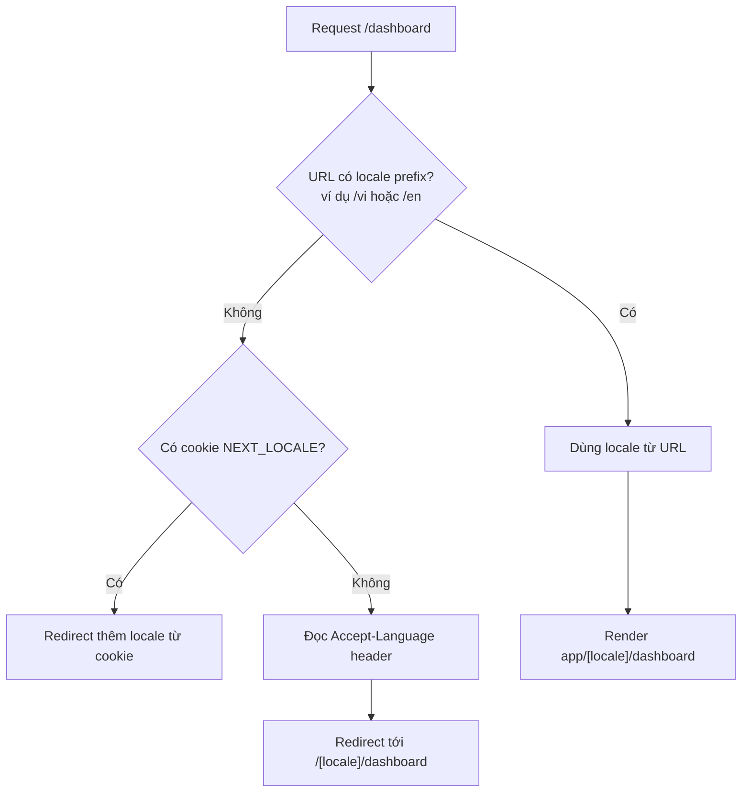

# Internationalization (i18n)

**i18n** (internationalization — đa ngôn ngữ) là việc xây dựng ứng dụng để có thể hiển thị nhiều ngôn ngữ và định dạng theo từng vùng (ngày tháng, tiền tệ...). Trong Next.js, bạn thường dùng **locale** (mã ngôn ngữ/vùng, ví dụ `vi`, `en`) gắn vào URL để chọn nội dung phù hợp cho người dùng. Bài này giới thiệu khái niệm i18n và cách triển khai đa ngôn ngữ cho người mới học.

---

:::note[Ghi nhớ nhanh]

- ⭐ **App Router KHÔNG có i18n built-in** (khác Pages Router) — phải dùng thư viện; `next-intl` được khuyến nghị vì hỗ trợ TS tốt nhất và cả Server lẫn Client Component.
- ⭐ **URL theo locale bằng subpath** (`/vi`, `/en`) — đơn giản, SEO tốt; tách chuỗi ra file `messages/[locale].json` theo key.
- **`useTranslations` và `useFormatter`** của next-intl — lấy chuỗi dịch và format số/ngày/tiền theo locale.
- **Format qua `Intl` API chuẩn web** — `Intl.DateTimeFormat`, `Intl.NumberFormat`, `Intl.RelativeTimeFormat`, `Intl.PluralRules`; next-intl bọc lại các API này.
- **Dynamic locale loading** — `import(\`./messages/${locale}.json\`)` chỉ load file cần, giảm bundle mỗi user.
- **RTL và SEO** — set `dir` trên `<html>`, dùng Tailwind logical properties (`ms-*`, `ps-*`), thêm hreflang tag và sitemap per locale.

:::

---

## Mục lục

- [Vì sao cần i18n?](#vì-sao-cần-i18n)
- [Khái niệm i18n](#khái-niệm-i18n)
- [Cấu trúc URL i18n](#cấu-trúc-url-i18n)
- [next-intl (khuyến nghị)](#next-intl-khuyến-nghị)
- [Dynamic Locale Loading](#dynamic-locale-loading)
- [Date, number, plural](#date-number-plural)
- [Câu hỏi phỏng vấn](#câu-hỏi-phỏng-vấn)

---

## Vì sao cần i18n?

**Vấn đề:** Viết cứng (hardcode) chữ tiếng Việt/Anh thẳng vào component thì không phục vụ được người dùng nhiều ngôn ngữ. Số, ngày, tiền tệ mỗi vùng định dạng khác nhau, và SEO đa ngôn ngữ cần URL theo locale. Sửa tay cho từng ngôn ngữ là bất khả thi.

```tsx
function ProductPage() {
  return (
    <main>
      <h1>Sản phẩm nổi bật</h1>
      <p>Giá: 1234567 VND</p>
      <p>Ngày đăng: 5/5/2026</p>
      {/* Người dùng tiếng Anh không đọc được, giá/ngày sai định dạng vùng */}
    </main>
  );
}
```

**Giải pháp:** Dùng **i18n** (internationalization) — tách chuỗi ra file dịch theo locale, chọn ngôn ngữ theo URL/cookie/header, format số-ngày theo locale qua `Intl`, và routing theo locale (`/en`, `/vi`). Next.js hỗ trợ routing locale kết hợp thư viện như `next-intl`.

```tsx
import { useTranslations, useFormatter } from "next-intl";

function ProductPage() {
  const t = useTranslations("product");
  const format = useFormatter();

  return (
    <main>
      <h1>{t("featured")}</h1>
      <p>{format.number(1234567, { style: "currency", currency: "VND" })}</p>
      <p>{format.dateTime(new Date(), { dateStyle: "long" })}</p>
      {/* Tự đổi chữ + định dạng theo locale trên URL (/vi, /en) */}
    </main>
  );
}
```

:::tip[Dùng thực tế]

- **Web đa ngôn ngữ** — cùng một codebase phục vụ người dùng nhiều quốc gia.
- **SEO theo URL locale** — `/vi` và `/en` giúp Google index từng phiên bản ngôn ngữ.
- **Format theo vùng** — giá tiền, ngày tháng hiển thị đúng chuẩn của từng nước.
- **Đổi ngôn ngữ runtime** — người dùng chuyển ngôn ngữ ngay trên giao diện.

:::

---

## Khái niệm i18n

**Internationalization (i18n)** — chuẩn bị app cho nhiều ngôn ngữ/quốc gia.
**Localization (l10n)** — translate cho locale cụ thể.

Cần xử lý:

- **Translation strings** — key → text per locale.
- **Plural** — "1 item" vs "2 items" (rule khác mỗi ngôn ngữ).
- **Date/time format** — `DD/MM/YYYY` (VN) vs `MM/DD/YYYY` (US).
- **Number/currency** — `1,234.56` vs `1.234,56`.
- **RTL** — Arabic, Hebrew layout phải đảo.
- **Locale detection** — từ URL, cookie, browser header.

App Router **không có built-in i18n** (Pages Router có). Phải dùng thư
viện.

---

## Cấu trúc URL i18n

**Subpath** (phổ biến):

```
/en/dashboard
/vi/dashboard
/fr/dashboard
```

**Subdomain**:

```
en.example.com
vi.example.com
```

**Domain**:

```
example.com (US)
example.vn (Vietnam)
```

Khuyến nghị **subpath** — đơn giản, SEO tốt, không phải config domain.

Luồng chọn locale và redirect khi URL chưa có locale prefix:



---

## next-intl (khuyến nghị)

[next-intl](https://next-intl.dev) — thư viện i18n cho App Router.

```bash
npm install next-intl
```

**Setup**:

```ts
// i18n.ts
import { getRequestConfig } from "next-intl/server";
import { notFound } from "next/navigation";

const locales = ["en", "vi", "ja"];

export default getRequestConfig(async ({ locale }) => {
  if (!locales.includes(locale)) notFound();

  return {
    messages: (await import(`./messages/${locale}.json`)).default,
  };
});
```

**Cấu trúc folder**:

```
app/
├── [locale]/
│   ├── layout.tsx
│   ├── page.tsx
│   └── dashboard/page.tsx
├── i18n.ts
└── messages/
    ├── en.json
    ├── vi.json
    └── ja.json
```

**Message file**:

```json
// messages/vi.json
{
  "home": {
    "title": "Xin chào",
    "description": "Đây là trang chủ"
  },
  "dashboard": {
    "welcome": "Chào mừng {name}",
    "stats": {
      "users": "{count, plural, =0 {Không có} =1 {1 người dùng} other {# người dùng}}"
    }
  }
}
```

**Dùng trong Server Component**:

```tsx
import { useTranslations } from "next-intl";

export default function HomePage() {
  const t = useTranslations("home");

  return (
    <main>
      <h1>{t("title")}</h1>
      <p>{t("description")}</p>
    </main>
  );
}
```

**Dùng trong Client Component**:

```tsx
"use client";
import { useTranslations } from "next-intl";

export default function Counter() {
  const t = useTranslations("dashboard.stats");
  return <p>{t("users", { count: 5 })}</p>; // "5 người dùng"
}
```

:::info[Phân tích]

**next-intl features:**

- **Type-safe** — message key có autocomplete TS.
- **Format** — date, number, currency built-in qua `Intl`.
- **Plural** — ICU MessageFormat.
- **Rich text** — `t.rich("key", { b: chunks => <b>{chunks}</b> })`.
- **Server + Client Components** đều support.
- **Routing helper** — `<Link>` tự thêm locale prefix.

```tsx
import { Link } from "@/navigation"; // re-export từ next-intl

<Link href="/dashboard" locale="vi">Vào</Link>
```

Library alternative:

- **next-i18next** — wrapper cho `i18next` Pages Router.
- **react-intl** — của FormatJS, mature.
- **lingui** — extract message tự động.
- **Paraglide JS** — tree-shake mọi message không dùng.

**next-intl** dominate App Router market 2026 — TS support tốt nhất.

:::

---

## Dynamic Locale Loading

Load message **lazy** theo locale — không bundle hết:

```ts
// i18n.ts
export default getRequestConfig(async ({ locale }) => ({
  messages: (await import(`./messages/${locale}.json`)).default,
}));
```

Dynamic import chỉ load file cần thiết → bundle nhỏ hơn cho từng user.

**Code splitting theo locale**:

```ts
const messages = {
  en: () => import("./messages/en.json"),
  vi: () => import("./messages/vi.json"),
  ja: () => import("./messages/ja.json"),
};

const data = await messages[locale]();
```

Chỉ ~5-10KB JSON load cho user thấy locale của họ.

---

## Date, number, plural

Dùng **Intl API** built-in (web standard):

```ts
// Date
new Intl.DateTimeFormat("vi-VN", {
  dateStyle: "full",
  timeStyle: "short",
}).format(new Date());
// "Thứ Hai, 5 tháng 5, 2026 lúc 14:30"

// Number
new Intl.NumberFormat("vi-VN").format(1234567);
// "1.234.567"

// Currency
new Intl.NumberFormat("vi-VN", {
  style: "currency",
  currency: "VND",
}).format(1234567);
// "1.234.567 ₫"

// Relative time
new Intl.RelativeTimeFormat("vi", { numeric: "auto" }).format(-1, "day");
// "hôm qua"

// Plural rules
new Intl.PluralRules("vi").select(2);
// "other" (tiếng Việt không phân biệt 1 vs nhiều)
```

next-intl wrap các API này:

```tsx
import { useFormatter } from "next-intl";

function Component() {
  const format = useFormatter();

  return (
    <>
      <p>{format.dateTime(new Date(), { dateStyle: "full" })}</p>
      <p>{format.number(1234567, { style: "currency", currency: "VND" })}</p>
      <p>{format.relativeTime(new Date(Date.now() - 60_000))}</p>
    </>
  );
}
```

:::warning[Cần lưu ý]

**RTL languages (Arabic, Hebrew)** cần xử lý layout:

```tsx
// app/[locale]/layout.tsx
import { getLocaleDirection } from "@/utils/locale";

export default async function LocaleLayout({ children, params }) {
  const { locale } = await params;
  const dir = getLocaleDirection(locale); // "ltr" hoặc "rtl"

  return (
    <html lang={locale} dir={dir}>
      <body>{children}</body>
    </html>
  );
}
```

Tailwind CSS có **logical properties** support RTL native:

```jsx
// Cũ — fixed left
<div className="ml-4 pl-2 text-left">

// Mới — logical, tự đảo cho RTL
<div className="ms-4 ps-2 text-start">
```

`ms-4` = margin-inline-start, tự thành margin-left (LTR) hoặc margin-right
(RTL).

:::

:::tip[Mẹo]

**SEO i18n best practices:**

1. **Hreflang tag** trong `<head>`:

```tsx
<link rel="alternate" hrefLang="en" href="https://example.com/en" />
<link rel="alternate" hrefLang="vi" href="https://example.com/vi" />
<link rel="alternate" hrefLang="x-default" href="https://example.com" />
```

2. **Sitemap per locale** — generate qua `next-sitemap` hoặc `app/sitemap.ts`.

3. **`Accept-Language`** header detect locale lần đầu, redirect URL có locale.

4. **Locale trong URL** — không phải query param (`?lang=vi` SEO kém hơn `/vi`).

next-intl handle hầu hết tự động qua middleware.

:::

---

## Câu hỏi phỏng vấn

Những câu thường gặp về chủ đề này. Tự trả lời trước, rồi đối chiếu lại với nội dung phía trên.

1. Phân biệt `i18n` (internationalization) và `l10n` (localization) — mỗi việc do ai làm và gồm những gì?
2. App Router có hỗ trợ `i18n` sẵn như Pages Router không? Điều này thay đổi cách bạn triển khai thế nào?
3. So sánh 3 kiểu định tuyến đa ngôn ngữ: subpath (`/vi/...`), subdomain, và domain riêng — trade-off về SEO, hạ tầng và chi phí.
4. Vì sao đặt locale trong URL tốt hơn dùng query param (`?lang=vi`) hoặc chỉ lưu trong cookie?
5. Mô tả luồng phát hiện locale khi người dùng vào `/dashboard` không có prefix: thứ tự ưu tiên giữa URL, cookie `NEXT_LOCALE` và header `Accept-Language`.
6. Cấu trúc thư mục `app/[locale]/...` hoạt động ra sao? Vai trò của `generateStaticParams` với danh sách locale là gì?
7. `next-intl` giải quyết những gì mà tự viết tay sẽ khó? Nó phối hợp với middleware như thế nào?
8. Dùng chuỗi dịch trong Server Component và trong Client Component khác nhau ra sao? Vì sao khác biệt này quan trọng cho bundle size?
9. `dynamic locale loading` bằng `import()` giúp gì? Nếu load tất cả file dịch ngay từ đầu thì hậu quả là gì?
10. Vì sao nên dùng `Intl.DateTimeFormat` / `Intl.NumberFormat` thay vì tự format ngày và tiền tệ theo chuỗi?
11. Quy tắc số nhiều (`plural`) khác nhau giữa các ngôn ngữ ra sao? `ICU message format` xử lý việc này thế nào?
12. Xử lý chuỗi có biến và HTML lồng bên trong (`interpolation`, rich text) an toàn ra sao khi dịch?
13. Hỗ trợ ngôn ngữ `RTL` (Ả Rập, Do Thái) cần làm gì ở tầng HTML và tầng CSS? Vì sao nên dùng logical properties?
14. `hreflang`, `sitemap` theo locale và thẻ canonical ảnh hưởng thế nào tới SEO đa ngôn ngữ? Thiếu chúng thì rủi ro gì?
15. Locale khác nhau ảnh hưởng ra sao tới caching và static generation? Một trang có 10 locale thì build ra bao nhiêu bản?
16. Chiến lược fallback khi thiếu key dịch ở một locale là gì, và làm sao phát hiện key thiếu trước khi lên production?
17. Khi thêm ngôn ngữ mới vào dự án đang chạy, bạn cần đụng tới những phần nào (routing, middleware, file dịch, SEO, build)?
