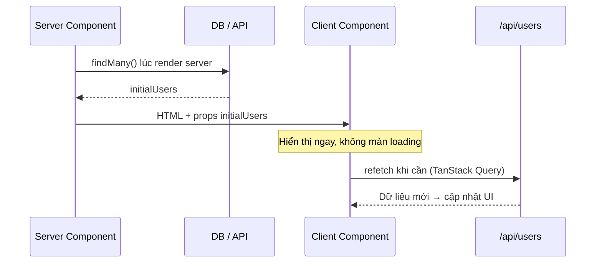

# Fetching Data

**Data fetching** (lấy dữ liệu) là việc ứng dụng truy xuất thông tin từ API, cơ sở dữ liệu hay nguồn bên ngoài để hiển thị lên giao diện. Trong Next.js, bạn có thể lấy dữ liệu ở phía **server** (máy chủ, an toàn và gần nguồn dữ liệu) hoặc phía **client** (trình duyệt người dùng, phù hợp dữ liệu tương tác theo thời gian thực). Bài này giúp người mới hiểu lấy dữ liệu ở đâu và khi nào cho hợp lý.

[](pathname:///img/nextjs/fetching-data.webp)

---

:::note[Ghi nhớ nhanh]

- ⭐ **Server Component có thể `async` và `await fetch` ngay trên server** — dữ liệu sẵn lúc render (tốt SEO), secret/API key không lộ, bundle client bằng 0.
- ⭐ **Chọn nơi fetch theo nhu cầu** — Server cho initial load/SEO/data từ DB; Client (`"use client"`) cho fetch theo tương tác, real-time, optimistic UI.
- **`fetch` được cache/dedupe tự động** — cùng URL trong một request chỉ gọi API một lần (React `cache()` + Next.js dedup).
- **Client fetching nên dùng TanStack Query** — tự lo cache, refetch, retry, dedupe thay vì `useState`/`useEffect` thủ công.
- **Pattern hybrid** — Server fetch `initialData` truyền xuống Client Component để có ngay nội dung rồi client refresh sau (vừa SEO vừa real-time).
- **Option `cache`/`next` chỉ chạy phía server** — trong Client Component `fetch` là native, không có `next.revalidate`.

:::

---

## Mục lục

- [Vì sao fetch dữ liệu trong Next khác React thuần?](#vì-sao-fetch-dữ-liệu-trong-next-khác-react-thuần)
- [Server vs Client fetching](#server-vs-client-fetching)
- [Fetch trong Server Components](#fetch-trong-server-components)
- [Fetch trong Client Components](#fetch-trong-client-components)
- [Khi nào fetch ở đâu?](#khi-nào-fetch-ở-đâu)
- [Câu hỏi phỏng vấn](#câu-hỏi-phỏng-vấn)

---

## Vì sao fetch dữ liệu trong Next khác React thuần?

**Vấn đề:**

```tsx
// React thuần — fetch trong useEffect ở phía client
"use client";

import { useState, useEffect } from "react";

export default function UsersPage() {
  const [users, setUsers] = useState([]);

  useEffect(() => {
    // Chỉ chạy SAU khi browser tải xong JS
    fetch("https://api.example.com/users", {
      headers: { Authorization: "Bearer SECRET_KEY" }, // lộ xuống client!
    })
      .then(r => r.json())
      .then(setUsers);
  }, []);

  return <ul>{users.map(u => <li key={u.id}>{u.name}</li>)}</ul>;
}
```

- Fetch chạy **sau** khi tải JS xuống browser → người dùng thấy màn **loading** trống.
- Dễ sinh **waterfall** (request nối tiếp nhau, chậm dần).
- Logic và **API key bị lộ** xuống client.
- HTML ban đầu rỗng → **SEO kém**.

**Giải pháp:**

```tsx
// Next.js App Router — Server Component async, await fetch NGAY trên server
// app/users/page.tsx
export default async function UsersPage() {
  // Chạy trên server TRƯỚC khi gửi HTML về browser
  const users = await fetch("https://api.example.com/users", {
    headers: { Authorization: `Bearer ${process.env.API_KEY}` }, // an toàn
    next: { revalidate: 60 }, // cache + dedupe tự động
  }).then(r => r.json());

  return <ul>{users.map(u => <li key={u.id}>{u.name}</li>)}</ul>;
}
```

- Server Component có thể là `async` và `await fetch` ngay trên server.
- Dữ liệu **sẵn lúc render** → HTML đã có nội dung (tốt SEO, không lộ secret).
- `fetch` được **cache/dedupe** tự động.
- Mutation dùng **Server Action**, ít JS gửi xuống client.

:::tip[Dùng thực tế]

- **Trang chi tiết sản phẩm**: lấy dữ liệu ngay trong Server Component để HTML có sẵn nội dung cho SEO.
- **Gọi DB trực tiếp**: truy vấn database an toàn ngay trên server, không cần dựng API route trung gian.
- **Dữ liệu ít đổi (tin tức, blog)**: dùng `next: { revalidate }` để cache và làm mới định kỳ.
- **Tạo/sửa/xoá dữ liệu (form)**: dùng Server Action thay cho việc gọi API thủ công từ client.

:::

---

## Server vs Client fetching

| | Server Components | Client Components |
|--|------------------|-------------------|
| Khi nào fetch | Lúc render server | Sau khi mount browser |
| API key/secret | **An toàn** (không lộ) | Phải proxy qua API |
| Database | **Trực tiếp** | Phải qua API |
| Loading state | Suspense | useState + useEffect |
| SEO content | **Có trong HTML** | Không (render sau) |
| Interaction | Không hot reload data | Re-fetch dễ |

---

## Fetch trong Server Components

**Mặc định trong App Router** — page là Server Component:

```tsx
// app/users/page.tsx
export default async function UsersPage() {
  const users = await fetch("https://api.example.com/users", {
    next: { revalidate: 60 },
  }).then(r => r.json());

  return (
    <ul>
      {users.map(u => <li key={u.id}>{u.name}</li>)}
    </ul>
  );
}
```

**Truy cập DB trực tiếp**:

```tsx
import { db } from "@/lib/db";

export default async function UsersPage() {
  const users = await db.user.findMany();
  return /* ... */;
}
```

Không cần API route trung gian — Server Component **chạy server**.

**Parallel fetching**:

```tsx
async function Dashboard() {
  // Sequential — chậm
  const user = await fetchUser();
  const orders = await fetchOrders();
  const stats = await fetchStats();

  // Parallel — nhanh hơn
  const [user, orders, stats] = await Promise.all([
    fetchUser(),
    fetchOrders(),
    fetchStats(),
  ]);
}
```

:::info[Phân tích]

**Server Component có lợi thế**:

1. **Bundle size 0** — code data fetching không vào client JS.
2. **Database access** trực tiếp, không qua HTTP.
3. **Secret safe** — `process.env.API_KEY` không lộ.
4. **Streaming** — render dần từng phần qua Suspense.
5. **Memoization** — cùng `fetch` URL trong 1 request được dedupe.

```tsx
// Hai component cùng fetch URL → chỉ gọi API 1 lần
async function Header() {
  const user = await fetch("/api/user").then(r => r.json());
  return <p>Hi {user.name}</p>;
}

async function Profile() {
  const user = await fetch("/api/user").then(r => r.json()); // dedupe
  return <p>Email: {user.email}</p>;
}

// Cùng trong page → 1 HTTP call, share result
function Page() {
  return <><Header /><Profile /></>;
}
```

Đây là **React `cache()`** + Next.js fetch dedup built-in.

:::

---

## Fetch trong Client Components

Dùng khi:

- Data **thay đổi sau interaction** (filter, search).
- **Real-time** — polling, WebSocket.
- **User-specific** sau khi authenticate client-side.

```tsx
"use client";

import { useState, useEffect } from "react";

export default function UserDashboard() {
  const [users, setUsers] = useState([]);
  const [loading, setLoading] = useState(true);

  useEffect(() => {
    fetch("/api/users")
      .then(r => r.json())
      .then(data => {
        setUsers(data);
        setLoading(false);
      });
  }, []);

  if (loading) return <Spinner />;
  return <ul>{users.map(u => <li key={u.id}>{u.name}</li>)}</ul>;
}
```

**TanStack Query** (khuyến nghị) cho Client Component:

```tsx
"use client";

import { useQuery } from "@tanstack/react-query";

export default function UserDashboard() {
  const { data: users, isLoading } = useQuery({
    queryKey: ["users"],
    queryFn: () => fetch("/api/users").then(r => r.json()),
  });

  if (isLoading) return <Spinner />;
  return <ul>{users.map(u => <li key={u.id}>{u.name}</li>)}</ul>;
}
```

TanStack Query lo: cache, refetch, retry, dedupe.

---

## Khi nào fetch ở đâu?

**Quy tắc 2026:**

```
Server Components (default):
- Page initial load.
- SEO content.
- Data từ DB.
- Server-only API (có secret).

Client Components ("use client"):
- Interaction-driven fetch (filter, search).
- Real-time (polling, WebSocket).
- Optimistic UI update.
- Cần useState/useEffect/hook.
```

:::tip[Mẹo]

**Pattern hybrid** — Server fetch initial + Client refresh:

```tsx
// app/users/page.tsx (Server Component)
export default async function UsersPage() {
  const initialUsers = await db.user.findMany(); // SSR/SSG initial

  return <UserListClient initialUsers={initialUsers} />;
}
```

```tsx
// app/users/UserListClient.tsx
"use client";

import { useQuery } from "@tanstack/react-query";

export default function UserListClient({ initialUsers }) {
  const { data: users } = useQuery({
    queryKey: ["users"],
    queryFn: () => fetch("/api/users").then(r => r.json()),
    initialData: initialUsers, // dùng server data làm initial
  });

  return /* ... */;
}
```

Luồng dữ liệu của pattern này:



Lợi ích:

- Page load nhanh (Server initial).
- Sau đó client refresh tự do (TanStack Query manage).
- SEO + interaction đồng thời.

Pattern này phổ biến trong app vừa cần SEO vừa real-time (e-commerce
product listing, news feed).

:::

:::warning[Cần lưu ý]

**`fetch` extension trong Next.js** thay vì native:

```ts
fetch(url, {
  // Web standard
  method: "GET",
  headers: { ... },
  body: JSON.stringify({ ... }),

  // Next.js extension
  cache: "no-store" | "force-cache",
  next: {
    revalidate: 60,           // ISR
    tags: ["users"],          // tag để revalidateTag
  },
});
```

Next.js override `fetch` global → mọi `fetch` tự động có cache layer. Các
option `cache` và `next` chỉ work trong Server Components / Route Handler.

Trong Client Component, `fetch` là native — không có `next.revalidate`.

:::

:::info[Phân tích]

**Caching layers trong Next.js**:

```
Request → Fetch Cache → Server Cache (Memoization)
                ↓              ↓
        Data Cache       Full Route Cache
        (revalidate)     (per route)
                ↓
            Client Cache (Router Cache)
```

1. **Fetch Cache** — `fetch()` data cache theo URL.
2. **Memoization** — trong 1 render, cùng fetch chỉ chạy 1 lần.
3. **Data Cache** — persist giữa request, revalidate theo tag/path.
4. **Full Route Cache** — pre-rendered HTML.
5. **Router Cache** — client-side, navigation nhanh.

Đây là điểm phức tạp nhất App Router. Hiểu rõ giúp:

- Debug "tại sao data không update".
- Tối ưu performance.
- Quyết định revalidate strategy.

Sẽ học chi tiết ở phần Caching.

:::

---

## Câu hỏi phỏng vấn

Những câu thường gặp về chủ đề này. Tự trả lời trước, rồi bấm **Xem đáp án** để đối chiếu.

**1. Vì sao trong App Router một Server Component có thể là `async` và `await fetch` trực tiếp? Điều gì làm được điều đó?**

<details className="qa">
<summary>Xem đáp án</summary>

Vì Server Component **chỉ chạy trên server** và chỉ chạy một lần cho mỗi request — nó không tham gia vòng đời render lại ở client, không có state, không có effect. Nhờ vậy React có thể chờ một Promise hoàn tất rồi mới sinh ra output, thay vì phải trả về ngay lập tức như component client.

```tsx
export default async function UsersPage() {
  const users = await fetch("https://api.example.com/users", {
    next: { revalidate: 60 },
  }).then(r => r.json());

  return <ul>{users.map(u => <li key={u.id}>{u.name}</li>)}</ul>;
}
```

Kết quả render được serialize thành RSC payload gửi xuống trình duyệt, còn code fetch và secret ở lại server. Ngược lại, Client Component không thể `async` vì nó render đồng bộ nhiều lần và cần trả JSX ngay — ở đó vẫn phải dùng `useEffect` hoặc thư viện như TanStack Query.

</details>

**2. So sánh fetch ở Server Component và ở Client Component theo: bảo mật API key, SEO, thời điểm chạy, và kích thước bundle.**

<details className="qa">
<summary>Xem đáp án</summary>

| Tiêu chí | Server Component | Client Component |
|---|---|---|
| Thời điểm chạy | Lúc render trên server, trước khi gửi HTML | Sau khi trình duyệt tải và chạy xong JS |
| API key / secret | An toàn, `process.env.API_KEY` không rời server | Bị lộ trong bundle — phải proxy qua route handler |
| Database | Query trực tiếp | Bắt buộc đi qua HTTP API |
| SEO | Nội dung có sẵn trong HTML | HTML ban đầu rỗng, bot có thể không thấy |
| Bundle client | Bằng 0 — code fetch không gửi xuống | Cộng thêm code fetch và thư viện |
| Loading state | `<Suspense>` và streaming | `useState` / `isLoading` thủ công |
| Tương tác | Muốn dữ liệu mới phải điều hướng hoặc revalidate | Refetch dễ theo thao tác người dùng |

Nói ngắn: server thắng ở bảo mật, SEO và hiệu năng tải lần đầu; client thắng ở khả năng cập nhật theo tương tác và thời gian thực.

</details>

**3. Khi nào bắt buộc phải fetch ở Client Component thay vì Server Component? Cho ví dụ thực tế.**

<details className="qa">
<summary>Xem đáp án</summary>

Khi dữ liệu phụ thuộc vào thứ chỉ tồn tại trong trình duyệt hoặc phải đổi liên tục mà không muốn đi qua một vòng render server:

- **Fetch theo tương tác** — ô tìm kiếm gợi ý khi gõ, bộ lọc và phân trang phản hồi tức thì, infinite scroll.
- **Real-time** — polling giá, WebSocket cho chat hoặc thông báo, dashboard cập nhật liên tục.
- **Optimistic UI** — bấm "thích" là đổi giao diện ngay rồi mới đồng bộ với server.
- **Dữ liệu phụ thuộc trạng thái client** — vị trí địa lý, kích thước màn hình, dữ liệu trong `localStorage`, hoặc phiên xác thực xử lý phía client.

Ví dụ điển hình: trang danh sách sản phẩm render sẵn ở server cho SEO, nhưng thao tác lọc theo giá và sắp xếp thì gọi API từ client để không phải tải lại cả trang. Với những trường hợp này nên dùng TanStack Query thay vì `useState` + `useEffect` tự viết.

</details>

**4. Server Component có thể query database trực tiếp — lợi ích và những rủi ro cần kiểm soát là gì?**

<details className="qa">
<summary>Xem đáp án</summary>

```tsx
import { db } from "@/lib/db";

export default async function UsersPage() {
  const users = await db.user.findMany();
  return /* ... */;
}
```

Lợi ích: bỏ được một chặng HTML trung gian (không cần dựng route handler chỉ để đọc dữ liệu), giảm độ trễ, giữ kiểu dữ liệu end-to-end từ ORM tới JSX, và chuỗi kết nối không bao giờ rời server.

Rủi ro phải kiểm soát:

- **Phân quyền** — không còn tầng API để kiểm tra, nên mỗi truy vấn phải tự lọc theo người dùng hiện tại, tránh trả nhầm dữ liệu người khác.
- **Rò rỉ dữ liệu qua props** — trả nguyên bản ghi user kèm `passwordHash` rồi truyền xuống Client Component là lộ thật; phải chọn trường cần thiết.
- **Vô tình import vào client** — dùng `import "server-only"` trong module truy cập DB để build báo lỗi ngay nếu bị kéo sang client.
- **Connection pool** — môi trường serverless dễ bùng số kết nối, cần pooler.
- **N+1 query** — render từng item mà mỗi item query riêng sẽ chậm.

</details>

**5. Next.js dedupe/memoize `fetch` như thế nào? Hai component gọi cùng một URL trong một lần render thì có mấy request thật sự đi ra ngoài?**

<details className="qa">
<summary>Xem đáp án</summary>

Chỉ **một** request thật sự đi ra ngoài.

```tsx
async function Header() {
  const user = await fetch("/api/user").then(r => r.json());
  return <p>Hi {user.name}</p>;
}

async function Profile() {
  const user = await fetch("/api/user").then(r => r.json()); // dedupe
  return <p>Email: {user.email}</p>;
}
```

Next.js override `fetch` toàn cục và bọc thêm cơ chế memoization của React: trong phạm vi **một lần render của một request**, các lời gọi trùng nhau (cùng URL và cùng option) chia sẻ chung một Promise, component nào gọi sau chỉ nhận lại kết quả đã có.

Nhờ vậy không cần "kéo dữ liệu lên component cha rồi prop-drill xuống" — mỗi component cứ tự khai báo dữ liệu nó cần, đặt fetch ngay cạnh nơi dùng. Lưu ý phân biệt với **Data Cache**: memoization sống trong một request, còn Data Cache tồn tại xuyên request và điều khiển bằng `revalidate` hay `tags`.

</details>

**6. Nếu dùng ORM hoặc client database (không phải `fetch`), làm sao tránh gọi trùng dữ liệu trong cùng một lần render?**

<details className="qa">
<summary>Xem đáp án</summary>

Cơ chế dedupe tự động chỉ áp dụng cho `fetch`. Với ORM hay driver database, bọc hàm truy vấn bằng `cache()` của React để có memoization tương đương trong phạm vi một request:

```tsx
import { cache } from "react";
import { db } from "@/lib/db";

export const getUser = cache(async (id: string) => {
  return db.user.findUnique({ where: { id } });
});
```

Nhiều component cùng gọi `getUser("u1")` trong một lần render chỉ tạo đúng một truy vấn, các lần sau nhận lại kết quả đã memo. Điều kiện: tham số phải so sánh được theo tham chiếu/giá trị đơn giản, nên truyền id thay vì cả object.

Ngoài ra nên gom các hàm truy vấn vào một lớp "data access" dùng chung, vừa để đặt `cache()` một chỗ, vừa để kiểm tra quyền tập trung. Nếu muốn kết quả tồn tại xuyên nhiều request thì dùng thêm cơ chế cache dữ liệu có `revalidate`/`tags` chứ `cache()` không làm việc đó.

</details>

**7. Giải thích `request waterfall`: nó phát sinh thế nào trong Server Component và làm sao nhận ra trong thực tế?**

<details className="qa">
<summary>Xem đáp án</summary>

Waterfall là chuỗi request nối đuôi nhau: request sau chỉ bắt đầu khi request trước xong, nên tổng thời gian bằng tổng các độ trễ thay vì độ trễ lớn nhất.

```tsx
const user = await fetchUser();     // 300ms
const orders = await fetchOrders(); // 300ms — chờ dòng trên xong vô ích
// tổng ~600ms, dù hai lời gọi không phụ thuộc nhau
```

Trong Server Component nó phát sinh theo hai kiểu: `await` tuần tự trong cùng một component dù các lời gọi độc lập; và **waterfall theo cây component** — component cha `await` xong mới render con, con lại `await` tiếp.

Nhận ra bằng cách: xem thời gian phản hồi của trang lớn bất thường so với từng API riêng lẻ, bật log thời gian quanh mỗi lời gọi, dùng tab Network hoặc trace trên nền tảng triển khai để thấy các thanh thời gian xếp so le thay vì chồng lên nhau. Cách chữa: `Promise.all` cho các lời gọi độc lập, kỹ thuật preload, và tách nhánh chậm vào `<Suspense>` riêng.

</details>

**8. Cách nào để fetch song song trong Server Component? So sánh `Promise.all` và `Promise.allSettled` — khi nào chọn cái nào?**

<details className="qa">
<summary>Xem đáp án</summary>

Khởi tạo tất cả lời gọi trước rồi mới chờ chung một lần:

```tsx
const [user, orders, stats] = await Promise.all([
  fetchUser(),
  fetchOrders(),
  fetchStats(),
]);
```

| | `Promise.all` | `Promise.allSettled` |
|---|---|---|
| Khi một cái lỗi | Reject ngay toàn bộ | Luôn resolve, mỗi phần tử có `status` là `fulfilled` hoặc `rejected` |
| Kết quả trả về | Mảng giá trị | Mảng object mô tả kết quả từng cái |
| Hợp với | Dữ liệu **bắt buộc** phải có đủ mới render được trang | Dữ liệu **phụ**, thiếu một phần vẫn hiển thị được |

Chọn `Promise.all` cho phần cốt lõi của trang — thiếu thì nên rơi vào `error.tsx` luôn. Chọn `allSettled` cho các khối bổ trợ như widget thời tiết, gợi ý sản phẩm, số liệu thống kê: một dịch vụ chết thì chỉ ẩn khối đó chứ không làm sập cả trang. Cả hai đều giảm tổng thời gian về xấp xỉ lời gọi chậm nhất.

</details>

**9. Kỹ thuật `preload` (gọi hàm fetch mà không `await` trước phần việc chặn) hoạt động ra sao và giải quyết vấn đề gì?**

<details className="qa">
<summary>Xem đáp án</summary>

Ý tưởng: gọi hàm lấy dữ liệu để **khởi động** request sớm nhất có thể, chưa `await` ngay, rồi làm việc khác; khi thật sự cần dữ liệu mới `await` thì phần lớn thời gian chờ đã trôi qua song song.

```tsx
export const preloadUser = (id: string) => {
  void getUser(id); // không await — chỉ châm ngòi
};

export default async function Page({ params }) {
  preloadUser(params.id);          // bắt đầu ngay
  const settings = await getSettings(); // chạy song song với getUser
  const user = await getUser(params.id); // thường đã xong, lấy từ memo
}
```

Nó giải quyết **waterfall theo cây component**: component cha có thể kích hoạt sẵn dữ liệu mà component con sẽ cần, thay vì để con chờ tới lượt render mới bắt đầu gọi. Kỹ thuật này dựa vào memoization (dedupe của `fetch` hoặc `cache()`) để lần `await` sau dùng lại đúng Promise đã tạo. Cần bắt lỗi cẩn thận cho lời gọi chưa `await` để tránh unhandled rejection.

</details>

**10. Các option `cache` và `next.revalidate` của `fetch` chỉ có tác dụng ở đâu? Điều gì xảy ra khi bạn dùng chúng trong Client Component?**

<details className="qa">
<summary>Xem đáp án</summary>

Chúng là **phần mở rộng của Next.js** trên `fetch` toàn cục phía server, nên chỉ có tác dụng trong Server Component, route handler, Server Action và các đoạn chạy trên server:

```ts
fetch(url, {
  cache: "no-store",              // hoặc "force-cache"
  next: { revalidate: 60, tags: ["users"] },
});
```

Trong Client Component, `fetch` là API native của trình duyệt. Trình duyệt bỏ qua thuộc tính `next` vì nó không nằm trong chuẩn — không lỗi, không cảnh báo, chỉ đơn giản là **không có tác dụng gì**. Riêng `cache` vẫn là option chuẩn của Fetch API nhưng ý nghĩa thuộc về HTTP cache của trình duyệt, không liên quan Data Cache của Next.

Đây là bẫy hay gặp: viết `next: { revalidate: 60 }` trong component có `"use client"` rồi thắc mắc vì sao dữ liệu không được cache. Ở phía client, việc cache và làm mới phải do thư viện như TanStack Query (`staleTime`, `refetchInterval`) hoặc header HTTP đảm nhiệm.

</details>

**11. Vì sao nên dùng thư viện như TanStack Query cho client fetching thay vì `useState` + `useEffect` thủ công? Nó lo giúp những gì?**

<details className="qa">
<summary>Xem đáp án</summary>

Viết tay bằng `useState` + `useEffect` chỉ xử lý đúng trường hợp lý tưởng, còn bỏ sót rất nhiều tình huống: race condition khi request cũ về sau request mới, không huỷ request khi component unmount, mỗi component tự fetch lại cùng một dữ liệu, không có retry khi mạng chập chờn, không chia sẻ cache giữa các trang.

TanStack Query lo sẵn những phần đó:

```tsx
const { data: users, isLoading } = useQuery({
  queryKey: ["users"],
  queryFn: () => fetch("/api/users").then(r => r.json()),
});
```

- **Cache theo `queryKey`** và chia sẻ giữa mọi component dùng chung key.
- **Dedupe** các lời gọi trùng đang chạy.
- **Refetch** khi cửa sổ được focus, khi mạng trở lại, hoặc theo chu kỳ.
- **Retry** với backoff, quản lý trạng thái `isLoading`/`isError`/`isFetching`.
- **Invalidate** sau mutation và **optimistic update**.
- **Phân trang, infinite query** dựng sẵn.

Kết quả là ít code hơn, ít bug khó tái hiện hơn, và hành vi nhất quán trên toàn app.

</details>

**12. Mô tả pattern hybrid: Server fetch `initialData` rồi truyền xuống Client Component. Pattern này được lợi gì và có nhược điểm nào?**

<details className="qa">
<summary>Xem đáp án</summary>

Server Component lấy dữ liệu lần đầu và truyền xuống làm dữ liệu khởi tạo cho Client Component:

```tsx
// Server Component
export default async function UsersPage() {
  const initialUsers = await db.user.findMany();
  return <UserListClient initialUsers={initialUsers} />;
}

// Client Component
const { data: users } = useQuery({
  queryKey: ["users"],
  queryFn: () => fetch("/api/users").then(r => r.json()),
  initialData: initialUsers,
});
```

Lợi ích: HTML đầu tiên đã có nội dung nên tốt cho SEO và không có màn loading trống; sau đó client tự do refetch, lọc, polling như một app tương tác bình thường. Rất hợp với danh sách sản phẩm hoặc news feed — vừa cần SEO vừa cần cập nhật.

Nhược điểm: dữ liệu bị **serialize hai lần** (trong HTML và trong RSC payload) làm payload phình ra; cần một route handler song song để client gọi lại, tức là duy trì hai đường lấy cùng một dữ liệu; và phải xử lý khéo `staleTime` để tránh vừa tải xong đã refetch ngay, gây nháy giao diện.

</details>

**13. Dữ liệu truyền từ Server Component sang Client Component qua props phải thoả điều kiện gì? Điều gì không truyền được?**

<details className="qa">
<summary>Xem đáp án</summary>

Props phải **serialize được** qua ranh giới server-client, vì chúng được mã hoá vào RSC payload rồi dựng lại trên trình duyệt. Truyền được: chuỗi, số, boolean, `null`, `undefined`, mảng, object thuần, `Date`, `Map`, `Set`, `BigInt`, Promise, và JSX đã render (truyền qua `children`).

Không truyền được:

- **Hàm** — trừ Server Action được đánh dấu `"use server"`.
- **Class instance** với method (object trả từ một số ORM, đối tượng có prototype tuỳ biến) — chỉ phần dữ liệu thuần sống sót.
- **Symbol**, biến tham chiếu tới tài nguyên server như kết nối DB, `fs`, stream.

Hai lưu ý quan trọng: mọi thứ truyền xuống đều **nhìn thấy được** trong payload gửi về trình duyệt, nên tuyệt đối không đưa `passwordHash`, token nội bộ hay trường nhạy cảm vào props — hãy chọn đúng trường cần dùng. Và props càng to thì payload càng nặng, nên lọc bớt dữ liệu trước khi truyền thay vì ném cả bản ghi.

</details>

**14. Xử lý trạng thái loading và lỗi ở Server Component ra sao (`<Suspense>`, `error.tsx`) so với ở Client Component?**

<details className="qa">
<summary>Xem đáp án</summary>

Ở Server Component, loading và lỗi là việc của **framework** chứ không phải state:

```tsx
<Suspense fallback={<Skeleton />}>
  <SlowReport />
</Suspense>
```

Phần bọc trong `<Suspense>` được stream về sau, trong lúc chờ thì hiện fallback. File `loading.tsx` trong một segment chính là `<Suspense>` bọc quanh cả segment đó. Khi render ném lỗi, `error.tsx` gần nhất đóng vai trò error boundary và cung cấp hàm `reset()` để thử lại; còn dữ liệu không tồn tại thì gọi `notFound()` để rơi vào `not-found.tsx`.

Ở Client Component, hai trạng thái này nằm trong chính component: `isLoading`/`isError` từ TanStack Query hoặc cờ tự quản bằng `useState`, cộng thêm error boundary để bắt lỗi khi render.

Khác biệt cốt lõi: server render một lần và **stream** kết quả dần — người dùng thấy khung trang ngay; client phải chờ tải JS rồi mới bắt đầu gọi API nên luôn có một quãng trống trước đó.

</details>

**15. Một page cần dữ liệu nhanh (thông tin user) và dữ liệu chậm (báo cáo phân tích): bạn tổ chức fetch và render thế nào để người dùng thấy nội dung sớm nhất?**

<details className="qa">
<summary>Xem đáp án</summary>

Không `await` dữ liệu chậm ở cấp page — nếu làm vậy cả trang bị chặn theo phần chậm nhất. Thay vào đó `await` phần nhanh để có khung trang, rồi tách phần chậm vào component riêng bọc `<Suspense>` để stream về sau:

```tsx
export default async function Page() {
  const user = await getUser();            // nhanh, cần ngay
  return (
    <>
      <Header user={user} />
      <Suspense fallback={<ReportSkeleton />}>
        <Analytics />                      {/* tự await bên trong */}
      </Suspense>
    </>
  );
}
```

Bổ sung vài kỹ thuật: gọi `preload` cho dữ liệu chậm ngay đầu page để nó chạy song song; dùng `Promise.all` cho các lời gọi độc lập trong cùng một nhánh; đặt `revalidate` dài hơn cho báo cáo vì nó ít đổi. Nếu báo cáo còn cần tương tác (đổi khoảng thời gian) thì chuyển hẳn sang Client Component với TanStack Query và dữ liệu khởi tạo từ server.

</details>

**16. Khi nào nên tạo route handler (`/api/...`) làm lớp trung gian thay vì fetch trực tiếp trong Server Component?**

<details className="qa">
<summary>Xem đáp án</summary>

Mặc định thì **không** cần: Server Component đã chạy trên server, thêm một chặng HTTP nội bộ chỉ tốn độ trễ vô ích. Route handler xứng đáng khi có một trong các nhu cầu sau:

- **Client cần gọi** — component tương tác, TanStack Query, polling đều cần một endpoint thật.
- **Che giấu secret cho client** — proxy tới API bên thứ ba để khoá không xuống trình duyệt.
- **Bên ngoài gọi vào** — webhook từ Stripe, GitHub; ứng dụng di động hoặc đối tác dùng chung API.
- **Trả về thứ không phải HTML** — file, ảnh động, PDF, stream, `sitemap.xml`.
- **Hạ tầng dùng chung** — nơi đặt rate limit, CORS, xác thực token cho các client bên ngoài.

Với thao tác ghi dữ liệu từ form trong chính app, **Server Action** thường là lựa chọn gọn hơn route handler: không phải tự định nghĩa endpoint, tự lo tuần tự hoá, và tích hợp sẵn với revalidate.

</details>

**17. Bạn đo và tối ưu hiệu năng data fetching trong Next.js bằng cách nào (đo ở đâu, chỉ số gì, cải thiện ra sao)?**

<details className="qa">
<summary>Xem đáp án</summary>

Đo trước, sửa sau. Nơi đo và chỉ số cần nhìn:

- **Phía server** — thời gian mỗi lời gọi API/truy vấn DB (log hoặc trace), TTFB, tỷ lệ trúng cache. Trên nền tảng triển khai thường có sẵn trace theo request.
- **Phía trình duyệt** — tab Network để thấy request xếp so le (dấu hiệu waterfall), và các chỉ số Core Web Vitals như LCP, INP.
- **Build** — kích thước bundle client và số route được prerender.

Hướng tối ưu theo triệu chứng:

- Waterfall → `Promise.all`, preload, tách `<Suspense>`.
- Gọi trùng → dựa vào dedupe của `fetch`, bọc truy vấn ORM bằng `cache()`.
- API chậm và dữ liệu ít đổi → `next: { revalidate }` cộng `tags` để làm mới có chủ đích.
- Trang chờ phần chậm nhất → stream phần chậm qua `<Suspense>`.
- Truy vấn DB nặng → thêm index, chỉ chọn trường cần, gộp N+1 thành một truy vấn.
- Payload to → lọc dữ liệu trước khi truyền xuống Client Component.

</details>
