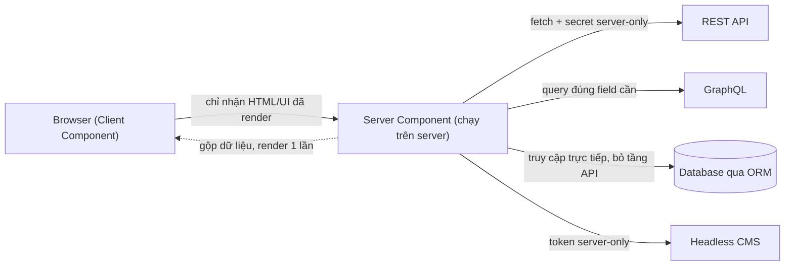

# Data Sources: REST, GraphQL, Database, ORM

**Data source** (nguồn dữ liệu) là nơi ứng dụng lấy dữ liệu để hiển thị. Bài này giới thiệu các nguồn phổ biến: **REST API** (giao tiếp qua các endpoint URL theo chuẩn HTTP), **GraphQL** (ngôn ngữ truy vấn cho phép lấy đúng dữ liệu cần), **database** (cơ sở dữ liệu — kết nối trực tiếp) và **ORM** (object-relational mapping — thư viện ánh xạ bảng dữ liệu thành đối tượng code, ví dụ Prisma, Drizzle). Người mới sẽ nắm được khi nào nên dùng nguồn nào trong Next.js.

[](pathname:///img/nextjs/data-sources.webp)

---

:::note[Ghi nhớ nhanh]

- ⭐ **Server Component là "cửa ngõ" truy cập trực tiếp mọi nguồn** — REST, GraphQL, DB, CMS với secret server-only, gộp dữ liệu rồi chỉ gửi UI đã render xuống client.
- ⭐ **Gọi DB trực tiếp không cần API trung gian** — dùng `sql` hoặc ORM ngay trong Server Component; DB credential không có prefix `NEXT_PUBLIC_*` nên không lộ xuống client.
- **REST** — bọc `fetch` trong helper `api<T>()` để tập trung header/auth/xử lý lỗi; **GraphQL** dùng Apollo, urql hoặc graphql-request.
- **Prisma vs Drizzle** — Prisma schema-first DX tốt nhưng bundle lớn cần Accelerate cho Edge; Drizzle SQL-like, nhỏ gọn, native Edge, type inferred — trend tăng cho 2026.
- **Driver Edge-compat dùng HTTP/fetch** (Neon, PlanetScale, Turso) chạy được trong middleware; driver Node (`pg`) chỉ dùng ở Node runtime.
- **Pattern repository** — tách truy vấn DB ra `lib/repositories/*` để component không biết về DB, dễ test và dễ đổi ORM.

:::

---

## Mục lục

- [Vì sao Next hỗ trợ nhiều nguồn dữ liệu?](#vì-sao-next-hỗ-trợ-nhiều-nguồn-dữ-liệu)
- [REST API](#rest-api)
- [GraphQL](#graphql)
- [Database trực tiếp](#database-trực-tiếp)
- [ORM: Prisma, Drizzle](#orm-prisma-drizzle)
- [Lựa chọn theo project](#lựa-chọn-theo-project)
- [Câu hỏi phỏng vấn](#câu-hỏi-phỏng-vấn)

---

## Vì sao Next hỗ trợ nhiều nguồn dữ liệu?

App thực tế hiếm khi chỉ lấy dữ liệu từ một chỗ: vừa gọi **REST/GraphQL API**, vừa đọc **database** trực tiếp, lấy nội dung từ **headless CMS**, đôi khi đọc cả **file**.

**Vấn đề:**

```tsx
"use client";

// React thuần (client) — KHÔNG thể nối thẳng DB: lộ credential xuống browser
import { db } from "@/lib/db"; // SAI: DATABASE_URL không available client

// Nên buộc phải dựng thêm tầng API trung gian cho mọi nguồn → thêm việc
async function getUsers() {
  const res = await fetch("/api/users"); // phải tự viết /api/users
  return res.json();
}
```

**Giải pháp:**

```tsx
// Server Component chạy ở SERVER → truy cập trực tiếp nhiều nguồn an toàn,
// secret server-only không lộ xuống client, chọn nguồn theo nhu cầu.
import { prisma } from "@/lib/prisma";

export default async function Page() {
  // Gọi DB trực tiếp qua ORM (Prisma) — không cần API trung gian
  const users = await prisma.user.findMany();

  // Fetch REST/GraphQL với secret server-only
  const posts = await fetch("https://cms.example.com/posts", {
    headers: { Authorization: `Bearer ${process.env.CMS_TOKEN}` },
  }).then((r) => r.json());

  return <Dashboard users={users} posts={posts} />;
}
```

Sơ đồ dưới đây cho thấy Server Component đóng vai trò "cửa ngõ" chạy trên server, truy cập trực tiếp mọi nguồn dữ liệu với secret server-only, rồi chỉ gửi UI đã render xuống trình duyệt:



:::tip[Dùng thực tế]

- **Query DB trực tiếp**: trang dashboard đọc bảng `users` qua Prisma/Drizzle ngay trong Server Component, bỏ tầng API.
- **Fetch CMS cho nội dung**: trang blog lấy bài viết từ headless CMS bằng token server-only.
- **Gọi GraphQL**: trang sản phẩm query đúng field cần qua Apollo/graphql-request.
- **Kết hợp nhiều nguồn trong một trang**: DB cho dữ liệu user + REST cho tỷ giá + CMS cho banner, gộp lại render một lần.

:::

---

## REST API

Cách phổ biến nhất — fetch từ external API:

```tsx
async function getUsers() {
  const res = await fetch("https://api.example.com/users", {
    headers: { Authorization: `Bearer ${process.env.API_KEY}` },
    next: { revalidate: 60 },
  });

  if (!res.ok) throw new Error(`HTTP ${res.status}`);
  return res.json();
}

export default async function UsersPage() {
  const users = await getUsers();
  return <UserList users={users} />;
}
```

**Pattern wrapper**:

```ts
// lib/api.ts
export async function api<T>(path: string, init?: RequestInit): Promise<T> {
  const res = await fetch(`${process.env.API_URL}${path}`, {
    ...init,
    headers: {
      "Content-Type": "application/json",
      Authorization: `Bearer ${process.env.API_KEY}`,
      ...init?.headers,
    },
  });

  if (!res.ok) {
    const err = await res.text();
    throw new Error(`API ${res.status}: ${err}`);
  }

  return res.json();
}
```

```ts
// Dùng
const users = await api<User[]>("/users");
const user = await api<User>(`/users/${id}`);
```

---

## GraphQL

**Apollo Client** (lib phổ biến):

```bash
npm install @apollo/client graphql
```

```tsx
// app/users/page.tsx
import { getApolloClient } from "@/lib/apollo";
import { gql } from "@apollo/client";

const USERS_QUERY = gql`
  query GetUsers {
    users { id name email }
  }
`;

export default async function UsersPage() {
  const { data } = await getApolloClient().query({ query: USERS_QUERY });
  return <UserList users={data.users} />;
}
```

**urql** — alternative nhẹ hơn.

**graphql-request** — minimal client:

```bash
npm install graphql-request
```

```ts
import { GraphQLClient, gql } from "graphql-request";

const client = new GraphQLClient(process.env.GRAPHQL_URL!, {
  headers: { Authorization: `Bearer ${token}` },
});

const data = await client.request(gql`{ users { id name } }`);
```

---

## Database trực tiếp

Server Components có thể truy cập DB **không qua API**:

```tsx
import { sql } from "@vercel/postgres";

export default async function UsersPage() {
  const { rows: users } = await sql`SELECT * FROM users`;
  return <UserList users={users} />;
}
```

**Vercel Postgres** (Neon-backed) — HTTP-based, work Edge Runtime.

Tương tự **Turso (LibSQL)**, **PlanetScale** — DB serverless HTTP-based.

:::info[Phân tích]

**Database driver trên Edge vs Node**:

| Database | Driver Edge-compat | Driver Node only |
|----------|-------------------|------------------|
| Postgres | `@vercel/postgres`, `@neondatabase/serverless` | `pg` (node-postgres) |
| MySQL | `@planetscale/database`, `mysql2` (Node 18+) | `mysql2` |
| SQLite | `@libsql/client` (Turso) | `better-sqlite3` |
| MongoDB | `@vercel/edge-config` | `mongodb` |

**Edge compat** — driver dùng HTTP/fetch thay TCP. Lợi:

- Chạy trong middleware.
- Cold start nhanh.
- Deploy lên Edge Runtime.

Trade-off:

- HTTP overhead per query.
- Không support transaction phức tạp như TCP driver.

Pattern thực dụng:

- **Page** (Node runtime): dùng ORM thường (Prisma, Drizzle với pg).
- **Middleware/Edge route**: dùng HTTP-based driver.

:::

---

## ORM: Prisma, Drizzle

### Prisma

[Prisma](https://www.prisma.io) — ORM phổ biến, schema-first.

```bash
npm install prisma @prisma/client
npx prisma init
```

**Schema**:

```prisma
// prisma/schema.prisma
model User {
  id    Int    @id @default(autoincrement())
  email String @unique
  name  String?
  posts Post[]
}

model Post {
  id       Int     @id @default(autoincrement())
  title    String
  authorId Int
  author   User    @relation(fields: [authorId], references: [id])
}
```

**Generate client + migrate**:

```bash
npx prisma generate
npx prisma migrate dev --name init
```

**Dùng**:

```tsx
import { prisma } from "@/lib/prisma";

export default async function UsersPage() {
  const users = await prisma.user.findMany({
    include: { posts: true },
  });
  return <UserList users={users} />;
}
```

```ts
// lib/prisma.ts — singleton
import { PrismaClient } from "@prisma/client";

const globalForPrisma = globalThis as { prisma?: PrismaClient };
export const prisma = globalForPrisma.prisma ?? new PrismaClient();
if (process.env.NODE_ENV !== "production") globalForPrisma.prisma = prisma;
```

### Drizzle

[Drizzle ORM](https://orm.drizzle.team) — SQL-like, type-safe, lightweight.

```bash
npm install drizzle-orm pg
npm install -D drizzle-kit
```

**Schema**:

```ts
// db/schema.ts
import { pgTable, serial, text, integer } from "drizzle-orm/pg-core";

export const users = pgTable("users", {
  id: serial("id").primaryKey(),
  email: text("email").unique().notNull(),
  name: text("name"),
});

export const posts = pgTable("posts", {
  id: serial("id").primaryKey(),
  title: text("title").notNull(),
  authorId: integer("author_id").references(() => users.id),
});
```

**Query**:

```ts
import { db } from "@/lib/db";
import { users, posts } from "@/db/schema";
import { eq } from "drizzle-orm";

const allUsers = await db.select().from(users);

const user = await db.query.users.findFirst({
  where: eq(users.id, 1),
  with: { posts: true },
});
```

:::info[Phân tích]

**Prisma vs Drizzle:**

| | Prisma | Drizzle |
|--|--------|---------|
| Schema | `.prisma` DSL | TypeScript |
| Migration | Tự động sinh | Tự viết hoặc generate |
| Type safety | **Generated** | **Inferred** từ schema |
| Bundle size | Lớn (~5MB) | **Nhỏ** (~50KB) |
| Edge support | Cần Prisma Accelerate | **Native** |
| Maturity | Cao | Mới hơn (2022) |
| Learning curve | Trung bình | Thấp (giống SQL) |

**Drizzle thắng cho 2026** trong nhiều project mới:

- Edge-compat tốt hơn.
- Bundle gọn.
- SQL-like → ai biết SQL viết được.
- TypeScript inferred — không cần codegen.

**Prisma vẫn mạnh** cho:

- DX (devtools, studio).
- Team không biết SQL.
- Migration tự động.

Cả hai đều **production-ready**. Trend: Drizzle tăng nhanh.

:::

---

## Lựa chọn theo project

```
Project mới TypeScript-first?
├─ Có backend riêng (Java/Go/Python) → REST/GraphQL fetch
├─ Full-stack TS → tRPC (type-safe API)
└─ Edge + serverless DB → Drizzle + Neon/Turso

Existing project?
├─ Đã có Prisma → giữ, không migrate
├─ Đã có GraphQL → urql / Apollo
└─ Direct SQL → kysely hoặc raw query

Cần realtime?
├─ Supabase (Postgres + realtime)
└─ Firebase Firestore
```

:::tip[Mẹo]

**Pattern repository cho code dễ test**:

```ts
// lib/repositories/user.ts
import { db } from "@/lib/db";
import { users } from "@/db/schema";

export async function findUser(id: number) {
  return db.query.users.findFirst({ where: eq(users.id, id) });
}

export async function createUser(data: NewUser) {
  return db.insert(users).values(data).returning();
}
```

```ts
// app/users/page.tsx
import { findUser } from "@/lib/repositories/user";

export default async function Page({ params }) {
  const user = await findUser(parseInt((await params).id));
}
```

Lợi ích:

- Component không biết về DB.
- Test với mock repository dễ.
- Migrate ORM sau ít touch component.
- Cache, validation tập trung trong repository.

:::

:::warning[Cần lưu ý]

**Đừng expose DB credentials trong client**:

```tsx
"use client";

// SAI — process.env.DATABASE_URL không bao giờ available client
import { db } from "@/lib/db";
const users = await db.select().from(usersTable);
```

ENV variable không có `NEXT_PUBLIC_*` prefix chỉ **available server-side**.
DB client chỉ chạy Server Component / Server Action / Route Handler.

Compile time Next.js warning, runtime error. Pattern đúng:

- **Server**: query trực tiếp DB.
- **Client**: fetch qua API route hoặc Server Action.

:::


---

## Câu hỏi phỏng vấn

Những câu thường gặp về chủ đề này. Tự trả lời trước, rồi bấm **Xem đáp án** để đối chiếu.

**1. Trong App Router, vì sao `Server Component` truy cập thẳng database được còn `Client Component` thì không? Giải thích cơ chế đằng sau, không chỉ nêu kết luận.**

<details className="qa">
<summary>Xem đáp án</summary>

Khác biệt nằm ở **nơi code được thực thi và nơi code được đóng gói**.

Server Component chỉ chạy trong tiến trình Node/Edge trên server. Code của nó không bao giờ nằm trong bundle gửi xuống trình duyệt — Next chỉ serialize **kết quả render** thành RSC payload. Nhờ vậy nó đọc được `process.env.DATABASE_URL`, mở được kết nối, dùng được các module Node như `fs` hay `net`.

Client Component có `"use client"` thì ngược lại: toàn bộ module cùng mọi thứ nó import đều bị đóng gói và tải về trình duyệt. Ở đó không tồn tại biến môi trường server, không có TCP socket, và nếu credential có mặt trong bundle thì bất kỳ ai mở DevTools cũng đọc được.

```tsx
"use client";
import { db } from "@/lib/db"; // SAI: kéo cả driver DB vào bundle client
```

Vì thế Client Component muốn có dữ liệu phải đi qua route handler hoặc Server Action — tức là vẫn có một đoạn chạy trên server đứng ra làm trung gian.

</details>

**2. Biến môi trường nào lộ xuống trình duyệt và biến nào không? Điều gì thực sự xảy ra ở bước build với tiền tố `NEXT_PUBLIC_`?**

<details className="qa">
<summary>Xem đáp án</summary>

Quy tắc đơn giản: biến có tiền tố `NEXT_PUBLIC_` là **công khai**, mọi biến khác chỉ tồn tại phía server.

Ở bước build, Next quét mã nguồn và **thay thế tĩnh** mọi tham chiếu `process.env.NEXT_PUBLIC_XXX` bằng chính giá trị chuỗi, rồi nhúng thẳng vào bundle JavaScript. Hai hệ quả quan trọng:

- Giá trị đó nằm trong file JS người dùng tải về — không có gì bí mật, ai cũng đọc được.
- Vì là thay thế lúc build, đổi giá trị sau khi build sẽ không có tác dụng: phải build lại. Cũng vì vậy không truy cập được theo kiểu động như `process.env["NEXT_PUBLIC_" + key]`.

Biến không có tiền tố (`DATABASE_URL`, `API_KEY`, `CMS_TOKEN`) chỉ đọc được trong Server Component, Server Action, route handler và middleware; ở client chúng trả về `undefined`.

Nguyên tắc thực hành: chỉ đặt `NEXT_PUBLIC_` cho thứ vô hại như URL công khai hay khoá publishable, và dùng `import "server-only"` cho module chứa secret để build báo lỗi nếu bị import nhầm sang client.

</details>

**3. So sánh `REST` và `GraphQL` cho một trang chi tiết sản phẩm: over-fetching và under-fetching thể hiện ra sao, và GraphQL đánh đổi lại điều gì?**

<details className="qa">
<summary>Xem đáp án</summary>

Trang chi tiết sản phẩm cần: thông tin sản phẩm, vài đánh giá mới nhất, thông tin người bán.

- **REST** — gọi `/products/:id` thường trả về **thừa** trường (mô tả dài, metadata, lịch sử giá) dù giao diện chỉ dùng vài trường: đó là over-fetching. Đồng thời vẫn **thiếu** đánh giá và người bán nên phải gọi thêm `/products/:id/reviews` và `/sellers/:id`: đó là under-fetching, kéo theo nhiều round-trip và dễ sinh waterfall.
- **GraphQL** — một truy vấn khai báo đúng các trường cần, server trả về đúng chừng đó trong một lần gọi.

| | REST | GraphQL |
|---|---|---|
| Số lời gọi cho trang này | Nhiều endpoint | Một truy vấn |
| Lượng dữ liệu | Thừa hoặc thiếu | Đúng nhu cầu |
| Caching HTTP | Đơn giản, theo URL | Khó, thường POST một endpoint |

Đánh đổi của GraphQL: hạ tầng phức tạp hơn (schema, resolver, client như Apollo hay graphql-request), cache HTTP/CDN khó tận dụng, dễ dính N+1 ở tầng resolver, và cần giới hạn độ sâu truy vấn để tránh bị lạm dụng.

</details>

**4. Khi nào bạn vẫn dựng một tầng API riêng thay vì query database trực tiếp trong `Server Component`? Cho ít nhất ba tình huống cụ thể.**

<details className="qa">
<summary>Xem đáp án</summary>

- **Client cần gọi dữ liệu** — bộ lọc tương tác, infinite scroll, polling: phải có endpoint thật cho trình duyệt gọi.
- **Có nhiều consumer** — ứng dụng di động, đối tác, hoặc một dịch vụ khác cùng dùng chung dữ liệu. Nhúng truy vấn vào từng Server Component sẽ khiến logic bị nhân bản.
- **Webhook và callback từ bên ngoài** — Stripe, GitHub gọi vào thì bắt buộc là endpoint HTTP.
- **Backend đã tồn tại** — công ty có sẵn service Java/Go/Python và database do team khác sở hữu; Next chỉ nên gọi qua API, không được nối thẳng vào DB người khác.
- **Cần lớp hạ tầng chung** — rate limit, xác thực token bên thứ ba, audit log, kiểm soát schema trả về.
- **Trả về thứ không phải HTML** — file, PDF, ảnh động, stream.

Ngược lại, với dữ liệu chỉ phục vụ chính trang đang render và chỉ app này dùng, gọi thẳng DB trong Server Component là gọn và nhanh hơn — thêm một chặng HTTP nội bộ chỉ cộng thêm độ trễ. Còn thao tác ghi từ form thì Server Action thường thay thế được route handler.

</details>

**5. Vì sao nên bọc `fetch` trong một helper chung kiểu `api<T>()` thay vì gọi `fetch` rải rác? Helper đó nên gánh những trách nhiệm gì?**

<details className="qa">
<summary>Xem đáp án</summary>

Gọi `fetch` rải rác khiến base URL, header xác thực và cách xử lý lỗi bị lặp lại ở hàng chục chỗ — sửa một quy ước là phải sửa khắp nơi, và chỉ cần quên kiểm tra `res.ok` một lần là có bug khó tìm.

```ts
export async function api<T>(path: string, init?: RequestInit): Promise<T> {
  const res = await fetch(`${process.env.API_URL}${path}`, {
    ...init,
    headers: {
      "Content-Type": "application/json",
      Authorization: `Bearer ${process.env.API_KEY}`,
      ...init?.headers,
    },
  });
  if (!res.ok) throw new Error(`API ${res.status}: ${await res.text()}`);
  return res.json();
}
```

Trách nhiệm nên gom vào helper: ghép base URL, gắn header và xác thực, kiểm tra `res.ok` và ném lỗi có thông tin, parse JSON, gắn kiểu trả về qua generic, đặt mặc định cho `cache`/`next.revalidate`, thêm timeout qua `AbortSignal`, retry cho lỗi tạm thời, và log/trace tập trung.

Lợi ích kèm theo: nơi gọi chỉ còn `api<User[]>("/users")` — ngắn, có kiểu, và dễ thay đổi hành vi toàn hệ thống ở một chỗ.

</details>

**6. `fetch` không throw khi server trả về `404` hay `500`. Điều đó ảnh hưởng thế nào tới cách bạn xử lý lỗi, và bạn kiểm tra bằng gì?**

<details className="qa">
<summary>Xem đáp án</summary>

`fetch` chỉ reject khi request **không thực hiện được** (mất mạng, DNS hỏng, CORS chặn, bị abort). Một phản hồi `404` hay `500` vẫn là "thành công" về mặt mạng, nên Promise resolve bình thường.

```ts
const res = await fetch(url);
// res.ok là false khi status ngoài khoảng 200–299
if (!res.ok) throw new Error(`HTTP ${res.status}`);
return res.json();
```

Nếu quên kiểm tra `res.ok`, `res.json()` sẽ cố parse body lỗi — hoặc ném `SyntaxError` khó hiểu, hoặc tệ hơn là trả về object lỗi rồi được dùng như dữ liệu thật, khiến giao diện hiển thị sai mà không ai biết.

Cách làm đúng: luôn kiểm `res.ok` (hoặc `res.status`) ngay sau khi fetch, tốt nhất là gom vào helper `api()` chung. Trong Next, phân biệt tiếp hai loại: `404` nghĩa là dữ liệu không tồn tại nên gọi `notFound()` để rơi vào `not-found.tsx`; `5xx` thì ném lỗi cho `error.tsx` xử lý. Nhớ bọc `try/catch` để bắt cả lỗi mạng thật sự.

</details>

**7. So sánh `Prisma` và `Drizzle` trên các trục: bundle size, cold start, migration, type safety. Bạn chọn cái nào cho một project mới deploy serverless và vì sao?**

<details className="qa">
<summary>Xem đáp án</summary>

| | Prisma | Drizzle |
|---|---|---|
| Schema | DSL riêng trong file `.prisma` | TypeScript thuần |
| Bundle size | Lớn (cỡ vài MB, kèm engine) | Nhỏ (cỡ vài chục KB) |
| Cold start | Chậm hơn do phải nạp engine | Nhanh, thuần JS |
| Migration | Sinh tự động, công cụ đầy đủ (`migrate`, Studio) | Generate bằng drizzle-kit, kiểm soát thủ công nhiều hơn |
| Type safety | Generated — phải chạy `prisma generate` | Inferred trực tiếp từ schema TS, không cần codegen |
| Edge | Cần Prisma Accelerate hoặc driver adapter | Native với driver HTTP |
| Độ chín | Cao, hệ sinh thái lớn | Mới hơn nhưng đã production-ready |

Cho project mới deploy serverless/Edge, **Drizzle** thường là lựa chọn hợp hơn: bundle gọn và cold start nhanh là hai thứ ảnh hưởng trực tiếp tới trải nghiệm ở môi trường đó, cú pháp SQL-like giúp ai biết SQL viết được ngay, và không có bước codegen trong quy trình build. Prisma vẫn rất đáng chọn khi team ưu tiên DX, muốn migration tự động và công cụ trực quan, hoặc dự án đã dùng sẵn thì không nên chuyển đổi chỉ vì trào lưu.

</details>

**8. Vì sao `PrismaClient` phải khởi tạo theo pattern singleton gắn vào `globalThis` ở môi trường dev? Không làm vậy thì hỏng ở đâu?**

<details className="qa">
<summary>Xem đáp án</summary>

Ở chế độ dev, Next hot-reload bằng cách nạp lại module mỗi khi file đổi. Nếu `new PrismaClient()` nằm ở cấp module, mỗi lần reload lại tạo thêm một client mới, mà client cũ vẫn giữ connection pool của nó. Sau vài chục lần sửa code, số kết nối tới database vượt giới hạn và xuất hiện lỗi kiểu "too many connections", kèm cảnh báo của Prisma về việc có quá nhiều instance.

```ts
const globalForPrisma = globalThis as { prisma?: PrismaClient };
export const prisma = globalForPrisma.prisma ?? new PrismaClient();
if (process.env.NODE_ENV !== "production") globalForPrisma.prisma = prisma;
```

`globalThis` không bị xoá khi module được nạp lại, nên client được tái sử dụng qua các lần hot-reload.

Chỉ gán vào global ở môi trường không phải production vì trên production module chỉ nạp một lần, không cần và cũng không nên giữ trạng thái toàn cục. Lưu ý singleton này giải quyết bài toán **hot-reload**, còn bài toán bùng kết nối do nhiều instance serverless thì phải xử lý bằng pooler ở tầng hạ tầng.

</details>

**9. Connection pooling vỡ như thế nào khi chạy Postgres với serverless functions? Nêu các cách xử lý (pooler, HTTP driver, `Prisma Accelerate`).**

<details className="qa">
<summary>Xem đáp án</summary>

Pool kết nối được thiết kế cho một server chạy lâu dài, nắm giữ một số kết nối cố định và tái sử dụng. Serverless thì ngược lại: mỗi function instance là một tiến trình riêng, tự mở pool của mình, sống ngắn và có thể được nhân bản lên hàng trăm bản khi lưu lượng tăng. Kết quả là số kết nối bằng số instance nhân với kích thước pool — Postgres có giới hạn kết nối hữu hạn nên nhanh chóng bị từ chối, trong khi mỗi kết nối TCP mới còn tốn thời gian bắt tay ở mỗi cold start.

Các cách xử lý:

- **Connection pooler ngoài** — PgBouncer, Supabase pooler, Neon pooler đứng giữa, gom hàng nghìn kết nối ứng dụng thành vài kết nối thật tới DB. Nhớ dùng chế độ phù hợp và tắt prepared statement nếu pooler ở transaction mode.
- **Driver dựa trên HTTP/fetch** — `@neondatabase/serverless`, `@planetscale/database`, `@libsql/client`: không giữ kết nối TCP nên hợp serverless và chạy được cả trên Edge.
- **Prisma Accelerate** — lớp proxy có pooling và cache toàn cầu, đồng thời giúp Prisma chạy được ở Edge.

Kèm theo: giảm kích thước pool mỗi instance và cho truy vấn có timeout.

</details>

**10. Driver nào chạy được trên Edge Runtime và vì sao? Trade-off của driver dựa trên HTTP so với driver TCP là gì, đặc biệt với transaction?**

<details className="qa">
<summary>Xem đáp án</summary>

Edge Runtime không phải Node: không có module `net`, nên mọi driver mở TCP socket đều không chạy được. Chỉ driver giao tiếp qua **HTTP/fetch** mới hoạt động.

| Database | Driver Edge-compat | Driver Node only |
|---|---|---|
| Postgres | `@vercel/postgres`, `@neondatabase/serverless` | `pg` |
| MySQL | `@planetscale/database` | `mysql2` |
| SQLite | `@libsql/client` (Turso) | `better-sqlite3` |

Trade-off của HTTP driver: cold start nhanh, không giữ kết nối, chạy được trong middleware và Edge route; đổi lại mỗi truy vấn cộng thêm overhead của một request HTTP, và **transaction bị hạn chế** — vì không có phiên kết nối liên tục nên khó giữ `BEGIN ... COMMIT` qua nhiều lời gọi; các nhà cung cấp thường chỉ hỗ trợ transaction dạng gửi cả lô câu lệnh trong một request. Driver TCP ngược lại: transaction đầy đủ, prepared statement, độ trễ thấp khi kết nối đã ấm, nhưng cần môi trường Node và pooler.

Pattern thực dụng: page và route handler chạy Node runtime thì dùng ORM với driver TCP; riêng middleware hoặc Edge route thì dùng driver HTTP.

</details>

**11. Vấn đề `N+1 query` xuất hiện thế nào khi mỗi component con tự query dữ liệu của mình? Bạn phát hiện và xử lý ra sao?**

<details className="qa">
<summary>Xem đáp án</summary>

Trang lấy danh sách 50 bài viết bằng một truy vấn, rồi render 50 component con, mỗi con tự query tác giả của mình — tổng cộng 1 + 50 = 51 truy vấn. Mô hình "mỗi component tự lấy dữ liệu nó cần" của RSC rất dễ dẫn tới tình huống này vì mỗi component nhìn riêng lẻ đều hợp lý.

Phát hiện: bật log truy vấn của ORM và đếm số câu lệnh cho một lần render, xem trace/APM thấy một chuỗi dài các truy vấn gần giống nhau, hoặc đơn giản là thời gian trang tăng tuyến tính theo số phần tử trong danh sách.

Xử lý:

- **Lấy kèm quan hệ trong một truy vấn** — `include: { posts: true }` của Prisma, `with: { posts: true }` của Drizzle, hoặc `JOIN` trực tiếp.
- **Gom theo lô** — truy vấn một lần với `where id IN (...)` rồi phân phát xuống các component.
- **Memoize trong một request** — bọc hàm truy vấn bằng `cache()` của React để các lời gọi trùng tham số chỉ chạy một lần.
- **Tập trung truy vấn vào repository** để dễ kiểm soát và tối ưu một chỗ.

</details>

**12. Pattern repository (tách truy vấn ra `lib/repositories/*`) mang lại lợi ích gì? Đánh đổi nào khiến bạn có thể bỏ qua nó ở project nhỏ?**

<details className="qa">
<summary>Xem đáp án</summary>

```ts
// lib/repositories/user.ts
export async function findUser(id: number) {
  return db.query.users.findFirst({ where: eq(users.id, id) });
}

// app/users/page.tsx
const user = await findUser(id);
```

Lợi ích: component không biết gì về ORM nên dễ đổi Prisma sang Drizzle mà không đụng UI; test dễ vì chỉ cần mock vài hàm repository; caching, phân quyền và validation gom về một chỗ thay vì rải khắp các trang; và tên hàm mô tả **ý định nghiệp vụ** (`findActiveSubscribers`) thay vì chi tiết truy vấn.

Đánh đổi: thêm một tầng gián tiếp, nhiều file nhỏ, đôi khi phải viết một hàm chỉ để bọc đúng một dòng truy vấn; và nếu lạm dụng sẽ đẻ ra hàng loạt hàm dùng một lần. Ở project nhỏ hoặc giai đoạn prototype, gọi thẳng ORM trong Server Component nhanh hơn và vẫn đọc được.

Ranh giới hợp lý: bắt đầu gọi trực tiếp, và tách sang repository khi một truy vấn bị lặp ở nhiều nơi, khi cần gắn kiểm tra quyền, hoặc khi muốn viết test cho logic dữ liệu.

</details>

**13. Khi nào bạn chọn `tRPC` thay vì `REST`, `GraphQL` hay `Server Action`? Điều kiện tiên quyết để `tRPC` phát huy giá trị là gì?**

<details className="qa">
<summary>Xem đáp án</summary>

Điều kiện tiên quyết: **client và server cùng là TypeScript và nằm chung một monorepo** (hoặc chia sẻ được type qua package). Giá trị của tRPC đến từ việc client suy ra kiểu trực tiếp từ định nghĩa router phía server — không schema, không codegen, đổi tên một trường là chỗ gọi báo lỗi ngay. Nếu backend viết bằng ngôn ngữ khác thì tRPC vô nghĩa.

Khi nào chọn cái gì:

- **tRPC** — app full-stack TypeScript, nhiều thao tác gọi từ Client Component, muốn an toàn kiểu end-to-end mà không muốn dựng GraphQL.
- **REST** — cần phục vụ nhiều loại consumer, đối tác bên ngoài, ứng dụng di động, hoặc muốn tận dụng cache HTTP theo URL.
- **GraphQL** — nhiều client với nhu cầu dữ liệu rất khác nhau, đồ thị quan hệ phức tạp, hoặc tổ chức đã có sẵn hạ tầng GraphQL.
- **Server Action** — thao tác ghi xuất phát từ form trong chính app; gọn nhất, không cần định nghĩa endpoint, tích hợp sẵn revalidate.

Thực tế trong App Router, phần đọc thường do Server Component đảm nhiệm, nên tRPC hữu ích nhất ở các phần tương tác phía client.

</details>

**14. Một trang cần gộp dữ liệu từ database, một REST API bên thứ ba và một headless CMS. Bạn tổ chức việc lấy dữ liệu, xử lý lỗi từng phần và caching như thế nào?**

<details className="qa">
<summary>Xem đáp án</summary>

Tổ chức theo ba nguyên tắc: gọi song song, tách theo mức độ quan trọng, và đặt chính sách cache riêng cho từng nguồn.

```tsx
const [user, banners] = await Promise.all([
  findUser(id),                 // DB — bắt buộc
  getBanners(),                 // CMS — revalidate dài
]);
const [rate] = await Promise.allSettled([getExchangeRate()]); // bên thứ ba, có thể thiếu
```

- **Song song** — dùng `Promise.all` cho dữ liệu cốt lõi (thiếu thì trang vô nghĩa, để lỗi rơi vào `error.tsx`), `Promise.allSettled` cho dữ liệu phụ như tỷ giá hay banner để một dịch vụ chết không làm sập cả trang. Luôn đặt timeout cho API bên thứ ba.
- **Streaming** — nguồn chậm tách vào component riêng bọc `<Suspense>` với skeleton, để phần nhanh hiển thị trước.
- **Caching theo nguồn** — CMS ít đổi thì `next: { revalidate: 3600 }` kèm `tags` để webhook của CMS gọi `revalidateTag` khi có bài mới; tỷ giá đặt `revalidate` ngắn; dữ liệu DB theo người dùng thì không cache, và bọc truy vấn bằng `cache()` để dedupe trong một request.
- **Đóng gói** — mỗi nguồn một module riêng (repository cho DB, helper `api()` cho REST, client riêng cho CMS) để lỗi và cache xử lý tập trung.

</details>
